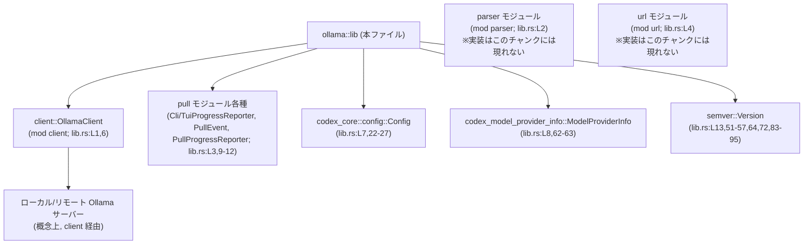
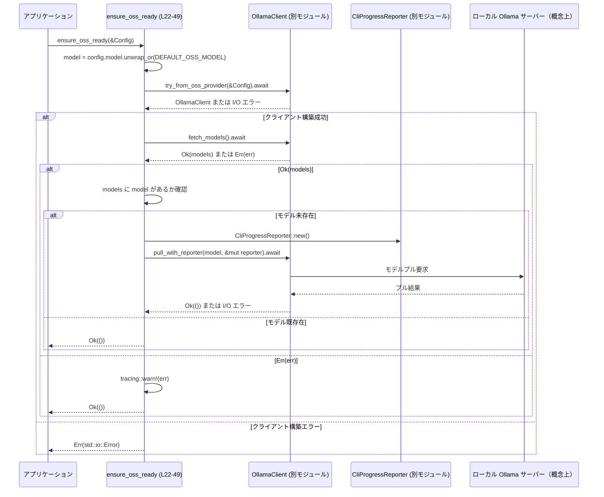
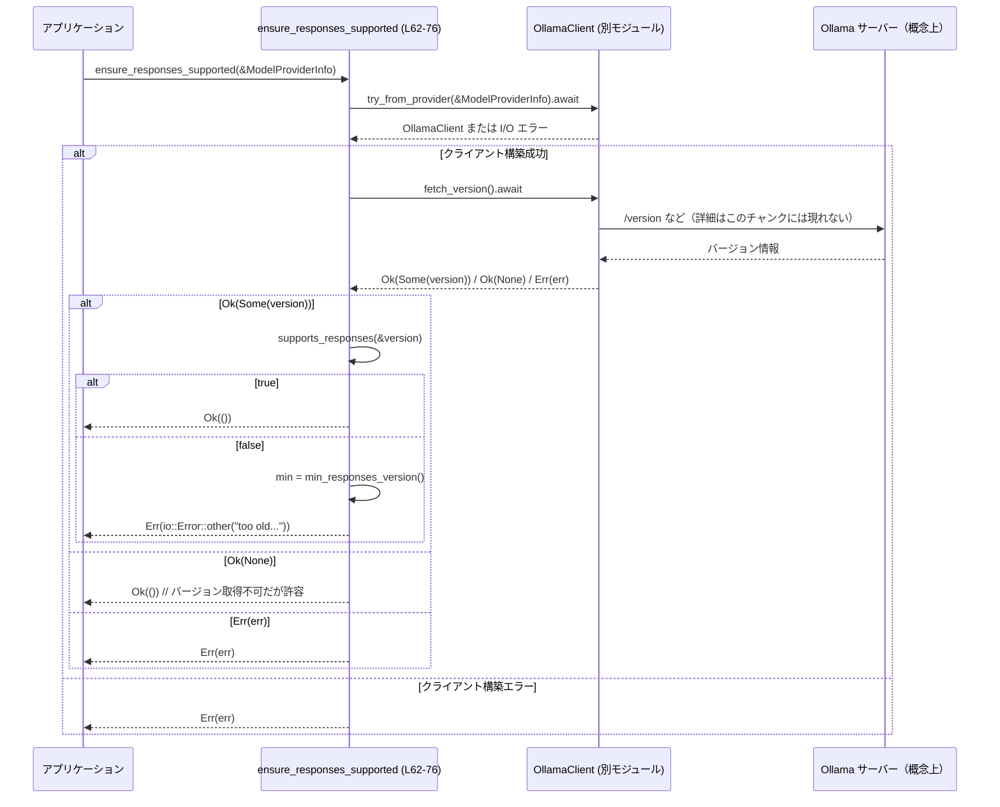

# ollama/src/lib.rs コード解説

## 0. ざっくり一言

ローカルまたは指定された Ollama サーバーに対して、

- OSS モデルの事前ダウンロード準備
- Responses API が利用可能かどうかのバージョンチェック

を行う非同期ヘルパー関数と、`OllamaClient` およびプル進捗レポータの再エクスポートを提供するモジュールです（根拠: `lib.rs:L1-13, L16, L22-49, L51-57, L62-76`）。

---

## 1. このモジュールの役割

### 1.1 概要

このモジュールは **Ollama サーバーを使った推論環境の前提条件を満たす** ために存在し、主に次の機能を提供します。

- `ensure_oss_ready` による、`--oss` フラグ使用時のローカル OSS モデル環境の準備（モデル存在確認と必要に応じたプル）（`lib.rs:L18-49`）
- `ensure_responses_supported` による、接続先 Ollama サーバーが Responses API をサポートする最小バージョンかどうかの検証（`lib.rs:L59-76`）
- `OllamaClient` とプル進捗レポータ型の再エクスポートにより、上位層から Ollama クライアント機能と進捗表示機能を利用可能にする（`lib.rs:L6, L9-12`）

### 1.2 アーキテクチャ内での位置づけ

このファイルは `ollama` クレートのルート（`lib.rs`）であり、内部モジュールや外部クレートと次のように依存関係を持ちます。

- 内部モジュール
  - `client` モジュールから `OllamaClient` を再エクスポートし、本ファイルの関数から利用しています（`lib.rs:L1, L6, L30, L63-64`）。
  - `pull` モジュールから進捗レポータとイベント型を再エクスポートしています（`lib.rs:L3, L9-12, L36-39`）。
  - `parser` / `url` モジュールは宣言されていますが、このチャンクでは使用箇所は現れません（`lib.rs:L2, L4`）。
- 外部クレート
  - `codex_core::config::Config` から設定値（モデル名など）を受け取ります（`lib.rs:L7, L22-27`）。
  - `codex_model_provider_info::ModelProviderInfo` からモデルプロバイダ情報を受け取ります（`lib.rs:L8, L62-63`）。
  - `semver::Version` で Ollama のバージョンを扱います（`lib.rs:L13, L51-57, L64, L72-75, L83-95`）。

依存関係を簡略に図示します。



`client` や `pull` の内部実装はこのチャンクには現れず、ここでは「クライアントを構築してメソッドを呼び出す側」としてのみ利用されています。

### 1.3 設計上のポイント

- **非同期処理中心**
  - 環境準備・バージョンチェックは `async fn` として定義されており、非同期ランタイム上での実行を前提としています（`lib.rs:L22, L62`）。
- **明示的な I/O エラーハンドリング**
  - パブリック関数の戻り値は `std::io::Result<()>` で、`?` 演算子により下位の I/O エラーを呼び出し元に伝播します（`lib.rs:L30, L39, L63-65, L73-75`）。
- **寛容な失敗処理**
  - モデル一覧取得に失敗した場合は `tracing::warn!` で警告ログを出しつつ、致命的エラーとはせずに処理継続します（`lib.rs:L33-45`）。
  - バージョン情報が取れない場合（エンドポイント欠如やパース失敗を示す `None`）は、エラーではなく成功扱いとして戻します（`lib.rs:L64-66`）。
- **バージョンチェックの切り出し**
  - 最小対応バージョンと対応判定ロジックをそれぞれ `min_responses_version` と `supports_responses` に分離し、テストしやすくしています（`lib.rs:L51-57, L78-96`）。
- **グローバルな可変状態なし**
  - 静的な可変変数やグローバルなキャッシュはこのファイルには存在せず、コンカレンシー上の共有可変状態は見られません。

---

## 2. 主要な機能一覧

- `DEFAULT_OSS_MODEL`: `--oss` 指定時に明示モデルがなければ使うデフォルト OSS モデル名（`lib.rs:L15-16`）。
- `ensure_oss_ready`: `--oss` 選択時にローカル Ollama が到達可能かを確認し、必要ならモデルをプルする非同期関数（`lib.rs:L18-49`）。
- `min_responses_version`: Responses API をサポートする Ollama の最小バージョン（`0.13.4`）を返すヘルパー関数（`lib.rs:L51-53`）。
- `supports_responses`: 与えられたバージョンが Responses API をサポートしているかどうかを判定する関数（`lib.rs:L55-57`）。
- `ensure_responses_supported`: 指定プロバイダ向けの Ollama が Responses API をサポートしているかをチェックし、古すぎる場合はエラーにする非同期関数（`lib.rs:L59-76`）。
- `OllamaClient` / `CliProgressReporter` / `TuiProgressReporter` / `PullProgressReporter` / `PullEvent`: クライアントとプル進捗関連の型を外部に公開するための再エクスポート（`lib.rs:L6, L9-12`。実装はこのチャンクには現れない）。

### 2.1 コンポーネントインベントリー（関数・型・モジュール）

| コンポーネント | 種別 | 公開性 | 役割 / 用途 | 定義 / 宣言位置 |
|----------------|------|--------|-------------|-----------------|
| `client` | モジュール宣言 | 非公開 | `OllamaClient` などクライアント関連の実装を含む（と推測されるが、実装はこのチャンクには現れない） | `lib.rs:L1` |
| `parser` | モジュール宣言 | 非公開 | パーサ関連の実装を含むと推測されるが、このチャンクには現れない | `lib.rs:L2` |
| `pull` | モジュール宣言 | 非公開 | モデルプル処理と進捗レポータの実装を含むと推測されるが、このチャンクには現れない | `lib.rs:L3` |
| `url` | モジュール宣言 | 非公開 | URL 構築・処理の実装を含むと推測されるが、このチャンクには現れない | `lib.rs:L4` |
| `OllamaClient` | 構造体（推測）再エクスポート | 公開 (`pub use`) | Ollama サーバーと通信するクライアント。`ensure_oss_ready` / `ensure_responses_supported` から利用される（実装はこのチャンクには現れない） | 再エクスポート: `lib.rs:L6` |
| `CliProgressReporter` | 型（実際の種別はこのチャンクには現れない）再エクスポート | 公開 | CLI 上でプル進捗を表示するレポータ。`ensure_oss_ready` 内でインスタンス化（`new`）される（`lib.rs:L36-39`）。実装はこのチャンクには現れない | 再エクスポート: `lib.rs:L9` |
| `PullEvent` | 型再エクスポート | 公開 | プル処理のイベントを表す型と推測されるが、このチャンクには現れない | `lib.rs:L10` |
| `PullProgressReporter` | 型再エクスポート | 公開 | プル進捗を報告するトレイト/構造体と推測されるが、このチャンクには現れない | `lib.rs:L11` |
| `TuiProgressReporter` | 型再エクスポート | 公開 | TUI 上でプル進捗を表示するレポータと推測されるが、このチャンクには現れない | `lib.rs:L12` |
| `DEFAULT_OSS_MODEL` | 定数 `&'static str` | 公開 | `--oss` でモデル未指定時に用いるデフォルト OSS モデル名 `"gpt-oss:20b"` | `lib.rs:L15-16` |
| `ensure_oss_ready` | 非同期関数 `async fn(&Config) -> io::Result<()>` | 公開 | ローカルの OSS 環境を整える（Ollama 接続確認 & モデル存在チェック & 必要ならプル） | `lib.rs:L18-49` |
| `min_responses_version` | 関数 `fn() -> Version` | 非公開 | Responses API 対応の最小バージョン `0.13.4` を返す | `lib.rs:L51-53` |
| `supports_responses` | 関数 `fn(&Version) -> bool` | 非公開（テストからは利用） | 指定バージョンが Responses API をサポートしているか（特別扱いの `0.0.0` または `>= 0.13.4`）を判定 | `lib.rs:L55-57` |
| `ensure_responses_supported` | 非同期関数 `async fn(&ModelProviderInfo) -> io::Result<()>` | 公開 | プロバイダ向け Ollama のバージョンが Responses API 対応かチェックし、古い場合はエラーにする | `lib.rs:L59-76` |
| `tests` | テストモジュール | 非公開（`#[cfg(test)]`） | `supports_responses` のバージョン判定ロジックを検証 | `lib.rs:L78-96` |
| `supports_responses_for_dev_zero` | テスト関数 | 非公開 | `0.0.0` がサポート対象と判定されることを検証 | `lib.rs:L82-85` |
| `does_not_support_responses_before_cutoff` | テスト関数 | 非公開 | `0.13.3` が非サポートと判定されることを検証 | `lib.rs:L87-90` |
| `supports_responses_at_or_after_cutoff` | テスト関数 | 非公開 | `0.13.4` および `0.14.0` がサポート対象と判定されることを検証 | `lib.rs:L92-95` |

---

## 3. 公開 API と詳細解説

### 3.1 型・定数一覧（公開分）

| 名前 | 種別 | 役割 / 用途 | 根拠 |
|------|------|-------------|------|
| `OllamaClient` | 再エクスポートされる型 | Ollama サーバーへのクライアント。環境準備, バージョン取得のために使用されます。実装はこのチャンクには現れません。 | 宣言: `lib.rs:L1, L6`、利用: `lib.rs:L30, L63-64` |
| `CliProgressReporter` | 再エクスポートされる型 | CLI 向けプル進捗レポータ。`ensure_oss_ready` でインスタンス化してプル処理に渡します。実装はこのチャンクには現れません。 | 再エクスポート: `lib.rs:L3, L9`、利用: `lib.rs:L36-39` |
| `PullEvent` | 再エクスポートされる型 | プル処理のイベント表現と推測されますが、このチャンクには定義がありません。 | `lib.rs:L10` |
| `PullProgressReporter` | 再エクスポートされる型 | プル進捗を報告するための抽象/型と推測されますが、このチャンクには定義がありません。 | `lib.rs:L11` |
| `TuiProgressReporter` | 再エクスポートされる型 | TUI 向け進捗レポータと推測されますが、このチャンクには定義がありません。 | `lib.rs:L12` |
| `DEFAULT_OSS_MODEL` | `&'static str` 定数 | デフォルト OSS モデル名 `"gpt-oss:20b"` を表す定数です。 | 定義: `lib.rs:L15-16`、利用: `lib.rs:L24-27` |

### 3.2 関数詳細

#### `ensure_oss_ready(config: &Config) -> std::io::Result<()>`

**概要**

`--oss` モードが選択されたときに、ローカルの OSS 環境を整える非同期関数です。  
ローカル Ollama サーバーに接続し、対象モデルがローカルに存在しなければプルを実行します（根拠: `lib.rs:L18-49`）。

**シグネチャと引数**

```rust
pub async fn ensure_oss_ready(config: &Config) -> std::io::Result<()> // lib.rs:L22
```

| 引数名 | 型 | 説明 |
|--------|----|------|
| `config` | `&Config` | モデル名などを含む設定。`config.model` から使用するモデル名を決定します（`lib.rs:L22-27`）。 |

**戻り値**

- `Ok(())`: 処理が正常に完了した場合。モデル一覧取得に失敗した場合でも、致命的エラーとみなさないパスでは `Ok(())` を返します（`lib.rs:L33-45, L48`）。
- `Err(std::io::Error)`: `OllamaClient` の構築やモデルプル処理などで I/O エラーが発生した場合に返されます（`lib.rs:L30, L39`）。

**内部処理の流れ（アルゴリズム）**

1. **使用モデル名の決定**（`lib.rs:L23-27`）
   - `config.model.as_ref()` を `match` し、`Some(model)` の場合はその値を使用し、`None` の場合は `DEFAULT_OSS_MODEL` を使用して `model` 変数を決定します。
2. **ローカル Ollama への接続確認**（`lib.rs:L29-31`）
   - `OllamaClient::try_from_oss_provider(config).await?` を呼び出し、ローカル OSS 用のクライアントを初期化します。
   - この時点で接続に失敗すると `Err` が返されます（`?` により伝播）。
3. **ローカルモデル一覧の取得**（`lib.rs:L32-35`）
   - `ollama_client.fetch_models().await` を実行し、結果を `match` します。
4. **モデルが存在しない場合のプル**（`lib.rs:L34-41`）
   - `Ok(models)` の場合:
     - `models.iter().any(|m| m == model)` で、目的の `model` が存在するかを確認。
     - 存在しない場合:
       - `CliProgressReporter::new()` で CLI 進捗レポータを作成（`lib.rs:L36`）。
       - `ollama_client.pull_with_reporter(model, &mut reporter).await?` を実行し、プル処理を行います。エラーがあれば `?` で伝播します（`lib.rs:L37-39`）。
5. **モデル一覧取得の失敗時は警告ログのみ**（`lib.rs:L42-45`）
   - `Err(err)` の場合:
     - `tracing::warn!` で警告ログを出力し、処理は継続します。
6. **成功終了**（`lib.rs:L48`）
   - 最終的に `Ok(())` を返します。

**Examples（使用例）**

典型的にはアプリケーション起動時に一度だけ呼び出し、以降の推論処理の前提を整える用途が想定されます。

```rust
use ollama::OllamaClient;
use ollama::ensure_oss_ready;
use codex_core::config::Config;

#[tokio::main] // 非同期ランタイム上で実行する例
async fn main() -> std::io::Result<()> {
    // 設定をロードする（具体的なロード方法はこのチャンクには現れない）
    let config = Config {
        // `model` フィールドなどを適切に設定する想定
        // model: Some("gpt-oss:20b".to_string()),
        ..Default::default() // 実際に Default 実装があるかどうかはこのチャンクからは不明
    };

    // OSS モデル環境が整っていることを確認する
    ensure_oss_ready(&config).await?;

    // 以降、OllamaClient を使った推論処理などに進む
    Ok(())
}
```

※ `Config` の具体的な構造や初期化方法はこのチャンクには現れないため、上記はあくまで利用イメージです。

**Errors / Panics**

- **エラーになる条件（確定情報）**
  - `OllamaClient::try_from_oss_provider(config).await` が `Err` を返した場合（接続や設定に起因する I/O エラーなど）。`?` によりそのまま伝播します（`lib.rs:L30`）。
  - `ollama_client.pull_with_reporter(...).await` が `Err` を返した場合（プル処理中の I/O エラーなど）。同様に伝播します（`lib.rs:L37-39`）。
- **エラーにならないが注意が必要な条件**
  - `fetch_models().await` が `Err` を返した場合、`tracing::warn!` でログ出力するだけでエラーとしては扱いません（`lib.rs:L42-45`）。  
    上位レイヤーは「モデル一覧取得に失敗したが処理は継続された」という状態をログから判断する必要があります。
- **panic について**
  - この関数内では `unwrap` や `expect`、`panic!` などは使用しておらず、明示的な panic 要因はありません（`lib.rs:L22-49`）。

**Edge cases（エッジケース）**

- `config.model` が `None` の場合（`lib.rs:L24-27`）
  - `DEFAULT_OSS_MODEL`（`"gpt-oss:20b"`）がモデル名として使用されます。
- `config.model` が `Some` で、モデル一覧に存在しない場合（`lib.rs:L24-27, L34-41`）
  - `CliProgressReporter` を用いてプル処理が実行されます。
- `fetch_models()` がサポートされていない／失敗する場合（`lib.rs:L42-45`）
  - 警告ログが出力されるのみで、エラーにはなりません。
- 同じモデルを複数回プルしようとする場合
  - この関数は「一覧に存在しない場合のみプルする」ため、`fetch_models()` が正しく返る限り、重複プルは避けられます（`lib.rs:L34-37`）。
- 非同期コンテキスト
  - `async fn` のため、`.await` せずに呼び出すとコンパイルエラーになります（Rust の言語仕様）。

**使用上の注意点**

- **呼び出しタイミング**
  - モデルプルは時間・帯域を消費する処理である可能性が高いため（`pull_with_reporter` という名前と目的からの推測）、アプリケーション起動時などにまとめて実行し、リクエストごとには呼び出さない構成が考えられます。
- **並行実行**
  - この関数自身には排他制御やグローバル状態はありません。複数タスクから同時に呼び出した場合の挙動は、`OllamaClient` およびサーバー側の実装に依存します（このチャンクには現れません）。
- **コメントと挙動の整合性**
  - 関数冒頭のコメントには「Only download when the requested model is the default OSS model (or when -m is not provided).」とありますが（`lib.rs:L22-23`）、実装は `config.model` が `Some` でも `DEFAULT_OSS_MODEL` 以外でも「存在しなければプルする」動きに見えます（`lib.rs:L24-27, L34-41`）。  
    ただし `Config` の具体的仕様がこのチャンクには現れないため、実際にどういう値が入るかは別ファイルの設計に依存します。仕様とコメントの整合性は、`Config` 定義側を含めて確認する必要があります。
- **ログの扱い**
  - モデル一覧取得失敗時は警告ログにのみ記録されるため、運用上ログを監視していないと問題に気づきにくい可能性があります（`lib.rs:L42-45`）。

---

#### `supports_responses(version: &Version) -> bool`

**概要**

Ollama のバージョンが Responses API をサポートしているかどうかを判定する関数です。  
特別ケースとして `0.0.0` を「サポートしている」とみなし、それ以外は `0.13.4` 以上をサポート対象とします（`lib.rs:L51-57`）。

**シグネチャ**

```rust
fn supports_responses(version: &Version) -> bool // lib.rs:L55
```

| 引数名 | 型 | 説明 |
|--------|----|------|
| `version` | `&Version` | チェック対象の Ollama バージョン（`semver::Version`） |

**戻り値**

- `true`: `version == 0.0.0` または `version >= 0.13.4` の場合（`lib.rs:L55-57`）。
- `false`: 上記以外のバージョン。

**内部処理の流れ**

1. `*version == Version::new(0, 0, 0)` をチェック（`lib.rs:L56`）。
2. 上記が `false` の場合、`*version >= min_responses_version()` をチェック（`lib.rs:L51-53, L56`）。
3. どちらかが `true` であれば `true` を返し、両方とも `false` であれば `false` を返します。

**Examples（使用例）**

```rust
use semver::Version;

// 開発版などを 0.0.0 として扱っている場合
assert!(supports_responses(&Version::new(0, 0, 0))); // lib.rs:L82-85

// 古いバージョン
assert!(!supports_responses(&Version::new(0, 13, 3))); // lib.rs:L87-90

// 対応バージョン
assert!(supports_responses(&Version::new(0, 13, 4))); // lib.rs:L92-95
assert!(supports_responses(&Version::new(0, 14, 0)));
```

**Errors / Panics**

- この関数は純粋な計算のみを行い、エラーや I/O は発生しません（`lib.rs:L55-57`）。
- `Version` の比較演算子は `semver` クレートにより定義されており、通常は panic を起こしません。

**Edge cases（エッジケース）**

- `0.0.0` は特別扱いで常に `true`（`lib.rs:L56`）。テストでも明示的に確認されています（`lib.rs:L82-85`）。
- `0.13.3` など、最小バージョンよりわずかに古いバージョンは `false` になります（`lib.rs:L55-57, L87-90`）。
- `0.13.4` 以上の任意のバージョンは `true` と判定されます（`lib.rs:L51-57, L92-95`）。

**使用上の注意点**

- 「サポートするかどうか」の定義が `min_responses_version()` に依存しているため、この閾値を変更する際は両方を合わせて更新する必要があります（`lib.rs:L51-53, L55-57`）。
- `0.0.0` を特別扱いする仕様は、開発版や「バージョン未設定」の意味として扱っている可能性がありますが、その意図はこのチャンクには明示されていません。運用側のバージョニングポリシーを確認する必要があります。

---

#### `ensure_responses_supported(provider: &ModelProviderInfo) -> std::io::Result<()>`

**概要**

指定された `ModelProviderInfo` に基づいて `OllamaClient` を構築し、接続先 Ollama サーバーが Responses API をサポートしているかどうかを検証する非同期関数です。  
バージョンが古すぎる場合は `std::io::Error` を返します（`lib.rs:L59-76`）。

**シグネチャと引数**

```rust
pub async fn ensure_responses_supported(
    provider: &ModelProviderInfo,
) -> std::io::Result<()> // lib.rs:L62
```

| 引数名 | 型 | 説明 |
|--------|----|------|
| `provider` | `&ModelProviderInfo` | 接続先 Ollama の情報（URL や種別など）を含むプロバイダ情報。詳細構造はこのチャンクには現れません（`lib.rs:L8, L62-63`）。 |

**戻り値**

- `Ok(())`:
  - バージョン情報が取得できず `None` だった場合（「エンドポイントが存在しない・パースできない」とドキュメントに記載）（`lib.rs:L61, L64-66`）。
  - バージョンが `supports_responses` の判定でサポート対象だった場合（`lib.rs:L68-70`）。
- `Err(std::io::Error)`:
  - クライアント構築・バージョン取得の I/O エラー。
  - バージョンが古く `supports_responses` が `false` を返した場合（`lib.rs:L72-75`）。

**内部処理の流れ**

1. **クライアントの構築**（`lib.rs:L63`）
   - `OllamaClient::try_from_provider(provider).await?` で `provider` からクライアントを構築します。
   - ここでエラーが発生すると `?` により即座に `Err` として返されます。
2. **バージョン取得**（`lib.rs:L64-66`）
   - `client.fetch_version().await?` でバージョンを取得し、`Option<Version>` のような形で受け取ります。
   - `let Some(version) = ... else { return Ok(()); };` により、
     - `Some(version)` なら以降のチェックへ、
     - `None` なら「バージョンエンドポイントがない／パースできない」とみなし、その時点で `Ok(())` を返します（コメント `lib.rs:L61`）。
3. **対応可否の判定**（`lib.rs:L68-70`）
   - `supports_responses(&version)` を呼び出し、
     - `true` なら `Ok(())` を返し、
     - `false` ならエラー生成へ進みます。
4. **エラー生成**（`lib.rs:L72-75`）
   - `min_responses_version()` で最小バージョン `min` を取得します。
   - `std::io::Error::other(format!(...))` で、現在のバージョンと要求バージョンを含むメッセージを持つエラーを生成して返します。

**Examples（使用例）**

```rust
use codex_model_provider_info::ModelProviderInfo;
use ollama::ensure_responses_supported;

async fn check_provider(provider: &ModelProviderInfo) -> std::io::Result<()> {
    // Responses API が使えるかどうかを確認する
    ensure_responses_supported(provider).await?;

    // ここまで来れば Responses API が使えるか、
    // もしくはバージョンが取得できないがそれを許容するポリシーになっている
    Ok(())
}
```

**Errors / Panics**

- **I/O エラー（`?` で伝播）**
  - `OllamaClient::try_from_provider(provider).await` が `Err` を返した場合（`lib.rs:L63`）。
  - `client.fetch_version().await` が `Err` を返した場合（`lib.rs:L64`）。
- **バージョン非対応エラー**
  - `supports_responses(&version)` が `false` の場合、  
    `"Ollama {version} is too old. Codex requires Ollama {min} or newer."` というメッセージを持つ `std::io::Error` が返されます（`lib.rs:L72-75`）。  
    エラー種別は `other` として生成されています（`lib.rs:L73`）。
- **panic について**
  - この関数内には `unwrap` や `expect` はなく、明示的な panic はありません（`lib.rs:L62-76`）。

**Edge cases（エッジケース）**

- バージョンエンドポイントが存在しない/パースできない場合
  - `fetch_version()` が `Ok(None)` を返すと解釈され、その場合 `Ok(())` で返されます（`lib.rs:L61, L64-66`）。
- `version == 0.0.0` の場合
  - `supports_responses` が `true` を返すため、開発版などとして許可される扱いになっています（`lib.rs:L55-57, L83-85`）。
- `version` が `0.13.3` など、最小バージョンよりわずかに古い場合
  - `supports_responses` が `false` を返し、`Err(std::io::Error)` で失敗します（`lib.rs:L55-57, L72-75, L87-90`）。

**使用上の注意点**

- **ポリシーの理解**
  - バージョン情報が取得できない場合を許容する（`Ok(())` を返す）設計になっているため、バージョン検査の厳格さはこの関数単独では保証されません（`lib.rs:L61, L64-66`）。  
    これが意図した仕様かどうかは全体設計側のポリシーに依存します。
- **エラー種別**
  - バージョン非対応時に `std::io::Error::other` を使っているため、呼び出し元で `ErrorKind` による詳細な分岐を行うことは難しく、メッセージ文字列で判定するか、より高レベルのエラー型への変換が想定されます（`lib.rs:L73-75`）。
- **並行性**
  - 複数のプロバイダに対して並列にこの関数を呼び出すことは、`&ModelProviderInfo` の読み取りのみであり、このファイル内には共有可変状態がないため、安全に行えると考えられます。ただし `OllamaClient` やネットワーク層のスレッド安全性はこのチャンクには現れないため、そちらの実装依存です。

---

### 3.3 その他の関数

| 関数名 | 役割（1 行） | 根拠 |
|--------|--------------|------|
| `min_responses_version() -> Version` | Responses API サポートに必要な最小 Ollama バージョン（`0.13.4`）を返すヘルパー関数です。 | 定義: `lib.rs:L51-53`、利用: `lib.rs:L56, L72` |

---

## 4. データフロー

ここでは、代表的な2つのシナリオにおけるデータ・呼び出しの流れを示します。

### 4.1 `ensure_oss_ready (L22-49)` のフロー

アプリケーション起動時に OSS 環境を準備する場合のシーケンスです。



この図から分かるポイント:

- `Config` は読み取り専用で、ローカルにモデル名を決定するためにのみ使われます（`lib.rs:L23-27`）。
- 実際の I/O（モデル一覧やプル）はすべて `OllamaClient` 経由で行われます（`lib.rs:L30-39`）。
- モデル一覧取得に失敗しても、プルは行われませんが関数は成功扱いで終了します（`lib.rs:L42-48`）。

### 4.2 `ensure_responses_supported (L62-76)` のフロー

指定プロバイダで Responses API が利用可能かをチェックするシーケンスです。



ここでは、バージョンが取得できない場合に「成功扱い」としている点が特徴です（`lib.rs:L61, L64-66`）。

---

## 5. 使い方（How to Use）

### 5.1 基本的な使用方法

アプリケーション起動時に OSS 環境準備と Responses API サポートチェックを行う基本フローの例です。

```rust
use codex_core::config::Config;
use codex_model_provider_info::ModelProviderInfo;
use ollama::{ensure_oss_ready, ensure_responses_supported, OllamaClient};

#[tokio::main]
async fn main() -> std::io::Result<()> {
    // 1. 設定オブジェクトを構築する
    // 実際のフィールド構成や読み込み方法はこのチャンクには現れないため擬似コードです。
    let config = Config {
        // model: None, // None なら DEFAULT_OSS_MODEL が使われる (lib.rs:L24-27)
        ..Default::default()
    };

    // 2. OSS モデル環境を準備する
    ensure_oss_ready(&config).await?;

    // 3. プロバイダ情報を用意する（例: ローカル Ollama を指す）
    let provider = ModelProviderInfo {
        // 実際のフィールドはこのチャンクには現れない
    };

    // 4. Responses API が利用可能か確認する
    ensure_responses_supported(&provider).await?;

    // 5. ここまで来れば、Responses API を使った推論処理などに進める
    // let client = OllamaClient::try_from_provider(&provider).await?;
    // …

    Ok(())
}
```

この例では、

- `ensure_oss_ready` によりモデルが存在する前提を満たし、
- `ensure_responses_supported` によりサーバーが必要な API を提供していることを確認します。

### 5.2 よくある使用パターン

1. **起動時の一括チェック**

   - サービス起動時に一度だけ `ensure_oss_ready` と `ensure_responses_supported` を呼び出し、その後は推論リクエスト処理のみを行う構成です。
   - 重い I/O を起動時に集中させ、リクエストレイテンシへの影響を抑制できます。

2. **プロバイダ切り替え時のチェック**

   - 複数の Ollama プロバイダを切り替えて利用する場合、切り替えのタイミングで `ensure_responses_supported(&provider)` を呼び出し、古いバージョンを早期に弾く使い方が考えられます。

3. **CLI ツールでの利用**

   - コマンドラインツールで `--oss` フラグが指定された場合のみ `ensure_oss_ready` を呼び出すなど、CLI オプションに応じて動的に使用するパターンが想定されます（コメント `lib.rs:L18-23` からの推測）。

### 5.3 よくある間違い

```rust
// 間違い例: 非同期コンテキスト外で .await を使おうとする
// fn main() {
//     let config = load_config();
//     // コンパイルエラー: async fn の戻り値に対して await できるのは async コンテキストのみ
//     ensure_oss_ready(&config).await;
// }

// 正しい例: async コンテキスト（tokio など）内で await する
#[tokio::main]
async fn main() -> std::io::Result<()> {
    let config = load_config_somehow();
    ensure_oss_ready(&config).await?;
    Ok(())
}
```

```rust
// 間違い例: エラーを無視してしまう
async fn bad() {
    let config = load_config_somehow();
    // 戻り値を無視すると、プルやバージョンチェックの失敗を検知できない
    let _ = ensure_oss_ready(&config); // .await もしていないので全く実行されない
}

// 正しい例: 戻り値を await し、? で上位に伝播する
async fn good() -> std::io::Result<()> {
    let config = load_config_somehow();
    ensure_oss_ready(&config).await?; // 実行 + エラー伝播
    Ok(())
}
```

### 5.4 使用上の注意点（まとめ）

- **非同期ランタイム必須**
  - `ensure_oss_ready` / `ensure_responses_supported` は `async fn` なので、tokio などの非同期ランタイム内で `.await` する必要があります。
- **エラー処理の設計**
  - `ensure_oss_ready` はモデル一覧取得の失敗を致命的エラーとは扱わずログのみ出すため（`lib.rs:L42-45`）、実際にはモデルが存在しない/存在するかを完全には保証しません。必要に応じて呼び出し側で追加チェックを行う設計も検討が必要です。
  - `ensure_responses_supported` はバージョンが取得できないケースを許容するので（`lib.rs:L64-66`）、厳密なバージョン制約が必要な場合は、`fetch_version` の戻り値を直接扱うなど、別レイヤでの厳格チェックが必要になります。
- **並行性**
  - このファイルにはグローバルな可変状態がなく、関数パラメータは参照のみで渡されるため、関数自体は複数タスクから安全に呼び出せる構造になっています。  
    ただし `OllamaClient` のスレッド安全性やサーバー側の同時アクセス制御については、このチャンクには情報がありません。
- **ログと観測性**
  - 失敗時の情報は主に `tracing::warn!` のログに出力されるため（`lib.rs:L42-45`）、運用環境では `tracing` の設定とログ収集を適切に構成することが前提になります。

---

## 6. 変更の仕方（How to Modify）

### 6.1 新しい機能を追加する場合

1. **追加したい機能の種類を決める**
   - 例: 新しい API（例えば「Files API」など）のサポートバージョンチェック機能。
2. **バージョン要件関数の追加**
   - `min_responses_version` / `supports_responses` と同じパターンで、
     - `fn min_files_version() -> Version`  
     - `fn supports_files(version: &Version) -> bool`
     を `lib.rs` に追加するのが自然です（`lib.rs:L51-57` を参考）。
3. **パブリックな非同期チェック関数の追加**
   - `ensure_responses_supported` と同様に、
     - クライアント構築 → バージョン取得 → 判定 → エラー生成
     のフローを持つ `async fn ensure_files_supported(...)` を追加します（`lib.rs:L62-76` を参考）。
4. **テストの追加**
   - `#[cfg(test)] mod tests` 内に、新しい判定関数用のテストを `supports_responses_*` と同様のスタイルで追加します（`lib.rs:L82-95`）。

### 6.2 既存の機能を変更する場合

- **`DEFAULT_OSS_MODEL` を変更する**
  - `lib.rs:L16` の定数を書き換えるだけですが、コメントやドキュメント（このファイル外）と整合するか確認する必要があります。
- **Responses API の最小バージョンを引き上げる**
  - `min_responses_version` の戻り値（`Version::new(0, 13, 4)`）を変更するとともに、テストの期待値も合わせて更新します（`lib.rs:L51-53, L92-95`）。
- **コメントと実装の整合性を確認する**
  - `ensure_oss_ready` のコメントにある「Only download when the requested model is the default OSS model...」と実装の挙動が仕様に沿っているか確認し、必要であれば:
    - 実装に条件分岐を追加する
    - またはコメントを現状仕様に合わせて修正する
    といった対応を行います。
- **影響範囲の確認**
  - 変更対象関数を `rg` や IDE の参照機能で検索し、他ファイル（特に CLI エントリポイントやサービス層）からの呼び出しに影響がないか確認します。
  - バージョンチェックロジックはテストが用意されているため（`lib.rs:L78-96`）、変更後は必ずテストを実行して動作を確認します。

---

## 7. 関連ファイル

このモジュールと密接に関係していると考えられるファイル・モジュールをまとめます。

| パス / モジュール | 役割 / 関係 |
|-------------------|------------|
| `ollama/src/client.rs`（推定。`mod client;`） | `OllamaClient` の実装を含むモジュールです。`try_from_oss_provider` / `try_from_provider` / `fetch_models` / `fetch_version` などがここで定義されていると考えられますが、このチャンクには実装が現れません（`lib.rs:L1, L6, L30, L63-64`）。 |
| `ollama/src/pull.rs`（推定。`mod pull;`） | `CliProgressReporter` / `TuiProgressReporter` / `PullProgressReporter` / `PullEvent` など、プル処理と進捗報告の実装を含むモジュールと推測されますが、このチャンクには定義が現れません（`lib.rs:L3, L9-12, L36-39`）。 |
| `ollama/src/parser.rs`（推定。`mod parser;`） | パーサ関連のユーティリティを含むと推測されますが、このチャンクのコードからは直接の利用箇所は確認できません（`lib.rs:L2`）。 |
| `ollama/src/url.rs`（推定。`mod url;`） | Ollama へのリクエスト URL 構築などを担う可能性がありますが、このチャンクには利用箇所は現れません（`lib.rs:L4`）。 |
| `codex_core::config` | `Config` 型を提供する外部クレートのモジュールです。モデル名やその他の設定値を保持し、本モジュールの `ensure_oss_ready` に渡されます（`lib.rs:L7, L22-27`）。 |
| `codex_model_provider_info` | `ModelProviderInfo` 型を提供する外部クレートです。Ollama プロバイダの情報を表現し、`ensure_responses_supported` の入力として利用されます（`lib.rs:L8, L62-63`）。 |
| `semver` クレート | `Version` 型とバージョン比較ロジックを提供し、本モジュールのバージョンチェックに使われます（`lib.rs:L13, L51-57, L64, L72, L83-95`）。 |

このファイルは、これらのモジュールやクレートの「組み合わせ方」と「前提条件チェック」のロジックをまとめたエントリポイント的な位置づけになっています。
