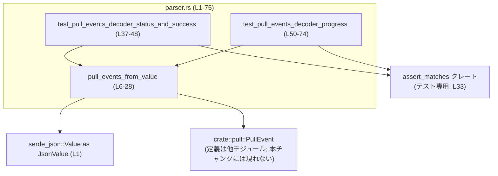
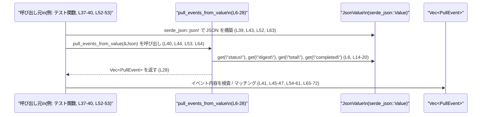

# ollama/src/parser.rs コード解説

## 0. ざっくり一言

`serde_json::Value` で表現された 1 件の「pull 状況更新」JSON オブジェクトから、`PullEvent` の列（ステータス・成功・進捗）を組み立てる小さな変換モジュールです（parser.rs:L5-28）。

---

## 1. このモジュールの役割

### 1.1 概要

- このモジュールは、**pull 処理の進行状況を表す JSON オブジェクト**を、アプリケーション内部で扱いやすい **`PullEvent` の列**に変換する役割を持ちます（parser.rs:L5-28）。
- JSON 中の `status`, `digest`, `total`, `completed` というキーから、ステータス更新・成功通知・チャンク進捗の 3 種類のイベントを生成します（parser.rs:L8-26）。
- JSON とイベント型の間の変換ロジックを 1 箇所にまとめることで、他の箇所は `PullEvent` のみを意識すればよい構造になっています。

### 1.2 アーキテクチャ内での位置づけ

このファイルが他モジュール／型とどのように関係しているかを、主要な要素に絞って示します。



- `pull_events_from_value` は外部から `serde_json::Value` を受け取り（parser.rs:L6, L8, L14-20）、`PullEvent` を生成して返します（parser.rs:L9, L11, L22-26）。
- テストモジュール `tests` 内の 2 つのテスト関数が、この変換ロジックの挙動を検証しています（parser.rs:L31-74）。
- `PullEvent` 型そのものは `crate::pull` モジュールで定義されており、本チャンクには定義が現れません（parser.rs:L3）。

### 1.3 設計上のポイント

コードから読み取れる設計上の特徴は次の通りです。

- **単一関数による変換**  
  - JSON → イベント列 の変換は、`pull_events_from_value` 1 関数に集約されています（parser.rs:L6-28）。
- **状態を持たない純粋関数**  
  - グローバル状態やフィールドを持たず、引数 `&JsonValue` から `Vec<PullEvent>` を生成して返すだけです（parser.rs:L6-7, L28）。
  - そのためスレッド間で共有しても副作用はなく、並行に呼び出しても安全な構造になっています（Rust の不変参照とローカル変数のみを使用）。
- **Option による柔軟な入力処理**  
  - JSON の各フィールドは `Option` として扱われ、欠損や型違いがあっても panic せずに「無いもの」として処理されます（parser.rs:L8, L14-20）。
- **緩やかなバリデーション方針**  
  - 型が合わない場合（例: `total` が数値でない）でもエラーにはせず、イベントを生成しない／一部フィールドを `None` にする挙動をとります（parser.rs:L19-21）。

---

## 2. 主要な機能一覧

このファイルが提供する主な機能は次の 1 つです。

- JSON pull 更新オブジェクトの解釈:
  - `status` キーからステータス／成功イベントを生成（parser.rs:L8-13）
  - `digest`, `total`, `completed` キーからチャンク進捗イベントを生成（parser.rs:L14-26）

### コンポーネントインベントリー（関数・モジュール一覧）

各コンポーネントの概要と定義位置です（行番号は推定）。

| 名称 | 種別 | 役割 / 用途 | 定義位置 |
|------|------|-------------|----------|
| `pull_events_from_value` | 関数 | 1 件の JSON オブジェクトから 0 個以上の `PullEvent` を生成する中核ロジック | `parser.rs:L6-28` |
| `tests` | モジュール | `pull_events_from_value` のユニットテストをまとめる | `parser.rs:L31-74` |
| `test_pull_events_decoder_status_and_success` | テスト関数 | `status` フィールドと `"success"` の扱いを検証 | `parser.rs:L37-48` |
| `test_pull_events_decoder_progress` | テスト関数 | `digest`/`total`/`completed` からの進捗イベント生成を検証 | `parser.rs:L50-74` |

---

## 3. 公開 API と詳細解説

### 3.1 型一覧（構造体・列挙体など）

このファイル内で新しく定義される型はありませんが、外部型を次のように利用しています。

| 名前 | 種別 | 役割 / 用途 | このファイルでの扱い |
|------|------|-------------|----------------------|
| `JsonValue` | 型エイリアス | `serde_json::Value` の別名。任意の JSON 値を表す。 | 引数型として使用し、`get` / `as_str` / `as_u64` でフィールドを取り出す（parser.rs:L1, L6, L8, L14-20）。 |
| `PullEvent` | 型（enum と推測） | pull 更新を表すイベント型。バリアント `Status`, `Success`, `ChunkProgress { digest, total, completed }` が存在することがこのファイルから分かる。 | `Vec<PullEvent>` の要素として生成される（parser.rs:L6, L9, L11, L22-26）。定義自体は `crate::pull` にあり、このチャンクには現れません（parser.rs:L3）。 |

> 補足: `PullEvent::ChunkProgress { digest, total, completed }` のフィールド型は、この関数内の変数型から `digest: String`, `total: Option<u64>`, `completed: Option<u64>` と読み取れます（parser.rs:L14-20, L22-26）。

### 3.2 関数詳細

#### `pull_events_from_value(value: &JsonValue) -> Vec<PullEvent>`

**概要**

- 1 件の JSON オブジェクトから、pull 処理に関する 0 個以上の `PullEvent` を抽出して返す関数です（parser.rs:L5-7）。
- 対応するフィールドは `status`, `digest`, `total`, `completed` で、それぞれ存在すれば対応するイベントが追加されます（parser.rs:L8-26）。

**引数**

| 引数名 | 型 | 説明 |
|--------|----|------|
| `value` | `&JsonValue` | pull 更新を表す JSON オブジェクト。`status`（文字列）、`digest`（文字列）、`total` / `completed`（整数）キーを含むことが期待されますが、必須ではありません（parser.rs:L6, L8, L14-21）。 |

**戻り値**

- 型: `Vec<PullEvent>`（parser.rs:L6, L28）
- 意味:  
  - 長さ 0～3 程度の `PullEvent` 列で、入力 JSON 中の情報に応じて以下のイベントが含まれます（parser.rs:L8-13, L21-26）。
    - `PullEvent::Status(String)` — `status` フィールドが文字列として存在する場合に 1 件追加（parser.rs:L8-9）。
    - `PullEvent::Success` — `status == "success"` の場合に追加（parser.rs:L10-11）。
    - `PullEvent::ChunkProgress { digest, total, completed }` — `total` または `completed` が存在する場合に 1 件追加（parser.rs:L19-21, L22-26）。

**内部処理の流れ（アルゴリズム）**

根拠となる行番号を併記します。

1. 空の `Vec<PullEvent>` を作成します（parser.rs:L7）。
2. `value["status"]` を文字列として取得しようとします（`get("status").and_then(|s| s.as_str())`）（parser.rs:L8）。
   - 取得できた場合:
     - その文字列を `String` に変換し、`PullEvent::Status` として `events` に push します（parser.rs:L8-9）。
     - さらに、その文字列が `"success"` と完全一致する場合は `PullEvent::Success` も push します（parser.rs:L10-11）。
3. `value["digest"]` を文字列として取得し、取得できない場合は空文字列 `""` をデフォルトとし `String` にします（parser.rs:L14-18）。
4. `value["total"]` を `u64` として取得し、`Option<u64>` として保持します（parser.rs:L19）。
5. `value["completed"]` も同様に `Option<u64>` として取得します（parser.rs:L20）。
6. `total.is_some() || completed.is_some()` が真なら、つまり `total` または `completed` のどちらか一方でも存在する場合に `PullEvent::ChunkProgress { digest, total, completed }` を push します（parser.rs:L21-26）。
7. 最後に `events` を返します（parser.rs:L28）。

この処理は一度も panic を起こさず、I/O やスレッド操作も行いません。

**Mermaid による処理フロー（`pull_events_from_value (L6-28)`）**

```mermaid
flowchart TD
    A["開始\npull_events_from_value (L6)"] --> B["Vec<PullEvent> を作成 (L7)"]
    B --> C{"status が\n文字列で存在? (L8)"}
    C -->|はい| D["Status(status) を push (L9)"]
    D --> E{"status == \"success\"? (L10)"}
    E -->|はい| F["Success を push (L11)"]
    E -->|いいえ| G["digest/total/completed の取得へ (L14-20)"]
    C -->|いいえ| G
    F --> G
    G --> H["digest を文字列として取得し、なければ空文字列 (L14-18)"]
    H --> I["total を Option<u64> として取得 (L19)"]
    I --> J["completed を Option<u64> として取得 (L20)"]
    J --> K{"total または\ncompleted が Some? (L21)"}
    K -->|はい| L["ChunkProgress{digest,total,completed} を push (L22-26)"]
    K -->|いいえ| M["push せずに終了へ (L21)"]
    L --> N["Vec<PullEvent> を返す (L28)"]
    M --> N
```

**Examples（使用例）**

1. `status` のみを処理する例（成功以外）

```rust
use serde_json::Value as JsonValue;
use crate::pull::PullEvent;
use crate::parser::pull_events_from_value; // 同一クレート内の想定

fn example_status() {
    // status フィールドだけを持つ JSON オブジェクトを構築する（parser.rs:L39 と同様）
    let v: JsonValue = serde_json::json!({"status": "verifying"});

    // JSON から PullEvent 列を生成する
    let events = pull_events_from_value(&v);

    // 1件の Status イベントが生成される想定
    assert_eq!(events.len(), 1);
    match &events[0] {
        PullEvent::Status(s) => assert_eq!(s, "verifying"),
        _ => panic!("unexpected event variant"),
    }
}
```

1. 進捗イベントを処理する例（`total` のみ）

```rust
use serde_json::Value as JsonValue;
use crate::pull::PullEvent;
use crate::parser::pull_events_from_value;

fn example_progress() {
    // digest と total を含む JSON（parser.rs:L52 と同様）
    let v: JsonValue = serde_json::json!({"digest": "sha256:abc", "total": 100});

    let events = pull_events_from_value(&v);

    assert_eq!(events.len(), 1);
    match &events[0] {
        PullEvent::ChunkProgress { digest, total, completed } => {
            assert_eq!(digest, "sha256:abc");
            assert_eq!(total, &Some(100));
            assert!(completed.is_none());
        }
        _ => panic!("unexpected event variant"),
    }
}
```

これらの例は、テストコードのロジック（parser.rs:L37-48, L52-62）を読みやすく書き直したものです。

**Errors / Panics（エラー・パニック挙動）**

- この関数は `Result` を返さず、エラーを明示的には表現しません（parser.rs:L6, L28）。
- 使用しているメソッドはすべて `Option` ベースであり、`unwrap` は使わず `unwrap_or` のみを使っているため、**panic を発生させません**（parser.rs:L14-18）。
  - `get` → `Option<&JsonValue>`（フィールドがなければ `None`）
  - `as_str` / `as_u64` → 型が合わなければ `None`
- 型が合わない／存在しないキーは「無いもの」として扱われるだけで、関数は静かにイベントを生成しないか、一部フィールドを `None` にして返します（parser.rs:L8, L19-21）。

**Edge cases（エッジケース）**

代表的なエッジケースとその挙動を整理します。

- `status` キーが存在しない場合  
  - `Status` / `Success` イベントは生成されません（`if let Some(status)` が偽, parser.rs:L8-13）。
- `status` が文字列以外（数値など）の場合  
  - `as_str` が `None` を返すため、同様にステータスイベントは生成されません（parser.rs:L8）。
- `status` は文字列だが `"success"` ではない場合  
  - `Status(...)` のみ生成され、`Success` は生成されません（parser.rs:L8-11）。
- `status` が `"success"` の場合  
  - 2 件のイベント `Status("success".to_string())` と `Success` がこの順で生成されます（parser.rs:L9-11）。
- `digest` が存在しない場合  
  - `unwrap_or("")` により `digest` には空文字列 `""` が入り、`ChunkProgress` が生成される場合は `digest` フィールドが空になります（parser.rs:L14-18, L22-26）。
- `total` / `completed` が存在しない、または数値以外の場合  
  - それぞれ `None` として扱われます。  
  - 両方とも `None` の場合は `ChunkProgress` 自体が生成されません（parser.rs:L19-21）。
- `total` / `completed` の片方だけが存在する場合  
  - テストより、存在する方のみ `Some` になった `ChunkProgress` が 1 件生成されることが確認できます（parser.rs:L52-62, L63-73）。
- `status` と `total` / `completed` が同時に存在する場合  
  - コードの順序から、ステータス関連のイベント（最大 2 件）が先に push され、その後に進捗イベント（最大 1 件）が push されます（parser.rs:L8-13, L21-26）。  
  - この組み合わせのテストは本チャンク内にはありません。

**使用上の注意点**

- **入力 JSON の構造**  
  - `value` がオブジェクトでない場合でも、`get` は単に `None` を返すため、常に空の `Vec` を戻します。  
    - これは安全ですが、「明らかに不正な JSON に気づきにくい」という意味で挙動が静かです（エラーは発生しません）。
- **digest が空になるケース**  
  - `digest` キーがない、または文字列以外の場合でも、`total` または `completed` があれば `ChunkProgress` が生成されますが、その `digest` は空文字列になります（parser.rs:L14-18, L21-26）。  
  - 後続処理で `digest` を識別子として利用する場合、この「空 digest」の扱いを明示的に決めておく必要があります。
- **バリデーションの責任範囲**  
  - この関数はエラーを返さない設計のため、「入力の妥当性検証」よりも「利用可能な情報だけ拾ってイベント化する」ことを優先しています。  
  - 厳密な検証が必要な場合は、この関数の前段や後段で追加のチェックを行う必要があります。
- **並行性**  
  - 引数は不変参照 `&JsonValue` であり、関数内部でも共有状態を持たないため、複数スレッドから同時に呼び出してもデータ競合は発生しません。  
  - Rust の型システムにより、`JsonValue` に対して同時に可変参照を取得することはできないため、この関数の呼び出し自体はスレッドセーフなデザインになっています。

### 3.3 その他の関数

テスト関数の一覧です。

| 関数名 | 役割（1 行） | 定義位置 |
|--------|--------------|----------|
| `test_pull_events_decoder_status_and_success` | `status` が `"verifying"` と `"success"` の場合のイベント生成を検証する（`Status` と `Success` の件数と順序を含む） | `parser.rs:L37-48` |
| `test_pull_events_decoder_progress` | `digest` + `total` / `digest` + `completed` の組み合わせから `ChunkProgress` が 1 件生成されること、および `total`/`completed` が `Some` / `None` になるパターンを検証する | `parser.rs:L50-74` |

---

## 4. データフロー

このモジュールの典型的なデータフローは「呼び出し元 → JSON 構築 → `pull_events_from_value` → `Vec<PullEvent>`」というシンプルなものです。



要点:

- 入力は 1 件の `JsonValue` であり、内部で他の I/O や外部サービスへのアクセスは行いません（parser.rs:L6-28）。
- 出力はメモリ上の `Vec<PullEvent>` のみで、副作用を持ちません。
- テストコードでは、この `Vec` に対してパターンマッチして期待されるイベントが生成されているか確認しています（parser.rs:L41, L45-47, L54-61, L65-72）。

---

## 5. 使い方（How to Use）

### 5.1 基本的な使用方法

このモジュールを利用する典型的な流れは以下のようになります。

```rust
use serde_json::Value as JsonValue;                   // JSON 値の型エイリアス（parser.rs:L1 と同じ）
use crate::pull::PullEvent;                           // pull イベント型（parser.rs:L3）
use crate::parser::pull_events_from_value;            // 本ファイルの関数（crate 内想定）

fn handle_pull_update(raw_json: &str) {
    // 文字列から JSON にデシリアライズする
    let value: JsonValue = serde_json::from_str(raw_json)
        .expect("valid JSON expected");

    // JSON オブジェクトから PullEvent の列を生成する（parser.rs:L6-28）
    let events: Vec<PullEvent> = pull_events_from_value(&value);

    // 生成されたイベントを処理する
    for event in events {
        match event {
            PullEvent::Status(msg) => {
                println!("status: {msg}");
            }
            PullEvent::Success => {
                println!("pull succeeded");
            }
            PullEvent::ChunkProgress { digest, total, completed } => {
                println!(
                    "progress: digest={digest}, total={:?}, completed={:?}",
                    total, completed
                );
            }
        }
    }
}
```

- ここで使用しているバリアント名・フィールド名は、このファイル内で実際に使われているものだけです（parser.rs:L9, L11, L22-26）。

### 5.2 よくある使用パターン

1. **ストリームされた JSON 行を順次処理する**

```rust
use serde_json::Value as JsonValue;
use crate::pull::PullEvent;
use crate::parser::pull_events_from_value;

// `lines` は1行に1つの JSON オブジェクトが乗る pull 更新ストリームとする
fn process_stream<I: Iterator<Item = String>>(lines: I) {
    for line in lines {
        // 各行を JSON として解釈
        if let Ok(value) = serde_json::from_str::<JsonValue>(&line) {
            // 各 JSON から 0～複数のイベントを取り出す
            let events = pull_events_from_value(&value);
            for event in events {
                // イベントに応じた処理を行う
                // （ログ出力、UI 更新など。ここでは省略）
                match event {
                    PullEvent::Status(_) |
                    PullEvent::Success |
                    PullEvent::ChunkProgress { .. } => {
                        // ...
                    }
                }
            }
        } else {
            // 不正な JSON 行の扱いは呼び出し側の責任
        }
    }
}
```

- このパターンでは、各 JSON 行が 0～数件の `PullEvent` に展開される点が重要です。

1. **成功検出にのみ関心がある場合**

```rust
use serde_json::Value as JsonValue;
use crate::pull::PullEvent;
use crate::parser::pull_events_from_value;

fn is_pull_success_update(value: &JsonValue) -> bool {
    pull_events_from_value(value)
        .into_iter()
        .any(|ev| matches!(ev, PullEvent::Success))
}
```

- 成功判定ロジックを一行で書けるのは、`pull_events_from_value` がステータスと成功を同じベクタにまとめて返す設計によります（parser.rs:L9-11）。

### 5.3 よくある間違い

```rust
use serde_json::Value as JsonValue;
use crate::parser::pull_events_from_value;
use crate::pull::PullEvent;

// 誤り例: 「1つの JSON から必ず 1つだけイベントが返る」と思い込む
fn wrong_assumption(value: &JsonValue) {
    let events = pull_events_from_value(value);

    // ❌ length が 1 であることを前提にしてしまう
    let event = &events[0]; // status が "success" の場合などにパニックの可能性
}

// 正しい例: 長さ 0 以上を前提に列として扱う
fn correct_usage(value: &JsonValue) {
    let events = pull_events_from_value(value);

    for event in &events {
        match event {
            PullEvent::Status(_) => { /* ... */ }
            PullEvent::Success => { /* ... */ }
            PullEvent::ChunkProgress { .. } => { /* ... */ }
        }
    }
}
```

- `status == "success"` の場合は 2 つのイベントが返るため（parser.rs:L9-11）、長さ 1 であることを仮定する実装は危険です。
- また、何のフィールドも認識できない JSON からは **0 件** のイベントが返る可能性もあります（parser.rs:L8, L21-26）。

### 5.4 使用上の注意点（まとめ）

- **ベクタ長は 0 以上**:
  - 呼び出し側は `Vec<PullEvent>` が空・1件・複数件のいずれでも対応できるように実装する必要があります。
- **入力検証の責任**:
  - この関数は JSON の妥当性を厳密に検証しないため、「入力フォーマットが本当に仕様通りかどうか」をチェックする必要がある場合は呼び出し側で対応します。
- **パフォーマンス**:
  - 各呼び出しは固定数のキー読み取りと小さな `String`・`Vec` の割り当てのみで、計算量は O(1) です。大量のイベントストリームであっても、この関数自体がボトルネックになる可能性は低いです。
- **並行性**:
  - 関数は純粋関数でありグローバル状態を持たないため、複数スレッドから安全に呼び出せます。

---

## 6. 変更の仕方（How to Modify）

### 6.1 新しい機能を追加する場合

例として、「JSON に新しいキーを追加し、それを新たな `PullEvent` バリアントにマッピングしたい」場合の手順を一般的に整理します。

1. **`PullEvent` へのバリアント追加**  
   - `crate::pull` モジュール（`PullEvent` の定義場所）に、新しいイベント用のバリアントを追加します。  
   - このファイルには定義がないため、具体的なファイルパスや構造はこのチャンクからは分かりません（parser.rs:L3）。
2. **`pull_events_from_value` 内で JSON からキーを取り出す処理を追加**  
   - 既存の `status` / `digest` / `total` / `completed` と同様に、`value.get("新しいキー")` から値を取得する処理を挿入します（parser.rs:L8, L14-20 を参考）。
3. **取得した値に基づき `PullEvent` を push**  
   - `events.push(PullEvent::NewVariant { ... })` のようなコードを適切な位置に追加します（既存の push ロジック parser.rs:L9, L11, L22-26 を参考）。
4. **テストの追加**  
   - `tests` モジュール内に、新しいキーとバリアントの組み合わせを検証するテスト関数を追加します（parser.rs:L37-48, L50-74 と同じスタイル）。

### 6.2 既存の機能を変更する場合

既存のルールを変更する際の注意点です。

- **ステータスと成功の扱いを変えたい場合**  
  - `"success"` のときに `Status` を生成しない／`Success` のみ生成する、といった仕様変更は、`if status == "success"` ブロック（parser.rs:L10-11）のロジックを書き換えることで実現できます。  
  - ただし `test_pull_events_decoder_status_and_success`（parser.rs:L37-48）は現在の仕様を前提としているため、合わせて修正・追加が必要です。
- **進捗イベント生成条件の変更**  
  - 現在は `total` と `completed` のどちらかが存在すれば `ChunkProgress` を生成します（parser.rs:L21-26）。  
  - 両方存在するときだけ生成したい場合は条件を `if total.is_some() && completed.is_some()` に変えるなど、条件式を修正します。
- **digest の必須化**  
  - `digest` が空文字列の `ChunkProgress` を許容したくない場合は、`digest` の取得後に `if !digest.is_empty()` のようなチェックを追加し、空の場合はイベントを push しないように変更できます（parser.rs:L14-21）。
- **影響範囲の確認**  
  - この関数は `pub(crate)` なので、同一クレート内の他モジュールからも使われている可能性があります（parser.rs:L6）。  
  - 変更前にクレート全体を検索し、`pull_events_from_value` の呼び出し箇所とテストを確認する必要があります。
- **リファクタリングの方向性（概要）**  
  - ロジックが増えてきた場合、`status` 関連と `progress` 関連の処理を別のヘルパー関数に切り出し、`pull_events_from_value` はそれらを順に呼び出す「オーケストレータ」として整理することもできます。  
  - 現状のコードは短いので、このチャンクだけからは明確なリファクタリングニーズは読み取れません。

---

## 7. 関連ファイル

このモジュールと密接に関係するモジュール／外部クレートです。

| パス / モジュール | 役割 / 関係 |
|-------------------|------------|
| `crate::pull` | `PullEvent` 型を定義するモジュールです（parser.rs:L3）。`Status`, `Success`, `ChunkProgress { digest, total, completed }` といったバリアントが存在することが、このファイルでの使用から分かりますが、定義そのものはこのチャンクには現れません。 |
| `serde_json` クレート | JSON データ構造を提供し、`Value` / `json!` マクロ / `from_str` などで JSON の構築・パースに利用されます。本ファイルでは `Value` を `JsonValue` として利用しています（parser.rs:L1, L39, L43, L52, L63）。 |
| `assert_matches` クレート（テストのみ） | テスト内で `PullEvent` のバリアントやフィールドをパターンマッチで検証するために使用されます（parser.rs:L33, L41, L45-47, L55-61, L66-72）。 |

> このチャンクには、`crate::pull` の具体的なファイルパスや他の関連モジュールの情報は現れません。そのため、`PullEvent` の全バリアントや構造の詳細はここからは分かりません。
