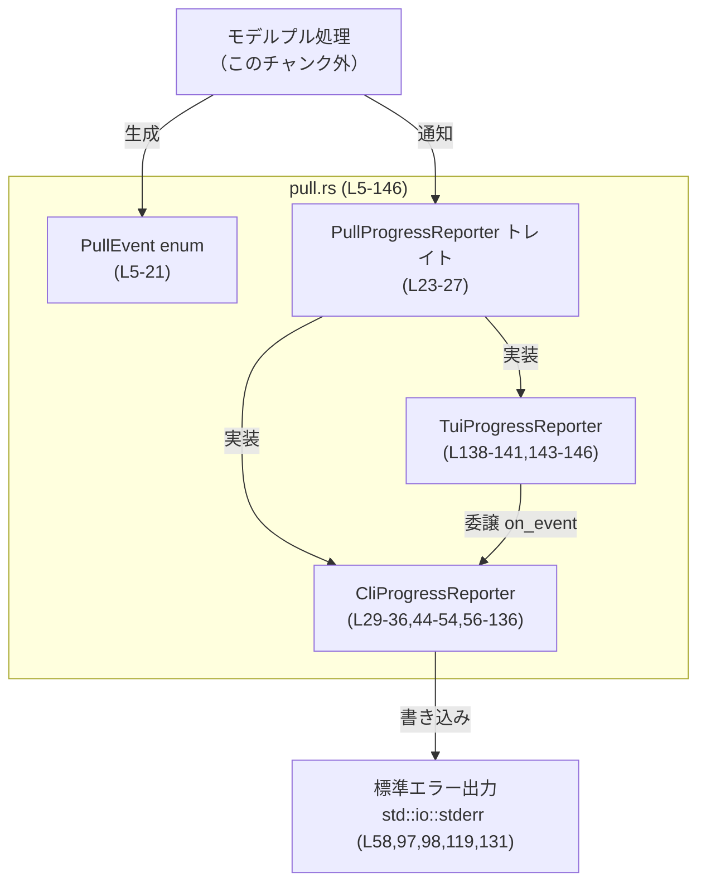
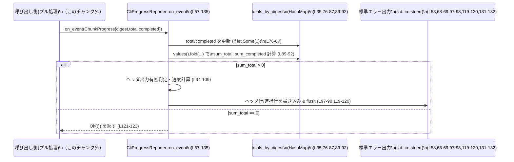

# ollama/src/pull.rs コード解説

## 0. ざっくり一言

モデルをプルするときに発生する進捗イベント（`PullEvent`）と、そのイベントを受け取って CLI/TUI にプログレスバー風の表示を行うレポーター（`PullProgressReporter` など）を定義するモジュールです（ollama/src/pull.rs:L5-27, L29-36, L140-146）。

---

## 1. このモジュールの役割

### 1.1 概要

- このモジュールは **モデルプルの進捗をユーザーに可視化する問題** を解決するために存在し、次の機能を提供します。
  - プル処理中に発生するイベントを表す `PullEvent` enum（ollama/src/pull.rs:L5-21）
  - イベントを受け取るオブザーバのインターフェース `PullProgressReporter` トレイト（L23-27）
  - CLI 用のシンプルな進捗表示 `CliProgressReporter`（L29-36, L44-54, L56-136）
  - TUI 用レポーター `TuiProgressReporter`（現状は CLI レポーターに委譲）（L138-146）

### 1.2 アーキテクチャ内での位置づけ

このファイルには、実際にネットワーク越しにモデルをダウンロードするコードは含まれていません。  
別モジュール（このチャンクには現れない）がモデルをプルしながら `PullEvent` を生成し、それを `PullProgressReporter` 実装に通知する設計になっています（トレイト定義から推測、L23-27, L56-57）。

依存関係を簡単に図示すると次のようになります。



### 1.3 設計上のポイント

コードから読み取れる設計上の特徴は以下の通りです。

- **イベント駆動の進捗表示**
  - ダウンロード処理は `PullEvent` を発行し、UI 側は `PullProgressReporter::on_event` で受け取る疎結合な設計です（L23-27, L56-57）。
- **UI 実装の差し替え可能性**
  - CLI/TUI/ログなど異なる UI を、`PullProgressReporter` を実装するだけで差し替えられます（L23-27, L56-57, L143-145）。
- **状態を持つレポーター**
  - `CliProgressReporter` は合計ダウンロードサイズ・経過時間などを内部状態として保持し、スループットを計算します（L29-35, L89-120）。
- **安全性（Rust 的観点）**
  - `unsafe` は一切使っていません。所有権・借用・`&mut self` を通じて、コンパイル時にメモリ安全性が保証される構造です（全体）。
- **エラーハンドリング方針**
  - すべてのイベントハンドリングは `io::Result<()>` を返し、I/O エラーなどは呼び出し側へ伝播します（L25-27, L56-57, L143-145）。
  - `PullEvent::Error` はレポーター内部ではログ出力せず、「エラーは呼び出し側で処理する」という責務分離が明示されています（コメント L125-128）。
- **並行性**
  - `on_event` は `&mut self` を取り、同一インスタンスに対して同時に複数スレッドから呼び出すには外部で排他制御が必要です（L25-27, L56-57, L143-145）。

---

## 2. 主要な機能一覧

- `PullEvent` の定義: モデルプル中の状態・進捗・成功・エラーを表すイベント型（L5-21）。
- `PullProgressReporter` トレイト: 進捗イベントを受け取るオブザーバのインターフェース（L23-27）。
- `CliProgressReporter`:
  - 標準エラー出力にインライン進捗を表示する CLI 用レポーター（L29-36, L56-136）。
  - レイヤーごとのバイト進捗を集計し、合計の GB 表示・割合・MB/s を計算（L71-75, L89-120）。
- `TuiProgressReporter`: 現時点では `CliProgressReporter` に委譲する TUI 用レポーター（L138-146）。

---

## 3. 公開 API と詳細解説

### 3.1 型一覧（構造体・列挙体など）＋コンポーネントインベントリー

| 名前 | 種別 | 公開性 | 定義位置 | 役割 / 用途 |
|------|------|--------|----------|-------------|
| `PullEvent` | 列挙体（enum） | `pub` | `ollama/src/pull.rs:L5-21` | モデルプル中のステータス・チャンク進捗・成功・エラーを表すイベント型。 |
| `PullProgressReporter` | トレイト | `pub` | `ollama/src/pull.rs:L23-27` | プル進捗イベントを受け取り、適切に表示・記録するオブザーバのインターフェース。 |
| `CliProgressReporter` | 構造体 | `pub` | `ollama/src/pull.rs:L29-36` | CLI 上で進捗を表示するレポーター。`PullProgressReporter` を実装し、stderr に進捗を表示。 |
| `TuiProgressReporter` | タプル構造体 | `pub` | `ollama/src/pull.rs:L138-141` | TUI 用レポーター。内部に `CliProgressReporter` を持ち、現在は処理を委譲。 |

`PullEvent` の各バリアント:

| バリアント | フィールド | 説明 | 根拠 |
|-----------|-----------|------|------|
| `Status(String)` | `String` | 人間が読めるステータスメッセージ。例 `"verifying"`, `"writing"`（L8-9）。 | `ollama/src/pull.rs:L8-9` |
| `ChunkProgress { digest, total, completed }` | `digest: String`, `total: Option<u64>`, `completed: Option<u64>` | 特定のレイヤーダイジェストごとのバイト単位進捗（L10-15）。`total` と `completed` はまだ不明な場合に `None` を許可する。 | `ollama/src/pull.rs:L10-15` |
| `Success` | なし | プルが正常終了したことを表す（L16-17）。 | `ollama/src/pull.rs:L16-17` |
| `Error(String)` | `String` | エラー発生時のメッセージ（L19-20）。表示は呼び出し側に任せる設計（L125-128）。 | `ollama/src/pull.rs:L19-20, L125-128` |

### 関数インベントリー（公開/重要なもの）

| 名前 | シグネチャ概要 | 種別 | 定義位置 | 役割 |
|------|----------------|------|----------|------|
| `PullProgressReporter::on_event` | `fn on_event(&mut self, &PullEvent) -> io::Result<()>` | トレイトメソッド | `ollama/src/pull.rs:L25-27` | 進捗イベントを 1 件処理するための共通インターフェース。 |
| `CliProgressReporter::new` | `pub fn new() -> Self` | 関数（関連関数） | `ollama/src/pull.rs:L44-53` | CLI レポーターの初期化。内部状態を初期値にリセット。 |
| `CliProgressReporter::default` | `fn default() -> Self` | `Default` 実装 | `ollama/src/pull.rs:L38-41` | `Default` トレイト経由で `new` を呼ぶためのラッパー。 |
| `<CliProgressReporter as PullProgressReporter>::on_event` | `fn on_event(&mut self, &PullEvent) -> io::Result<()>` | トレイト実装 | `ollama/src/pull.rs:L56-135` | `PullEvent` に応じて stderr に進捗表示を行う中核ロジック。 |
| `<TuiProgressReporter as PullProgressReporter>::on_event` | 同上 | トレイト実装 | `ollama/src/pull.rs:L143-145` | 内部の `CliProgressReporter` にイベント処理を委譲。 |

---

### 3.2 関数詳細（最大 7 件）

#### 1. `PullProgressReporter::on_event(&mut self, event: &PullEvent) -> io::Result<()>`

**概要**

すべての進捗レポーターが実装すべきメソッドです。1 つの `PullEvent` を受け取り、表示やログ出力などを行います（L23-27）。

**引数**

| 引数名 | 型 | 説明 |
|--------|----|------|
| `self` | `&mut self` | レポーター自身。可変参照なので内部状態を更新できます。 |
| `event` | `&PullEvent` | 処理対象の進捗イベント（L25-26）。 |

**戻り値**

- `io::Result<()>`（L25-27）
  - `Ok(())`: イベントを正常に処理できたことを示します。
  - `Err(e)`: I/O などのエラーが発生した場合にエラー内容を返します。

**内部処理の流れ（契約レベル）**

トレイト側では実装はありませんが、`CliProgressReporter` 実装（L56-135）から以下の契約を読み取れます。

1. 呼び出し側は進捗があるたびに `on_event` を順番に呼ぶ（イベントストリーム）。
2. 実装側は `Status`・`ChunkProgress`・`Success`・`Error` のどれが来るかを `match` して処理する（L59-134）。
3. 処理中に I/O エラーなどが発生した場合、`Err` として呼び出し側へ伝播する。

**Examples（使用例）**

```rust
use std::io;
use ollama::pull::{PullEvent, PullProgressReporter, CliProgressReporter}; // モジュールパスはプロジェクトに合わせる

fn report_demo<R: PullProgressReporter>(reporter: &mut R) -> io::Result<()> {
    // ステータス表示
    reporter.on_event(&PullEvent::Status("connecting".to_string()))?;

    // チャンク進捗
    reporter.on_event(&PullEvent::ChunkProgress {
        digest: "layer1".to_string(),
        total: Some(1024 * 1024),
        completed: Some(512 * 1024),
    })?;

    // 正常終了
    reporter.on_event(&PullEvent::Success)
}
```

**Errors / Panics**

- トレイトレベルでは決められていませんが、実装例（`CliProgressReporter`）では:
  - `stderr` への書き込み失敗時に `io::Error` を `Err` として返します（`write_all`・`flush` の `?`、L68-69, L97-98, L119-120, L131-132）。
- パニックを起こすような `unwrap` や `expect` は使用されていません。

**Edge cases（エッジケース）**

- `event` に `PullEvent::Error` が渡された場合、`CliProgressReporter` は**何も出力せずに `Ok(())` を返す**（L125-129）。
- 呼び出し側がエラーイベントを処理しないと、ユーザーにはエラー内容が見えない可能性があります。

**使用上の注意点**

- **契約**: `on_event` の呼び出し順序は呼び出し側次第ですが、多くの実装は「ステータス → 複数のチャンク進捗 → Success/ Error」という前提で動作します。
- **並行性**: シグネチャが `&mut self` のため、1 インスタンスへの同時呼び出しはコンパイル時に禁止されます。複数スレッドから使う場合は、`Arc<Mutex<_>>` などで外側にロックを設ける前提になります（一般的な Rust のパターン）。

---

#### 2. `CliProgressReporter::new() -> Self`

```rust
impl CliProgressReporter {
    pub fn new() -> Self {
        Self {
            printed_header: false,
            last_line_len: 0,
            last_completed_sum: 0,
            last_instant: std::time::Instant::now(),
            totals_by_digest: HashMap::new(),
        }
    }
}
```

（`ollama/src/pull.rs:L44-53`）

**概要**

CLI レポーターを初期化するコンストラクタです。進捗表示に使う内部状態を初期値にセットします。

**引数**

なし。

**戻り値**

- `CliProgressReporter` の新しいインスタンス（L45-52）。

**内部処理の流れ**

1. `printed_header` を `false` にセットし、「合計サイズヘッダ」をまだ出していない状態にします（L47）。
2. `last_line_len` を `0` にして、行の上書き用スペース計算の初期値にします（L48）。
3. `last_completed_sum` を `0` にし、それまでにダウンロードされた合計バイト数の初期値とします（L49）。
4. `last_instant` に現在時刻を記録し、後で MB/s を計算するときの基準とします（L50）。
5. `totals_by_digest` を空の `HashMap` として初期化し、各ダイジェストごとの `(total, completed)` を格納できるようにします（L51）。

**Examples（使用例）**

```rust
use ollama::pull::CliProgressReporter;

fn main() {
    // 初期状態の CLI レポーターを作る
    let mut reporter = CliProgressReporter::new();

    // Default トレイト経由でも同じ
    let mut reporter2: CliProgressReporter = Default::default();
}
```

**Errors / Panics**

- この関数自体はエラーもパニックも発生しません（単純な構造体初期化のみ）。

**Edge cases**

- 特にありません。すべてのフィールドが確定した値で初期化されています。

**使用上の注意点**

- 1 つのプル処理ごとに 1 インスタンスを使用する想定です。別のプル処理に使い回す場合は、内部状態をリセットしたいときに新しいインスタンスを作る方が単純です。

---

#### 3. `<CliProgressReporter as PullProgressReporter>::on_event`

```rust
impl PullProgressReporter for CliProgressReporter {
    fn on_event(&mut self, event: &PullEvent) -> io::Result<()> {
        // ...
    }
}
```

（中身: `ollama/src/pull.rs:L56-135`）

**概要**

`PullEvent` に応じて、標準エラー出力に進捗をインライン表示する中核ロジックです。  
ステータス行の上書きと、GB・%・MB/s を含む進捗表示を行います。

**引数**

| 引数名 | 型 | 説明 |
|--------|----|------|
| `self` | `&mut self` | 内部進捗状態（最後の行長、合計バイト数など）を更新するための可変参照。 |
| `event` | `&PullEvent` | 表示すべきイベント。`Status` / `ChunkProgress` / `Success` / `Error` のいずれか。 |

**戻り値**

- `io::Result<()>`
  - `Ok(())`: 進捗が正常に表示された。
  - `Err(e)`: `stderr` への書き込み・フラッシュなどに失敗した場合のエラー。

**内部処理の流れ（アルゴリズム）**

分岐ごとに整理します。

1. **共通準備**
   - `let mut out = std::io::stderr();` で標準エラー出力のハンドルを取得します（L58）。

2. **`PullEvent::Status(status)` の処理（L60-70）**
   1. `"pulling manifest"` というステータスはノイズとして扱い、大小文字を無視して完全一致する場合は何もせず `Ok(())` を返します（L61-63）。
   2. それ以外のステータス文字列を 1 行で表示します。
      - 前回表示した行長 `last_line_len` との差分を計算し、古い文字をスペースで上書きします（L65-66）。
      - 先頭の `\r`（キャリッジリターン）で行頭に戻り、行全体を上書きする形式です（L66）。
   3. `last_line_len` を現在のステータス文字列の長さに更新します（L67）。
   4. `write_all` で書き込み、`flush` で即座に表示します（L68-69）。

3. **`PullEvent::ChunkProgress { .. }` の処理（L71-124）**
   1. `total` が `Some(t)` のとき、そのダイジェストの「合計サイズ」を更新します（L76-81）。
   2. `completed` が `Some(c)` のとき、そのダイジェストの「完了サイズ」を更新します（L82-87）。
      - 両者とも、`HashMap<digest, (total, completed)>` に保存されます（L77-80, L83-86）。
   3. `totals_by_digest` のすべての値を `fold` して、
      - `sum_total`: 全レイヤーの合計バイト数
      - `sum_completed`: 全レイヤーの合計完了バイト数
      を計算します（L89-92）。
   4. `sum_total > 0` の場合のみ、進捗を表示します（L93）。
      - 初回などで `total` がまだすべて `None` のときは何も表示しません。
   5. まだヘッダを表示していなければ、合計サイズを GB 単位で表示するヘッダを出力します（L94-100）。
      - 先頭で `\r\x1b[2K` を書き、現在の行を消去してからヘッダ行を出力します（L97-98）。
      - `printed_header` を `true` に更新します（L99）。
   6. ダウンロード速度の計算（L101-109）。
      - 現在時刻 `now` と前回時刻 `last_instant` の差 `dt` を秒単位で取得し、最小 0.001 秒にクランプして 0 除算を防止します（L101-105）。
      - 前回からの差分バイト `dbytes = sum_completed - last_completed_sum` を取得し、MB/s を計算します（L106-107）。
      - `last_completed_sum` と `last_instant` を更新します（L108-109）。
   7. 完了量・合計量を GB に変換し、割合 `pct` を計算します（L111-113）。
   8. `"x.xx/y.yy GB (pp.p%) vv.v MB/s"` 形式のテキストを作成し、`Status` と同様に行頭に戻って上書き表示・フラッシュします（L114-120）。

   9. `sum_total == 0` の場合は何も表示せず `Ok(())` を返します（L121-123）。

4. **`PullEvent::Error(_)` の処理（L125-129）**
   - 何も表示せず即座に `Ok(())` を返します。
   - コメントで「呼び出し側がエラーを処理するので、ここで表示すると二重になる」と明示されています（L126-127）。

5. **`PullEvent::Success` の処理（L130-133）**
   - `\n` を 1 つ出力し、最後の行を確定させてからフラッシュします（L131-132）。

**Examples（使用例）**

```rust
use std::io;
use ollama::pull::{CliProgressReporter, PullEvent, PullProgressReporter};

fn simulate_download(reporter: &mut CliProgressReporter) -> io::Result<()> {
    reporter.on_event(&PullEvent::Status("preparing".into()))?;

    reporter.on_event(&PullEvent::ChunkProgress {
        digest: "layer1".into(),
        total: Some(1024 * 1024 * 1024),      // 1 GB
        completed: Some(256 * 1024 * 1024),   // 0.25 GB
    })?;

    reporter.on_event(&PullEvent::Success)
}
```

**Errors / Panics**

- `stderr` への書き込み・フラッシュで `io::Error` が発生した場合に `Err` を返します（L68-69, L97-98, L119-120, L131-132）。
- 演算関連:
  - `sum_completed.saturating_sub(self.last_completed_sum)` により、差分が負になるケースでもゼロにクランプされ、アンダーフローによるパニックは起きません（L106）。
  - `dt.max(0.001)` により 0 で割ることを防いでいます（L101-105）。
- `unwrap` や `expect` は使われていないため、この関数が内部でパニックする可能性は低いと考えられます（コード上からの事実）。

**Edge cases（エッジケース）**

- **`total` がすべて `None` の場合**:
  - `sum_total == 0` のため、ヘッダも進捗も表示されません（L93, L121-123）。
- **一部のチャンクのみ `total` が既知**:
  - 既知のチャンクだけを合計した `sum_total` に基づき進捗が計算されます（L89-92）。
- **`completed` のみが更新されるイベント**:
  - `HashMap` の初期値 `(0,0)` から `completed` のみ更新されます（L82-87）。
  - `total` が 0 のままの場合、そのチャンク分は `sum_total` に寄与しません。
- **`Status("pulling manifest")`**:
  - 大文字小文字を無視して一致する場合は、標準エラー出力に何も出力されません（L61-63）。
- **高速な連続イベント**:
  - `dt` を最小 0.001 秒にしているため、極端に短い間隔でも速度計算時の数値爆発を防いでいます（L101-105）。

**使用上の注意点**

- **エラーイベントの扱い**:
  - `PullEvent::Error` はここで表示されません。呼び出し側が別途ログ出力する必要があります（L125-129）。
- **端末制御コード**:
  - `\r` と `\x1b[2K` を使って行の上書き・消去を行うため、ANSI エスケープに対応していない環境では期待通り表示されない可能性があります（L66, L97）。
- **並行性**:
  - 多数のイベントを高頻度で処理する場合も、計算量はレイヤー数に比例（`HashMap::values().fold`）する設計です（L89-92）。レイヤー数が極端に多い場合は CPU 使用率に影響する可能性があります。

---

#### 4. `<TuiProgressReporter as PullProgressReporter>::on_event`

```rust
impl PullProgressReporter for TuiProgressReporter {
    fn on_event(&mut self, event: &PullEvent) -> io::Result<()> {
        self.0.on_event(event)
    }
}
```

（`ollama/src/pull.rs:L143-145`）

**概要**

TUI レポーターのイベント処理です。現状は内部の `CliProgressReporter` インスタンスに処理をそのまま委譲しています（L138-141, L143-145）。

**引数**

- `self: &mut self` — 内部に保持している `CliProgressReporter` を更新するための可変参照。
- `event: &PullEvent` — 委譲先にそのまま渡されるイベント。

**戻り値**

- `io::Result<()>` — 内部の `CliProgressReporter::on_event` の戻り値がそのまま返されます（L145）。

**内部処理の流れ**

1. `self.0.on_event(event)` を呼び出し、結果をそのまま返すだけです（L145）。

**Examples（使用例）**

```rust
use std::io;
use ollama::pull::{TuiProgressReporter, PullEvent, PullProgressReporter};

fn use_tui(reporter: &mut TuiProgressReporter) -> io::Result<()> {
    reporter.on_event(&PullEvent::Status("starting TUI".into()))?;
    reporter.on_event(&PullEvent::Success)
}
```

**Errors / Panics**

- `CliProgressReporter::on_event` と同じく、`stderr` 書き込みエラーなどが発生した場合に `Err` を返す可能性があります。
- 自身では新たなパニックやエラーを発生させません。

**Edge cases**

- 現状は CLI とまったく同じ挙動をするため、エッジケースも CLI と同じです（L138-141 のコメント参照）。

**使用上の注意点**

- 将来的に TUI 実装が独自の表示ロジックに差し替えられる可能性があります（L138-139 のコメント）。その場合でも `PullProgressReporter` インターフェースは変わらない想定です。

---

### 3.3 その他の関数・補助実装

| 関数 / 実装名 | 役割 | 定義位置 |
|---------------|------|----------|
| `impl Default for CliProgressReporter` | `Default::default()` が `CliProgressReporter::new()` を呼ぶだけのラッパー（L38-41）。 | `ollama/src/pull.rs:L38-41` |
| `#[derive(Default)] for TuiProgressReporter` | 内部の `CliProgressReporter` も `Default` なので、TUI レポーターも `Default::default()` で作成可能（L140）。 | `ollama/src/pull.rs:L140` |

---

## 4. データフロー

ここでは、`CliProgressReporter::on_event` を使ってモデルプルの進捗を表示する典型的なフローを示します。

1. 別モジュールのプル処理が `PullEvent::ChunkProgress` を生成します（このチャンク外）。
2. 呼び出し側は `CliProgressReporter::on_event` にそのイベントを渡します（L56-57）。
3. レポーターは内部の `totals_by_digest` を更新し、合計サイズ・完了サイズ・速度を計算します（L71-92, L101-109）。
4. 計算結果をもとに、標準エラー出力に 1 行の進捗情報を上書き表示します（L114-120）。



この図は、本チャンクの `CliProgressReporter::on_event (L57-135)` を中心に、`totals_by_digest`（L35）と `stderr` への I/O（L58, L68-69, L97-98, L119-120, L131-132）の関係を示しています。

---

## 5. 使い方（How to Use）

### 5.1 基本的な使用方法

典型的には「プル処理 → レポーターへのイベント通知」という流れになります。  
プル処理側はこのファイルには含まれていないため、想定コード例として示します。

```rust
use std::io;
use ollama::pull::{CliProgressReporter, PullEvent, PullProgressReporter};

// プル処理からイベントを流してくる想定の関数
fn pull_model<R: PullProgressReporter>(reporter: &mut R) -> io::Result<()> {
    reporter.on_event(&PullEvent::Status("pulling manifest".into()))?;
    // ↑ このメッセージは CLI レポーターでは無視される（L61-63）

    // レイヤー1のダウンロード
    reporter.on_event(&PullEvent::ChunkProgress {
        digest: "layer1".into(),
        total: Some(1024 * 1024 * 1024),
        completed: Some(512 * 1024 * 1024),
    })?;

    // …以降も必要に応じて ChunkProgress / Status を送る

    // 正常終了
    reporter.on_event(&PullEvent::Success)
}

fn main() -> io::Result<()> {
    let mut reporter = CliProgressReporter::new();
    pull_model(&mut reporter)
}
```

### 5.2 よくある使用パターン

1. **CLI と TUI の切り替え**

```rust
use std::io;
use ollama::pull::{CliProgressReporter, TuiProgressReporter, PullEvent, PullProgressReporter};

fn run_with_cli() -> io::Result<()> {
    let mut reporter = CliProgressReporter::new();
    reporter.on_event(&PullEvent::Status("CLI run".into()))?;
    reporter.on_event(&PullEvent::Success)
}

fn run_with_tui() -> io::Result<()> {
    let mut reporter = TuiProgressReporter::default(); // 内部で CliProgressReporter::default()（L140）
    reporter.on_event(&PullEvent::Status("TUI run".into()))?;
    reporter.on_event(&PullEvent::Success)
}
```

1. **汎用レポーターを受け取る関数**

```rust
fn download_with<R: PullProgressReporter>(reporter: &mut R) -> std::io::Result<()> {
    // PullEvent を発行して reporter に渡すだけにし、
    // 表示の仕方には関与しない構造を保てます。
    reporter.on_event(&PullEvent::Status("downloading".into()))?;
    reporter.on_event(&PullEvent::Success)
}
```

### 5.3 よくある間違い

```rust
use ollama::pull::{CliProgressReporter, PullEvent, PullProgressReporter};
use std::io;

// 間違い例: Error イベントだけを投げて表示されると思い込む
fn wrong_usage(reporter: &mut CliProgressReporter) -> io::Result<()> {
    // これは CLI レポーターでは何も表示されない（L125-129）
    reporter.on_event(&PullEvent::Error("network error".into()))
}

// 正しい例: Error イベントは呼び出し側で処理する
fn right_usage(reporter: &mut CliProgressReporter) -> io::Result<()> {
    if let Err(e) = do_download(reporter) {
        eprintln!("download failed: {e}");
        // 必要なら PullEvent::Error を別のレポーターに渡すなど
    }
    Ok(())
}

fn do_download<R: PullProgressReporter>(_r: &mut R) -> io::Result<()> {
    // ダウンロード実装（このチャンクには存在しない）
    Ok(())
}
```

### 5.4 使用上の注意点（まとめ）

- `PullEvent::Error` はこのモジュールでは出力されません。エラー表示やログ記録は呼び出し側で行う必要があります（L125-129）。
- ANSI エスケープに非対応の端末では、進捗の上書き表示が意図通りにならない可能性があります（L66, L97）。
- `CliProgressReporter` は `&mut self` を前提としているため、1 インスタンスを複数スレッドから同時に使う場合は外側でロックを用意する必要があります（L56-57）。
- 高頻度なイベントストリームでも `HashMap` のサイズはレイヤー数に比例して増えるだけであり、無制限に増大することは想定されていません（ダイジェストごとに 1 エントリ、L35, L76-87）。

---

## 6. 変更の仕方（How to Modify）

### 6.1 新しい機能を追加する場合

**例: ログファイルに書き出すレポーターを追加したい場合**

1. **新しい構造体を定義**
   - 本ファイルか別ファイルで、`struct FileProgressReporter { /* ログ用の writer 等 */ }` のような構造体を定義します。
2. **`PullProgressReporter` を実装**
   - `impl PullProgressReporter for FileProgressReporter { fn on_event(&mut self, event: &PullEvent) -> io::Result<()> { ... } }` を追加します（インターフェースは L23-27 を参照）。
3. **内部処理の参考**
   - 進捗集計や速度計算をしたい場合は、`CliProgressReporter::on_event` のロジック（L56-135）を参考にしつつ、必要な部分だけをコピーまたは抽出します。
4. **呼び出し側を差し替え**
   - 呼び出し側で `CliProgressReporter` の代わりに新しいレポーターを生成し、`PullProgressReporter` として渡します。

### 6.2 既存の機能を変更する場合

- **`Status` 表示方針を変えたい**
  - `"pulling manifest"` を無視する処理は L61-63 にまとまっています。
  - 他に無視したいメッセージがあれば、この `if` 条件を拡張します。
- **速度計算ロジックを変更したい**
  - MB/s 計算は L101-109 で行われています。
  - ここを別の単位（例えば KB/s）に変更する、または移動平均をとる等の調整が可能です。
- **合計サイズの表示を変更したい**
  - GB の計算とヘッダ文言は L94-100 および L111-115 に集中しています。
- **変更時の注意点**
  - `sum_total == 0` の場合に分母が 0 にならないようにしている条件（L93, L121-123）は維持する必要があります。
  - I/O エラーは必ず `io::Result<()>` に反映させるよう、`?` 演算子を途中で消してしまわないよう注意が必要です（L68-69, L97-98, L119-120, L131-132）。

---

## 7. 関連ファイル

このチャンクには他ファイルへの参照や `mod` 宣言が存在しないため、直接の関連ファイルは特定できません。

| パス | 役割 / 関係 |
|------|------------|
| （不明） | モデルを実際にプルして `PullEvent` を生成し、このモジュールの `PullProgressReporter` にイベントを渡すロジックを持つモジュールがどこかに存在すると考えられますが、このチャンクからは特定できません。 |

---

### Bugs / Security / Tests / パフォーマンス についての補足

- **潜在的なバグ**
  - コード上、明確なロジックバグは見当たりません。`total == 0` のときに表示を抑制するガード（L93, L121-123）や、`saturating_sub`（L106）, `dt.max(0.001)`（L101-105）などで代表的な落とし穴は回避されています。
- **セキュリティ**
  - このモジュールは外部入力をシリアライズして画面に表示するだけで、コマンド実行やファイル操作などは行いません。  
    ここから読み取れる範囲では、重大なセキュリティリスクは見当たりません。
- **テスト**
  - このファイル内にテストコード（`#[test]` など）は含まれていません。
- **パフォーマンス**
  - 各 `ChunkProgress` イベントで `HashMap::values().fold` により O(N) の計算（N: レイヤー数）を行います（L89-92）。通常のイメージレイヤー数であれば問題になりにくいですが、極端に多数のレイヤーに分割されたイメージではここがボトルネックになる可能性があります。
