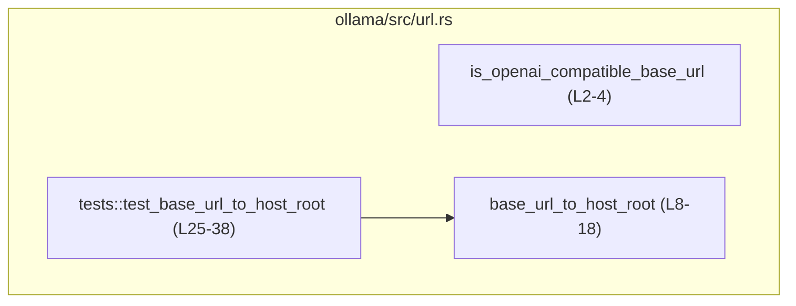
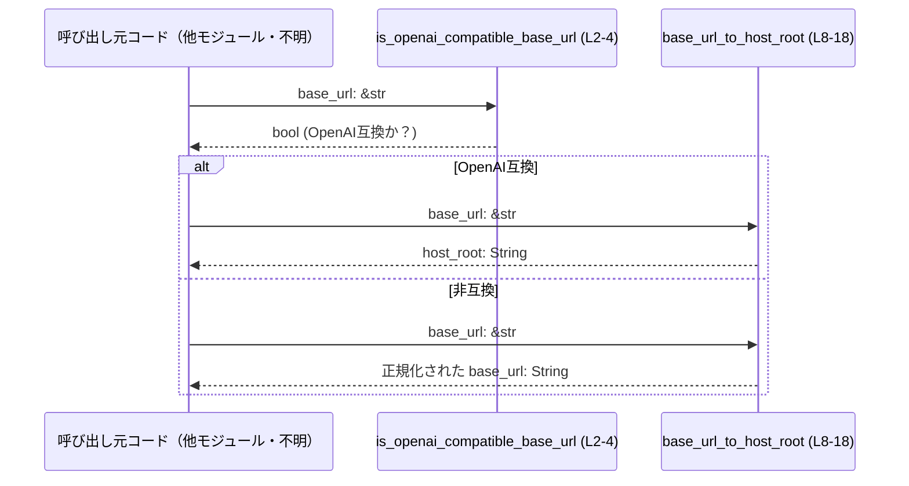

# ollama/src/url.rs コード解説

## 0. ざっくり一言

OpenAI 互換のベース URL (`.../v1`) かどうかを判定し、`/v1` を取り除いた「ホストルート URL」に変換するための、純粋な文字列ユーティリティ関数を定義しているファイルです（`ollama/src/url.rs:L1-18`）。

---

## 1. このモジュールの役割

### 1.1 概要

- **問題**  
  モデル API などのエンドポイントでは、`http://localhost:11434/v1` のように `/v1` を末尾に付けたベース URL が使われることがあります。このとき、Ollama 本体に対しては `/v1` を取り除いたホストルート (`http://localhost:11434`) を知りたい場合があります（`ollama/src/url.rs:L6-8`）。
- **提供機能**  
  - ベース URL が OpenAI 互換のルート (`.../v1`) を指しているかどうかの判定（`ollama/src/url.rs:L1-4`）。
  - ベース URL から `/v1`（と余分な末尾スラッシュ）を取り除き、ホストルート URL を文字列として返す変換（`ollama/src/url.rs:L6-18`）。

### 1.2 アーキテクチャ内での位置づけ

このファイルは、URL 文字列に対する**純粋なユーティリティ**として設計されています。

- 外部クレートや他モジュールへの依存はなく、標準ライブラリの `&str` と `String` のメソッドのみを利用しています（`trim_end_matches`, `ends_with`, `to_string`。`ollama/src/url.rs:L3,L9-16`）。
- `is_openai_compatible_base_url` は `pub(crate)` で、クレート内部専用のヘルパー関数です（`ollama/src/url.rs:L2`）。
- `base_url_to_host_root` は `pub` で、クレート外部からも利用される可能性がある公開 API です（`ollama/src/url.rs:L8`）。
- テストモジュール `tests` から `base_url_to_host_root` が呼ばれ、振る舞いが確認されています（`ollama/src/url.rs:L20-38`）。

Mermaid による簡単な依存関係図は以下のとおりです。



> 注: 外部モジュールからの実際の呼び出しコードは、このチャンクには含まれていません。

### 1.3 設計上のポイント

- **ステートレスな純関数**  
  どちらの関数も引数の文字列から新しい値を計算して返すだけで、副作用（I/O やグローバル状態の変更）はありません（`ollama/src/url.rs:L2-4,L8-18`）。
- **パターンマッチングベースの URL 判定**  
  URL 全体をパースするのではなく、末尾のパス部分が `/v1` かどうかを文字列の `ends_with` で判定しています（`ollama/src/url.rs:L3,L10`）。
- **余分な末尾スラッシュの正規化**  
  `/` が末尾に連続していても一旦削除し、さらに `/v1` を削除したあと、再度末尾の `/` を削除することで、`http://localhost:11434/` のような URL も `http://localhost:11434` に正規化されます（`ollama/src/url.rs:L9-14`）。
- **エラーオブジェクトを使わない設計**  
  文字列パターンに合わない場合もエラーにはせず、「そのまま返す」方針になっています（`ollama/src/url.rs:L15-17`）。
- **並行性**  
  共有状態やミューテックス等を持たず、引数・ローカル変数のみで完結するため、複数スレッドから同時に呼び出してもデータ競合は発生しません（`ollama/src/url.rs:L2-4,L8-18`）。

### 1.4 コンポーネント一覧（インベントリ）

| 名前 | 種別 | 公開範囲 | 行番号 | 役割 / 用途 |
|------|------|----------|--------|-------------|
| `is_openai_compatible_base_url` | 関数 | `pub(crate)` | `ollama/src/url.rs:L2-4` | ベース URL が `/v1` で終わるかどうか（OpenAI 互換ルートかどうか）を判定する |
| `base_url_to_host_root` | 関数 | `pub` | `ollama/src/url.rs:L8-18` | ベース URL から `/v1` と末尾の `/` を取り除き、ホストルート URL を返す |
| `tests` | モジュール | `cfg(test)` | `ollama/src/url.rs:L20-38` | `base_url_to_host_root` の挙動を確認するテストを含む |
| `test_base_url_to_host_root` | 関数（テスト） | `#[test]` | `ollama/src/url.rs:L25-38` | 代表的な3パターンの URL に対して `base_url_to_host_root` の結果を検証する |

---

## 2. 主要な機能一覧

- OpenAI 互換ベース URL 判定: `/v1` を末尾にもつかどうかで判定します（`ollama/src/url.rs:L1-4`）。
- ベース URL → ホストルート変換: `/v1` と余分な末尾スラッシュを取り除きます（`ollama/src/url.rs:L6-18`）。

---

## 3. 公開 API と詳細解説

### 3.1 型一覧（構造体・列挙体など）

このモジュールでは、構造体や列挙体などの**独自の型定義は行われていません**。文字列スライス `&str` と所有する文字列 `String` のみを扱います（`ollama/src/url.rs:全体`）。

### 3.2 関数詳細

#### `is_openai_compatible_base_url(base_url: &str) -> bool`

**概要**

- ベース URL 文字列の末尾（末尾の `/` は無視）を確認し、`"/v1"` で終わっているかどうかを返します（`ollama/src/url.rs:L1-4`）。
- コメント上は「OpenAI-compatible root (`.../v1`) を指しているかどうかを識別する」とされています（`ollama/src/url.rs:L1`）。

**引数**

| 引数名 | 型 | 説明 |
|--------|----|------|
| `base_url` | `&str` | 判定対象のベース URL 文字列。完全な URL 形式であることは前提にしておらず、任意の文字列を受け取ります（`ollama/src/url.rs:L2`）。 |

**戻り値**

- `bool`  
  - `true`: 末尾（末尾の `/` を取り除いた後）が `"/v1"` で終わる場合（`ollama/src/url.rs:L3`）。
  - `false`: それ以外の場合。

**内部処理の流れ（アルゴリズム）**

1. `base_url.trim_end_matches('/')` で、末尾に連続している `/` をすべて削除します（`ollama/src/url.rs:L3`）。
2. その結果の文字列に対して `.ends_with("/v1")` を呼び、`"/v1"` で終わるかどうかを判定します（`ollama/src/url.rs:L3`）。
3. 判定結果（`true` または `false`）をそのまま返します。

**Examples（使用例）**

```rust
use ollama::url::is_openai_compatible_base_url; // 実際のモジュールパスは crate 構成に依存します

fn main() {
    // OpenAI 互換パターン（.../v1）
    let url1 = "http://localhost:11434/v1";     // /v1 で終わる
    assert!(is_openai_compatible_base_url(url1)); // true が返ることを期待

    // 末尾スラッシュ付きでも OK
    let url2 = "http://localhost:11434/v1/";    // 末尾に余分な / がある
    assert!(is_openai_compatible_base_url(url2)); // trim_end_matches('/') により /v1 と判定される

    // /v1 以外の末尾は false
    let url3 = "http://localhost:11434/v1beta"; // v1beta は /v1 で終わらない
    assert!(!is_openai_compatible_base_url(url3)); // false
}
```

> 実際の `use` パスは、このファイルがどのモジュール階層に置かれているかによって変わります。このチャンクからは正確なパスは分かりません。

**Errors / Panics**

- 明示的なエラー型は使用していません。
- `trim_end_matches` と `ends_with` は、与えられた `&str` に対してパニックを起こさないことが標準ライブラリの仕様として保証されています。
- したがって、通常の使用でこの関数がパニックすることはありません（メモリ不足などプロセス全体の致命的な状況は別問題です）。

**Edge cases（エッジケース）**

- 空文字列 `""`  
  - `trim_end_matches('/')` の結果も空文字列で、`ends_with("/v1")` は `false` です。
- スラッシュのみ `"////"`  
  - `trim_end_matches('/')` により空文字列となるため、`false` になります。
- `/v1` だけの文字列  
  - `" /v1"` → 末尾の `/` は無いのでそのまま、`ends_with("/v1")` は `true`。
- 末尾が `/v1` だがクエリ付き `"http://host/v1?foo=bar"`  
  - 末尾は `"?foo=bar"` なので、`ends_with("/v1")` は `false`。
- 大文字・小文字の違い  
  - 完全一致を要求するため、`"/V1"` などは `false` になります。

**使用上の注意点**

- URL の「構造」ではなく、**純粋に文字列の末尾パターン**だけを見ています。クエリやフラグメントが付いている URL は、期待通りに `true` にならない場合があります（`ollama/src/url.rs:L3`）。
- スキーム（`http`/`https`）やホスト名、ポート番号などは一切検証されません。`"anything/v1"` のような文字列でも `/v1` で終われば `true` になります。
- 関数は参照を読むだけで書き込みを行わないため、複数スレッドから同時に呼び出しても安全です。

#### `base_url_to_host_root(base_url: &str) -> String`

**概要**

- ベース URL 文字列から、OpenAI 互換のパス `/v1` と余分な末尾 `/` を取り除き、**ホストルート URL** を表す `String` を返します（`ollama/src/url.rs:L6-18`）。
- 例として、`"http://localhost:11434/v1"` を `"http://localhost:11434"` に変換します（`ollama/src/url.rs:L7-8`）。

**引数**

| 引数名 | 型 | 説明 |
|--------|----|------|
| `base_url` | `&str` | ベース URL 文字列。`/v1` が末尾に付いている場合はそれを削除し、そうでなければ、末尾スラッシュを取り除いた文字列を返します（`ollama/src/url.rs:L8-17`）。 |

**戻り値**

- `String`  
  - `/v1`（とその後の `/`）が末尾に存在する場合: `/v1` を削除したホストルート URL（`ollama/src/url.rs:L10-14`）。
  - `/v1` で終わらない場合: 末尾の余分な `/` を削除しただけの文字列（`ollama/src/url.rs:L9,L15-17`）。

**内部処理の流れ（アルゴリズム）**

1. まず `base_url.trim_end_matches('/')` で末尾の `/` をすべて取り除き、`trimmed` というローカル変数に格納します（`ollama/src/url.rs:L9`）。
2. `trimmed.ends_with("/v1")` で、`trimmed` が `/v1` で終わるかどうかを判定します（`ollama/src/url.rs:L10`）。
3. `/v1` で終わる場合（`if` 側、`ollama/src/url.rs:L10-14`）:
   1. `trimmed.trim_end_matches("/v1")` で末尾の `/v1` を削除します（`ollama/src/url.rs:L12`）。
   2. さらに `.trim_end_matches('/')` で、`/v1` の削除後に残った末尾 `/` を削除します（`ollama/src/url.rs:L13`）。
   3. 最終的な文字列を `.to_string()` で `String` に変換して返します（`ollama/src/url.rs:L14`）。
4. `/v1` で終わらない場合（`else` 側、`ollama/src/url.rs:L15-17`）:
   1. `trimmed.to_string()` を返します。つまり末尾 `/` は削除されますが、その他の部分は変更されません。

**Mermaid の簡易フロー（base_url_to_host_root の処理）**

```mermaid
flowchart TD
  A["入力 base_url (&str) (L8)"]
  B["trimmed = base_url.trim_end_matches('/') (L9)"]
  C{"trimmed.ends_with(\"/v1\")? (L10)"}
  D["trimmed.trim_end_matches(\"/v1\").trim_end_matches('/') (L12-13)"]
  E["to_string() して返す (L14)"]
  F["trimmed.to_string() して返す (L15-17)"]

  A --> B --> C
  C -- "true" --> D --> E
  C -- "false" --> F
```

**Examples（使用例）**

```rust
use ollama::url::base_url_to_host_root; // 実際のモジュールパスは crate 構成に依存

fn main() {
    // 1. /v1 を持つ典型的なベース URL
    let url1 = "http://localhost:11434/v1";
    let root1 = base_url_to_host_root(url1);
    assert_eq!(root1, "http://localhost:11434"); // /v1 が取り除かれる

    // 2. 末尾にスラッシュがついていても問題なく処理される
    let url2 = "http://localhost:11434/v1/";
    let root2 = base_url_to_host_root(url2);
    assert_eq!(root2, "http://localhost:11434"); // 余分な / も除去

    // 3. もともと /v1 が付いていない場合は、末尾の / だけを落としてそのまま返す
    let url3 = "http://localhost:11434/";
    let root3 = base_url_to_host_root(url3);
    assert_eq!(root3, "http://localhost:11434"); // /v1 がないので、そのまま（末尾/のみ除去）

    // 4. /v1 以外のパスはそのまま（末尾 / のみ除去）
    let url4 = "http://localhost:11434/api/v1/chat";
    let root4 = base_url_to_host_root(url4);
    assert_eq!(root4, "http://localhost:11434/api/v1/chat"); // /v1/chat なので変換されない
}
```

**Errors / Panics**

- この関数自体は例外的状況を表現するための `Result` や `Option` を返さず、常に `String` を返します（`ollama/src/url.rs:L8-18`）。
- 使用している標準ライブラリメソッド（`trim_end_matches`, `ends_with`, `to_string`）は、通常の文字列に対してパニックを起こしません。
- したがって、通常の文字列入力でこの関数がパニックすることは想定されません。

**Edge cases（エッジケース）**

- 空文字列 `""`  
  - `trim_end_matches('/')` の結果も空文字列で、`ends_with("/v1")` は `false`、結果は `""`（空の `String`）になります。
- `/v1` だけの文字列  
  - `base_url = "/v1"`  
  - `trimmed = "/v1"` → `/v1` で終わるため、`trimmed.trim_end_matches("/v1")` は `""`。  
  - さらに `trim_end_matches('/')` しても `""` のままなので、結果は空文字列になります。
- 末尾に余分な `/` がある `"http://host/v1////"`  
  - 最初の `trim_end_matches('/')` で `"http://host/v1"` となり、その後 `/v1` が削除されて `"http://host"` になります。
- クエリ付き `"http://host/v1?foo=bar"`  
  - `trim_end_matches('/')` の結果は同じ文字列で、`ends_with("/v1")` は `false`。  
  - 結果は `"http://host/v1?foo=bar"` のままになります（末尾に `/` がないため変化なし）。
- `/v1` 以外のバージョン `"http://host/v2"`  
  - `/v1` で終わらないため変換されず、末尾の `/` があれば削除されるだけになります。

**使用上の注意点**

- URL の構文解析は行わず、**あくまで末尾の文字列が `/v1` かどうかだけ**で判断します（`ollama/src/url.rs:L9-16`）。
- `/v1` 以外のバージョンを扱う場合には、この関数のロジックを拡張するか、別の関数を用意する必要があります。
- ベース URL にクエリパラメータやフラグメントが含まれているケースは、この関数の想定外である可能性があります。その場合、`/v1` が途中に含まれていても末尾が `/v1` でなければ変換されません。
- 関数は新しい `String` を毎回生成するため、非常に高頻度の呼び出しが行われる場合は、不要なアロケーションが増える可能性があります。ただし、通常の HTTP ベース URL 処理で問題になるレベルではないと考えられる規模の処理です。

### 3.3 その他の関数

| 関数名 | 役割（1 行） | 行番号 |
|--------|--------------|--------|
| `test_base_url_to_host_root` | `base_url_to_host_root` が `/v1` の有無や末尾スラッシュの有無にかかわらず期待通りの結果を返すかどうかを検証するテスト関数 | `ollama/src/url.rs:L25-38` |

---

## 4. データフロー

このモジュール自体はシンプルな文字列変換のみを行いますが、典型的な利用イメージとしては「設定からベース URL を読み取り、それをホストルートに変換して利用する」という流れが想定できます。

以下は、ベース URL の処理に関連する典型的フローのシーケンス図です（実際の呼び出し元はこのチャンクには含まれません）。



> 注: 上記フローは「ありうる使い方のイメージ」であり、実際にこの順番で呼び出しているコードはこのチャンクには現れていません。

---

## 5. 使い方（How to Use）

### 5.1 基本的な使用方法

ベース URL を設定から読み取り、Ollama のホストルート URL を得るという基本的な使用例です。

```rust
// URL ユーティリティのインポート
use ollama::url::{is_openai_compatible_base_url, base_url_to_host_root}; 
// 実際のパスは crate 構成に依存します

fn configure_ollama_client(base_url: &str) {
    // OpenAI 互換の /v1 エンドポイントかどうかを判定する
    let is_openai = is_openai_compatible_base_url(base_url);
    println!("OpenAI 互換ベース URL か: {}", is_openai);

    // ホストルート URL を取得する
    let host_root = base_url_to_host_root(base_url);
    println!("ホストルート URL: {}", host_root);

    // ここで host_root を使ってクライアントなどを初期化するイメージ
    // let client = OllamaClient::new(host_root);
}
```

### 5.2 よくある使用パターン

1. **OpenAI 互換 URL をホストルートに変換する**

```rust
let base_url = "http://localhost:11434/v1";   // OpenAI 互換のベース URL 想定
let host_root = base_url_to_host_root(base_url);
assert_eq!(host_root, "http://localhost:11434"); // /v1 が取り除かれる
```

1. **すでにホストルートを指している URL を正規化する**

```rust
let base_url = "http://localhost:11434/";     // すでにホストルート
let host_root = base_url_to_host_root(base_url);
assert_eq!(host_root, "http://localhost:11434"); // 末尾の / だけ除去
```

1. **OpenAI 互換かどうかを事前にチェックする**

```rust
let base_url = "http://localhost:11434/v1";

if is_openai_compatible_base_url(base_url) {
    // /v1 付きの OpenAI 互換 URL とみなせる
    let host_root = base_url_to_host_root(base_url);
    // host_root を使って接続先のホストを設定
} else {
    // OpenAI 互換エンドポイントではない場合の処理
}
```

### 5.3 よくある間違い

**間違い例: クエリ付き URL でも `/v1` が削除されると期待する**

```rust
// 間違い例: クエリが付いていても /v1 が削除されると思い込んでいる
let base_url = "http://localhost:11434/v1?token=abc";
// 期待してしまうかもしれない結果:
// "http://localhost:11434?token=abc"

// 実際の動作:
let result = base_url_to_host_root(base_url);
// result は "http://localhost:11434/v1?token=abc" のまま
```

**正しい理解**

```rust
// 正しい前提: この関数は「末尾」が /v1 のときのみ /v1 を削除する
let base_url = "http://localhost:11434/v1";
let result = base_url_to_host_root(base_url);
assert_eq!(result, "http://localhost:11434");

// クエリやフラグメントが付いている場合の処理は、この関数では行わない
```

**間違い例: 任意のバージョン文字列（/v2, /v3）にも対応していると思う**

```rust
// 間違い例: /v2 でも /v1 と同様に削除されると思い込んでいる
let base_url = "http://localhost:11434/v2";
let result = base_url_to_host_root(base_url);
// 結果は "http://localhost:11434/v2" のままであり、バージョンは削除されない
```

### 5.4 使用上の注意点（まとめ）

- **入力の前提**  
  - 正しい URL 形式であることはこの関数では検証しません。任意の文字列を渡すことは可能ですが、その場合の結果は単純な文字列トリミングに過ぎません（`ollama/src/url.rs:L9-16`）。
- **パターンの限定性**  
  - `/v1` というパターンのみを特別扱いします。将来 `/v2` など他のバージョンを扱う場合は、このコードの拡張が必要です。
- **クエリ・フラグメント非対応**  
  - `?` や `#` 以降の部分は考慮していません。ベース URL にこれらが含まれる場合は、期待する結果にならない可能性があります。
- **スレッド安全性**  
  - 共有状態を持たない純関数なので、複数スレッドから同時に呼び出しても安全です（`ollama/src/url.rs:L2-4,L8-18`）。
- **セキュリティ**  
  - このモジュールは文字列処理のみであり、ネットワークアクセスやファイル I/O を伴いません。したがって、このコード単体から直接的なセキュリティリスク（例: 注入、情報漏えい）は読み取れません。ただし、外部から渡された任意の文字列を「URL」として信頼するかどうかは呼び出し側の責任になります。

---

## 6. 変更の仕方（How to Modify）

### 6.1 新しい機能を追加する場合

想定される拡張例として、「`/v1` 以外のバージョンにも対応したい」「クエリ付き URL からも `/v1` を除去したい」などがあります。一般的な追加手順の目安は次のとおりです。

1. **追加のバージョンパターンの定義**
   - 例: `/v2`, `/v3` なども認識したい場合、これらのパターンを表す定数やヘルパー関数を新たに定義します。
   - 追加する場所は、このファイル（`ollama/src/url.rs`）内にまとめると分かりやすくなります。

2. **判定ロジックの拡張**
   - `is_openai_compatible_base_url` における `ends_with("/v1")` 部分を、複数のパターンを扱えるように変更します（`ollama/src/url.rs:L3`）。
   - 必要に応じて、新しいヘルパー関数を導入し、ロジックを共有化します。

3. **変換ロジックの拡張**
   - `base_url_to_host_root` の `trimmed.ends_with("/v1")` および `trimmed.trim_end_matches("/v1")` を、より一般的な「バージョン部分を取り除く」処理に差し替えます（`ollama/src/url.rs:L10-13`）。

4. **テストの追加**
   - 新たにサポートするパターン（例: `/v2`）に対するテストケースを、`tests` モジュール内のテスト関数として追加します（`ollama/src/url.rs:L20-38` を参考）。

### 6.2 既存の機能を変更する場合

- **影響範囲の確認**
  - `is_openai_compatible_base_url` は `pub(crate)` なので、クレート内の複数の場所から呼ばれている可能性があります（`ollama/src/url.rs:L2`）。変更前に、呼び出し箇所（このチャンクには現れません）を検索して影響を確認する必要があります。
  - `base_url_to_host_root` は `pub` なので、クレート外から利用されている可能性があります（`ollama/src/url.rs:L8`）。公開 API の振る舞いを変える場合は後方互換性に注意が必要です。

- **契約（前提条件・返り値の意味）**
  - 現状の契約は、「末尾 `/v1` の削除」と「末尾 `/` の削除」です（`ollama/src/url.rs:L9-16`）。これを変更すると、既存の利用コードが期待する結果とずれる可能性があります。
  - たとえば、「クエリを削除する」などの追加仕様を入れる場合は、その変更が既存の動作を壊さないかどうか検討する必要があります。

- **テストの更新**
  - 既存のテスト `test_base_url_to_host_root`（`ollama/src/url.rs:L25-38`）は、現在の仕様の一部を固定しています。仕様変更に合わせてテスト内容も更新する必要があります。

---

## 7. 関連ファイル

このチャンクから直接読み取れる関連ファイルは、テストモジュールを含むこのファイル自身のみです。他のモジュールとの関係性は、このチャンクには現れていません。

| パス | 役割 / 関係 |
|------|------------|
| `ollama/src/url.rs` | URL に関する単純な文字列ユーティリティ関数（OpenAI 互換ベース URL 判定とホストルート変換）を提供する。内部テストモジュールで `base_url_to_host_root` の挙動を検証している（`ollama/src/url.rs:L20-38`）。 |

> 他の設定ファイルや HTTP クライアントとの連携など、このモジュールを利用している側のコードは、このチャンクには含まれていないため不明です。

---

### Bugs / Security / Performance に関する補足（まとめ）

- **潜在的なバグ要因**
  - クエリやフラグメント付き URL が想定通りに処理されない可能性があります（`/v1?foo=bar` など）。ただし、これは仕様上そうなっているとも解釈でき、このチャンクだけから「バグ」と断定はできません。
- **セキュリティ**
  - このモジュールは外部入力のバリデーションを行いませんが、単なる文字列変換のみを行い、ネットワークアクセスやコマンド実行は行いません。そのため、このコード単体から直接的なセキュリティ問題は読み取れません。
- **性能 / スケーラビリティ**
  - 各関数は最大でも 2〜3 回程度の `&str` 操作と 1 回の `String` の確保・コピーを行うのみで、時間計算量は入力長に対して線形 (`O(n)`) です（`ollama/src/url.rs:L3,L9-16`）。
  - 通常の Web クライアント・サーバーの URL 処理としては十分軽量な設計になっています。
