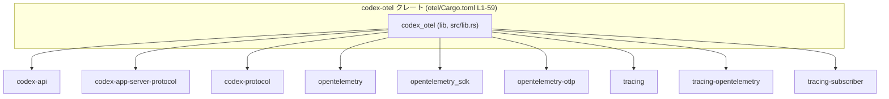
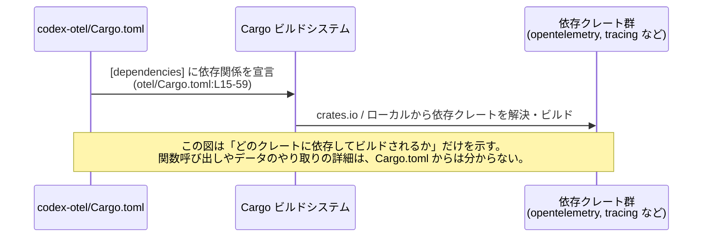

# otel/Cargo.toml 解説レポート

## 0. ざっくり一言

このファイルは、ワークスペース内の `codex-otel` クレートの Cargo マニフェストであり、ライブラリターゲット `codex_otel` と、OpenTelemetry / Tracing / HTTP / WebSocket / エラーハンドリングなどに関する依存クレートを定義しています（otel/Cargo.toml:L1-10, L15-59）。

---

## 1. このモジュールの役割

### 1.1 概要

- このファイルは Rust クレート `codex-otel` の **ビルド設定と依存関係** を定義するために存在します（otel/Cargo.toml:L1-5）。
- クレートはライブラリターゲット `codex_otel` を `src/lib.rs` として公開する構成になっています（otel/Cargo.toml:L7-10）。
- `opentelemetry` 系および `tracing` 系のクレートに依存しているため、このクレートが OpenTelemetry によるログ・メトリクス・トレースに関係する役割を担うことが示唆されます（otel/Cargo.toml:L24-47, L57-59）。

※ ただし、このファイルには Rust コード本体は含まれていないため、**具体的な公開 API やコアロジックの内容は分かりません**。

### 1.2 アーキテクチャ内での位置づけ

- クレート名: `codex-otel`（otel/Cargo.toml:L2）
- ライブラリターゲット名: `codex_otel`（otel/Cargo.toml:L7-9）
- エントリポイント: `src/lib.rs`（otel/Cargo.toml:L10）
- バージョン・エディション・ライセンスはワークスペース共通設定を参照しています（otel/Cargo.toml:L3-5, L16-59）。
- `codex-api` / `codex-app-server-protocol` / `codex-protocol` など内部クレートと思われるものと、OpenTelemetry / Tracing / HTTP クライアント / WebSocket / シリアライゼーション等の外部クレートに依存しています（otel/Cargo.toml:L19-22, L24-59）。

主要な依存関係に絞ったアーキテクチャ上の位置づけのイメージは次のとおりです（依存関係ベースの図であり、具体的な関数呼び出しまでは表しません）。



この図は「`codex_otel` がどのクレートに依存してビルドされるか」を示すもので、**データの流れや API の詳細はコードがないため不明**です。

### 1.3 設計上のポイント（Cargo.toml から読み取れる範囲）

Cargo 設定から読み取れる設計上の特徴は次の通りです。

- **ワークスペース一元管理**  
  - バージョン・エディション・ライセンス・依存バージョンはいずれも `workspace = true` で管理されています（otel/Cargo.toml:L3-5, L16-59）。
  - これにより、複数クレート間で依存バージョンや設定を揃える設計になっています。

- **ライブラリクレートとしての提供**  
  - `[lib]` セクションのみがあり、`bin` ターゲットは定義されていません（otel/Cargo.toml:L7-10）。
  - doctest は無効化されており、ドキュメントテストは実行されない方針です（otel/Cargo.toml:L8）。

- **OpenTelemetry + Tracing による観測性統合を意図した依存構成**（役割は依存クレートの一般的説明に基づく）
  - `opentelemetry` に `logs`, `metrics`, `trace` 機能を有効化（otel/Cargo.toml:L24）。
  - `opentelemetry-otlp` による OTLP エクスポータ（gRPC, HTTP, TLS 関連機能付き）（otel/Cargo.toml:L26-37）。
  - `opentelemetry_sdk` にはログ・メトリクス・トレースと tokio ランタイム連携など、多数の機能を有効化（otel/Cargo.toml:L39-47）。
  - `tracing` + `tracing-opentelemetry` + `tracing-subscriber` に依存（otel/Cargo.toml:L57-59）。

- **非同期・ネットワーク環境を前提とした構成**
  - `tokio`, `tokio-tungstenite`, `reqwest`（blocking + rustls TLS）、`http` に依存（otel/Cargo.toml:L48-50, L55-56）。
  - 非同期ランタイム（tokio）と HTTP / WebSocket 通信が絡む処理を持つことが推測されますが、実装はこのファイルからは分かりません。

- **エラーハンドリングとシリアライゼーションの利用**
  - `thiserror` によるカスタムエラー型（一般的な用途）、`serde` / `serde_json` によるシリアライゼーションを行う構造になっています（otel/Cargo.toml:L51-52, L54）。

---

## 2. コンポーネントインベントリー（依存クレート）

このチャンクには Rust の関数・構造体定義は存在しないため、**内部コンポーネントの一覧は作成できません**。ここでは Cargo.toml から分かる **外部コンポーネント（依存クレート）** を一覧します。

> 用途はクレートの一般的な役割に基づく説明であり、  
> `codex_otel` が実際にどのように利用しているかはこのファイルからは分かりません。

| コンポーネント | 種別 | 一般的な役割（外部知識） | 根拠 |
|----------------|------|---------------------------|------|
| `codex_otel`   | ライブラリターゲット | `src/lib.rs` をエントリポイントとするライブラリクレート | otel/Cargo.toml:L7-10 |
| `codex-api` | 依存クレート | 「codex」関連のアプリケーション API 群と思われる内部クレート | otel/Cargo.toml:L19 |
| `codex-app-server-protocol` | 依存クレート | アプリケーションサーバとのプロトコル定義を行う内部クレートと推測 | otel/Cargo.toml:L20 |
| `codex-protocol` | 依存クレート | 共通プロトコル定義の内部クレートと推測 | otel/Cargo.toml:L21 |
| `opentelemetry` | 依存クレート | OpenTelemetry のコア API（トレース・メトリクス・ログ） | otel/Cargo.toml:L24 |
| `opentelemetry-otlp` | 依存クレート | OTLP（OpenTelemetry Protocol）でのエクスポート（gRPC/HTTP/TLS） | otel/Cargo.toml:L26-37 |
| `opentelemetry_sdk` | 依存クレート | OpenTelemetry SDK 実装。バッチ span processor, メトリクスリーダなど | otel/Cargo.toml:L39-47 |
| `opentelemetry-appender-tracing` | 依存クレート | `tracing` ログを OpenTelemetry に送る appender | otel/Cargo.toml:L25 |
| `opentelemetry-semantic-conventions` | 依存クレート | OpenTelemetry のセマンティックコンベンション定義 | otel/Cargo.toml:L38 |
| `tracing` | 依存クレート | Rust の構造化ログ / トレース用クレート | otel/Cargo.toml:L57 |
| `tracing-opentelemetry` | 依存クレート | `tracing` と OpenTelemetry のブリッジ | otel/Cargo.toml:L58 |
| `tracing-subscriber` | 依存クレート | `tracing` のサブスクライバ実装（フィルタ・フォーマット等） | otel/Cargo.toml:L59 |
| `tokio` | 依存クレート | 非同期ランタイム | otel/Cargo.toml:L55 |
| `tokio-tungstenite` | 依存クレート | tokio ベースの WebSocket クライアント／サーバ | otel/Cargo.toml:L56 |
| `reqwest` | 依存クレート | HTTP クライアント（blocking + rustls TLS 有効） | otel/Cargo.toml:L50 |
| `http` | 依存クレート | HTTP メッセージ表現用型 | otel/Cargo.toml:L48 |
| `serde` / `serde_json` | 依存クレート | シリアライズ／JSON 処理 | otel/Cargo.toml:L51-52 |
| `thiserror` | 依存クレート | エラー型定義マクロ | otel/Cargo.toml:L54 |
| `chrono` | 依存クレート | 日付・時刻処理 | otel/Cargo.toml:L16 |
| `os_info` / `gethostname` | 依存クレート | OS 情報やホスト名取得 | otel/Cargo.toml:L23, L49 |
| `eventsource-stream` | 依存クレート | Server-Sent Events のストリーム処理 | otel/Cargo.toml:L22 |
| `strum_macros` | 依存クレート | enum 派生マクロ | otel/Cargo.toml:L53 |
| `pretty_assertions` | dev-dependency | 差分が見やすいアサーション（テスト用） | otel/Cargo.toml:L66 |

---

## 3. 公開 API と詳細解説

### 3.1 型一覧（構造体・列挙体など）

このチャンクは Cargo マニフェストのみであり、**Rust の型定義は一切含まれていません**。したがって、`codex_otel` クレートの公開型（構造体・列挙体など）はこのファイルからは分かりません。

#### 関数・構造体インベントリー（このチャンク）

| 名前 | 種別 | 所属 | 説明 | 根拠 |
|------|------|------|------|------|
| （なし） | - | - | このチャンクには Rust コードが含まれていません | otel/Cargo.toml:L1-66 全体が TOML 設定 |

> `src/lib.rs` 側に公開型・関数が定義されていると考えられますが、このチャンクには現れないため内容は不明です（otel/Cargo.toml:L10）。

### 3.2 関数詳細

**このチャンクには関数定義が存在しないため、関数詳細テンプレートを適用できる対象がありません。**  
公開 API（関数・メソッド）のシグネチャやエラー型、使用例などは `src/lib.rs` などのコードがないと説明できません。

### 3.3 その他の関数

同様に、このファイルだけからは補助的な関数やラッパー関数の存在も分かりません。

---

## 4. データフロー（依存関係ベース）

このチャンクから分かるのは「どのクレートに依存するか」という **ビルド時の依存関係** に限られます。  
具体的なランタイムのデータフローや API 呼び出し順序は `src/lib.rs` などの実装を見ないと分かりません。

ここでは、Cargo による依存解決の流れを sequence diagram で抽象的に示します。



要点:

- `codex-otel` は `[dependencies]` セクションで多数のクレートを宣言しています（otel/Cargo.toml:L15-59）。
- Cargo はこれを基に依存クレートを取得し、`codex_otel` ライブラリをリンクします。
- **ランタイムにおけるログ・メトリクス・トレース・HTTP 通信などの具体的なデータフローは、このチャンクからは不明**です。

---

## 5. 使い方（How to Use）

### 5.1 基本的な使用方法

このファイル自体は **ビルド設定** であり、関数や型の使い方は記載されていません。

分かるのは次の点のみです。

- `codex-otel` クレートはライブラリとして提供され、`src/lib.rs` がエントリポイントである（otel/Cargo.toml:L7-10）。
- 他のクレートから利用する場合は、通常はそのクレートの `Cargo.toml` に `codex-otel` を依存として追加し、`use codex_otel::...;` のようにインポートして使用することが想定されますが、**具体的なモジュールパスや関数名は不明**です。

したがって、このチャンクだけからは次のような具体的コード例を安全に示すことはできません。

```rust
// 例: こういったコードが存在するかどうかは、このチャンクからは分かりません
// use codex_otel::init_tracing;
// init_tracing()?;
```

実際の使い方を知るには、`src/lib.rs` やその下位モジュールの実装・ドキュメントコメントを参照する必要があります（otel/Cargo.toml:L10）。

### 5.2 よくある使用パターン（推測レベル）

このクレートが OpenTelemetry と `tracing` を統合する役割を担う可能性が高いことから、**一般的なパターン**としては以下のようなものが考えられますが、`codex_otel` 特有の API についてはこのファイルからは断定できません。

- アプリケーション起動時に「トレーサー・メトリクス・ログエクスポータ」を初期化する関数を提供する。
- `tracing` の Subscriber をセットアップし、`tracing-opentelemetry` / `opentelemetry-appender-tracing` を介して OpenTelemetry SDK に接続する。

このレベルはあくまで **一般的な Rust + OpenTelemetry 構成の説明であり、本クレート固有の仕様とは限りません**。

### 5.3 よくある間違い

Cargo.toml という観点では、次のようなミスが起こり得ます。

- ワークスペース側の feature と不整合な feature を個別に指定してビルドエラーになる。
- `tokio` ランタイムのバージョンや機能と、`opentelemetry_sdk` の `rt-tokio` 機能のバージョンが合わずにビルド・実行時エラーが起こる。

ただし、`codex_otel` クレートが実際にどの tokio バージョンや機能に依存しているかの詳細は、ワークスペース全体の `Cargo.toml` / `Cargo.lock` がないと判断できません。

### 5.4 使用上の注意点（まとめ）

このファイルから確実に言える注意点は次の通りです。

- **ワークスペース依存**  
  - すべて `workspace = true` による依存指定のため、ワークスペース外から単独で切り出して使用する場合は依存解決に注意が必要です（otel/Cargo.toml:L3-5, L16-59）。
- **非同期ランタイム前提の可能性**  
  - `tokio`, `tokio-tungstenite`, `reqwest` などが依存に含まれるため、非同期コードと組み合わせる設計が想定されますが、実際の API は不明です（otel/Cargo.toml:L50, L55-56）。
- **安全性・エラー・並行性について**  
  - このチャンクには Rust コードが含まれていないため、パニック条件・エラー型・スレッド安全性など、言語レベルの安全性に関する情報は一切読み取れません。

---

## 6. 変更の仕方（How to Modify）

### 6.1 新しい機能を追加する場合（Cargo.toml 観点）

このファイルレベルでの「機能追加」は、主に依存関係や feature の追加・変更として現れます。

1. **新しい外部クレートを利用したい場合**
   - `[dependencies]` にクレートを追加します。
   - ワークスペースで一元管理している場合は、まずワークスペースのルート `Cargo.toml` に追加し、その後 `workspace = true` で参照する形に合わせる必要があります（このワークスペースルートはこのチャンクには現れません）。

2. **OpenTelemetry 関連の機能を変えたい場合**
   - `opentelemetry`, `opentelemetry-otlp`, `opentelemetry_sdk` の features を変更することで、利用するプロトコル（gRPC/HTTP）、TLS 設定、メトリクスリーダなどを切り替えることができます（otel/Cargo.toml:L24-37, L39-47）。
   - ただし実際に有効・無効にしてよい機能は、`src/lib.rs` 側の実装がその機能に依存しているかどうかによります。コードを確認せずに features を削るとビルドエラーになる可能性があります。

3. **doctest の有効化/無効化**
   - 現在 `doctest = false` となっているため、ドキュメントコメント内のコードはテストされません（otel/Cargo.toml:L8）。
   - ドキュメントテストを実行したい場合は `doctest = true` に変更しますが、既存ドキュメントが doctest 対応になっているか確認が必要です。

### 6.2 既存の機能を変更する場合（契約・注意点）

Cargo.toml 観点での注意点:

- **依存削除の影響範囲**
  - 例: `tracing-opentelemetry` を削除すると、`src/lib.rs` で `tracing` と OpenTelemetry の橋渡しをしているコードがコンパイルできなくなる可能性があります。
  - 削除前に `rg tracing_opentelemetry src` のように利用箇所を検索し、実際に不要かどうか確認する必要があります（このチャンクには利用箇所は現れません）。

- **feature の変更による挙動変化**
  - `opentelemetry-otlp` の `"grpc-tonic"`, `"http-json"` などの feature を切り替えると、サポートされるエクスポートプロトコルが変わることが一般的です（otel/Cargo.toml:L26-37）。
  - 実際に使っているプロトコルはコード側で確認する必要があります。誤って無効化すると実行時にエラーになり得ます。

- **テスト用依存の変更**
  - `[dev-dependencies]` の `opentelemetry_sdk` と `pretty_assertions` はテストコードで利用されている可能性があります（otel/Cargo.toml:L61-66）。
  - 削除・変更する際は `tests/` や `src/lib.rs` の `#[cfg(test)]` ブロックを確認する必要があります。

---

## 7. 関連ファイル

この Cargo.toml から直接分かる、密接に関係するファイル・ディレクトリは次の通りです。

| パス | 役割 / 関係 | 根拠 |
|------|------------|------|
| `src/lib.rs` | `codex_otel` ライブラリターゲットのエントリポイント。公開 API やコアロジックが定義されていると考えられる | otel/Cargo.toml:L7-10 |
| （ワークスペースルート）`Cargo.toml` | `version.workspace = true` や `dependencies` の `workspace = true` を定義していると推測されるルート設定ファイル。本チャンクにはパスは現れない | otel/Cargo.toml:L2-5, L16-59 |
| `tests/` または `src` 内の `#[cfg(test)]` | `[dev-dependencies]` で指定された `opentelemetry_sdk`（testing feature）や `pretty_assertions` を利用していると考えられるテストコード | otel/Cargo.toml:L61-66 |

> 実際の公開 API・エラー処理・並行性の扱い・データフローなどを詳細に理解するには、  
> **少なくとも `src/lib.rs` の内容が必要**であり、この Cargo.toml チャンクだけではそれ以上の技術的詳細は分かりません。
