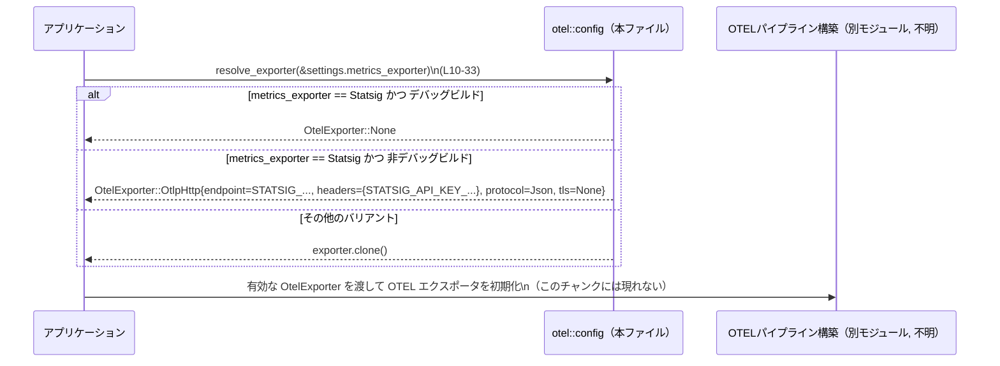

# otel/src/config.rs コード解説

## 0. ざっくり一言

OpenTelemetry（OTEL）のエクスポータ設定と、Statsig 用の組み込みデフォルト設定を表現する型・定数・補助関数を定義するモジュールです（`config.rs:L6-80`）。  
アプリケーション全体で使う OTEL 設定オブジェクト `OtelSettings` もここで定義されています（`config.rs:L35-45`）。

---

## 1. このモジュールの役割

### 1.1 概要

- このモジュールは、**OTEL の送信先やプロトコル・TLS 設定を表す型**（`OtelExporter`, `OtelHttpProtocol`, `OtelTlsConfig`）と、**サービス全体の OTEL 設定を束ねる `OtelSettings`** を提供します（`config.rs:L35-60`）。
- Statsig のメトリクス集約エンドポイント向けの **組み込みデフォルト定数** と、それを通常の OTEL HTTP エクスポータに変換する補助関数 `resolve_exporter` を定義します（`config.rs:L6-8`, `L10-33`）。
- デバッグビルドでは、Statsig 用デフォルトエクスポータが自動で無効化される挙動を持ちます（`config.rs:L13-18`）。

### 1.2 アーキテクチャ内での位置づけ

このファイルは「設定定義モジュール」であり、**実際の OTEL パイプライン構築ロジックはこのチャンクには現れません**。  
依存関係の概要を図にすると次のようになります。

```mermaid
graph LR
    subgraph "外部クレート・標準ライブラリ"
        StdMap["std::collections::HashMap (L1)"]
        StdPath["std::path::PathBuf (L2)"]
        AbsPath["codex_utils_absolute_path::AbsolutePathBuf (L4)"]
    end

    subgraph "otel::config (本ファイル)"
        Settings["OtelSettings 構造体 (L35-45)"]
        Exporter["OtelExporter 列挙体 (L62-80)"]
        HttpProto["OtelHttpProtocol 列挙体 (L47-53)"]
        TlsCfg["OtelTlsConfig 構造体 (L55-60)"]
        Resolve["resolve_exporter 関数 (L10-33)"]
        Consts["Statsig 用定数群 (L6-8)"]
    end

    StdMap --> Exporter
    StdMap --> Resolve
    StdPath --> Settings
    AbsPath --> TlsCfg
    Consts --> Resolve
    Exporter --> Settings
    Exporter --> Resolve

    Other["他モジュール（本チャンクには現れない）」] --> Settings
    Other --> Resolve
```

- 呼び出し側（`Other` ノード）はこのチャンクには含まれていませんが、通常はアプリケーション初期化コードなどから `OtelSettings` や `resolve_exporter` が利用される構成が想定されます（これは一般的な OTEL 設定モジュールの使い方であり、実際の利用箇所はこのチャンクからは特定できません）。

### 1.3 設計上のポイント（コードから読み取れる範囲）

- **設定情報のみを扱う純粋データ構造**  
  - `OtelSettings`, `OtelExporter`, `OtelHttpProtocol`, `OtelTlsConfig` はいずれも `Clone, Debug` を導出しており（`config.rs:L35, L47, L55, L62`）、内部にミューテーブルなグローバル状態は持ちません。
- **ビルドモードによる挙動切り替え**  
  - `resolve_exporter` 内で `cfg!(debug_assertions)` を用いて、デバッグビルド時は Statsig を `None` に強制する設計になっています（`config.rs:L17-19`）。
- **エラー型を使わない設計**  
  - `resolve_exporter` は `Result` ではなく `OtelExporter` を直接返し、異常系は「エクスポートしない（`OtelExporter::None`）」という選択肢で表現しています（`config.rs:L10-33, L63-64`）。
- **TLS 設定の任意化**  
  - `OtelTlsConfig` のフィールドはすべて `Option<AbsolutePathBuf>` であり、TLS 関連ファイルがなくても利用可能な設計です（`config.rs:L55-60`）。
- **並行性**  
  - このファイル内では `unsafe` ブロックやスレッド関連の API は使用しておらず、並行処理に直接関わるロジックはありません（全体）。

---

## 2. 主要な機能一覧

- OTEL 設定の集約: `OtelSettings` で環境名・サービス情報・エクスポータ設定を一括管理する（`config.rs:L35-45`）。
- HTTP プロトコル種別の表現: `OtelHttpProtocol` で OTLP HTTP のバイナリ／JSON を区別する（`config.rs:L47-53`）。
- TLS 設定の表現: `OtelTlsConfig` で CA / クライアント証明書・秘密鍵のパスを管理する（`config.rs:L55-60`）。
- エクスポータ種別の表現: `OtelExporter` で None・Statsig・OTLP gRPC・OTLP HTTP を表現する（`config.rs:L62-80`）。
- Statsig エクスポータ解決: `resolve_exporter` で Statsig バリアントを実際の `OtlpHttp` 設定または `None` に変換する（`config.rs:L10-33`）。
- Statsig 向け組み込み定数: エンドポイント URL・API キーヘッダ名・API キー文字列を定義する（`config.rs:L6-8`）。

---

## 3. 公開 API と詳細解説

### 3.1 型・定数・関数のインベントリー

#### 構造体・列挙体

| 名前 | 種別 | 役割 / 用途 | 可視性 | 定義位置 |
|------|------|-------------|--------|----------|
| `OtelSettings` | 構造体 | サービス名・バージョン・ホームディレクトリと、トレース/メトリクス用エクスポータ設定、およびランタイムメトリクス有効フラグを保持する設定オブジェクト | `pub` | `config.rs:L35-45` |
| `OtelHttpProtocol` | 列挙体 | OTLP HTTP で使用するプロトコル（バイナリ protobuf / JSON）を表す | `pub` | `config.rs:L47-53` |
| `OtelTlsConfig` | 構造体 | CA 証明書・クライアント証明書・秘密鍵のファイルパスを表す TLS 設定 | `pub` | `config.rs:L55-60` |
| `OtelExporter` | 列挙体 | OTEL エクスポータの種別と設定（None / Statsig / OTLP gRPC / OTLP HTTP）を表す | `pub` | `config.rs:L62-80` |

#### 定数・関数（コンポーネントインベントリー）

| 名前 | 種別 | 役割 / 用途 | 可視性 | 定義位置 |
|------|------|-------------|--------|----------|
| `STATSIG_OTLP_HTTP_ENDPOINT` | 定数 `&'static str` | Statsig 向け OTLP HTTP メトリクスエンドポイント URL | `pub(crate)` | `config.rs:L6` |
| `STATSIG_API_KEY_HEADER` | 定数 `&'static str` | Statsig API キー用 HTTP ヘッダ名 | `pub(crate)` | `config.rs:L7` |
| `STATSIG_API_KEY` | 定数 `&'static str` | Statsig API キー文字列（平文） | `pub(crate)` | `config.rs:L8` |
| `resolve_exporter` | 関数 | `OtelExporter::Statsig` をビルドモードに応じて `OtelExporter::None` または Statsig 用 `OtlpHttp` 設定に解決し、それ以外はそのままクローンして返す | `pub(crate)` | `config.rs:L10-33` |
| `statsig_default_metrics_exporter_is_disabled_in_debug_builds` | テスト関数 | デバッグビルドで Statsig デフォルトが `None` に解決されることを検証 | `#[cfg(test)]` 内 | `config.rs:L87-93` |

### 3.2 関数詳細：`resolve_exporter`

#### `resolve_exporter(exporter: &OtelExporter) -> OtelExporter`（`config.rs:L10-33`）

**概要**

- 渡された `OtelExporter` が `Statsig` であれば、ビルドモードに応じて
  - **デバッグビルド**では `OtelExporter::None`
  - **非デバッグビルド**では Statsig 用に事前定義された OTLP HTTP 設定  
  に変換して返します（`config.rs:L12-29`）。
- それ以外のバリアント（`None`, `OtlpGrpc`, `OtlpHttp`）はそのままクローンして返します（`config.rs:L31`）。

**引数**

| 引数名 | 型 | 説明 |
|--------|----|------|
| `exporter` | `&OtelExporter` | 元となるエクスポータ設定。借用（参照）で受け取り、中で必要に応じてクローンします（`config.rs:L10-12, L31`）。 |

**戻り値**

- 型: `OtelExporter`（所有権を持つ値）
- 意味:
  - Statsig の場合: デバッグビルドでは `OtelExporter::None`、非デバッグビルドでは Statsig 用 `OtlpHttp` 設定。
  - それ以外: 引数 `exporter` の内容をクローンしたもの。

**内部処理の流れ**

1. `match exporter` で `OtelExporter` のバリアントを分岐します（`config.rs:L11-12, L31`）。
2. `Statsig` バリアントの場合（`config.rs:L12`）:
   1. コメントにより「デバッグビルドでは組み込み Statsig デフォルトを無効にする」意図が明示されています（`config.rs:L13-16`）。
   2. `cfg!(debug_assertions)` でコンパイル時に埋め込まれるブール値を参照し、デバッグビルドなら `true` になります（`config.rs:L17`）。
   3. デバッグビルド (`cfg!(debug_assertions) == true`) の場合は `OtelExporter::None` を即座に返します（`config.rs:L18-19`）。
   4. それ以外（通常はリリースビルド）では、Statsig 用の `OtlpHttp` バリアントを構築します（`config.rs:L21-29`）:
      - `endpoint`: `STATSIG_OTLP_HTTP_ENDPOINT.to_string()`（`config.rs:L21-22`）
      - `headers`: `HashMap::from([ (STATSIG_API_KEY_HEADER.to_string(), STATSIG_API_KEY.to_string()) ])`（`config.rs:L23-26`）
      - `protocol`: `OtelHttpProtocol::Json`（`config.rs:L27`）
      - `tls`: `None`（TLS を使用しない、`config.rs:L28`）
3. それ以外のバリアント（`_` パターン）では `exporter.clone()` を返します（`config.rs:L31`）。  
   - これには `OtelExporter::None`, `OtelExporter::OtlpGrpc`, `OtelExporter::OtlpHttp` が含まれます（`config.rs:L63-80`）。

**Examples（使用例）**

1. Statsig メトリクスエクスポータの解決

```rust
use otel::config::{OtelExporter, resolve_exporter}; // モジュールパスは例示。実際のパスはこのチャンクからは不明です。

fn main() {
    // Statsig の組み込みデフォルトを指定する                         // Statsig バリアントを選択
    let raw_exporter = OtelExporter::Statsig;                            // 所有権を持つ Statsig 設定

    // 実際に使うエクスポータ設定に解決する                             // ビルドモードに応じて変換される
    let effective_exporter = resolve_exporter(&raw_exporter);            // &raw_exporter を借用して渡す

    // effective_exporter を OTEL パイプライン初期化処理に渡す           // ここから先の利用はこのチャンクには現れません
}
```

- デバッグビルドでは `effective_exporter` は `OtelExporter::None` になり、メトリクスは送信されません（`config.rs:L17-19`）。
- リリースビルドでは Statsig 向けの `OtlpHttp` 設定となります（`config.rs:L21-29`）。

1. すでに構成済みの OTLP HTTP エクスポータをそのまま使う

```rust
use std::collections::HashMap;
use otel::config::{OtelExporter, OtelHttpProtocol, resolve_exporter};

fn main() {
    // 明示的に OTLP HTTP の設定を構築                                  // Statsig ではなく任意の OTLP HTTP
    let custom_exporter = OtelExporter::OtlpHttp {
        endpoint: "https://otel.example.com/v1/metrics".to_string(),     // 独自エンドポイント
        headers: HashMap::new(),                                         // 追加ヘッダなし
        protocol: OtelHttpProtocol::Json,                                // JSON プロトコル
        tls: None,                                                       // TLS 設定なし（必要に応じて Some(...) にする）
    };

    // Statsig 以外はそのまま clone される                              // resolve_exporter は内容を変更しない
    let effective_exporter = resolve_exporter(&custom_exporter);
    assert!(matches!(effective_exporter, OtelExporter::OtlpHttp { .. })); // 構造は維持される
}
```

**Errors / Panics**

- この関数は `Result` を返さず、内部でも `unwrap`/`expect` や `panic!` 等を呼びません。
- `cfg!(debug_assertions)` はコンパイル時に決定される単純な条件分岐であり、パニックを発生させません（`config.rs:L17`）。
- したがって、この関数自身がパニックを引き起こす条件はコード上存在しません（このチャンクに限る）。

**Edge cases（エッジケース）**

- `exporter` が `OtelExporter::None` の場合（`config.rs:L63-64`）:
  - `_ => exporter.clone()` 分岐に入り、そのまま `None` が返ります（`config.rs:L31`）。
- `exporter` が `OtelExporter::OtlpGrpc { .. }` の場合（`config.rs:L69-73`）:
  - 同様にクローンされるだけで、中身は変更されません（`config.rs:L31`）。
- `exporter` が Statsig で、かつビルドモードがデバッグかどうか:
  - デバッグビルド (`cfg!(debug_assertions) == true`): `OtelExporter::None` が返るため、**エクスポートは行われない**（`config.rs:L17-19`）。
  - 非デバッグビルド: Statsig デフォルト `OtlpHttp` を構築し、TLS なし・JSON プロトコル・固定 API キーを用いる（`config.rs:L21-29`）。
- `exporter` 引数に `&OtelExporter::Statsig` を毎回渡しても問題はなく、関数内で新しい `OtelExporter` を生成して返すだけです（`config.rs:L21-29`）。

**使用上の注意点**

- **ビルドモード依存の挙動**（重要）  
  - 同じコードでも、デバッグビルドでは Statsig が自動無効化され、リリースビルドでは有効になります（`config.rs:L17-29`）。
  - テストやローカル開発時に Statsig へのメトリクス送信を期待していると、「デバッグビルドでは何も送られない」ことになります。
- **Statsig バリアントの用途**  
  - コメントに「This is intended for metrics only」とあるため（`config.rs:L65-67`）、`OtelExporter::Statsig` をトレースエクスポータに使うのは設計意図に反する可能性があります。  
    実際には `resolve_exporter` はトレース用かメトリクス用かを区別しませんが（このファイルには区別するロジックはありません）、利用側で区別する必要があります（利用側コードはこのチャンクには現れません）。
- **セキュリティ上の注意**  
  - Statsig 用 API キーは `STATSIG_API_KEY` として平文の文字列定数で埋め込まれており（`config.rs:L8`）、非デバッグビルドで `resolve_exporter` を通じて HTTP ヘッダにセットされます（`config.rs:L23-26`）。
  - このような定数はコンパイル済みバイナリから抽出される可能性があるため、キーの秘密性の要件に応じた管理方法が必要です（コード上は特別な保護は施されていません）。

### 3.3 その他の関数・テスト

| 関数名 | 役割（1 行） | 定義位置 |
|--------|--------------|----------|
| `statsig_default_metrics_exporter_is_disabled_in_debug_builds` | デバッグビルドで `resolve_exporter(&OtelExporter::Statsig)` が常に `OtelExporter::None` を返すことを確認するテスト | `config.rs:L87-93` |

- このテストは `#[cfg(test)] mod tests` 内に定義されており（`config.rs:L82-93`）、`resolve_exporter` のビルドモード依存の挙動を担保する役割を持ちます。
- `assert!(matches!( ... ))` により、返り値が `OtelExporter::None` であることをパターンマッチで確認しています（`config.rs:L89-91`）。

---

## 4. データフロー

ここでは、アプリケーションが `OtelSettings` と `resolve_exporter` を利用して **メトリクスエクスポータを決定する** 典型的なシナリオを想定したデータフローを示します（呼び出し側はこのチャンクには現れないため抽象化しています）。



要点:

- `OtelSettings` の `metrics_exporter` フィールドに `OtelExporter::Statsig` などが設定されていると仮定します（`config.rs:L41-43`）。
- アプリケーションはまず `resolve_exporter(&settings.metrics_exporter)` を呼び出し、ビルドモードに応じた実際のエクスポータ設定を取得します（`config.rs:L10-33`）。
- その後、取得した `OtelExporter` を使って OTEL SDK のエクスポータやパイプラインを構成します。この部分のコードは本チャンクには含まれていません。

---

## 5. 使い方（How to Use）

### 5.1 基本的な使用方法

`OtelSettings` を構築し、`resolve_exporter` でメトリクス／トレースのエクスポータを解決する基本的な流れの例です。

```rust
use std::collections::HashMap;
use std::path::PathBuf;

// 実際のモジュールパスはこのチャンクからは不明ですが、例として otel::config としています。
use otel::config::{
    OtelSettings,
    OtelExporter,
    OtelHttpProtocol,
    OtelTlsConfig,
    resolve_exporter,
};

fn main() {
    // OTEL エクスポータの初期設定を作る                             // トレースとメトリクスで別々に設定できる
    let trace_exporter = OtelExporter::OtlpGrpc {
        endpoint: "https://otel.example.com:4317".to_string(),          // gRPC エンドポイント
        headers: HashMap::new(),                                        // 追加ヘッダなし
        tls: None,                                                      // TLS 設定なし（必要に応じて Some(OtelTlsConfig{..})）
    };

    // メトリクスには組み込み Statsig エクスポータを使いたい場合      // 後で resolve_exporter で解決される
    let metrics_exporter = OtelExporter::Statsig;

    // サービス全体の OTEL 設定を構築                                 // environment や service_name は利用側の都合で決める
    let settings = OtelSettings {
        environment: "dev".to_string(),                                 // 環境名
        service_name: "example-service".to_string(),                    // サービス名
        service_version: "1.0.0".to_string(),                           // サービスバージョン
        codex_home: PathBuf::from("/opt/codex"),                        // Codex のホームディレクトリ
        exporter: trace_exporter.clone(),                               // 汎用 exporter（用途はこのチャンクでは不明）
        trace_exporter,                                                 // トレース用 exporter
        metrics_exporter,                                               // メトリクス用 exporter
        runtime_metrics: true,                                          // ランタイムメトリクスを有効にするかどうか
    };

    // 実際に使うメトリクスエクスポータを解決                         // デバッグビルドでは None になる
    let effective_metrics_exporter = resolve_exporter(&settings.metrics_exporter);

    // effective_metrics_exporter を使って OTEL のメトリクスパイプラインを構築する
    // （具体的な処理はこのチャンクには現れません）
}
```

### 5.2 よくある使用パターン

1. **Statsig をメトリクスにのみ使う**

   コメントにも「This is intended for metrics only」とあるように（`config.rs:L65-67`）、`OtelExporter::Statsig` を `metrics_exporter` にのみ設定し、`trace_exporter` には `OtlpGrpc`/`OtlpHttp` を設定するパターンが想定されます。

2. **完全にカスタムな OTLP gRPC/HTTP を使う**

   Statsig を使わず、すべて明示的な OTLP エンドポイントと TLS 設定を指定するケースでは、`OtelExporter::OtlpGrpc` や `OtelExporter::OtlpHttp` を直接構築して `resolve_exporter` に渡します（`config.rs:L69-79`）。

### 5.3 よくある間違い（起こりうる誤解）

```rust
// 誤解の例: デバッグビルドで Statsig を使えばメトリクスが送信されると思っている
let exporter = OtelExporter::Statsig;
let effective = resolve_exporter(&exporter);
// ここで effective が Statsig 用 OtlpHttp だと期待してしまう
```

```rust
// 実際の挙動: デバッグビルドでは None になる
let exporter = OtelExporter::Statsig;
let effective = resolve_exporter(&exporter);
assert!(matches!(effective, OtelExporter::None)); // config.rs:L17-19 の仕様
```

- デバッグビルドでメトリクス送信を確認したい場合は、
  - Statsig ではなくカスタムな `OtlpHttp`/`OtlpGrpc` を使う
  - あるいはリリースビルド相当で動作確認する  
  といった対応が必要です（このモジュール自体には切り替え用のフラグはありません）。

### 5.4 使用上の注意点（まとめ）

- `OtelSettings` は単なるデータ構造であり、このファイル内では I/O やスレッド操作は行いません（`config.rs:L35-45`）。
- `OtelExporter::Statsig` はメトリクス用を想定しており（コメントベース、`config.rs:L65-67`）、トレースに使用すると Statsig 側の想定と異なる可能性があります。
- Statsig API キーは定数として平文で埋め込まれているため（`config.rs:L8, L23-26`）、秘密情報として扱う必要があるかどうかをプロジェクトポリシーに照らして確認する必要があります。
- 並行環境での利用について:
  - このファイル内には共有ミューテーブル状態や `unsafe` は存在せず（全体）、`OtelSettings` などを `Arc` などで共有して使う構成が一般的ですが、実際のスレッド安全性（`Send`, `Sync` 実装）は `AbsolutePathBuf` などの外部型にも依存するため、このチャンクからは断定できません。

---

## 6. 変更の仕方（How to Modify）

### 6.1 新しい機能を追加する場合

例: 新しいエクスポータ種別（例: `OtelExporter::CustomVendor { ... }`）を追加する場合。

1. **`OtelExporter` にバリアントを追加**  
   - `config.rs:L62-80` の列挙体に新しいバリアントを追加します。
2. **`resolve_exporter` での扱いを決める**  
   - Statsig のように特別な解決が必要な場合は、`match exporter` 内に明示的なアームを追加します（`config.rs:L11-12, L31`）。
   - 特別な解決が不要であれば、`_ => exporter.clone()` に任せることもできます（`config.rs:L31`）。
3. **`OtelSettings` での利用**  
   - 新しいバリアントはすでに `OtelSettings` の `exporter`/`trace_exporter`/`metrics_exporter` フィールドで利用可能です（`config.rs:L41-43`）。
4. **テストの追加**  
   - 挙動にビルドモード依存などの特徴がある場合は、既存テスト（`config.rs:L87-93`）を参考に追加します。

### 6.2 既存の機能を変更する場合

- Statsig のエンドポイントや API キーを変更する場合:
  - `STATSIG_OTLP_HTTP_ENDPOINT`, `STATSIG_API_KEY_HEADER`, `STATSIG_API_KEY` の定数値を更新します（`config.rs:L6-8`）。
  - これらは `resolve_exporter` 内でのみ使用されているため（`config.rs:L21-26`）、影響範囲は Statsig 経由のメトリクス送信に限定されます（他のモジュールからの直接使用は `pub(crate)` のため同一クレートに限られます）。
- デバッグビルドでの無効化仕様を変更する場合:
  - `cfg!(debug_assertions)` を使った条件分岐（`config.rs:L17-19`）を修正します。
  - 変更後は `statsig_default_metrics_exporter_is_disabled_in_debug_builds` テスト（`config.rs:L87-93`）を更新、または新たなテストを追加して期待する挙動を担保する必要があります。

---

## 7. 関連ファイル

このモジュールと密接に関係すると考えられるファイル・コンポーネント（このチャンクから分かる範囲）は次の通りです。

| パス / コンポーネント | 役割 / 関係 |
|-----------------------|------------|
| `codex_utils_absolute_path::AbsolutePathBuf` | TLS 設定 `OtelTlsConfig` のフィールド型として利用される絶対パス表現（`config.rs:L4, L55-59`）。この型の詳細実装は本チャンクには現れません。 |
| 他のアプリケーションコード（パス不明） | `OtelSettings` を構築し、`resolve_exporter` を呼び出して実際の OTEL エクスポータを初期化する側のコード。具体的なファイル名やモジュール構成はこのチャンクからは分かりません。 |
| OTEL SDK / ランタイム（外部クレート） | `OtelExporter` の設定情報を受け取り、トレースやメトリクスを送信する部分。どのクレートを用いているかはこのチャンクからは不明です。 |

---

### まとめ（安全性・エラー・並行性・テスト観点）

- **安全性**: このファイルには `unsafe` コードはなく、データ構造定義と単純な条件分岐のみです。
- **エラー処理**: `resolve_exporter` は `Result` を用いず、「送らない（`None`）」という状態でエラーに相当する状況を表現しています。
- **並行性**: グローバルな可変状態やスレッド操作はなく、設定オブジェクトを複数スレッドで共有する設計と相性のよい構造になっています（ただし `Send`/`Sync` 実装の有無は外部型にも依存し、このチャンクからは断定できません）。
- **テスト**: Statsig のデバッグビルド無効化という重要な仕様に対して、専用のテストが 1 つ用意されており（`config.rs:L82-93`）、ビルドモード依存の挙動が退行しないようにチェックされています。
- **観測性（Observability）**: このモジュール自体はログ出力やメトリクス送信を行わず、観測性は「設定情報を通じて OTEL SDK に委ねる」という位置づけです。
