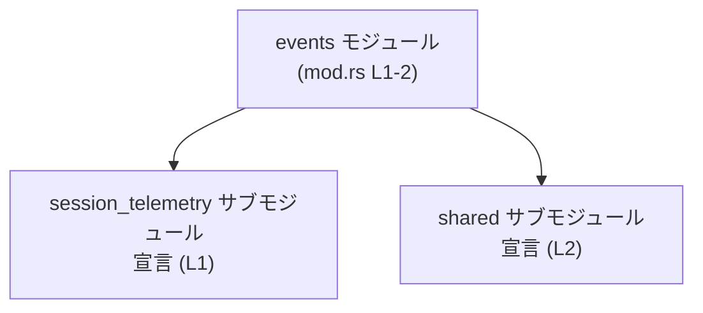

# otel/src/events/mod.rs コード解説

## 0. ざっくり一言

`otel/src/events/mod.rs` は、`events` モジュールのルートとして、2つのサブモジュール `session_telemetry` と `shared` を crate 内に公開するためのモジュール定義ファイルです（`otel/src/events/mod.rs:L1-2`）。

---

## 1. このモジュールの役割

### 1.1 概要

- このファイルは `events` モジュールの中で利用されるサブモジュールを宣言するために存在しています。
- 実行ロジック（関数や構造体の定義）は含まれておらず、モジュール構造だけを定義しています。

根拠:

- `pub(crate) mod session_telemetry;`（`otel/src/events/mod.rs:L1`）
- `pub(crate) mod shared;`（`otel/src/events/mod.rs:L2`）

### 1.2 アーキテクチャ内での位置づけ

このファイルで定義される関係は、`events` モジュールとそのサブモジュール間の構造だけです。以下の Mermaid 図は、このファイル内で確認できるモジュール階層を表しています。



※ 上位の `crate` や他モジュールから `events` がどのように参照されているかは、このチャンクには現れないため不明です。

### 1.3 設計上のポイント

このファイルから読み取れる設計上の特徴は次のとおりです（いずれも `otel/src/events/mod.rs:L1-2` に基づきます）。

- **サブモジュールの公開範囲**  
  - どちらも `pub(crate)` で宣言されており、**crate 内からのみアクセス可能** です（外部 crate からは直接アクセス不可）。
- **責務分割**  
  - `session_telemetry` と `shared` という2つのサブモジュールに分離されていることのみが分かります。  
    具体的な責務（どのようなイベントを扱うかなど）は、このチャンクには現れません。
- **状態・エラー・並行性**  
  - このファイルには型定義や関数が一切ないため、状態管理・エラーハンドリング・並行性に関する方針は読み取れません。  
    これらは各サブモジュール側で実装されている可能性がありますが、このチャンクからは確認できません。

---

## 2. 主要な機能一覧

このファイル自体は「機能（関数・メソッド）」を提供せず、サブモジュールを crate 内に登録する役割のみを持ちます。

このファイルから確認できる要素を「コンポーネントインベントリー」として整理すると次のとおりです。

### 2.1 モジュール一覧（コンポーネントインベントリー）

| 名前                    | 種別      | 公開範囲      | 根拠行 | 説明 |
|-------------------------|-----------|---------------|--------|------|
| `events`                | モジュール| `crate` 内部  | `otel/src/events/mod.rs:L1-2` | `events` モジュールのルート。サブモジュールを束ねる役割のみが確認できる |
| `session_telemetry`     | サブモジュール | `pub(crate)` | `otel/src/events/mod.rs:L1` | `events` のサブモジュール。内容はこのチャンクには含まれない |
| `shared`                | サブモジュール | `pub(crate)` | `otel/src/events/mod.rs:L2` | `events` のサブモジュール。内容はこのチャンクには含まれない |

※ `session_telemetry` / `shared` の中身（構造体・関数等）は、このチャンクには現れないため不明です。

---

## 3. 公開 API と詳細解説

このファイルには、**型定義や関数定義が1つも存在しません**。  
そのため、「型一覧」「関数詳細」「その他の関数」についてはすべて「このファイルには存在しない」という説明になります。

### 3.1 型一覧（構造体・列挙体など）

- このファイルには構造体・列挙体・型エイリアスなどの **型定義はありません**。  
  ファイル全体が2行で、両方とも `mod` 宣言であることから判断できます。

根拠:

- `pub(crate) mod session_telemetry;`（`otel/src/events/mod.rs:L1`）
- `pub(crate) mod shared;`（`otel/src/events/mod.rs:L2`）

### 3.2 関数詳細（最大 7 件）

- **このファイルには関数定義が存在しないため、詳細解説対象の関数はありません。**

### 3.3 その他の関数

- 同上。このファイルには関数が1つも定義されていません。

---

## 4. データフロー

### 4.1 このファイルから分かる範囲

- このファイルには関数呼び出しやデータ処理が書かれていないため、**実行時のデータフロー**（どのデータがどの関数を通るか）は分かりません。
- ここでは、このファイル内で行われている **モジュール宣言レベルの「フロー」** のみを図示します。

### 4.2 モジュール宣言のシーケンス図

以下の Mermaid のシーケンス図は、`events` モジュールがサブモジュールを宣言している様子を表現しています。

```mermaid
sequenceDiagram
    participant Events as "events モジュール\n(mod.rs L1-2)"
    participant Session as "session_telemetry サブモジュール\n宣言 (L1)"
    participant Shared as "shared サブモジュール\n宣言 (L2)"

    Events->>Session: `pub(crate) mod session_telemetry;`
    Events->>Shared: `pub(crate) mod shared;`
```

- これは **コンパイル時の構造** を表しており、実行時の関数呼び出しではありません。
- `session_telemetry`・`shared` 内でのデータの流れは、このチャンクには現れないため不明です。

---

## 5. 使い方（How to Use）

このファイル自身はサブモジュールを登録するだけであり、直接呼び出す関数などはありません。  
ここでは、**同一 crate 内の別モジュールからこのモジュール構造を利用する際の基本的なイメージ**のみ示します。

### 5.1 基本的な使用方法（モジュールの参照）

同一 crate 内のコードから `events` 配下のサブモジュールを利用するには、一般的には次のように `use` します（実行する関数名などは、このチャンクからは分かりません）。

```rust
// 他ファイル（例: src/lib.rs や src/main.rs）側のコード例

// events モジュールが crate ルートから宣言されている想定
mod events; // 実際の宣言場所はこのチャンクには現れません

// events 配下のサブモジュールを use する
use crate::events::session_telemetry;
use crate::events::shared;

fn main() {
    // ここで session_telemetry / shared モジュール内の公開 API を利用する。
    // 具体的な関数や型の名前は、このチャンクには含まれていないため不明です。
}
```

※ 上記は Rust の一般的なモジュール利用パターンを示す例であり、  
実際にどの関数や型が存在するかは `session_telemetry` / `shared` のソースコードを確認する必要があります。

### 5.2 よくある使用パターン

- **モジュール経由で API を整理する**  
  - `crate::events::session_telemetry::...`  
  - `crate::events::shared::...`  
  というパスでイベント関連機能を整理している構造であることが推測されますが、  
  実際の API 名はこのチャンクには現れません。

### 5.3 よくある間違い（このファイルに関連するもの）

このファイルに関して起こり得る誤りとしては、以下のようなものがあります。

```rust
// 間違い例（イメージ）: サブモジュール本体が存在しないのに mod 宣言だけがある
pub(crate) mod session_telemetry; // 対応するファイル/モジュール定義がないとコンパイルエラーになる

// 正しい状態: mod 宣言に対応するサブモジュール定義ファイルが存在する
pub(crate) mod session_telemetry; // otel/src/events/session_telemetry{.rs,/mod.rs} のいずれかに定義があることが通常は期待される
```

※ 対応するファイルパスはこのチャンクには現れないため、具体的な場所は不明です。  
ここでは Rust の一般的なモジュール規則に基づく説明のみを行っています。

### 5.4 使用上の注意点（まとめ）

- **外部 crate からの利用は不可**  
  - `pub(crate)` で宣言されているため、`session_telemetry` / `shared` はこの crate の外側からは直接参照できません。
- **API の詳細はサブモジュール側を確認する必要がある**  
  - このファイルだけでは、どのような関数・型が提供されているかは分かりません。
- **安全性・エラー・並行性に関する注意点**  
  - このファイルには実行ロジックがなく、それらに関する情報は一切読み取れません。  
    実際の注意点は各サブモジュールの実装に依存します。

---

## 6. 変更の仕方（How to Modify）

### 6.1 新しい機能を追加する場合

このファイルを起点として新しいイベント関連機能を追加する場合の典型的な流れは次のとおりです。

1. **新しいサブモジュールを作成する**  
   - 例: `otel/src/events/new_feature.rs` または `otel/src/events/new_feature/mod.rs` を作成する（具体的パスはプロジェクトの方針による）。
2. **`mod.rs` にサブモジュールを追加する**  

   ```rust
   // otel/src/events/mod.rs
   pub(crate) mod session_telemetry; // L1
   pub(crate) mod shared;            // L2
   pub(crate) mod new_feature;       // 新しく追加
   ```

3. **新サブモジュール内で公開 API を定義する**  
   - 関数・構造体などを `pub` あるいは `pub(crate)` で公開する。
4. **他のモジュールから利用する**  
   - 例: `use crate::events::new_feature;` など。

※ 具体的な API 設計や責務の分割は、既存の `session_telemetry` / `shared` の設計を参考にする必要がありますが、このチャンクにはその情報は含まれていません。

### 6.2 既存の機能を変更する場合

`session_telemetry` や `shared` の中身を変更する際、このファイルに関して注意すべき点は次のとおりです。

- **サブモジュール名を変更する場合**
  - このファイルの `mod` 名と、対応するサブモジュールファイル側のモジュール名が一致している必要があります。
  - 例: `pub(crate) mod session_telemetry;` → `pub(crate) mod session;` に変更した場合、  
    対応するファイル名や他の `use crate::events::session_telemetry;` などの参照もすべて更新する必要があります。
- **公開範囲の変更**
  - `pub(crate)` を `pub` に変更すると、外部 crate からも `crate_name::events::session_telemetry` としてアクセス可能になります。
  - 公開範囲の変更は API 互換性やセキュリティポリシーに影響するため注意が必要です。
- **影響範囲の確認**
  - このファイルで宣言しているサブモジュール名が、他のファイルの `use` 文でどのように参照されているかを検索し、変更の影響範囲を把握する必要があります。

---

## 7. 関連ファイル

このファイルと密接に関係するのは、宣言されているサブモジュール本体です。ただし、このチャンクからは具体的なファイルパスは分かりません。

| パス（このチャンクから判別できる範囲） | 役割 / 関係 |
|----------------------------------------|------------|
| 不明（`session_telemetry` サブモジュール本体） | `pub(crate) mod session_telemetry;`（`otel/src/events/mod.rs:L1`）で宣言されているサブモジュール。イベント関連の何らかの処理を担っている可能性があるが、内容はこのチャンクには現れない |
| 不明（`shared` サブモジュール本体）           | `pub(crate) mod shared;`（`otel/src/events/mod.rs:L2`）で宣言されているサブモジュール。共通処理を含む可能性もあるが、内容はこのチャンクには現れない |

---

### Bugs / Security / Contracts / Edge Cases / Tests / Performance について

このファイル自体はモジュール宣言しか行っていないため、次の点は**評価対象となるロジックが存在しません**。

- **Bugs / Security**  
  - ビジネスロジックやデータ処理がないため、典型的なバグやセキュリティホールを議論できる箇所はありません。
- **Contracts / Edge Cases**  
  - 関数や型が存在しないため、「前提条件」「エッジケース」のような契約条件は定義されていません。
- **Tests**  
  - このファイルにはテストコードは含まれていません（テストは各サブモジュール側にある可能性がありますが、このチャンクには現れません）。
- **Performance / Scalability**  
  - 実行時処理がないため、パフォーマンスやスケーラビリティに関する評価対象もありません。

これらの観点での具体的な分析は、`session_telemetry` / `shared` それぞれの実装コードを確認する必要があります。
