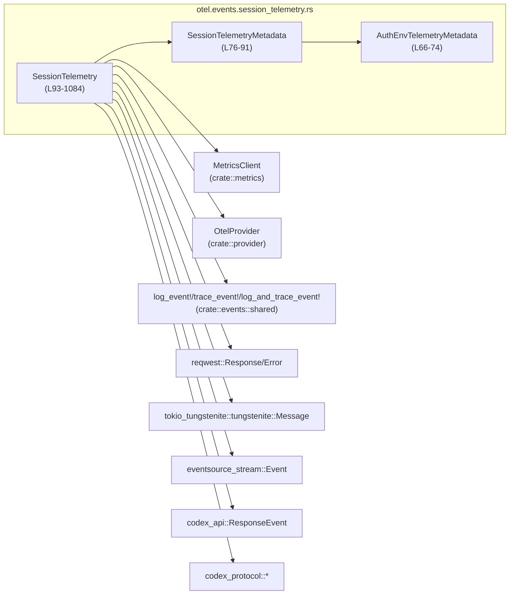
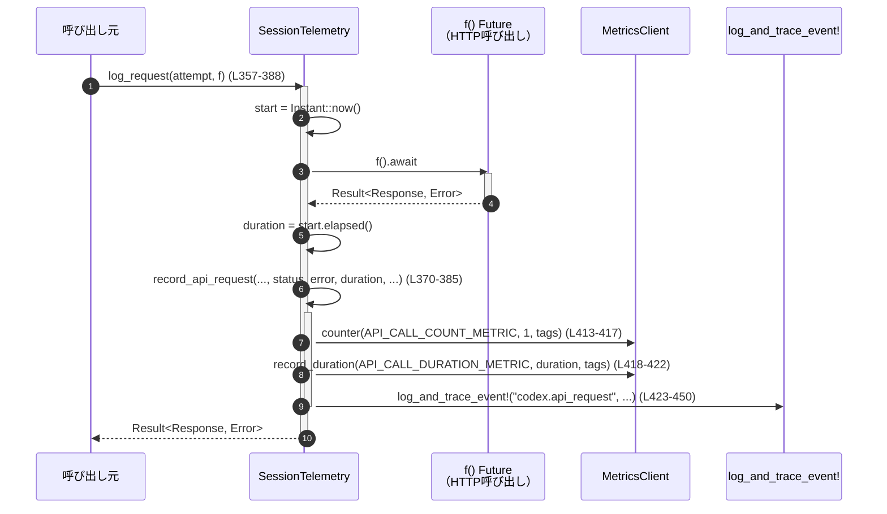
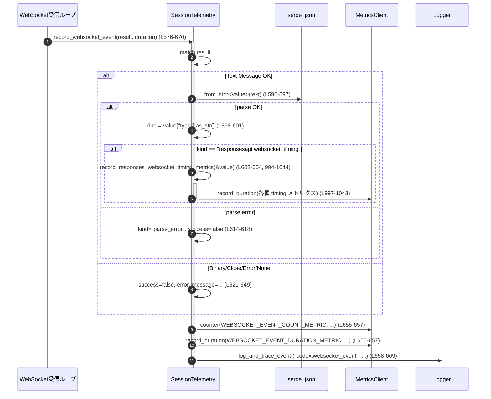

otel/src/events/session_telemetry.rs コード解説
================================================

## 0. ざっくり一言

OpenTelemetry ベースのセッション単位のテレメトリ（メトリクス・ログ・トレース）を集約して送出するためのヘルパーです。  
HTTP / WebSocket / SSE / ツール実行 / ユーザープロンプトなどのイベントを一か所から計測・記録します。

---

## 1. このモジュールの役割

### 1.1 概要

- このモジュールは **「対話セッション中に発生する各種イベントを、一貫した形でメトリクス・ログ・トレースに記録する」** ために存在します。
- `SessionTelemetry` 構造体を中心に、HTTP リクエスト、WebSocket イベント、SSE イベント、ツール呼び出し、ユーザープロンプトなどを記録します。
- OpenTelemetry 互換の `MetricsClient` や `log_event!` / `trace_event!` マクロを利用し、実行時のオーバーヘッドを抑えつつ、失敗時もアプリケーションを止めない設計になっています（例: メトリクス送信エラーはログに警告のみで処理継続 `SessionTelemetry::counter` など、otel/src/events/session_telemetry.rs:L141-154）。

### 1.2 アーキテクチャ内での位置づけ

`SessionTelemetry` を中心とした依存関係は以下のようになります。



- `SessionTelemetry` はセッション固有のメタデータ (`SessionTelemetryMetadata`, `AuthEnvTelemetryMetadata`) と `MetricsClient` への参照を保持し、メトリクスとイベントログを一元的に行います。
- 外部との境界：
  - HTTP: `reqwest::Response`, `reqwest::Error`（L46-47, L357-388）
  - WebSocket: `tokio_tungstenite::tungstenite::Message`（L581-637）
  - SSE: `eventsource_stream::Event`（L672-720）
  - Codex プロトコル: `ResponseEvent`, `ResponseItem`, `UserInput` など（L33-42）

### 1.3 設計上のポイント

- **セッション単位の状態管理**  
  - `SessionTelemetryMetadata` に会話 ID・モデル名・アカウント情報・プロンプトログ設定などを保持（L76-91）。
  - メトリクスタグとして利用可能な値は `SessionMetricTagValues::into_tags` 経由で一括生成（L243-256）。

- **メトリクスのオプショナル化とフェイルオープン**
  - `metrics: Option<MetricsClient>` として保持し、存在しない場合は計測をスキップして処理継続（例: `counter` 内の `let Some(metrics) = &self.metrics else { return Ok(()); }`、L143-145）。

- **ビルダーパターン風 API**
  - `with_auth_env`, `with_model`, `with_metrics`, `with_metrics_config`, `with_provider_metrics` などで `SessionTelemetry` を段階的に拡張（L101-139）。

- **非同期処理との統合**
  - 非同期関数 `log_request`（HTTP 呼び出しラッパ, L357-388）、`log_tool_result_with_tags`（ツール実行ラッパ, L881-919）で `Future` を受け取り、実行時間計測とログを行う。

- **エラー処理の方針**
  - メトリクス関連は `MetricsResult` を内部で完結させ、失敗時は `tracing::warn!` / `debug!` ログのみ（L141-184, L208-216）。
  - WebSocket/SSE/ツールなどの実際のドメインエラーは、呼び出し元に返すか、イベントとしてログ出力するのみでパニックを発生させない。

- **Rust の安全性**
  - すべてのメソッドが `&self` か所有権を奪う `self` を取るだけで、内部に可変状態を持たないため、`SessionTelemetry` 自体は不変オブジェクトとして扱いやすい（L93-98）。
  - メトリクスやイベント記録は副作用ですが、エラーを伝播させない設計のため、アプリケーションロジックに影響を与えにくい。

---

## 2. 主要な機能一覧

このモジュールが提供する主な機能です。

- セッションメタデータ管理: 会話 ID / モデル / アカウント / 認証環境などを保持し、メトリクスタグに反映（L76-91, L243-256）。
- メトリクス送信 API: カウンター・ヒストグラム・Duration 記録・Timer の開始とスナップショット取得（L141-206, L186-192）。
- ランタイムメトリクス集計: `RuntimeMetricsSummary` の取得とリセット（L208-232）。
- 会話開始イベント記録: プロバイダ・推論設定・MCP サーバー情報などのログ/トレース（`conversation_starts`, L313-355）。
- HTTP リクエスト計測: `log_request` + `record_api_request` によるステータス・成功可否・所要時間・認証関連情報の記録（L357-388, L391-451）。
- WebSocket 接続/リクエスト/イベント計測: 接続成功率・再利用フラグ・イベント種別・レスポンスタイミングメトリクスなど（L453-505, L507-542, L576-670, L994-1044）。
- SSE イベント計測: イベント種別・成功/失敗・レスポンス完了時のトークン数計測（L672-720, L723-779, L781-819）。
- ユーザープロンプト記録: テキスト/画像/ローカル画像入力の統計とプロンプト内容（必要に応じてマスキング）（L821-862）。
- ツール決定/実行結果の記録: ツールのレビュー決定、ツール呼び出しの成功/失敗、MCP か builtin かの区別など（L864-879, L881-919, L921-943, L945-992）。
- JSON ベースのレスポンス時間メトリクス抽出: WebSocket timing メッセージから複数の Duration を抽出して記録（L994-1044, L1086-1096）。

---

## 3. 公開 API と詳細解説

### 3.1 型一覧（構造体・列挙体など）

| 名前 | 種別 | 公開 | 役割 / 用途 | 根拠 |
|------|------|------|-------------|------|
| `AuthEnvTelemetryMetadata` | 構造体 | `pub` | 認証関連の環境変数（API キーの有無、Provider キー名など）を保持し、会話開始/API 呼び出しなどのイベントに埋め込むためのメタデータ | otel/src/events/session_telemetry.rs:L66-74 |
| `SessionTelemetryMetadata` | 構造体 | `pub`（ただしフィールドは `pub(crate)`） | セッション単位のメタデータ（会話 ID, モデル, アカウント, ログ設定など）を保持し、タグやログ共通フィールドとして利用 | L76-91 |
| `SessionTelemetry` | 構造体 | `pub` | このモジュールの中心。`SessionTelemetryMetadata` と `MetricsClient` を持ち、さまざまなイベントをメトリクス・ログ・トレースに記録する API を提供 | L93-98 |
| `RuntimeMetricsSummary` | 構造体 | 外部 crate から | ランタイムのメトリクススナップショットを要約した型。`runtime_metrics_summary` で返却 | L28-29, L218-232 |

### 3.2 重要関数の詳細

ここでは特に重要な 7 件を詳しく説明します。

---

#### 1. `SessionTelemetry::new(...) -> SessionTelemetry`

**シグネチャ**

```rust
pub fn new(
    conversation_id: ThreadId,
    model: &str,
    slug: &str,
    account_id: Option<String>,
    account_email: Option<String>,
    auth_mode: Option<TelemetryAuthMode>,
    originator: String,
    log_user_prompts: bool,
    terminal_type: String,
    session_source: SessionSource,
) -> SessionTelemetry
```

根拠: otel/src/events/session_telemetry.rs:L258-290

**概要**

- 新しいセッション用の `SessionTelemetry` を初期化します。
- セッションメタデータを埋め、グローバルな `MetricsClient`（`crate::metrics::global()`）を紐付けます。

**引数**

| 引数名 | 型 | 説明 |
|--------|----|------|
| `conversation_id` | `ThreadId` | セッション（会話）の一意 ID |
| `model` | `&str` | モデル名（例: `gpt-4.1` など） |
| `slug` | `&str` | 同じモデルを論理的に識別するためのスラッグ |
| `account_id` | `Option<String>` | アカウント ID（オプション） |
| `account_email` | `Option<String>` | アカウントメールアドレス（オプション） |
| `auth_mode` | `Option<TelemetryAuthMode>` | 認証モード。`to_string()` で文字列化して保存（L274） |
| `originator` | `String` | 呼び出し元（例: CLI / IDE など）。メトリクスタグ用にサニタイズされる（L278） |
| `log_user_prompts` | `bool` | ユーザープロンプト本文をログに残すかどうか（L283, L842-846 参照） |
| `terminal_type` | `String` | ターミナルタイプ（UI/環境識別） |
| `session_source` | `SessionSource` | セッションの起点を示す値。`to_string()` により保存（L280） |

**戻り値**

- 初期化済み `SessionTelemetry` インスタンス。

**内部処理の流れ**

1. `SessionTelemetryMetadata` を構築し、各フィールドに引数を格納。
   - `auth_env` は `AuthEnvTelemetryMetadata::default()` で初期化（L275）。
   - `originator` は `sanitize_metric_tag_value` でサニタイズ（L278）。
   - `app_version` は `env!("CARGO_PKG_VERSION")` でビルド時バージョンを埋め込む（L284）。
2. `metrics` フィールドには `crate::metrics::global()` を設定（L287）。
3. `metrics_use_metadata_tags` は `true` に設定（L288）。

**Examples（使用例）**

```rust
use codex_protocol::{ThreadId, protocol::SessionSource};
use otel::events::session_telemetry::SessionTelemetry;
use otel::TelemetryAuthMode;

// 新しいセッション用の Telemetry を生成する例
let telemetry = SessionTelemetry::new(
    ThreadId::from("thread-123"),      // 会話ID
    "gpt-4.1-mini",                    // モデル名
    "gpt-4.1-mini",                    // スラッグ
    Some("acct_123".to_string()),      // アカウントID
    Some("user@example.com".to_string()),
    Some(TelemetryAuthMode::UserToken),
    "cli".to_string(),                 // originator
    true,                              // ユーザープロンプトをログする
    "xterm-256color".to_string(),      // 端末種別
    SessionSource::Cli,                // セッションソース
);
```

**Errors / Panics**

- この関数自身は `Result` を返さず、内部でもパニックを起こす呼び出しはありません。
- `env!("CARGO_PKG_VERSION")` はコンパイル時に評価され、正常な Cargo プロジェクトではコンパイルエラーにはなりません。

**Edge cases（エッジケース）**

- `account_id` や `account_email` が `None` の場合でも、そのまま `Option` としてメタデータに入るだけで特別な処理はありません。
- `metrics::global()` が `None` を返す可能性は、このコードからは分かりませんが、`metrics` が `None` であっても他のメソッドは問題なく動作するように設計されています（例: `counter` で `Some(metrics)` かチェック, L143-145）。

**使用上の注意点**

- ユーザープロンプトのログ有無 (`log_user_prompts`) はプライバシー上重要な設定となります。`user_prompt` のログ内容に直接影響します（L842-846）。
- セッション開始後にメトリクス構成を変えたい場合は、`with_metrics` / `with_metrics_config` / `with_provider_metrics` を併用して構成します（L117-139）。

---

#### 2. `SessionTelemetry::conversation_starts(...)`

根拠: otel/src/events/session_telemetry.rs:L313-355

**概要**

- 新しい会話が開始されたときに、会話開始イベントをログ・トレースします。
- プロファイル使用回数メトリクスのインクリメントもここで行われます。

**引数（要約）**

| 引数名 | 型 | 説明 |
|--------|----|------|
| `provider_name` | `&str` | モデル提供元（例: openai, codex など） |
| `reasoning_effort` | `Option<ReasoningEffort>` | 推論負荷設定（オプション） |
| `reasoning_summary` | `ReasoningSummary` | 推論に関する設定/要約 |
| `context_window` | `Option<i64>` | コンテキストウィンドウサイズ（トークン数） |
| `auto_compact_token_limit` | `Option<i64>` | 自動コンパクションのトークン閾値 |
| `approval_policy` | `AskForApproval` | ツール実行などの承認ポリシー |
| `sandbox_policy` | `SandboxPolicy` | サンドボックスに関するポリシー |
| `mcp_servers` | `Vec<&str>` | 利用する MCP サーバー一覧 |
| `active_profile` | `Option<String>` | 選択中プロファイル名（オプション） |

**内部処理の流れ**

1. `active_profile` が `Some` の場合、`PROFILE_USAGE_METRIC` カウンターを 1 インクリメント（L325-327）。
2. `log_and_trace_event!` マクロでイベントを記録（L328-354）。
   - `common` セクションに provider, auth 環境情報, reasoning 設定, 各ポリシー等を埋め込む（L331-345）。
   - `log` セクションでは `mcp_servers` をカンマ区切りで結合した文字列と `active_profile` をログ（L347-349）。
   - `trace` セクションでは MCP サーバー数とプロファイル有無を数値/真偽値として記録（L351-353）。

**Errors / Panics**

- メトリクス送信の失敗は `counter` 内で `warn!` ログにとどまり、ここからは観測できません（L141-154）。
- `log_and_trace_event!` マクロ内部の動作はこのファイルからは不明ですが、通常のトレース/ログ出力であり panic は想定されません。

**Edge cases**

- `mcp_servers` が空リストの場合でも、`mcp_server_count` は `0` としてトレースに記録されます（L351）。
- `active_profile` が `None` の場合は、`PROFILE_USAGE_METRIC` のインクリメントは行われず、`active_profile_present` は `false` になります（L325, L352）。

**使用上の注意点**

- セッション開始時に一度だけ呼び出す前提のメソッドです。繰り返し呼び出すと `PROFILE_USAGE_METRIC` のカウントが累積されます。
- 認証環境メタデータ (`AuthEnvTelemetryMetadata`) を利用しているため、必要であれば事前に `with_auth_env` で設定しておくと、より豊富な情報がログされます（L331-338）。

---

#### 3. `SessionTelemetry::log_request<F, Fut>(...) -> Result<Response, Error>`

根拠: otel/src/events/session_telemetry.rs:L357-388

**概要**

- 任意の HTTP リクエストを実行する非同期関数 `f` をラップし、その結果を返しつつ、所要時間やステータスコードをメトリクスおよびログに記録します。
- 実際の HTTP 呼び出しは `f` に委譲するため、呼び出し側は元の `reqwest` ベースのコードをほぼそのまま利用できます。

**引数**

| 引数名 | 型 | 説明 |
|--------|----|------|
| `attempt` | `u64` | リトライ回数などを表す試行番号 |
| `f` | `F` (`FnOnce() -> Fut`) | 実際に HTTP リクエストを行う非同期クロージャ |
| `Fut` | `Future<Output = Result<Response, Error>>` | `reqwest::Response` または `reqwest::Error` を返す Future |

**戻り値**

- `Result<Response, Error>`: `f().await` の結果をそのまま返します。

**内部処理の流れ**

1. `Instant::now()` で開始時刻を取得（L362）。
2. `f().await` を実行し、レスポンスまたはエラーを取得（L363）。
3. 経過時間を `start.elapsed()` で計測（L364）。
4. `Result` を `match` し、ステータスコード（ある場合）とエラーメッセージ文字列を抽出（L366-369）。
5. `record_api_request` を呼び、ステータス・エラー・Duration・認証関連フラグなどを記録（L370-385）。
6. HTTP の結果 `response` をそのまま呼び出し元に返却（L387）。

**Examples（使用例）**

```rust
use reqwest::Client;
use otel::events::session_telemetry::SessionTelemetry;

async fn fetch_with_telemetry(
    telemetry: &SessionTelemetry,
    client: &Client,
    url: &str,
    attempt: u64,
) -> Result<String, reqwest::Error> {
    let response = telemetry
        .log_request(attempt, || async move {
            client.get(url).send().await       // 実際のHTTP呼び出し
        })
        .await?;                               // Result<Response, Error> をそのまま扱える

    let body = response.text().await?;
    Ok(body)
}
```

**Errors / Panics**

- HTTP 呼び出しの結果（`Result<Response, Error>`）をそのまま返すため、エラー条件は `reqwest` のエラーと同一です。
- このメソッド自身は panic を発生させません。メトリクス記録中の失敗は `record_api_request` 内からは観測できません。

**Edge cases**

- `reqwest::Error` には HTTP レスポンスが伴わないケースもあり、その場合 `error.status()` は `None` になり、ステータスは `"none"` としてメトリクスに記録されます（L367-369, L410-413）。
- `attempt` は数値としてログされるだけで、再試行ロジックはこのメソッドでは行いません。

**使用上の注意点**

- 認証ヘッダの有無などの詳細情報は、このメソッドからは常に `false` / `None` として `record_api_request` に渡されます（L375-383）。  
  認証情報も含めて記録したい場合は、直接 `record_api_request` を呼び出すか、将来拡張が必要になります。
- `f` のクロージャは `FnOnce` なので、所有権が移動する値をキャプチャしても問題ありません。

---

#### 4. `SessionTelemetry::record_api_request(...)`

根拠: otel/src/events/session_telemetry.rs:L391-451

**概要**

- 単一の HTTP API 呼び出しについて、成功可否・HTTP ステータス・Duration・認証関連情報などをメトリクスおよびイベントとして記録します。
- `log_request` からも、認証リカバリなど別の場所からも直接使用可能な低レベル API です。

**引数（要約）**

| 引数名 | 型 | 説明 |
|--------|----|------|
| `attempt` | `u64` | 試行番号 |
| `status` | `Option<u16>` | HTTP ステータスコード（ない場合は `None`） |
| `error` | `Option<&str>` | エラーメッセージ文字列（ない場合は `None`） |
| `duration` | `Duration` | API 呼び出しに要した時間 |
| `auth_header_attached` | `bool` | 認証ヘッダを付けたか |
| `auth_header_name` | `Option<&str>` | 認証ヘッダ名（例: `"Authorization"`） |
| `retry_after_unauthorized` | `bool` | 401 などを受けてリトライしたか |
| `recovery_mode` / `recovery_phase` | `Option<&str>` | 認証リカバリのモード/フェーズ |
| `endpoint` | `&str` | 呼び出し先エンドポイント |
| `request_id` / `cf_ray` | `Option<&str>` | リクエスト ID / Cloudflare Ray ID 等 |
| `auth_error` / `auth_error_code` | `Option<&str>` | 認証エラー内容とコード |

**内部処理の流れ**

1. 成功判定:  
   - 200〜299 のステータスかつ `error.is_none()` のとき `success = true`（L408-409）。
2. `success_str` と `status_str` を文字列に変換（L409-413）。
3. カウンタメトリクス `API_CALL_COUNT_METRIC` をインクリメント（L413-417）。
4. ヒストグラムメトリクス `API_CALL_DURATION_METRIC` に Duration を記録（L418-422）。
5. `log_and_trace_event!` により、詳細情報をログ/トレース（L423-450）。
   - `auth.env_*` フィールドは `AuthEnvTelemetryMetadata` から取得（L437-442）。

**Errors / Panics**

- メトリクス記録時のエラーは `counter` / `record_duration` 内部で `warn!` ログに変換され、ここからは伝播しません（L141-184）。
- この関数自身は panic を起こすコードを含みません。

**Edge cases**

- `status` が `None` の場合、`status_str` は `"none"` になり、成功判定は `false` になります（L408-413）。
- `auth_env` の各フィールドがデフォルト値（`false` や `None`）のままでも、そのままイベントに記録されます。

**使用上の注意点**

- 認証情報など、センシティブな値をログに載せたくない場合は、`auth_header_name` や `endpoint` の取り扱いに注意が必要です。コード上では値をそのまま `log_and_trace_event!` に送っており、サニタイズは行われていません（L431-436）。
- `success` 判定が「ステータスコード + error の有無」だけで行われるため、ビジネスロジック上の失敗（例: 400 番台以外のエラー表現）を反映したい場合は、呼び出し側で `error` を適切に設定する必要があります。

---

#### 5. `SessionTelemetry::record_websocket_event(...)`

根拠: otel/src/events/session_telemetry.rs:L576-670

**概要**

- WebSocket 経由で受信したイベント（`Message`）の内容を解析し、種別（`kind`）、成功可否、エラーメッセージなどをメトリクスとログに記録します。
- 特定のメッセージ種別（`responsesapi.websocket_timing`）からは追加のレスポンス時間メトリクスを抽出して記録します。

**引数**

| 引数名 | 型 | 説明 |
|--------|----|------|
| `result` | `&Result<Option<Result<Message, Error>>, ApiError>` | WebSocket ストリームからの結果。`Ok(Some(Ok(msg)))` のときに正常なメッセージが届いている |
| `duration` | `Duration` | イベント受信までに要した時間など、呼び出し側で定義する Duration |

**内部処理の流れ**

1. `kind: Option<String>`, `error_message: Option<String>`, `success: bool` を初期化（L589-591）。
2. `result` を `match` で分解（L593-651）:
   - `Ok(Some(Ok(message)))`:
     - `Message::Text(text)` の場合:
       1. `serde_json::from_str::<Value>` で JSON パースを試みる（L596-597）。
       2. 成功時は `"type"` フィールドから `kind` を取得（L598-601）。
       3. `kind == "responsesapi.websocket_timing"` の場合、`record_responses_websocket_timing_metrics` を呼び出して複数の Duration メトリクスを記録（L602-604, L994-1044）。
       4. `kind == "response.failed"` の場合、`response.error` から詳細を取得し、なければ固定文言を設定（L605-612）。
     - JSON パース失敗時は `kind = "parse_error"`, `success = false` としてエラーメッセージを設定（L614-618）。
     - `Message::Binary(_)` など想定外のメッセージタイプは `success = false` として扱い、エラーメッセージを設定（L621-637）。
     - `Message::Ping/Pong` はメトリクス・ログ記録を行わずに即 return（L625-627）。
   - `Ok(Some(Err(err)))` / `Ok(None)` / `Err(err)` の場合は、`success = false` とし、適宜エラーメッセージ文字列を設定（L639-649）。
3. `kind_str` を `kind.unwrap_or("unknown")` として設定（L653）。
4. `success_str` とタグ配列を作成し、WebSocket イベントメトリクスを記録（L654-657）。
5. `log_and_trace_event!` で `codex.websocket_event` イベントをログ・トレース（L658-669）。

**Errors / Panics**

- JSON パースに失敗しても panic せず、`kind="parse_error"` / `success=false` として記録するだけです（L614-618）。
- `record_responses_websocket_timing_metrics` 内でも不正な値は `duration_from_ms_value` で弾かれ、メトリクスを記録しないだけです（L994-1044, L1086-1096）。

**Edge cases**

- `result` が `Ok(None)`（ストリーム終了）や `Err(ApiError)` の場合も、`kind="unknown"` / `success=false` として記録されます（L643-649, L653-655）。
- WebSocket ping/pong はカウントやログ対象から完全に除外されます（L625-627）。
- `response.failed` イベントに `response.error` フィールドが存在しない場合でも、`"response.failed event received"` という固定メッセージが記録されます（L611-612）。

**使用上の注意点**

- この関数は WebSocket イベントの「読み取り側」で利用することを前提としています。送信側/接続側の計測は `record_websocket_connect` や `record_websocket_request` を使用します（L454-542）。
- JSON の形式が変化した場合は、`kind` や `response.error` の取得ロジックが影響を受けます。プロトコル変更時にはこの関数を確実に更新する必要があります。

---

#### 6. `SessionTelemetry::log_sse_event<E>(...)`

根拠: otel/src/events/session_telemetry.rs:L672-720

**概要**

- SSE（Server-Sent Events）ストリームからの 1 イベント受信結果を解析し、成功/失敗・イベント種別に応じてメトリクスとログ/トレースを記録します。
- `response.completed` 完了イベントや `response.failed` エラーイベントなど、Codex プロトコル固有の SSE メッセージを処理します。

**引数**

| 引数名 | 型 | 説明 |
|--------|----|------|
| `response` | `&Result<Option<Result<StreamEvent, StreamError<E>>>, Elapsed>` | SSE ストリームからの結果 |
| `duration` | `Duration` | イベント受信にかかった時間 |

**内部処理の流れ**

1. `match response` で分解（L679-719）:
   - `Ok(Some(Ok(sse)))`:
     - `sse.data.trim() == "[DONE]"` の場合、`sse_event(&sse.event, duration)` を呼び出し、完了イベントとして記録（L681-682, L723-740）。
     - それ以外は `sse.data` を JSON としてパース（L684-705）。
       - `Ok(error)` かつ `sse.event == "response.failed"` の場合: `sse_event_failed(Some(&sse.event), duration, &error)`（L685-687）。
       - `Ok(content)` かつ `sse.event == "response.output_item.done"` の場合:
         - `serde_json::from_value::<ResponseItem>(content)` に成功すれば `sse_event` として記録（L689-691）。
         - 失敗した場合は `sse_event_failed` として記録（L692-697）。
       - その他のイベントは `sse_event` として成功扱い（L700-702）。
       - JSON パース失敗時は `sse_event_failed` として記録（L703-705）。
   - `Ok(Some(Err(error)))`: `sse_event_failed(None, duration, error)`（L709-711）。
   - `Ok(None)`: ストリーム終了で、何もしない（L712）。
   - `Err(_)`: アイドルタイムアウトとみなし、固定メッセージで `sse_event_failed(None, duration, &"idle timeout waiting for SSE")` を呼び出し（L713-719）。

**Errors / Panics**

- JSON パース失敗やプロトコル異常は全て `sse_event_failed` によるログ/メトリクス記録に変換され、panic は発生しません（L703-705, L742-779）。
- `E: Display` のみを要求しており、SSE ライブラリからのエラーを文字列化してログに残します。

**Edge cases**

- `[DONE]` メッセージは特別扱いされ、データ内容ではなく `sse.event` を種別として記録します（L681-682）。
- `response.output_item.done` のペイロードが `ResponseItem` としてパースできない場合にも、専用メッセージ `"failed to parse response.output_item.done"` を使って失敗イベントとして記録されます（L692-697）。
- `Ok(None)` のケースでは何も記録しません。このため、「最後のイベントが何であったか」は、呼び出し側が管理している必要があります。

**使用上の注意点**

- この関数は 1 イベントごとに呼び出す前提で設計されています。ストリームループ内で、各 `recv()` / `next()` のたびに呼び出す構造になることが想定されます。
- `see_event_completed_failed` / `sse_event_completed` と組み合わせることで、`response.completed` の成功/失敗に関する詳細な情報を別途記録できます（L781-819）。

---

#### 7. `SessionTelemetry::log_tool_result_with_tags<F, Fut, E>(...)`

根拠: otel/src/events/session_telemetry.rs:L881-919

**概要**

- 任意のツール実行（例: コマンドや外部サービス呼び出し）をラップし、実行結果と所要時間をメトリクス・ログ・トレースに記録します。
- 実行そのものは非同期クロージャ `f` に委譲し、その `Result<(String, bool), E>` をそのまま呼び出し元に返します。

**引数**

| 引数名 | 型 | 説明 |
|--------|----|------|
| `tool_name` | `&str` | ツール名 |
| `call_id` | `&str` | ツール呼び出し ID |
| `arguments` | `&str` | ツールに渡した引数（文字列化した形） |
| `extra_tags` | `&[(&str, &str)]` | メトリクスに付与する追加タグ |
| `mcp_server` | `Option<&str>` | MCP サーバー名（MCP ツールの場合） |
| `mcp_server_origin` | `Option<&str>` | MCP サーバーのオリジン |
| `f` | `F` | 実際にツールを実行する非同期クロージャ |
| `Fut` | `Future<Output = Result<(String, bool), E>>` | `(プレビュー文字列, 成功フラグ)` を返す Future |
| `E` | `Display` 制約 | エラーを文字列化するための制約 |

**戻り値**

- `Result<(String, bool), E>`: `f().await` の結果をそのまま返します。

**内部処理の流れ**

1. `Instant::now()` で開始時間を記録（L897）。
2. `f().await` を実行し、`result` を取得（L898）。
3. 所要時間 `duration` を計測（L899）。
4. `result` を `match` し、ログ用 `(output, success)` を算出（L901-904）。
   - 成功時: `preview` を `Cow::Borrowed` で参照し、`success` をそのまま使用（L902）。
   - 失敗時: エラー文字列を `Cow::Owned` として保持し、`success = false`（L903）。
5. `tool_result_with_tags` を呼び出してメトリクスとログ/トレースを記録（L906-916）。
6. 元の `result` をそのまま返却（L918）。

**Examples（使用例）**

```rust
use otel::events::session_telemetry::SessionTelemetry;

// 非同期ツールの実行をTelemetry付きでラップする例
async fn run_tool_with_telemetry(
    telemetry: &SessionTelemetry,
) -> Result<(String, bool), anyhow::Error> {
    telemetry
        .log_tool_result_with_tags(
            "my_tool",          // tool_name
            "call-1",           // call_id
            r#"{"arg": 1}"#,    // arguments
            &[("mode", "fast")],
            None,               // mcp_server
            None,               // mcp_server_origin
            || async {
                // 実際のツール処理
                Ok(("ok".to_string(), true))
            },
        )
        .await
        .map_err(|e| anyhow::anyhow!(e.to_string()))
}
```

**Errors / Panics**

- ツール実行エラーは `Result::Err(E)` としてそのまま呼び出し元に返ります。
- メトリクス・ログ記録部分は `tool_result_with_tags` 内部でエラーを握りつぶす設計で、panic を引き起こしません。

**Edge cases**

- メトリクスでは `success` が `"true"` / `"false"` の文字列としてタグ化され、`TOOL_CALL_COUNT_METRIC` / `TOOL_CALL_DURATION_METRIC` に記録されます（L958-964）。
- `mcp_server` が `None` または空文字列の場合、`tool_origin` は `"builtin"` としてトレースに記録されます（L965-990）。

**使用上の注意点**

- `arguments` や `output` の全文がログされるため、機密情報を含む場合は呼び出し側でマスク・トリミングする必要があります（L967-977）。
- MCP ツールかどうかの判定は `mcp_server.is_empty()` に依存しています（L989-990）。MCP サーバー名を空文字列にしないよう注意が必要です。

---

### 3.3 その他の関数・メソッド一覧（インベントリ）

> 行番号は全て `otel/src/events/session_telemetry.rs:L開始-終了` 形式です。

#### ビルダー/設定系

| 関数名 | 公開 | 役割（1 行） | 根拠 |
|--------|------|--------------|------|
| `SessionTelemetry::with_auth_env(self, AuthEnvTelemetryMetadata) -> Self` | `pub` | 認証環境メタデータを差し替えた新しい `SessionTelemetry` を返す | L101-104 |
| `SessionTelemetry::with_model(self, &str, &str) -> Self` | `pub` | モデル名・スラッグを更新した `SessionTelemetry` を返す | L106-110 |
| `SessionTelemetry::with_metrics_service_name(self, &str) -> Self` | `pub` | メトリクスタグ用のサービス名を設定する（サニタイズ付き） | L112-115 |
| `SessionTelemetry::with_metrics(self, MetricsClient) -> Self` | `pub` | メトリクスクライアントを設定し、メタデータタグ使用を有効化 | L117-121 |
| `SessionTelemetry::with_metrics_without_metadata_tags(self, MetricsClient) -> Self` | `pub` | メトリクスクライアントを設定し、メタデータタグ使用を無効化 | L123-127 |
| `SessionTelemetry::with_metrics_config(self, MetricsConfig) -> MetricsResult<Self>` | `pub` | `MetricsConfig` から `MetricsClient` を生成して設定する | L129-132 |
| `SessionTelemetry::with_provider_metrics(self, &OtelProvider) -> Self` | `pub` | `OtelProvider` から取得した `MetricsClient` を設定（なければそのまま） | L134-139 |

#### メトリクス基本操作

| 関数名 | 公開 | 役割 | 根拠 |
|--------|------|------|------|
| `SessionTelemetry::counter(&self, &str, i64, &[(&str, &str)])` | `pub` | カウンタメトリクスに値を追加（メタデータタグをマージ） | L141-154 |
| `SessionTelemetry::histogram(&self, &str, i64, &[(&str, &str)])` | `pub` | ヒストグラムメトリクスに値を記録 | L156-169 |
| `SessionTelemetry::record_duration(&self, &str, Duration, &[(&str, &str)])` | `pub` | Duration メトリクスを記録 | L171-184 |
| `SessionTelemetry::start_timer(&self, &str, &[(&str, &str)]) -> Result<Timer, MetricsError>` | `pub` | タイマーを開始し、呼び出し側が `Timer` を持って終了時に測定できるようにする | L186-192 |
| `SessionTelemetry::shutdown_metrics(&self) -> MetricsResult<()>` | `pub` | メトリクスエクスポータをシャットダウン | L194-199 |
| `SessionTelemetry::snapshot_metrics(&self) -> MetricsResult<ResourceMetrics>` | `pub` | 現在のメトリクススナップショットを取得 | L201-206 |
| `SessionTelemetry::reset_runtime_metrics(&self)` | `pub` | スナップショットを捨ててランタイムメトリクスのデルタをリセット | L208-216 |
| `SessionTelemetry::runtime_metrics_summary(&self) -> Option<RuntimeMetricsSummary>` | `pub` | ランタイムメトリクスの要約を返す（スナップショット取得に失敗/空なら `None`） | L218-232 |
| `SessionTelemetry::metadata_tag_refs(&self) -> MetricsResult<Vec<(&str, &str)>>` | `fn` | メタデータからメトリクスタグを生成（メタデータタグ無効時は空） | L243-256 |
| `SessionTelemetry::tags_with_metadata<'a>(&'a self, &'a [(&'a str, &'a str)]) -> MetricsResult<Vec<(&'a str, &'a str)>>` | `fn` | メタデータ由来タグと任意タグをマージ | L234-241 |

#### イベント記録系（HTTP / WebSocket / SSE / Auth）

| 関数名 | 公開 | 役割 | 根拠 |
|--------|------|------|------|
| `SessionTelemetry::record_responses(&self, &Span, &ResponseEvent)` | `pub` | `ResponseEvent` の種別に応じて Tracing Span に属性を設定（tool 名など） | L292-310 |
| `SessionTelemetry::record_websocket_connect(&self, Duration, Option<u16>, Option<&str>, ... )` | `pub` | WebSocket 接続試行の成功/失敗・Duration・認証情報などをログ/トレース | L453-505 |
| `SessionTelemetry::record_websocket_request(&self, Duration, Option<&str>, bool)` | `pub` | WebSocket リクエストの回数・Duration をメトリクスに記録し、接続再利用フラグもログ | L507-542 |
| `SessionTelemetry::record_auth_recovery(&self, &str, &str, &str, ...)` | `pub` | 認証リカバリプロセスに関するモード・ステップ・結果などをログ/トレース | L545-574 |
| `SessionTelemetry::sse_event(&self, &str, Duration)` | `fn` | 成功した SSE イベントのカウント・Duration・ログを記録 | L723-740 |
| `SessionTelemetry::sse_event_failed<T>(&self, Option<&String>, Duration, &T)` | `pub` | 失敗した SSE イベントのカウント・Duration・ログ/トレースを記録 | L742-779 |
| `SessionTelemetry::see_event_completed_failed<T>(&self, &T)` | `pub` | `response.completed` SSE イベントの失敗をログ/トレース | L781-795 |
| `SessionTelemetry::sse_event_completed(&self, i64, i64, Option<i64>, Option<i64>, i64)` | `pub` | レスポンス完了時の各種トークン数をログ/トレース | L797-819 |
| `SessionTelemetry::record_responses_websocket_timing_metrics(&self, &serde_json::Value)` | `fn` | WebSocket timing メッセージから各種 Duration メトリクスを記録 | L994-1044 |

#### ユーザープロンプト/ツール関連

| 関数名 | 公開 | 役割 | 根拠 |
|--------|------|------|------|
| `SessionTelemetry::user_prompt(&self, &[UserInput])` | `pub` | ユーザープロンプトのテキスト長・入力種別数などをログ/トレース（本文は条件付きでログ） | L821-862 |
| `SessionTelemetry::tool_decision(&self, &str, &str, &ReviewDecision, ToolDecisionSource)` | `pub` | ツール呼び出しに対するレビュー決定とそのソースをログ | L864-879 |
| `SessionTelemetry::log_tool_failed(&self, &str, &str)` | `pub` | ツール実行前に失敗したケースなどを Duration 0・失敗としてログ/トレース | L921-943 |
| `SessionTelemetry::tool_result_with_tags(&self, &str, &str, &str, Duration, bool, &str, &[(&str, &str)], Option<&str>, Option<&str>)` | `pub` | ツール結果をメトリクスとログ/トレースに記録する低レベル API | L945-992 |

#### レスポンス種別判定・ユーティリティ

| 関数名 | 公開 | 役割 | 根拠 |
|--------|------|------|------|
| `SessionTelemetry::responses_type(event: &ResponseEvent) -> String` | `fn` | `ResponseEvent` を `"created"`, `"completed"` などの文字列種別に変換 | L1046-1064 |
| `SessionTelemetry::responses_item_type(item: &ResponseItem) -> String` | `fn` | `ResponseItem` を `"message_from_user"` などの文字列種別に変換 | L1066-1083 |
| `duration_from_ms_value(value: Option<&serde_json::Value>) -> Option<Duration>` | `fn`（モジュール内自由関数） | JSON 値から ms 単位の数値を安全に `Duration` に変換（負値・非有限は除外） | L1086-1096 |

---

## 4. データフロー

ここでは代表的な 2 つのフローを示します。

### 4.1 HTTP リクエスト計測フロー（`log_request` + `record_api_request`）



- **ポイント**
  - 実際の HTTP 処理は完全に `f` に委譲されており、このモジュールはあくまで周辺計測を行うだけです。
  - メトリクス送信が失敗しても、HTTP エラーとは独立して動作し、呼び出し元に伝播しません。

### 4.2 WebSocket イベント + Timing メトリクスフロー



- **ポイント**
  - WebSocket メッセージが timing メッセージの場合、さらに `timing_metrics` オブジェクトから多数の Duration メトリクスを抽出します（L994-1044）。
  - 不正な JSON や予期しないメッセージ形式に対しても、失敗としてメトリクス/ログ記録するのみで処理を継続します。

---

## 5. 使い方（How to Use）

### 5.1 基本的な使用方法

典型的なフローは以下のようになります。

1. セッション開始時に `SessionTelemetry::new` でインスタンス作成。
2. 必要なら `with_auth_env` や `with_metrics_config` などで設定を追加。
3. HTTP / WebSocket / SSE / ツールなどの処理の周辺で `log_request`, `record_websocket_event`, `log_sse_event`, `log_tool_result_with_tags` を呼び出す。

```rust
use codex_protocol::{ThreadId, protocol::SessionSource};
use otel::events::session_telemetry::SessionTelemetry;
use otel::TelemetryAuthMode;
use reqwest::Client;
use tokio::time::Duration;

// 1. セッション開始時にTelemetryを初期化
let telemetry = SessionTelemetry::new(
    ThreadId::from("thread-1"),
    "gpt-4.1-mini",
    "gpt-4.1-mini",
    None,
    None,
    Some(TelemetryAuthMode::UserToken),
    "cli".to_string(),
    true,
    "xterm".to_string(),
    SessionSource::Cli,
);

// 2. HTTPリクエストを実行する際に計測付きでラップ
let client = Client::new();
let body = telemetry
    .log_request(1, || async {
        client.get("https://example.com").send().await
    })
    .await?
    .text()
    .await?;

// 3. ユーザープロンプトのログ
use codex_protocol::user_input::UserInput;
let inputs = vec![
    UserInput::Text {
        text: "Hello".to_string(),
        metadata: None,
    },
];
telemetry.user_prompt(&inputs);

// 4. ツール実行結果のログ
let _ = telemetry
    .log_tool_result_with_tags(
        "my_tool",
        "call-1",
        r#"{"arg": 1}"#,
        &[("mode", "fast")],
        None,
        None,
        || async { Ok(("ok".to_string(), true)) },
    )
    .await?;
```

### 5.2 よくある使用パターン

- **HTTP リトライループでの利用**
  - `attempt` をインクリメントしながら `log_request` を呼ぶことで、試行回数ごとの成功率やエラー原因を集計できます。
- **SSE/WebSocket ループでの利用**
  - イベント受信ループの各イテレーションで `log_sse_event` や `record_websocket_event` を呼び出し、ストリーム品質（切断頻度・プロトコルエラーなど）を把握します。
- **ツール呼び出しのパフォーマンス分析**
  - `extra_tags` や `mcp_server` を使って、ツール種別や MCP サーバーごとの成功率/レイテンシを区別して記録します。

### 5.3 よくある間違い

```rust
// 誤り例: metrics を設定せずに start_timer を使う
let timer = telemetry.start_timer("my_metric", &[])?;
// metrics が None の場合、MetricsError::ExporterDisabled でErrになる

// 正しい例: metrics を事前に設定してから start_timer を使う
use otel::metrics::MetricsConfig;

let telemetry = telemetry.with_metrics_config(MetricsConfig::default())?;
let timer = telemetry.start_timer("my_metric", &[])?;
// TimerのDrop時にDurationが記録される（MetricsClientの実装に依存）
```

### 5.4 使用上の注意点（まとめ）

- **メトリクスの有効/無効**
  - `metrics` が `None` の場合でも、ほとんどのメソッドは安全に何もしないで戻ります。  
    ただし `start_timer` / `snapshot_metrics` は `ExporterDisabled` エラーになります（L186-192, L201-204）。
- **プライバシー/機密情報**
  - `user_prompt` は `log_user_prompts` が `false` の場合にのみ本文をマスクします（L842-846）。
  - ツールの `arguments` や `output`、HTTP `endpoint` などはそのままログされるため、機密情報が含まれる場合は呼び出し側で制御が必要です（L967-977, L436）。
- **タグの衝突**
  - `tags_with_metadata` は単純にメタデータタグ + 呼び出しタグを `Vec` に連結するだけであり、キー重複時の挙動は `MetricsClient` 実装依存です（L234-241）。  
    同じキーを二重に渡さないよう設計するのが無難です。

---

## 6. 変更の仕方（How to Modify）

### 6.1 新しい機能を追加する場合

例: 新しいイベント種別（例えば「ファイルアップロード」）を計測したい場合。

1. **メトリクス名・タグの定義**
   - `crate::metrics` 側で新しいメトリクス定数を追加します（このファイルには定義はありません）。
2. **`SessionTelemetry` にメソッド追加**
   - `impl SessionTelemetry` 内に、目的に応じた `pub fn record_file_upload(...)` のようなメソッドを追加します。
   - 既存の `record_websocket_request` や `sse_event` の実装を参考に、`counter` / `record_duration` / `log_and_trace_event!` を組み合わせます（L507-542, L723-740）。
3. **呼び出し側のコードを更新**
   - ファイルアップロード処理の直後、または前後で新メソッドを呼び出すようにします。

### 6.2 既存の機能を変更する場合

- **影響範囲の確認**
  - 変更対象メソッドがどこから呼ばれているかは、このチャンクからは分かりません。IDE や `rg` などの検索ツールで使用箇所を確認する必要があります。
- **契約（前提条件・返り値）の維持**
  - 例えば `log_request` は「`f()` の結果をそのまま返す」という契約に依存して呼び出されている可能性があります。返り値の型やエラーの意味を変える場合は、呼び出し側すべての見直しが必要です。
  - `record_websocket_event` の `kind` 文字列はダッシュボードやアラートのキーとして使われていることが多いため、`kind` 名を変更すると集計結果に影響します（L653-655）。
- **テスト・メトリクスの確認**
  - このファイル内にテストコードはありません（このチャンクには現れません）。変更後は、実際にメトリクスバックエンドやログを確認して期待通りの値が出ているかを検証する必要があります。

---

## 7. 関連ファイル

| パス | 役割 / 関係 |
|------|------------|
| `crate::metrics` | `MetricsClient`, 各種メトリクス定数 (`API_CALL_COUNT_METRIC` など) を提供し、本モジュールのメトリクス送信先となります（L6-29, L141-206, L994-1044）。 |
| `crate::events::shared` | `log_event!`, `trace_event!`, `log_and_trace_event!` マクロを提供し、ログ & トレースの共通処理を実装していると考えられます（L3-5, L328-354 など）。 |
| `crate::provider::OtelProvider` | プロセス全体の OpenTelemetry 設定を保持し、`metrics()` メソッドから `MetricsClient` を提供します（L30, L134-139）。 |
| `codex_api` | `ResponseEvent`, `ApiError` など Codex API レイヤの型を提供し、レスポンスイベント種別の判定に利用されます（L32-33, L292-310, L1046-1064）。 |
| `codex_protocol` | `ThreadId`, `ResponseItem`, `UserInput` など、プロトコルレベルのドメイン型を提供します（L34-42, L821-862, L1066-1083）。 |
| `eventsource_stream` | SSE イベント (`StreamEvent`) とそのエラー (`StreamError`) を表すライブラリで、`log_sse_event` で使用されます（L43-44, L672-720）。 |
| `tokio_tungstenite` | WebSocket メッセージ (`Message`) とエラー型を提供し、`record_websocket_event` で利用されます（L581-583, L593-637）。 |

---

## Bugs / Security / Contracts / Edge Cases（まとめ）

- **潜在的なバグ候補**
  - メソッド名 `see_event_completed_failed` は、文脈的に `sse_event_completed_failed` のタイポの可能性がありますが、このチャンクだけでは意図は断定できません（L781-795）。
- **セキュリティ上の注意**
  - HTTP エンドポイント・ツール引数・ツール出力などが生でログされるため、機密情報が混入しないよう呼び出し側で注意する必要があります（L436, L967-977）。
  - 認証環境変数の有無はログされますが、値そのものはログに出ていません（`AuthEnvTelemetryMetadata` はブール/Option のみ, L66-74, L331-338）。
- **Contracts / 前提条件**
  - `start_timer` / `snapshot_metrics` は `metrics` が `Some` であることを前提としており、`None` の場合 `MetricsError::ExporterDisabled` を返します（L186-192, L201-204）。
  - `duration_from_ms_value` は「非負かつ有限な数値」であることを前提としており、そうでない JSON 値は無視されます（L1086-1096）。
- **Edge cases**
  - WebSocket ping/pong は `record_websocket_event` で完全に無視されます（L625-627）。
  - SSE ストリームのアイドルタイムアウトは `"idle timeout waiting for SSE"` という固定メッセージで失敗イベントとして扱われます（L713-719）。
  - ユーザープロンプトの本文は `log_user_prompts` が `false` の場合 `[REDACTED]` に置き換えられます（L842-846）。

このように、本モジュールは「観測（Observability）」に特化した設計であり、アプリケーションロジックに影響を与えないよう、エラーは基本的にログに留めて処理を継続する方針になっています。
