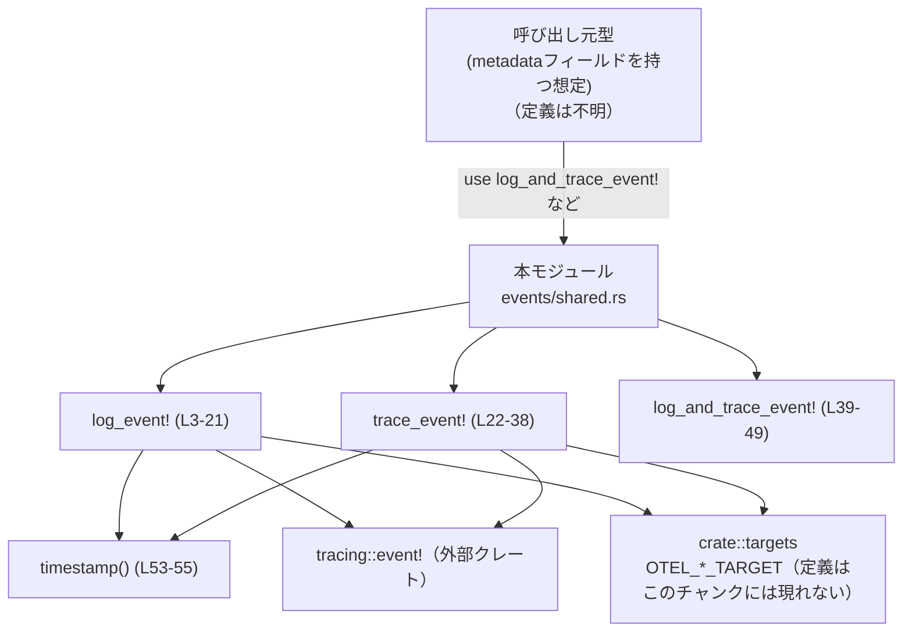
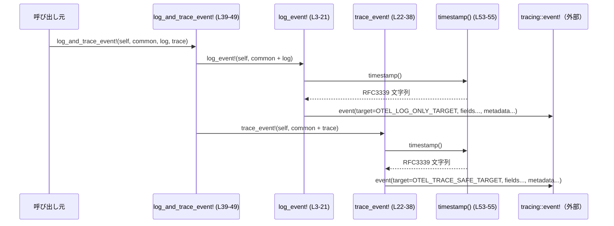

# otel/src/events/shared.rs

## 0. ざっくり一言

OpenTelemetry 向けのイベントログ／トレースを送るための **共通マクロ** と、RFC3339 形式の **タイムスタンプ生成関数**を定義するモジュールです【otel/src/events/shared.rs:L3-55】。

---

## 1. このモジュールの役割

### 1.1 概要

- このモジュールは、`tracing` クレートを使ったイベント送信で **共通して付与するフィールド（メタデータ）とタイムスタンプ** をまとめて付けるためのマクロ群を提供します【L3-49】。
- また、現在時刻を RFC3339（ミリ秒精度・UTC）で表す文字列を返す `timestamp()` 関数を提供します【L53-55】。
- これにより、ログ／トレース生成側は **イベント固有のフィールドだけ** を指定し、共通メタデータは自動で付与される構造になっています。

### 1.2 アーキテクチャ内での位置づけ

- 依存関係（このファイルから読み取れる範囲）:
  - 外部クレート: `chrono::Utc`, `chrono::SecondsFormat`【L1-2】（現在時刻→RFC3339文字列変換）
  - 外部クレート: `tracing::event!`, `tracing::Level::INFO`【L5-8, L24-27】
  - 同一クレート内: `$crate::targets::OTEL_LOG_ONLY_TARGET`, `$crate::targets::OTEL_TRACE_SAFE_TARGET`【L6, L25】
  - 同一クレート内: `$crate::events::shared::timestamp()`【L9, L28】
  - 呼び出し側の `self` が持つ `metadata` フィールド【L10-18, L29-35】（定義はこのチャンクには現れません）

依存関係のイメージ図（ノードには行範囲を付記しています）:



### 1.3 設計上のポイント

- **責務の分離**  
  - イベント送信処理のうち、「共通フィールドの付与」と「時刻フォーマット」をこのモジュールにまとめています【L3-49, L53-55】。
- **状態を持たない設計**  
  - グローバルな可変状態は一切なく、`timestamp()` も毎回 `Utc::now()` から値を生成するだけです【L53-55】。
- **ログとトレースの分離**  
  - `log_event!` と `trace_event!` で送信ターゲットとフィールドを変えており【L6, L25, L14-15, L33-35】、
    片方（ログ）のみユーザのアカウント情報・メールアドレスを含める構造になっています【L14-15, L33-35】。
- **エラー/安全性**  
  - `timestamp()` は `Result` を返さず、`chrono::Utc::now()` および `to_rfc3339_opts` の呼び出しのみで構成されるため、
    この関数自身としては明示的なエラー分岐はありません【L53-55】。
  - マクロは `tracing::event!` に委譲するだけで、例外的な制御フロー（`panic!` など）は直接書かれていません【L5-8, L24-27】。

---

## 2. 主要な機能一覧（コンポーネントインベントリー）

このファイルに登場する主要コンポーネントの一覧です。

| 名前 | 種別 | 可視性 | 役割 / 用途 | 行範囲（根拠） |
|------|------|--------|-------------|----------------|
| `log_event!` | マクロ | crate 内（`pub(crate) use` 経由） | ログ用ターゲット `OTEL_LOG_ONLY_TARGET` に対して、共通メタデータ＋任意のフィールドを付与して `tracing::event!` を発行する | 【otel/src/events/shared.rs:L3-21, L50-52】 |
| `trace_event!` | マクロ | crate 内（`pub(crate) use` 経由） | トレース用ターゲット `OTEL_TRACE_SAFE_TARGET` に対して、共通メタデータ＋任意のフィールドを付与して `tracing::event!` を発行する | 【L22-38, L50-52】 |
| `log_and_trace_event!` | マクロ | crate 内（`pub(crate) use` 経由） | 1 回の呼び出しで `log_event!` と `trace_event!` の両方を発行し、共通フィールドとログ専用／トレース専用フィールドを分けて指定できる | 【L39-49, L50-52】 |
| `timestamp()` | 関数 | `pub(crate)` | 現在の UTC 時刻をミリ秒精度の RFC3339 文字列（末尾 `Z`）に変換して返す | 【L53-55】 |

---

## 3. 公開 API と詳細解説

### 3.1 型一覧（構造体・列挙体など）

- このファイル内には、構造体や列挙体などの **新しい型定義は存在しません**【L1-55】。
- マクロ内で使用されている `self.metadata` の型や `metadata` フィールドの定義は、このチャンクには現れません【L10-18, L29-35】。

### 3.2 重要な関数・マクロの詳細

#### `timestamp() -> String`

**概要**

- 現在の UTC 時刻を取得し、**ミリ秒精度（小数点以下 3 桁）の RFC3339 形式の文字列**に変換して返す関数です【L53-55】。
- 例: `"2023-10-27T08:12:34.123Z"` のような形式になります（形式は `SecondsFormat::Millis` と `true` 引数から判断）【L53-55】。

**引数**

- 引数はありません【L53】。

**戻り値**

- 型: `String`
- 内容: 現在の UTC 時刻を RFC3339 形式（ミリ秒精度・UTC 表示）でフォーマットした文字列【L53-55】。

**内部処理の流れ**

1. `Utc::now()` で現在の UTC 時刻（`chrono::DateTime<Utc>`）を取得します【L54】。
2. `to_rfc3339_opts(SecondsFormat::Millis, true)` を呼び出し、ミリ秒精度かつタイムゾーンを UTC (`Z`) で付与した RFC3339 文字列に変換します【L54】。
3. 変換された `String` をそのまま返します【L54-55】。

**Examples（使用例）**

以下は、タイムスタンプを生成して標準出力に表示する単純な例です。

```rust
// 本モジュールの timestamp 関数をインポートする
use crate::events::shared::timestamp; // 実際のパスはこのファイルの位置に依存する

fn main() {
    // 現在時刻の RFC3339 文字列を取得する
    let ts = timestamp(); // 例: "2023-10-27T08:12:34.123Z"

    // ログ出力などで利用する
    println!("event at {}", ts);
}
```

**Errors / Panics**

- `timestamp()` は `Result` を返さず、内部で `?` なども使用していないため【L53-55】、
  この関数レベルでの明示的なエラー・戻り値は存在しません。
- `chrono::Utc::now()` や `to_rfc3339_opts` が panic するかどうかは、`chrono` クレート側の仕様に依存し、
  このファイルからは判断できません（コード上に panic 呼び出しはありません）。

**Edge cases（エッジケース）**

- 入力がない関数のため、典型的な「空入力」「境界値」といったエッジケースは存在しません。
- システム時刻が極端な値（非常に過去・未来）を返した場合でも、そのまま RFC3339 文字列として変換されると考えられますが、
  そのような状況での `chrono` の挙動はこのチャンクからは分かりません。

**使用上の注意点**

- 毎回 `Utc::now()` を呼ぶため、頻繁に呼び出せばその回数分だけ現在時刻の取得とフォーマット処理が発生します【L54】。
  - 一度だけ生成した時刻を使い回したい場合は、呼び出し側でキャッシュする必要があります。
- 戻り値は常に **UTC** 時刻であり、ローカルタイムへの変換は行いません【L53-55】。

---

#### マクロ `log_and_trace_event!($self, common: { ... }, log: { ... }, trace: { ... })`

> 以下ではマクロ `log_and_trace_event!` を、関数に準じた形式で説明します。

**概要**

- 1 回のマクロ呼び出しで
  - ログ用ターゲット `OTEL_LOG_ONLY_TARGET` 向けの `log_event!`
  - トレース用ターゲット `OTEL_TRACE_SAFE_TARGET` 向けの `trace_event!`
- の **2 つのイベント** を同時に発行するマクロです【L39-49】。
- `common` ブロックで共通フィールド、`log` ブロックでログ専用フィールド、`trace` ブロックでトレース専用フィールドを指定できます【L40-44, L46-47】。

**パラメータ**

（マクロの構文に基づく説明です【L39-44】）

| パラメータ | 型/パターン | 説明 |
|-----------|------------|------|
| `$self` | `expr` | `metadata` フィールドを持つ `self` などの式。`self.metadata.*` にアクセスされます【L46-47, 間接的に L10-18, L29-35】。|
| `common` | `{ $($common:tt)* }` | ログ・トレース共通で付与したいフィールド列（`tracing::event!` にそのまま渡されるトークン列）【L40-42, L46-47】。|
| `log` | `{ $($log:tt)* }` | ログ (`log_event!`) にのみ付与したい追加フィールド【L43, L46】。|
| `trace` | `{ $($trace:tt)* }` | トレース (`trace_event!`) にのみ付与したい追加フィールド【L44, L47】。|

**戻り値**

- マクロ展開結果は式ではなく、`log_event!` と `trace_event!` の呼び出し文になります【L46-47】。
- したがって **戻り値はありません**（`()` 相当）。

**内部処理の流れ（コンパイル時の展開イメージ）**

1. 呼び出し元の `log_and_trace_event!( $self, common: { ... }, log: { ... }, trace: { ... } )` を受け取ります【L39-44】。
2. 以下 2 行に展開されます【L46-47】:
   - `log_event!($self, $($common)* $($log)*);`
   - `trace_event!($self, $($common)* $($trace)*);`
3. さらに `log_event!` / `trace_event!` が、それぞれ `tracing::event!` 呼び出しに展開されます【L3-21, L22-38】。
4. その中で `timestamp()` が呼ばれ、`event.timestamp` フィールドとして埋め込まれます【L9, L28, L53-55】。
5. 最終的には、`tracing` のサブスクライバ（OpenTelemetry へのエクスポータなど）がこれらイベントを受け取ります（サブスクライバ側の処理はこのチャンクには現れません）。

**Examples（使用例）**

> 注意: 以下の `Metadata` 型やフィールド構成は、このファイルの `self.metadata.*` アクセスから推測した仮の例です【L10-18, L29-35】。実際の定義はこのチャンクには現れません。

```rust
// マクロをスコープに持ち込む
use crate::events::shared::log_and_trace_event; // 実際のパスはモジュール構成に依存

// 仮の Metadata 型。実際の定義はこのチャンクには現れない。
struct Metadata {
    conversation_id: String,
    app_version: String,
    auth_mode: &'static str,
    originator: String,
    account_id: Option<String>,
    account_email: Option<String>,
    terminal_type: String,
    model: String,
    slug: String,
}

// 仮のハンドラ型。実際には別モジュールに定義されていると考えられる。
struct Handler {
    metadata: Metadata, // log_event! / trace_event! が参照するフィールド
}

impl Handler {
    fn handle_login(&self) {
        log_and_trace_event!(
            self,
            common: {
                // ログとトレース両方に載せたいフィールド
                event.name = "user_login",
                outcome = "success",
            },
            log: {
                // ログにだけ載せたい詳細情報（PII を含み得る）
                user.agent = "browser",
            },
            trace: {
                // トレースにだけ載せたい軽量情報
                span.kind = "auth",
            },
        );
    }
}
```

この例では:

- `common` で指定した `event.name`, `outcome` はログ・トレース両方に出力されます。
- `log` 内の `user.agent` は `log_event!` 側にのみ渡されます【L46】。
- `trace` 内の `span.kind` は `trace_event!` 側にのみ渡されます【L47】。
- どちらの場合も、`conversation.id` や `app.version` などの共通メタデータはマクロ側で自動付与されます【L10-18, L29-35】。

**Errors / Panics**

- `log_and_trace_event!` 自体には `panic!` 呼び出しは含まれていません【L39-49】。
- マクロ展開先の `tracing::event!` も、通常はログ出力のための副作用を持つだけで、エラー値を返しません【L5-8, L24-27】。
- ただし、実際にイベントを処理する `tracing` のサブスクライバ実装によっては、内部で panic する可能性があります。
  そのような挙動の有無は、このチャンクからは分かりません。

**Edge cases（エッジケース）**

- `common`, `log`, `trace` のいずれかのブロックが **空** の場合でも、マクロのパターン的にはトークン列 `tt*` として許容されます【L40-44】。
  - 空ブロックを与えたときにコンパイルが通るかどうかは、実際の呼び出し方と `tracing::event!` の構文に依存します。
- `$self.metadata` にアクセスするため、`$self` の型が `metadata` フィールドを持っていない場合、**コンパイルエラー** になります【L46-47, 間接的に L10-18, L29-35】。

**使用上の注意点**

- **前提条件（契約）**
  - `$self` は `metadata` フィールドを持ち、その中に以下のフィールドが存在する必要があります【L10-18, L29-35】:
    - `conversation_id`, `app_version`, `auth_mode`, `originator`,
      `account_id`, `account_email`, `terminal_type`, `model`, `slug`
  - 上記が欠けているとコンパイルが通りません。
- **ログとトレースへの情報漏えい**
  - `log_event!` には `user.account_id`, `user.email` が含まれますが【L14-15】、
    `trace_event!` には含まれていません【L33-35】。
  - `common` ブロックに指定した情報はログとトレース両方に載るため、トレース側に出したくない PII を `common` に置かないようにする必要があります。
- **スレッド安全性**
  - このマクロは共有可変状態を持たず、`$self` の参照を使うだけです。
  - ただし `$self` および `metadata` の型が `Send`/`Sync` かどうかはこのチャンクからは分かりません。

### 3.3 その他のマクロ

主要マクロ以外（`log_event!` と `trace_event!`）の役割を簡単にまとめます。

| マクロ名 | 役割（1 行） | 行範囲（根拠） |
|---------|--------------|----------------|
| `log_event!($self, $($fields:tt)*)` | ログ専用ターゲット `OTEL_LOG_ONLY_TARGET` に対し、イベント固有フィールド `$fields` と共通メタデータ、タイムスタンプを付加して `tracing::event!` を呼び出す | 【L3-21】 |
| `trace_event!($self, $($fields:tt)*)` | トレース専用ターゲット `OTEL_TRACE_SAFE_TARGET` に対し、イベント固有フィールド `$fields` と共通メタデータ、タイムスタンプを付加して `tracing::event!` を呼び出す | 【L22-38】 |

---

## 4. データフロー

ここでは、`log_and_trace_event!` を呼び出した際の処理の流れを示します。

1. 呼び出し元が `log_and_trace_event!(self, common: { ... }, log: { ... }, trace: { ... })` を実行します【L39-44】。
2. マクロ展開により、`log_event!` と `trace_event!` の 2 つの呼び出しが生成されます【L46-47】。
3. 各マクロは
   - 呼び出し側で指定したフィールド列 (`$fields` / `$common`+`$log`/`$trace`)【L4, L23, L40-44, L46-47】
   - `timestamp()` が生成する `event.timestamp`【L9, L28, L53-55】
   - `$self.metadata.*` から取得する共通メタデータ【L10-18, L29-35】
   をまとめて `tracing::event!` に渡します【L5-8, L24-27】。
4. `tracing` クレートは登録済みのサブスクライバにイベントを配送し、OpenTelemetry エクスポータなどが最終的な送信を行います（サブスクライバの具体的な実装はこのチャンクには現れません）。

シーケンス図（関数・マクロ名と行範囲つき）:



---

## 5. 使い方（How to Use）

### 5.1 基本的な使用方法

典型的なフローは:

1. 呼び出し側の型に `metadata` フィールドを持たせる（実際の型定義はこのチャンクには現れませんが、`self.metadata.*` アクセスから推測されます【L10-18, L29-35】）。
2. その型のメソッド内などから `log_and_trace_event!` や `log_event!` / `trace_event!` を呼び出す。
3. 必要に応じて `timestamp()` を直接利用する。

簡略化した例:

```rust
use crate::events::shared::{log_and_trace_event, timestamp}; // マクロと関数をインポート

struct Handler {
    metadata: Metadata, // 実際の定義は別モジュール。self.metadata.* が使える必要がある。
}

impl Handler {
    fn run(&self) {
        // イベント時刻を自前でも使いたい場合
        let ts = timestamp(); // "2023-10-27T08:12:34.123Z" のような文字列

        // ログとトレースを同時に発行
        log_and_trace_event!(
            self,
            common: {
                event.name = "job_run",
                event.started_at = %ts,
            },
            log: {
                // ログ専用フィールド
                debug.message = "job started",
            },
            trace: {
                // トレース専用フィールド
                span.kind = "worker",
            },
        );
    }
}
```

### 5.2 よくある使用パターン

- **ログだけ出したい場合**: `log_event!` を直接使う【L3-21】。
- **トレースだけ出したい場合**: `trace_event!` を直接使う【L22-38】。
- **ログとトレース両方に似たイベントを送りたい場合**:
  - `log_and_trace_event!` を使うことで、共通部分を `common` にまとめつつ、
    PII を含む詳細情報をログ専用ブロックに分離するなどの使い分けができます【L39-47】。

### 5.3 よくある間違い

想定される誤用と正しい使い方を対比します。

```rust
// 誤り例 1: マクロをスコープにインポートしていない
// fn handle(&self) {
//     log_and_trace_event!(self, common: { event.name = "x" }, log: {}, trace: {}); // ここで未解決シンボルエラー
// }

// 正しい例: use でマクロをスコープに入れる
use crate::events::shared::log_and_trace_event;

fn handle(&self) {
    log_and_trace_event!(
        self,
        common: { event.name = "x" },
        log: {},
        trace: {},
    );
}
```

```rust
// 誤り例 2: self に metadata フィールドがない
struct HandlerWithoutMetadata {
    // metadata フィールドがない
}

impl HandlerWithoutMetadata {
    fn run(&self) {
        // log_event! 内で self.metadata.* にアクセスしようとしてコンパイルエラーになる
        // log_event!(self, event.name = "x"); // コンパイルエラー
    }
}

// 正しい例: metadata フィールドを持たせる
struct HandlerWithMetadata {
    metadata: Metadata, // 実際の定義はこのチャンクには現れない
}
```

### 5.4 使用上の注意点（まとめ）

- このモジュールは **crate 内専用**（`pub(crate)`）であり、クレート外から直接利用することはできません【L50-55】。
- `$self` の型に `metadata` フィールドが存在することが前提条件です【L10-18, L29-35】。
- `log_event!` にはユーザのアカウント情報・メールアドレスが含まれるため【L14-15】、
  ログの保存先や保持期間を含めたセキュリティ・プライバシーポリシーへの配慮が必要です。
- `trace_event!` 側にはそれらが含まれないため【L33-35】、トレース側をより「セーフ」な出力先として扱っていると解釈できますが、
  意図についてはコードからは断定できません。

---

## 6. 変更の仕方（How to Modify）

### 6.1 新しい機能を追加する場合

このファイルから読み取れる範囲での、自然な拡張パターンは次の通りです。

- **共通メタデータフィールドを増やしたい場合**
  - `log_event!` / `trace_event!` の `tracing::event!` 呼び出し部に、新しいフィールドを追加します【L5-18, L24-35】。
  - 追加したフィールドを提供するために、`metadata` 型に対応するフィールドを追加する必要があります（metadata 型の定義場所はこのチャンクには現れません）。
- **別ターゲット向けのイベント種別を増やしたい場合**
  - `log_event!` / `trace_event!` と同様のパターンで、新しいマクロを追加し、適切な `target:` を設定します【L5-7, L24-26】。
  - 必要に応じて `pub(crate) use` で再エクスポートします【L50-52】。

### 6.2 既存の機能を変更する場合

- **timestamp のフォーマットを変更したい場合**
  - `timestamp()` の `SecondsFormat::Millis` や `true` 引数を変更します【L54】。
  - 例えば秒精度にしたい場合は `SecondsFormat::Secs` に変えるなど、`chrono` の仕様に従って変更します。
- **ログ／トレースに出るフィールド構成を変えたい場合**
  - `log_event!` のフィールドリストを変更すると、ログにのみ影響します【L10-18】。
  - `trace_event!` のフィールドリストを変更すると、トレースにのみ影響します【L29-35】。
- 変更時の注意点:
  - 既存の利用箇所（マクロ呼び出し側）が期待するフィールド名との整合性を確認する必要があります。
  - メタデータフィールドを削除／名前変更すると、他モジュールのコードがコンパイルエラーになる可能性があります。

---

## 7. 関連ファイル

このモジュールと密接に関係していると推測できるコンポーネントを列挙します（いずれも、このチャンク内には定義が現れません）。

| パス / モジュール | 役割 / 関係 |
|-------------------|------------|
| `crate::targets` | `OTEL_LOG_ONLY_TARGET`, `OTEL_TRACE_SAFE_TARGET` を提供するモジュール。`tracing::event!` の `target:` に使用されています【L6, L25】。実際のファイルパス（例: `otel/src/targets.rs` など）はこのチャンクには現れません。|
| `crate::events::...` （不明） | `self.metadata` の型定義や、`metadata` フィールドを含む構造体（例: ハンドラ、サービス構造体など）が定義されていると考えられますが、具体的な位置はこのチャンクからは分かりません【L10-18, L29-35】。|
| テストコード | このファイル内にはテスト（`#[cfg(test)]` など）は存在しません【L1-55】。テストがどこか別に存在するかどうかは不明です。 |

このチャンクに基づき把握できるのは以上です。それ以外の構成や利用箇所は、他ファイルを確認しない限り分かりません。
