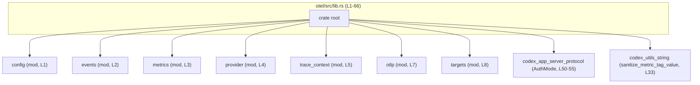
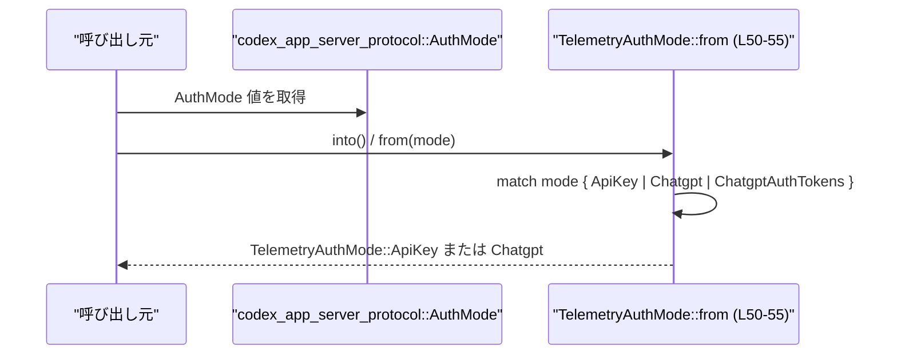
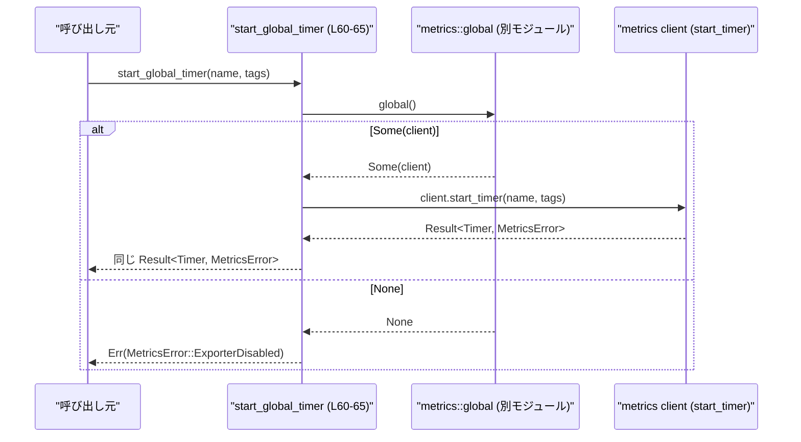

# otel/src/lib.rs

## 0. ざっくり一言

このファイルは OpenTelemetry まわりの **テレメトリー機能のクレートルート** で、設定・メトリクス・トレース・セッションテレメトリー関連の型と関数を再エクスポートしつつ、  
テレメトリー用の補助的な列挙型とグローバルなメトリクスタイマー開始関数を提供しています（`otel/src/lib.rs:L1-33,35-66`）。

---

## 1. このモジュールの役割

### 1.1 概要

- このモジュールは **テレメトリー機能の公開 API を一か所に集約するクレートルート** として機能します（`mod` と大量の `pub use` より、`otel/src/lib.rs:L1-33`）。
- テレメトリーイベントで使う決定ソースや認証モードを表す列挙型を定義し（`ToolDecisionSource`, `TelemetryAuthMode`）、他モジュールから独立したシンプルな表現を提供します（`otel/src/lib.rs:L35-48`）。
- グローバルに登録されたメトリクスクライアントを使って **計測タイマーを開始するヘルパ関数** を提供します（`start_global_timer`, `otel/src/lib.rs:L60-65`）。

### 1.2 アーキテクチャ内での位置づけ

このファイルはクレートのエントリーポイントとして、内部モジュールと外部クレートをまとめます。

- 内部モジュール:
  - `config`, `metrics`, `provider`, `trace_context`（`pub(crate) mod`、`otel/src/lib.rs:L1-5`）
  - `events`, `otlp`, `targets`（クレート内 private、`otel/src/lib.rs:L2,7-8`）
- 外部クレート:
  - `codex_app_server_protocol`（認証モードの列挙体を利用、`otel/src/lib.rs:L50-55`）
  - `codex_utils_string::sanitize_metric_tag_value`（メトリクスタグ値のユーティリティを公開、`otel/src/lib.rs:L33`）
  - `serde` / `strum_macros`（シリアライズと表示用の derive、`otel/src/lib.rs:L35-36,44`）

Mermaid 図（このファイル全体 `otel/src/lib.rs:L1-66` の位置づけ）:



### 1.3 設計上のポイント

コードから読み取れる特徴:

- **公開 API の集約ポイント**
  - 多数の `pub use` によって、利用者は `otel` クレートルートから主要な型と関数にアクセスできます（`otel/src/lib.rs:L14-33`）。
- **循環依存回避のための薄いアダプタ**
  - `TelemetryAuthMode` はコメントにあるように `codex_app_server_protocol::AuthMode` をラップし、`codex-core` との循環依存を避けるために導入されています（`otel/src/lib.rs:L43-48,50-55`）。
- **シリアライズ／表示の整備された列挙型**
  - `ToolDecisionSource` は `Serialize` と `Display` を derive し、snake_case シリアライズを指定しています（`otel/src/lib.rs:L35-40`）。テレメトリーイベントのフィールドとしての利用が前提と考えられます（根拠: シリアライズ属性）。
- **グローバル状態への薄いラッパ**
  - `start_global_timer` は `crate::metrics::global()` というグローバルアクセサを通じてメトリクスクライアントを取得し、`metrics.start_timer` を呼び出す小さなラッパです（`otel/src/lib.rs:L60-65`）。
  - `metrics::global()` の実装はこのチャンクには現れず、並行性や初期化タイミングの詳細は不明です。

---

## 2. 主要な機能一覧

このファイルが提供・再エクスポートする主な機能は次のとおりです。

- テレメトリー設定関連の型の公開（`OtelExporter`, `OtelHttpProtocol`, `OtelSettings`, `OtelTlsConfig` など、`otel/src/lib.rs:L14-17`）
- セッションテレメトリー用の型の公開（`SessionTelemetry`, `SessionTelemetryMetadata`, `AuthEnvTelemetryMetadata`、`otel/src/lib.rs:L18-20`）
- ランタイムメトリクスとタイマーの公開（`RuntimeMetricTotals`, `RuntimeMetricsSummary`, `Timer`, `metrics::*`、`otel/src/lib.rs:L21-24`）
- OpenTelemetry プロバイダの公開（`OtelProvider`、`otel/src/lib.rs:L25`）
- トレースコンテキスト操作関数の公開（`context_from_w3c_trace_context` など、`otel/src/lib.rs:L26-32`）
- メトリクスタグ文字列のサニタイズ関数の公開（`sanitize_metric_tag_value`、`otel/src/lib.rs:L33`）
- ツールの意思決定ソースを表す列挙型 `ToolDecisionSource`（`otel/src/lib.rs:L35-41`）
- テレメトリー用の認証モード列挙型 `TelemetryAuthMode` と、その `AuthMode` からの変換（`otel/src/lib.rs:L43-48,50-55`）
- グローバルメトリクスクライアントを使ったタイマー開始ヘルパ（`start_global_timer`、`otel/src/lib.rs:L60-65`）

---

## 3. 公開 API と詳細解説

### 3.1 型一覧（構造体・列挙体など）

#### このファイル内で定義されている型

| 名前 | 種別 | 役割 / 用途 | 定義位置 |
|------|------|-------------|----------|
| `ToolDecisionSource` | 列挙体 (`enum`) | ツール（レビューアなど）の意思決定がどこから来たかを表すソース種別 | `otel/src/lib.rs:L35-41` |
| `TelemetryAuthMode` | 列挙体 (`enum`) | テレメトリーに記録する認証モードを表す内部用列挙体 | `otel/src/lib.rs:L43-48` |

`ToolDecisionSource` 詳細（`otel/src/lib.rs:L35-41`）:

- バリアント:
  - `AutomatedReviewer`
  - `Config`
  - `User`
- 属性・derive:
  - `#[derive(Debug, Clone, Serialize, Display)]`
  - `#[serde(rename_all = "snake_case")]`
- これにより:
  - シリアライズ時に `automated_reviewer`, `config`, `user` という snake_case 文字列になる（根拠: `rename_all = "snake_case"`）。
  - `Display` 実装は `strum_macros::Display` に任されており、人間向けの文字列表現を持ちます（具体的な形式は `strum` のデフォルトに依存し、このチャンクからは詳細不明）。

`TelemetryAuthMode` 詳細（`otel/src/lib.rs:L43-48`）:

- バリアント:
  - `ApiKey`
  - `Chatgpt`
- derive:
  - `Debug`, `Clone`, `Copy`, `PartialEq`, `Eq`, `Display`
- コメントによる意図:
  - 「API/auth `AuthMode` への対応付けにより codex-core への循環依存を避ける」（`otel/src/lib.rs:L43`）  
    → 外部プロトコルの `AuthMode` をそのままログやメトリクスに使わず、この軽量 enum に写像して利用するための型です。

#### このファイルから再エクスポートされる主な型

定義は他モジュールにありますが、このファイル経由で公開されるものを列挙します。

| 名前 | 種別 | 役割 / 用途 | 定義位置（再エクスポート） | 備考 |
|------|------|-------------|----------------------------|------|
| `OtelExporter` | 不明（別モジュール） | テレメトリーエクスポートに関連する型と推測されますが、本チャンクからは断定できません | `otel/src/lib.rs:L14` | 定義は `config` モジュール |
| `OtelHttpProtocol` | 不明 | HTTP プロトコル設定を扱う可能性がありますが、詳細不明 | `otel/src/lib.rs:L15` | 同上 |
| `OtelSettings` | 不明 | OpenTelemetry 設定全体を表す可能性がありますが、詳細不明 | `otel/src/lib.rs:L16` | 同上 |
| `OtelTlsConfig` | 不明 | TLS 設定関連と推測されますが、詳細不明 | `otel/src/lib.rs:L17` | 同上 |
| `AuthEnvTelemetryMetadata` | 不明 | セッションテレメトリー関連のメタデータと推測されます | `otel/src/lib.rs:L18` | 定義は `events::session_telemetry` |
| `SessionTelemetry` | 不明 | セッション単位のテレメトリー本体と推測されます | `otel/src/lib.rs:L19` | 同上 |
| `SessionTelemetryMetadata` | 不明 | セッションテレメトリーのメタ情報と推測されます | `otel/src/lib.rs:L20` | 同上 |
| `RuntimeMetricTotals` | 不明 | ランタイムメトリクスの総計と推測されます | `otel/src/lib.rs:L21` | 定義は `metrics::runtime_metrics` |
| `RuntimeMetricsSummary` | 不明 | ランタイムメトリクスのサマリと推測されます | `otel/src/lib.rs:L22` | 同上 |
| `Timer` | 不明 | 計測タイマーを表す型と推測されます | `otel/src/lib.rs:L23` | 定義は `metrics::timer` |
| `OtelProvider` | 不明 | OpenTelemetry プロバイダの実装に関する型と推測されます | `otel/src/lib.rs:L25` | 定義は `provider` |
| （その他 `metrics::*`） | 不明 | メトリクス関連の公開 API 全体 | `otel/src/lib.rs:L24` | 具体的な一覧はこのチャンクには現れません |
| `context_from_w3c_trace_context` ほか | 不明 | W3C Trace Context 操作用の関数群 | `otel/src/lib.rs:L26-32` | 定義は `trace_context` |
| `sanitize_metric_tag_value` | 不明（外部クレート） | タグ値を整形／サニタイズする関数と推測されます | `otel/src/lib.rs:L33` | 定義は `codex_utils_string` クレート |

> 備考欄での用途は **命名からの推測** であり、厳密な挙動は各モジュールのコードを確認しないと断定できません。

### 3.2 関数詳細

このチャンクには 2 つの関数（メソッドを含む）が定義されています。

#### `impl From<codex_app_server_protocol::AuthMode> for TelemetryAuthMode`

```rust
impl From<codex_app_server_protocol::AuthMode> for TelemetryAuthMode { // otel/src/lib.rs:L50
    fn from(mode: codex_app_server_protocol::AuthMode) -> Self {      // otel/src/lib.rs:L51
        match mode {                                                  // otel/src/lib.rs:L52
            codex_app_server_protocol::AuthMode::ApiKey => Self::ApiKey,
            codex_app_server_protocol::AuthMode::Chatgpt
            | codex_app_server_protocol::AuthMode::ChatgptAuthTokens => Self::Chatgpt,
        }                                                             // otel/src/lib.rs:L53-55
    }                                                                 // otel/src/lib.rs:L57
}
```

**概要**

- 外部プロトコルで定義された `AuthMode` を、内部の `TelemetryAuthMode` に変換するための `From` 実装です（`otel/src/lib.rs:L50-55`）。
- これにより `TelemetryAuthMode::from(auth_mode)` や `auth_mode.into()` といった形で安全に変換できます。

**引数**

| 引数名 | 型 | 説明 |
|--------|----|------|
| `mode` | `codex_app_server_protocol::AuthMode` | 外部プロトコルで使われる認証モードの列挙値 |

**戻り値**

- 型: `TelemetryAuthMode`
- 意味: テレメトリーで記録するために集約された認証モード。`ApiKey` か `Chatgpt` のいずれか（`otel/src/lib.rs:L45-48`）。

**内部処理の流れ**

1. 引数 `mode` を `match` で分岐します（`otel/src/lib.rs:L52`）。
2. `AuthMode::ApiKey` の場合は `TelemetryAuthMode::ApiKey` を返します（`otel/src/lib.rs:L53`）。
3. `AuthMode::Chatgpt` または `AuthMode::ChatgptAuthTokens` のいずれかの場合、`TelemetryAuthMode::Chatgpt` にまとめて返します（`otel/src/lib.rs:L54-55`）。
4. 他のバリアントはこのチャンクに現れておらず、`match` は現時点で定義されているバリアントをすべて網羅しています。

**Examples（使用例）**

```rust
use codex_app_server_protocol::AuthMode;                   // 外部プロトコルのAuthMode
use crate::TelemetryAuthMode;                             // 同一クレート内から利用する場合 // otel/src/lib.rs から公開

fn to_telemetry_mode(mode: AuthMode) -> TelemetryAuthMode {
    mode.into()                                           // From実装により自動で変換
}
```

この例では `AuthMode` を内部表現の `TelemetryAuthMode` に統一してからテレメトリーに記録できます。

**Errors / Panics**

- この関数は `From` 実装であり、戻り値は常に `TelemetryAuthMode` です。
- `match` がすべてのバリアントを網羅している限り、エラーや `panic!` を起こすコードは含まれていません（`otel/src/lib.rs:L52-55`）。

**Edge cases（エッジケース）**

- 新しい `AuthMode` バリアントが `codex_app_server_protocol` 側で追加された場合:
  - コンパイル時に `match` が非網羅としてエラーになるため、ランタイムで不正値が素通りするリスクはありません（Rust のパターンマッチ特性による一般論）。
- `Chatgpt` と `ChatgptAuthTokens` は両方とも `TelemetryAuthMode::Chatgpt` に集約されます（`otel/src/lib.rs:L54-55`）:
  - テレメトリー上ではこれらを区別しない設計です。

**使用上の注意点**

- 認証モードの細かい区別（特に ChatGPT 周辺）が必要なテレメトリーを取りたい場合、この集約ロジックが適切か確認する必要があります。
- `TelemetryAuthMode` に新たなバリアントを追加する場合は、この `From` 実装を必ず更新する必要があります。

---

#### `start_global_timer(name: &str, tags: &[(&str, &str)]) -> MetricsResult<Timer>`

```rust
/// Start a metrics timer using the globally installed metrics client. // otel/src/lib.rs:L60
pub fn start_global_timer(name: &str, tags: &[(&str, &str)]) -> MetricsResult<Timer> { // L61
    let Some(metrics) = crate::metrics::global() else {                                // L62
        return Err(MetricsError::ExporterDisabled);                                    // L63
    };
    metrics.start_timer(name, tags)                                                   // L65
}
```

**概要**

- グローバルにインストールされたメトリクスクライアント（`crate::metrics::global()`）を使って、名前とタグ付きの計測タイマーを開始するヘルパ関数です（`otel/src/lib.rs:L60-65`）。
- メトリクスクライアントが無効（`None`）の場合はエラーを返します。

**引数**

| 引数名 | 型 | 説明 |
|--------|----|------|
| `name` | `&str` | タイマーの名前。メトリクスシステム上で識別子として使われます。 |
| `tags` | `&[(&str, &str)]` | タグの配列。`(キー, 値)` のスライスとして表現されます。 |

**戻り値**

- 型: `MetricsResult<Timer>`
  - `use crate::metrics::Result as MetricsResult;` より、`crate::metrics` で定義された `Result` 型エイリアスです（`otel/src/lib.rs:L10`）。
  - 具体的なエラー型（`MetricsError` など）は `metrics` モジュール側の定義に依存し、このチャンクには現れません。
- 意味:
  - `Ok(Timer)` : タイマーの開始に成功し、`Timer` オブジェクトを返します。
  - `Err(MetricsError::ExporterDisabled)` : グローバルメトリクスクライアントが利用できない場合（`crate::metrics::global()` が `None` の場合）に返されます（`otel/src/lib.rs:L62-63`）。
  - その他の `Err(...)` が `metrics.start_timer(name, tags)` から返される可能性がありますが、その詳細は `metrics` モジュールに依存し、このチャンクには現れません（`otel/src/lib.rs:L65`）。

**内部処理の流れ**

1. `crate::metrics::global()` を呼び出して、グローバルメトリクスクライアントを取得しようとします（`otel/src/lib.rs:L62`）。
2. `let Some(metrics) = ... else { ... };` というパターンマッチにより、  
   - `Some(metrics)` の場合: 変数 `metrics` にクライアントを束縛して処理を継続。
   - `None` の場合: `Err(MetricsError::ExporterDisabled)` を返して早期リターンします（`otel/src/lib.rs:L62-63`）。
3. `metrics.start_timer(name, tags)` を呼び出し、その結果（`MetricsResult<Timer>`）をそのまま返します（`otel/src/lib.rs:L65`）。

**Examples（使用例）**

基本的な利用例（同一クレート内での呼び出し）:

```rust
use crate::start_global_timer;                                    // otel/src/lib.rs から公開される関数
// use crate::Timer;                                              // Timer型も同ファイルから再エクスポートされる（otel/src/lib.rs:L23）

fn handle_request() {
    let tags = [("endpoint", "/api/v1/foo"), ("method", "GET")];  // タグを (key, value) の配列で定義

    // タイマー開始。Result を明示的に処理する。
    let timer = match start_global_timer("request_latency", &tags) {
        Ok(t) => t,                                               // タイマー開始成功
        Err(_e) => {
            // メトリクスが無効な場合など、失敗してもアプリ本体は継続したいケースが多い
            return;
        }
    };

    // ここで何らかの処理を行う
    // do_work();

    // Timerの具体的な挙動（Drop 時に記録される等）は metrics::timer の実装に依存し、このチャンクからは不明
    drop(timer);                                                  // 明示的に破棄して計測終了をトリガーする可能性がある
}
```

> `Timer` が Drop 時に経過時間を記録する RAII 型かどうかは **このチャンクには定義が現れません**。  
> ここでは一般的なメトリクスタイマーのパターンとして例示しています。

**Errors / Panics**

- 明示的な `panic!` 呼び出しはありません。
- エラー条件:
  - `MetricsError::ExporterDisabled`:
    - `crate::metrics::global()` が `None` を返す場合（グローバルメトリクスクライアントが未設定または無効な場合）に発生します（`otel/src/lib.rs:L62-63`）。
  - その他のエラー:
    - `metrics.start_timer(name, tags)` から返されるエラー値。詳細は `metrics` モジュール内の実装によります（`otel/src/lib.rs:L65`）。

**Edge cases（エッジケース）**

- **グローバルメトリクスクライアント未設定**
  - 初期化前に `start_global_timer` を呼び出すと `Err(MetricsError::ExporterDisabled)` が返ります（`otel/src/lib.rs:L62-63`）。
- **`name` が空文字列の場合**
  - この関数内では `name` の検証は行っていません（`otel/src/lib.rs:L61-65`）。  
    `metrics.start_timer` 側でどのように扱うかは不明です。利用前に仕様確認が必要です。
- **`tags` が空配列の場合**
  - 特別な処理はなく、そのまま渡されます（`otel/src/lib.rs:L61,65`）。  
    空タグを許容するかどうかも `metrics.start_timer` の仕様に依存します。
- **`tags` 内のキー／値が不正なフォーマット**
  - この関数内ではサニタイズや検証を行っていません（`otel/src/lib.rs:L61-65`）。  
    必要であれば `sanitize_metric_tag_value` など別のユーティリティを組み合わせる必要があります。

**使用上の注意点**

- **前提条件**
  - `crate::metrics::global()` によるグローバルクライアントの初期化が済んでいることが前提です。  
    初期化前に呼ぶと `ExporterDisabled` エラーとなります（`otel/src/lib.rs:L62-63`）。
- **エラーを無視しない**
  - メトリクスが必須でない場合でも、エラーを意識的に無視するかログに残すかを決める必要があります。
- **タグに秘密情報を含めない**
  - 一般にメトリクスタグは外部システムに送信されることが多いため、ユーザー名やトークンなど機密情報をタグに含めるのは避けるのが慣行です（一般的なテレメトリー運用上の注意）。
- **ライフタイムの確認**
  - `tags` は `&[(&str, &str)]` で渡されますが、`Timer` がそれらの参照を内部に保持するかどうかはこのチャンクからは分かりません。  
    安全を確認するためには `Timer` および `metrics.start_timer` の実装を確認する必要があります。

### 3.3 その他の関数

- 上記 2 つ以外に、このチャンクには追加の関数定義は現れません。

---

## 4. データフロー

ここでは代表的な 2 つの処理フローを図示します。

### 4.1 認証モードの変換フロー

外部の `AuthMode` から内部の `TelemetryAuthMode` への変換フローです。



- 実装位置は `otel/src/lib.rs:L50-55` です。
- 呼び出し元は外部プロトコルに依存しつつも、テレメトリー側では `TelemetryAuthMode` のみを扱う構造になっています。

### 4.2 グローバルタイマー開始フロー

`start_global_timer` の呼び出しからメトリクスタイマー作成までのフローです。



- `Root` の実装は `otel/src/lib.rs:L60-65` にあります。
- `metrics::global` と `client.start_timer` の実装はこのチャンクには現れません。

---

## 5. 使い方（How to Use）

### 5.1 基本的な使用方法

#### 5.1.1 認証モードの変換とテレメトリー記録

```rust
use codex_app_server_protocol::AuthMode;          // プロトコル層の認証モード
use crate::TelemetryAuthMode;                     // otel/src/lib.rs から公開される型

fn record_auth_telemetry(mode: AuthMode) {
    let telemetry_mode: TelemetryAuthMode = mode.into(); // From実装により変換

    // ここで telemetry_mode をメトリクスやログのタグなどに埋め込む
    // e.g., as a string: telemetry_mode.to_string()
}
```

#### 5.1.2 グローバルタイマーで処理時間を計測する

```rust
use crate::start_global_timer;                    // otel/src/lib.rs:L60-65

fn process_request() {
    let tags = [
        ("endpoint", "/v1/items"),                // エンドポイント名
        ("method", "GET"),                        // HTTPメソッド
    ];

    // タイマー開始。失敗しても本処理は継続する例。
    let timer = match start_global_timer("request_latency", &tags) {
        Ok(t) => Some(t),                         // 成功時: Timerを保持
        Err(_e) => None,                          // 失敗時: メトリクスを諦める
    };

    // 実際の処理
    // handle_business_logic();

    // Timerの具体的な役割は metrics::timer の実装に依存
    drop(timer);                                  // Option<Timer> を drop してスコープを終える
}
```

### 5.2 よくある使用パターン

1. **メトリクスが任意の環境での緩やかな利用**

   - 開発環境やテスト環境ではメトリクスエクスポータを無効にし、本番環境でのみ有効化する構成が想定されます。
   - `start_global_timer` のエラーを致命的扱いにせず、ログ等に記録して無視するパターンが有効です。

   ```rust
   if let Err(e) = start_global_timer("job_duration", &[]) {
       // ログなどに記録するが、ジョブ自体は継続
       // log::debug!("metrics disabled: {:?}", e);
   }
   ```

2. **`TelemetryAuthMode` をタグ値として使う**

   ```rust
   use codex_app_server_protocol::AuthMode;
   use crate::{TelemetryAuthMode, start_global_timer};

   fn handle_auth(mode: AuthMode) {
       let telemetry_mode: TelemetryAuthMode = mode.into();
       let mode_str = telemetry_mode.to_string();          // Display派生による文字列化（L44-48）

       let tags = [("auth_mode", mode_str.as_str())];

       let _ = start_global_timer("auth_flow_latency", &tags);
       // 認証処理本体…
   }
   ```

   `TelemetryAuthMode` の文字列表現の具体的フォーマットは `strum_macros::Display` の設定に依存し、このチャンクからは詳細不明です（`otel/src/lib.rs:L44-48`）。

### 5.3 よくある間違い

```rust
// 間違い例: グローバルメトリクスクライアントの初期化を考慮せずに呼び出し
fn do_work() {
    let _timer = start_global_timer("work", &[]).unwrap(); // 初期化前だと Err を unwrap して panic する危険
}

// 正しい例: エラーの可能性を考慮して扱う
fn do_work_safe() {
    let _timer = match start_global_timer("work", &[]) {
        Ok(t) => Some(t),
        Err(_e) => None, // ここでログに残すなどの処理を行う方が安全
    };

    // 実際の処理…
}
```

### 5.4 使用上の注意点（まとめ）

- `TelemetryAuthMode` に新しいバリアントを追加する場合は、`From<AuthMode>` 実装の更新が必須です（`otel/src/lib.rs:L50-55`）。
- `start_global_timer` はグローバルメトリクスクライアントの初期化状態に依存し、未初期化時には `Err` を返します（`otel/src/lib.rs:L62-63`）。
- `start_global_timer` はタグ内容の検証やサニタイズを行いません。タグの仕様や機密性に注意する必要があります。
- 並行環境での安全性や性能特性は `metrics::global()` とタイマー実装に依存し、このチャンクだけでは判断できません。

---

## 6. 変更の仕方（How to Modify）

### 6.1 新しい機能を追加する場合

1. **新しいテレメトリー種別を追加したい場合**
   - 例: `ToolDecisionSource` に新しいソースを追加したい。
   - 変更箇所:
     - `ToolDecisionSource` の列挙体に新しいバリアントを追加（`otel/src/lib.rs:L35-41`）。
     - そのバリアントがシリアライズされる形式は `snake_case` になるため、API 仕様に影響するか確認が必要です。

2. **新しい公開ヘルパ関数を追加したい場合**
   - 例: グローバルカウンタやゲージ更新用ヘルパ。
   - 推奨手順:
     - 実際のメトリクス操作ロジックは `metrics` モジュール側に実装する。
     - その上で、このファイルに薄いラッパ関数を追加し、`crate::metrics::global()` からクライアントを取得して呼び出すパターンを踏襲する（`start_global_timer` と同様の形、`otel/src/lib.rs:L60-65`）。

3. **再エクスポートの追加**
   - 新しいモジュールや型を公開したい場合は、このファイルに `pub use crate::xxx::TypeName;` を追加します（`otel/src/lib.rs:L14-33` を参考）。

### 6.2 既存の機能を変更する場合

- **`TelemetryAuthMode` / `AuthMode` の関係を変更する**
  - 影響範囲:
    - `TelemetryAuthMode` enum 定義（`otel/src/lib.rs:L45-48`）
    - `From<AuthMode>` 実装（`otel/src/lib.rs:L50-55`）
    - `TelemetryAuthMode` を利用している箇所（このチャンクには現れませんが、クレート全体で検索が必要）
  - 注意点:
    - 変換ロジックを変えると、テレメトリーデータの意味が変化します。ダッシュボードやアラート設定への影響を確認する必要があります。

- **`start_global_timer` のエラー挙動を変更する**
  - 例えば、`ExporterDisabled` でなく `Ok` を返すように変えると、メトリクス有効／無効の判定が難しくなります。
  - 変更前に:
    - `start_global_timer` を直接呼び出している箇所のエラーハンドリング方針を洗い出す。
    - `MetricsError` の利用箇所・意味を `metrics` モジュール側含めて確認する。

---

## 7. 関連ファイル

このファイルと密接に関係するモジュール・ファイルは以下のとおりです。

| パス / モジュール | 役割 / 関係 |
|-------------------|------------|
| `otel/src/config.rs`（推定） / `mod config;` | `OtelExporter`, `OtelHttpProtocol`, `OtelSettings`, `OtelTlsConfig` の定義元。設定関連のロジックを含むと考えられますが、このチャンクだけでは詳細は分かりません（`otel/src/lib.rs:L1,14-17`）。 |
| `otel/src/events/...` / `mod events;` | `SessionTelemetry` などセッションテレメトリー構造体の定義元（`otel/src/lib.rs:L2,18-20`）。 |
| `otel/src/metrics/...` / `mod metrics;` | メトリクスクライアント、`Result` エイリアス、`Timer` などの定義元。`metrics::global()` や `metrics.start_timer` の実装がここにあると考えられます（`otel/src/lib.rs:L3,10,21-24,62,65`）。|
| `otel/src/provider.rs` / `mod provider;` | `OtelProvider` の定義元。OpenTelemetry プロバイダの構築・管理を扱うと推測されます（`otel/src/lib.rs:L4,25`）。 |
| `otel/src/trace_context.rs` / `mod trace_context;` | `context_from_w3c_trace_context` などトレースコンテキスト関連 API の定義元（`otel/src/lib.rs:L5,26-32`）。 |
| `otel/src/otlp.rs` / `mod otlp;` | OTLP（OpenTelemetry Protocol）関連の実装を含む可能性がありますが、このチャンクには定義が現れません（`otel/src/lib.rs:L7`）。 |
| `otel/src/targets.rs` / `mod targets;` | エクスポート先ターゲットに関する設定・実装を含むと推測されます（`otel/src/lib.rs:L8`）。 |
| 外部クレート `codex_app_server_protocol` | `AuthMode` の定義元。`TelemetryAuthMode` への変換元となるプロトコルレベルの認証モードを提供します（`otel/src/lib.rs:L50-55`）。 |
| 外部クレート `codex_utils_string` | `sanitize_metric_tag_value` の定義元。メトリクスタグ値の処理に利用されます（`otel/src/lib.rs:L33`）。 |

> 上記のうち、モジュールの中身はこのチャンクには含まれていないため、表中の用途は主に命名からの推測です。正確な挙動を知るには該当ファイルのコードを確認する必要があります。
