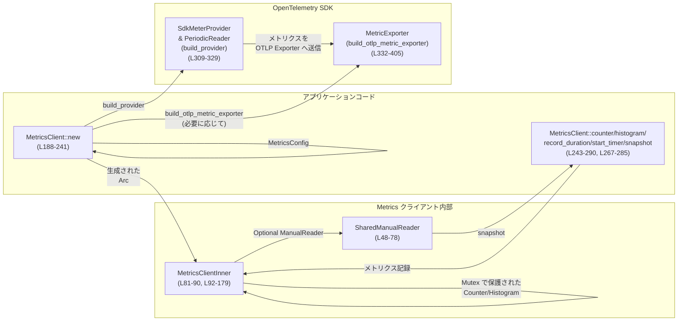
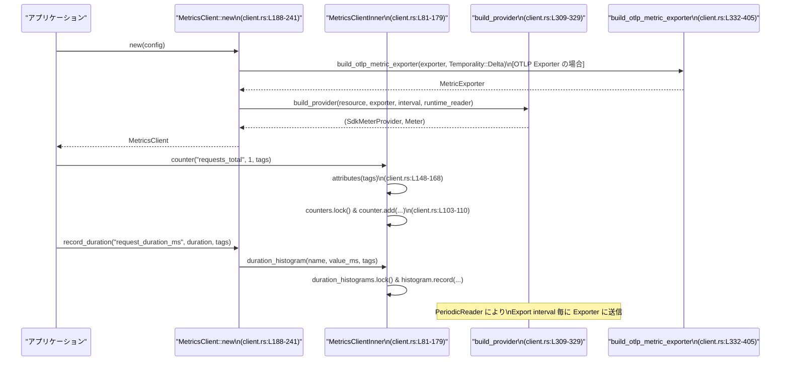

# otel/src/metrics/client.rs コード解説

## 0. ざっくり一言

- OpenTelemetry ベースのメトリクス送信パイプラインを構築し、カウンタ・ヒストグラム・処理時間・ランタイムスナップショットの送信／取得を行うクライアントです（`MetricsClient`）。  
  （`client.rs:L182-241`）

---

## 1. このモジュールの役割

### 1.1 概要

- このモジュールは **Codex アプリケーションから OTEL メトリクスを送信するためのクライアント** を提供します。  
- 設定（`MetricsConfig`）から OpenTelemetry SDK の `SdkMeterProvider` と OTLP Exporter を組み立て、`MetricsClient` 経由で  
  - カウンタ  
  - 通常のヒストグラム値  
  - 所要時間（ミリ秒）のヒストグラム  
  を記録します。（`client.rs:L188-241`）
- また、任意でランタイムメトリクスを取得するための `ManualReader` を組み込み、スナップショット取得 API を提供します。（`client.rs:L214-220`,`L276-285`）

### 1.2 アーキテクチャ内での位置づけ

このファイル内の主なコンポーネントの関係を図示します。



- アプリ側は `MetricsClient::new` でクライアントを作成し、以後のメトリクス送信は `MetricsClient` のメソッドを通じて行います。（`client.rs:L188-241,L243-290`）  
- 実際のメトリクス記録ロジックは `MetricsClientInner` が持ち、`Arc` + `Mutex` を用いてスレッド安全にカウンタ・ヒストグラムをキャッシュしています。（`client.rs:L81-90,L92-146`）  
- OTLP の Exporter の具体的な構築は `build_otlp_metric_exporter` に切り出されています。（`client.rs:L332-405`）

### 1.3 設計上のポイント

コードから読み取れる設計上の特徴です。

- **公開 API と内部実装の分離**  
  - 公開 API は `MetricsClient` のみで、内部状態は `MetricsClientInner` にカプセル化されています。（`client.rs:L182-185`）
- **スレッド安全性**  
  - メトリクスインストゥルメント（カウンタ・ヒストグラム）は `Mutex<HashMap<..>>` でキャッシュされ、複数スレッドから安全に使えるようになっています。（`client.rs:L85-87`）  
  - `Arc` による共有所有権と `Mutex` による排他制御を組み合わせています。
- **Mutex ポイズン時の扱い**  
  - `lock()` の結果を `unwrap_or_else(std::sync::PoisonError::into_inner)` で処理しており、ポイズン（別スレッドでのパニック）発生後もロック中の値を強制的に取り出して処理を継続します。（`client.rs:L103-106,L118-121,L133-136`）
- **メトリクス名・タグのバリデーション**  
  - メトリクス名とタグは `validate_metric_name` や `validate_tag_key/value/tags` を通して検証され、不正値は早期にエラーとなります。（`client.rs:L94,L148-161,L199`）
- **Exporter 構築の抽象化**  
  - OTLP gRPC / HTTP それぞれの Exporter 設定処理を `build_otlp_metric_exporter` が担当します。（`client.rs:L332-405`）
- **ランタイムメトリクスのスナップショット**  
  - `runtime_reader: Option<Arc<ManualReader>>` を持ち、設定で有効化された場合にのみ `snapshot()` が利用可能です。（`client.rs:L88,L214-220,L276-285`）
- **Duration 計測専用のヒストグラム**  
  - 単位 `"ms"` と説明 `"Duration in milliseconds."` を付与したヒストグラムを別管理しています。（`client.rs:L45-46,L129-145`）

---

## 2. コンポーネント一覧と主要機能

### 2.1 コンポーネント一覧（型・主要フィールド）

| 名前 | 種別 | 公開範囲 | 役割 / 用途 | 行範囲 |
|------|------|----------|-------------|--------|
| `SharedManualReader` | 構造体 | 非公開 | `Arc<ManualReader>` を `MetricReader` として共有しやすくするラッパー | `client.rs:L48-51` |
| `MetricsClientInner` | 構造体 | 非公開 | メーター・カウンタ・ヒストグラム・ランタイムリーダなど内部状態を保持 | `client.rs:L81-90` |
| `MetricsClient` | 構造体（tuple struct） | 公開 | アプリから利用するメトリクスクライアント。`Arc<MetricsClientInner>` を包む | `client.rs:L182-185` |

主要なフィールド（`MetricsClientInner`）:

| フィールド名 | 型 | 説明 | 行 |
|-------------|----|------|----|
| `meter_provider` | `SdkMeterProvider` | OTEL メトリクスのプロバイダ。shutdown/flush を管理 | `client.rs:L83` |
| `meter` | `Meter` | メトリクスインストゥルメント（Counter/Histogram）を作成するためのメーター | `client.rs:L84` |
| `counters` | `Mutex<HashMap<String, Counter<u64>>>` | カウンタを名前ごとにキャッシュ | `client.rs:L85` |
| `histograms` | `Mutex<HashMap<String, Histogram<f64>>>` | 任意値ヒストグラムを名前ごとにキャッシュ | `client.rs:L86` |
| `duration_histograms` | `Mutex<HashMap<String, Histogram<f64>>>` | Duration 専用のヒストグラムを名前ごとにキャッシュ | `client.rs:L87` |
| `runtime_reader` | `Option<Arc<ManualReader>>` | ランタイムメトリクススナップショット用 Reader | `client.rs:L88` |
| `default_tags` | `BTreeMap<String, String>` | すべてのメトリクスに付与されるデフォルトタグ | `client.rs:L89` |

### 2.2 主要な機能一覧

- メトリクスクライアントの構築: `MetricsClient::new` が `MetricsConfig` から OTEL パイプラインを構築（`client.rs:L188-241`）
- カウンタのインクリメント送信: `MetricsClient::counter` → `MetricsClientInner::counter`（`client.rs:L243-246,L93-112`）
- 任意値ヒストグラムの記録: `MetricsClient::histogram` → `MetricsClientInner::histogram`（`client.rs:L248-251,L114-127`）
- Duration（ミリ秒）のヒストグラム記録: `MetricsClient::record_duration` → `MetricsClientInner::duration_histogram`（`client.rs:L254-265,L129-145`）
- タイマー開始と自動記録: `MetricsClient::start_timer`（内部で `Timer::new` を利用。実装は別ファイル）`client.rs:L267-273`
- ランタイムメトリクスのスナップショット取得: `MetricsClient::snapshot`（`ManualReader` 経由）`client.rs:L276-285`
- メトリクスの flush とプロバイダの shutdown: `MetricsClient::shutdown` → `MetricsClientInner::shutdown`（`client.rs:L287-290,L170-179`）
- OTLP Exporter / Provider の構築ユーティリティ: `build_provider`, `build_otlp_metric_exporter`（`client.rs:L309-329,L332-405`）

---

## 3. 公開 API と詳細解説

### 3.1 型一覧（構造体・列挙体など）

| 名前 | 種別 | 公開 | 役割 / 用途 | 関連メソッド | 行範囲 |
|------|------|------|-------------|--------------|--------|
| `SharedManualReader` | 構造体 | 非公開 | `ManualReader` を `MetricReader` として複数パイプラインから共有するためのラッパー | `new`, `MetricReader` 実装 | `client.rs:L48-78` |
| `MetricsClientInner` | 構造体 | 非公開 | 実際のメトリクス記録ロジックと OTEL プロバイダを持つ内部実装 | `counter`, `histogram`, `duration_histogram`, `attributes`, `shutdown` | `client.rs:L81-179` |
| `MetricsClient` | 構造体 | 公開 | アプリから呼び出されるメトリクスクライアント。`Arc<MetricsClientInner>` を保持 | `new`, `counter`, `histogram`, `record_duration`, `start_timer`, `snapshot`, `shutdown` | `client.rs:L182-290` |

---

### 3.2 関数詳細（重要な 7 件）

#### 1. `MetricsClient::new(config: MetricsConfig) -> Result<MetricsClient>`

**概要**

- メトリクスクライアントを設定から構築します。  
- OTEL リソース（サービス名/バージョン/環境/OS 情報）と Exporter・PeriodicReader を設定し、`SdkMeterProvider` と `Meter` を準備します。（`client.rs:L188-241`）

**引数**

| 引数名 | 型 | 説明 |
|--------|----|------|
| `config` | `MetricsConfig` | メトリクスに関する設定。環境・サービス名/バージョン・Exporter 種別・送信間隔・ランタイムリーダ有無・デフォルトタグを含むと読み取れます（`client.rs:L189-197`） |

**戻り値**

- `Result<MetricsClient>`  
  - 成功時: 構築済みの `MetricsClient`  
  - 失敗時: `MetricsError`（Exporter 構築失敗やタグ検証エラーなど）

**内部処理の流れ**

1. `MetricsConfig` を分解し、`environment`, `service_name`, `service_version`, `exporter`, `export_interval`, `runtime_reader`, `default_tags` を取り出します。（`client.rs:L189-197`）
2. デフォルトタグを `validate_tags` で検証します。（`client.rs:L199`）
3. OTEL リソース属性ベクタを作成し、サービスバージョン・環境・OS 情報を追加します。（`client.rs:L201-208, L293-307`）
4. `Resource::builder()` により、サービス名と属性を持つ `Resource` を構築します。（`client.rs:L209-212`）
5. `runtime_reader` フラグが true のとき、`ManualReader::builder()` から `Temporality::Delta` な `ManualReader` を作成し、`Arc` で包みます。（`client.rs:L214-220`）
6. Exporter 種別に応じて `build_provider` を呼び出します。  
   - `MetricsExporter::InMemory` の場合: そのまま `build_provider(resource, exporter, export_interval, runtime_reader.clone())`。（`client.rs:L222-225`）  
   - `MetricsExporter::Otlp` の場合: まず `build_otlp_metric_exporter` で Exporter を構築し、それを `build_provider` に渡します。（`client.rs:L226-229`）
7. 得られた `meter_provider` と `meter` を `MetricsClientInner` に格納し、`Arc` で包んで `MetricsClient` を返します。（`client.rs:L232-240`）

**Examples（使用例）**

単純化した使用例です。`MetricsConfig` の詳細実装はこのチャンクには無いため、ダミー値を使います。

```rust
use std::time::Duration;

// 仮のコンフィグ値を構築（実際の型や値は metrics::config に依存）
let config = MetricsConfig {
    environment: "production".to_string(),      // 環境名
    service_name: "my-service".to_string(),     // サービス名
    service_version: "1.0.0".to_string(),       // バージョン
    exporter: MetricsExporter::InMemory(/* ... */), // InMemory exporter を指定
    export_interval: Some(Duration::from_secs(10)), // 10秒ごとにエクスポート
    runtime_reader: true,                       // ランタイムメトリクス取得を有効化
    default_tags: BTreeMap::new(),              // デフォルトタグなし
};

let client = MetricsClient::new(config)?;       // 設定から MetricsClient を構築
```

**Errors / Panics**

- `Err` となる主な条件:
  - `validate_tags(&default_tags)` が失敗した場合（タグキー/値が不正）`client.rs:L199`  
  - `MetricsExporter::Otlp` 選択時に `build_otlp_metric_exporter` が `Err` を返した場合（Exporter 設定が不正など）`client.rs:L226-229,L332-405`
- この関数内では `unwrap` を直接呼んでおらず、パニックの可能性はコード上は見えません。

**Edge cases（エッジケース）**

- `runtime_reader` が false の場合: `runtime_reader` フィールドは `None` となり、後続の `snapshot()` 呼び出しはエラーになります。（`client.rs:L214-220,L276-279`）
- `export_interval` が `None` の場合: `PeriodicReader` はデフォルト間隔で動作します（詳細なデフォルト値は OpenTelemetry SDK 側で定義され、このチャンクには現れません）。`client.rs:L318-321`

**使用上の注意点**

- Exporter 種別や TLS 設定は `MetricsConfig` 側で正しく設定されている必要があります。`build_otlp_metric_exporter` 内で検証され、問題があれば `MetricsError::InvalidConfig` や `MetricsError::ExporterBuild` に変換されます。（`client.rs:L355-360,L363-371,L392-403`）
- `MetricsClient::new` は比較的コストの高い初期化を行うため、通常はアプリケーション起動時に 1 度だけ呼び出し、プログラム全体で共有するのが前提と考えられます（コードからの推測であり、明示的なコメントはありません）。

---

#### 2. `MetricsClientInner::counter(&self, name: &str, inc: i64, tags: &[(&str, &str)]) -> Result<()>`

**概要**

- 指定されたカウンタメトリクスに対して、非負の増分を追加します。  
- メトリクス名とタグの検証を行い、`Counter<u64>` をキャッシュして再利用します。（`client.rs:L93-112`）

**引数**

| 引数名 | 型 | 説明 |
|--------|----|------|
| `name` | `&str` | カウンタ名。`validate_metric_name` で検証されます。 |
| `inc` | `i64` | 追加する増分。負の値は禁止です。 |
| `tags` | `&[(&str, &str)]` | タグのキー・値ペア。`default_tags` とマージされます。 |

**戻り値**

- `Result<()>`  
  - 成功時: `Ok(())`  
  - 失敗時: `MetricsError`（メトリクス名が不正、タグが不正、または負のインクリメント時）

**内部処理の流れ**

1. `validate_metric_name(name)` でメトリクス名の検証。（`client.rs:L94`）
2. `inc < 0` の場合、`MetricsError::NegativeCounterIncrement { name, inc }` を返します。（`client.rs:L95-100`）
3. `self.attributes(tags)?` でデフォルトタグと引数タグをマージし、`Vec<KeyValue>` に変換します。（`client.rs:L101,L148-168`）
4. `self.counters.lock()` で `Mutex` を取得し、ポイズン時も `into_inner` で中身を取得します。（`client.rs:L103-106`）
5. `HashMap` に `name.to_string()` でエントリを追加／取得し、存在しなければ `self.meter.u64_counter(name.to_string()).build()` で新しいカウンタを作成します。（`client.rs:L107-110`）
6. `counter.add(inc as u64, &attributes)` でカウンタに増分を追加します。（`client.rs:L110`）

**Examples（使用例）**

```rust
// 既に MetricsClient があると仮定
let client: MetricsClient = /* MetricsClient::new(...) ? */ unimplemented!();

// カウンタ "requests_total" を 1 増やす
client.counter(
    "requests_total",         // メトリクス名
    1,                        // インクリメント値（非負）
    &[("endpoint", "/login")] // 追加タグ
)?;
```

**Errors / Panics**

- `Err` となる条件:
  - `validate_metric_name(name)` が失敗: 名前が仕様外（詳細は別モジュール）`client.rs:L94`
  - `inc < 0` の場合: `MetricsError::NegativeCounterIncrement` `client.rs:L95-100`
  - `self.attributes(tags)` 内でタグキー/値の検証が失敗: `validate_tag_key`, `validate_tag_value` が `Err` を返す `client.rs:L148-161`
- `Mutex::lock()` 失敗（ポイズン）の場合でも `unwrap_or_else(PoisonError::into_inner)` を使うため、ここではパニックになりません。（`client.rs:L103-106`）

**Edge cases（エッジケース）**

- `inc == 0` の場合: カウンタの値は変化しませんが、現在の実装ではメトリクスを送る処理自体は行われます（`counter.add(0, ...)`）。`client.rs:L110`
- `tags` が空スライスの場合: `default_tags` のみが適用されます。（`client.rs:L148-155`）
- すでに `Mutex` がポイズンされている場合: そのまま内部 `HashMap` にアクセスが行われます。データ整合性は呼び出し側が意識する必要があります。（`client.rs:L103-106`）

**使用上の注意点**

- カウンタは基本的に「単調増加」を想定しているため、減算したい場合に負の値を渡すとエラーになります。必要なら別メトリクスを設ける必要があります。
- 高頻度で異なる `name` を使うと `HashMap` に多数の `Counter` が生成され続けます。メトリクスカードinalityの管理に注意が必要です（コード上では制限はありません）。

---

#### 3. `MetricsClientInner::duration_histogram(&self, name: &str, value: i64, tags: &[(&str, &str)]) -> Result<()>`

**概要**

- Duration（ミリ秒）を表すヒストグラムメトリクスを記録します。  
- 単位 `"ms"` と説明 `"Duration in milliseconds."` を持つ `Histogram<f64>` を名前ごとにキャッシュします。（`client.rs:L129-145,L45-46`）

**引数**

| 引数名 | 型 | 説明 |
|--------|----|------|
| `name` | `&str` | ヒストグラム名 |
| `value` | `i64` | 記録する時間（ミリ秒想定） |
| `tags` | `&[(&str, &str)]` | タグのキー・値ペア |

**戻り値**

- `Result<()>`: 成功時 `Ok(())`、検証エラーやタグエラー時に `MetricsError`

**内部処理の流れ**

1. `validate_metric_name(name)` でヒストグラム名を検証。（`client.rs:L130`）
2. `self.attributes(tags)?` でタグを検証・マージし、`Vec<KeyValue>` を得ます。（`client.rs:L131,L148-168`）
3. `self.duration_histograms.lock()` で `Mutex` を取得し、ポイズン時も継続します。（`client.rs:L133-136`）
4. 名前に対応するヒストグラムを `HashMap` から取り出すか、なければ新しく作ります:  
   - `self.meter.f64_histogram(name.to_string())` を呼び、  
   - `.with_unit(DURATION_UNIT)` (`"ms"`) と `.with_description(DURATION_DESCRIPTION)` を設定し、  
   - `.build()` で `Histogram<f64>` を作成。（`client.rs:L137-143`）
5. `histogram.record(value as f64, &attributes)` で値を記録します。（`client.rs:L144`）

**Examples（使用例）**

通常は `MetricsClient::record_duration` から利用されます（後述）。直接使う例を示すと:

```rust
// 内部用なので実際には MetricsClient を通じて呼び出されます。
// ここでは概念的な例です。
inner.duration_histogram(
    "request_latency_ms",           // メトリクス名
    123,                            // 所要時間 (ms)
    &[("endpoint", "/api/items")],  // タグ
)?;
```

**Errors / Panics**

- `validate_metric_name(name)` エラー（名前が不正）`client.rs:L130`
- タグ検証エラー（`validate_tag_key` / `validate_tag_value`）`client.rs:L148-161`
- `Mutex` ポイズンはパニックではなく継続されます。（`client.rs:L133-136`）

**Edge cases（エッジケース）**

- `value` が負の値でも特に検証されていません。そのまま `f64` にキャストされ記録されます。（`client.rs:L129-145`）  
  一般的に Duration を負値で記録することは想定しづらいため、呼び出し側で負値にならないようにする必要があります。
- 非常に大きな値を記録してもオーバーフローは起きません（`f64` へのキャストのため）。ただし精度は落ちる可能性があります。

**使用上の注意点**

- このメソッドを直接呼ぶのではなく、通常は `record_duration` / `Timer` を通じて Duration を記録します。
- 単位は `"ms"` で固定されており、秒やナノ秒を記録したい場合は別のメトリクスを用意する必要があります。

---

#### 4. `MetricsClient::record_duration(&self, name: &str, duration: Duration, tags: &[(&str, &str)]) -> Result<()>`

**概要**

- Rust の `Duration` 型をミリ秒に変換し、Duration ヒストグラムとして記録します。（`client.rs:L254-265`）

**引数**

| 引数名 | 型 | 説明 |
|--------|----|------|
| `name` | `&str` | ヒストグラム名 |
| `duration` | `Duration` | 計測した時間 |
| `tags` | `&[(&str, &str)]` | タグ |

**戻り値**

- `Result<()>`: 記録が成功すれば `Ok(())` を返します。

**内部処理の流れ**

1. `duration.as_millis()` で `Duration` をミリ秒に変換し、`u128` として取得します。（`client.rs:L262`）
2. `i64::MAX as u128` との `min` を取ることで、`i64` に収まるようにサチュレーション（上限クリップ）します。（`client.rs:L262`）
3. サチュレーションした値を `as i64` で変換し、`self.0.duration_histogram(name, value, tags)` を呼び出します。（`client.rs:L260-264`）

**Examples（使用例）**

```rust
use std::time::Duration;

// client は MetricsClient とする
let client: MetricsClient = /* MetricsClient::new(...) ? */ unimplemented!();

let elapsed = Duration::from_millis(150);        // 150ms の処理時間を仮定
client.record_duration(
    "request_duration_ms",                       // Duration ヒストグラム名
    elapsed,                                     // Duration
    &[("endpoint", "/search")],                  // タグ
)?;
```

**Errors / Panics**

- 内部で `MetricsClientInner::duration_histogram` を呼ぶため、その中のバリデーションエラー（メトリクス名・タグ）が `Err` として返されます。（`client.rs:L260-264,L129-145,L148-168`）
- `Duration` → `i64` 変換はサチュレーションしているため、オーバーフローによるパニックは発生しません。（`client.rs:L262`）

**Edge cases（エッジケース）**

- 非常に長い `Duration`（`as_millis()` が `i64::MAX` を超える場合）は `i64::MAX` にクリップされます。（`client.rs:L262`）
- `duration` が 0 の場合は 0ms が記録されます。

**使用上の注意点**

- Duration を秒単位やナノ秒単位で記録したい場合は、自前で変換して別のヒストグラム API を使う必要があります。
- 実際のヒストグラム名は `"*_ms"` のように単位を明示する命名にすると、利用者にとって分かりやすくなります（命名ポリシはコードには書かれていませんが、`DURATION_UNIT` が `"ms"` 固定であることから推測できます）。

---

#### 5. `MetricsClient::snapshot(&self) -> Result<ResourceMetrics>`

**概要**

- `ManualReader` を用いてランタイムメトリクスのスナップショットを取得します。  
- メトリクスパイプラインを shutdown せずに一時的な状態を観測する用途です。（`client.rs:L276-285`）

**引数**

- なし

**戻り値**

- `Result<ResourceMetrics>`  
  - 成功時: 現在の `ResourceMetrics` スナップショット  
  - 失敗時: `MetricsError::RuntimeSnapshotUnavailable` または `MetricsError::RuntimeSnapshotCollect`

**内部処理の流れ**

1. `self.0.runtime_reader` を `let Some(reader) = &self.0.runtime_reader else { ... }` で取り出し、`None` の場合は `MetricsError::RuntimeSnapshotUnavailable` を返します。（`client.rs:L277-279`）
2. `ResourceMetrics::default()` で空のスナップショットを用意します。（`client.rs:L280`）
3. `reader.collect(&mut snapshot)` を呼び、結果のエラーを `MetricsError::RuntimeSnapshotCollect { source }` に変換します。（`client.rs:L281-283`）
4. 正常終了すれば `Ok(snapshot)` を返します。（`client.rs:L284`）

**Examples（使用例）**

```rust
// MetricsClient 構築時に runtime_reader = true を指定している必要がある
let client: MetricsClient = /* ... */ unimplemented!();

match client.snapshot() {
    Ok(metrics) => {
        // metrics をデバッグ用に表示するなど
        println!("snapshot = {:?}", metrics);  // Debug 表示を仮定
    }
    Err(MetricsError::RuntimeSnapshotUnavailable) => {
        eprintln!("runtime snapshot is disabled in config");
    }
    Err(e) => {
        eprintln!("failed to collect snapshot: {e}");
    }
}
```

**Errors / Panics**

- `Err` となる条件:
  - `runtime_reader` が構築時に無効（`None`）だった場合 → `MetricsError::RuntimeSnapshotUnavailable`（`client.rs:L277-279`）
  - `reader.collect` がエラーを返した場合 → `MetricsError::RuntimeSnapshotCollect`（`client.rs:L281-283`）
- パニックを起こすような `unwrap` は使っていません。

**Edge cases（エッジケース）**

- ランタイムリーダが存在しても、`reader.collect` がどのような条件でエラーになるかは OpenTelemetry SDK 側の仕様であり、このチャンクからは分かりません。

**使用上の注意点**

- `MetricsClient::new` の `MetricsConfig` で `runtime_reader` を有効にしておかないと、このメソッドは必ず `Err(MetricsError::RuntimeSnapshotUnavailable)` になります。（`client.rs:L214-220,L276-279`）
- スナップショットは「現時点の状態」であり、ストリーミングや常時監視ではありません。必要に応じて繰り返し呼び出す必要があります。

---

#### 6. `build_provider<E>(resource: Resource, exporter: E, interval: Option<Duration>, runtime_reader: Option<Arc<ManualReader>>) -> (SdkMeterProvider, Meter)`

**概要**

- 共通の `SdkMeterProvider` 構築関数です。  
- Exporter と `PeriodicReader`, Resource, Optional `ManualReader` を束ねて `SdkMeterProvider` と `Meter` を返します。（`client.rs:L309-329`）

**引数**

| 引数名 | 型 | 説明 |
|--------|----|------|
| `resource` | `Resource` | サービス名・属性などを持つ OTEL Resource |
| `exporter` | `E` | `PushMetricExporter` を実装した Exporter |
| `interval` | `Option<Duration>` | `PeriodicReader` のエクスポート間隔 |
| `runtime_reader` | `Option<Arc<ManualReader>>` | ランタイムスナップショット用 `ManualReader` |

**戻り値**

- `(SdkMeterProvider, Meter)`  
  - `SdkMeterProvider`: メトリクスパイプラインの根  
  - `Meter`: 実際にメトリクスインストゥルメントを生成するためのオブジェクト

**内部処理の流れ**

1. `PeriodicReader::builder(exporter)` で `reader_builder` を作成。（`client.rs:L318`）
2. `interval` が `Some` の場合、`with_interval(interval)` を呼んでエクスポート間隔を設定。（`client.rs:L319-321`）
3. `reader_builder.build()` で `PeriodicReader` を作成。（`client.rs:L322`）
4. `SdkMeterProvider::builder().with_resource(resource)` で Provider の builder を取得。（`client.rs:L323`）
5. `runtime_reader` が `Some(reader)` の場合、`SharedManualReader::new(reader)` を `with_reader` で追加。（`client.rs:L324-326`）
6. 最後に `with_reader(reader)` で `PeriodicReader` を追加し、`.build()` で `SdkMeterProvider` を構築。（`client.rs:L327`）
7. `provider.meter(METER_NAME)` で `Meter` を取得して `(provider, meter)` を返します。（`client.rs:L328-329`）

**Examples（使用例）**

この関数自体は内部専用で、`MetricsClient::new` から呼び出されます。（`client.rs:L222-229`）

**Errors / Panics**

- この関数は `Result` を返さず、内部でも `unwrap` を使っていません。  
- `build()` がパニックを起こす可能性は OTEL SDK の実装に依存し、このチャンクからは分かりません。

**Edge cases（エッジケース）**

- `runtime_reader` が `Some` の場合、Provider に Reader が 2 つ登録されます（`SharedManualReader` と `PeriodicReader`）。これは OTEL SDK が複数 Reader をサポートしていることを前提としています。（`client.rs:L324-327`）

**使用上の注意点**

- Exporter の型 `E` は `'static` かつ `PushMetricExporter` を実装している必要があります。（`client.rs:L315-316`）

---

#### 7. `build_otlp_metric_exporter(exporter: OtelExporter, temporality: Temporality) -> Result<opentelemetry_otlp::MetricExporter>`

**概要**

- `OtelExporter` 設定から OTLP 用の `MetricExporter` を構築します。  
- gRPC / HTTP / Statsig ラッパなど複数パターンをハンドリングします。（`client.rs:L332-405`）

**引数**

| 引数名 | 型 | 説明 |
|--------|----|------|
| `exporter` | `OtelExporter` | OTEL Exporter 設定の列挙体 |
| `temporality` | `Temporality` | メトリクスのテンポラリティ（例: Delta） |

**戻り値**

- `Result<MetricExporter>`  
  - 成功時: 構築済みの `MetricExporter`  
  - 失敗時: `MetricsError::ExporterDisabled`, `MetricsError::InvalidConfig`, `MetricsError::ExporterBuild` など

**内部処理の流れ（パターン別）**

1. `OtelExporter::None`  
   - `Err(MetricsError::ExporterDisabled)` を返します。（`client.rs:L337`）

2. `OtelExporter::Statsig`  
   - `crate::config::resolve_exporter(&OtelExporter::Statsig)` で実 Exporter を解決し、再帰的に `build_otlp_metric_exporter` を呼び出します。（`client.rs:L338-341`）

3. `OtelExporter::OtlpGrpc { endpoint, headers, tls }`  
   - `debug!` ログで endpoint を出力。（`client.rs:L347`）  
   - `crate::otlp::build_header_map(&headers)` でヘッダを `HeaderMap` に変換。（`client.rs:L349`）  
   - `ClientTlsConfig::new().with_enabled_roots().assume_http2(true)` でベース TLS 設定を構築。（`client.rs:L351-353`）  
   - `tls` が `Some` の場合、`crate::otlp::build_grpc_tls_config` で TLS 設定を上書き。エラー時は `MetricsError::InvalidConfig { message }` に変換。（`client.rs:L355-360`）  
   - `opentelemetry_otlp::MetricExporter::builder().with_tonic()` を起点に、endpoint / temporality / metadata / tls_config を設定し、`build()` を呼びます。（`client.rs:L363-369`）  
   - `build()` エラーは `MetricsError::ExporterBuild { source }` に変換。（`client.rs:L369-370`）

4. `OtelExporter::OtlpHttp { endpoint, headers, protocol, tls }`  
   - `debug!` ログで endpoint を出力。（`client.rs:L378`）  
   - `OtelHttpProtocol` を `Protocol::HttpBinary` / `Protocol::HttpJson` にマッピング。（`client.rs:L380-383`）  
   - HTTP Exporter builder を作成し、endpoint / temporality / protocol / headers を設定。（`client.rs:L385-390`）  
   - `tls` が `Some` の場合、`crate::otlp::build_http_client` でクライアントを構築し、エラーは `MetricsError::InvalidConfig` に変換。成功したクライアントを `with_http_client` で設定。（`client.rs:L392-399`）  
   - 最後に `build()` を呼び、エラーは `MetricsError::ExporterBuild` に変換。（`client.rs:L401-403`）

**Examples（使用例）**

この関数は直接ではなく `MetricsClient::new` 内から呼ばれます。（`client.rs:L226-229`）  
例として gRPC Exporter 設定を行う `MetricsConfig` を作成した場合に内部で利用されます。

**Errors / Panics**

- `Err` となる条件:
  - Exporter が `OtelExporter::None` → `MetricsError::ExporterDisabled`（`client.rs:L337`）
  - Statsig 解決後に再帰呼び出しが失敗 → そのまま `Err` 伝播（`client.rs:L338-341`）
  - gRPC TLS 設定構築失敗 → `MetricsError::InvalidConfig`（`client.rs:L355-360`）
  - HTTP クライアント構築失敗 → `MetricsError::InvalidConfig`（`client.rs:L392-397`）
  - OTLP MetricExporter `build()` 失敗 → `MetricsError::ExporterBuild`（`client.rs:L369-370,L401-403`）
- パニックを起こす `unwrap` 等はありません。

**Edge cases（エッジケース）**

- Statsig のように間接的な Exporter の場合、`resolve_exporter` の挙動に依存します。このチャンクには `resolve_exporter` の実装は含まれていないため詳細は不明です。（`client.rs:L338-341`）
- `headers` の内容が不正な場合の挙動は `crate::otlp::build_header_map` や `MetricExporter::builder()` の実装に依存し、このチャンクからは分かりません。

**使用上の注意点**

- TLS 設定の誤りは `InvalidConfig` として検出されるため、呼び出し側はコンフィグエラーとして扱う必要があります。（`client.rs:L355-360,L392-397`）
- OTEL Exporter endpoint が誤っていても、`build()` が成功してしまう場合があります。その場合の接続エラーは実行時（メトリクス送信時）に発生し、この関数は検知しません。

---

### 3.3 その他の関数一覧

補助的な関数・ラッパー関数の一覧です。

| 関数名 / メソッド名 | 役割（1 行） | 行範囲 |
|---------------------|--------------|--------|
| `SharedManualReader::new` | `Arc<ManualReader>` をラップした `SharedManualReader` を生成 | `client.rs:L53-57` |
| `MetricReader for SharedManualReader::{register_pipeline, collect, force_flush, shutdown_with_timeout, temporality}` | `ManualReader` への委譲実装 | `client.rs:L59-78` |
| `MetricsClientInner::histogram` | 任意値のヒストグラムを記録する内部メソッド | `client.rs:L114-127` |
| `MetricsClientInner::attributes` | デフォルトタグと引数タグをマージし、検証した `Vec<KeyValue>` を生成 | `client.rs:L148-168` |
| `MetricsClientInner::shutdown` | メトリクスの force_flush と shutdown を実施 | `client.rs:L170-179` |
| `MetricsClient::counter` | 公開カウンタ API。内部の `MetricsClientInner::counter` を呼ぶ薄いラッパー | `client.rs:L243-246` |
| `MetricsClient::histogram` | 公開ヒストグラム API。内部の `MetricsClientInner::histogram` を呼ぶ | `client.rs:L248-251` |
| `MetricsClient::start_timer` | タイマーオブジェクトを作成。`Timer::new` を呼ぶラッパー | `client.rs:L267-273` |
| `MetricsClient::shutdown` | 内部の `MetricsClientInner::shutdown` を呼ぶラッパー | `client.rs:L287-290` |
| `os_resource_attributes` | OS 種別・バージョンを取得し、`KeyValue` リストに変換（"unspecified" は除外） | `client.rs:L293-307` |

---

## 4. データフロー

### 4.1 代表的なシナリオ: メトリクス送信の流れ

典型的なシナリオとして「アプリ起動時に `MetricsClient` を作成し、HTTP リクエストごとにカウンタと Duration を記録する」流れを示します。



処理の要点:

- 初期化時に `MetricsClient::new` が `build_otlp_metric_exporter` と `build_provider` を通じて OTEL パイプラインを構成します。（`client.rs:L188-241,L309-329,L332-405`）  
- 実行中は `MetricsClientInner` が `Mutex<HashMap>` にメトリクスインストゥルメントをキャッシュし、タグを検証・マージしてから記録します。（`client.rs:L93-146,L148-168`）  
- 実際の送信は `PeriodicReader` によってバックグラウンドで行われ、アプリケーションコードには非同期・並行処理の詳細は見えません。（`client.rs:L318-322`）

---

## 5. 使い方（How to Use）

### 5.1 基本的な使用方法

アプリケーションでの典型的な利用フローです。

```rust
use std::collections::BTreeMap;
use std::time::{Duration, Instant};

// 設定オブジェクトを構築（実際の型は metrics::config に依存）
let mut default_tags = BTreeMap::new();                     // デフォルトタグ用のマップ
default_tags.insert("service_region".to_string(), "us-east".to_string());

let config = MetricsConfig {
    environment: "production".to_string(),                  // 環境
    service_name: "my-service".to_string(),                 // サービス名
    service_version: "1.2.3".to_string(),                   // バージョン
    exporter: MetricsExporter::InMemory(/* ... */),         // ここでは InMemory exporter と仮定
    export_interval: Some(Duration::from_secs(10)),         // 10秒ごとにエクスポート
    runtime_reader: true,                                   // ランタイムスナップショットを有効
    default_tags,                                           // デフォルトタグ
};

let metrics = MetricsClient::new(config)?;                   // クライアントを構築

// リクエスト開始時
let start = Instant::now();                                 // 処理開始時刻
metrics.counter("requests_total", 1, &[("endpoint", "/")])?; // カウンタを 1 増加

// ... 実際の処理 ...

let elapsed = start.elapsed();                              // 経過時間
metrics.record_duration("request_duration_ms", elapsed, &[("endpoint", "/")])?;

// アプリケーション終了時に flush & shutdown
metrics.shutdown()?;                                        // メトリクスをフラッシュしプロバイダを停止
```

### 5.2 よくある使用パターン

#### パターン 1: `start_timer` を用いたスコープベースの計測

`Timer` 型の実装はこのチャンクにはありませんが、`MetricsClient::start_timer` はおそらく RAII 的なタイマーを提供します。（`client.rs:L267-273`）

```rust
// MetricsClient がある前提
let metrics: MetricsClient = /* ... */ unimplemented!();

// タイマーを開始
let timer = metrics.start_timer(
    "db_query_duration_ms",               // メトリクス名
    &[("query", "select_user")],         // タグ
)?;

// スコープを抜けた際に Drop で自動記録される設計であると推測されますが、
// このチャンクには Timer の実装がないため詳細は不明です。
```

#### パターン 2: ランタイムメトリクスのスナップショット

```rust
let metrics: MetricsClient = /* runtime_reader = true で構築 */ unimplemented!();

match metrics.snapshot() {              // スナップショットを取得
    Ok(snapshot) => {
        // 必要に応じてログに出すなど
        println!("{:?}", snapshot);
    }
    Err(e) => eprintln!("snapshot error: {e}"),
}
```

### 5.3 よくある間違い（推測されるもの）

コードから起こりそうな誤用を整理します。

```rust
// 間違い例 1: runtime_reader を無効のまま snapshot を呼ぶ
let config = MetricsConfig { runtime_reader: false, /* ... */ };
let metrics = MetricsClient::new(config)?;
let snap = metrics.snapshot()?;              // -> MetricsError::RuntimeSnapshotUnavailable で Err

// 正しい例: runtime_reader を true にする
let config = MetricsConfig { runtime_reader: true, /* ... */ };
let metrics = MetricsClient::new(config)?;
let snap = metrics.snapshot()?;              // ManualReader を通じてスナップショット取得
```

```rust
// 間違い例 2: カウンタに負の増分を渡す
metrics.counter("requests_total", -1, &[])?; // -> MetricsError::NegativeCounterIncrement

// 正しい例: 減算が必要なら別メトリクスを使う
metrics.counter("requests_total", 1, &[])?;  // 単調増加カウンタとして運用
```

```rust
// 間違い例 3: 不正なタグキー/値を渡す（仕様外の文字など）
metrics.counter("my_metric", 1, &[("tag with space", "value")])?; // -> validate_tag_key が失敗する可能性

// 正しい例: validate_* が許容する形式のタグを使用
metrics.counter("my_metric", 1, &[("tag_with_underscore", "value")])?;
```

### 5.4 使用上の注意点（まとめ）

- **スレッド安全性**  
  - `MetricsClient` は `Clone` + 内部 `Arc` + `Mutex` により、複数スレッドから安全に共有して使える設計です。（`client.rs:L182-185,L85-87`）
- **Mutex ポイズン時の挙動**  
  - ポイズンされても `PoisonError::into_inner` で中身を取り出し処理を継続します。  
    これはパニックを避ける一方で、データが壊れている可能性があっても続行することを意味します。（`client.rs:L103-106,L118-121,L133-136`）
- **メトリクス名・タグの検証**  
  - 名前やタグが仕様外であれば `MetricsError` が返され、メトリクスは記録されません。（`client.rs:L94,L148-161,L199`）
- **Exporter 設定の誤り**  
  - TLS/HTTP クライアント構築や Exporter builder の段階で検出できる誤りは `MetricsError::InvalidConfig` / `MetricsError::ExporterBuild` になります。  
    一方、ネットワーク到達性など実行時エラーはこのファイルでは扱っていません。（`client.rs:L355-360,L392-397,L369-370,L401-403`）
- **シャットダウン**  
  - アプリケーション終了時には `MetricsClient::shutdown` を呼び、`force_flush` と `shutdown` を行う必要があります。呼ばない場合、一部メトリクスが送信されない可能性があります。（`client.rs:L170-179,L287-290`）

---

## 6. 変更の仕方（How to Modify）

### 6.1 新しい機能を追加する場合

例: 新しいメトリクスタイプ（例: UpDownCounter）を追加する場合。

1. **内部実装への追加**
   - `MetricsClientInner` に対応するフィールド（例: `Mutex<HashMap<String, UpDownCounter<i64>>>`）を追加します。（`client.rs:L81-90` 付近）  
   - `impl MetricsClientInner` に新メソッド `updown_counter(&self, ...)` を追加し、`counter` / `histogram` と同様にメトリクス名検証・タグ検証・`Mutex` によるキャッシュを実装します。（`client.rs:L93-146,L148-168` を参考）

2. **公開 API の追加**
   - `impl MetricsClient` に公開メソッド `pub fn updown_counter(...) -> Result<()>` を追加し、内部の `MetricsClientInner` メソッドを呼ぶラッパーにします。（`client.rs:L243-265` を参考）

3. **Exporter / Provider への影響**
   - 新しいメトリクス種別は通常既存の `SdkMeterProvider` で扱えるため、`build_provider` や `build_otlp_metric_exporter` を変更する必要はないと考えられます。（コードからの推測）

### 6.2 既存の機能を変更する場合

- **影響範囲の確認**
  - `MetricsClient` の公開メソッドを変更する場合、そのメソッドを呼んでいる他モジュールを検索し、影響範囲を確認する必要があります。  
  - `build_otlp_metric_exporter` のシグネチャや挙動を変更すると、`MetricsClient::new` 経由で OTLP Exporter を利用する全てのコードに影響します。（`client.rs:L226-229,L332-405`）

- **契約（前提条件・返り値の意味）の維持**
  - 例: `MetricsClientInner::counter` は「負の増分を許さない」という契約を持っています（`client.rs:L95-100`）。  
    これを変更する場合は、`MetricsError::NegativeCounterIncrement` を利用している箇所も含めて意味を再定義する必要があります。
  - `snapshot` は `runtime_reader` が `None` の場合に明確にエラーを返す契約になっています（`client.rs:L277-279`）。変更する場合は設定の意味も変わるため注意が必要です。

- **テスト・使用箇所の再確認**
  - このファイル自体にテストコードは含まれていません（`#[cfg(test)]` などは見当たりません）。  
  - 変更時は別ファイルのテスト（もし存在すれば）や実際の呼び出し箇所を確認する必要があります。このチャンクにはテストの所在情報は現れません。

---

## 7. 関連ファイル

このモジュールと密接に関係する他ファイル（名前のみコードから判明するもの）です。

| パス / モジュール | 役割 / 関係 | 根拠 |
|-------------------|------------|------|
| `crate::metrics::config::{MetricsConfig, MetricsExporter}` | メトリクス設定と Exporter 種別を定義。`MetricsClient::new` の引数・分岐に使用 | `client.rs:L5-6,L188-197,L222-230` |
| `crate::config::{OtelExporter, OtelHttpProtocol, resolve_exporter}` | OTEL Exporter の種類・HTTP プロトコル設定・Statsig の解決に利用 | `client.rs:L1-2,L332-341,L372-383` |
| `crate::metrics::validation::{validate_metric_name, validate_tag_key, validate_tag_value, validate_tags}` | メトリクス名・タグの検証ロジック | `client.rs:L8-11,L94,L148-161,L199` |
| `crate::metrics::timer::Timer` | `start_timer` で利用するタイマー型。Duration 計測の補助 | `client.rs:L7,L267-273` |
| `crate::otlp::{build_header_map, build_grpc_tls_config, build_http_client}` | OTLP gRPC / HTTP Exporter 用のヘッダ・TLS・HTTP クライアントを構築 | `client.rs:L349,L355-360,L392-397` |
| `codex_utils_string::sanitize_metric_tag_value` | OS 種別・バージョン文字列をタグ値として利用可能な形にサニタイズ | `client.rs:L12,L295-298` |
| `os_info` crate (`os_info::get`) | OS 種別・バージョン取得に使用 | `client.rs:L293-299` |

---

## Bugs / Security / Contracts / Edge Cases / Performance（まとめ）

このセクションは指示された優先度に従った補足です。

### Bugs（潜在的な問題点）

- **負の Duration 記録**  
  - `duration_histogram` 自体は `value` に対して負値チェックをしていません（`client.rs:L129-145`）。  
    `record_duration` 経由で呼ぶ限り `Duration` が負になることはありませんが、内部メソッドを別の経路で呼ぶと負値が記録され得ます。
- **Mutex ポイズンの無視**  
  - `PoisonError::into_inner` でポイズン状態を無視しているため、パニック後もメトリクスを書き続けます（`client.rs:L103-106,L118-121,L133-136`）。  
    これが望ましいかどうかは設計ポリシに依存しますが、データの整合性上のリスクになります。

### Security

- TLS 設定は `ClientTlsConfig::new().with_enabled_roots()` を使い、信頼できるルート証明書ストアを有効化しています（`client.rs:L351-353`）。  
- TLS 関連の具体的な設定（証明書パスなど）は `build_grpc_tls_config` / `build_http_client` に委ねられており、このチャンクからは詳細は分かりません（`client.rs:L355-360,L392-397`）。  
- ユーザ入力由来のタグ値や OS 情報は `sanitize_metric_tag_value` や `validate_tag_*` によってある程度正規化／検証されています。

### Contracts / Edge Cases

- 主要な契約事項は各関数の「Errors / Edge cases」で述べた通りです。
  - 例: カウンタに負値不可（`client.rs:L95-100`）、`snapshot` は `runtime_reader` 必須（`client.rs:L276-279`）。

### Tests

- このファイルにはテストコード（`#[test]` / `#[cfg(test)]`）は含まれていません。  
  テストの有無や内容は別ファイルを確認する必要があります。

### Performance / Scalability

- メトリクスインストゥルメントを `HashMap` にキャッシュすることで、毎回メトリックを登録し直す負荷を避けています（`client.rs:L85-87,L103-110,L118-125,L133-143`）。
- Tag やメトリクス名ごとに新しいエントリが追加されるため、高カーディナリティ（大量のラベル値）を与えるとメモリ使用量が増加します。  
  コードからはカーディナリティ制限は見当たりません。

### Observability

- `debug!` ログにより、どの OTLP Exporter（gRPC/HTTP）がどの endpoint で使われているかが記録されます（`client.rs:L347,L378`）。  
- 本モジュール自身がメトリクスを送信するためのコンポーネントであり、追加のトレースなどは実装されていません。

以上が `otel/src/metrics/client.rs` の公開 API／コアロジック／安全性・エラー・並行性を中心とした解説です。
