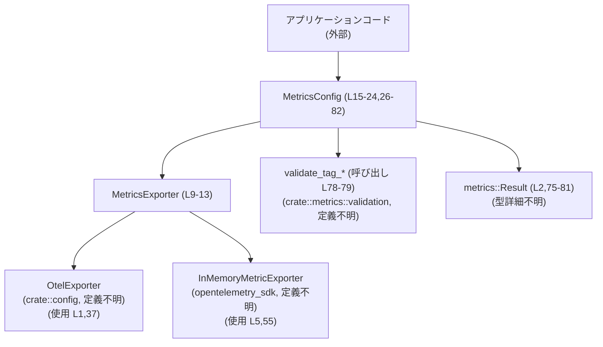
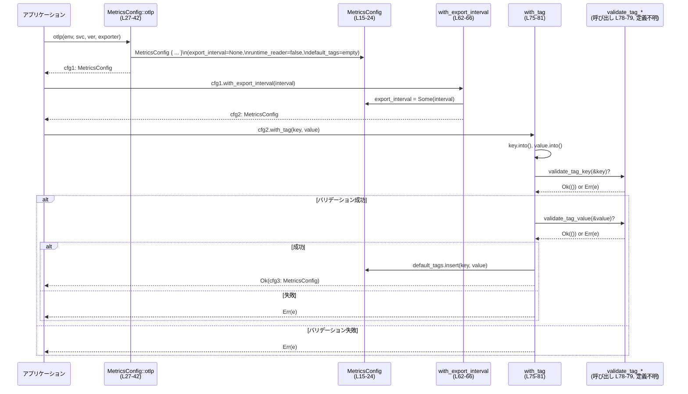

# otel/src/metrics/config.rs コード解説

## 0. ざっくり一言

- メトリクスのエクスポーター種別やサービス情報、デフォルトタグなどをまとめて保持し、ビルダー形式で設定できる設定モジュールです（`otel/src/metrics/config.rs:L9-82`）。

---

## 1. このモジュールの役割

### 1.1 概要

- このモジュールは **メトリクス収集・送信のための設定情報を表現・構築する** ために存在し、次の機能を提供します。
  - OTLP エクスポーター／インメモリエクスポーターの選択（`MetricsExporter`）  
    （`otel/src/metrics/config.rs:L9-13`）
  - 環境名・サービス名・バージョン・エクスポート間隔・ランタイムリーダー有無・デフォルトタグの保持  
    （`MetricsConfig` のフィールド、`otel/src/metrics/config.rs:L16-23`）
  - ビルダー形式での設定メソッド（`otlp`, `in_memory`, `with_export_interval`, `with_runtime_reader`, `with_tag`）  
    （`otel/src/metrics/config.rs:L27-82`）

### 1.2 アーキテクチャ内での位置づけ

- このモジュール単体から分かる依存関係は以下のとおりです。

  - エクスポーター定義:
    - `OtelExporter`（`crate::config` からインポート、定義はこのチャンクには現れない）  
      （`otel/src/metrics/config.rs:L1`）
    - `InMemoryMetricExporter`（`opentelemetry_sdk::metrics` からインポート）  
      （`otel/src/metrics/config.rs:L5`）
  - エラー型:
    - `crate::metrics::Result`（具体的なエラー型はこのチャンクには現れない）  
      （`otel/src/metrics/config.rs:L2`）
  - タグ・バリデーション:
    - `validate_tag_key`, `validate_tag_value`（`crate::metrics::validation` からインポート。定義はこのチャンクには現れないが、`with_tag` 内で呼び出される）  
      （`otel/src/metrics/config.rs:L3-4`, 呼び出し `L78-79`）



- `MetricsConfig` はアプリケーションから直接生成され、内部で `MetricsExporter` とバリデーション関数を利用する構造になっています。

### 1.3 設計上のポイント

- **ビルダーパターン**  
  - `MetricsConfig` の設定メソッドはすべて `self` を値で受け取り `Self`（または `Result<Self>`）を返します（`otel/src/metrics/config.rs:L27-82`）。  
  - これによりメソッドチェーンで設定を積み上げる形になっています（所有権が段階的に移動する Rust のビルダースタイル）。

- **エクスポーターの抽象化**  
  - `MetricsExporter` enum により、OTLP エクスポーターとインメモリエクスポーターを同一の型で扱えるようになっています（`otel/src/metrics/config.rs:L9-13`）。

- **フィールドの可視性制御**  
  - `MetricsConfig` のフィールドはすべて `pub(crate)` で、クレート外からは直接書き換えできず、コンストラクタ／ビルダーメソッド経由で設定する前提になっています（`otel/src/metrics/config.rs:L17-23`）。

- **タグの事前バリデーション**  
  - `with_tag` でタグキー／値を追加する際はバリデーション関数を通し、エラーは `Result` で呼び出し側に返します（`otel/src/metrics/config.rs:L75-81`）。  
  - 例外（panic）は使わず、コンパイル時型チェック＋実行時バリデーションの組み合わせです。

- **並行性に関する情報**  
  - `MetricsExporter` と `MetricsConfig` には `Clone` と `Debug` が derive されていますが（`otel/src/metrics/config.rs:L9,15`）、`Send` や `Sync` など並行性トレイトの情報はこのチャンクには現れません。

---

## 2. 主要な機能一覧

- 環境・サービス情報を含むメトリクス設定オブジェクトの生成（OTLP 用 / インメモリ用）
- メトリクスのエクスポート間隔 (`export_interval`) の上書き
- ランタイムスナップショット用リーダー (`runtime_reader`) の有効化フラグ設定
- すべてのメトリクスに付与されるデフォルトタグ (`default_tags`) の登録（バリデーション付き）

---

## 3. 公開 API と詳細解説

### 3.1 型一覧（構造体・列挙体など）

このチャンクに現れる公開（またはクレート内公開）型の一覧です。

| 名前 | 種別 | 役割 / 用途 | 定義位置 |
|------|------|-------------|----------|
| `MetricsExporter` | 列挙体 | メトリクスの送信先エクスポーター種別を表す。OTLP エクスポーターとインメモリエクスポーターを切り替える。 | `otel/src/metrics/config.rs:L9-13` |
| `MetricsConfig` | 構造体 | 環境名・サービス名・バージョン・エクスポーター種別・エクスポート間隔・ランタイムリーダー有無・デフォルトタグを保持する設定オブジェクト。 | `otel/src/metrics/config.rs:L15-24` |

`MetricsConfig` のフィールド（すべて `pub(crate)`）:

| フィールド名 | 型 | 説明 | 定義位置 |
|-------------|----|------|----------|
| `environment` | `String` | デプロイ環境名（例: `"prod"`, `"staging"` など）と推測されますが、用途の詳細はこのチャンクには現れません。 | `otel/src/metrics/config.rs:L17` |
| `service_name` | `String` | サービス名。 | `otel/src/metrics/config.rs:L18` |
| `service_version` | `String` | サービスバージョン。 | `otel/src/metrics/config.rs:L19` |
| `exporter` | `MetricsExporter` | 使用するメトリクスエクスポーター（OTLP または In-memory）。 | `otel/src/metrics/config.rs:L20` |
| `export_interval` | `Option<Duration>` | メトリクスのエクスポート間隔。`None` の場合の扱い（デフォルト値）はこのチャンクには現れません。 | `otel/src/metrics/config.rs:L21` |
| `runtime_reader` | `bool` | ランタイムリーダー（オンデマンドのスナップショット取得機構）の有効／無効フラグ。詳細な読み取り処理はこのチャンクには現れません。 | `otel/src/metrics/config.rs:L22` |
| `default_tags` | `BTreeMap<String, String>` | すべてのメトリクスに付与されるデフォルトタグのキー／値ペア。キーと値は `with_tag` 経由で追加される想定です。 | `otel/src/metrics/config.rs:L23` |

### 3.2 関数詳細（5件）

以下では `MetricsConfig` のメソッドを詳細に説明します。

---

#### `MetricsConfig::otlp(environment: impl Into<String>, service_name: impl Into<String>, service_version: impl Into<String>, exporter: OtelExporter) -> Self`

**概要**

- OTLP エクスポーターを利用するための `MetricsConfig` を生成するコンストラクタです（`otel/src/metrics/config.rs:L27-42`）。
- エクスポート間隔・ランタイムリーダー・デフォルトタグは初期値（未設定／無効／空）で構築されます。

**引数**

| 引数名 | 型 | 説明 | 根拠 |
|--------|----|------|------|
| `environment` | `impl Into<String>` | 環境名。`Into<String>` により `&str` や `String` など複数の型から渡せます。 | `otel/src/metrics/config.rs:L27-28,34` |
| `service_name` | `impl Into<String>` | サービス名。 | `otel/src/metrics/config.rs:L29,35` |
| `service_version` | `impl Into<String>` | サービスバージョン。 | `otel/src/metrics/config.rs:L30,36` |
| `exporter` | `OtelExporter` | OTLP 用のエクスポーター設定。定義は `crate::config::OtelExporter` で、このチャンクには現れません。 | `otel/src/metrics/config.rs:L31,37` |

**戻り値**

- `MetricsConfig` のインスタンス。以下の値で初期化されます（`otel/src/metrics/config.rs:L33-41`）。
  - `environment`, `service_name`, `service_version`: 各引数を `into()` した結果
  - `exporter`: `MetricsExporter::Otlp(exporter)`
  - `export_interval`: `None`
  - `runtime_reader`: `false`
  - `default_tags`: `BTreeMap::new()`

**内部処理の流れ**

1. 各文字列引数に対して `into()` を呼び出して `String` に変換（`L34-36`）。
2. `MetricsExporter::Otlp(exporter)` を構築し `exporter` フィールドに設定（`L37`）。
3. `export_interval` を `None` に、`runtime_reader` を `false` に設定（`L38-39`）。
4. 空の `BTreeMap` を `default_tags` として設定（`L40`）。
5. 上記フィールドを持つ `MetricsConfig` を返す（`L33-41`）。

**Examples（使用例）**

```rust
use crate::config::OtelExporter;
use crate::metrics::config::MetricsConfig;

fn build_otlp_config(exporter: OtelExporter) -> MetricsConfig {
    // MetricsConfig::otlp を使って基本設定を構築する（L27-42）
    MetricsConfig::otlp(
        "prod",              // environment: &str は Into<String> によって String に変換される
        "my-service",        // service_name
        "1.2.3",             // service_version
        exporter,            // OTLP エクスポーター
    )
}
```

**Errors / Panics**

- このメソッドは `Result` を返さず、内部でも `?` や明示的な `panic!` を使用していないため、コードからはエラー／panic の可能性は読み取れません（`otel/src/metrics/config.rs:L27-42`）。

**Edge cases（エッジケース）**

- 空文字や非常に長い文字列を渡した場合の扱いは、このチャンクには現れません（`environment` や `service_name` は単に `String` に格納されるだけです）。

**使用上の注意点**

- `environment` などの引数は `Into<String>` なので、不要な `to_string()` を行うと二重コピーになります。`&str` または `String` をそのまま渡すと効率的です。
- 所有権は `MetricsConfig` に移動するため、戻り値を受け取った変数が設定オブジェクトの唯一の所有者になります（Rust の所有権ルール）。

---

#### `MetricsConfig::in_memory(environment: impl Into<String>, service_name: impl Into<String>, service_version: impl Into<String>, exporter: InMemoryMetricExporter) -> Self`

**概要**

- インメモリエクスポーター（`InMemoryMetricExporter`）を利用する `MetricsConfig` を生成するコンストラクタです（`otel/src/metrics/config.rs:L44-60`）。
- ドキュコメントに「used in tests」とあるとおり、主にテスト用設定として想定されています（`L44`）。

**引数**

| 引数名 | 型 | 説明 | 根拠 |
|--------|----|------|------|
| `environment` | `impl Into<String>` | 環境名。 | `otel/src/metrics/config.rs:L45-46,52` |
| `service_name` | `impl Into<String>` | サービス名。 | `otel/src/metrics/config.rs:L47,53` |
| `service_version` | `impl Into<String>` | サービスバージョン。 | `otel/src/metrics/config.rs:L48,54` |
| `exporter` | `InMemoryMetricExporter` | インメモリ用エクスポーター。OpenTelemetry SDK 提供の型で、このチャンクには実装は現れません。 | `otel/src/metrics/config.rs:L49,55` |

**戻り値**

- `MetricsConfig` のインスタンス。`otlp` と同様に、以下の値で初期化されます（`otel/src/metrics/config.rs:L51-59`）。
  - `exporter`: `MetricsExporter::InMemory(exporter)`
  - その他のフィールドは `otlp` と同じ。

**内部処理の流れ**

1. 文字列引数を `into()` で `String` に変換（`L52-54`）。
2. `MetricsExporter::InMemory(exporter)` を構築（`L55`）。
3. `export_interval = None`, `runtime_reader = false`, `default_tags = BTreeMap::new()` を設定（`L56-58`）。
4. `MetricsConfig` を返す（`L51-59`）。

**Examples（使用例）**

```rust
use opentelemetry_sdk::metrics::InMemoryMetricExporter;
use crate::metrics::config::MetricsConfig;

fn build_test_config(exporter: InMemoryMetricExporter) -> MetricsConfig {
    // テスト用の in-memory 設定を構築（L44-60）
    MetricsConfig::in_memory(
        "test",          // environment
        "my-service",    // service_name
        "test-version",  // service_version
        exporter,
    )
}
```

**Errors / Panics**

- `otlp` と同様、このメソッド内にエラーや panic を発生させるコードは含まれていません（`L45-60`）。

**Edge cases**

- `InMemoryMetricExporter` の挙動（例えばメモリ使用量など）はこのチャンクには現れません。  
- 設定自体は単純な構築のみのため、特別なエッジケースはコード上は見当たりません。

**使用上の注意点**

- ドキュメントに「used in tests」とコメントされているため（`L44`）、本番環境では `otlp` を使う構成が想定されていると考えられますが、これはコード上のコメントに基づく情報であり、強制ではありません。

---

#### `MetricsConfig::with_export_interval(mut self, interval: Duration) -> Self`

**概要**

- 既存の `MetricsConfig` に対して、メトリクスのエクスポート間隔を上書きするビルダーメソッドです（`otel/src/metrics/config.rs:L62-66`）。
- `self` を消費して新しい `MetricsConfig` を返すため、メソッドチェーンに適しています。

**引数**

| 引数名 | 型 | 説明 | 根拠 |
|--------|----|------|------|
| `self` | `mut self` | 変更対象の `MetricsConfig`。所有権を移動しつつ内部を書き換えます。 | `otel/src/metrics/config.rs:L63` |
| `interval` | `Duration` | 新しいエクスポート間隔。標準ライブラリの `std::time::Duration`。 | `otel/src/metrics/config.rs:L63,7` |

**戻り値**

- `export_interval` を `Some(interval)` に変更した `MetricsConfig` インスタンス（`otel/src/metrics/config.rs:L64-65`）。

**内部処理の流れ**

1. `self.export_interval = Some(interval)` でフィールドを書き換える（`L64`）。
2. 変更された `self` を返す（`L65`）。

**Examples（使用例）**

```rust
use std::time::Duration;
use crate::config::OtelExporter;
use crate::metrics::config::MetricsConfig;

fn build_config_with_interval(exporter: OtelExporter) -> MetricsConfig {
    MetricsConfig::otlp("prod", "my-service", "1.0.0", exporter)
        .with_export_interval(Duration::from_secs(30)) // 30秒ごとにエクスポート
}
```

**Errors / Panics**

- 単純なフィールド代入と返却のみであり、panic の可能性はコード上は見当たりません（`L63-66`）。

**Edge cases**

- `Duration::ZERO` のような 0 秒の間隔を設定した場合、どのように扱われるかはこのチャンクには現れません。  
  振る舞いはこの後段でこの設定を参照するコンポーネントに依存します。

**使用上の注意点**

- `self` を消費するため、`with_export_interval` の前に使っていた変数は、この呼び出し後には利用できません（Rust の所有権ルール）。
- 極端に短い間隔を設定すると、後段のメトリクスパイプライン側で負荷が高くなる可能性がありますが、その具体的な挙動はこのチャンクには現れません。

---

#### `MetricsConfig::with_runtime_reader(mut self) -> Self`

**概要**

- ランタイムリーダー（オンデマンドのランタイムスナップショット取得機構とコメントされています）の利用を有効にするフラグを設定するビルダーメソッドです（`otel/src/metrics/config.rs:L68-71`）。

**引数**

| 引数名 | 型 | 説明 | 根拠 |
|--------|----|------|------|
| `self` | `mut self` | 変更対象の `MetricsConfig`。 | `otel/src/metrics/config.rs:L69` |

**戻り値**

- `runtime_reader` を `true` にセットした `MetricsConfig`（`otel/src/metrics/config.rs:L69-71`）。

**内部処理の流れ**

1. `self.runtime_reader = true` でフラグを有効化（`L70`）。
2. 変更した `self` を返す（`L71`）。

**Examples（使用例）**

```rust
use crate::config::OtelExporter;
use crate::metrics::config::MetricsConfig;

fn build_config_with_runtime_reader(exporter: OtelExporter) -> MetricsConfig {
    MetricsConfig::otlp("prod", "my-service", "1.0.0", exporter)
        .with_runtime_reader() // ランタイムリーダーを有効化
}
```

**Errors / Panics**

- 単純なブール値の代入のみであり、panic の可能性はコード上は見当たりません（`L69-71`）。

**Edge cases**

- `with_runtime_reader` を複数回呼び出しても、単に `true` を再代入するだけで挙動は変わりません（`L69-71`）。

**使用上の注意点**

- ランタイムリーダーの具体的な実装や、`true` にした場合の追加リソース消費などはこのチャンクには現れません。  
  実際に有効化すべきかどうかは、後段のコンポーネントの仕様を確認する必要があります。

---

#### `MetricsConfig::with_tag(mut self, key: impl Into<String>, value: impl Into<String>) -> Result<Self>`

**概要**

- すべてのメトリクスに付与されるデフォルトタグを 1 つ追加するビルダーメソッドです（`otel/src/metrics/config.rs:L74-81`）。
- タグのキーと値には事前バリデーションが行われ、無効な場合はエラーを返します。

**引数**

| 引数名 | 型 | 説明 | 根拠 |
|--------|----|------|------|
| `self` | `mut self` | 変更対象の `MetricsConfig`。 | `otel/src/metrics/config.rs:L75` |
| `key` | `impl Into<String>` | タグキー。 | `otel/src/metrics/config.rs:L75-76` |
| `value` | `impl Into<String>` | タグ値。 | `otel/src/metrics/config.rs:L75,77` |

**戻り値**

- 成功時: `Ok(Self)` — `default_tags` に新しいタグを追加した `MetricsConfig`。  
- 失敗時: `Err(e)` — `validate_tag_key` または `validate_tag_value` が返したエラー。エラー型は `crate::metrics::Result` のエイリアスの中身に依存し、このチャンクには現れません（`otel/src/metrics/config.rs:L2,75-81`）。

**内部処理の流れ**

1. `key.into()` と `value.into()` により、それぞれ `String` へ変換（`L76-77`）。
2. `validate_tag_key(&key)?;` を呼び出し、キーのバリデーション（`L78`）。  
   - `?` により、エラーが発生した場合は即座に `Err(...)` を返して関数を終了する。
3. `validate_tag_value(&value)?;` を呼び出し、値のバリデーション（`L79`）。  
4. `self.default_tags.insert(key, value);` で `BTreeMap` にタグを追加（`L80`）。
5. `Ok(self)` で変更済みの `MetricsConfig` を返す（`L81`）。

**Examples（使用例）**

正常系（メソッドチェーンでの使用例）:

```rust
use std::time::Duration;
use crate::config::OtelExporter;
use crate::metrics::config::MetricsConfig;
use crate::metrics::Result; // crate::metrics::Result の中身はこのチャンクには現れない

fn build_config(exporter: OtelExporter) -> Result<MetricsConfig> {
    MetricsConfig::otlp("prod", "my-service", "1.0.0", exporter)
        .with_export_interval(Duration::from_secs(60))
        .with_runtime_reader()
        // with_tag は Result<MetricsConfig> を返すので ? で伝播する
        .with_tag("region", "ap-northeast-1")
}
```

エラー時の取り扱い例:

```rust
use crate::config::OtelExporter;
use crate::metrics::config::MetricsConfig;
use crate::metrics::Result;

fn try_build_with_invalid_tag(exporter: OtelExporter) -> Result<MetricsConfig> {
    let cfg = MetricsConfig::otlp("prod", "my-service", "1.0.0", exporter);
    // エラーを明示的にハンドリングする例
    match cfg.with_tag("invalid key with space", "value") {
        Ok(cfg) => Ok(cfg),
        Err(e) => {
            // ここでログ出力などを行う想定（Error 型の詳細はこのチャンクには現れない）
            Err(e)
        }
    }
}
```

**Errors / Panics**

- エラー:
  - `validate_tag_key` または `validate_tag_value` が `Err` を返した場合、本メソッドも `Err` を返します（`otel/src/metrics/config.rs:L78-79`）。
  - どのような条件でエラーになるか（禁止文字・長さ制限など）は、バリデーション関数の実装がこのチャンクには現れないため不明です。
- panic:
  - この関数内で明示的な `panic!` や、panic の可能性がある標準ライブラリ API の使用は見当たりません。  
    `BTreeMap::insert` は通常 panic しないため、コード上からは panic の可能性は読み取れません（`L80`）。

**Edge cases（エッジケース）**

- 同じキーを再び `with_tag` で追加した場合:
  - `BTreeMap::insert` は既存キーがあれば値を上書きする仕様であるため、最後に追加した値が有効になります（一般的な仕様に基づく解釈）。  
  - ただし、この挙動が意図されたものかどうかについてのコメント等はこのチャンクには現れません。
- 空文字列キー／値:
  - 空文字列が許可されるかどうかは、`validate_tag_*` の実装次第であり、このチャンクには現れません。
- 非 UTF-8 文字列:
  - `String` は UTF-8 なので、非 UTF-8 データはそもそも格納できません。この点は Rust 標準の仕様です。

**使用上の注意点**

- `with_tag` だけは `Result<Self>` を返すため、他のビルダーメソッドと異なり、エラー処理が必須です。  
  - メソッドチェーンの末尾に置いて `?` で伝播させるか、`match` などで明示的にハンドリングする必要があります。
- `Into<String>` による変換は所有権を伴います。`String` を再利用したい場合は `clone()` するか、`&str` を渡すなどの設計が必要です。
- 並行性の観点では、`with_tag` は `self` を所有権ごと消費して内部を書き換えるため、同じ `MetricsConfig` インスタンスを複数スレッドから共有しつつこのメソッドを呼ぶようなパターンは自然には発生しません（共有する前に設定を完了させる前提の設計です）。

---

### 3.3 その他の関数

- このチャンクには、上記以外の補助関数やラッパー関数は定義されていません。

---

## 4. データフロー

ここでは代表的なシナリオとして、OTLP エクスポーター用の `MetricsConfig` を構築し、タグを追加する処理のデータフローを示します。

### 4.1 処理の要点（文章）

1. アプリケーションコードが `MetricsConfig::otlp` を呼び出し、環境名・サービス名・バージョン・`OtelExporter` を渡して基本設定を生成します（`otel/src/metrics/config.rs:L27-42`）。
2. 生成された `MetricsConfig` に対し、必要に応じて `with_export_interval` や `with_runtime_reader` をチェーンして設定を上書きします（`L62-71`）。
3. 最後に `with_tag` を呼び出し、タグキー・値を `String` に変換した上でバリデーション関数を呼び出します（`L75-79`）。
4. バリデーションに成功した場合は、`default_tags` にタグを追加して `Ok(MetricsConfig)` を返し、失敗した場合はその時点で `Err` を返します（`L80-81`）。

### 4.2 Mermaid シーケンス図



- `validate_tag_*` の具体的な実装やどのようなエラー値を返すかは、このチャンクには現れません。

---

## 5. 使い方（How to Use）

### 5.1 基本的な使用方法

OTLP エクスポーターを用いる基本的な構成例です。

```rust
use std::time::Duration;
use crate::config::OtelExporter;
use crate::metrics::config::MetricsConfig;
use crate::metrics::Result;

fn init_metrics(exporter: OtelExporter) -> Result<MetricsConfig> {
    // 1. OTLP 用の基本設定を生成（L27-42）
    let cfg = MetricsConfig::otlp("prod", "my-service", "1.0.0", exporter)
        // 2. エクスポート間隔を 60秒に設定（L62-66）
        .with_export_interval(Duration::from_secs(60))
        // 3. ランタイムリーダーを有効化（L68-71）
        .with_runtime_reader()
        // 4. デフォルトタグを追加（L75-81）
        .with_tag("region", "ap-northeast-1")?; // Result を返すので ? で伝播

    // 5. 構築した MetricsConfig を返す
    Ok(cfg)
}
```

- ここで構築した `MetricsConfig` が、後続のメトリクスパイプライン（このチャンクには現れない）に渡される構成が想定されます。

### 5.2 よくある使用パターン

1. **本番用とテスト用でエクスポーターだけ切り替える**

```rust
use crate::config::OtelExporter;
use opentelemetry_sdk::metrics::InMemoryMetricExporter;
use crate::metrics::config::MetricsConfig;

// 本番用
fn prod_config(exporter: OtelExporter) -> MetricsConfig {
    MetricsConfig::otlp("prod", "my-service", "1.0.0", exporter)
}

// テスト用
fn test_config(exporter: InMemoryMetricExporter) -> MetricsConfig {
    MetricsConfig::in_memory("test", "my-service", "test-version", exporter)
}
```

1. **メソッドチェーンでの構築**

```rust
use std::time::Duration;
use crate::config::OtelExporter;
use crate::metrics::config::MetricsConfig;
use crate::metrics::Result;

fn chained_config(exporter: OtelExporter) -> Result<MetricsConfig> {
    MetricsConfig::otlp("prod", "my-service", "1.0.0", exporter)
        .with_export_interval(Duration::from_secs(30))
        .with_runtime_reader()
        .with_tag("team", "platform") // 最後に Result を返すメソッド
}
```

### 5.3 よくある間違い

**間違い例: `with_tag` の結果を無視してしまう**

```rust
use crate::config::OtelExporter;
use crate::metrics::config::MetricsConfig;

fn wrong_usage(exporter: OtelExporter) {
    let cfg = MetricsConfig::otlp("prod", "my-service", "1.0.0", exporter);
    // NG: Result を無視している（コンパイラが警告を出す可能性が高い）
    // cfg.with_tag("region", "ap-northeast-1");
    // cfg をそのまま使うと、タグ追加に失敗しても気づけない
}
```

**正しい例: `Result` を扱う**

```rust
use crate::config::OtelExporter;
use crate::metrics::config::MetricsConfig;
use crate::metrics::Result;

fn correct_usage(exporter: OtelExporter) -> Result<MetricsConfig> {
    let cfg = MetricsConfig::otlp("prod", "my-service", "1.0.0", exporter);
    let cfg = cfg.with_tag("region", "ap-northeast-1")?; // ? でエラーを伝播
    Ok(cfg)
}
```

### 5.4 使用上の注意点（まとめ）

- **エラー処理**
  - `with_tag` だけが `Result<Self>` を返します。  
    メソッドチェーンを使う場合は末尾に置き、`?` でエラーを呼び出し元に伝播させるのが自然です（`otel/src/metrics/config.rs:L75-81`）。

- **所有権とイミュータビリティ**
  - すべてのビルダーメソッドが `self` を値で受け取るため、設定は「構築時のみ変更」され、その後は基本的にイミュータブルな設定オブジェクトとして扱われます（`L27-82`）。
  - これにより、設定オブジェクトを複数スレッドで共有する際にも、設定途中で状態が変化することを避けやすい構造になっています。

- **並行性**
  - このチャンク内には `Send` や `Sync` などの明示的なトレイト境界は現れません。  
    `MetricsConfig` がスレッド間で共有可能かどうかは、内部に含まれる `OtelExporter` や `InMemoryMetricExporter` 等の型に依存します。

- **テスト**
  - テストでは `in_memory` コンストラクタを用いることで、副作用（外部への送信）を伴わないメトリクス設定を構築できる設計になっています（コメント `Create an in-memory config (used in tests).`、`L44`）。

- **バグ／セキュリティに関する観点**
  - このチャンクからは明白なバグやセキュリティ上の問題（例えば未初期化値の使用や危険な unwrap/panic）は確認できません。
  - デフォルトタグに機密情報を入れないといった運用上のポリシーは、コードではなく利用側の問題であり、このチャンクには現れません。

---

## 6. 変更の仕方（How to Modify）

### 6.1 新しい機能を追加する場合

このモジュール内で完結する変更として考えられる例を挙げます。

1. **新しいエクスポーター種別を追加したい場合**
   - `MetricsExporter` に新しいバリアントを追加する（例: `Stdout(StdoutExporter)` など）  
     （変更箇所: `otel/src/metrics/config.rs:L10-12`）。
   - 対応するコンストラクタメソッド（`MetricsConfig::stdout` など）を `impl MetricsConfig` に追加し、`otlp` / `in_memory` と同様にフィールドを初期化する（`L26-60` を参考）。

2. **新しい設定項目を追加したい場合**
   - `MetricsConfig` にフィールドを追加する（`L16-23`）。
   - すべてのコンストラクタ（`otlp`, `in_memory`）でそのフィールドに初期値を設定する（`L33-41`, `L51-59`）。

### 6.2 既存の機能を変更する場合

- **エクスポート間隔のデフォルト値を変えたい場合**
  - 現状は `export_interval` を `None` にしていますが（`L38,56`）、初期値を変更するにはここを変更します。
  - ただし、`None` をどのように解釈しているかは後続のコードに依存するため、影響範囲はこのチャンクには現れません。

- **タグバリデーションの仕様を変えたい場合**
  - 実際のバリデーションロジックは `crate::metrics::validation` 側にあるため、このファイルで変更すべき箇所はありません（`L3-4,78-79`）。
  - ただし、バリデーションのインターフェイス（戻り値型など）を変える場合は、`with_tag` の `Result<Self>` 型や `?` の扱いも合わせて変更する必要があります。

- **変更時の注意事項**
  - `MetricsConfig` は `Clone` と `Debug` を derive しているため（`L9,15`）、フィールドの追加／型変更によってこれらのトレイト実装が自動的に生成できなくなる可能性があります。その場合は手動実装や `derive` の見直しが必要です。
  - `pub(crate)` フィールドを変更する場合、同一クレート内の他モジュールから直接アクセスされている可能性があります。参照箇所の検索が必要です（このチャンクには使用箇所は現れません）。

---

## 7. 関連ファイル

このモジュールと密接に関係する型・モジュールの一覧です。ファイルパスが特定できないものはモジュールパスのみを記載します。

| パス / モジュール | 役割 / 関係 |
|-------------------|------------|
| `crate::config::OtelExporter` | OTLP 用のエクスポーター設定を表す型。`MetricsExporter::Otlp` の中身として使用されています（`otel/src/metrics/config.rs:L1,11,37`）。ファイルパスはこのチャンクには現れません。 |
| `opentelemetry_sdk::metrics::InMemoryMetricExporter` | インメモリメトリクスエクスポーター。`MetricsExporter::InMemory` の中身として使用されます（`otel/src/metrics/config.rs:L5,12,55`）。 |
| `crate::metrics::Result` | `with_tag` の戻り値に使われる結果型。エラー型の詳細はこのチャンクには現れません（`otel/src/metrics/config.rs:L2,75`）。 |
| `crate::metrics::validation` モジュール | `validate_tag_key`, `validate_tag_value` を提供するモジュール。タグのキー／値を検証する責務を持ちます（`otel/src/metrics/config.rs:L3-4,78-79`）。 |
| `std::collections::BTreeMap` | デフォルトタグの格納に使用される標準ライブラリのマップ型です（`otel/src/metrics/config.rs:L6,23,40,58,80`）。 |
| `std::time::Duration` | エクスポート間隔を表現する標準ライブラリの時間型です（`otel/src/metrics/config.rs:L7,21,63`）。 |

- `MetricsConfig` が実際にどのようなメトリクスパイプラインやランタイムと結びつくかは、このチャンクには現れません。そのため、より全体像を把握するには `crate::metrics` 以下の他ファイルを確認する必要があります。
