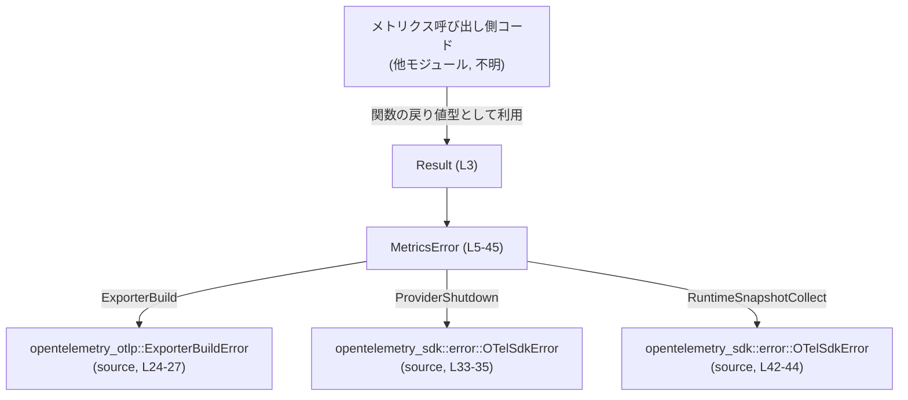
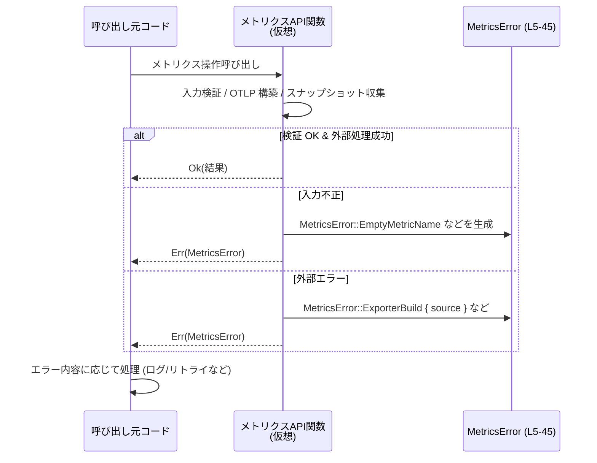

# otel/src/metrics/error.rs

## 0. ざっくり一言

メトリクス周りで発生しうるエラーを一元管理するための専用エラー型 `MetricsError` と、その型を使った `Result<T>` エイリアスを定義するモジュールです（`otel/src/metrics/error.rs:L3-45`）。

---

## 1. このモジュールの役割

### 1.1 概要

- このモジュールは **メトリクス処理に特化したエラー表現** を提供するために存在し、  
  `MetricsError` 列挙体と `Result<T>` エイリアスを通じて、呼び出し側が型安全にエラーを扱えるようにします（`otel/src/metrics/error.rs:L3-45`）。
- メトリック名やタグのバリデーション、OTLP エクスポータの構築・設定エラー、ランタイムメトリクス取得エラーなど、メトリクス特有の失敗パターンを網羅しています（`otel/src/metrics/error.rs:L8-45`）。

### 1.2 アーキテクチャ内での位置づけ

このモジュール自体はエラー型のみを定義し、実際のメトリクス処理ロジックから参照される位置づけです。  
外部クレート `opentelemetry_otlp` と `opentelemetry_sdk` が提供するエラー型を「原因（source）」として内包し、エラー連鎖を表現します（`otel/src/metrics/error.rs:L24-27, L33-35, L42-44`）。



> 註: 呼び出し元の具体的なモジュール名・関数名は、このチャンクには現れないため不明です。

### 1.3 設計上のポイント

- **エラー型の集約**  
  - メトリクス関連エラーを `MetricsError` に集約し、メトリクス API の戻り値を `Result<T>` エイリアスで統一できる構造になっています（`otel/src/metrics/error.rs:L3-6`）。
- **thiserror によるエラー定義**  
  - `#[derive(Debug, Error)]` と `#[error("...")]` 属性により、`std::error::Error` と `Display` 実装を半自動生成しています（`otel/src/metrics/error.rs:L1, L5, L8-9, L10-11, ...`）。
- **エラー連鎖（cause）の保持**  
  - 他クレートのエラーを `source` フィールドとして `#[source]` 付きで保持し、原因エラーを失わない設計です（`otel/src/metrics/error.rs:L24-27, L33-35, L42-44`）。
- **所有データによる安全性**  
  - フィールドには `String` や外部エラー型のみが含まれ、参照（`&T`）は使われていません。これにより、ライフタイムの管理が単純になり、エラー値を長期間保持しても参照切れが起きない構造です（`otel/src/metrics/error.rs:L11, L13, L15, L21, L26, L30, L35, L44`）。
- **並行性との関係**  
  - このファイルにはスレッドやロックなどの並行処理は登場せず、純粋に値型のエラー定義のみです。`Send`/`Sync` 実装の有無はフィールドに含まれる外部エラー型に依存し、このチャンクからは判定できません。

---

## 2. 主要な機能一覧（コンポーネントインベントリー）

このモジュールが提供する主要な要素（型・バリアント）を列挙します。

- `Result<T>`: メトリクス用の共通 `Result` エイリアス。`Err` は必ず `MetricsError`（`otel/src/metrics/error.rs:L3-3`）。
- `MetricsError`: メトリクス関連エラーを表す列挙体（`otel/src/metrics/error.rs:L5-45`）。
  - `EmptyMetricName`: 空のメトリック名が渡された場合のエラー（`L8-9`）。
  - `InvalidMetricName { name }`: メトリック名に不正な文字が含まれる場合のエラー（`L10-11`）。
  - `EmptyTagComponent { label }`: タグの一要素（キー/値など）が空である場合のエラー（`L12-13`）。
  - `InvalidTagComponent { label, value }`: タグの一要素に不正な文字が含まれる場合のエラー（`L14-15`）。
  - `ExporterDisabled`: メトリクスエクスポータが無効化されている場合のエラー（`L17-18`）。
  - `NegativeCounterIncrement { name, inc }`: カウンタインクリメント値が負数だった場合のエラー（`L20-21`）。
  - `ExporterBuild { source }`: OTLP メトリクスエクスポータ構築時のエラー（`L23-27`）。
  - `InvalidConfig { message }`: OTLP メトリクス設定の検証エラー（`L29-30`）。
  - `ProviderShutdown { source }`: メトリクスプロバイダのフラッシュ/シャットダウン失敗（`L32-35`）。
  - `RuntimeSnapshotUnavailable`: ランタイムメトリクススナップショット取得機能が有効化されていない場合（`L38-39`）。
  - `RuntimeSnapshotCollect { source }`: ランタイムメトリクススナップショット収集の失敗（`L41-44`）。

---

## 3. 公開 API と詳細解説

### 3.1 型一覧（構造体・列挙体など）

| 名前 | 種別 | 役割 / 用途 | 定義場所 |
|------|------|-------------|----------|
| `Result<T>` | 型エイリアス | メトリクスモジュール内で共通に使用する `Result<T, MetricsError>` の短縮形です。メトリクス関連 API の戻り値を統一できます。 | `otel/src/metrics/error.rs:L3-3` |
| `MetricsError` | 列挙体（enum） | メトリック名・タグのバリデーション、エクスポータ構築・設定、プロバイダシャットダウン、ランタイムメトリクス取得など、メトリクス固有のエラー状態を表現します。`thiserror::Error` を実装しています。 | `otel/src/metrics/error.rs:L5-45` |

`MetricsError` の各バリアントの詳細です。

| バリアント名 | フィールド | 説明 | 定義場所 |
|-------------|-----------|------|----------|
| `EmptyMetricName` | なし | メトリック名が空文字列であることを示します。エラーメッセージは `"metric name cannot be empty"` です。 | `otel/src/metrics/error.rs:L8-9` |
| `InvalidMetricName` | `name: String` | メトリック名に不正な文字が含まれている場合のエラーです。`name` に問題のあるメトリック名が格納されます。 | `otel/src/metrics/error.rs:L10-11` |
| `EmptyTagComponent` | `label: String` | タグの一要素（キーや値など）が空であることを示します。`label` には「tag key」「tag value」など、どの要素かを説明するラベルが入ると解釈できます。 | `otel/src/metrics/error.rs:L12-13` |
| `InvalidTagComponent` | `label: String, value: String` | タグの一要素に不正な文字が含まれる場合のエラーです。`label` は要素の種類、`value` は不正な値そのものです。 | `otel/src/metrics/error.rs:L14-15` |
| `ExporterDisabled` | なし | メトリクスエクスポータが設定上無効化されているのにエクスポート処理が呼ばれたことを示します。 | `otel/src/metrics/error.rs:L17-18` |
| `NegativeCounterIncrement` | `name: String, inc: i64` | カウンタに対して負のインクリメント値 `inc` が指定された場合のエラーです。`name` は対象メトリック名です。 | `otel/src/metrics/error.rs:L20-21` |
| `ExporterBuild` | `source: opentelemetry_otlp::ExporterBuildError` | OTLP メトリクスエクスポータの構築に失敗したことを表し、`source` に外部クレートの詳細なエラーを保持します。 | `otel/src/metrics/error.rs:L23-27` |
| `InvalidConfig` | `message: String` | OTLP メトリクス設定が不正な場合のエラーです。`message` に検証メッセージ（例: 不正な値の説明）が入ります。 | `otel/src/metrics/error.rs:L29-30` |
| `ProviderShutdown` | `source: opentelemetry_sdk::error::OTelSdkError` | メトリクスプロバイダのフラッシュまたはシャットダウン時に、OpenTelemetry SDK 側でエラーが発生したことを示します。 | `otel/src/metrics/error.rs:L32-35` |
| `RuntimeSnapshotUnavailable` | なし | ランタイムメトリクススナップショットリーダーが無効化されており、スナップショット取得が利用できない状態であることを表します。 | `otel/src/metrics/error.rs:L38-39` |
| `RuntimeSnapshotCollect` | `source: opentelemetry_sdk::error::OTelSdkError` | ランタイムメトリクススナップショットの収集処理が SDK 内部エラーで失敗したことを表します。 | `otel/src/metrics/error.rs:L41-44` |

### 3.2 重要な型: `MetricsError` と `Result<T>`

関数は定義されていませんが、このモジュールの中心となる公開 API は `MetricsError` と `Result<T>` です。それぞれを関数テンプレートに準じて詳細に説明します。

#### `pub type Result<T> = std::result::Result<T, MetricsError>`

**概要**

- メトリクス関連の関数が返すべき共通の戻り値型です（`otel/src/metrics/error.rs:L3-3`）。
- `Err` の場合は必ず `MetricsError` が返されます。

**戻り値の意味**

- `Ok(T)` — 処理が成功し、結果 `T` を返す。
- `Err(MetricsError)` — 処理が失敗し、その原因を `MetricsError` バリアントのいずれかで表す。

**使用例**

以下は、メトリック名のバリデーションを行う関数の例です（実際のモジュールパスはプロジェクト構成に依存します）。

```rust
use crate::metrics::error::{Result, MetricsError}; // モジュール階層は一例

// メトリック名を検証する仮の関数
fn validate_metric_name(name: &str) -> Result<()> {
    // 空文字チェック → EmptyMetricName を返す
    if name.is_empty() {
        return Err(MetricsError::EmptyMetricName); // L8-9 に対応
    }

    // ここでは「不正な文字のチェック」があると仮定
    if !name.chars().all(|c| c.is_ascii_alphanumeric() || c == '_') {
        // 問題のある名前をそのまま保持
        return Err(MetricsError::InvalidMetricName { 
            name: name.to_string(), // L10-11 に対応
        });
    }

    Ok(())
}
```

> 註: `validate_metric_name` はこのチャンクには存在せず、`Result<T>` および `MetricsError` の典型的な使い方を示すための仮の例です。

**Errors / Panics**

- `Result<T>` 自体はエラーを表現する型エイリアスであり、panic を引き起こすことはありません。
- panic は、`unwrap` / `expect` を呼び出し側が使用した場合など、別のレイヤーで発生します。

**使用上の注意点**

- メトリクス関連の関数では、標準の `Result<T, E>` ではなくこの `Result<T>` を戻り値にすると、エラー型が揃い取り扱いが簡潔になります。
- 他のエラー型（例えば IO エラー）を扱いたい場合は、`MetricsError` に変換するか、このエイリアスを使わずに個別の `Result` を定義する必要があります。

#### `pub enum MetricsError`

**概要**

- メトリクスの定義・更新・エクスポート・ランタイム収集に関するエラー状態を列挙する型です（`otel/src/metrics/error.rs:L5-45`）。
- `thiserror::Error` により `std::error::Error` と `Display` を実装し、各バリアントの `#[error("...")]` 属性に基づくメッセージを返します（`L8-9` など）。

**主なバリアント別の契約（Contract）とエッジケース**

以下、各バリアントが想定している前提条件・境界条件を、エラーメッセージから読み取れる範囲でまとめます。

- `EmptyMetricName`（`L8-9`）  
  - 契約: メトリック名は空文字列であってはならない。  
  - 典型的な使用: メトリックの登録や取得時に `name.is_empty()` を検出した場合に返す。  
  - エッジケース: 空白だけの名前（例: `" "`）を許容するかどうかは、このチャンクからは不明です。

- `InvalidMetricName { name }`（`L10-11`）  
  - 契約: メトリック名は特定の文字集合に従う必要があり、不正な文字が含まれている場合にこのエラーを返すと解釈できます。  
  - `name`: 問題のあるメトリック名を保持することで、ログやデバッグ時に原因を特定しやすくなります。  
  - どの文字が不正とされるかは、このチャンクには現れません。

- `EmptyTagComponent { label }`（`L12-13`）  
  - 契約: タグの「キー」や「値」など、ラベルで示される要素は空であってはならない。  
  - `label`: `"tag key"` や `"tag value"` のようにエラー説明用の文字列を入れる用途が想定されますが、具体例はこのチャンクにはありません。

- `InvalidTagComponent { label, value }`（`L14-15`）  
  - 契約: ラベルで示されるタグ要素には、特定の制約に反する文字が含まれてはならない。  
  - `value`: 実際に不正と判断された値。  
  - どのような文字が不正かは不明です。

- `ExporterDisabled`（`L17-18`）  
  - 契約: メトリクスエクスポータが無効化されている構成では、エクスポート処理を開始してはならない。  
  - このエラーは「構成やフラグの前提条件に違反した呼び出し」を示す用途と解釈できます。

- `NegativeCounterIncrement { name, inc }`（`L20-21`）  
  - 契約: カウンタのインクリメント値は **非負（0 以上）** でなければならない（エラーメッセージ `"must be non-negative"` より）。  
  - エッジケース: `inc = 0` を許容するかどうかは、メッセージからは許容されると解釈できますが、実際の呼び出しコードはこのチャンクには出てきません。

- `ExporterBuild { source }`（`L23-27`）  
  - 契約: OTLP メトリクスエクスポータの構築時に発生した `ExporterBuildError` をそのままラップして返す。  
  - `#[source]` により、`std::error::Error::source()` がこのフィールドを返すよう実装されます。

- `InvalidConfig { message }`（`L29-30`）  
  - 契約: OTLP メトリクス設定は検証されるべきであり、不正な構成の場合、このバリアントで理由を説明する必要があります。  
  - `message`: どの設定値が問題かなど、human-readable な説明用。

- `ProviderShutdown { source }`（`L32-35`）  
  - 契約: メトリクスプロバイダのフラッシュまたはシャットダウン時に SDK 側でエラーが起きたら、このバリアントでラップする。  
  - `source` に `OTelSdkError` を保持し、エラー連鎖を維持します。

- `RuntimeSnapshotUnavailable`（`L38-39`）  
  - 契約: ランタイムメトリクススナップショットリーダーが有効化されている前提でスナップショット取得 API を呼び出す必要がある。  
  - このバリアントは「前提条件が満たされていない」ことを表します。

- `RuntimeSnapshotCollect { source }`（`L41-44`）  
  - 契約: ランタイムメトリクススナップショットの収集過程で、SDK 内部でエラーが起きた場合にこのバリアントを返す。  
  - `source` フィールドで詳細な原因を保持します。

**Examples（使用例）**

1. バリデーションエラーを返す関数の例

```rust
use crate::metrics::error::{Result, MetricsError}; // パスは一例です

// カウンタのインクリメント値を検証する仮の関数
fn validate_counter_inc(name: &str, inc: i64) -> Result<()> {
    if inc < 0 {
        // マイナス値はエラーとする（L20-21 に基づく）
        return Err(MetricsError::NegativeCounterIncrement {
            name: name.to_string(),
            inc,
        });
    }
    Ok(())
}
```

1. 外部エラーを `MetricsError` に変換して返す仮の例

```rust
use crate::metrics::error::{Result, MetricsError};

// OTLP メトリクスエクスポータを構築する仮の関数
fn build_metrics_exporter() -> Result<()> {
    // これは仮の外部関数呼び出し例です。実在の API かどうかはこのチャンクからは分かりません。
    let exporter_res: std::result::Result<(), opentelemetry_otlp::ExporterBuildError> =
        Err(opentelemetry_otlp::ExporterBuildError::Other("example".into()));

    exporter_res.map_err(|e| MetricsError::ExporterBuild { source: e })?;
    Ok(())
}
```

> 上記の外部 API 呼び出しはあくまで使用イメージです。実際の関数名・シグネチャはこのチャンクには現れません。

**Errors / Panics**

- `MetricsError` 自体は値型であり、作成時に panic を起こすコードは含まれていません。
- `thiserror` による `Display` 実装も、与えられたフィールドを文字列として埋め込むだけなので、通常は panic を引き起こしません。

**並行性・安全性の観点**

- この enum は参照を含まず、すべて所有データ（`String` と外部エラー型）を保持するため、ライフタイム管理上の危険はありません。
- `Send`/`Sync` 実装の有無は、`ExporterBuildError` や `OTelSdkError` がどのように実装されているかに依存します。このチャンクにはそれらの定義がないため、判定できません。
- グローバル変数や内部可変性（`RefCell` 等）は使われておらず、このファイル単体ではデータ競合の原因となる要素は見当たりません。

**バグ・セキュリティ上の留意点**

- エラーメッセージに `name` や `value` などの文字列をそのまま埋め込んでいるため（`L10-11, L14-15, L20-21, L29-30`）、これらがユーザ入力由来であればログに出力される可能性があります。  
  - どのログ出力が行われるかは他モジュール次第であり、このチャンクからは分かりません。
- このファイルからは明らかなバグやセキュリティ脆弱性は確認できません。

### 3.3 その他の関数

- このファイルには関数定義が存在しません（`functions=0` のメタ情報およびコード内容より）。

---

## 4. データフロー

このモジュールはエラー型のみを定義しますが、典型的な **データフロー（エラー伝播フロー）** は次のようになります。

1. メトリクス API 内部で入力値の検証やエクスポータ構築などを行う。
2. 問題が見つかった場合、適切な `MetricsError` バリアントを作成して `Err(...)` を返す。
3. 上位の呼び出し元は、この `Result<T>` を通じてエラーを受け取り、ログ出力・リトライ・失敗として扱うなどの処理を行う。



> 註: `MetricsAPI` はこのチャンクには定義されていない仮想的なコンポーネントです。`MetricsError` の利用イメージを示すために図示しています。

---

## 5. 使い方（How to Use）

### 5.1 基本的な使用方法

メトリクス関連の関数で `MetricsError` を利用する典型的なパターンです。

```rust
use crate::metrics::error::{Result, MetricsError}; // パスはプロジェクト構成に依存

// メトリクスを記録する仮の関数
fn record_counter(name: &str, inc: i64) -> Result<()> {
    // メトリック名の簡易バリデーション
    if name.is_empty() {
        return Err(MetricsError::EmptyMetricName); // L8-9 に対応
    }

    // インクリメント値のバリデーション
    if inc < 0 {
        return Err(MetricsError::NegativeCounterIncrement {
            name: name.to_string(),
            inc,
        }); // L20-21 に対応
    }

    // 実際のカウンタ更新処理はこのチャンクには存在しないため省略
    Ok(())
}

// 呼び出し側
fn main() {
    if let Err(err) = record_counter("requests_total", -1) {
        eprintln!("メトリクス更新に失敗しました: {err}");
        // thiserror により人間が読めるメッセージが表示されます
    }
}
```

### 5.2 よくある使用パターン

1. **`?` 演算子と併用して外部エラーを連鎖させる**

```rust
use crate::metrics::error::{Result, MetricsError};

fn flush_provider() -> Result<()> {
    // 仮の外部処理: 実在の関数ではありません
    fn sdk_flush() -> std::result::Result<(), opentelemetry_sdk::error::OTelSdkError> {
        // ...
        Ok(())
    }

    // SDK エラーを MetricsError::ProviderShutdown に変換
    sdk_flush().map_err(|e| MetricsError::ProviderShutdown { source: e })?;
    Ok(())
}
```

1. **エラー種別ごとに分岐処理を行う**

```rust
use crate::metrics::error::MetricsError;

fn handle_error(err: MetricsError) {
    match err {
        MetricsError::EmptyMetricName
        | MetricsError::InvalidMetricName { .. }
        | MetricsError::EmptyTagComponent { .. }
        | MetricsError::InvalidTagComponent { .. } => {
            // 入力値の問題として扱う
        }
        MetricsError::ExporterDisabled
        | MetricsError::InvalidConfig { .. } => {
            // 設定の問題として扱う
        }
        MetricsError::ExporterBuild { .. }
        | MetricsError::ProviderShutdown { .. }
        | MetricsError::RuntimeSnapshotCollect { .. } => {
            // 外部コンポーネント（OTLP / SDK）のエラーとして扱う
        }
        MetricsError::RuntimeSnapshotUnavailable => {
            // 機能が無効化されているケースとして扱う
        }
    }
}
```

### 5.3 よくある間違いと正しい使い方

**外部エラーを source に入れ忘れる例**

```rust
use crate::metrics::error::{Result, MetricsError};

// 間違い例: 外部エラーをメッセージ化してしまい、元のエラー型が失われる
fn build_exporter_bad() -> Result<()> {
    let res: std::result::Result<(), opentelemetry_otlp::ExporterBuildError> = unimplemented!();

    match res {
        Ok(()) => Ok(()),
        Err(e) => Err(MetricsError::InvalidConfig {
            message: format!("failed to build: {e}"), // source が失われる
        }),
    }
}

// 正しい例: ExporterBuild バリアントに #[source] フィールドとして保持
fn build_exporter_ok() -> Result<()> {
    let res: std::result::Result<(), opentelemetry_otlp::ExporterBuildError> = unimplemented!();

    res.map_err(|e| MetricsError::ExporterBuild { source: e })?;
    Ok(())
}
```

> 外部エラーを `source` として保持すると、`std::error::Error::source()` を通じて詳細な原因を追跡しやすくなります。

### 5.4 使用上の注意点（まとめ）

- **前提条件の明示**  
  - メトリック名・タグ要素・カウンタインクリメントなどは `MetricsError` の各バリアントが示す制約を満たす必要があります（`L8-15, L20-21`）。
- **エラー連鎖の保持**  
  - OTLP エクスポータや OpenTelemetry SDK のエラーは、対応するバリアント (`ExporterBuild`, `ProviderShutdown`, `RuntimeSnapshotCollect`) の `source` に格納することで、原因情報を失わないようにするのが望ましいです（`L24-27, L33-35, L42-44`）。
- **ログ・観測性**  
  - エラーメッセージには値が埋め込まれるため、機密情報を埋め込まないよう上位レイヤーで配慮する必要があります。

---

## 6. 変更の仕方（How to Modify）

### 6.1 新しい機能（エラー種別）を追加する場合

新しいメトリクス関連エラーを追加する手順の例です。

1. **新しいバリアントの追加**  
   - `MetricsError` に新しい列挙子を追加します。`#[error("...")]` 属性でメッセージを定義し、必要なフィールドを持たせます（`otel/src/metrics/error.rs:L8-45` の既存バリアントを参考）。
2. **外部エラーをラップする場合**  
   - `source` というフィールド名で `#[source]` を付けると、`thiserror` が `Error::source` を正しく実装します（`L24-27, L33-35, L42-44` を参照）。
3. **呼び出し元コードの更新**  
   - 新しいバリアントを返すように、対応するメトリクス処理関数の `Result<T>` 戻り値箇所を修正します。
4. **エラーハンドリングの見直し**  
   - `match MetricsError` を行っている箇所（別ファイル）で、新しいバリアントを考慮した分岐を追加する必要があります。このチャンクには使用箇所が現れないため、どこを修正すべきかは不明です。

### 6.2 既存の機能を変更する場合

- **エラーメッセージの変更**  
  - `#[error("...")]` の文字列を変更すると、ログやテストの期待値が変わる可能性があります（`L8-9` など）。  
    - 文字列に依存したテスト（`to_string()` の比較など）がある場合は更新が必要です。
- **フィールド構造の変更**  
  - 例: `InvalidConfig { message: String }` にフィールドを追加・型変更する場合（`L29-30`）。
    - そのバリアントを構築している全コードでコンパイルエラーが起きるので、それらを更新する必要があります。
    - ログフォーマットも変わるため、運用上の監視ルールが影響を受ける可能性があります。
- **外部エラー型の変更**  
  - `ExporterBuild` や `ProviderShutdown` など、外部エラー型を保持しているバリアント（`L24-27, L33-35, L42-44`）を変更する場合は、  
    - 対応する外部ライブラリ (`opentelemetry_otlp`, `opentelemetry_sdk`) の API 変更に合わせる必要があります。

---

## 7. 関連ファイル・外部コンポーネント

このモジュールから直接参照されている外部コンポーネントは次の通りです。

| パス / 型 | 役割 / 関係 |
|-----------|------------|
| `thiserror::Error` | `MetricsError` に `std::error::Error` 実装と `Display` 実装を与えるための derive マクロです（`otel/src/metrics/error.rs:L1, L5`）。 |
| `opentelemetry_otlp::ExporterBuildError` | OTLP メトリクスエクスポータ構築時のエラー型であり、`MetricsError::ExporterBuild` の `source` として保持されます（`otel/src/metrics/error.rs:L24-27`）。型の詳細はこのチャンクには現れません。 |
| `opentelemetry_sdk::error::OTelSdkError` | OpenTelemetry SDK 全般のエラー型であり、`MetricsError::ProviderShutdown` と `MetricsError::RuntimeSnapshotCollect` の `source` として利用されます（`otel/src/metrics/error.rs:L33-35, L42-44`）。 |

このファイルと密接に関連する内部ファイル（メトリクスの定義・エクスポータ実装など）は、このチャンクには現れないため特定できません。

---

### 補足: テスト・性能・スケーラビリティについて

- **テスト**  
  - このファイル内にはテストコードは存在しません。`MetricsError` を利用する他モジュールで、各バリアントが想定どおりに返されるかどうかをテストする必要があります。
- **性能・スケーラビリティ**  
  - `MetricsError` は主にエラー時にのみ生成され、`String` のアロケーションが発生しますが、通常は頻度が低い経路であるため、性能への影響は限定的と考えられます。
- **観測性（Observability）**  
  - `thiserror` による分かりやすいエラーメッセージと、`source` による原因エラーの保持により、ログやメトリクスバックエンドからの問題調査を行いやすい設計になっています（`L8-9` などのメッセージと `L24-27` の `#[source]` 参照）。
