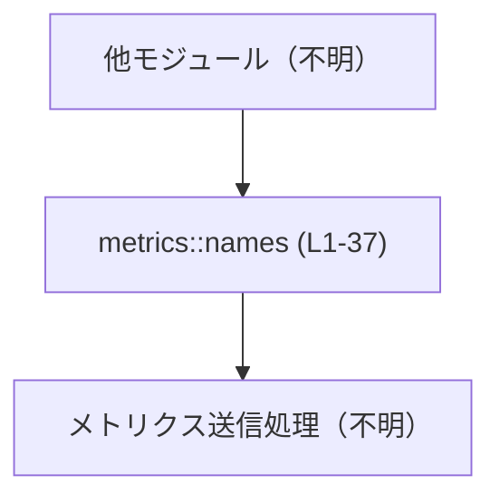
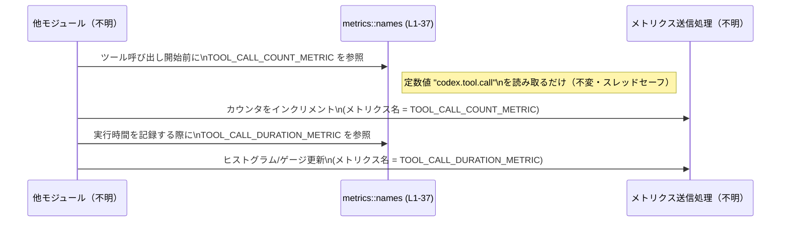

# otel/src/metrics/names.rs コード解説

## 0. ざっくり一言

`otel/src/metrics/names.rs` は、サービス内で利用する各種メトリクス（計測項目）の **名前文字列を一元管理するための公開定数群** を定義しているモジュールです（`pub const ...: &str` のみ定義、関数や構造体はありません。根拠: `names.rs:L1-37`）。

---

## 1. このモジュールの役割

### 1.1 概要

- このモジュールは、サービス内で発行されるメトリクスの **名前（例: `"codex.tool.call"`）を定数として集約** しています（`pub const ... = "codex....";`。根拠: `names.rs:L1-31,33,35-37`）。
- 計測対象は、ツール呼び出し、API リクエスト、SSE/WebSocket、レスポンス API のレイテンシ内訳、1ターンの処理時間・トークン使用量、プラグイン起動・プリウォーム、スレッド開始などです（根拠: 定数名とコメント `names.rs:L1-31,32-36,37`）。

### 1.2 アーキテクチャ内での位置づけ

このファイル自体は **メトリクス名の定義だけ** を行い、実際にメトリクスを送信する処理や OpenTelemetry への統合は、このチャンクには現れていません（根拠: 関数・型・外部呼び出しが一切ないこと `names.rs:L1-37`）。

想定上の位置づけ（実際の呼び出し元・バックエンドはこのチャンクには現れません）を簡略化すると次のようになります。



- `A`: 例えばリクエスト処理やツール実行を行うモジュール（このチャンクには現れません）。
- `B`: 本ファイル `metrics::names`。メトリクス名の `pub const &str` を提供（`names.rs:L1-37`）。
- `C`: OpenTelemetry などのメトリクス送信処理（このチャンクには現れません）。

### 1.3 設計上のポイント

コードから読み取れる範囲の特徴は次のとおりです。

- **責務の分割**
  - メトリクス名の定義だけを担い、計測ロジックは一切持っていません（`pub const` のみ。根拠: `names.rs:L1-37`）。
- **状態を持たない**
  - すべて `pub const ...: &str` であり、グローバルな可変状態や初期化処理はありません（根拠: `names.rs:L1-37`）。
- **安全性 / エラー / 並行性**
  - `&'static str` の定数だけで構成されているため、**ランタイムエラー・パニック・データ競合は発生しません**（Rust の文字列リテラルは読み取り専用でスレッドセーフ。根拠: `names.rs:L1-37`）。
- **命名規則**
  - すべて `"codex...."` プレフィックスを持つドット区切り名で統一されています（根拠: 各文字列リテラル `names.rs:L1-31,33,35-37`）。
  - 時間系メトリクスには `.duration_ms` / `_ttft.duration_ms` / `_tbt.duration_ms` といったサフィックスが付いており、 **ミリ秒単位の時間計測** であることを示しています（根拠: `names.rs:L2,5,7,9,11-13,15-21,23-25,33,35`）。
- **コメントの付与**
  - スタートアップ・プリウォーム関連の 2 つのメトリクスには英語コメントがあり、意味が明示されています（根拠: `names.rs:L32-36`）。

---

## 2. 主要な機能一覧

このモジュールは「機能」というより「用途別のメトリクス名」を提供します。大分類は次のようになります。

- ツール呼び出し関連メトリクス（`TOOL_CALL_*` 定数。根拠: `names.rs:L1-3`）
- API リクエスト関連メトリクス（`API_CALL_*` 定数。根拠: `names.rs:L4-5`）
- SSE / WebSocket 関連メトリクス（`SSE_EVENT_*`, `WEBSOCKET_*` 定数。根拠: `names.rs:L6-11`）
- Responses API およびエンジン内訳のレイテンシメトリクス（`RESPONSES_API_*` 定数。根拠: `names.rs:L12-21`）
- 1 ターン（turn）単位のレイテンシ・トークン・ネットワークなどのメトリクス（`TURN_*` 定数。根拠: `names.rs:L23-28`）
- プロファイル利用状況メトリクス（`PROFILE_USAGE_METRIC`。根拠: `names.rs:L29`）
- キュレートされたプラグインのスタートアップ同期メトリクス（`CURATED_PLUGINS_*`。根拠: `names.rs:L30-31`）
- スタートアップ・プリウォームの時間・年齢メトリクス（`STARTUP_PREWARM_*`。根拠: `names.rs:L32-36`）
- スレッド開始メトリクス（`THREAD_STARTED_METRIC`。根拠: `names.rs:L37`）

---

## 3. 公開 API と詳細解説

### 3.1 型一覧（構造体・列挙体など）と公開定数インベントリ

#### 型について

- このファイルには構造体・列挙体・トレイトなどの **型定義は存在しません**（`pub const` のみ。根拠: `names.rs:L1-37`）。

#### 公開定数一覧（コンポーネントインベントリー）

このファイルで定義されるすべての公開定数を一覧します。

| 定数名 | 種別 | 用途（概要・名前からの解釈） | 根拠行 |
|--------|------|------------------------------|--------|
| `TOOL_CALL_COUNT_METRIC` | `pub const &str` | ツール呼び出し回数を表すメトリクス名（`"codex.tool.call"`）。 | `names.rs:L1` |
| `TOOL_CALL_DURATION_METRIC` | `pub const &str` | ツール呼び出しの所要時間（ミリ秒）メトリクス名（`.duration_ms`）。 | `names.rs:L2` |
| `TOOL_CALL_UNIFIED_EXEC_METRIC` | `pub const &str` | ツールの統合実行パスに関するメトリクス名と解釈できます（`"codex.tool.unified_exec"`）。 | `names.rs:L3` |
| `API_CALL_COUNT_METRIC` | `pub const &str` | API リクエスト回数メトリクス名（`"codex.api_request"`）。 | `names.rs:L4` |
| `API_CALL_DURATION_METRIC` | `pub const &str` | API リクエストのレイテンシ（ミリ秒）メトリクス名。 | `names.rs:L5` |
| `SSE_EVENT_COUNT_METRIC` | `pub const &str` | SSE イベント数メトリクス名（`"codex.sse_event"`）。 | `names.rs:L6` |
| `SSE_EVENT_DURATION_METRIC` | `pub const &str` | SSE イベントに関連する時間（ミリ秒）メトリクス名。 | `names.rs:L7` |
| `WEBSOCKET_REQUEST_COUNT_METRIC` | `pub const &str` | WebSocket リクエスト数メトリクス名。 | `names.rs:L8` |
| `WEBSOCKET_REQUEST_DURATION_METRIC` | `pub const &str` | WebSocket リクエストのレイテンシ（ミリ秒）メトリクス名。 | `names.rs:L9` |
| `WEBSOCKET_EVENT_COUNT_METRIC` | `pub const &str` | WebSocket イベント数メトリクス名。 | `names.rs:L10` |
| `WEBSOCKET_EVENT_DURATION_METRIC` | `pub const &str` | WebSocket イベント関連の時間（ミリ秒）メトリクス名。 | `names.rs:L11` |
| `RESPONSES_API_OVERHEAD_DURATION_METRIC` | `pub const &str` | Responses API のオーバーヘッド時間（ミリ秒）メトリクス名。 | `names.rs:L12` |
| `RESPONSES_API_INFERENCE_TIME_DURATION_METRIC` | `pub const &str` | モデル推論時間（ミリ秒）と解釈できるメトリクス名。 | `names.rs:L13-14` |
| `RESPONSES_API_ENGINE_IAPI_TTFT_DURATION_METRIC` | `pub const &str` | エンジン側 IAPI の TTFT（最初のトークンまでの時間）ミリ秒メトリクス名と解釈。 | `names.rs:L15-16` |
| `RESPONSES_API_ENGINE_SERVICE_TTFT_DURATION_METRIC` | `pub const &str` | エンジン内サービスタイアの TTFT（ミリ秒）メトリクス名と解釈。 | `names.rs:L17-18` |
| `RESPONSES_API_ENGINE_IAPI_TBT_DURATION_METRIC` | `pub const &str` | エンジン側 IAPI の TBT（合計時間など）ミリ秒メトリクス名と解釈。 | `names.rs:L19-20` |
| `RESPONSES_API_ENGINE_SERVICE_TBT_DURATION_METRIC` | `pub const &str` | エンジン内サービスタイアの TBT ミリ秒メトリクス名と解釈。 | `names.rs:L21-22` |
| `TURN_E2E_DURATION_METRIC` | `pub const &str` | 1 ターン処理のエンド・ツー・エンド所要時間（ミリ秒）メトリクス名。 | `names.rs:L23` |
| `TURN_TTFT_DURATION_METRIC` | `pub const &str` | ターン単位の TTFT（最初のトークンまでの時間）ミリ秒メトリクス名。 | `names.rs:L24` |
| `TURN_TTFM_DURATION_METRIC` | `pub const &str` | ターン単位の TTFM（最初のメッセージまでの時間など）ミリ秒メトリクス名と解釈。 | `names.rs:L25` |
| `TURN_NETWORK_PROXY_METRIC` | `pub const &str` | ターン処理中のネットワークプロキシに関するメトリクス名。 | `names.rs:L26` |
| `TURN_TOOL_CALL_METRIC` | `pub const &str` | ターン内のツール呼び出しに関するメトリクス名。 | `names.rs:L27` |
| `TURN_TOKEN_USAGE_METRIC` | `pub const &str` | ターン単位のトークン使用量メトリクス名と解釈。 | `names.rs:L28` |
| `PROFILE_USAGE_METRIC` | `pub const &str` | プロファイルの利用状況（使用回数など）のメトリクス名と解釈。 | `names.rs:L29` |
| `CURATED_PLUGINS_STARTUP_SYNC_METRIC` | `pub const &str` | キュレートされたプラグインのスタートアップ同期処理に関するメトリクス名。 | `names.rs:L30` |
| `CURATED_PLUGINS_STARTUP_SYNC_FINAL_METRIC` | `pub const &str` | 同上の最終状態を表すメトリクス名と解釈。 | `names.rs:L31` |
| `STARTUP_PREWARM_DURATION_METRIC` | `pub const &str` | コメントにある「プリウォーム試行の総実行時間（完了まで）」を表すメトリクス名。 | `names.rs:L32-33` |
| `STARTUP_PREWARM_AGE_AT_FIRST_TURN_METRIC` | `pub const &str` | コメントにある「最初の実ターンがプリウォームを解決する時点でのプリウォームの経過時間」メトリクス名。 | `names.rs:L34-35` |
| `THREAD_STARTED_METRIC` | `pub const &str` | スレッドが開始されたことをカウントするようなメトリクス名と解釈。 | `names.rs:L37` |

> 注記: 「〜と解釈」と記載している箇所は、**定数名・文字列内容・コメント以外の追加情報がない** ため、そこから読み取れる意味に留めています（根拠: `names.rs:L1-37`）。

### 3.2 関数詳細（最大 7 件）

- このファイルには **関数・メソッドが一切定義されていません**（`fn` 宣言が存在しない。根拠: `names.rs:L1-37`）。
- したがって、本セクションで詳細解説する対象関数はありません。

### 3.3 その他の関数

- 補助関数やラッパー関数も定義されていません（根拠: `names.rs:L1-37`）。

---

## 4. データフロー

このモジュール自体は定数定義しか持たないため、**内部でのデータフローは存在しません**（計算・分岐・代入がない。根拠: `names.rs:L1-37`）。

代わりに、想定される **利用側から見たデータフロー** を概念的に示します。呼び出し元・メトリクスバックエンドの具体的な実装はこのチャンクには現れないことに注意してください。



- `Names`（本ファイル）は **単に文字列を返すだけ** であり、ロジックは持たない点が重要です（根拠: `names.rs:L1-37`）。
- したがって、エラーやコンテキスト情報の付加・タグ付けなどは **Caller や Backend 側で処理する必要がある** と考えられます（ただし、その実装はこのチャンクには現れません）。

---

## 5. 使い方（How to Use）

### 5.1 基本的な使用方法

同一クレート内の別モジュールから、これらの定数を参照してメトリクスを記録する典型的なイメージ例です。

> 注意: 以下の `MetricsBackend` は、このプロジェクト内に定義があることを示すものではなく、**説明用に仮定したインターフェース** です。このチャンクには実際のメトリクス送信処理は現れません。

```rust
// 別モジュールからメトリクス名を参照する例
use crate::metrics::names::{
    TOOL_CALL_COUNT_METRIC,          // "codex.tool.call"
    TOOL_CALL_DURATION_METRIC,       // "codex.tool.call.duration_ms"
};

// 仮のメトリクス送信インターフェース
trait MetricsBackend {
    fn increment_counter(&self, name: &str, value: u64);  // カウンタを加算するメソッド（仮）
    fn record_duration_ms(&self, name: &str, millis: u64); // ミリ秒単位の時間を記録するメソッド（仮）
}

// ツール呼び出しのメトリクスを記録する使用例（イメージ）
fn record_tool_call_metrics<M: MetricsBackend>(
    metrics: &M,                      // メトリクス送信先（仮）
    duration_ms: u64,                 // ツール呼び出しにかかった時間（ミリ秒）
) {
    // 呼び出し回数をカウント
    metrics.increment_counter(TOOL_CALL_COUNT_METRIC, 1);

    // 所要時間を記録
    metrics.record_duration_ms(TOOL_CALL_DURATION_METRIC, duration_ms);
}
```

このように、**ハードコードされた文字列ではなく定数を参照** することで、メトリクス名の変更やタイプミスを避けることができます（根拠: 定数定義 `names.rs:L1-37`）。

### 5.2 よくある使用パターン

1. **回数メトリクス（カウンタ）の利用例**

   ```rust
   use crate::metrics::names::THREAD_STARTED_METRIC;

   fn on_thread_started<M: MetricsBackend>(metrics: &M) {
       // 新しいスレッドが開始されたことを 1 カウントする
       metrics.increment_counter(THREAD_STARTED_METRIC, 1);
   }
   ```

2. **レイテンシメトリクス（duration_ms 系）の利用例**

   ```rust
   use crate::metrics::names::API_CALL_DURATION_METRIC;
   use std::time::Instant;

   fn call_api_and_record_latency<M: MetricsBackend>(metrics: &M) {
       let start = Instant::now();                 // API 呼び出し前の時刻を記録

       // ... API 呼び出し処理（詳細はこのチャンクには現れません）

       let elapsed = start.elapsed().as_millis() as u64; // 経過時間（ミリ秒）を取得
       metrics.record_duration_ms(API_CALL_DURATION_METRIC, elapsed);
   }
   ```

3. **ターン単位の統計記録**

   ```rust
   use crate::metrics::names::{
       TURN_E2E_DURATION_METRIC,
       TURN_TOKEN_USAGE_METRIC,
   };

   fn record_turn_stats<M: MetricsBackend>(
       metrics: &M,
       e2e_duration_ms: u64,
       token_usage: u64,
   ) {
       metrics.record_duration_ms(TURN_E2E_DURATION_METRIC, e2e_duration_ms);
       metrics.increment_counter(TURN_TOKEN_USAGE_METRIC, token_usage);
   }
   ```

### 5.3 よくある間違い

このモジュールの性質上、「よくある間違い」は主に **利用側での誤用** として起こります。

```rust
// 誤り例: 文字列を直接ハードコードしている
fn bad_usage<M: MetricsBackend>(metrics: &M) {
    metrics.increment_counter("codex.tool.call", 1); // 文字列をベタ書き
}

// 正しい例: 定数を使って一元管理された名前を参照
use crate::metrics::names::TOOL_CALL_COUNT_METRIC;

fn good_usage<M: MetricsBackend>(metrics: &M) {
    metrics.increment_counter(TOOL_CALL_COUNT_METRIC, 1);
}
```

- 誤り例では、名前を変更したり、打ち間違えたりしてもコンパイルエラーになりません。
- 正しい例では、**定数名をリファクタリングツールで追える** ため、名前変更の影響を管理しやすくなります（根拠: 定数定義 `names.rs:L1-37`）。

### 5.4 使用上の注意点（まとめ）

- **前提条件**
  - どの定数も単なる `&'static str` であり、特別な初期化は不要です（根拠: `names.rs:L1-37`）。
- **エラー / パニック**
  - 定数参照そのものではエラーもパニックも発生しません。エラーとなり得るのは、**それを渡されたメトリクスバックエンド側の実装** です（このチャンクには現れません）。
- **並行性**
  - 文字列リテラルは読み取り専用の静的データであり、どのスレッドから参照しても安全です（`pub const &str` のみ。根拠: `names.rs:L1-37`）。
- **互換性**
  - 既存のメトリクス名（文字列の中身）を変更すると、ダッシュボードやアラート定義など **外部システムとの互換性が失われる可能性** があります。
  - 影響範囲はこのチャンクからは分かりませんが、変更前にプロジェクト全体・外部ツールを確認する必要があります。
- **命名規則の一貫性**
  - すべて `"codex."` プレフィックスで始まり、機能別のドット区切りで構成されています（根拠: `names.rs:L1-31,33,35-37`）。
  - 新しい定数を追加する際も、この規則に従うとメトリクス群が整理されやすくなります。

---

## 6. 変更の仕方（How to Modify）

### 6.1 新しい機能を追加する場合（新メトリクス名の追加）

1. **定数の追加場所**
   - 関連するカテゴリの近くに `pub const ...: &str = "codex....";` を追加します。
     - 例: 新しい WebSocket 関連メトリクス → `WEBSOCKET_*` 群（`names.rs:L8-11`）の近く。
2. **命名規則**
   - プレフィックスとして `"codex."` を踏襲し、ドット区切りでコンポーネントや用途を表現します（根拠: 既存定義 `names.rs:L1-31,33,35-37`）。
   - 時間系メトリクスであれば `.duration_ms` など既存のサフィックスに合わせると統一的です（根拠: `names.rs:L2,5,7,9,11-13,15-21,23-25,33,35`）。
3. **その後の作業**
   - 実際にメトリクスを発行するコード側（このチャンクには現れません）で、新しい定数を参照するように変更します。
4. **注意点**
   - 既存の名前と衝突しないこと（同じ文字列を二重に定義しないこと）を確認します。
   - 外部のダッシュボードや集計ルールに追加が必要かどうかを確認する必要があります（プロジェクト外の情報のため、このチャンクからは分かりません）。

### 6.2 既存の機能を変更する場合（定数の変更）

- **名前（定数の識別子）を変える場合**
  - 例: `TOOL_CALL_COUNT_METRIC` → `TOOL_CALLS_TOTAL_METRIC` など。
  - これは **コンパイル対象のすべての使用箇所に影響** します。ビルドエラーで検出できるため、リファクタリングしやすい変更です。
- **文字列値（メトリクス名）を変える場合**
  - 例: `"codex.tool.call"` → `"codex.tool.call.total"`。
  - コード上の使用箇所はコンパイルエラーになりませんが、外部システム（ダッシュボード・アラート・クエリなど）に大きな影響が出る可能性があります。
  - このチャンクからは外部との接続情報は分かりませんが、**互換性の観点で最も慎重に扱うべき変更** です。
- **削除する場合**
  - 定数を削除してもコンパイルが通る場合、実際にはメトリクスが使われていないことを示しますが、利用状況の確認（リポジトリ全体検索など）が必要です。このチャンクだけでは利用状況は把握できません。

---

## 7. 関連ファイル

このチャンクから分かる情報に基づく関連の整理です。

| パス | 役割 / 関係 |
|------|------------|
| `otel/src/metrics/names.rs` | 本ファイル。メトリクス名の `pub const &str` を定義するモジュール（根拠: 提示されたコード）。 |
| `otel/src/metrics` | 上位ディレクトリ。パスから存在は推測できますが、`names.rs` 以外のファイル内容や他モジュールとの関係は **このチャンクには現れません**。 |

- このチャンクにはテストコード（例: `tests` モジュールや別ファイルのテスト）は含まれておらず、テストとの関係は分かりません（根拠: `names.rs:L1-37` にテスト関連の記述がない）。
- 実際にこれらの定数を使ってメトリクスを送信するモジュール（例: OpenTelemetry ラッパなど）が存在するかどうかも、このチャンクからは判断できません。

---

### まとめ（安全性 / エラー / 並行性の観点）

- **安全性**: すべて読み取り専用の文字列定数であり、メモリ安全性・スレッド安全性の面で特別な注意点はありません（`pub const &str` のみ。根拠: `names.rs:L1-37`）。
- **エラー**: このモジュール内でエラーやパニックが発生する余地はありません。エラーはあくまで利用側のロジックに依存します。
- **並行性**: どのスレッドからも同じ定数を自由に参照できます。共有の可変状態がないためデータレースは起こりません。

このモジュールは、**「メトリクス名の単一の真実のソース」** として用いることが主な目的であり、その前提で利用・変更するのが適切です。
