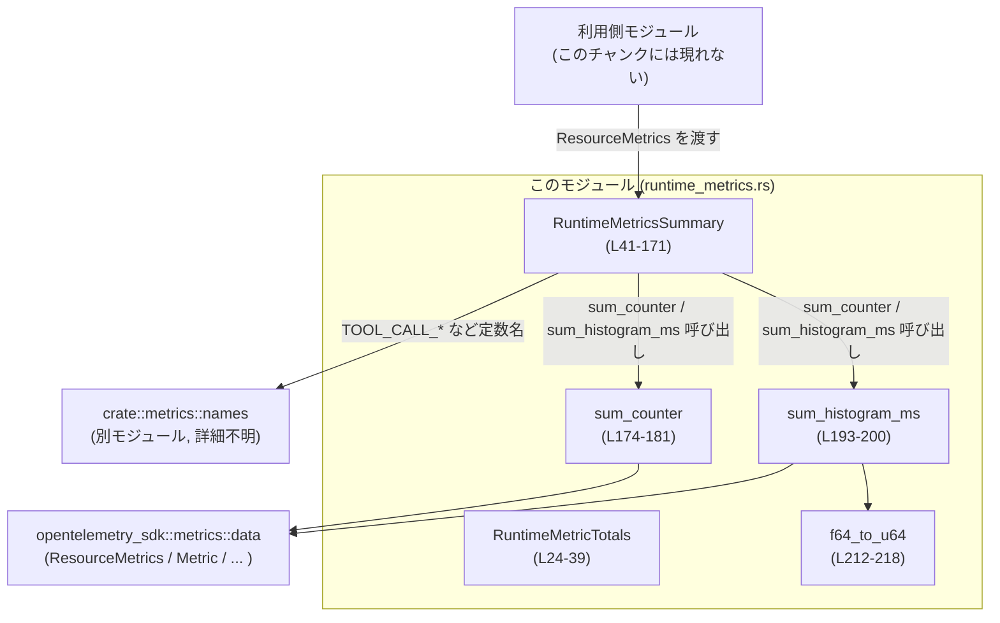
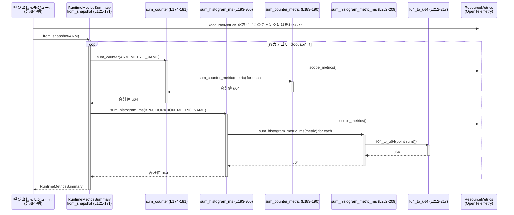

# otel/src/metrics/runtime_metrics.rs

---

## 0. ざっくり一言

OpenTelemetry SDK の `ResourceMetrics` スナップショットから、ツール呼び出し・API 呼び出し・ストリーミング／WebSocket イベントやレスポンス関連レイテンシなどを集計し、扱いやすい合計値サマリ構造体へ変換するモジュールです（根拠: `RuntimeMetricsSummary::from_snapshot` 定義）。  
（根拠: `otel/src/metrics/runtime_metrics.rs:L41-56, L121-171`）

---

## 1. このモジュールの役割

### 1.1 概要

- このモジュールは **OpenTelemetry のメトリクススナップショットを集約し、ランタイム全体のメトリクスサマリを作る** ために存在します。
- カウンタメトリクス（回数）とヒストグラムメトリクス（時間）を走査し、`RuntimeMetricsSummary` に格納します。
- サマリ同士のマージ（合算／上書き）や、レスポンス API 関連のメトリクスだけを切り出す補助メソッドも提供します。  
  （根拠: `RuntimeMetricsSummary` とその impl, `sum_*` 関数群  
  `otel/src/metrics/runtime_metrics.rs:L41-119, L121-171, L174-218`）

### 1.2 アーキテクチャ内での位置づけ

このモジュールが依存する主要コンポーネントと、その関係を示します。



- `RuntimeMetricsSummary::from_snapshot` が本モジュールの「入口」となり、`ResourceMetrics` を受け取って内部の集約関数 (`sum_counter`, `sum_histogram_ms`) を呼び出します（`L121-171`）。
- 集約関数は OpenTelemetry SDK の `ResourceMetrics`, `Metric`, `MetricData`, `AggregatedMetrics` などに依存します（`L19-22, L174-190, L193-209`）。
- メトリクス名は `crate::metrics::names::*` からインポートした文字列定数で指定されます（`L1-18`）。

### 1.3 設計上のポイント

- **責務の分割**
  - 値の集約結果を持つ構造体 (`RuntimeMetricTotals`, `RuntimeMetricsSummary`) と、
    `ResourceMetrics` から値を取り出して合計するロジック（`sum_*` 系）を分離しています。
    （`L24-39`, `L41-171`, `L174-218`）
- **状態管理**
  - 構造体はすべて `Copy` 可能な値型であり、内部にポインタや参照を保持していません（`derive(Clone, Copy, Default, PartialEq, Eq)`; `L24, L41`）。
  - `ResourceMetrics` は引数として借用（不変参照）するだけで、モジュール内部では保持しません（`L121, L174, L193`）。
- **エラーハンドリング方針**
  - 想定した型・形式でないメトリクス（例: 型がカウンタでない）や、非有限・負の値は **0 として扱い、エラーにはしない** 方針です（`sum_counter_metric` の `_ => 0`、`f64_to_u64` のガード; `L183-190, L212-215`）。
- **数値安全性**
  - `saturating_add` でオーバーフローを飽和加算にし、`f64_to_u64` でも `u64::MAX` にクランプしてから丸めることで、パニックや不定動作を避けています（`L36-37, L216-217`）。
- **並行性**
  - `&ResourceMetrics` を不変参照で読み取るだけであり、内部で `unsafe` や共有可変状態を扱っていないため、関数呼び出し自体はスレッドセーフな設計です（`unsafe` 不在, 引数が `&ResourceMetrics` のみ; `L121, L174, L193`）。

---

## 2. 主要な機能一覧

- OpenTelemetry `ResourceMetrics` から、各種メトリクス（ツール呼び出し数・API 呼び出し数・SSE/WS イベント数と時間など）を合計して取得
- それらの合計値を `RuntimeMetricsSummary` 構造体として保持
- サマリ同士をマージして合算（回数）や上書き（レイテンシ値）を行う
- レスポンス API 関連のメトリクスだけを抜き出したサマリを作成
- カウンタメトリクス・ヒストグラムメトリクスの共通集計ヘルパー関数群

### 2.1 コンポーネント一覧（インベントリー）

| 名称 | 種別 | 公開範囲 | 役割 / 用途 | 定義位置 |
|------|------|----------|------------|----------|
| `RuntimeMetricTotals` | 構造体 | `pub` | あるカテゴリ（例: API 呼び出し）の回数と合計時間（ms）を保持する基本単位です。 | `otel/src/metrics/runtime_metrics.rs:L24-28` |
| `RuntimeMetricsSummary` | 構造体 | `pub` | ツール呼び出し・API・SSE・WebSocket・レスポンス API レイテンシ等をまとめた集約サマリです。 | `otel/src/metrics/runtime_metrics.rs:L41-56` |
| `RuntimeMetricTotals::is_empty` | メソッド | `pub` | `count` と `duration_ms` の両方が 0 かどうかを判定します。 | `otel/src/metrics/runtime_metrics.rs:L30-33` |
| `RuntimeMetricTotals::merge` | メソッド | `pub` | `self` と `other` の `count` と `duration_ms` を飽和加算で合算します。 | `otel/src/metrics/runtime_metrics.rs:L35-38` |
| `RuntimeMetricsSummary::is_empty` | メソッド | `pub` | 全てのカウンタ・レイテンシフィールドが 0（または空）かどうかを判定します。 | `otel/src/metrics/runtime_metrics.rs:L58-73` |
| `RuntimeMetricsSummary::merge` | メソッド | `pub` | 各カテゴリの合算・上書きを行い、2 つのサマリをマージします。 | `otel/src/metrics/runtime_metrics.rs:L75-107` |
| `RuntimeMetricsSummary::responses_api_summary` | メソッド | `pub` | レスポンス API 関連のフィールドだけを持つ新しい `RuntimeMetricsSummary` を生成します。 | `otel/src/metrics/runtime_metrics.rs:L109-118` |
| `RuntimeMetricsSummary::from_snapshot` | 関数（関連関数） | `pub(crate)` | `ResourceMetrics` からこのサマリ構造体を構築するメイン入口です。 | `otel/src/metrics/runtime_metrics.rs:L121-171` |
| `sum_counter` | 関数 | `fn` | 指定したメトリクス名のカウンタ値を全スコープ・全データポイントから合計します。 | `otel/src/metrics/runtime_metrics.rs:L174-181` |
| `sum_counter_metric` | 関数 | `fn` | 一つの `Metric` インスタンスからカウンタ値を合計します。 | `otel/src/metrics/runtime_metrics.rs:L183-190` |
| `sum_histogram_ms` | 関数 | `fn` | 指定したメトリクス名のヒストグラム合計値を ms の `u64` として合計します。 | `otel/src/metrics/runtime_metrics.rs:L193-200` |
| `sum_histogram_metric_ms` | 関数 | `fn` | 一つの `Metric` からヒストグラムの合計値を取得し `u64` ms に変換して合計します。 | `otel/src/metrics/runtime_metrics.rs:L202-209` |
| `f64_to_u64` | 関数 | `fn` | 非有限・非正の値を 0 とし、`u64::MAX` にクランプした上で四捨五入して `u64` に変換します。 | `otel/src/metrics/runtime_metrics.rs:L212-217` |

---

## 3. 公開 API と詳細解説

### 3.1 型一覧（構造体・列挙体など）

| 名前 | 種別 | 役割 / 用途 | 主なフィールド | 定義位置 |
|------|------|-------------|----------------|----------|
| `RuntimeMetricTotals` | 構造体 | 一つのカテゴリの呼び出し回数と合計時間（ms）を表す基本単位です。 | `count: u64`, `duration_ms: u64` | `L24-28` |
| `RuntimeMetricsSummary` | 構造体 | ランタイム全体のメトリクスをまとめたサマリで、各カテゴリごとに `RuntimeMetricTotals` や合計時間(ms)フィールドを持ちます。 | `tool_calls`, `api_calls`, `streaming_events`, `websocket_calls`, `websocket_events`, さまざまなレスポンス API レイテンシフィールド | `L41-56` |

（すべて `Debug`, `Clone`, `Copy`, `Default`, `PartialEq`, `Eq` を derive しており、値セマンティクスで扱いやすい設計です。`L24, L41`）

---

### 3.2 関数詳細（重要な 7 件）

#### `RuntimeMetricTotals::merge(&mut self, other: Self)`

**概要**

`self` に対して `other` の `count` と `duration_ms` を加算し、一つの合計値にまとめます。加算はオーバーフローしないよう `saturating_add` で行われます。  
（根拠: `otel/src/metrics/runtime_metrics.rs:L35-38`）

**引数**

| 引数名 | 型 | 説明 |
|--------|----|------|
| `&mut self` | `&mut RuntimeMetricTotals` | マージ結果を書き込む対象です。 |
| `other` | `RuntimeMetricTotals` | 合算対象となるもう一方のトータル値です。 |

**戻り値**

- 戻り値はありません（`()`）。`self` がインプレースで更新されます。

**内部処理の流れ**

1. `self.count = self.count.saturating_add(other.count);`
2. `self.duration_ms = self.duration_ms.saturating_add(other.duration_ms);`
   （`saturating_add` により `u64::MAX` を超える場合は `u64::MAX` に留まります）

**Examples（使用例）**

```rust
use crate::metrics::runtime_metrics::RuntimeMetricTotals;

fn merge_totals_example() {
    let mut base = RuntimeMetricTotals { count: 10, duration_ms: 1000 }; // 基本となる集計値
    let incr = RuntimeMetricTotals { count: 5, duration_ms: 300 };      // 追加分

    base.merge(incr);                                                   // base に incr をマージ

    assert_eq!(base.count, 15);                                         // 回数が加算される
    assert_eq!(base.duration_ms, 1300);                                 // 時間も加算される
}
```

**Errors / Panics**

- パニック要素は見当たりません。`saturating_add` を使っているため、オーバーフローでもパニックになりません。

**Edge cases（エッジケース）**

- `other.count == 0` かつ `other.duration_ms == 0` の場合は何も変化しません。
- どちらか一方が `u64::MAX` の近くでも `saturating_add` が上限で止めます。

**使用上の注意点**

- 「オーバーフローを検知したい」ケースには向きません。飽和するだけであり、オーバーフロー自体を知ることはできません。
- 合算が意味を持たないメトリクス（最大値・最新値など）には使用すべきではありません。

---

#### `RuntimeMetricsSummary::merge(&mut self, other: Self)`

**概要**

2 つの `RuntimeMetricsSummary` をマージします。回数や合計時間を持つフィールドは `RuntimeMetricTotals::merge` で合算し、一部のレイテンシ値（ms の `u64`）は **0 より大きい値があれば `other` の値で上書き** します。  
（根拠: `otel/src/metrics/runtime_metrics.rs:L75-107`）

**引数**

| 引数名 | 型 | 説明 |
|--------|----|------|
| `&mut self` | `&mut RuntimeMetricsSummary` | マージ先／結果を書き込む対象です。 |
| `other` | `RuntimeMetricsSummary` | マージ元となるサマリです。 |

**戻り値**

- 戻り値はありません。`self` が更新されます。

**内部処理の流れ**

1. 各トータルフィールドに対して `merge` を呼び出し、回数と時間を合算します。  
   `tool_calls`, `api_calls`, `streaming_events`, `websocket_calls`, `websocket_events`（`L76-80`）。
2. レスポンス API 関連や `turn_*` のフィールドについて、
   `other.*_ms > 0` であれば `self.*_ms = other.*_ms` として上書きします（`L81-106`）。
3. `other` の対応フィールドが 0 の場合、`self` の元の値が維持されます。

**Examples（使用例）**

```rust
use crate::metrics::runtime_metrics::{RuntimeMetricTotals, RuntimeMetricsSummary};

fn merge_summaries_example() {
    let base = RuntimeMetricsSummary {
        api_calls: RuntimeMetricTotals { count: 10, duration_ms: 5000 },
        responses_api_overhead_ms: 100,
        ..RuntimeMetricsSummary::default()
    };

    let incr = RuntimeMetricsSummary {
        api_calls: RuntimeMetricTotals { count: 5, duration_ms: 2000 },
        responses_api_overhead_ms: 0, // 0 は「値なし」として扱われる
        ..RuntimeMetricsSummary::default()
    };

    let mut merged = base;
    merged.merge(incr);

    assert_eq!(merged.api_calls.count, 15);               // 合算される
    assert_eq!(merged.responses_api_overhead_ms, 100);    // 0 なので上書きされず元の値のまま
}
```

**Errors / Panics**

- パニック要素はありません。内部で使用する `RuntimeMetricTotals::merge` は飽和加算です。

**Edge cases**

- `other` のレイテンシ値フィールドが 0 のとき:
  - そのフィールドはマージ前の `self` の値が保持されます。
  - 「0ms という計測結果」と「計測値が存在しない」が区別されません（どちらも 0 と扱われます）。
- `self` と `other` の両方が 0 の場合は当然ながら 0 のままです。

**使用上の注意点**

- レイテンシ系フィールドが「最後に観測した値」なのか「合計値」なのか、この設計からは断定できませんが、**加算ではなく上書き** される点に注意が必要です（`L81-106`）。
- 「0 という実計測値」を扱いたい場合は、0 を特別扱いしている現在の仕様では区別がつかない点が潜在的なバグ源になり得ます。

---

#### `RuntimeMetricsSummary::responses_api_summary(&self) -> RuntimeMetricsSummary`

**概要**

既存のサマリから、レスポンス API 関連のフィールドのみをコピーした新しい `RuntimeMetricsSummary` を返します。他のフィールドは `Default`（0）です。  
（根拠: `otel/src/metrics/runtime_metrics.rs:L109-118`）

**引数**

| 引数名 | 型 | 説明 |
|--------|----|------|
| `&self` | `&RuntimeMetricsSummary` | 元となるサマリです。 |

**戻り値**

- `RuntimeMetricsSummary`: レスポンス API 関連フィールドのみ値がコピーされた新しいインスタンス。

**内部処理の流れ**

1. `Self { responses_api_overhead_ms: self.responses_api_overhead_ms, ... }` のリテラルで新しい構造体を作成（`L110-116`）。
2. `..RuntimeMetricsSummary::default()` により、それ以外のフィールドはすべて 0 初期化されます（`L117-118`）。

**Examples（使用例）**

```rust
use crate::metrics::runtime_metrics::RuntimeMetricsSummary;

fn responses_api_only_example(summary: &RuntimeMetricsSummary) {
    let resp_only = summary.responses_api_summary();  // レスポンス API 関連だけ抽出

    assert_eq!(resp_only.tool_calls.count, 0);        // 他のフィールドは 0
    // 必要に応じて resp_only をログ出力や集計に使う
}
```

**Errors / Panics**

- ありません。単なる値コピーです。

**Edge cases**

- 元のサマリのレスポンス API 関連フィールドがすべて 0 の場合、戻り値は全フィールド 0 のサマリになります。

**使用上の注意点**

- この関数はレスポンス API 関連フィールドだけを保持したい場合の「ビュー」のような役割です。  
  その他のカテゴリ情報（ツール/WSなど）は失われる点に注意が必要です。

---

#### `RuntimeMetricsSummary::from_snapshot(snapshot: &ResourceMetrics) -> Self`（`pub(crate)`）

**概要**

OpenTelemetry SDK の `ResourceMetrics` スナップショットから、各種メトリクス（ツール/ API/ SSE/ WebSocket/ レスポンス API/ turn_*）を取り出して合計し、`RuntimeMetricsSummary` を構築するメイン関数です。  
（根拠: `otel/src/metrics/runtime_metrics.rs:L121-171`）

**引数**

| 引数名 | 型 | 説明 |
|--------|----|------|
| `snapshot` | `&ResourceMetrics` | OpenTelemetry SDK のリソース単位メトリクススナップショットです。 |

**戻り値**

- `RuntimeMetricsSummary`: `snapshot` に含まれる対象メトリクスを合計したサマリです。

**内部処理の流れ**

1. 各カテゴリごとに `RuntimeMetricTotals` を構築します。
   - `tool_calls` などについて、`sum_counter(snapshot, <COUNT_METRIC_NAME>)` で `count` を、`sum_histogram_ms(snapshot, <DURATION_METRIC_NAME>)` で `duration_ms` を計算（`L122-141`）。
2. レスポンス API 関連のさまざまなレイテンシフィールドを `sum_histogram_ms` で個別に合計（`L142-153`）。
3. `turn_ttft_ms`, `turn_ttfm_ms` も `sum_histogram_ms` で合計（`L154-155`）。
4. これらをまとめて `Self { ... }` で `RuntimeMetricsSummary` を返却（`L156-170`）。

**Examples（使用例）**

`pub(crate)` なので crate 内部での利用例を想定したコードです。

```rust
use opentelemetry_sdk::metrics::data::ResourceMetrics;
use crate::metrics::runtime_metrics::RuntimeMetricsSummary;

// どこか別モジュールで ResourceMetrics スナップショットを取得済みと仮定
fn summarize_snapshot(snapshot: &ResourceMetrics) -> RuntimeMetricsSummary {
    RuntimeMetricsSummary::from_snapshot(snapshot) // スナップショットからサマリを作成
}
```

**Errors / Panics**

- `sum_counter` と `sum_histogram_ms` が内部で `Iterator::sum` を使っていますが、これは空イテレータでも 0 を返すだけで、パニックはしません（`L179-181, L199-200`）。
- 型が想定と異なる `Metric` が存在しても、`match` の `_ => 0` にフォールバックして 0 を返すため、パニックやエラーは発生しません（`L183-190, L203-209`）。

**Edge cases**

- 対象メトリクス名の `Metric` が全く存在しない場合: 該当フィールドは 0 となります。
- `Metric` が存在しても、型が想定通りでない（例: カウンタではなくゲージ）場合: そのメトリクスは無視され、結果は 0 になります。
- `Metric` に含まれるヒストグラムデータの合計 (`sum()`) が非有限（NaN, inf）または 0 以下の場合: `f64_to_u64` により 0 として扱われます（`L212-215`）。

**使用上の注意点**

- この関数は `pub(crate)` であり、**crate 外部からは直接呼び出せません**（`L121`）。
- 「メトリクスが壊れている／型が違う」といった状況でも 0 として処理されるため、**計測漏れや設定ミスを検知しづらい** というトレードオフがあります。
- 大量のメトリクスがある環境では、各メトリクス名のために `ResourceMetrics` を何度も走査する実装になっているため（`sum_counter`・`sum_histogram_ms` が毎回全スコープを走査; `L174-181, L193-200`）、性能への影響を考慮する必要があります。

---

#### `sum_counter(snapshot: &ResourceMetrics, name: &str) -> u64`

**概要**

`ResourceMetrics` 内のすべてのスコープから、指定した `name` を持つカウンタメトリクスを探し、全データポイントの値を合計して `u64` を返します。  
（根拠: `otel/src/metrics/runtime_metrics.rs:L174-181`）

**引数**

| 引数名 | 型 | 説明 |
|--------|----|------|
| `snapshot` | `&ResourceMetrics` | 集計対象のメトリクススナップショットです。 |
| `name` | `&str` | 探索するメトリクス名です。`Metric::name()` と文字列比較します。 |

**戻り値**

- `u64`: すべての `Metric`・すべてのデータポイントにおけるカウンタ値の合計。該当メトリクスが無ければ 0。

**内部処理の流れ**

1. `snapshot.scope_metrics()` で全スコープを列挙（`L175`）。
2. 各スコープで `ScopeMetrics::metrics` によって各 `Metric` を走査（`L176-177`）。
3. `metric.name() == name` のものだけをフィルタリング（`L178`）。
4. 各 `Metric` に対して `sum_counter_metric` を呼び出し、その結果を `Iterator::sum()` で合計（`L179-180`）。

**Examples（使用例）**

```rust
use opentelemetry_sdk::metrics::data::ResourceMetrics;
use crate::metrics::runtime_metrics::sum_counter;

fn count_tool_calls(snapshot: &ResourceMetrics) -> u64 {
    const TOOL_CALL_COUNT_METRIC: &str = "tool.call.count"; // 本当の定数は names モジュールで定義

    sum_counter(snapshot, TOOL_CALL_COUNT_METRIC)           // 対象メトリクス名のカウンタ合計
}
```

**Errors / Panics**

- 該当メトリクスが一つもなくても、単に 0 が返るだけでエラーにはなりません。
- 各 `Metric` の型が想定と異なる場合でも、`sum_counter_metric` で `_ => 0` にフォールバックするため、パニックは発生しません。

**Edge cases**

- `name` が空文字列または存在しないメトリクス名: 結果は 0 です。
- `ResourceMetrics` 内の `Metric` が大量に存在する場合、**全件を走査する処理** になるため、一回の呼び出しコストが高くなります。

**使用上の注意点**

- エラー検出（型が変わった、メトリクスが登録されていない）には使えません。常に 0 が返る可能性があるため、別途設定検証が必要です。
- 同一 `ResourceMetrics` に対して複数の異なる `name` を集計する場合、内部走査が繰り返されるため、パフォーマンス上は注意が必要です（`from_snapshot` がこの形になっています; `L121-171`）。

---

#### `sum_histogram_ms(snapshot: &ResourceMetrics, name: &str) -> u64`

**概要**

`ResourceMetrics` 内のすべてのスコープから、指定名 `name` を持つヒストグラムメトリクスの合計値（`sum()`）を取り出し、`f64_to_u64` で ms の `u64` 値として合計します。  
（根拠: `otel/src/metrics/runtime_metrics.rs:L193-200`）

**引数**

| 引数名 | 型 | 説明 |
|--------|----|------|
| `snapshot` | `&ResourceMetrics` | ヒストグラム集計対象のスナップショットです。 |
| `name` | `&str` | 対象となるヒストグラムメトリクス名です。 |

**戻り値**

- `u64`: 指定名を持つ全ヒストグラムの `sum()` の合計を、非有限／負値を除去して `u64` に変換したもの。該当メトリクス無しや不正値のみなら 0。

**内部処理の流れ**

1. `snapshot.scope_metrics()` → `flat_map(ScopeMetrics::metrics)` で全 `Metric` を列挙（`L194-197`）。
2. `metric.name() == name` でフィルタ（`L198`）。
3. 各 `Metric` に対して `sum_histogram_metric_ms` を呼び出し、戻り値を `Iterator::sum()` で合計（`L199-200`）。

**Examples（使用例）**

```rust
use opentelemetry_sdk::metrics::data::ResourceMetrics;
use crate::metrics::runtime_metrics::sum_histogram_ms;

fn total_api_latency_ms(snapshot: &ResourceMetrics) -> u64 {
    const API_CALL_DURATION_METRIC: &str = "api.call.duration"; // 実際は names モジュールの定数

    sum_histogram_ms(snapshot, API_CALL_DURATION_METRIC)        // ヒストグラムの合計時間(ms)
}
```

**Errors / Panics**

- 該当メトリクスが無い、あるいは型がヒストグラムでない場合は 0 が返るだけで、パニックはしません。
- `f64_to_u64` が非有限値や負数を 0 に変換するため、パニック要素はありません（`L212-215`）。

**Edge cases**

- 非有限（NaN, ±∞）の `sum()` 値: `f64_to_u64` により 0 に変換されます。
- 非負であっても極端に大きい値: `u64::MAX` にクランプされます（`L216-217`）。
- 多数のスコープ／メトリクスが存在する場合、`sum_counter` と同じく全件走査になるため、コストが高くなります。

**使用上の注意点**

- 単位はコードだけでは明示されていませんが、`duration_ms` として扱われていることから、**ミリ秒単位** で集計される前提になっています（`L27, L122-125` など）。
- 小数の丸め（`round()`）により、微小な誤差が生じる点に留意する必要があります。

---

#### `f64_to_u64(value: f64) -> u64`

**概要**

ヒストグラムの合計値など、`f64` の値を安全に `u64` に変換するヘルパー関数です。非有限値や 0 以下の値は 0 とし、`u64::MAX` を超える値はクランプしてから `round()` で整数化します。  
（根拠: `otel/src/metrics/runtime_metrics.rs:L212-217`）

**引数**

| 引数名 | 型 | 説明 |
|--------|----|------|
| `value` | `f64` | 変換対象の浮動小数点数値です。 |

**戻り値**

- `u64`: クランプ・丸め済みの非負整数値。非有限または 0 以下の場合は 0。

**内部処理の流れ**

1. `if !value.is_finite() || value <= 0.0 { return 0; }` で非有限または 0 以下の値を即座に 0 とする（`L213-215`）。
2. `let clamped = value.min(u64::MAX as f64);` で上限を `u64::MAX` にクランプ（`L216`）。
3. `clamped.round() as u64` で四捨五入してから `u64` にキャスト（`L217`）。

**Examples（使用例）**

```rust
use crate::metrics::runtime_metrics::f64_to_u64;

fn convert_examples() {
    assert_eq!(f64_to_u64(1234.4), 1234);               // 四捨五入前後の例
    assert_eq!(f64_to_u64(1234.5), 1235);

    assert_eq!(f64_to_u64(-10.0), 0);                  // 負数は 0 に
    assert_eq!(f64_to_u64(f64::NAN), 0);               // NaN も 0 に
}
```

**Errors / Panics**

- ありません。`as u64` キャストも、非負でクランプ済みの値に対してのみ行われるため安全です。

**Edge cases**

- `value == 0.0` → 0 が返されます。
- `0.0 < value < 0.5` → `round()` により 0 になるため、結果として 0 です。
- `value` が非常に大きく `u64::MAX as f64` より大きい場合 → `u64::MAX` に固定されます。

**使用上の注意点**

- 「0 かどうか」でメトリクスの存在有無を判断しているコードと組み合わせると、**若干の誤差や丸めの結果 0 になる値** が「無い」と誤認される可能性があります。
- 浮動小数点から整数への変換であるため、少なくとも ±0.5 の誤差は避けられません。

---

### 3.3 その他の関数・メソッド

| 関数 / メソッド名 | 役割（1 行） | 定義位置 |
|-------------------|--------------|----------|
| `RuntimeMetricTotals::is_empty` | `count == 0` かつ `duration_ms == 0` かどうかの判定メソッドです。 | `L30-33` |
| `RuntimeMetricsSummary::is_empty` | すべてのカテゴリ・レイテンシフィールドが 0 かどうかをチェックします。 | `L58-73` |
| `sum_counter_metric` | `MetricData::Sum` を持つ `U64` カウンタの全データポイントを合計します。 | `L183-190` |
| `sum_histogram_metric_ms` | `MetricData::Histogram` を持つ `F64` ヒストグラムから `sum()` を取り出し `f64_to_u64` に通して合計します。 | `L202-209` |

---

## 4. データフロー

### 4.1 代表的な処理シナリオ

**シナリオ:** OpenTelemetry SDK から取得した `ResourceMetrics` スナップショットから、レスポンス API のオーバーヘッド時間や inference 時間などを含むサマリを作る流れ。



- 上記は `RuntimeMetricsSummary::from_snapshot` が `sum_counter` と `sum_histogram_ms` を繰り返し呼び出す実装（`L121-171`）に対応しています。
- 各 `sum_*` 関数は全スコープ・全メトリクスを走査するため、メトリクス数に比例した処理コストが発生します（`L174-181, L193-200`）。

---

## 5. 使い方（How to Use）

### 5.1 基本的な使用方法

crate 内部（同一クレート）での典型的な利用フローの例です。

```rust
use opentelemetry_sdk::metrics::data::ResourceMetrics;
use crate::metrics::runtime_metrics::{
    RuntimeMetricTotals, RuntimeMetricsSummary,
};

// 例: どこかで OpenTelemetry SDK から ResourceMetrics を取得していると仮定
fn handle_metrics_snapshot(snapshot: &ResourceMetrics) {
    // スナップショットからランタイムメトリクスサマリを構築する
    let mut summary = RuntimeMetricsSummary::from_snapshot(snapshot); // L121-171

    // 追加のスナップショットがあればマージする（例: 複数スレッドからの集計など）
    // let another_snapshot: ResourceMetrics = ...;
    // let another_summary = RuntimeMetricsSummary::from_snapshot(&another_snapshot);
    // summary.merge(another_summary);  // L75-107

    // レスポンス API 関連だけを取り出す
    let resp_summary = summary.responses_api_summary(); // L109-118

    // 空でない場合のみログ出力するなど
    if !resp_summary.is_empty() {                       // L58-73
        println!("responses api overhead: {} ms", resp_summary.responses_api_overhead_ms);
    }
}
```

### 5.2 よくある使用パターン

1. **複数スナップショットの統合**

   - 複数の `ResourceMetrics`（例: 各ワーカー/スレッド）がある場合、
     `from_snapshot` でそれぞれサマリを生成し、`merge` で一つにまとめる。

   ```rust
   fn aggregate_multiple_snapshots(snaps: &[ResourceMetrics]) -> RuntimeMetricsSummary {
       let mut total = RuntimeMetricsSummary::default();             // すべて 0 のサマリ
       for snap in snaps {
           let summary = RuntimeMetricsSummary::from_snapshot(snap); // 各スナップショットをサマリ化
           total.merge(summary);                                     // 合算
       }
       total
   }
   ```

2. **カテゴリ単位でのチェック**

   - あるカテゴリだけを見て、メトリクスが取得されているかどうかを確認する。

   ```rust
   fn has_tool_calls(summary: &RuntimeMetricsSummary) -> bool {
       !summary.tool_calls.is_empty()                                // L30-33
   }
   ```

3. **レスポンス API メトリクスのログ出力**

   ```rust
   fn log_responses_api(summary: &RuntimeMetricsSummary) {
       let resp = summary.responses_api_summary();                   // レスポンス API 関連のみ
       if resp.is_empty() {
           return;
       }
       println!(
           "overhead={}ms, inference={}ms",
           resp.responses_api_overhead_ms,
           resp.responses_api_inference_time_ms,
       );
   }
   ```

### 5.3 よくある間違い

```rust
use crate::metrics::runtime_metrics::RuntimeMetricsSummary;

// 間違い例: from_snapshot を crate 外部から使おうとする
// pub fn expose_summary(snapshot: &ResourceMetrics) -> RuntimeMetricsSummary {
//     RuntimeMetricsSummary::from_snapshot(snapshot)
//     // エラー: from_snapshot は pub(crate) なので同一クレート内でしか使えない
// }

// 正しい例: crate 内で使うか、まとめてラップする公開関数を別に用意する
pub fn expose_summary_in_other_crate(summary: RuntimeMetricsSummary) -> RuntimeMetricsSummary {
    summary // すでに構築済みのサマリを外部に公開するなど
}
```

```rust
use crate::metrics::runtime_metrics::RuntimeMetricsSummary;

// 間違い例: merge が「レイテンシを合算する」と誤解している
fn wrong_merge(base: &mut RuntimeMetricsSummary, new: RuntimeMetricsSummary) {
    base.merge(new);
    // responses_api_overhead_ms などは new が 0 でなければ上書きされるだけで、合計ではない。
}

// 正しい理解: レスポンス API 関連フィールドは 0 でない方に「置き換え」される
```

### 5.4 使用上の注意点（まとめ）

- **0 の意味の曖昧さ**
  - メトリクスが存在しない場合、型が合わない場合、値が非有限・負の場合、どれも 0 として扱われます（`sum_*` の `_ => 0` と `f64_to_u64`; `L183-190, L203-209, L212-215`）。
  - 「0 が実際の計測値なのか、単にメトリクスがないだけなのか」の区別はできません。
- **パフォーマンス**
  - 各 `sum_counter` / `sum_histogram_ms` 呼び出しごとに `ResourceMetrics` 全体を走査します（`L175-180, L194-200`）。
  - `from_snapshot` は多くのメトリクス名に対してこれを繰り返すため（少なくとも 10 回程度）、メトリクス数が大きい環境ではオーバーヘッドになる可能性があります。
- **安全性 / セキュリティ**
  - 入力は OpenTelemetry の内部データ構造であり、文字列や外部入力のパース等は行っていません。
  - `unsafe` コードは存在せず、数値演算は飽和加算・クランプ・丸めで安全側に寄せています（`L36-37, L212-217`）。
  - セキュリティリスクは特に読み取れませんが、「誤設定やメトリクスタイプ変更に気づきにくい」という意味で、**監視の信頼性** には注意が必要です。

---

## 6. 変更の仕方（How to Modify）

### 6.1 新しい機能を追加する場合（新メトリクスの追加）

新しいメトリクスカテゴリ（例: バックエンド DB 呼び出し時間など）を追加する場合の手順例です。

1. **メトリクス名の定義**
   - `crate::metrics::names` モジュールに、新しいメトリクス名の定数を追加します。  
     （このファイルからはモジュールパスのみが分かります: `L1-18`）
2. **サマリ構造体へのフィールド追加**
   - `RuntimeMetricsSummary` に新しいフィールドを追加します。
     - カウンタ + 時間のペアなら `RuntimeMetricTotals` フィールドを追加（`L43-47`のように）。
     - 単一の合計時間で十分なら `u64` フィールドとして追加（`L48-55` のように）。
3. **`is_empty` の更新**
   - 新フィールドも空判定に含めるよう、`RuntimeMetricsSummary::is_empty` に条件式を追加します（`L58-73`）。
4. **`merge` の更新**
   - カウンタ/時間ペアなら `self.新フィールド.merge(other.新フィールド);` を追加。
   - `u64` レイテンシなら、0 を特別扱いするかどうかの方針に合わせて `if other.xxx > 0 { self.xxx = other.xxx; }` のようなロジックを追加（`L81-106` を参考）。
5. **`from_snapshot` の更新**
   - 新しいメトリクス名に対して `sum_counter` / `sum_histogram_ms` を呼び出し、フィールドに代入します（`L121-171` のパターンを踏襲）。
6. **レスポンス API 専用サマリの更新（必要なら）**
   - 新フィールドがレスポンス API 関連であれば、`responses_api_summary` にコピー処理を追加します（`L109-116`）。

変更後は、**`is_empty`・`merge`・`responses_api_summary` の整合性**を確認することが重要です。

### 6.2 既存の機能を変更する場合

- **マージロジックの変更**
  - 例えば、「レスポンス API レイテンシも合計したい」場合、
    - `RuntimeMetricsSummary::merge` 内の `if other.xxx > 0 { self.xxx = other.xxx; }` を、`saturating_add` を使った加算ロジックに変更する必要があります（`L81-106`）。
  - この変更は、「`0` を値なしとして扱う」という現行の暗黙の契約を破るため、呼び出し元（ログ出力やアラート判定）への影響を精査する必要があります。
- **0 の扱いの変更**
  - `f64_to_u64` の条件（`value <= 0.0` を 0 として扱う）を変える場合、
    - ヒストグラム値が 0 でも「有効な計測」と見なしたいかどうかを意識する必要があります（`L213-215`）。
  - ここを変更すると、`is_empty` の意味合いも実質的に変わる可能性があります。
- **型変更・OpenTelemetry 側の変更対応**
  - OpenTelemetry SDK の API 変更により、`MetricData::Sum` や `Histogram` の構造が変わった場合、
    - `sum_counter_metric` と `sum_histogram_metric_ms` の `match` パターン（`L183-190, L203-209`）を更新する必要があります。
  - 型が変わると現行コードでは `_ => 0` に落ちるため、「急にメトリクスが 0 になる」という現象で問題に気づくことになります。  
    そのため、バージョンアップ時にはテストやログで検証することが望ましいです。

**テスト観点（このファイルにはテストなし）**

- このファイルにはテストコードが含まれていません（`mod tests` 等は存在しません）。
- 追加・変更の際には少なくとも次のケースのテストを用意するのが有用です（場所は別ファイルになる想定）:
  - `sum_counter` / `sum_histogram_ms` に対して:
    - 対象メトリクスあり / なし / 型不一致 / NaN / 負値。
  - `RuntimeMetricsSummary::merge`:
    - レイテンシフィールドの 0 / 非 0 組み合わせ。
    - オーバーフロー近辺の値に対する飽和挙動。

---

## 7. 関連ファイル

このモジュールと密接に関係すると推測できるファイル・モジュールをまとめます。

| パス / モジュール | 役割 / 関係 |
|-------------------|------------|
| `crate::metrics::names`（ファイルパス不明） | メトリクス名の文字列定数群を提供します。本モジュールはこれをインポートして、`sum_counter` や `sum_histogram_ms` の `name` 引数として使用しています（`L1-18, L122-155`）。 |
| `opentelemetry_sdk::metrics::data`（外部クレート） | `ResourceMetrics`, `Metric`, `MetricData`, `AggregatedMetrics` などの型を提供する OpenTelemetry SDK のモジュールです。本モジュールの入力データと内部集約に使用されます（`L19-22, L174-181, L183-190, L193-200, L202-209`）。 |

その他の呼び出し元モジュール（`RuntimeMetricsSummary::from_snapshot` をどこで呼んでいるかなど）は、このチャンクには現れないため不明です。
