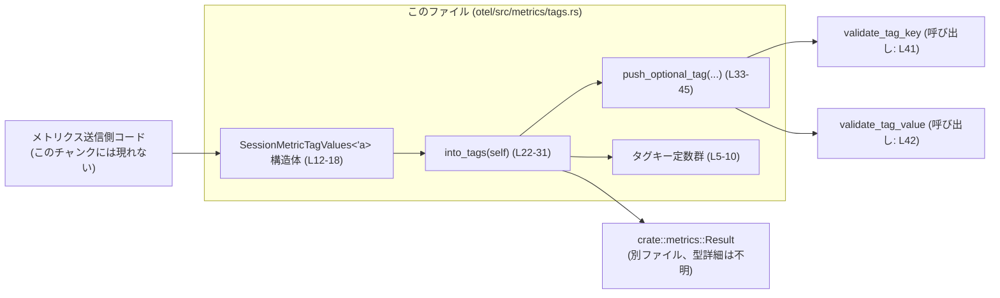
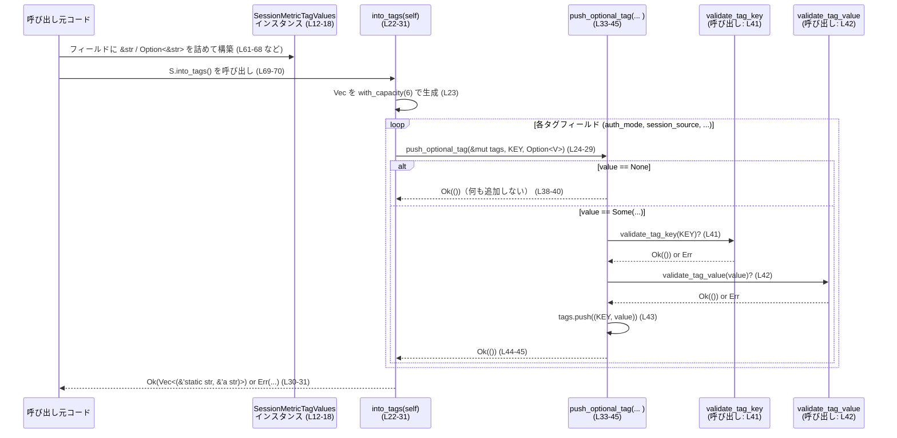

# otel/src/metrics/tags.rs コード解説

## 0. ざっくり一言

OpenTelemetry などで使うと考えられる「セッション関連メトリクスのタグ」をまとめて扱うためのヘルパーです。`SessionMetricTagValues` に文字列を詰めると、検証済みの `(タグキー, タグ値)` の `Vec` に変換します（根拠: `SessionMetricTagValues` と `into_tags` の実装、otel/src/metrics/tags.rs:L12-19, L22-31）。

---

## 1. このモジュールの役割

### 1.1 概要

- セッションに関する複数のタグ値（認証方式・セッションの種類・発行元・サービス名・モデル名・アプリバージョン）を 1 つの構造体で受け取ります（L12-18）。
- それらを静的なタグキー定数と組み合わせ、バリデーション済みのタグ一覧 `Vec<(&'static str, &'a str)>` へ変換します（L5-10, L22-30, L41-42）。
- タグキー・タグ値の検証には `crate::metrics::validation::{validate_tag_key, validate_tag_value}` を利用し、エラーは `crate::metrics::Result` で呼び出し元へ返します（L1-3, L22, L33-37, L41-42）。

### 1.2 アーキテクチャ内での位置づけ

このファイル単体から分かる関係だけを図示します。`Result` と `validate_*` の具体的な定義はこのチャンクには現れません。



- 呼び出し元は `SessionMetricTagValues` を構築し（L12-18）、`into_tags` を呼びます（テスト例: L61-70, L87-96）。
- `into_tags` は各フィールドを `push_optional_tag` に渡し（L24-29）、`push_optional_tag` 内でキーと値が検証されたうえで `Vec` に追加されます（L33-45）。
- 検証に失敗すると `Result` の `Err`（型詳細は不明）が返される設計です（`?` 演算子の利用、L24-29, L41-42）。

### 1.3 設計上のポイント

- **静的なタグキー定数**  
  タグ名はすべて `pub const &str` として定義されており、キー名を文字列リテラルで重複記述しないようにしています（L5-10）。

- **借用ベースの値管理**  
  `SessionMetricTagValues<'a>` は `&'a str` と `Option<&'a str>` だけを持ち、所有権は持ちません。これにより余計な文字列コピーを避け、元の文字列のライフタイムを `'a` で表現しています（L12-18）。

- **バリデーションの一元化**  
  `(key, value)` を `Vec` に追加する前に、必ず `validate_tag_key` と `validate_tag_value` を通すように `push_optional_tag` に処理を集約しています（L33-45）。

- **エラー伝播の明示**  
  検証エラーは `?` 演算子により `Result` を介して上位へ伝播します。`into_tags` も `push_optional_tag` も `Result` を返し、エラー時は早期リターンします（L22, L33-37, L41-42）。

- **並行性（スレッド安全性）**  
  このファイル内では共有の可変状態や `unsafe` は使われていません（全体）。`SessionMetricTagValues` は不変参照のみを持つため、この構造体自体からはデータ競合は生じません。ただし `validate_*` の内部実装はこのチャンクには現れません。

### 1.4 コンポーネント一覧（このチャンク）

要求に従い、このチャンクに現れる構造体・関数・定数の一覧と定義位置を示します。

| 名称 | 種別 | 公開 | 役割 | 定義位置 |
|------|------|------|------|----------|
| `APP_VERSION_TAG` | 定数 `&'static str` | `pub` | アプリバージョンのタグキー `"app.version"` | otel/src/metrics/tags.rs:L5 |
| `AUTH_MODE_TAG` | 定数 `&'static str` | `pub` | 認証方式のタグキー `"auth_mode"` | L6 |
| `MODEL_TAG` | 定数 `&'static str` | `pub` | モデル名のタグキー `"model"` | L7 |
| `ORIGINATOR_TAG` | 定数 `&'static str` | `pub` | セッション発行元のタグキー `"originator"` | L8 |
| `SERVICE_NAME_TAG` | 定数 `&'static str` | `pub` | サービス名のタグキー `"service_name"` | L9 |
| `SESSION_SOURCE_TAG` | 定数 `&'static str` | `pub` | セッション起点のタグキー `"session_source"` | L10 |
| `SessionMetricTagValues<'a>` | 構造体 | `pub` | セッションに紐づくタグ値の集約コンテナ | L12-18 |
| `SessionMetricTagValues::into_tags` | メソッド | `pub` | 構造体を検証済みタグ配列 `Vec<(&'static str, &'a str)>` に変換 | L22-31 |
| `SessionMetricTagValues::push_optional_tag` | メソッド | `fn`（非公開） | `Option<&str>` を検証し、`Some` のときだけ `Vec` にタグを追加 | L33-45 |
| `tests::session_metric_tags_include_expected_tags_in_order` | 関数（テスト） | `#[test]` | 全タグが指定された場合に、順番も含め期待どおりのタグが生成されることを検証 | L59-83 |
| `tests::session_metric_tags_skip_missing_optional_tags` | 関数（テスト） | `#[test]` | オプションタグが `None` のときにスキップされることを検証 | L85-107 |

---

## 2. 主要な機能一覧

このモジュールが提供する主な機能は次のとおりです。

- セッション用タグキー定数の提供: メトリクスで使うキー名を定数として公開（L5-10）。
- セッションタグ値コンテナ構造体の提供: 関連する文字列値をまとめて保持する `SessionMetricTagValues<'a>`（L12-18）。
- タグ値の検証と `(key, value)` ベクタへの変換: `into_tags` と内部ヘルパー `push_optional_tag` によるバリデーション付き変換（L22-31, L33-45）。

---

## 3. 公開 API と詳細解説

### 3.1 型一覧（構造体・列挙体など）

| 名前 | 種別 | 役割 / 用途 | フィールド概要 | 定義位置 |
|------|------|-------------|----------------|----------|
| `SessionMetricTagValues<'a>` | 構造体 | セッションに関連するタグ値をまとめて持ち、後でタグベクタに変換するためのコンテナ | `auth_mode: Option<&'a str>` 認証方式（任意）、`session_source: &'a str` セッション起点、`originator: &'a str` 発行元、`service_name: Option<&'a str>` サービス名（任意）、`model: &'a str` モデル名、`app_version: &'a str` アプリバージョン | L12-18 |

> ライフタイム `'a` は、各フィールドの `&'a str` が最低でも `SessionMetricTagValues` の生存期間中は有効であることを示します（L12-18）。

### 3.2 関数詳細

#### `SessionMetricTagValues::into_tags(self) -> Result<Vec<(&'static str, &'a str)>>`

**概要**

`SessionMetricTagValues` に格納された値を、検証済みの `(タグキー, タグ値)` の `Vec` に変換します。オプションフィールドが `None` の場合は、そのタグをスキップします（L22-31, L33-40）。

**引数**

| 引数名 | 型 | 説明 |
|--------|----|------|
| `self` | `SessionMetricTagValues<'a>` | セッション関連のタグ値を持つ構造体。所有権ごと渡され、メソッド呼び出し後 `self` は使えなくなります（L22）。 |

**戻り値**

- `Result<Vec<(&'static str, &'a str)>>`  
  - `Ok(Vec<...>)`: 検証済みタグの一覧。キーはこのモジュールの定数（`&'static str`）、値は元の `&'a str` 参照です（L23-30）。
  - `Err(_)`: タグキーまたはタグ値の検証に失敗した場合に返されるエラー。具体的なエラー型は `crate::metrics::Result` の定義に依存し、このチャンクには現れません（L1, L22, L41-42）。

**内部処理の流れ**

1. 容量 6 の空の `Vec` を用意します（L23）。  
   → この 6 はタグ候補数（定数の個数）に対応しています（L5-10）。

2. 各フィールドについて `push_optional_tag` を呼びます（L24-29）。
   - `auth_mode` は `Option<&str>` のまま渡すので、`None` ならスキップされます（L24）。
   - `session_source`, `originator`, `model`, `app_version` は必須フィールドのため、`Some(...)` で包んで渡します（L25-26, L28-29）。
   - `service_name` はオプションのまま渡します（L27）。

3. いずれかの `push_optional_tag` 呼び出しで検証に失敗すると、その時点で `Err` が返り、以降のタグは処理されません（`?` 演算子、L24-29, L41-42）。

4. すべてのタグ追加が成功すると、`Vec` を `Ok(tags)` として返します（L30-31）。

**Examples（使用例）**

基本的な使用例として、すべてのタグを指定した場合のコードです（テストを元に再構成）。

```rust
use crate::metrics::tags::{
    SessionMetricTagValues,
    AUTH_MODE_TAG,
    SESSION_SOURCE_TAG,
    ORIGINATOR_TAG,
    SERVICE_NAME_TAG,
    MODEL_TAG,
    APP_VERSION_TAG,
};

fn build_session_tags() -> crate::metrics::Result<Vec<(&'static str, &'static str)>> {
    // すべてのフィールドに値を設定した SessionMetricTagValues を構築する
    let values = SessionMetricTagValues {
        auth_mode: Some("api_key"),   // 認証方式（任意だがここでは設定）
        session_source: "cli",        // セッション起点（必須）
        originator: "codex_cli",      // 発行元（必須）
        service_name: Some("desktop_app"), // サービス名（任意）
        model: "gpt-5.1",             // モデル名（必須）
        app_version: "1.2.3",         // アプリバージョン（必須）
    };

    // into_tags で検証済みタグ一覧に変換する
    let tags = values.into_tags()?;   // 検証エラーがあればここで Err が返る

    Ok(tags)
}
```

上記と対応するテストでは、タグ順が以下になることを検証しています（L61-70, L72-81）。

```rust
vec![
    (AUTH_MODE_TAG, "api_key"),
    (SESSION_SOURCE_TAG, "cli"),
    (ORIGINATOR_TAG, "codex_cli"),
    (SERVICE_NAME_TAG, "desktop_app"),
    (MODEL_TAG, "gpt-5.1"),
    (APP_VERSION_TAG, "1.2.3"),
];
```

オプションタグを省略した例（テスト L87-96, L98-105 を元に）:

```rust
fn build_session_tags_without_optional() -> crate::metrics::Result<Vec<(&'static str, &'static str)>> {
    let values = SessionMetricTagValues {
        auth_mode: None,            // 認証方式は未設定
        session_source: "exec",
        originator: "codex_exec",
        service_name: None,         // サービス名も未設定
        model: "gpt-5.1",
        app_version: "1.2.3",
    };

    let tags = values.into_tags()?;

    // auth_mode と service_name は含まれない
    // tags == vec![
    //   (SESSION_SOURCE_TAG, "exec"),
    //   (ORIGINATOR_TAG, "codex_exec"),
    //   (MODEL_TAG, "gpt-5.1"),
    //   (APP_VERSION_TAG, "1.2.3"),
    // ]
    Ok(tags)
}
```

**Errors / Panics**

- `Err` になる条件（このファイルから分かる範囲）:
  - 内部で呼び出している `validate_tag_key(key)` または `validate_tag_value(value)` が `Err` を返した場合（L41-42）。
  - 具体的にどのような文字列が不正と判定されるかは、このチャンクには現れません（`validate_*` の実装は別ファイル）。

- `panic!` について:
  - この関数自身は `panic!` を直接呼びません（全体）。
  - ただし、呼び出し側で `into_tags().unwrap()` のように書いた場合は、`Err` が返るケースで `unwrap` がパニックします。これは呼び出し側の問題です。

**Edge cases（エッジケース）**

- `auth_mode` が `None`:
  - `AUTH_MODE_TAG` のエントリは `Vec` に含まれません（L24, L38-40）。
- `service_name` が `None`:
  - `SERVICE_NAME_TAG` のエントリは含まれません（L27, L38-40）。
- 必須フィールドに空文字列 `""` を渡した場合:
  - この構造体としては許容されますが、その後 `validate_tag_value("")` がどう扱うかは別ファイル次第で、このチャンクからは分かりません（L41-42）。
- タグキーや値に不正な文字が含まれる場合:
  - 検証関数が `Err` を返す可能性がありますが、何が「不正」かはこのチャンクには現れません（L2-3, L41-42）。

**使用上の注意点**

- `self` を消費する（by-value 引数）ため、同じ `SessionMetricTagValues` から複数回タグを生成することはできません（L22）。再利用したい場合は、構築し直す必要があります。
- この関数は I/O や共有状態に触れておらず、計算量もタグ数に比例する程度（最大 6 個）なので、パフォーマンス上の問題は小さいです（L23-29）。
- `Result` を必ずハンドリングする必要があります。検証エラーを無視したい場合でも、`unwrap` ではなく `unwrap_or_else` などでログを出すなど、明示的に扱うことが推奨されます。

---

#### `SessionMetricTagValues::push_optional_tag(tags: &mut Vec<...>, key: &'static str, value: Option<&'a str>) -> Result<()>`

**概要**

`Option<&str>` で与えられたタグ値を検証し、`Some` のときだけ `(key, value)` を `tags` ベクタに追加します。`None` の場合は何もせず成功扱いで返します（L33-45）。

**引数**

| 引数名 | 型 | 説明 |
|--------|----|------|
| `tags` | `&mut Vec<(&'static str, &'a str)>` | タグを追加する先の可変ベクタ（L34）。 |
| `key`  | `&'static str` | タグキー定数。`validate_tag_key` に渡されます（L35, L41）。 |
| `value` | `Option<&'a str>` | タグ値。`Some` のときだけ検証・追加されます（L36, L38-40）。 |

**戻り値**

- `Result<()>`
  - `Ok(())`: 正常終了（`value` が `None` の場合も含む）（L38-40, L43-45）。
  - `Err(_)`: キーまたは値のバリデーションに失敗した場合（L41-42）。

**内部処理の流れ**

1. パターンマッチ（`let Some(value) = value else { ... }`）で `value` が `Some` か `None` かを判定します（L38-40）。
   - `None` なら何もせず `Ok(())` を返して終了します（L38-40）。
2. `Some(value)` の場合は、まず `validate_tag_key(key)?` でキーを検証します（L41）。
3. 次に `validate_tag_value(value)?` で値を検証します（L42）。
4. 検証が両方とも成功したら、`tags.push((key, value));` でベクタに追加します（L43）。
5. 最後に `Ok(())` を返します（L44-45）。

**Examples（使用例）**

このメソッドは内部に隠蔽されていますが、挙動イメージを簡略化して示します。

```rust
// tags ベクタを用意する
let mut tags: Vec<(&'static str, &str)> = Vec::new();

// Some の場合: キーと値が検証され、Vec に 1 件追加される
SessionMetricTagValues::push_optional_tag(&mut tags, AUTH_MODE_TAG, Some("api_key"))?;

// None の場合: 何も追加されないが、エラーにもならない
SessionMetricTagValues::push_optional_tag(&mut tags, SERVICE_NAME_TAG, None)?;

// 結果として tags には AUTH_MODE_TAG のみが含まれる
```

※ 実際には `SessionMetricTagValues::push_optional_tag` は非公開メソッドであり、`into_tags` からのみ呼ばれます（L33, L24-29）。

**Errors / Panics**

- `Err` になる条件:
  - `validate_tag_key(key)` が `Err` を返す場合（L41）。
  - `validate_tag_value(value)` が `Err` を返す場合（L42）。
- `panic!`:
  - このメソッド内に `panic!` 呼び出しはありません（L33-45）。

**Edge cases（エッジケース）**

- `value == None`:
  - ベクタには何も追加せず、そのまま `Ok(())` を返します（L38-40）。
- `key` が空文字列など不正な場合:
  - `validate_tag_key(key)` の挙動に依存します。このチャンクには実装がないため詳細は不明です（L2, L41）。
- `value` が空文字列や極端に長い文字列:
  - 同様に `validate_tag_value` 次第で `Err` になる可能性がありますが、詳細は不明です（L3, L42）。

**使用上の注意点**

- `tags` はミュータブル参照であり、`push_optional_tag` が呼ばれる前後で他のコードが同じベクタを同時に操作するような並行実行は、通常の Rust ではコンパイル時に禁止されるため、安全です。
- `key` と `value` の検証が必ず行われるように、このメソッドは `into_tags` からのみ呼び出される設計になっています（L24-29, L33）。

### 3.3 その他の関数

このファイル内の他の関数はすべてテスト用であり、本番 API ではありません。

| 関数名 | 役割（1 行） | 定義位置 |
|--------|--------------|----------|
| `tests::session_metric_tags_include_expected_tags_in_order` | すべてのタグを指定した場合に、タグ順と内容が期待どおりであることを確認する単体テスト | L59-83 |
| `tests::session_metric_tags_skip_missing_optional_tags` | オプションタグを省略した場合に、それらがスキップされることを確認する単体テスト | L85-107 |

---

## 4. データフロー

ここでは `SessionMetricTagValues::into_tags` を呼び出したときの典型的なフローを示します。



要点:

- すべてのタグは `push_optional_tag` を経由し、`None` の場合はスキップされます（L24-29, L38-40）。
- `validate_tag_key` / `validate_tag_value` いずれかの段階でエラーがあれば、`Result` によって早期に `Err` が返されます（L41-42, L24-29）。
- タグの出力順は `into_tags` 内の呼び出し順に依存し、テストで順序も検証されています（L24-29, L72-81, L98-105）。

---

## 5. 使い方（How to Use）

### 5.1 基本的な使用方法

もっとも基本的な利用は、`SessionMetricTagValues` を構築し `into_tags` を呼び出してタグ `Vec` を得る、という流れです。

```rust
use crate::metrics::Result;
use crate::metrics::tags::{
    SessionMetricTagValues,
    AUTH_MODE_TAG,
    SESSION_SOURCE_TAG,
    ORIGINATOR_TAG,
    SERVICE_NAME_TAG,
    MODEL_TAG,
    APP_VERSION_TAG,
};

fn send_session_metrics() -> Result<()> {
    // 元となる文字列データ。ここでは &str リテラルを使っているので 'static ライフタイムを持つ
    let auth_mode = Some("api_key");
    let session_source = "cli";
    let originator = "codex_cli";
    let service_name = Some("desktop_app");
    let model = "gpt-5.1";
    let app_version = "1.2.3";

    // すべての参照は同一ライフタイム 'a で扱えるように SessionMetricTagValues にまとめる (L12-18)
    let values = SessionMetricTagValues {
        auth_mode,
        session_source,
        originator,
        service_name,
        model,
        app_version,
    };

    // 検証つきで (key, value) の Vec に変換 (L22-31)
    let tags = values.into_tags()?; // エラーは Result 経由で呼び出し元へ

    // この後、メトリクス送信ロジックに tags を渡す（このチャンクには現れない）
    // send_to_metrics_backend("session_duration", tags, value)?;

    Ok(())
}
```

### 5.2 よくある使用パターン

1. **オプションタグを動的に付けたり外したりする**

   認証方式やサービス名が環境によって存在しないケースでは、`Option` を使って自然に扱えます。

   ```rust
   fn build_values_without_service_name() -> SessionMetricTagValues<'static> {
       SessionMetricTagValues {
           auth_mode: Some("no_auth"),  // または None
           session_source: "batch",
           originator: "automation",
           service_name: None,          // サービス名不明
           model: "gpt-5.1",
           app_version: "1.2.3",
       }
   }
   ```

   `into_tags` を呼ぶと `SERVICE_NAME_TAG` は生成されません（L27, L38-40, L85-107）。

2. **バリデーションエラーをログに記録する**

   検証に失敗する可能性がある場合、`match` で `Result` を分岐します。

   ```rust
   fn try_build_tags(values: SessionMetricTagValues<'_>) {
       match values.into_tags() {
           Ok(tags) => {
               // 正常にタグが構築できた
               // use_tags(tags);
           }
           Err(e) => {
               // ログを残してメトリクスを諦めるなど
               eprintln!("Failed to build session tags: {e}");
           }
       }
   }
   ```

   エラー型 `e` の詳細は `crate::metrics::Result` に依存し、このチャンクからは分かりません（L1, L22）。

### 5.3 よくある間違い

```rust
// 間違い例: Result を無視してしまう
fn bad_usage(values: SessionMetricTagValues<'_>) {
    let _ = values.into_tags();  // エラーを無視。検証失敗を検知できない
}

// 正しい例: エラーを扱う
fn good_usage(values: SessionMetricTagValues<'_>) {
    if let Err(err) = values.into_tags() {
        // 検証エラー時の処理（ログ、フォールバックなど）を行う
        eprintln!("tag validation failed: {err}");
    }
}
```

```rust
// 間違い例: 同じ構造体を二度使おうとする
fn bad_reuse(values: SessionMetricTagValues<'_>) {
    let tags1 = values.into_tags();
    let tags2 = values.into_tags(); // コンパイルエラー: values の所有権は最初の呼び出しで消費済み
}

// 正しい例: 必要なら再構築する
fn ok_reuse() {
    let values = SessionMetricTagValues {
        auth_mode: Some("api_key"),
        session_source: "cli",
        originator: "codex_cli",
        service_name: Some("desktop_app"),
        model: "gpt-5.1",
        app_version: "1.2.3",
    };
    let tags1 = values.into_tags();
    // もう一度必要なら、values を再構築する必要がある
}
```

### 5.4 使用上の注意点（まとめ）

- **必須フィールド**  
  `session_source`, `originator`, `model`, `app_version` は `&'a str` であり `Option` ではありません（L14-18）。コンパイル時に必ず値が設定されることが保証されます。

- **タグ順序の安定性**  
  タグの並び順は `into_tags` 内の呼び出し順に依存し、テストでも順序が固定されていることが確認されています（L24-29, L72-81, L98-105）。外部システムが順序に依存している場合、この順序を変更すると影響が出ます。

- **並行性**  
  このファイル内のコードは純粋な計算とローカルな `Vec` 操作のみであり、スレッド間で共有される可変状態を扱いません（全体）。Rust の所有権・借用ルールにより、`SessionMetricTagValues` を複数スレッドで扱う場合でもデータ競合はコンパイル時に防がれます。

- **バリデーションポリシーの不明確さ**  
  `validate_tag_key` / `validate_tag_value` の具体的なルールは、このチャンクには現れません（L2-3, L41-42）。どのような文字列が許可されるかは関連ファイルを確認する必要があります。

---

## 6. 変更の仕方（How to Modify）

### 6.1 新しい機能を追加する場合（例: 新しいタグの追加）

新しいセッションタグを追加する場合の一般的なステップです。

1. **タグキー定数の追加**

   - `pub const NEW_TAG: &str = "new_tag_name";` を定義群の近くに追加します（L5-10 付近）。

2. **構造体フィールドの追加**

   - `SessionMetricTagValues<'a>` に対応するフィールドを追加します（L12-18）。
     - 任意のタグなら `Option<&'a str>`、必須なら `&'a str` とする。

3. **`into_tags` への組み込み**

   - `Self::push_optional_tag` 呼び出しを `into_tags` に追加します（L24-29）。
   - 任意タグの場合は `self.field` をそのまま渡し、必須タグの場合は `Some(self.field)` で包みます。

4. **テストの追加・更新**

   - 既存のテスト（L59-83, L85-107）に新しいタグを追加し、期待する順序とスキップ挙動を検証します。

### 6.2 既存の機能を変更する場合

- **タグの順序を変更する**
  - `into_tags` 内で `push_optional_tag` の呼び出し順を変える必要があります（L24-29）。
  - それに伴ってテストの期待ベクタの順序も変更する必要があります（L72-81, L98-105）。

- **オプション性を変える（必須→任意、またはその逆）**
  - 構造体フィールドの型を `Option<&'a str>` と `&'a str` の間で変更します（L12-18）。
  - `into_tags` 内の呼び出しで `Some(...)` を付けるかどうかを調整します（L24-29）。
  - 呼び出し元のコードも、コンパイルエラーを解消するように修正が必要です。

- **バリデーションルールの変更**
  - ルール自体は `validate_tag_key` / `validate_tag_value` 側で変更するのが自然です（呼び出し先のファイル）。このファイルからはその実装は見えません（L2-3, L41-42）。

---

## 7. 関連ファイル

このモジュールと密接に関係する（またはこのチャンクから参照されている）ファイル・モジュールです。

| パス / モジュール | 役割 / 関係 |
|-------------------|------------|
| `crate::metrics::Result` | このモジュール内の `into_tags` / `push_optional_tag` の戻り値として使用されるエイリアス的な結果型です（L1, L22, L33）。具体的な定義（`Result<T, E>` の `E` など）はこのチャンクには現れません。 |
| `crate::metrics::validation::validate_tag_key` | タグキーの妥当性を検証する関数です（呼び出し: L41）。許可する形式や長さなどの詳細は、このチャンクには現れません。 |
| `crate::metrics::validation::validate_tag_value` | タグ値の妥当性を検証する関数です（呼び出し: L42）。同様に詳細は別ファイルです。 |
| `pretty_assertions` クレート | テスト内で `assert_eq!` の出力を見やすくするために使用されています（L57）。本番ロジックには影響しません。 |

---

## Bugs / Security（このチャンクから分かる範囲）

- **潜在的なバグ要因**
  - キーや値の検証ルールが別ファイルにあるため、このファイル単体では不正なタグがどの程度防げているか判断できません（L2-3, L41-42）。
  - タグの重複（同じキーが複数回追加される）の防止ロジックはありませんが、`into_tags` の現実装では各キーは 1 回ずつしか追加されません（L24-29）。複数回呼び出すように変更した場合は注意が必要です。

- **セキュリティ上の考慮**
  - ユーザー入力をそのままタグ値に使う場合、`validate_tag_value` がどこまでサニタイズするかに依存します。このチャンクにはその情報がなく、「安全性の程度」は不明です（L3, L42）。
  - このファイル内では外部との I/O や機密情報のマスキングなどは行っていません（全体）。タグに含める情報の機微性は呼び出し元の設計に依存します。

---

## Contracts / Edge Cases（まとめ）

- **契約（コントラクト）**
  - `SessionMetricTagValues` に格納された値は、`into_tags` を通してすべて `validate_tag_key` / `validate_tag_value` によって検証される（L24-29, L41-42）。
  - オプションフィールドが `None` の場合、そのタグは生成されない（L24, L27, L38-40）。
  - タグの順序は `into_tags` 内の呼び出し順に固定される（L24-29, L72-81, L98-105）。

- **代表的なエッジケース**
  - 空文字列・極端に長い文字列・非 ASCII 文字などの扱いはこのチャンクには現れません。検証関数側の仕様を確認する必要があります（L2-3, L41-42）。
  - すべてのオプションフィールドが `None` の場合でも `Ok(Vec<...>)` が返され、必須フィールドに対応するタグだけが入った `Vec` になります（`push_optional_tag` の挙動, L38-40, と `into_tags` の呼び出し, L24-29 より）。

---

## Tests / Performance / Observability（補足）

- **Tests**
  - 2 つの単体テストがあり（L59-83, L85-107）:
    - すべてのタグが指定された場合の内容と順序を検証。
    - オプションタグが `None` の場合にスキップされることを検証。
  - これにより、基本的なデータフローと順序の保証がカバーされています。

- **Performance / Scalability**
  - タグ数は最大 6 個で、`Vec::with_capacity(6)` により再アロケーションの可能性を低減しています（L23）。
  - 計算量はタグ数に比例（O(n)）ですが、n が非常に小さいため、スケーラビリティ上の問題は事実上ありません（L23-29）。

- **Observability**
  - タグキーはすべて公開定数であり、メトリクス定義側とコード側でキー名を共有しやすい形になっています（L5-10）。
  - タグ構成が 1 つの構造体に集約されているため、メトリクス観測に使うタグ集合を変更する際の入口が明確です（`SessionMetricTagValues` の定義, L12-18）。
