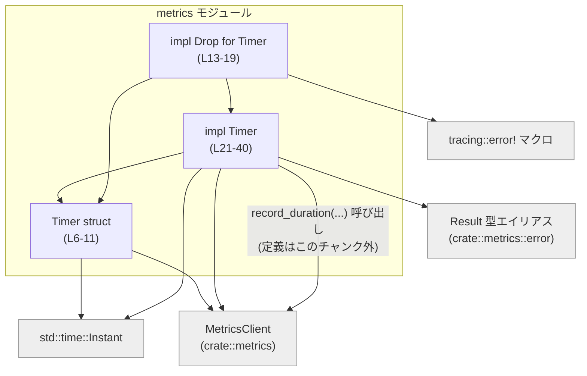

# otel/src/metrics/timer.rs コード解説

## 0. ざっくり一言

`Timer` は、生成時の時刻から現在までの経過時間をメトリクスとして送信するためのヘルパー型で、スコープ終了時（Drop）に自動的に計測結果を送信する RAII スタイルのタイマーです（`otel/src/metrics/timer.rs:L5-11, L13-19`）。

---

## 1. このモジュールの役割

### 1.1 概要

- このモジュールは **処理時間（経過時間）を計測し、メトリクスバックエンドに送信する** 問題を解決するために存在します。
- `Timer` 構造体が、開始時刻・タグ・メトリクスクライアントを保持し、`record` メソッドまたは `Drop` 実装を通じて **経過時間メトリクスを送信** します（`otel/src/metrics/timer.rs:L6-11, L21-40`）。

### 1.2 アーキテクチャ内での位置づけ

このファイル内で把握できる依存関係は次の通りです：

- 依存先
  - `crate::metrics::MetricsClient`（メトリクス送信用クライアント）  
    `otel/src/metrics/timer.rs:L1, L9, L29, L38-39`
  - `crate::metrics::error::Result`（メトリクス操作用の結果型エイリアス）  
    `otel/src/metrics/timer.rs:L2, L34`
  - `std::time::Instant`（開始時刻の保持と経過時間計算）  
    `otel/src/metrics/timer.rs:L3, L10, L30-31`
  - `tracing::error!`（メトリクス送信失敗時のログ出力）  
    `otel/src/metrics/timer.rs:L15-16`

`MetricsClient` 自体の実装や `record_duration` メソッドの詳細は、このチャンクには現れません。



### 1.3 設計上のポイント（コードから読み取れる範囲）

- **RAII による自動計測**  
  - `Drop` 実装で `self.record(&[])` を呼び出すことで、スコープ終了時に自動計測が行われます（`otel/src/metrics/timer.rs:L13-18, L34-40`）。
- **状態を持つ構造体**
  - メトリクス名・タグ・メトリクスクライアント・開始時刻をフィールドとして保持します（`otel/src/metrics/timer.rs:L6-10`）。
- **エラーハンドリング方針**
  - 明示的な `record` 呼び出しでは `Result<()>` を呼び出し元に返します（`otel/src/metrics/timer.rs:L34`）。
  - `Drop` からの内部呼び出しでは、エラーは `tracing::error!` でログ出力されるのみで、パニックは発生させません（`otel/src/metrics/timer.rs:L13-18`）。
- **タグの扱い**
  - 初期タグは `String` を所有し（`Timer` 内に保存）、`record` 呼び出し時に `&str` として借用して利用します（`otel/src/metrics/timer.rs:L7-8, L25-28, L37`）。
  - 呼び出し時に追加タグ (`additional_tags`) を結合して送信します（`otel/src/metrics/timer.rs:L34-37`）。
- **並行性**
  - `Timer` 自身の `record` は `&self` を取るため共有参照で呼び出せますが、`Timer` が `Send` / `Sync` かどうかは `MetricsClient` などの型に依存し、このチャンクからは分かりません。

---

## 2. 主要な機能一覧

- 経過時間の自動記録: `Timer` の Drop 時に、開始からの経過時間をメトリクスとして送信します（`otel/src/metrics/timer.rs:L13-18`）。
- 経過時間の明示的記録: 任意のタイミングで `record` メソッドを呼び出し、追加タグ付きで経過時間メトリクスを送信します（`otel/src/metrics/timer.rs:L34-40`）。
- タグの保存と再利用: 生成時のタグを `String` として保持し、記録時に `additional_tags` と結合して送信します（`otel/src/metrics/timer.rs:L7-8, L25-28, L34-37`）。

---

## 3. 公開 API と詳細解説

### 3.1 型一覧（構造体・列挙体など）

#### 構造体

| 名前 | 種別 | 定義位置 | フィールド | 役割 / 用途 |
|------|------|----------|-----------|-------------|
| `Timer` | 構造体 (`pub struct`) | `otel/src/metrics/timer.rs:L6-11` | `name: String`, `tags: Vec<(String, String)>`, `client: MetricsClient`, `start_time: Instant` | 経過時間計測を行い、`MetricsClient` に対してメトリクスを送信するための RAII タイマー |

#### トレイト実装

| 対象型 | トレイト | 定義位置 | 役割 / 用途 |
|--------|----------|----------|------------|
| `Timer` | `Debug`（自動導出） | `otel/src/metrics/timer.rs:L5` | デバッグ出力時にフィールド内容を表示するため |
| `Timer` | `Drop` | `otel/src/metrics/timer.rs:L13-19` | スコープ終了時に経過時間メトリクスを自動送信するため |

### 3.2 関数詳細

#### `Timer::new(name: &str, tags: &[(&str, &str)], client: &MetricsClient) -> Timer`

**定義位置**: `otel/src/metrics/timer.rs:L21-32`  
（`pub(crate)` のため crate 内部専用コンストラクタ）

**概要**

- タイマーを初期化し、メトリクス名・タグ・メトリクスクライアント・開始時刻を内部に保存します。
- 生成時点の時刻を `start_time` に記録し、以後の `record` / `Drop` での経過時間計測の基準とします。

**引数**

| 引数名 | 型 | 説明 |
|--------|----|------|
| `name` | `&str` | メトリクス名。内部では `String` に変換して保持します（`L24`）。 |
| `tags` | `&[(&str, &str)]` | 生成時に付与するタグの配列。`(キー, 値)` のペア。内部では `(String, String)` に変換し `self.tags` に保存します（`L25-28`）。 |
| `client` | `&MetricsClient` | メトリクス送信に利用するクライアント。`clone` されて `self.client` に保持されます（`L29`）。 |

**戻り値**

- `Timer` インスタンス。  
  - `name`, `tags`, `client`, `start_time` が初期化された状態で返されます（`L23-31`）。

**内部処理の流れ**

1. `name` を `String` に変換し、`name` フィールドに格納します（`L24`）。
2. `tags` スライスの各 `(k, v)` ペアを `String` に変換し、`Vec<(String, String)>` として `tags` フィールドに格納します（`L25-28`）。
3. `client` を `clone` し、`client` フィールドに格納します（`L29`）。
4. `Instant::now()` によって現在時刻を取得し、`start_time` フィールドに格納します（`L30-31`）。
5. 上記フィールドを持つ `Timer` を返します（`L23`）。

**Examples（使用例 / crate 内部想定）**

```rust
use crate::metrics::{MetricsClient};
use crate::metrics::timer::Timer; // timer.rs が mod に公開されている想定

fn handle_request(client: MetricsClient) {
    // メトリクスクライアントの参照を渡してタイマーを生成する
    let timer = Timer::new(
        "request_duration",
        &[("endpoint", "/v1/items"), ("method", "GET")],
        &client,
    );

    // ここで何らかの処理を行う
    do_work();

    // 明示的に record せずとも、スコープ終了時に Drop により計測結果が送信される
} // timer が Drop され、Timer::drop -> Timer::record が呼び出される
```

※ `Timer::new` は `pub(crate)` なので、この関数は crate 内部からのみ使用できます。crate 外部からの生成方法は、このチャンクには現れません。

**Errors / Panics**

- `Timer::new` 自体は `Result` を返さず、エラー発生の可能性はコード上定義されていません（`L21-32`）。
  - `name.to_string()` と `k.to_string(), v.to_string()` は `String` のヒープ確保に失敗しない限りパニックしませんが、そのようなメモリ不足は一般に全体的な問題であり、このコードに特有のものではありません。
- `client.clone()` がパニックするかどうかは `MetricsClient` の実装に依存し、このチャンクには現れません。

**Edge cases（エッジケース）**

- `tags` が空配列の場合  
  - `self.tags` は空の `Vec` になりますが、動作上の特別処理はありません（`L25-28`）。
- `name` が空文字列の場合  
  - 特別なチェックはなく、そのまま `String` として保存されます（`L24`）。その後の意味づけは `MetricsClient` 側に依存します。
- `client` が内部的に無効な状態である場合  
  - `Timer::new` では検証されません。実際の送信時（`record_duration`）の挙動はこのチャンクからは分かりません。

**使用上の注意点**

- `Timer` のライフタイムは経過時間に直結するため、**生成タイミング** が計測開始時刻になります。
- `Timer::new` は `pub(crate)` であり、crate 外から直接利用できません。外部利用方法は他の API（例：`MetricsClient` がタイマー生成メソッドを持つなど）に依存しますが、このチャンクには現れません。

---

#### `Timer::record(&self, additional_tags: &[(&str, &str)]) -> Result<()>`

**定義位置**: `otel/src/metrics/timer.rs:L34-40`  
戻り値型: `crate::metrics::error::Result<()>`（詳細なエラー型はこのチャンクには現れません）

**概要**

- `Timer` の開始時刻 (`start_time`) から現在までの経過時間を計測し、  
  初期タグ (`self.tags`) と呼び出し時に渡された `additional_tags` を結合して、`MetricsClient::record_duration` に送信します。
- RAII による自動記録（`Drop`）からも内部的に呼ばれます（`L13-18`）。

**引数**

| 引数名 | 型 | 説明 |
|--------|----|------|
| `additional_tags` | `&[(&str, &str)]` | 呼び出し時に追加で付与するタグの配列。`(キー, 値)` のペア。先にベクタへ追加され、その後に `Timer` が保持するタグが連結されます（`L35-37`）。 |

**戻り値**

- `Result<()>`  
  - 成功時: `Ok(())`  
  - 失敗時: `Err(e)`（エラー型は `crate::metrics::error::Result` に依存; このチャンクには現れません）。
- 戻り値は `MetricsClient::record_duration` の戻り値をそのまま返しています（`L38-39`）。

**内部処理の流れ（アルゴリズム）**

1. `self.tags.len() + additional_tags.len()` を容量とする `Vec<(&str, &str)>` を事前確保します（`L35`）。
2. `additional_tags` の要素をそのまま `tags` ベクタにコピーします（`L36`）。
3. `self.tags` に格納されている `(String, String)` の各要素から `&str` を借用し、`tags` ベクタに連結します（`L37`）。
4. `self.start_time.elapsed()` によって経過時間を計算します（`L38-39`）。
5. `self.client.record_duration(&self.name, elapsed, &tags)` を呼び出し、その `Result<()>` を返します（`L38-39`）。

**Mermaid 処理フロー（record 呼び出し）**

```mermaid
sequenceDiagram
    participant Caller as "呼び出し側"
    participant Rec as "Timer::record (L34-40)"
    participant MC as "MetricsClient::record_duration (定義はこのチャンク外)"

    Caller->>Rec: record(additional_tags)
    Rec->>Rec: 結合タグ Vec を作成 (L35-37)
    Rec->>MC: record_duration(name, start_time.elapsed(), &tags)
    MC-->>Rec: Result&lt;()&gt;
    Rec-->>Caller: Result&lt;()&gt;
```

**Examples（使用例 / crate 内部想定）**

```rust
use crate::metrics::{MetricsClient};
use crate::metrics::timer::Timer;

fn handle_request(client: MetricsClient) -> crate::metrics::error::Result<()> {
    let timer = Timer::new("request_duration", &[("endpoint", "/v1/items")], &client);

    // 処理本体
    do_work()?;

    // 追加タグ（例: 成功/失敗）を付与して明示的に計測結果を送信する
    timer.record(&[("status", "ok")])?;

    // この後 Drop による自動記録も実行される点に注意（→ 使用上の注意点参照）
    Ok(())
}
```

**Errors / Panics**

- `Err(e)` になる条件:
  - `self.client.record_duration(...)` が `Err(e)` を返した場合（`L38-39`）。
  - 具体的なエラーの種類や条件は `MetricsClient` と `crate::metrics::error::Result` の実装に依存し、このチャンクには現れません。
- パニック:
  - コード中に `unwrap` や `expect`、インデックスアクセスなどのパニック要因は存在しません。
  - `Vec::with_capacity` やタグの push でのメモリ確保失敗などは、一般的なメモリ不足に起因するものであり、この関数特有のものではありません。

**Edge cases（エッジケース）**

- `additional_tags` が空 (`&[]`) の場合:
  - `tags` ベクタは `self.tags` 由来のタグのみになります（`L35-37`）。
- `self.tags` が空の場合:
  - `tags` ベクタは `additional_tags` のみになります（`L35-37`）。
- `additional_tags` と `self.tags` に同じキーが含まれる場合:
  - 特別な処理はなく、順序どおり（`additional_tags` → `self.tags`）に並んだまま `record_duration` に渡されます（`L36-37`）。重複の解釈は `MetricsClient` 側に依存します。
- 関数が複数回呼び出された場合:
  - そのたびに `start_time` からの経過時間が計測されるため、「初回からの累積時間」が毎回送信されます（`L30-31, L38-39`）。
  - 差分時間ではなく、**開始時刻からの絶対経過時間** である点に注意が必要です。

**使用上の注意点**

- `Timer::record` は `&self` を取るため、同一インスタンスに対して複数回呼び出すことが可能です。
  - ただし Drop でも自動記録が行われるため、結果として同じタイマーから複数のメトリクスが送信されうる点に注意が必要です。
- `additional_tags` は `&str` のスライスであり、`record` 呼び出し中のみ参照されます。
  - 一般的な使い方をすればライフタイム上の問題はコンパイル時に検出されます。
- 性能面:
  - 呼び出しごとに `Vec<(&str, &str)>` を新規に確保しますが、容量を事前計算して `with_capacity` で確保しているため、再確保は抑えられます（`L35`）。

---

#### `impl Drop for Timer { fn drop(&mut self) { ... } }`

**定義位置**: `otel/src/metrics/timer.rs:L13-19`

**概要**

- `Timer` のインスタンスがスコープを抜けて破棄される際に自動的に呼ばれます。
- 追加タグなしで `self.record(&[])` を呼び出し、経過時間メトリクス送信を試みます（`L15`）。
- エラーが発生した場合は `tracing::error!` でログ出力し、パニックは発生させません（`L15-18`）。

**引数**

- 暗黙の引数 `&mut self` のみ（`L14`）。Drop トレイトの仕様に従い、ユーザーコードから直接呼び出すことは想定されていません。

**戻り値**

- なし（`()`）。Drop トレイトの仕様に従い、戻り値を返しません（`L13-19`）。

**内部処理の流れ**

1. `self.record(&[])` を呼び出し、追加タグ無しで記録を試みます（`L15`）。
2. 戻り値が `Err(e)` の場合にのみ `if let Err(e) = ...` がマッチし、`tracing::error!("metrics client error: {}", e)` でエラー内容をログ出力します（`L15-16`）。
3. `Ok(())` の場合は何もせず、そのまま Drop を終了します（`L15-18`）。

**Mermaid 処理フロー（Drop 時自動記録）**

```mermaid
sequenceDiagram
    participant Rust as "Rust ランタイム"
    participant D as "Timer::drop (L13-19)"
    participant Rec as "Timer::record (L34-40)"
    participant MC as "MetricsClient::record_duration (定義はこのチャンク外)"
    participant Log as "tracing::error! (L15-16)"

    Rust->>D: Timer インスタンスの Drop
    D->>Rec: record(&[])
    Rec->>MC: record_duration(name, elapsed, &tags)
    MC-->>Rec: Result&lt;()&gt;

    alt Err(e)
        Rec-->>D: Err(e)
        D->>Log: error!("metrics client error: {}", e)
    else Ok(())
        Rec-->>D: Ok(())
    end
    D-->>Rust: Drop 完了
```

**Errors / Panics**

- `Drop` 内で `Err(e)` が発生した場合:
  - ただちに `tracing::error!` でログ出力されますが、パニックは発生させません（`L15-16`）。
  - `Drop` は戻り値を返さないため、エラー情報は呼び出し元に伝播しません。
- パニック:
  - 明示的な `panic!` 呼び出しや `unwrap` はありません。
  - `tracing::error!` の内部でパニックが起きる可能性は tracer の実装に依存し、このチャンクには現れません。

**Edge cases（エッジケース）**

- `Timer::record` が複数回呼ばれた後の `Drop`:
  - `Drop` でも再度 `record(&[])` が呼ばれるため、複数回メトリクスが送信されることになります（`L15, L34-40`）。
- `Timer` の生成直後にスコープを抜ける場合:
  - 非常に短い経過時間（ほぼゼロに近い値）が送信される可能性があります（`L30-31, L15-18`）。

**使用上の注意点**

- `Drop` での処理は **アプリケーションの制御フローから見えにくい** ため、  
  「どのタイミングでメトリクスが送信されるか」を把握しておく必要があります。
- 明示的に `record` を呼び出した場合でも、`Drop` で再度 `record` が呼ばれます。
  - 「一回だけ送信したい」という仕様であれば、上位レイヤーで `Timer` の利用方針を決める必要があります（このファイルでは制御していません）。
- Drop 内でのエラーはログ出力のみで無視されるため、「確実に送信できたかどうか」を知るには、明示的に `record` を呼び出して `Result` を確認する必要があります。

---

### 3.3 その他の関数

- このファイルには、上記以外の補助的な関数やラッパー関数は定義されていません。

---

## 4. データフロー

ここでは、典型的な「Timer を生成して処理時間を自動計測する」ケースのデータフローを整理します。

1. 上位コードが `Timer::new` を呼び出し、`Timer` インスタンスを生成します（`L21-32`）。
2. 処理が実行される間、`Timer` がスコープ内で保持されます。
3. スコープを抜ける際に Rust ランタイムが `Drop` を呼び出し、`Timer::drop` が動作します（`L13-19`）。
4. `Timer::drop` が `Timer::record(&[])` を呼び出し、`MetricsClient::record_duration` を通じてメトリクスを送信します（`L15, L34-40`）。

```mermaid
sequenceDiagram
    participant Caller as "上位コード"
    participant New as "Timer::new (L21-32)"
    participant T as "Timer インスタンス (L6-11)"
    participant Drop as "Timer::drop (L13-19)"
    participant Rec as "Timer::record (L34-40)"
    participant MC as "MetricsClient::record_duration (このチャンク外)"

    Caller->>New: new(name, tags, &client)
    New-->>Caller: Timer { name, tags, client, start_time }

    Caller->>T: 処理中に Timer を保持
    Caller-->>Caller: 処理ロジック実行

    Caller-->>Drop: スコープ終了に伴う Drop
    Drop->>Rec: record(&[])
    Rec->>MC: record_duration(name, start_time.elapsed(), &tags)
    MC-->>Rec: Result&lt;()&gt;
    Rec-->>Drop: Result&lt;()&gt;
    Drop-->>Caller: （エラーはログ出力のみ）
```

---

## 5. 使い方（How to Use）

### 5.1 基本的な使用方法（crate 内部）

`Timer` は RAII スタイルで利用され、生成から破棄までの時間を計測します。

```rust
use crate::metrics::{MetricsClient};
use crate::metrics::timer::Timer;
use crate::metrics::error::Result;

// 処理全体の時間を計測したいケースの例
fn process_request(client: MetricsClient) -> Result<()> {
    // Timer を生成した時点から計測開始
    let timer = Timer::new(
        "request_duration_seconds",
        &[("endpoint", "/v1/items"), ("method", "GET")],
        &client,
    );

    // この区間の処理時間が計測対象になる
    do_some_heavy_work()?;

    // 明示的な record を行わなくても、スコープを抜けたタイミングで Drop により記録される
    Ok(())
} // timer が Drop され、Timer::drop -> Timer::record(&[]) が呼ばれる
```

### 5.2 よくある使用パターン

1. **自動記録のみを使うパターン**

   - 生成 → 処理 → スコープ終了時に自動記録。
   - 追加タグを必要としない場合に適しています。

   ```rust
   fn handle(client: MetricsClient) -> crate::metrics::error::Result<()> {
       let _timer = Timer::new("job_duration", &[], &client);
       run_job()?;
       Ok(()) // Drop 時に自動記録
   }
   ```

2. **明示的な `record` を併用するパターン**

   - 正常終了時のみ追加タグを付与して記録したい場合など。

   ```rust
   fn handle(client: MetricsClient) -> crate::metrics::error::Result<()> {
       let timer = Timer::new("job_duration", &[], &client);

       if let Err(e) = run_job() {
           // 失敗時に "status=error" タグを付与して計測
           timer.record(&[("status", "error")])?;
           return Err(e);
       }

       // 成功時に "status=ok" タグを付与して計測
       timer.record(&[("status", "ok")])?;
       Ok(())
   } // Drop 時に再度 record(&[]) が呼ばれる点に注意
   ```

   ※ 上記のような使用では、成功/失敗時の記録に加え、Drop 時にもう一度記録されます。  
   これが意図した挙動かどうかは、上位設計で決める必要があります。

### 5.3 よくある間違い（起こりうる誤用）

```rust
use crate::metrics::{MetricsClient};
use crate::metrics::timer::Timer;

// 誤用例: 一回だけ記録したいのに、実際には二度記録されるパターン
fn wrong_usage(client: MetricsClient) -> crate::metrics::error::Result<()> {
    let timer = Timer::new("job_duration", &[], &client);

    run_job()?;

    // ここで 1 回記録
    timer.record(&[("status", "ok")])?;

    Ok(())
    // ここで Drop により、追加タグなしでもう 1 回記録される
}
```

**正しい例（「一回だけ記録したい」仕様に合わせる場合の一案）**

このファイルだけでは Drop の挙動を変えられないため、上位レイヤーで「`Timer` を Drop しない」設計にする、あるいは `Timer` をラップした別の型を作成するなどの対応が考えられます。  
具体的な解決策はこのチャンクには現れませんが、「Drop でも記録される」ことを前提に設計する必要があります。

### 5.4 使用上の注意点（まとめ）

- **Drop で必ず `record(&[])` が呼ばれる**
  - 明示的な `record` とは別に、スコープ終了時にも記録が行われます。
- **エラーは Drop 時には呼び出し元に伝わらない**
  - Drop 内ではエラーは `tracing::error!` でログ出力されるのみです。
  - 「記録に成功したかどうか」を確認したい場合は、明示的に `record` を呼び戻り値を確認する必要があります。
- **並行性**
  - `Timer` が複数スレッドから共有されるかどうか、またその場合に `MetricsClient::record_duration` がスレッド安全かどうかは、このチャンクには現れません。  
    スレッド間共有を行う場合は `MetricsClient` の実装を確認する必要があります。
- **性能**
  - `record` 呼び出しごとにタグ用 `Vec` を生成しますが、容量を事前計算して確保しているため、タグ数に比例した線形コストと考えられます。

---

## 6. 変更の仕方（How to Modify）

### 6.1 新しい機能を追加する場合

このファイル内で完結する変更として、次のような追加が考えられます（いずれも実際に行うかどうかはプロジェクト全体の設計次第です）。

1. **追加情報を含むメトリクス送信**
   - 例: 単位（秒、ミリ秒）やメトリクス種別を明示したい場合。
   - 変更ポイント:
     - `Timer` 構造体に新しいフィールドを追加（`otel/src/metrics/timer.rs:L6-10`）。
     - `Timer::new` の引数およびフィールド初期化部を変更（`L21-32`）。
     - `Timer::record` で `MetricsClient::record_duration` への引数を変更またはメソッドを追加（`L34-40`）。
   - `MetricsClient` 側にも対応する変更が必要になる可能性があります（このチャンクには定義がありません）。

2. **自動記録の制御**
   - 例: Drop 時には記録しないオプションを追加するなど。
   - 変更ポイント:
     - `Timer` にフラグフィールドを追加し、`Drop` でその値を見て `record` 呼び出し有無を切り替える（`L6-11, L13-19`）。
   - これにより、「明示的な記録のみ」を選択できるようにするなどの拡張が可能です。

### 6.2 既存の機能を変更する場合の注意点

- **`Timer::record` のシグネチャ変更**
  - 引数や戻り値を変更すると、`Timer::drop` からの呼び出し（`L15`）もすべて更新する必要があります。
  - 戻り値の型を変える場合は、Drop では結果を利用できないため、ログ出力戦略も再検討が必要です。
- **タグ処理ロジックの変更**
  - タグの優先順位（初期タグ vs 追加タグ）やマージ戦略を変える際は、`Vec` の構築部分（`L35-37`）が主な変更ポイントになります。
  - 既存のメトリクス集計基盤やダッシュボードに影響する可能性があるため注意が必要です。
- **`MetricsClient` とのインターフェース変更**
  - `record_duration` の引数や戻り値を変える場合は、`Timer::record` および `Drop` からの呼び出しを合わせて変更する必要があります（`L38-39, L15`）。
- **テスト**
  - このチャンクにはテストコードは現れていませんが、変更した際には:
    - Drop による自動記録が想定どおり呼ばれるか
    - `additional_tags` の結合順序が期待どおりか
    - エラー時に `tracing::error!` が呼び出されるか
    といった点をテストすることが有用です。

---

## 7. 関連ファイル

このモジュールと密接に関係するコンポーネント（モジュールパスベース）の一覧です。  
ファイルパスは、このチャンクのみからは特定できないため「不明」としています。

| パス / モジュール | 役割 / 関係 |
|-------------------|------------|
| `crate::metrics::MetricsClient`（ファイルパス: 不明） | `Timer` が保持し、`record_duration` を通じて経過時間メトリクスを送信するクライアント（`otel/src/metrics/timer.rs:L1, L9, L29, L38-39`）。 |
| `crate::metrics::error::Result`（ファイルパス: 不明） | `Timer::record` の戻り値に利用される結果型エイリアス。エラーの詳細はこのチャンクには現れません（`otel/src/metrics/timer.rs:L2, L34`）。 |
| `std::time::Instant` | 計測開始時刻を保持し、`elapsed()` で経過時間を取得する標準ライブラリの型（`otel/src/metrics/timer.rs:L3, L10, L30-31`）。 |
| `tracing::error` マクロ | Drop 時の `record` 失敗時にエラーログを出力するために使用（`otel/src/metrics/timer.rs:L15-16`）。 |

以上が、このチャンクから読み取れる `otel/src/metrics/timer.rs` の構造と挙動のまとめです。
