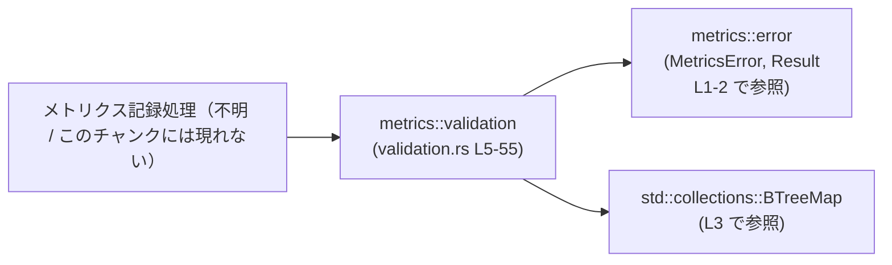
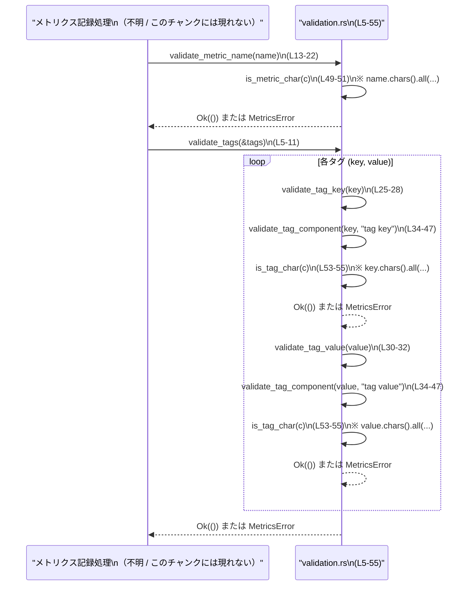

# otel/src/metrics/validation.rs

## 0. ざっくり一言

メトリクス名とタグ（キー・値）の文字列を検証し、不正な場合に `MetricsError` を返すバリデーション用ユーティリティ関数群です（`validate_*` と `is_*_char` 系関数）。  
根拠: `otel/src/metrics/validation.rs:L5-55`

---

## 1. このモジュールの役割

### 1.1 概要

- このモジュールは **メトリクス名とタグの文字列表現が妥当かどうか** を検証するために存在し、文字種と空文字チェックに基づくバリデーション機能を提供します。  
- 不正な入力に対しては、`crate::metrics::error::MetricsError` を用いた `Result` 型でエラーを返します。  
  根拠: `MetricsError` / `Result` のインポートと利用（`otel/src/metrics/validation.rs:L1-2,14-22,35-45`）

### 1.2 アーキテクチャ内での位置づけ

このファイルは、他のメトリクス関連コードから呼び出されることを前提とした「純粋なバリデーション層」です。  
外部依存は `crate::metrics::error` と標準ライブラリの `BTreeMap` のみであり、内部状態は持ちません。

- 依存関係（このチャンクから読み取れる範囲）

  - 依存先:
    - `crate::metrics::error::{MetricsError, Result}`（エラー型と `Result` エイリアス）  
      根拠: `otel/src/metrics/validation.rs:L1-2`
    - `std::collections::BTreeMap`（タグ集合の表現）  
      根拠: `otel/src/metrics/validation.rs:L3`
  - 呼び出し元（どこから使われるか）は、このチャンクには現れません。

Mermaid による依存関係図（このファイル範囲: L1-55）:



### 1.3 設計上のポイント

- **完全にステートレスな関数群**  
  すべて `fn` でグローバル状態やフィールドを持たず、副作用は「`Result` でエラーを返す」ことのみです。  
  根拠: 構造体や静的変数が存在しないこと、すべて自由関数であること（`otel/src/metrics/validation.rs:L5-55`）

- **共通ロジックの抽出**  
  タグのキーと値の検証は `validate_tag_component` に集約され、呼び出し側でラベル文字列だけを変えています。  
  根拠: `validate_tag_key` / `validate_tag_value` から `validate_tag_component` を呼び出す実装（`otel/src/metrics/validation.rs:L25-32,34-47`）

- **エラーは `Result` 経由、パニックなし**  
  全関数が `Result<()>` か `bool` を返し、`panic!` や `unwrap` は使っていません。  
  根拠: すべての関数シグネチャと本文（`otel/src/metrics/validation.rs:L5-55`）

- **文字種ベースのシンプルなバリデーション**  
  - メトリクス名: ASCII 英数字と `.` / `_` / `-` のみ許可  
    根拠: `is_metric_char`（`otel/src/metrics/validation.rs:L49-51`）
  - タグキー・値: ASCII 英数字と `.` / `_` / `-` / `/` のみ許可  
    根拠: `is_tag_char`（`otel/src/metrics/validation.rs:L53-55`）

- **Rust 言語固有の安全性**  
  - すべての入力は共有参照（`&str`, `&BTreeMap`）で受け取り、所有権を奪いません。  
    根拠: 関数シグネチャ（`otel/src/metrics/validation.rs:L5,13,25,30,34,49,53`）
  - `?` 演算子でエラーを短絡的に伝播しつつ、コンパイラが `Result` の取り扱いを強制するため、エラーの握りつぶしが起こりにくい構造です。  
    根拠: `validate_tags` / `validate_tag_key` 内の `?`（`otel/src/metrics/validation.rs:L7-8,26`）

- **並行性の観点**  
  このモジュール内には共有状態やミュータブル参照が存在せず、関数は純粋関数に近い挙動のため、同じ `&BTreeMap` を複数スレッドから読み取り専用で渡す場合にも安全です（Rust の型システムによる保証）。  
  根拠: すべての引数が共有参照であり、`&mut` やグローバル変数がないこと（`otel/src/metrics/validation.rs:L5-55`）

---

## 2. 主要な機能一覧・コンポーネントインベントリ

### 2.1 関数コンポーネント一覧

| 名前 | 種別 | 公開範囲 | 役割 / 用途 | 定義位置（根拠） |
|------|------|----------|-------------|------------------|
| `validate_tags` | 関数 | `pub(crate)` | `BTreeMap<String, String>` で与えられた全タグのキーと値を検証する | `otel/src/metrics/validation.rs:L5-11` |
| `validate_metric_name` | 関数 | `pub(crate)` | メトリクス名の空文字チェックと使用可能文字チェックを行う | `otel/src/metrics/validation.rs:L13-23` |
| `validate_tag_key` | 関数 | `pub(crate)` | タグキー部分について共通コンポーネント検証を呼び出す | `otel/src/metrics/validation.rs:L25-28` |
| `validate_tag_value` | 関数 | `pub(crate)` | タグ値部分について共通コンポーネント検証を呼び出す | `otel/src/metrics/validation.rs:L30-32` |
| `validate_tag_component` | 関数 | `fn` （モジュール内のみ） | タグのキー/値を区別しない共通ロジック（空文字と文字種の検証） | `otel/src/metrics/validation.rs:L34-47` |
| `is_metric_char` | 関数 | `fn` （モジュール内のみ） | メトリクス名で許可される 1 文字かどうかを判定する | `otel/src/metrics/validation.rs:L49-51` |
| `is_tag_char` | 関数 | `fn` （モジュール内のみ） | タグのキー・値で許可される 1 文字かどうかを判定する | `otel/src/metrics/validation.rs:L53-55` |

### 2.2 主要な機能（一覧）

- メトリクス名の検証: 空文字チェックと、許可された ASCII 文字のみから構成されているかの検証  
  根拠: `validate_metric_name`, `is_metric_char`（`otel/src/metrics/validation.rs:L13-23,L49-51`）
- タグキー／値の検証: 空文字禁止と、許可された ASCII 文字のみから構成されているかの検証  
  根拠: `validate_tag_key`, `validate_tag_value`, `validate_tag_component`, `is_tag_char`（`otel/src/metrics/validation.rs:L25-32,L34-47,L53-55`）
- タグ集合全体の検証: `BTreeMap` 内のすべてのタグペアに対する一括検証  
  根拠: `validate_tags`（`otel/src/metrics/validation.rs:L5-11`）

---

## 3. 公開 API と詳細解説

### 3.1 型一覧（構造体・列挙体など）

このファイル自身には新たな構造体・列挙体・トレイトの定義はありません。

ただし、外部から次の型に依存しています。

| 名前 | 種別 | 役割 / 用途 | 定義位置（推測可否） |
|------|------|-------------|----------------------|
| `MetricsError` | 列挙体（と推測） | バリデーション失敗時のエラー種別を表現する | モジュールパスのみ判明: `crate::metrics::error`（`otel/src/metrics/validation.rs:L1`）。具体的なファイルパスはこのチャンクには現れません |
| `Result` | 型エイリアス（と推測） | `Result<T, MetricsError>` のようなエラー型エイリアスと考えられますが、正確な定義はこのチャンクには現れません | `crate::metrics::error`（`otel/src/metrics/validation.rs:L2`） |
| `BTreeMap<String, String>` | 構造体 | タグのキー・値の集合を保持する連想配列 | 標準ライブラリ `std::collections`。利用は `otel/src/metrics/validation.rs:L3,5` のみ |

> `MetricsError` と `Result` の内部定義やバリアント一覧は、このチャンクには現れません。ここでは関数呼び出し側から観測できる挙動のみを記述します。

---

### 3.2 重要な関数の詳細

#### `validate_tags(tags: &BTreeMap<String, String>) -> Result<()>`

**概要**

- 与えられたタグ集合の **すべてのキーと値** について、`validate_tag_key` / `validate_tag_value` を用いて検証します。  
  根拠: `for (key, value) in tags { ... }` の中で両方を呼び出している（`otel/src/metrics/validation.rs:L5-9`）

**引数**

| 引数名 | 型 | 説明 |
|--------|----|------|
| `tags` | `&BTreeMap<String, String>` | タグキーとタグ値のペア集合への共有参照。所有権は移動しません |

**戻り値**

- `Result<()>`  
  - `Ok(())`: すべてのタグキー・値が検証に成功した場合  
  - `Err(MetricsError)`: いずれかのタグキーまたはタグ値が不正である場合

**内部処理の流れ**

1. `tags` 内のすべての `(key, value)` ペアに対してループします。  
   根拠: `for (key, value) in tags { ... }`（`otel/src/metrics/validation.rs:L6`）
2. 各ペアについて、まず `validate_tag_key(key)?` を呼び出し、キーの妥当性を検証します。  
   根拠: `validate_tag_key(key)?;`（`otel/src/metrics/validation.rs:L7`）
3. キーが妥当な場合にのみ続けて `validate_tag_value(value)?` を呼び出し、値の妥当性を検証します。  
   根拠: `validate_tag_value(value)?;`（`otel/src/metrics/validation.rs:L8`）
4. ループ中にどちらかの検証で `Err` が返された場合、`?` 演算子によりそこで処理を中断し、同じエラーを呼び出し元へ返します。  
5. すべてのペアを検証してもエラーがなければ `Ok(())` を返します。  
   根拠: `Ok(())`（`otel/src/metrics/validation.rs:L10`）

**Examples（使用例）**

正常系の使用例です（同一クレート内からの呼び出しを想定しています）。

```rust
use std::collections::BTreeMap;                               // BTreeMap をインポート
use crate::metrics::error::MetricsError;                      // エラー型（定義は別モジュール）
use crate::metrics::validation::{validate_tags, validate_metric_name}; // 本モジュールの関数

fn record_http_metric() -> Result<(), MetricsError> {         // メトリクス記録関数の例
    let mut tags = BTreeMap::new();                           // 空のタグ集合を作成
    tags.insert("method".to_string(), "GET".to_string());     // 有効なタグを追加
    tags.insert("path".to_string(), "/api/items".to_string()); // '/' を含む有効なタグ値

    validate_metric_name("http.server.requests")?;            // メトリクス名を検証（L13-23）
    validate_tags(&tags)?;                                    // 全タグを検証（L5-11）

    // ここで実際のメトリクス送信処理を行う（このチャンクには現れません）
    Ok(())                                                    // 成功として終了
}
```

**Errors / Panics**

- `Err(MetricsError::EmptyTagComponent { .. })`  
  - いずれかのタグキーまたはタグ値が空文字列の場合。  
  - 実際には `validate_tag_component` が返すエラーです。  
    根拠: 空文字チェック（`otel/src/metrics/validation.rs:L35-39`）と `validate_tag_key` / `validate_tag_value` からの呼び出し（`L25-32`）
- `Err(MetricsError::InvalidTagComponent { .. })`  
  - タグキーまたは値に、許可されていない文字（ASCII 英数字・`.`・`_`・`-`・`/` 以外）が含まれる場合。  
  - こちらも `validate_tag_component` によって返されます。  
    根拠: `!value.chars().all(is_tag_char)` の条件とエラー生成（`otel/src/metrics/validation.rs:L40-45`）
- これら以外のパニックや `panic!`、`unwrap` などは存在しません（このチャンクには現れません）。

**Edge cases（エッジケース）**

- `tags` が空の `BTreeMap` の場合  
  - ループは一度も実行されず、即座に `Ok(())` が返ります。  
    根拠: 空のコレクションに対する `for` ループ（`otel/src/metrics/validation.rs:L6-9`）
- 一部のタグが不正な場合  
  - 最初に不正と判定されたタグの時点でループが中断され、そのエラーが返ります。以降のタグは検証されません。

**使用上の注意点**

- 関数は `&BTreeMap` を取るため、所有権を奪わず、呼び出し元でマップを引き続き利用できます。  
- 並行性の観点では、`tags` が複数スレッドから共有されていても、ここでは読み取り専用の参照しか使わないため、Rust の型システム上は安全です（同時に `&mut` 参照を取らないことが前提）。  
- 文字列長に比例したコストで検証するため、非常に大量のタグや極端に長いタグ文字列に対して連続して呼ぶ場合は、その分だけ CPU 負荷が増えます。

---

#### `validate_metric_name(name: &str) -> Result<()>`

**概要**

- メトリクス名が空でないこと、および **ASCII 英数字と `.`, `_`, `-` のみ** から構成されていることを検証します。  
  根拠: `is_empty` と `is_metric_char` を使った条件（`otel/src/metrics/validation.rs:L14-22,L49-51`）

**引数**

| 引数名 | 型 | 説明 |
|--------|----|------|
| `name` | `&str` | 検証対象のメトリクス名。共有参照で渡され、所有権は移動しません |

**戻り値**

- `Result<()>`  
  - `Ok(())`: メトリクス名が仕様どおりの文字列である  
  - `Err(MetricsError::EmptyMetricName)` または `Err(MetricsError::InvalidMetricName { .. })`: 不正な場合

**内部処理の流れ**

1. `name.is_empty()` をチェックし、空文字であれば `MetricsError::EmptyMetricName` を返します。  
   根拠: `if name.is_empty() { return Err(MetricsError::EmptyMetricName); }`（`otel/src/metrics/validation.rs:L14-16`）
2. `name.chars().all(is_metric_char)` で、すべての文字が許可された文字かどうかを確認します。  
   根拠: `otel/src/metrics/validation.rs:L17-18`
3. 一文字でも許可されない文字が含まれていれば、`MetricsError::InvalidMetricName { name: name.to_string() }` を返します。  
   根拠: `otel/src/metrics/validation.rs:L18-20`
4. それ以外の場合は `Ok(())` を返します。  
   根拠: `otel/src/metrics/validation.rs:L22`

**Examples（使用例）**

正常に通る例と、エラーになる例です。

```rust
use crate::metrics::error::MetricsError;
use crate::metrics::validation::validate_metric_name;

fn demo_metric_name() {
    // 正常系: 許可された文字だけを使った例（L49-51 の条件に合致）
    assert!(validate_metric_name("http.server.requests").is_ok());

    // エラー例: 空文字（L14-16 の条件に該当）
    match validate_metric_name("") {
        Err(MetricsError::EmptyMetricName) => { /* 期待どおり */ }
        _ => panic!("EmptyMetricName エラーが返るはずです"),
    }

    // エラー例: スペースを含む（' ' は is_metric_char で許可されない）
    if let Err(MetricsError::InvalidMetricName { name }) =
        validate_metric_name("http requests")
    {
        assert_eq!(name, "http requests".to_string());
    } else {
        panic!("InvalidMetricName エラーが返るはずです");
    }
}
```

**Errors / Panics**

- `Err(MetricsError::EmptyMetricName)`  
  - `name` が空文字のとき。  
    根拠: `otel/src/metrics/validation.rs:L14-16`
- `Err(MetricsError::InvalidMetricName { name })`  
  - `name` 内のいずれかの文字が `is_metric_char` によって許可されない場合。  
    根拠: `otel/src/metrics/validation.rs:L17-20,49-51`
- パニックは発生しません。

**Edge cases（エッジケース）**

- 非 ASCII 文字（例: `"メトリクス"` や `"métric"`）  
  - `is_ascii_alphanumeric()` は `false` を返すため、`.` / `_` / `-` 以外の非 ASCII 文字は全て不許可です。  
    根拠: `is_metric_char` の実装（`otel/src/metrics/validation.rs:L49-51`）
- 先頭・末尾の `.` や `_`, `-`  
  - これらも禁止されていないため、仕様上は許可されます。具体的に許可すべきかどうかは、このチャンクからは分かりません。

**使用上の注意点**

- メトリクス名にスペースやコロン、スラッシュなどを使いたい場合、現状の `is_metric_char` では許可されません。変更したい場合は `is_metric_char` 実装の変更が必要です。  
- 関数は純粋で状態を持たないため、どのスレッドから何度呼び出しても安全です。

---

#### `validate_tag_key(key: &str) -> Result<()>`

**概要**

- タグの「キー」を検証する薄いラッパーで、実際のロジックは `validate_tag_component` に委譲しています。  
  根拠: `validate_tag_component(key, "tag key")?;`（`otel/src/metrics/validation.rs:L25-27`）

**引数**

| 引数名 | 型 | 説明 |
|--------|----|------|
| `key` | `&str` | タグキー文字列 |

**戻り値**

- `Result<()>`  
  - 中身は `validate_tag_component` と同じです。

**内部処理の流れ**

1. `validate_tag_component(key, "tag key")?` を呼び出します。  
2. 正常終了すれば `Ok(())` を返します。  
   根拠: `Ok(())`（`otel/src/metrics/validation.rs:L27`）

**Errors / Panics**

- 具体的なエラー種別は `validate_tag_component` と同じです（空文字または不正文字）。  
- パニックはありません。

**Edge cases / 使用上の注意点**

- `key` に `/` を含めることは許可されています（`is_tag_char` 参照）。  
- キーと値で許可文字が異なる、ということはなく、どちらも同じ `is_tag_char` を利用します。

---

#### `validate_tag_value(value: &str) -> Result<()>`

**概要**

- タグの「値」を検証するラッパーで、実際のロジックは `validate_tag_component` に委譲しています。  
  根拠: `validate_tag_component(value, "tag value")`（`otel/src/metrics/validation.rs:L30-31`）

**引数**

| 引数名 | 型 | 説明 |
|--------|----|------|
| `value` | `&str` | タグ値文字列 |

**戻り値**

- `Result<()>`  
  - 中身は `validate_tag_component` と同じです。

**内部処理の流れ**

1. `validate_tag_component(value, "tag value")` をそのまま返します（`?` は使っていませんが戻り値は同じ `Result<()>` です）。  

**Errors / Panics**

- `validate_tag_component` を参照（空文字・不正文字）。  
- パニックはありません。

**Edge cases / 使用上の注意点**

- URL パスのような `/api/items` などの値は、`/` が許可されているため正常に通ります。  
  根拠: `is_tag_char` の `matches!(c, '.' | '_' | '-' | '/')`（`otel/src/metrics/validation.rs:L53-55`）

---

#### `validate_tag_component(value: &str, label: &str) -> Result<()>`

**概要**

- タグのキー・値を問わず、「空文字でないか」と「許可された文字のみから構成されているか」を検証する **共通ロジック** です。  
  エラー時には `label` をエラーに埋め込み、どのコンポーネント（キー／値）で失敗したかを明示できるようにしています。  
  根拠: `MetricsError::EmptyTagComponent { label }` および `InvalidTagComponent { label, value }`（`otel/src/metrics/validation.rs:L35-45`）

**引数**

| 引数名 | 型 | 説明 |
|--------|----|------|
| `value` | `&str` | 検証対象の文字列 |
| `label` | `&str` | エラーメッセージ用のラベル（例: `"tag key"`, `"tag value"`） |

**戻り値**

- `Result<()>`  
  - `Ok(())`: 検証に成功  
  - `Err(MetricsError::EmptyTagComponent { .. })` または `Err(MetricsError::InvalidTagComponent { .. })`: 検証に失敗

**内部処理の流れ**

1. `value.is_empty()` をチェックし、空文字であれば `MetricsError::EmptyTagComponent { label: label.to_string() }` を返します。  
   根拠: `otel/src/metrics/validation.rs:L35-39`
2. `!value.chars().all(is_tag_char)` で、許可されない文字が含まれていないかを判定します。  
   根拠: `otel/src/metrics/validation.rs:L40`
3. 許可されない文字が含まれている場合、`MetricsError::InvalidTagComponent { label: label.to_string(), value: value.to_string() }` を返します。  
   根拠: `otel/src/metrics/validation.rs:L41-44`
4. それ以外の場合は `Ok(())` を返します。  
   根拠: `otel/src/metrics/validation.rs:L46`

**Errors / Panics**

- `Err(MetricsError::EmptyTagComponent { label })`  
  - `value` が空文字の場合。  
    根拠: `otel/src/metrics/validation.rs:L35-39`
- `Err(MetricsError::InvalidTagComponent { label, value })`  
  - `value` 内に `is_tag_char` で許可されない文字が含まれている場合。  
    根拠: `otel/src/metrics/validation.rs:L40-45,53-55`
- パニックはありません。

**Edge cases（エッジケース）**

- 非 ASCII 文字（例: `"東京"` や `"naïve"`）  
  - `is_ascii_alphanumeric` が `false` を返すため、`.` / `_` / `-` / `/` 以外の非 ASCII 文字は全て不許可になります。  
- 空白や制御文字（例: `"foo bar"`, `"\nfoo"`）  
  - これらも `is_tag_char` で許可されないため、不正と判定されます。

**使用上の注意点**

- `label` はエラー情報の一部として `String` に変換されます（`label.to_string()`）。頻繁に同一ラベルを使う場合でも、ここで毎回 `String` を生成することになります。  
- セキュリティ観点では、「許可文字をホワイトリストで定義する」方式を採っており、想定外の制御文字や非 ASCII 文字を遮断する上で有効です。ただし、これがどこまで必要か・十分かは、上位の仕様に依存し、このチャンクからは判断できません。

---

### 3.3 その他の関数

| 関数名 | 役割（1 行） | 定義位置（根拠） |
|--------|--------------|------------------|
| `is_metric_char(c: char) -> bool` | 1 文字がメトリクス名で許可された文字（ASCII 英数字, `.`, `_`, `-`）かを判定する | `otel/src/metrics/validation.rs:L49-51` |
| `is_tag_char(c: char) -> bool` | 1 文字がタグキー/値で許可された文字（ASCII 英数字, `.`, `_`, `-`, `/`）かを判定する | `otel/src/metrics/validation.rs:L53-55` |

これらは **純粋関数** であり、入力文字に対して決まったブーリアン値を返すだけです。  
`validate_metric_name` / `validate_tag_component` からのみ利用されています（このチャンクから読み取れる限り）。  
根拠: 呼び出し箇所（`otel/src/metrics/validation.rs:L17,L40`）

---

## 4. データフロー

### 4.1 代表的な処理シナリオ

このモジュールが典型的に使われるシナリオは、**メトリクスを記録する前の入力チェック** です。

1. 呼び出し元（メトリクス記録ロジック）が、メトリクス名とタグ集合を準備する（この部分はこのチャンクには現れません）。
2. まず `validate_metric_name` でメトリクス名を検証し、エラーであれば即座に中止する。  
3. 続いて `validate_tags` を呼び出し、各タグのキー／値を検証する。  
4. 各タグについて `validate_tag_key` → `validate_tag_component` → `is_tag_char` のチェーン、`validate_tag_value` → `validate_tag_component` → `is_tag_char` のチェーンが実行される。

### 4.2 シーケンス図（呼び出しフロー）



> 呼び出し元 `Caller`（メトリクス記録処理）がどのファイル・モジュールにあるかは、このチャンクには現れません。

---

## 5. 使い方（How to Use）

### 5.1 基本的な使用方法

このモジュールの典型的な使用フロー（同一クレート内）です。

```rust
use std::collections::BTreeMap;                              // タグ用の BTreeMap をインポート
use crate::metrics::error::MetricsError;                     // バリデーションで返るエラー型
use crate::metrics::validation::{                            // 本モジュールの関数をインポート
    validate_metric_name,
    validate_tags,
};

fn record_metric_example() -> Result<(), MetricsError> {     // メトリクス記録処理の例
    // メトリクス名を用意する（ASCII 英数字と ._- のみを使用）
    let metric_name = "http.server.request.count";

    // タグを BTreeMap で構築する
    let mut tags = BTreeMap::new();
    tags.insert("method".to_string(), "GET".to_string());    // 許可されたキーと値
    tags.insert("path".to_string(), "/api/items".to_string());// '/' を含む値も許可

    // メトリクス名の検証（L13-23）
    validate_metric_name(metric_name)?;

    // タグ集合の検証（L5-11）
    validate_tags(&tags)?;

    // 検証を通過したら、ここで実際のメトリクス送信を行う（このチャンクには現れません）
    Ok(())
}
```

### 5.2 よくある使用パターン

1. **メトリクス登録 API の入口での一括検証**

   - メトリクス名、タグ（キー・値）の両方を、記録処理の最初に一度だけ検証しておく。
   - その後の処理では、すでに検証済みであることを前提に実装できる。

2. **ユーザー入力から生成されたタグの検証**

   - Web リクエストのパスやクエリパラメータなど、外部入力をタグとして使う前に `validate_tag_value` / `validate_tags` を通しておくことで、想定外の文字を排除できる。

   ```rust
   use crate::metrics::validation::validate_tag_value;

   fn add_user_tag(raw_tag: &str) -> Result<(), MetricsError> {
       // ユーザー入力文字列をそのままタグ値として使う前に検証する
       validate_tag_value(raw_tag)?;                         // 不正であれば Err(MetricsError)
       // 検証済みのタグ値として登録する処理（このチャンクには現れません）
       Ok(())
   }
   ```

### 5.3 よくある間違い（推測されるもの）

コードから推測できる、誤用につながりそうなパターンを挙げます。

```rust
use crate::metrics::validation::validate_metric_name;

fn bad_example() {
    // 誤り例: 検証を行わずにメトリクス名を使う（仕様上は許されるが、安全性が低い）
    let name = "http server requests";                      // スペースを含んでいる（L49-51 の条件に反する）
    // ここで name をそのままメトリクスとして登録すると、
    // 後で validate_metric_name を導入した際にエラーの原因になる可能性があります。
}

// 正しい例: 仕様に合わせて先に検証しておく
fn good_example() -> Result<(), MetricsError> {
    let name = "http.server.requests";                      // 許可された文字のみを使用
    validate_metric_name(name)?;                            // 先に検証する
    Ok(())
}
```

> 上記は「こういうパターンだと後から困る可能性がある」という一般的な例であり、実際にどう使われているかはこのチャンクには現れません。

### 5.4 使用上の注意点（まとめ）

- **前提条件**
  - メトリクス名・タグは **ASCII 英数字と一部の記号のみ** から成ることが前提です（非 ASCII は不許可）。  
    根拠: `is_metric_char`, `is_tag_char`（`otel/src/metrics/validation.rs:L49-51,L53-55`）

- **エラー処理**
  - すべての関数は `Result` を返すため、`?` や `match` でエラーを必ず処理する必要があります。エラーを無視するとコンパイルエラーになります（Rust の言語仕様による安全性）。

- **並行性**
  - 関数はステートレスで、すべてのパラメータは共有参照またはコピー可能なスカラー（`char`）です。  
    同じ入力を複数スレッドから検証しても、関数自身はスレッド安全です。  
    根拠: 引数型と関数本体にミュータブル状態がないこと（`otel/src/metrics/validation.rs:L5-55`）

- **パフォーマンス**
  - 検証は「文字列長 × 文字数」の線形時間で、特別に重い処理はありません（単純な `chars().all(...)`）。  
  - しかし、高頻度に大量のタグを検証するシナリオでは、このコストが積み上がる可能性があります。

- **セキュリティ / ロギング**
  - 許可文字が限定されているため、ログ注入やメトリクスバックエンドへの想定外文字列の送信をある程度抑制できます。  
  - ただし、どの文字を許可・禁止すべきかのポリシーは、このチャンクからは分かりません。

- **テスト**
  - このファイルにはテストコードは含まれていません（`otel/src/metrics/validation.rs:L1-55`）。  
    実際のテストは別ファイル（例: `tests` ディレクトリや `*_test.rs`）にあるか、このチャンクには現れない可能性があります。

---

## 6. 変更の仕方（How to Modify）

### 6.1 新しい機能を追加する場合

1. **許可文字の拡張**
   - 例えば、メトリクス名やタグでコロン `:` を許可したい場合:
     - メトリクス名に許可: `is_metric_char` に `':'` を追加する。  
       根拠: 現状の `matches!(c, '.' | '_' | '-')`（`otel/src/metrics/validation.rs:L50`）
     - タグに許可: `is_tag_char` に `':'` を追加する。  
       根拠: `matches!(c, '.' | '_' | '-' | '/')`（`otel/src/metrics/validation.rs:L54`）

2. **追加ルール（長さ制限など）の導入**
   - メトリクス名やタグの長さ制限を設けたい場合:
     - `validate_metric_name` 内に `if name.len() > MAX { ... }` のようなチェックを追加する。  
       根拠: 現状は長さ制限を設けていない（`otel/src/metrics/validation.rs:L13-23`）
     - タグについては `validate_tag_component` に同様の長さチェックを追加する。  
       根拠: すべてのタグキー・値はこの関数を通る（`otel/src/metrics/validation.rs:L34-47`）

3. **新しいバリデーション対象の追加**
   - 例えば「メトリクスの namespace」や「サブタグ」など別種の文字列を検証したい場合:
     - `validate_*` のパターンに倣って、新しい `validate_namespace` 関数等を追加し、共通ロジックが使えるなら `validate_tag_component` や `is_*_char` を再利用する。

### 6.2 既存の機能を変更する場合

- **影響範囲の確認**
  - `is_metric_char` / `is_tag_char` を変更すると、その関数を利用しているすべての検証ロジック（メトリクス名・タグキー・タグ値）が同時に変わります。  
    根拠: 呼び出し箇所（`otel/src/metrics/validation.rs:L17,L40`）
  - `validate_tag_component` を変更すると、キーと値両方の挙動が変わります。キーだけ、または値だけの挙動を変えたい場合は、ラッパー側で条件分岐を追加する方が影響範囲を限定できます。

- **契約（前提条件・返り値の意味）の維持**
  - `Result<()>` を返す、というインターフェースは多くの呼び出し元から前提とされている可能性が高いため、これを他の型に変える場合は、呼び出し元のエラー処理をすべて見直す必要があります（このチャンクには呼び出し元は現れませんが、影響は大きいと予想されます）。
  - エラー種別（`Empty*`, `Invalid*`）の名前やフィールドを変えると、それをマッチしているコード（このチャンクには現れない）がコンパイルエラーになる可能性があります。

- **テストと使用箇所の確認**
  - 変更後は、少なくとも以下を確認するのが望ましいです（一般的な手順として）:
    - メトリクス名・タグの正常系／異常系のテストケース
    - 新たに許可／禁止した文字を含む入力の振る舞い
  - 実際のテストファイルはこのチャンクには現れませんが、`metrics` モジュール内のテストや統合テストを確認する必要があります。

---

## 7. 関連ファイル

このモジュールと密接に関係しそうなファイル・モジュールを、このチャンクから読み取れる範囲で列挙します。

| パス / モジュール | 役割 / 関係 | 根拠 |
|-------------------|------------|------|
| `crate::metrics::error` | `MetricsError` 型と `Result` エイリアスを提供し、本モジュールのすべての検証関数がこのエラー型を返す | インポート記述（`otel/src/metrics/validation.rs:L1-2`） |
| `std::collections::BTreeMap` | タグ集合のコンテナとして使用される | インポートと `validate_tags` のシグネチャ（`otel/src/metrics/validation.rs:L3,5`） |
| メトリクス記録ロジック（ファイルパス不明） | ここで定義された `validate_metric_name` / `validate_tags` を呼び出していると考えられますが、このチャンクには現れません | 推測の根拠: 本モジュール関数が `pub(crate)` であること（`otel/src/metrics/validation.rs:L5,13,25,30`） |

> 具体的な呼び出し元ファイル名やテストファイル名は、このチャンクには登場しないため「不明」としています。
