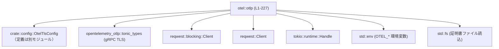
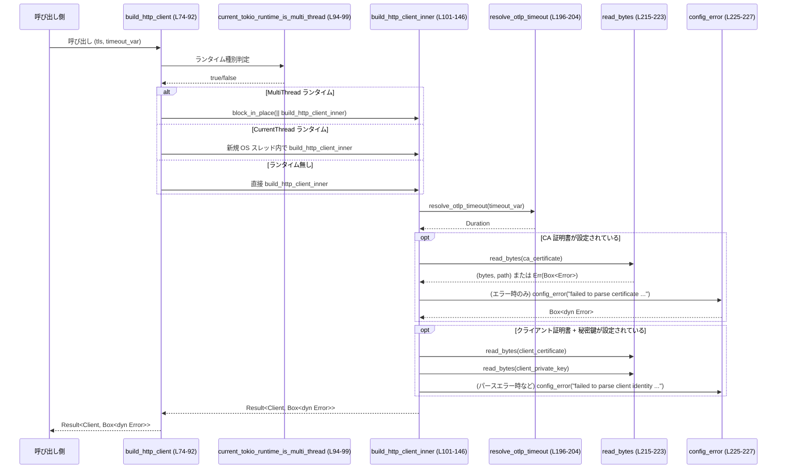

# otel\src\otlp.rs コード解説

## 0. ざっくり一言

OTLP（OpenTelemetry Protocol）エクスポータ向けに、  
gRPC / HTTP クライアントの TLS 設定とタイムアウト設定を組み立てるユーティリティ関数群です（otel\src\otlp.rs:L22-227）。

---

## 1. このモジュールの役割

### 1.1 概要

- このモジュールは **OTLP エクスポート時の通信設定** を行うために存在し、次の機能を提供します（otel\src\otlp.rs:L22-227）。
  - HTTP ヘッダマップの構築
  - gRPC クライアント用 TLS 設定の構築
  - blocking / async の HTTP クライアントの構築（reqwest ベース）
  - OTEL 関連の環境変数からのタイムアウト値解決
  - TLS 用証明書ファイルの読み込みとエラーメッセージの標準化

### 1.2 アーキテクチャ内での位置づけ

このモジュールは、構成情報 `OtelTlsConfig` と外部ライブラリ（opentelemetry_otlp, reqwest, tokio）を橋渡しして、  
「実際に使えるクライアント／TLS 設定」を組み立てる中間層として機能しています。



- `OtelTlsConfig` から TLS 関連のファイルパス・設定を取得します（otel\src\otlp.rs:L34-65, L101-141, L148-188）。
- `opentelemetry_otlp::tonic_types` を使って gRPC 用の TLS 設定を構築します（otel\src\otlp.rs:L48-51, L55-57）。
- `reqwest` の blocking / 非同期クライアントを TLS 付きで構築します（otel\src\otlp.rs:L101-146, L148-194）。
- `tokio::runtime` の種類を検査し、blocking クライアント構築時のスレッド／ランタイムの扱いを切り替えます（otel\src\otlp.rs:L74-92, L94-99）。
- 環境変数から OTLP タイムアウトを解決します（otel\src\otlp.rs:L196-213）。

### 1.3 設計上のポイント

コードから読み取れる設計上の特徴です。

- **責務の分離**
  - TLS 設定の構築（gRPC / HTTP）はそれぞれ別関数に分離されています（otel\src\otlp.rs:L34-68, L101-146, L148-194）。
  - タイムアウト解決は `resolve_otlp_timeout` に集約されています（otel\src\otlp.rs:L196-204）。
  - ファイル読み込み・設定エラー生成は `read_bytes`, `config_error` に集約されています（otel\src\otlp.rs:L215-227）。
- **状態を持たないユーティリティ**
  - すべての関数は `&OtelTlsConfig` 等の引数から情報を受け取り、内部状態を保持しません。
- **エラーハンドリング**
  - 戻り値は `Result<..., Box<dyn Error>>` で統一され、詳細なエラー型は隠蔽されています（otel\src\otlp.rs:L34-38, L74-77, L101-104, L148-151, L215-223）。
  - 設定ミスやパースエラーは `config_error` により `io::ErrorKind::InvalidData` として表現されます（otel\src\otlp.rs:L225-227）。
- **並行性への配慮**
  - current-thread / multi-thread の tokio ランタイムを判別し、blocking クライアント構築を
    - multi-thread ランタイムでは `block_in_place`（otel\src\otlp.rs:L78-79）
    - current-thread ランタイムでは専用 OS スレッド（otel\src\otlp.rs:L80-88）
    - 非 tokio 環境では通常実行（otel\src\otlp.rs:L89-91）
    に振り分けています。

---

## 2. 主要な機能とコンポーネント一覧

### 2.1 主要な機能一覧

- HTTP ヘッダマップの構築: 文字列キー・値から `reqwest` 用 `HeaderMap` を作成（otel\src\otlp.rs:L22-32）
- gRPC TLS 設定の構築: CA / クライアント証明書・秘密鍵を読み込み `ClientTlsConfig` を構成（otel\src\otlp.rs:L34-68）
- blocking HTTP クライアント構築: TLS とタイムアウトを考慮した `reqwest::blocking::Client` を構築（otel\src\otlp.rs:L74-92, L101-146）
- async HTTP クライアント構築: 同様の設定で `reqwest::Client` を構築（otel\src\otlp.rs:L148-194）
- OTLP タイムアウト解決: 環境変数から `Duration` を決定（otel\src\otlp.rs:L196-213）
- TLS 関連ファイル読み込み: 絶対パスから PEM/DER などのバイト列を読み込み（otel\src\otlp.rs:L215-223）

### 2.2 コンポーネントインベントリー（関数一覧）

| 名前 | 種別 | 可視性 | 役割 / 用途 | 行範囲 |
|------|------|--------|-------------|--------|
| `build_header_map` | 関数 | `pub(crate)` | `HashMap<String, String>` から `HeaderMap` を構築 | otel\src\otlp.rs:L22-32 |
| `build_grpc_tls_config` | 関数 | `pub(crate)` | gRPC 用 `ClientTlsConfig` に TLS 設定を適用 | otel\src\otlp.rs:L34-68 |
| `build_http_client` | 関数 | `pub(crate)` | blocking HTTP クライアントを TLS/タイムアウト付きで構築し、ランタイム種別に応じて実行方法を切り替え | otel\src\otlp.rs:L74-92 |
| `current_tokio_runtime_is_multi_thread` | 関数 | `pub(crate)` | 現在の tokio ランタイムが multi-thread かどうか判定 | otel\src\otlp.rs:L94-99 |
| `build_http_client_inner` | 関数 | `fn`（モジュール内） | 実際に `reqwest::blocking::Client` を構築（TLS, mTLS, タイムアウト設定） | otel\src\otlp.rs:L101-146 |
| `build_async_http_client` | 関数 | `pub(crate)` | 非同期用 `reqwest::Client` を構築（TLS, mTLS, タイムアウト設定） | otel\src\otlp.rs:L148-194 |
| `resolve_otlp_timeout` | 関数 | `pub(crate)` | OTLP のタイムアウト値を環境変数またはデフォルトから決定 | otel\src\otlp.rs:L196-204 |
| `read_timeout_env` | 関数 | `fn` | 単一の環境変数からミリ秒値を読み取り `Duration` に変換 | otel\src\otlp.rs:L206-213 |
| `read_bytes` | 関数 | `fn` | `AbsolutePathBuf` からファイルバイト列と `PathBuf` を返却 | otel\src\otlp.rs:L215-223 |
| `config_error` | 関数 | `fn` | 設定エラー用の `Box<dyn Error>` を生成 (`InvalidData`) | otel\src\otlp.rs:L225-227 |
| `current_tokio_runtime_is_multi_thread_detects_runtime_flavor` | テスト関数 | `#[test]` | ランタイム種別検出ロジックを検証 | otel\src\otlp.rs:L235-257 |
| `build_http_client_works_in_current_thread_runtime` | テスト関数 | `#[test]` | current-thread ランタイム上でも blocking クライアント構築が成功することを検証 | otel\src\otlp.rs:L259-271 |

---

## 3. 公開 API と詳細解説

### 3.1 型一覧（構造体・列挙体など）

このファイル内で新たに定義される構造体・列挙体はありません。

外部から利用される主な型は次の通りです（すべて他モジュール／クレートで定義）。

| 名前 | 種別 | 役割 / 用途 | 出現箇所 |
|------|------|-------------|----------|
| `OtelTlsConfig` | 構造体（推測） | TLS 関連の設定（CA 証明書、クライアント証明書、秘密鍵のパスなど） | otel\src\otlp.rs:L34-38, L75-76, L102-103, L149-150 |
| `ClientTlsConfig` | 構造体 | gRPC クライアントの TLS 設定 (`tonic` 用) | otel\src\otlp.rs:L36-37, L46-51, L55-57 |
| `reqwest::blocking::Client` | 構造体 | blocking HTTP クライアント | otel\src\otlp.rs:L77, L101-106, L143-145 |
| `reqwest::Client` | 構造体 | async HTTP クライアント | otel\src\otlp.rs:L151-153, L191-193 |

### 3.2 重要関数の詳細

以下では特に重要な 7 関数について詳しく説明します。

---

#### `build_header_map(headers: &std::collections::HashMap<String, String>) -> HeaderMap`

**概要**

文字列のキー・値からなる `HashMap` から、HTTP リクエストで使用可能な `HeaderMap` を構築します（otel\src\otlp.rs:L22-32）。

**引数**

| 引数名 | 型 | 説明 |
|--------|----|------|
| `headers` | `&HashMap<String, String>` | ヘッダ名と値のペア一覧。ヘッダ名はバイト列として検証されます。 |

**戻り値**

- `HeaderMap`（`reqwest::header::HeaderMap`）
  - 有効なヘッダ名・ヘッダ値だけを含むマップです（無効なエントリは silently 無視）。

**内部処理の流れ**

1. 空の `HeaderMap` を作成します（otel\src\otlp.rs:L23）。
2. 入力 `headers` の各 `(key, value)` に対してループします（otel\src\otlp.rs:L24）。
3. `HeaderName::from_bytes(key.as_bytes())` でキーを検証し（otel\src\otlp.rs:L25）、  
   同時に `HeaderValue::from_str(value)` で値を検証します（otel\src\otlp.rs:L26）。
4. 両方が `Ok` の場合のみ `header_map.insert(name, val)` で追加します（otel\src\otlp.rs:L28）。
5. 最後に `header_map` を返却します（otel\src\otlp.rs:L31）。

**Examples（使用例）**

```rust
use std::collections::HashMap;
use reqwest::header::HeaderValue;

// ユーザー定義のヘッダを構築する
let mut raw_headers = HashMap::new();
raw_headers.insert("x-otlp-token".to_string(), "secret".to_string());
raw_headers.insert("content-type".to_string(), "application/json".to_string());

let header_map = build_header_map(&raw_headers);

// 検証: 有効なヘッダだけが入っている
assert_eq!(
    header_map.get("x-otlp-token"),
    Some(&HeaderValue::from_static("secret"))
);
```

**Errors / Panics**

- 戻り値は `Result` ではないため、関数自体はエラーを返しません。
- 無効なヘッダ名／値（RFC 違反など）は `if let Ok(..)` の分岐で自動的に除外され、エラーも panic も発生しません（otel\src\otlp.rs:L25-29）。

**Edge cases（エッジケース）**

- `headers` が空: 空の `HeaderMap` が返されます（ループが即終了）。
- 不正なヘッダ名・値: 該当エントリはスキップされます。どのエントリが無視されたかは分かりません。

**使用上の注意点**

- 入力に不正なヘッダが含まれても、エラーが返らず無視されるため、  
  必要なら呼び出し側で検証・ログ出力を行う前提とする必要があります。

---

#### `build_grpc_tls_config(endpoint: &str, tls_config: ClientTlsConfig, tls: &OtelTlsConfig) -> Result<ClientTlsConfig, Box<dyn Error>>`

**概要**

gRPC 用エンドポイント URL と TLS 設定 `OtelTlsConfig` を基に、  
`tonic` 向けの `ClientTlsConfig` に CA 証明書および mTLS 設定を適用して返します（otel\src\otlp.rs:L34-68）。

**引数**

| 引数名 | 型 | 説明 |
|--------|----|------|
| `endpoint` | `&str` | OTLP gRPC エンドポイントの文字列（例: `"https://collector:4317"`） |
| `tls_config` | `ClientTlsConfig` | 既存の TLS 設定（ベース） |
| `tls` | `&OtelTlsConfig` | CA / クライアント証明書パス等を含む TLS 設定 |

**戻り値**

- `Ok(ClientTlsConfig)`:
  - `endpoint` のホスト名と `tls` の設定を反映した `ClientTlsConfig`。
- `Err(Box<dyn Error>)`:
  - エンドポイントにホストが含まれない・証明書ファイルの読み込み／パース失敗・mTLS 設定不整合など。

**内部処理の流れ**

1. `endpoint.parse::<Uri>()` で URI をパース（otel\src\otlp.rs:L39）。
2. `uri.host()` からホストを取得できなければ `config_error` でエラーを返却（otel\src\otlp.rs:L40-44）。
3. `tls_config.domain_name(host.to_owned())` で SNI 用ホスト名を設定（otel\src\otlp.rs:L46）。
4. `tls.ca_certificate` があれば、そのパスから `read_bytes` で PEM を読み込み（otel\src\otlp.rs:L48-50）、  
   `TonicCertificate::from_pem` で CA 証明書として設定（otel\src\otlp.rs:L50）。
5. `tls.client_certificate` と `tls.client_private_key` の組み合わせを `match` で評価（otel\src\otlp.rs:L53-65）。
   - 両方 `Some`: `read_bytes` で読み込み、`TonicIdentity::from_pem` で mTLS 用クライアント証明書を設定（otel\src\otlp.rs:L54-57）。
   - どちらか片方のみ: `config_error` でエラーを返却（otel\src\otlp.rs:L59-62）。
   - 両方 `None`: 何もしない。
6. 最終的な `config` を `Ok(config)` で返します（otel\src\otlp.rs:L67）。

**Examples（使用例）**

```rust
use opentelemetry_otlp::tonic_types::transport::ClientTlsConfig;

// 事前に OtelTlsConfig を構築済みとする（詳細定義は別モジュール）
let tls_config_base = ClientTlsConfig::new();
let endpoint = "https://otel-collector:4317";

let tls = OtelTlsConfig::default(); // 仮定: デフォルトでは TLS 無効 or 証明書なし

let client_tls_config = build_grpc_tls_config(endpoint, tls_config_base, &tls)?;
```

**Errors / Panics**

- エラーはすべて `Box<dyn Error>` で返されます。
  - エンドポイントにホスト名が含まれない場合:  
    `"OTLP gRPC endpoint {endpoint} does not include a host"`（otel\src\otlp.rs:L40-44）。
  - 証明書ファイルの読み込み失敗: `read_bytes` 由来の `"failed to read <path>: <error>"`（otel\src\otlp.rs:L215-223）。
  - mTLS の片方だけ指定された場合:  
    `"client_certificate and client_private_key must both be provided for mTLS"`（otel\src\otlp.rs:L59-62）。
- panic を直接発生させるコードはこの関数内にはありません（`?` による `Result` 伝播のみ）。

**Edge cases（エッジケース）**

- `endpoint` が不正な URI: `parse()` でエラーになり `Err` が返ります（otel\src\otlp.rs:L39）。
- `endpoint` にホスト名が含まれない（例: `"unix:/path"` のような形）: `uri.host()` が `None` となりエラー。
- CA 証明書パスが存在しない／読み込み不能: `read_bytes` でエラー。
- クライアント証明書だけ／秘密鍵だけが設定されている: mTLS 不整合としてエラー（otel\src\otlp.rs:L59-62）。

**使用上の注意点**

- mTLS を使う場合は `client_certificate` と `client_private_key` を常にペアで設定する必要があります。
- この関数はファイル I/O を伴うため、高頻度で呼び出すよりも初期化時に一度だけ呼ぶ構成が適しています（I/O ブロッキング回数の観点）。

---

#### `build_http_client(tls: &OtelTlsConfig, timeout_var: &str) -> Result<reqwest::blocking::Client, Box<dyn Error>>`

**概要**

OTLP HTTP エクスポータ用の blocking HTTP クライアントを構築します。  
現在の tokio ランタイムの有無・種別を考慮して、blocking 処理の実行方法を切り替えます（otel\src\otlp.rs:L74-92）。

**引数**

| 引数名 | 型 | 説明 |
|--------|----|------|
| `tls` | `&OtelTlsConfig` | TLS / mTLS の設定 |
| `timeout_var` | `&str` | 優先的に参照するタイムアウト環境変数名（例: `"OTEL_EXPORTER_OTLP_METRICS_TIMEOUT"`） |

**戻り値**

- `Ok(reqwest::blocking::Client)`:
  - TLS / タイムアウトが設定された blocking HTTP クライアント。
- `Err(Box<dyn Error>)`:
  - TLS 設定やタイムアウト、スレッド join などに関連するエラー。

**内部処理の流れ**

1. `current_tokio_runtime_is_multi_thread()` でランタイム種別を判定（otel\src\otlp.rs:L78）。
2. 分岐:
   - **multi-thread ランタイム中**（`true` の場合）:
     - `tokio::task::block_in_place(|| build_http_client_inner(tls, timeout_var))` を実行（otel\src\otlp.rs:L78-79）。
     - ブロッキング処理を専用スレッドプールに逃がしつつ、現在の async タスクをブロックします。
   - **current-thread ランタイム中**（multi-thread ではないが `Handle::try_current().is_ok()` の場合）:
     - `tls` を `clone` し、`timeout_var` を `String` にコピー（otel\src\otlp.rs:L81-82）。
     - `std::thread::spawn` で新しい OS スレッドを立て、その中で `build_http_client_inner` を実行（otel\src\otlp.rs:L83-85）。
     - `join()` して結果を受け取り、スレッドパニック時やエラー時は `config_error` に変換（otel\src\otlp.rs:L86-88）。
   - **tokio ランタイム外**:
     - `build_http_client_inner(tls, timeout_var)` を直接呼び出す（otel\src\otlp.rs:L89-91）。

**Examples（使用例）**

```rust
use opentelemetry_otlp::OTEL_EXPORTER_OTLP_TIMEOUT;

// tokio ランタイム外（同期コンテキスト）での利用例
let tls = OtelTlsConfig::default();
let client = build_http_client(&tls, OTEL_EXPORTER_OTLP_TIMEOUT)?;
```

tokio ランタイム内（multi-thread）の例:

```rust
#[tokio::main(flavor = "multi_thread")]
async fn main() -> Result<(), Box<dyn std::error::Error>> {
    let tls = OtelTlsConfig::default();
    let client = build_http_client(&tls, OTEL_EXPORTER_OTLP_TIMEOUT)?;
    // ここで client を使って blocking な OTLP HTTP エクスポート処理を
    // 別 OS スレッド等で実行する設計が想定されます。
    Ok(())
}
```

**Errors / Panics**

- TLS 設定・タイムアウト・HTTP クライアント構築のエラーは、そのまま `Box<dyn Error>` として伝播します。
- current-thread ランタイム分岐では:
  - スレッドの join に失敗した場合（スレッドパニックなど）  
    `"failed to join OTLP blocking HTTP client builder thread"` という `config_error` に変換されます（otel\src\otlp.rs:L86-87）。
- `tokio::task::block_in_place` は multi-thread ランタイムでのみ使用され、  
  その条件は `current_tokio_runtime_is_multi_thread` によって保証されています（otel\src\otlp.rs:L78-79, L94-99）。  
  このため、通常の使い方では `block_in_place` 由来の panic は起きない前提になっています。

**Edge cases（エッジケース）**

- tokio ランタイムが存在しない場合: 単純に blocking 処理として `build_http_client_inner` が呼ばれます。
- tokio current-thread ランタイムの場合: ランタイムスレッドをブロックしないよう、別 OS スレッドを利用します（otel\src\otlp.rs:L80-88）。
- multi-thread ランタイムで大量にこの関数を呼ぶと、`block_in_place` の呼び出しが増え、スレッド切り替えコストが増加します。

**使用上の注意点**

- 戻り値の `Client` はあくまで blocking 用であり、async コンテキストで直接 `.send().await` などを行う用途には向きません（reqwest の設計）。
- TLS 設定は `build_http_client_inner` に依存するため、証明書ファイルの読み込みや解析エラーが起こり得ます（後述）。

---

#### `current_tokio_runtime_is_multi_thread() -> bool`

**概要**

現在のスレッドに紐づく tokio ランタイムが multi-thread フレーバーかどうかを判定します（otel\src\otlp.rs:L94-99）。

**戻り値**

- `true`: tokio ランタイムが存在し、かつ `RuntimeFlavor::MultiThread` の場合。
- `false`: ランタイムが存在しない、または current-thread ランタイムの場合。

**内部処理の流れ**

1. `tokio::runtime::Handle::try_current()` を呼び出し、現在のスレッドにバインドされたランタイムハンドルを取得しようとします（otel\src\otlp.rs:L95）。
2. `match` で分岐:
   - `Ok(handle)`: `handle.runtime_flavor() == RuntimeFlavor::MultiThread` を比較して結果を返す（otel\src\otlp.rs:L96）。
   - `Err(_)`: ランタイムが存在しないため `false` を返す（otel\src\otlp.rs:L97）。

**Examples（使用例）**

テスト内の使い方が参考になります（otel\src\otlp.rs:L235-257）。

```rust
use tokio::runtime::Builder;

// ランタイムがない状態では false
assert!(!current_tokio_runtime_is_multi_thread());

// current-thread ランタイム上では false
let rt_current = Builder::new_current_thread().enable_all().build().unwrap();
assert_eq!(
    rt_current.block_on(async { current_tokio_runtime_is_multi_thread() }),
    false
);

// multi-thread ランタイム上では true
let rt_multi = Builder::new_multi_thread().worker_threads(2).enable_all().build().unwrap();
assert_eq!(
    rt_multi.block_on(async { current_tokio_runtime_is_multi_thread() }),
    true
);
```

**Errors / Panics**

- `try_current()` のエラーは `Err(_) => false` で握りつぶしており、エラーや panic は発生しません。

**Edge cases**

- 複数のランタイムが同じスレッドに存在するような状況は tokio の前提外であり、この関数もそこまでは考慮していません。

**使用上の注意点**

- この関数は副作用のない判定専用であり、blocking 処理の実行方法を決める補助として利用されます（`build_http_client` 内）。

---

#### `build_http_client_inner(tls: &OtelTlsConfig, timeout_var: &str) -> Result<reqwest::blocking::Client, Box<dyn Error>>`

**概要**

実際に `reqwest::blocking::Client` を構築する関数です。  
タイムアウト、CA 証明書、mTLS（クライアント証明書＋秘密鍵）などを設定します（otel\src\otlp.rs:L101-146）。

**引数 / 戻り値**

- 引数は `build_http_client` と同様です。
- `Ok(Client)` / `Err(Box<dyn Error>)` を返します。

**内部処理の流れ**

1. `reqwest::blocking::Client::builder()` からビルダを生成し、  
   `timeout(resolve_otlp_timeout(timeout_var))` でタイムアウトを設定（otel\src\otlp.rs:L105-106）。
2. `tls.ca_certificate` がある場合:
   - `read_bytes` でファイルを読み込み（otel\src\otlp.rs:L108-109）。
   - `ReqwestCertificate::from_pem` でパースし、失敗時は `config_error` でラップ（otel\src\otlp.rs:L110-115）。
   - `tls_built_in_root_certs(false)` で組み込みルート CA を無効化し、  
     `.add_root_certificate(certificate)` で読み込んだ CA を追加（otel\src\otlp.rs:L116-118）。
3. `tls.client_certificate` と `tls.client_private_key` の `match`（otel\src\otlp.rs:L121-141）:
   - 両方 `Some`:
     - `read_bytes` で各ファイルを読み込み（otel\src\otlp.rs:L123-124）。
     - 証明書と秘密鍵のバイト列を連結し（otel\src\otlp.rs:L125）、  
       `ReqwestIdentity::from_pem` でクライアント ID を作成（失敗時は `config_error`）（otel\src\otlp.rs:L126-132）。
     - `.identity(identity).https_only(true)` を設定（otel\src\otlp.rs:L133）。
   - 片方のみ `Some`: `config_error` でエラー（otel\src\otlp.rs:L135-138）。
   - 両方 `None`: 何もしない。
4. 最後に `builder.build()` でクライアントを構築し、`Box<dyn Error>` に変換して返却（otel\src\otlp.rs:L143-145）。

**使用上の注意点**

- `tls_built_in_root_certs(false)` を使うため、CA 証明書を指定した場合は  
  システムのデフォルト CA は使われず、指定した CA のみが信頼されます。
- mTLS を使う場合、証明書と鍵は PEM 形式で連結されて `ReqwestIdentity` に渡されます。  
  形式が合わないとパースエラーになります。

---

#### `build_async_http_client(tls: Option<&OtelTlsConfig>, timeout_var: &str) -> Result<reqwest::Client, Box<dyn Error>>`

**概要**

async 用 `reqwest::Client` を構築します。  
TLS 設定の適用ロジックは `build_http_client_inner` とほぼ同じですが、tokio ランタイムの種別には依存しません（otel\src\otlp.rs:L148-194）。

**引数**

| 引数名 | 型 | 説明 |
|--------|----|------|
| `tls` | `Option<&OtelTlsConfig>` | TLS 設定。`None` の場合はデフォルト TLS 設定でクライアントが構築されます。 |
| `timeout_var` | `&str` | 優先的に参照するタイムアウト環境変数名 |

**戻り値**

- `Ok(reqwest::Client)`:
  - async 用の HTTP クライアント。
- `Err(Box<dyn Error>)`:
  - TLS 設定やタイムアウト解決などに関連するエラー。

**内部処理の流れ**

1. `reqwest::Client::builder()` を生成し、`timeout(resolve_otlp_timeout(timeout_var))` でタイムアウト設定（otel\src\otlp.rs:L152）。
2. `tls` が `Some` の場合のみ TLS 周りの設定を適用（otel\src\otlp.rs:L154-189）。
   - CA 証明書の設定ロジックは `build_http_client_inner` と同様（otel\src\otlp.rs:L155-166）。
   - クライアント証明書と秘密鍵の mTLS 設定も同様（otel\src\otlp.rs:L168-188）。
3. 最後に `builder.build()` でクライアントを構築し、エラーを `Box<dyn Error>` に変換（otel\src\otlp.rs:L191-193）。

**Examples（使用例）**

```rust
use opentelemetry_otlp::OTEL_EXPORTER_OTLP_TIMEOUT;

async fn make_async_client() -> Result<reqwest::Client, Box<dyn std::error::Error>> {
    let tls = OtelTlsConfig::default();
    let client = build_async_http_client(Some(&tls), OTEL_EXPORTER_OTLP_TIMEOUT)?;
    Ok(client)
}
```

**Errors / Panics**

- 基本的に `build_http_client_inner` と同じ種類のエラーが発生し得ます。
- ファイル I/O は同期的に実行されるため、async コンテキストでこの関数を多用するとブロッキングが発生します（呼び出し側の設計に依存）。

**Edge cases**

- `tls = None` の場合、TLS の細かい設定はすべてデフォルト（reqwest 標準）になります。
- mTLS の片方だけ指定するケースはエラーになります（otel\src\otlp.rs:L182-186）。

**使用上の注意点**

- この関数自体は `async fn` ではないため、呼び出しは同期的であり、内部でファイル読み込みが行われます。  
  初期化フェーズ（アプリ起動時など）で呼ぶことが適しています。

---

#### `resolve_otlp_timeout(signal_var: &str) -> Duration`

**概要**

指定された環境変数名と `OTEL_EXPORTER_OTLP_TIMEOUT` の 2 段階でタイムアウト値（ミリ秒）を探し、  
見つかればそれを `Duration` に変換し、見つからなければデフォルト値を返します（otel\src\otlp.rs:L196-204）。

**引数**

| 引数名 | 型 | 説明 |
|--------|----|------|
| `signal_var` | `&str` | 優先的に参照する環境変数名 |

**戻り値**

- `Duration`:
  - `signal_var` または `OTEL_EXPORTER_OTLP_TIMEOUT` に設定された非負整数ミリ秒値、  
    または `OTEL_EXPORTER_OTLP_TIMEOUT_DEFAULT`。

**内部処理の流れ**

1. `read_timeout_env(signal_var)` を呼び出し、`Some(Duration)` ならそれを返す（otel\src\otlp.rs:L196-199）。
2. そうでなければ `read_timeout_env(OTEL_EXPORTER_OTLP_TIMEOUT)` を試す（otel\src\otlp.rs:L200-201）。
3. それでも `None` の場合、`OTEL_EXPORTER_OTLP_TIMEOUT_DEFAULT` を返す（otel\src\otlp.rs:L203）。

`read_timeout_env` は次のように動作します（otel\src\otlp.rs:L206-213）。

1. 環境変数 `var` を `env::var(var)` で取得し、失敗時は `None`。
2. 取得した文字列を `i64` としてパースし、失敗時は `None`。
3. パース結果が負の場合は `None`（otel\src\otlp.rs:L209-210）。
4. 非負値をミリ秒として `Duration::from_millis(parsed as u64)` に変換し `Some(Duration)` を返す（otel\src\otlp.rs:L212）。

**Examples（使用例）**

```rust
// 例: "OTEL_EXPORTER_OTLP_TIMEOUT" が "5000" の場合
std::env::set_var("OTEL_EXPORTER_OTLP_TIMEOUT", "5000");
let timeout = resolve_otlp_timeout("OTEL_EXPORTER_OTLP_METRICS_TIMEOUT");
// timeout == Duration::from_millis(5000)
```

**Errors / Panics**

- 環境変数取得やパースに失敗しても `None` を返すだけで、エラーや panic にはなりません。

**Edge cases**

- 環境変数が設定されていない: デフォルト値が使用されます。
- 環境変数が整数以外: パースに失敗し `None` になり、デフォルト値が使用されます。
- 環境変数が負の値: 無効とみなされ、デフォルト値が使用されます。

**使用上の注意点**

- タイムアウト値はミリ秒単位で設定される前提です。秒単位を想定して値を入れると実際より 1000 倍長くなります。
- 非負整数以外の値はすべて無視されるため、想定外の文字列を入れてもエラーが露呈しにくい点に注意が必要です。

---

#### `read_bytes(path: &AbsolutePathBuf) -> Result<(Vec<u8>, PathBuf), Box<dyn Error>>`

**概要**

絶対パスからファイルを読み込み、そのバイト列と `PathBuf` を返します。  
エラー時には、パスを含む標準化されたメッセージを持つ `io::Error` でラップします（otel\src\otlp.rs:L215-223）。

**引数 / 戻り値**

- 引数: `path: &AbsolutePathBuf`
- 戻り値:
  - `Ok((bytes, path_buf))`:
    - `bytes`: 読み込んだファイル内容
    - `path_buf`: `path.to_path_buf()` のコピー
  - `Err(Box<dyn Error>)`:
    - `"failed to read <path>: <error>"` というメッセージを持つ `io::Error`（kind は元のエラーに従う）（otel\src\otlp.rs:L218-221）。

**使用上の注意点**

- 元の `io::Error` はメッセージ内に埋め込まれ、`kind()` のみが保持されます。  
  エラーの種類は `kind()` で、詳細はメッセージで判別する形になります。

---

### 3.3 その他の関数（簡易一覧）

| 関数名 | 役割（1 行） | 行範囲 |
|--------|--------------|--------|
| `read_timeout_env` | 環境変数からミリ秒値を読み取り、非負整数なら `Duration` に変換 | otel\src\otlp.rs:L206-213 |
| `config_error` | 設定エラー用に `io::ErrorKind::InvalidData` を持つ `Box<dyn Error>` を生成 | otel\src\otlp.rs:L225-227 |

---

## 4. データフロー

ここでは、代表的なシナリオとして「blocking HTTP クライアント構築」の処理フローを説明します。

### 4.1 処理の要点

1. 呼び出し側が `build_http_client` を呼ぶ（otel\src\otlp.rs:L74-92）。
2. 現在の tokio ランタイム種別を `current_tokio_runtime_is_multi_thread` で判定（otel\src\otlp.rs:L94-99）。
3. ランタイム種別に応じて、`build_http_client_inner` を
   - multi-thread ランタイム → `block_in_place` 内で呼ぶ
   - current-thread ランタイム → 新規 OS スレッドで呼ぶ
   - ランタイムなし → 直に呼ぶ
4. `build_http_client_inner` 内で `resolve_otlp_timeout`・`read_bytes` を使って TLS 設定やタイムアウトを適用し、`Client` を生成（otel\src\otlp.rs:L101-146, L196-213, L215-223）。

### 4.2 シーケンス図



---

## 5. 使い方（How to Use）

### 5.1 基本的な使用方法

OTLP HTTP エクスポータで blocking クライアントを構築する基本的な流れです。

```rust
use opentelemetry_otlp::OTEL_EXPORTER_OTLP_TIMEOUT;
use crate::config::OtelTlsConfig;
use crate::otel::otlp::build_http_client; // 実際のモジュールパスはプロジェクト構成に依存（このチャンクからは不明）

fn init_otlp_client() -> Result<reqwest::blocking::Client, Box<dyn std::error::Error>> {
    // TLS 設定を用意する（定義は別モジュール）
    let tls_config = OtelTlsConfig::default();

    // OTLP 用タイムアウト環境変数名を指定して blocking クライアントを構築する
    let client = build_http_client(&tls_config, OTEL_EXPORTER_OTLP_TIMEOUT)?;

    Ok(client)
}
```

gRPC 用 TLS 設定の構築例:

```rust
use opentelemetry_otlp::tonic_types::transport::ClientTlsConfig;
use crate::config::OtelTlsConfig;
use crate::otel::otlp::build_grpc_tls_config;

fn init_grpc_tls(endpoint: &str) -> Result<ClientTlsConfig, Box<dyn std::error::Error>> {
    let tls_config = OtelTlsConfig::default();
    let base = ClientTlsConfig::new();
    let tls = build_grpc_tls_config(endpoint, base, &tls_config)?;
    Ok(tls)
}
```

### 5.2 よくある使用パターン

1. **tokio ランタイム外で blocking クライアントを構築**
   - 単純に `build_http_client` を呼び出す。
2. **async ランタイム内で async クライアントを構築**
   - `build_async_http_client` を同期的に呼び出し、その後 `reqwest::Client` を async リクエストに使用。

```rust
#[tokio::main]
async fn main() -> Result<(), Box<dyn std::error::Error>> {
    let tls = OtelTlsConfig::default();
    let http_client = build_async_http_client(Some(&tls), OTEL_EXPORTER_OTLP_TIMEOUT)?;

    let resp = http_client.get("https://example.com").send().await?;
    println!("{}", resp.status());
    Ok(())
}
```

1. **異なるシグナルごとにタイムアウト環境変数を切り替える**
   - 例: トレース用とメトリクス用で `timeout_var` を変えて `resolve_otlp_timeout` の優先度を調整。

### 5.3 よくある間違い

```rust
// 間違い例: mTLS で秘密鍵だけを設定している
tls.client_private_key = Some("/path/to/key.pem".into());
// tls.client_certificate は None のまま

// この状態で build_http_client_inner / build_async_http_client を呼ぶと
// "client_certificate and client_private_key must both be provided for mTLS" というエラーになります。
```

```rust
// 間違い例: タイムアウトを負の値で設定している
std::env::set_var("OTEL_EXPORTER_OTLP_TIMEOUT", "-1");

// resolve_otlp_timeout は負値を無効として扱い（otel\src\otlp.rs:L209-210）
// デフォルトタイムアウトにフォールバックします。
// 意図した値が反映されません。
```

```rust
// 間違い例: async コンテキストで blocking クライアントを直接使う（HTTP リクエストも blocking）
#[tokio::main]
async fn main() {
    let tls = OtelTlsConfig::default();
    let client = build_http_client(&tls, OTEL_EXPORTER_OTLP_TIMEOUT).unwrap();

    // ↓ これは tokio タスクをブロックし、スループットに悪影響を与えます
    let resp = client.get("https://example.com").send().unwrap();
}
```

### 5.4 使用上の注意点（まとめ）

- mTLS を利用する場合、証明書と秘密鍵は常にペアで指定する必要があります（otel\src\otlp.rs:L121-141, L168-188）。
- CA 証明書を設定すると `tls_built_in_root_certs(false)` によりシステムのルート CA が無効化されるため、  
  どの CA を信頼しているかを明確に把握しておく必要があります（otel\src\otlp.rs:L116-118, L164-165）。
- `build_async_http_client` は同期関数であり、内部でファイル I/O を行うため、  
  起動時の初期化フェーズで呼ぶ設計が適しています。
- タイムアウト値はミリ秒単位の非負整数で指定されます。誤った単位や負値は静かに無視される点に注意が必要です（otel\src\otlp.rs:L206-213）。

---

## 6. 変更の仕方（How to Modify）

### 6.1 新しい機能を追加する場合

例: OTLP 用に追加の HTTP 設定（プロキシ・リトライポリシーなど）を導入したい場合。

1. **HTTP クライアントの構築ロジックを追加**
   - `build_http_client_inner`（otel\src\otlp.rs:L101-146）と  
     `build_async_http_client`（otel\src\otlp.rs:L148-194）が HTTP ビルダを扱う中心の関数です。
   - ここに `.proxy(...)` や `.pool_max_idle_per_host(...)` などの設定を追加する形が自然です。
2. **設定値の入力経路**
   - 新しい設定は通常 `OtelTlsConfig` とは別の設定構造体に追加されると考えられますが、  
     本チャンクにはその定義がないため、詳細なパスは不明です。
3. **gRPC TLS に関する機能拡張**
   - gRPC 側の TLS 拡張は `build_grpc_tls_config`（otel\src\otlp.rs:L34-68）に追加するのが自然です。

### 6.2 既存の機能を変更する場合の注意点

- **タイムアウトの解釈を変える場合**
  - `resolve_otlp_timeout` と `read_timeout_env`（otel\src\otlp.rs:L196-213）でのみ扱われています。  
    ここを変更する際は、他コードが「ミリ秒」を前提としていないか確認する必要があります。
- **TLS 周りの変更**
  - gRPC / HTTP の両方が `read_bytes` と `config_error` を共有しているため、  
    これらの関数のインターフェースを変更するとモジュール内の複数箇所に影響します（otel\src\otlp.rs:L48-50, L55-56, L108-109, L123-124, L156-157, L170-171）。
- **tokio ランタイム判定の変更**
  - `current_tokio_runtime_is_multi_thread` の挙動を変えると、`build_http_client` のブロッキング戦略がすべて変わります。  
    それに対応するテスト（otel\src\otlp.rs:L235-257）も更新する必要があります。

---

## 7. 関連ファイル

このモジュールと密接に関係するファイル・クレートは次の通りです。

| パス / クレート | 役割 / 関係 |
|----------------|------------|
| `crate::config::OtelTlsConfig`（具体的パスはこのチャンクには現れない） | TLS 設定（CA 証明書・クライアント証明書・秘密鍵のパスなど）を保持し、本モジュールのほぼすべての関数から参照されます（otel\src\otlp.rs:L34-38, L75-76, L102-103, L149-150）。 |
| `opentelemetry_otlp` クレート | OTEL の gRPC クライアント設定に必要な `ClientTlsConfig` や環境変数定数 `OTEL_EXPORTER_OTLP_TIMEOUT` 等を提供します（otel\src\otlp.rs:L4-8）。 |
| `reqwest` クレート | HTTP クライアント実装と TLS 証明書関連型（`Certificate`, `Identity`, `HeaderMap` など）を提供し、本モジュールの HTTP 構築ロジックで利用されます（otel\src\otlp.rs:L9-13, L101-146, L148-194）。 |
| `tokio` クレート | ランタイム検出 (`Handle::try_current`, `RuntimeFlavor`) や `block_in_place` を提供し、blocking クライアント構築時の並行性制御に使われます（otel\src\otlp.rs:L78-80, L94-99, L235-271）。 |

---

## バグ・セキュリティ・テスト・性能に関する補足（このファイルに基づく範囲）

### バグの可能性とセキュリティ上の注意点

- **mTLS 設定の整合性チェック**
  - クライアント証明書と秘密鍵が片方のみ指定された場合に明示的なエラーを返すことで、  
    想定外の片側指定を防いでいます（otel\src\otlp.rs:L59-62, L135-138, L182-186）。
- **CA 証明書を指定した場合の信頼ストア**
  - `tls_built_in_root_certs(false)` により組み込みルート CA を無効にするため、  
    適切な CA を指定しないと接続できない状態になります（otel\src\otlp.rs:L116-118, L164-165）。  
    これはセキュリティ強化の一方で、誤設定時に接続不能となる点に注意が必要です。
- **エラーメッセージにパスを含める**
  - `read_bytes` はエラーメッセージにファイルパスを含めます（otel\src\otlp.rs:L218-221）。  
    ログにそのまま出力する場合、ファイルシステム構成が露出する点には注意が必要です。

現時点のコードから明確なロジックバグは読み取れませんでしたが、  
セキュリティ的には CA／mTLS 設定の誤構成が起きた際の挙動（接続エラー）が重要なポイントになります。

### 契約・エッジケースの整理（まとめ）

- `build_grpc_tls_config` / `build_http_client_inner` / `build_async_http_client`
  - 前提: `OtelTlsConfig` のパスは存在していること（存在しないと `read_bytes` がエラー）。
  - mTLS: 証明書と秘密鍵は両方指定されなければならない。
- `resolve_otlp_timeout`
  - 入力: 環境変数はミリ秒単位の非負整数文字列。
  - 負値・非数値・未設定はすべて「値なし」と同等に扱われ、デフォルトにフォールバック。
- `build_header_map`
  - 不正なヘッダ名／値は静かに無視される（エラーを返さない）。

### テスト

- `current_tokio_runtime_is_multi_thread_detects_runtime_flavor`（otel\src\otlp.rs:L235-257）
  - tokio ランタイムのない状態・current-thread ランタイム・multi-thread ランタイムのそれぞれで  
    `current_tokio_runtime_is_multi_thread` の戻り値が期待どおりになることを検証しています。
- `build_http_client_works_in_current_thread_runtime`（otel\src\otlp.rs:L259-271）
  - current-thread ランタイム上で `build_http_client` を呼び出し、  
    blocking クライアント構築が成功すること（= 別スレッドでの実行パスが正しく動作すること）を検証しています。

### 性能・スケーラビリティに関する注意

- 証明書ファイルの読み込みはすべて同期 I/O であり、毎回 `read_bytes` を実行するとコストがかかります。  
  実運用では、初期化フェーズで一度だけクライアント（または TLS 設定）を構築し、再利用する前提が適しています。
- multi-thread tokio ランタイムでは `block_in_place` を利用しており、  
  多数のスレッドが同時に呼び出すとスレッドプールのブロッキング枠を消費します。

この範囲が、与えられたチャンク（otel\src\otlp.rs:L1-272）から読み取れる情報になります。
