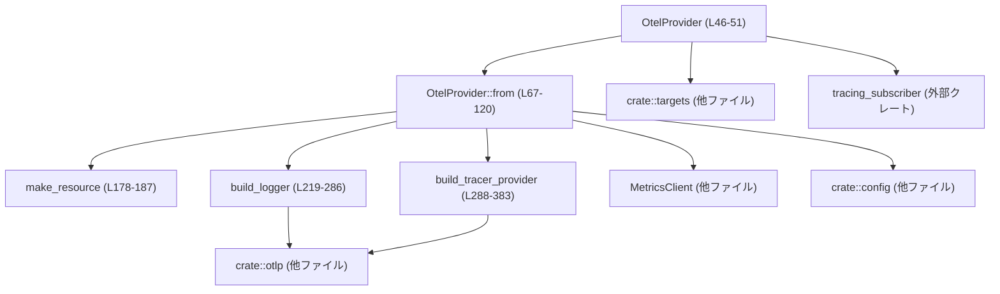
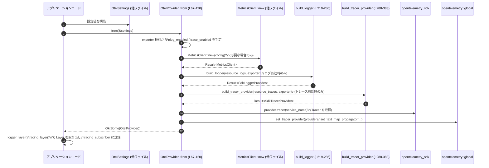

# `otel/src/provider.rs` コード解説

## 0. ざっくり一言

- OpenTelemetry の **ログ・トレース・メトリクスのエクスポータを一括初期化**し、`tracing_subscriber` に組み込むための Layer を提供するプロバイダです（根拠: `otel/src/provider.rs:L46-51`, `L67-120`, `L122-144`）。
- OTLP gRPC / HTTP（TLS 対応）に基づき、エクスポート対象（ログ／トレース／メトリクス）と安全な出力先をフィルタリングします（根拠: `L71-85`, `L219-286`, `L288-383`, `L150-156`）。

---

## 1. このモジュールの役割

### 1.1 概要

- このモジュールは、`OtelSettings` に基づいて OpenTelemetry の **LoggerProvider / TracerProvider / MetricsClient を初期化**し、アプリケーションから利用しやすいように `OtelProvider` 構造体にまとめて公開します（根拠: `L46-51`, `L67-120`）。
- あわせて、`tracing` イベントを OpenTelemetry ログ／トレースに橋渡しする `Layer` を構築し、**出力対象（target）に応じたフィルタリング**を行います（根拠: `L122-156`, `L6-7`）。
- リソース属性（サービス名・バージョン・環境・ホスト名）もここで構成され、ログとトレースで必要な属性だけを付与します（根拠: `L37-44`, `L178-207`）。

### 1.2 アーキテクチャ内での位置づけ

このモジュールは「OpenTelemetry 周辺の設定ハブ」として、設定モジュール・メトリクスモジュール・OTLP 送信モジュールと連携します。



- `crate::config`（このチャンクには実装なし）は `OtelSettings` と `resolve_exporter` を提供し、どのエクスポータを使うかを決めます（根拠: `L1-3`, `L71`, `L219-221`, `L288-291`）。
- `crate::metrics`（このチャンクには実装なし）は `MetricsClient` と `MetricsConfig` を提供し、メトリクスの OTLP 送信を行います（根拠: `L4-5`, `L71-85`）。
- `crate::otlp`（このチャンクには実装なし）は HTTP/GRPC クライアントや TLS 設定など、OTLP 送信の具体的な構成を担います（根拠: `L235`, `L241-243`, `L274-276`, `L302`, `L308-310`, `L340-343`, `L367-370`）。
- `crate::targets` は、どの `tracing` target がログ／トレースとして安全かを判定する関数を提供します（根拠: `L6-7`, `L150-156`, `L439-452`）。

### 1.3 設計上のポイント

- **責務の集約**  
  OpenTelemetry に関する設定・初期化（ログ／トレース／メトリクス）と `tracing` 連携を一つの構造体 `OtelProvider` に集約しています（根拠: `L46-51`, `L67-120`, `L122-160`）。

- **リソース属性の分離**  
  ホスト名属性はログのみに付与し、トレースには付与しない設計になっています（根拠: `L37-44`, `L189-207`）。

- **エクスポータごとの分岐**  
  OTLP gRPC / HTTP に応じてエクスポータ設定を切り替え、さらに HTTP については tokio ランタイムの種類（マルチスレッドかどうか）で非同期 BatchSpanProcessor を選択するようになっています（根拠: `L219-286`, `L288-383`）。

- **エラーハンドリング方針**  
  初期化系関数は `Result<..., Box<dyn Error>>` を返し、内部エラーは `?` で伝播しますが、`shutdown` や `Drop` 内での終了処理のエラーは無視（ログも出さずに捨てる）する方針です（根拠: `L67`, `L219`, `L288`, `L54-65`, `L163-175`）。

- **並行性への配慮**  
  トレースの HTTP エクスポータでは、tokio マルチスレッドランタイムが検出された場合に専用の非同期 `TokioBatchSpanProcessor` を利用することで、高負荷時のエクスポートをバックグラウンドで処理できる設計です（根拠: `L328-353`）。

---

## 2. 主要な機能一覧 & コンポーネントインベントリー

### 2.1 主な機能

- OpenTelemetry プロバイダの構築: 設定 (`OtelSettings`) から `OtelProvider` を生成し、グローバル TracerProvider とコンテキストプロパゲータを設定する。
- ログ・トレース Layer の提供: `tracing_subscriber` に組み込める Layer を返す。
- メトリクスクライアントの構築とグローバル登録。
- OTLP gRPC / HTTP エクスポータの構築（TLS, ヘッダ／メタデータ設定を含む）。
- リソース属性（サービス名・バージョン・環境・ホスト名など）の構成。
- ログ／トレース出力対象のフィルタリング（target ベース）。

### 2.2 型・定数インベントリー

| 名前 | 種別 | 役割 / 用途 | 定義位置 |
|------|------|-------------|----------|
| `ENV_ATTRIBUTE` | 定数 `&'static str` | リソース属性として環境名を表すキー `"env"` | `otel/src/provider.rs:L37` |
| `HOST_NAME_ATTRIBUTE` | 定数 `&'static str` | リソース属性に埋め込むホスト名キー `"host.name"` | `otel/src/provider.rs:L38` |
| `ResourceKind` | enum | リソース種別（ログ用 / トレース用）を区別するために利用 | `otel/src/provider.rs:L40-44` |
| `OtelProvider` | 構造体 | LoggerProvider / TracerProvider / Tracer / MetricsClient をまとめて保持する公開 API | `otel/src/provider.rs:L46-51` |

### 2.3 関数・メソッドインベントリー

**`OtelProvider` のメソッド**

| 名前 | 種別 | 役割 / 用途 | 定義位置 |
|------|------|-------------|----------|
| `OtelProvider::shutdown(&self)` | メソッド | ロガー・トレーサープロバイダ・メトリクスクライアントの終了処理を順に呼ぶ | `otel/src/provider.rs:L54-65` |
| `OtelProvider::from(settings: &OtelSettings)` | 関連関数 | 設定から `OtelProvider` を構築し、必要に応じてグローバル TracerProvider を登録する | `otel/src/provider.rs:L67-120` |
| `OtelProvider::logger_layer<S>(&self)` | メソッド | OpenTelemetry ロガーを `tracing_subscriber::Layer` として返す | `otel/src/provider.rs:L122-131` |
| `OtelProvider::tracing_layer<S>(&self)` | メソッド | OpenTelemetry トレーサーを `tracing_subscriber::Layer` として返す | `otel/src/provider.rs:L133-144` |
| `OtelProvider::codex_export_filter(meta)` | 関連関数 | 互換用エイリアス。`log_export_filter` を呼ぶ | `otel/src/provider.rs:L146-148` |
| `OtelProvider::log_export_filter(meta)` | 関連関数 | ログ向けに export してよい `tracing` イベントか判定する | `otel/src/provider.rs:L150-152` |
| `OtelProvider::trace_export_filter(meta)` | 関連関数 | トレース向けに export してよい `tracing` メタデータか判定する | `otel/src/provider.rs:L154-156` |
| `OtelProvider::metrics(&self)` | メソッド | 内部に保持する `MetricsClient` への参照（Option）を返す | `otel/src/provider.rs:L158-160` |

**その他の関数・実装**

| 名前 | 種別 | 役割 / 用途 | 定義位置 |
|------|------|-------------|----------|
| `Drop for OtelProvider::drop(&mut self)` | Drop 実装 | `shutdown` と同等の終了処理を所有権破棄時に行う | `otel/src/provider.rs:L163-175` |
| `make_resource(settings, kind)` | 関数 | サービス名と属性を持つ OpenTelemetry `Resource` を作成する | `otel/src/provider.rs:L178-187` |
| `resource_attributes(settings, host_name, kind)` | 関数 | リソースに付与する `KeyValue` 属性一覧を構成する | `otel/src/provider.rs:L189-207` |
| `detected_host_name()` | 関数 | ホスト名を OS から取得し、空でない場合に `Some` で返す | `otel/src/provider.rs:L209-212` |
| `normalize_host_name(host_name)` | 関数 | 文字列を trim し、空文字列であれば `None` を返す | `otel/src/provider.rs:L214-217` |
| `build_logger(resource, exporter)` | 関数 | `SdkLoggerProvider` を OTLP gRPC/HTTP エクスポータ付きで構築する | `otel/src/provider.rs:L219-286` |
| `build_tracer_provider(resource, exporter)` | 関数 | `SdkTracerProvider` を OTLP gRPC/HTTP エクスポータ付きで構築する | `otel/src/provider.rs:L288-383` |

**テストコード**

| 名前 | 種別 | 役割 / 用途 | 定義位置 |
|------|------|-------------|----------|
| `resource_attributes_include_host_name_when_present` | テスト | ログ用 Resource にホスト名が付与されることを検証 | `otel/src/provider.rs:L392-405` |
| `resource_attributes_omit_host_name_when_missing_or_empty` | テスト | ホスト名が無い／空のときに属性が追加されないことを検証 | `otel/src/provider.rs:L408-436` |
| `log_export_target_excludes_trace_safe_events` | テスト | ログ用 target が trace_safe 系を含まないことを検証（`crate::targets` 依存） | `otel/src/provider.rs:L439-444` |
| `trace_export_target_only_includes_trace_safe_prefix` | テスト | trace_safe プレフィックスのみをトレース用として扱うことを検証 | `otel/src/provider.rs:L447-452` |
| `test_otel_settings` | テスト補助関数 | テスト用の `OtelSettings` 値を生成 | `otel/src/provider.rs:L454-465` |

---

## 3. 公開 API と詳細解説

### 3.1 型一覧（構造体・列挙体など）

| 名前 | 種別 | 役割 / 用途 | フィールド概要 | 定義位置 |
|------|------|-------------|---------------|----------|
| `ResourceKind` | enum（非公開） | リソース種別（ログ／トレース）を区別するために利用 | `Logs`, `Traces` の 2 値 | `otel/src/provider.rs:L40-44` |
| `OtelProvider` | 構造体（公開） | OpenTelemetry の LoggerProvider / TracerProvider / Tracer / MetricsClient を束ねる中心的な公開 API | `logger: Option<SdkLoggerProvider>`, `tracer_provider: Option<SdkTracerProvider>`, `tracer: Option<Tracer>`, `metrics: Option<MetricsClient>` | `otel/src/provider.rs:L46-51` |

---

### 3.2 関数詳細（重要 7 件）

#### `OtelProvider::from(settings: &OtelSettings) -> Result<Option<Self>, Box<dyn Error>>`

**概要**

- `OtelSettings` からログ／トレース／メトリクスのエクスポータを解決し、必要な OpenTelemetry プロバイダを生成して `OtelProvider` として返します（根拠: `otel/src/provider.rs:L67-120`）。
- いずれのエクスポータも有効でない場合は `Ok(None)` を返し、何も初期化しません（根拠: `L91-94`）。

**引数**

| 引数名 | 型 | 説明 |
|--------|----|------|
| `settings` | `&OtelSettings` | OpenTelemetry のエクスポータ種別やサービス情報を含む設定。実体は `crate::config` モジュールに定義（このチャンクには実装が現れません）。 |

**戻り値**

- `Result<Option<OtelProvider>, Box<dyn Error>>`  
  - 成功時:
    - 少なくとも 1 つのエクスポータ（ログ／トレース／メトリクス）が有効なら `Ok(Some(OtelProvider))`。
    - 何も有効でなければ `Ok(None)`。
  - 失敗時:
    - メトリクスクライアントや OTLP エクスポータの構築時に発生したエラーを `Box<dyn Error>` として返します。

**内部処理の流れ**

1. ログ・トレースの有効／無効を `OtelSettings` から判定します（`OtelExporter::None` かどうか）（根拠: `L67-70`）。
2. メトリクス用エクスポータを `crate::config::resolve_exporter` で解決し、`None` でなければ `MetricsConfig::otlp` と `MetricsClient::new` でクライアントを構築します（根拠: `L71-85`）。
3. メトリクスが生成された場合、`crate::metrics::install_global` でグローバルなメトリクスクライアントとして登録します（根拠: `L87-89`）。
4. ログ・トレース・メトリクスのいずれも有効でなければ、デバッグログを出力して `Ok(None)` を返します（根拠: `L91-94`）。
5. ログ用・トレース用にそれぞれ `make_resource` で `Resource` を構築します（根拠: `L96-97`, `L178-187`）。
6. ログが有効な場合は `build_logger` で `SdkLoggerProvider` を構築します（根拠: `L98-101`, `L219-286`）。
7. トレースが有効な場合は `build_tracer_provider` で `SdkTracerProvider` を構築します（根拠: `L102-104`, `L288-383`）。
8. `tracer_provider` が存在する場合、そのプロバイダからサービス名を指定して `Tracer` を取得します（根拠: `L106-108`）。
9. `tracer_provider` が存在する場合、グローバル TracerProvider と TraceContext プロパゲータを登録します（根拠: `L110-113`）。
10. 以上で構築した `logger`, `tracer_provider`, `tracer`, `metrics` をまとめて `OtelProvider` として返します（根拠: `L114-119`）。

**Examples（使用例）**

以下は、トレースエクスポータのみを有効にして `OtelProvider` を構築し、`tracing_subscriber` にトレースレイヤを導入する例です（ログ・メトリクスは無効と仮定）。

```rust
use std::error::Error;                                         // Error トレイトを使う
use tracing_subscriber::{layer::SubscriberExt, util::SubscriberInitExt}; // .with, .init 用
use your_crate::config::{OtelSettings, OtelExporter};          // このチャンク外の設定型
use your_crate::otel::provider::OtelProvider;                  // 本モジュールの公開型

fn init_tracing(settings: &OtelSettings) -> Result<(), Box<dyn Error>> {
    // OpenTelemetry プロバイダを構築する（トレースだけ有効とする設定を想定）
    let maybe_provider = OtelProvider::from(settings)?;        // Result<Option<_>, _> を受け取る

    // エクスポータが 1 つも有効でなければ何もしない
    let provider = match maybe_provider {
        Some(p) => p,                                          // OTEL 有効なので利用する
        None => return Ok(()),                                 // すべて無効なら早期リターン
    };

    // トレースエクスポータが有効な場合は tracing Layer を得られる
    if let Some(tracing_layer) = provider.tracing_layer() {    // Option<impl Layer> をチェック
        tracing_subscriber::registry()                         // 基本となる Registry を作る
            .with(tracing_layer)                               // OTEL トレース Layer を追加
            .init();                                           // グローバル Subscriber として登録
    }

    Ok(())
}
```

**Errors / Panics**

- `Err(..)` になりうるケース（すべて `Box<dyn Error>` に包まれる）:
  - `MetricsClient::new(config)` がエラーを返した場合（根拠: `L84-85`）。
  - `build_logger` 内の OTLP クライアント構築や `LogExporter::builder().build()` が失敗した場合（根拠: `L246-252`, `L274-280`）。
  - `build_tracer_provider` 内の OTLP クライアント構築や `SpanExporter::builder().build()` が失敗した場合（根拠: `L313-318`, `L340-343`, `L367-373`）。
- panic になりうるケース:
  - `build_logger` / `build_tracer_provider` で `OtelExporter::Statsig` が渡された場合 `unreachable!` により panic します（根拠: `L227-228`, `L294-295`）。
    - 呼び出し側の契約として、`Statsig` は事前に `resolve_exporter` で解決済みであることが前提です（コメント文言からの推測を含むが、`unreachable!` は明示されています）。

**Edge cases（エッジケース）**

- すべてのエクスポータが `OtelExporter::None` の場合:
  - `log_enabled` / `trace_enabled` がともに `false` となり、メトリクスも `None` のため `Ok(None)` を返します（根拠: `L67-73`, `L91-94`）。
- メトリクスだけ有効な場合:
  - ログ・トレース用のリソース／プロバイダは構築されず、`logger` / `tracer_provider` / `tracer` は `None` になります（根拠: `L67-85`, `L91-105`, `L114-118`）。
- `MetricsClient::new` が失敗した場合:
  - `?` により `OtelProvider::from` も `Err` を返し、その時点で初期化処理は中断されます（根拠: `L84-85`）。
- `tracer_provider` が `None` の場合:
  - グローバル TracerProvider やテキストマッププロパゲータは登録されません（根拠: `L106-113`）。

**使用上の注意点**

- 呼び出し側は **`Option<OtelProvider>` を必ず確認**する必要があります。`None` の場合はログ／トレース／メトリクスが一切初期化されていない状態です。
- `Box<dyn Error>` を返すため、エラーの具体的な型は抽象化されています。必要に応じて `downcast_ref` などで型情報を取り出すことができます（Rust の一般的なパターン）。
- `build_logger` / `build_tracer_provider` に `Statsig` を渡すと `unreachable!` により panic するため、`OtelSettings` の組み立て側でこの状態が起こらない契約になっている前提です（根拠: `L227-228`, `L294-295`）。

---

#### `OtelProvider::logger_layer<S>(&self) -> Option<impl Layer<S> + Send + Sync>`

**概要**

- OpenTelemetry ログプロバイダ（`SdkLoggerProvider`）を `tracing` に橋渡しする Layer を返します（根拠: `otel/src/provider.rs:L122-131`）。
- Layer には `log_export_filter` に基づくフィルタが適用され、特定 target のログのみが OTEL にエクスポートされます（根拠: `L126-130`, `L150-152`）。

**引数**

| 引数名 | 型 | 説明 |
|--------|----|------|
| `self` | `&self` | `OtelProvider` の共有参照。内部に保持している `SdkLoggerProvider` を参照します。 |
| `S` (ジェネリクス) | `tracing::Subscriber + for<'span> LookupSpan<'span> + Send + Sync` | Layer を適用する `tracing_subscriber` の Subscriber 型です。 |

**戻り値**

- `Option<impl Layer<S> + Send + Sync>`  
  - `logger` が存在する場合、`OpenTelemetryTracingBridge` で `SdkLoggerProvider` をラップした Layer を `Some` で返します。
  - `logger` が `None` の場合は `None` です（根拠: `L126-130`）。

**内部処理の流れ**

1. `self.logger.as_ref()` で `SdkLoggerProvider` の参照を取得します（根拠: `L126`）。
2. 存在する場合は `OpenTelemetryTracingBridge::new(logger)` で `tracing` と OpenTelemetry ログを橋渡しする Layer を作成します（根拠: `L127`）。
3. この Layer に `tracing_subscriber::filter::filter_fn(OtelProvider::log_export_filter)` によるフィルタを適用し、ログ出力の対象を絞ります（根拠: `L127-129`）。

**Examples（使用例）**

```rust
use std::error::Error;
use tracing_subscriber::{layer::SubscriberExt, util::SubscriberInitExt};
use your_crate::otel::provider::OtelProvider;

fn init_logging(provider: &OtelProvider) -> Result<(), Box<dyn Error>> {
    // ログ Layer が構成されている場合のみ Subscriber に追加する
    if let Some(logger_layer) = provider.logger_layer() {        // Option<impl Layer>
        tracing_subscriber::registry()                           // ベースとなる Registry
            .with(logger_layer)                                  // OTEL ログ Layer を追加
            .init();                                             // グローバル Subscriber として登録
    }

    Ok(())
}
```

**Errors / Panics**

- この関数自体は `Result` を返さず、内部でもエラーや panic の可能性は見当たりません。
- ただし、返された Layer を `tracing_subscriber` に登録する際に、`set_global_default` の多重呼び出しなどでエラー／panic が起こる可能性がありますが、それは呼び出し側の文脈に依存します（このチャンクには現れません）。

**Edge cases**

- `OtelProvider` がログエクスポータを持っていない場合（`logger: None`）:
  - `None` が返り、呼び出し側は Layer を追加しない実装にする必要があります（根拠: `L126-130`）。

**使用上の注意点**

- 戻り値は `Option` であるため、必ず `if let Some(layer)` などで存在チェックを行う必要があります。
- Layer 型は `impl Layer<S> + Send + Sync` で抽象化されているため、具体的な型名には依存せず `tracing_subscriber` の拡張メソッド（`.with(...)`）を使うのが前提です。

---

#### `OtelProvider::tracing_layer<S>(&self) -> Option<impl Layer<S> + Send + Sync>`

**概要**

- OpenTelemetry トレーサを `tracing` に橋渡しする Layer を返します（根拠: `otel/src/provider.rs:L133-144`）。
- トレース用の Layer には `trace_export_filter` によるフィルタが適用され、span と「trace-safe」と判定されたイベントのみが OTEL に送られます（根拠: `L137-143`, `L154-156`）。

**引数 / 戻り値**

- `logger_layer` と同様に `S: Subscriber + LookupSpan + Send + Sync` を想定し、`Option<impl Layer<S> + Send + Sync>` を返します（根拠: `L133-136`, `L137-143`）。

**内部処理の流れ**

1. `self.tracer.as_ref()` で `Tracer` の参照を取得します（根拠: `L137`）。
2. `tracing_opentelemetry::layer()` でトレース用 Layer を生成し、`.with_tracer(tracer.clone())` で OpenTelemetry トレーサを紐づけます（根拠: `L138-139`）。
3. `.with_filter(filter_fn(OtelProvider::trace_export_filter))` により、span または `is_trace_safe_target` が `true` の target のイベントだけをエクスポートします（根拠: `L140-142`, `L154-156`）。

**Examples（使用例）**

`OtelProvider::from` と組み合わせてトレースだけを OTLP に送る例です。

```rust
use std::error::Error;
use tracing_subscriber::{layer::SubscriberExt, util::SubscriberInitExt};
use your_crate::otel::provider::OtelProvider;

fn init_tracing_only(provider: &OtelProvider) -> Result<(), Box<dyn Error>> {
    if let Some(tracing_layer) = provider.tracing_layer() {      // トレース Layer の有無を確認
        tracing_subscriber::registry()
            .with(tracing_layer)                                 // OTEL トレース Layer を追加
            .init();
    }
    Ok(())
}
```

**Errors / Panics**

- この関数そのものはエラー・panic を起こしません。
- 返された Layer の利用時のエラー・panic は呼び出し側の `tracing_subscriber` の使い方に依存します。

**Edge cases**

- `tracer` が `None` の場合は `None` を返し、Layer は構築されません（根拠: `L137-143`）。
- `trace_export_filter` の仕様により、span であれば target に関係なくエクスポートされる点に注意が必要です（根拠: `L154-156`）。

**使用上の注意点**

- ログ用 Layer と同様に `Option` で返るため、存在チェックが必要です。
- ログ用 Layer と同時に使う場合、`tracing_subscriber` のレイヤー順序やフィルタがどのように組み合わせられるかに注意が必要です（このチャンクには具体的な組み合わせ例はありません）。

---

#### `OtelProvider::shutdown(&self)`

**概要**

- `OtelProvider` が保持するトレーサープロバイダ・メトリクスクライアント・ロガープロバイダに対し、順番に終了処理（flush/shutdown）を呼び出します（根拠: `otel/src/provider.rs:L54-65`）。
- エラーはすべて無視されます（`let _ = ...`）。

**引数**

| 引数名 | 型 | 説明 |
|--------|----|------|
| `self` | `&self` | `OtelProvider` への共有参照。内部のオブジェクトを終了させます。 |

**戻り値**

- 戻り値なし。終了処理の成否は呼び出し側から観測できません。

**内部処理の流れ**

1. `tracer_provider` があれば `force_flush` と `shutdown` を順に呼び出す（根拠: `L55-57`）。
2. `metrics` があれば `shutdown` を呼び出す（根拠: `L59-61`）。
3. `logger` があれば `shutdown` を呼び出す（根拠: `L62-63`）。

**Errors / Panics**

- いずれのメソッド呼び出しも戻り値を `_` に代入して無視しています（根拠: `L55-63`）。
- 仮にこれらのメソッドが `Result` を返しても、ここでは観測されません。
- panic を起こしうるかどうかは、各ライブラリの実装（このチャンクには現れません）に依存します。

**Edge cases**

- すでに `Drop` による終了処理が走ったオブジェクトに対し、再度 `shutdown` を呼ぶとどうなるかは外部ライブラリの仕様に依存します（このチャンクには情報がありません）。
- いずれかのフィールドが `None` の場合、その部分の終了処理は単にスキップされます。

**使用上の注意点**

- 明示的に `shutdown` を呼び出さなくても、`Drop` 実装によって同様の処理が行われます（根拠: `L163-175`）。明示的に呼ぶ場合は、二重呼び出しになりうることを理解しておく必要があります。
- エラーをログに残したい場合は、このメソッドを使わず、（もし可能なら）それぞれのクライアントに対して直接終了処理を呼び、その戻り値を処理する実装が必要になります。

---

#### `OtelProvider::trace_export_filter(meta: &tracing::Metadata<'_>) -> bool`

**概要**

- `tracing` のメタデータに対し、「トレースとして OpenTelemetry にエクスポートしてよいか」をブール値で返します（根拠: `otel/src/provider.rs:L154-156`）。
- span であれば常に `true`、イベントの場合は target が `is_trace_safe_target`（別モジュール）の判定により決まります。

**引数**

| 引数名 | 型 | 説明 |
|--------|----|------|
| `meta` | `&tracing::Metadata<'_>` | `tracing` イベント（または span）のメタデータ。target, kind などを含む。 |

**戻り値**

- `bool`  
  - `true`: OTEL トレースとしてエクスポートしてよい。
  - `false`: エクスポートしない。

**内部処理の流れ**

1. `meta.is_span()` が `true` であれば `true` を返す（根拠: `L155`）。
2. そうでなければ、`is_trace_safe_target(meta.target())` の結果をそのまま返す（根拠: `L155`）。

**関連関数**

- `OtelProvider::log_export_filter` は `is_log_export_target(meta.target())` の結果を返し、ログ用のフィルタとして使われます（根拠: `L150-152`）。
- `OtelProvider::codex_export_filter` は `log_export_filter` の単なるエイリアスです（根拠: `L146-148`）。

**Edge cases**

- span であれば target に関係なく `true` なので、span の target 命名規約に依存しない一貫したエクスポートが行われます（根拠: `L155`）。
- イベントで `target` がログ専用（`codex_otel.log_only` など）の場合は `is_trace_safe_target` が `false` を返すためトレースに混ざりません（根拠: テスト `L447-452` と `crate::targets` の仕様に依存）。

**使用上の注意点**

- この関数は主に `tracing_subscriber::filter::filter_fn` のコールバックとして利用されます（根拠: `L140-142`）。
- セキュリティ観点では、PII を含む可能性があるログをトレースに送らないための「白／黒リスト」機構の一部となっています。ただし具体的にどの target が trace-safe とされるかは `crate::targets` 側で定義されています（このチャンクには現れません）。

---

#### `build_logger(resource: &Resource, exporter: &OtelExporter) -> Result<SdkLoggerProvider, Box<dyn Error>>`

**概要**

- ログ用の OTLP エクスポータ（gRPC または HTTP）とリソース情報付きの `SdkLoggerProvider` を構築します（根拠: `otel/src/provider.rs:L219-286`）。
- TLS 設定とヘッダー／メタデータ設定もここで行います。

**引数**

| 引数名 | 型 | 説明 |
|--------|----|------|
| `resource` | `&Resource` | サービス名・属性を持つ OpenTelemetry リソース |
| `exporter` | `&OtelExporter` | ログ用エクスポータ種別（None / Statsig / OtlpGrpc / OtlpHttp） |

**戻り値**

- `Result<SdkLoggerProvider, Box<dyn Error>>`  
  - 成功時: 構成済み `SdkLoggerProvider`。
  - 失敗時: OTLP クライアント・エクスポータ構築時のエラー。

**内部処理の流れ**

1. `SdkLoggerProvider::builder().with_resource(resource.clone())` でベースのビルダを作成（根拠: `L223`）。
2. `crate::config::resolve_exporter(exporter)` で実際に使うエクスポータを解決（根拠: `L225`）。
3. `OtelExporter::None`:
   - そのまま `builder.build()` を返す（エクスポータのない LoggerProvider）（根拠: `L226`）。
4. `OtelExporter::Statsig`:
   - `unreachable!("statsig exporter should be resolved")` で panic を想定（根拠: `L227-228`）。
5. `OtelExporter::OtlpGrpc { .. }`:
   - `build_header_map` でヘッダーを `HeaderMap` 化し（根拠: `L235`）、`ClientTlsConfig` を構成（根拠: `L237-243`）。
   - `LogExporter::builder().with_tonic().with_endpoint(...).with_metadata(...).with_tls_config(...)` で gRPC エクスポータを構築し、ビルダに `with_batch_exporter(exporter)` で登録（根拠: `L246-253`）。
6. `OtelExporter::OtlpHttp { .. }`:
   - プロトコル（Binary/Json）を `Protocol::HttpBinary` / `Protocol::HttpJson` にマッピング（根拠: `L263-266`）。
   - `LogExporter::builder().with_http()...` で HTTP エクスポータビルダを作成し、TLS 設定があれば `build_http_client` でクライアントを構築して付与（根拠: `L268-277`）。
   - `exporter_builder.build()?` でエクスポータを構築し、ビルダに `with_batch_exporter(exporter)` で登録（根拠: `L279-281`）。
7. 最後に `builder.build()` で `SdkLoggerProvider` を返す（根拠: `L285`）。

**Errors / Panics**

- `Err` になりうる箇所:
  - `build_grpc_tls_config` / `build_http_client` / `LogExporter::builder().build()` のいずれか（それぞれ `?` が付いています）（根拠: `L241-243`, `L274-276`, `L246-252`, `L279-280`）。
- panic:
  - `OtelExporter::Statsig` 分岐で `unreachable!` が実行される場合（根拠: `L227-228`）。

**Edge cases**

- `OtelExporter::None` で呼ばれた場合、エクスポータなしの LoggerProvider が返されます（根拠: `L226`）。
  - `OtelProvider::from` からは、基本的に `log_enabled` が `false` のときには呼ばれないため、この分岐は他の利用パス用と考えられます（仕様詳細はこのチャンクには現れません）。

**使用上の注意点**

- 直接呼び出す場合は、`Statsig` が渡らないことを前提にするか、呼び出し前に `resolve_exporter` を通す必要があります。
- TLS 関連の設定は `crate::otlp` モジュールに依存しており、この関数内では詳細は抽象化されています。

---

#### `build_tracer_provider(resource: &Resource, exporter: &OtelExporter) -> Result<SdkTracerProvider, Box<dyn Error>>`

**概要**

- トレース用 OTLP エクスポータと `SdkTracerProvider` を構築します。HTTP エクスポータでは tokio ランタイムの種類に応じて非同期 BatchSpanProcessor を選択します（根拠: `otel/src/provider.rs:L288-383`）。

**引数 / 戻り値**

- 引数は `build_logger` と同様で、戻り値は `Result<SdkTracerProvider, Box<dyn Error>>` です（根拠: `L288-291`）。

**内部処理の流れ**

1. `crate::config::resolve_exporter(exporter)` で exporter を解決（根拠: `L292`）。
2. `OtelExporter::None` の場合:
   - `SdkTracerProvider::builder().build()` を返し、リソースは設定されません（根拠: `L293`）。
3. `OtelExporter::Statsig`:
   - `unreachable!` で panic を想定（根拠: `L294-295`）。
4. `OtelExporter::OtlpGrpc { .. }`:
   - `build_header_map`, `ClientTlsConfig`, `build_grpc_tls_config` を利用して gRPC エクスポータを構築（根拠: `L300-318`）。
5. `OtelExporter::OtlpHttp { .. }`:
   - `crate::otlp::current_tokio_runtime_is_multi_thread()` が `true` の場合:
     - プロトコルを `Protocol::Http*` にマッピング（根拠: `L329-332`）。
     - `SpanExporter::builder().with_http()...` で HTTP エクスポータビルダを構築し、`build_async_http_client` で非同期 HTTP クライアントを設定（根拠: `L334-345`）。
     - `TokioBatchSpanProcessor::builder(exporter_builder.build()?, runtime::Tokio)` で非同期 BatchSpanProcessor を構築（根拠: `L346-348`）。
     - `SdkTracerProvider::builder().with_resource(resource.clone()).with_span_processor(processor).build()` を返す（根拠: `L350-353`）。
   - `current_tokio_runtime_is_multi_thread()` が `false` の場合:
     - 同様に HTTP エクスポータビルダを構築するが、`build_http_client` による同期 HTTP クライアントを利用（TLS があれば）（根拠: `L356-373`）。
     - 最終的に `SpanExporter` を構築して `span_exporter` に代入（根拠: `L373`）。
6. HTTP・gRPC 共通の `span_exporter` が得られたら、`BatchSpanProcessor::builder(span_exporter).build()` で通常の BatchSpanProcessor を作成し（根拠: `L377`）、`SdkTracerProvider` にセットして返します（根拠: `L379-382`）。

**並行性に関するポイント**

- マルチスレッド tokio ランタイムが検出された場合に限り、`TokioBatchSpanProcessor`（非同期 runtime ベース）を使用することで、トレースのエクスポートをバックグラウンドで並行処理します（根拠: `L328-353`）。
- それ以外の場合は、標準の `BatchSpanProcessor` を利用し、runtime に依存しない動作となります（根拠: `L377-382`）。

**Errors / Panics**

- `Err` になりうる箇所:
  - TLS 設定構築 (`build_grpc_tls_config`, `build_async_http_client`, `build_http_client`)（根拠: `L308-310`, `L340-343`, `L367-370`）。
  - OTLP エクスポータ構築（`SpanExporter::builder().build()?`） （根拠: `L313-318`, `L347-348`, `L373`）。
- panic:
  - `OtelExporter::Statsig` 分岐での `unreachable!`（根拠: `L294-295`）。

**Edge cases**

- `OtelExporter::None` の場合は、リソースを設定しない TracerProvider となります（根拠: `L293`）。`OtelProvider::from` 経由では基本的にこの経路は通らない設計です（`trace_enabled` が `false` のときは呼ばれないため；根拠: `L69-70`, `L102-104`）。
- tokio ランタイムがシングルスレッド、または未使用の場面では、`current_tokio_runtime_is_multi_thread()` が `false` となり、同期版 BatchSpanProcessor が選ばれます（根拠: `L328-354`, `L377-382`）。

**使用上の注意点**

- 直接呼び出す場合は、tokio ランタイムの状態によって動作が変わることを理解しておく必要があります。
- 非同期 HTTP クライアントを使うパスでは、トレースのエクスポートは tokio ランタイムに依存するため、ランタイム終了タイミングとの兼ね合いに注意が必要です（このチャンクでは終了タイミングの制御は `shutdown` / `Drop` に委ねられています）。

---

### 3.3 その他の関数（概要のみ）

| 関数名 | 役割（1 行） | 定義位置 |
|--------|--------------|----------|
| `make_resource(settings, kind)` | サービス名と属性（バージョン・環境・ホスト名）を持つ `Resource` を作成します。 | `otel/src/provider.rs:L178-187` |
| `resource_attributes(settings, host_name, kind)` | リソース属性 `KeyValue` のベクタを構成します。ログ用のときだけホスト名属性を追加します。 | `otel/src/provider.rs:L189-207` |
| `detected_host_name()` | OS からホスト名を取得し、空でなければ `Some(String)` を返します。 | `otel/src/provider.rs:L209-212` |
| `normalize_host_name(host_name)` | 前後の空白文字を削除し、空文字列なら `None`、そうでなければ `Some` を返します。 | `otel/src/provider.rs:L214-217` |
| `OtelProvider::log_export_filter(meta)` | `is_log_export_target(meta.target())` によりログとしてエクスポートすべきか判定します。 | `otel/src/provider.rs:L150-152` |
| `OtelProvider::codex_export_filter(meta)` | 旧名または互換用と思われるフィルタ関数で、`log_export_filter` を委譲呼び出ししています。 | `otel/src/provider.rs:L146-148` |
| `OtelProvider::metrics(&self)` | `metrics` フィールドへの参照を `Option<&MetricsClient>` として返します。 | `otel/src/provider.rs:L158-160` |
| `Drop for OtelProvider::drop` | `shutdown` と同様に、トレーサープロバイダ／メトリクスクライアント／ロガープロバイダを best-effort で終了させます。 | `otel/src/provider.rs:L163-175` |

---

## 4. データフロー

ここでは、`OtelProvider::from` を通じて設定から OpenTelemetry プロバイダが構築され、`tracing` に Layer が接続される典型的なフローを示します。

### 4.1 初期化時のデータフロー



- メトリクス・ログ・トレースの各コンポーネントは、設定に応じて個別に構築されます（根拠: `L67-105`）。
- トレーサープロバイダが構築された場合のみ、グローバルな TracerProvider とコンテキストプロパゲータが設定されます（根拠: `L106-113`）。
- Layer は `OtelProvider` から取り出され、`tracing_subscriber` に登録されます（根拠: `L122-144`）。

---

## 5. 使い方（How to Use）

### 5.1 基本的な使用方法

`OtelSettings` から `OtelProvider` を構築し、ログ／トレース Layer を `tracing_subscriber` に登録する基本的な流れの例です。

```rust
use std::error::Error;                                      // エラー型のためのトレイト
use tracing_subscriber::{layer::SubscriberExt, util::SubscriberInitExt}; // .with, .init用
use your_crate::config::{OtelSettings, OtelExporter};      // このチャンク外: 設定構造体
use your_crate::otel::provider::OtelProvider;              // 本モジュールの公開構造体

fn init_observability(settings: &OtelSettings) -> Result<Option<OtelProvider>, Box<dyn Error>> {
    // 設定から OTEL プロバイダを構築する
    let maybe_provider = OtelProvider::from(settings)?;     // Result<Option<_>, _> を受け取る

    let Some(provider) = maybe_provider else {
        // どのエクスポータも有効でなければ、そのまま終了
        return Ok(None);                                   // 呼び出し側で None を確認する契約
    };

    // ログ Layer があれば Registry に追加
    let registry = tracing_subscriber::registry();          // ベースとなる Subscriber
    let registry = if let Some(logger_layer) = provider.logger_layer() {
        registry.with(logger_layer)                        // ログ用 Layer を追加
    } else {
        registry
    };

    // トレース Layer があればさらに追加
    let registry = if let Some(tracing_layer) = provider.tracing_layer() {
        registry.with(tracing_layer)                       // トレース用 Layer を追加
    } else {
        registry
    };

    // 最終的な Subscriber をグローバルに登録
    registry.init();                                       // 以後の tracing イベントが OTEL に流れる

    Ok(Some(provider))                                     // 後で shutdown 用に返しておく
}
```

- 呼び出し側は戻り値 `Option<OtelProvider>` を保持しておき、プロセス終了時などに `shutdown` を呼ぶ、またはスコープから外れるタイミング（`Drop`）に任せることができます（根拠: `L54-65`, `L163-175`）。

### 5.2 よくある使用パターン

1. **トレースのみを OTLP に送信し、ログはコンソール出力のままにする**

   - `OtelSettings` で `trace_exporter` に `OtlpGrpc` または `OtlpHttp` を設定し、`exporter`（ログ用）は `None` にする構成。
   - `OtelProvider::from` から `tracing_layer` のみ `Some` となるので、ログ用 Layer は追加しない。

2. **ログとトレースの両方を OTLP に送信するが、送信対象のイベントを target で制限する**

   - `crate::targets` で `codex_otel.log_only`, `codex_otel.trace_safe` 等を切り分けておき、`log_export_filter` / `trace_export_filter` でそれぞれをフィルタする（根拠: `L6-7`, `L150-156`, テスト `L439-452`）。
   - セキュリティ的に安全と見なされたイベントだけをトレースに送ることができます。

3. **メトリクスのみを OTLP に送信する**

   - `metrics_exporter` のみ OTLP を指定し、`exporter` / `trace_exporter` を `None` にする。
   - `OtelProvider::from` からは `metrics` のみ `Some` となり、ログ／トレース Layer は生じません（根拠: `L71-85`, `L91-105`）。

### 5.3 よくある間違い

```rust
use your_crate::otel::provider::OtelProvider;

// 間違い例: Option を無視して直接 unwrap してしまう
fn bad_init(settings: &OtelSettings) {
    let provider = OtelProvider::from(settings).unwrap();      // Result を unwrap
    let provider = provider.unwrap();                          // Option<OtelProvider> を unwrap
    // いずれかの unwrap で panic する可能性がある
}

// 正しい例: Result と Option を分けて扱い、None も許容する
fn good_init(settings: &OtelSettings) -> Result<(), Box<dyn std::error::Error>> {
    let maybe_provider = OtelProvider::from(settings)?;        // エラーは ? で伝播
    if let Some(provider) = maybe_provider {
        if let Some(layer) = provider.tracing_layer() {
            // ... Layer を登録する ...
        }
    }
    Ok(())
}
```

- 初期化エラーは `Result` として返されるため、`unwrap` ではなく `?` や `match` で扱うのが前提です（根拠: `L67`, `L219`, `L288`）。

### 5.4 使用上の注意点（まとめ）

- **前提条件 / 契約**
  - `OtelSettings` で `Statsig` を指定した場合は、`resolve_exporter` により `Statsig` 以外に変換されていることが前提です。そうでない場合、`unreachable!` による panic が発生します（根拠: `L227-228`, `L294-295`）。
  - `OtelProvider::from` の戻り値は `Option` であり、`None` を無視するとエクスポータが全く設定されていない状態でアプリケーションが動作します。

- **エラー処理**
  - 初期化時のエラーは `Result<..., Box<dyn Error>>` で返されるため、呼び出し側が責任を持ってログ出力やリトライなどの処理を行う必要があります。
  - `shutdown` / `Drop` ではエラーが無視されるため、終了処理の成否を監視したい場合には別途仕組みが必要になります（根拠: `L54-65`, `L163-175`）。

- **並行性 / パフォーマンス**
  - HTTP トレースエクスポータで tokio マルチスレッドランタイムが使われている場合は、`TokioBatchSpanProcessor` によってバックグラウンドで非同期エクスポートが行われます（根拠: `L328-353`）。高スループット環境向けです。
  - それ以外では同期版 `BatchSpanProcessor` が使われるため、エクスポートコストがスパン終了処理（もしくは flush 処理）に影響する可能性があります（根拠: `L377-382`）。

- **セキュリティ / バグ観点**
  - ログ／トレースのフィルタリングは target 名に依存しており、target の付け方が規約から外れると意図しないイベントが OTEL に送られる可能性があります。`crate::targets` での定義と整合を取る必要があります（根拠: `L6-7`, `L150-156`, テスト `L439-452`）。
  - `Drop` と `shutdown` がほぼ同じ処理を行うため、両方を呼ぶと二重に `shutdown` が呼ばれる可能性があります。この挙動が安全かどうかは OpenTelemetry SDK や `MetricsClient` の仕様に依存します（根拠: `L54-65`, `L163-175`）。

---

## 6. 変更の仕方（How to Modify）

### 6.1 新しい機能を追加する場合

1. **新しいエクスポータ種別を追加したい場合**
   - `OtelExporter` enum（`crate::config`、このチャンクには現れません）に新しい variant を追加。
   - `build_logger` と `build_tracer_provider` の `match` 式に新しい分岐を追加し、必要なクライアント・TLS 設定を構成します（根拠: `L225-283`, `L292-375`）。
   - `OtelProvider::from` からは `resolve_exporter` の結果に依存するため、特に変更は不要な場合が多いです。

2. **リソース属性を追加したい場合**
   - `resource_attributes` に新しい `KeyValue` を push する処理を追加します（根拠: `L189-207`）。
   - ログ・トレースで付与条件が異なる場合は、`ResourceKind` enum に値を追加するか、`kind` に応じた分岐を追加します。

3. **フィルタリングロジックを拡張したい場合**
   - `log_export_filter` / `trace_export_filter` にロジックを追加し、必要なら `crate::targets` に新しいヘルパ関数を追加します（根拠: `L150-156`）。

### 6.2 既存の機能を変更する場合

- **影響範囲の確認**
  - `build_logger` / `build_tracer_provider` に手を加える場合、`OtelProvider::from` とそれを呼び出すアプリケーション初期化コード全体に影響します（根拠: `L98-105`, `L219-286`, `L288-383`）。
  - `resource_attributes` を変更すると、ログとトレースの両方のリソース属性が変わります。テストも更新が必要です（根拠: テスト `L392-436`）。

- **注意すべき契約**
  - `Statsig` variant に対して `unreachable!` を維持するかどうかは、`resolve_exporter` 側との契約に依存します。ここを変更すると、初期化時の panic 条件も変わります（根拠: `L227-228`, `L294-295`）。
  - `OtelProvider::from` の戻り値が `Option<Self>` である契約は、呼び出し側コード（多くの場合アプリケーション初期化）に広く影響するため、`Option` を外す場合は大きな API 変更になります（根拠: `L67-120`）。

- **テストと使用箇所の再確認**
  - ホスト名属性の扱いを変えた場合は、`resource_attributes_*` テスト（`L392-436`）を更新し、新しい仕様を反映させます。
  - target フィルタを変える場合は、`log_export_target_*` / `trace_export_target_*` テストを更新し、意図した target が正しくフィルタされているか確認します（根拠: `L439-452`）。

---

## 7. 関連ファイル

| パス / モジュール | 役割 / 関係 |
|------------------|------------|
| `crate::config::OtelSettings` | OpenTelemetry 関連の設定値（エクスポータ種別、サービス名・バージョン、環境名など）を保持します。`OtelProvider::from` の入力として利用されています（根拠: `L1-3`, `L67-80`）。 |
| `crate::config::OtelExporter` | エクスポータ種別（None, Statsig, OtlpGrpc, OtlpHttp など）を表す enum です。`build_logger` / `build_tracer_provider` の分岐条件として利用されています（根拠: `L1`, `L67-80`, `L225-283`, `L292-375`）。 |
| `crate::config::OtelHttpProtocol` | OTLP HTTP プロトコル（バイナリ／JSON）を表す enum です。`Protocol::HttpBinary` / `HttpJson` へのマッピングに使われています（根拠: `L2`, `L263-266`, `L329-332`, `L356-359`）。 |
| `crate::config::resolve_exporter` | `OtelExporter` の解決関数です。Statsig などを実際に使用するエクスポータに変換する役割があると考えられますが、実装はこのチャンクに現れません（根拠: `L71`, `L225`, `L292`）。 |
| `crate::metrics::{MetricsClient, MetricsConfig, install_global}` | メトリクスエクスポータの設定とクライアント、およびグローバル登録関数です。`OtelProvider::from` からメトリクス初期化に利用されています（根拠: `L4-5`, `L71-85`, `L87-89`）。 |
| `crate::targets::{is_log_export_target, is_trace_safe_target}` | `tracing` target に基づき、ログ／トレースとして扱うべきかを判定するヘルパ関数です。フィルタリングロジックとテストで利用されています（根拠: `L6-7`, `L150-156`, `L439-452`）。 |
| `crate::otlp::{build_header_map, build_grpc_tls_config, build_http_client, build_async_http_client, current_tokio_runtime_is_multi_thread}` | OTLP 通信に必要な HTTP/GRPC クライアントや TLS 設定、ランタイム判定を提供します。`build_logger` / `build_tracer_provider` から利用されていますが、実装はこのチャンクには現れません（根拠: `L235`, `L241-243`, `L274-276`, `L302`, `L308-310`, `L340-343`, `L367-370`, `L328`）。 |

このモジュールは、これらの関連モジュールの機能をまとめて組み合わせることで、アプリケーション全体の OpenTelemetry ベースのオブザーバビリティ（観測可能性）を提供する役割を担っています。
