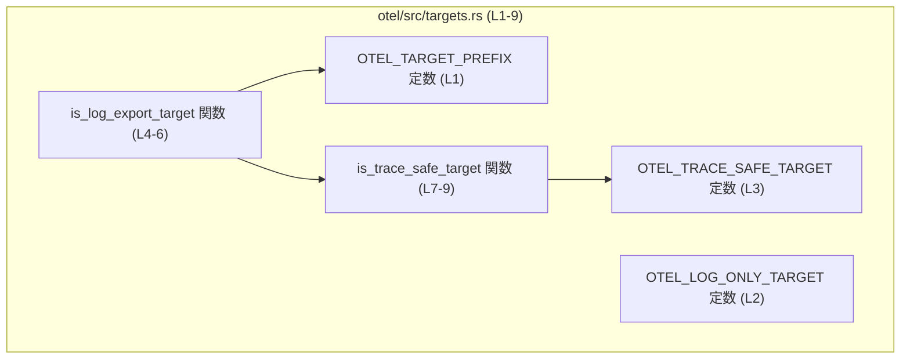
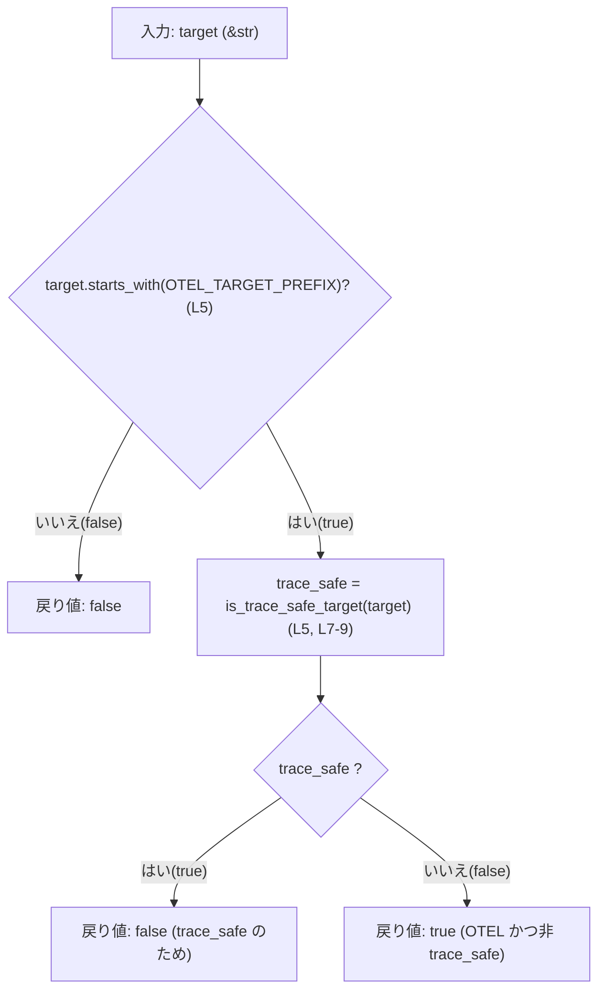
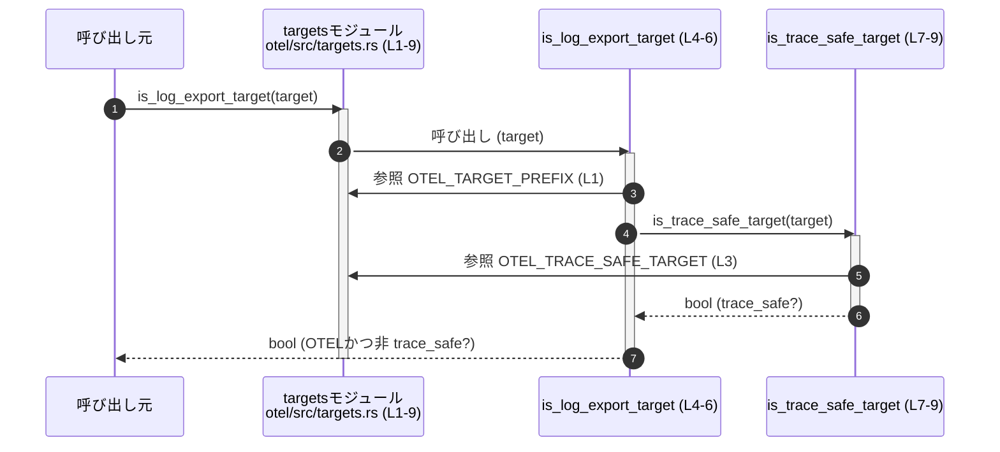

# otel/src/targets.rs コード解説

## 0. ざっくり一言

`otel/src/targets.rs` は、文字列で表現されたログ／トレースの「ターゲット名」が、特定の OpenTelemetry（と推測される）用プレフィックスや「trace_safe」カテゴリに属するかどうかを判定するユーティリティを提供するモジュールです（`otel/src/targets.rs:L1-9`）。

---

## 1. このモジュールの役割

### 1.1 概要

- このモジュールは、**ターゲット文字列のプレフィックスに基づいて分類する**ために存在し、  
  - OTEL 用ターゲットかどうか  
  - その中でも「trace_safe」かどうか  
  を判定する関数を提供します（`otel/src/targets.rs:L1-9`）。
- 命名からは、ログ出力先を OTEL 経由で扱う際のフィルタリングやルーティングに使われる判定ロジックであると想定されますが、コードだけでは用途の詳細は断定できません。

### 1.2 アーキテクチャ内での位置づけ

このファイル内での依存関係は次のとおりです。

- `is_log_export_target` は
  - `OTEL_TARGET_PREFIX` を直接参照し（`otel/src/targets.rs:L1, L5`）
  - さらに `is_trace_safe_target` を呼び出して結果を組み合わせます（`otel/src/targets.rs:L5-6`）。
- `is_trace_safe_target` は
  - `OTEL_TRACE_SAFE_TARGET` 定数を参照します（`otel/src/targets.rs:L3, L8`）。

これを Mermaid の依存関係図で表すと以下のようになります（この図は `otel/src/targets.rs` 全体 `L1-9` の関係を表します）。



※ `OTEL_LOG_ONLY_TARGET` はこのファイル内ではどの関数からも参照されていません（`otel/src/targets.rs:L2`）。

### 1.3 設計上のポイント

コードから読み取れる設計上の特徴は次のとおりです。

- **プレフィックスベースの判定**  
  - 判定はすべて `&str::starts_with` による文字列プレフィックス一致で行われます（`otel/src/targets.rs:L5, L8`）。
- **状態を持たない純粋関数**  
  - グローバルな可変状態は存在せず、関数は入力文字列から論理値を計算して返すだけです（`otel/src/targets.rs:L4-9`）。
  - そのためスレッドセーフであり、並行呼び出し時にも競合状態は発生しません。
- **エラーハンドリング不要な API**  
  - どの関数も `bool` を返すだけで、`Result` などのエラー型は使用していません（`otel/src/targets.rs:L4, L7`）。
  - 内部で panic を起こしうるコードは含まれていません（`starts_with` は有効な `&str` に対して panic しません）。
- **プレフィックスの定数化**  
  - 使用される文字列プレフィックスはすべて `const` として定義されており、複数箇所から共通利用できるように整理されています（`otel/src/targets.rs:L1-3`）。

---

## コンポーネントインベントリー（このチャンク）

このファイルに含まれる定数・関数の一覧です。行番号は LOC 情報に基づき、非空行を 1 から 9 として割り当てています。

| 名前                     | 種別   | 定義位置                           | 説明 |
|--------------------------|--------|------------------------------------|------|
| `OTEL_TARGET_PREFIX`     | 定数   | `otel/src/targets.rs:L1`           | OTEL ターゲット名のプレフィックス `"codex_otel"` を表す文字列定数。 |
| `OTEL_LOG_ONLY_TARGET`   | 定数   | `otel/src/targets.rs:L2`           | `"codex_otel.log_only"` を表す定数。用途はこのチャンクからは不明。 |
| `OTEL_TRACE_SAFE_TARGET` | 定数   | `otel/src/targets.rs:L3`           | `"codex_otel.trace_safe"` を表す定数。trace safe ターゲットのプレフィックスに使用。 |
| `is_log_export_target`   | 関数   | `otel/src/targets.rs:L4-6`         | ターゲットが OTEL 向けであり、かつ trace safe ではないかどうかを判定する関数。 |
| `is_trace_safe_target`   | 関数   | `otel/src/targets.rs:L7-9`         | ターゲットが trace safe プレフィックスを持つかどうかを判定する関数。 |

---

## 2. 主要な機能一覧

- OTEL ターゲットプレフィックス定義: `"codex_otel"` 系のターゲット名プレフィックスを定数として提供します（`otel/src/targets.rs:L1-3`）。
- trace safe ターゲット判定: ターゲット文字列が `"codex_otel.trace_safe"` で始まるかどうかを判定します（`is_trace_safe_target`、`otel/src/targets.rs:L7-9`）。
- OTEL ログエクスポート対象判定: ターゲット文字列が `"codex_otel"` で始まり、かつ trace safe ではない場合に `true` を返します（`is_log_export_target`、`otel/src/targets.rs:L4-6`）。

---

## 3. 公開 API と詳細解説

このファイルの要素はいずれも `pub(crate)` であり、クレート内部から利用される内部 API です（`otel/src/targets.rs:L1-9`）。

### 3.1 型一覧（構造体・列挙体など）

このファイルには構造体・列挙体などのユーザー定義型はありません。代わりに、公開されている定数を一覧として示します。

| 名前                     | 種別 | 役割 / 用途 |
|--------------------------|------|-------------|
| `OTEL_TARGET_PREFIX`     | 定数 | OTEL 用ターゲット名に共通するプレフィックス文字列。`is_log_export_target` の判定に使用されます（`otel/src/targets.rs:L1, L5`）。 |
| `OTEL_LOG_ONLY_TARGET`   | 定数 | `"codex_otel.log_only"` を表す文字列定数。このチャンク内では未使用であり、用途は他ファイル側にあると考えられます（`otel/src/targets.rs:L2`）。 |
| `OTEL_TRACE_SAFE_TARGET` | 定数 | `"codex_otel.trace_safe"` を表す文字列定数。`is_trace_safe_target` の判定に使用されます（`otel/src/targets.rs:L3, L8`）。 |

### 3.2 関数詳細

#### `is_log_export_target(target: &str) -> bool`

**概要**

- 引数のターゲット文字列が  
  1. `OTEL_TARGET_PREFIX`（`"codex_otel"`）で始まり（`starts_with`）、  
  2. `is_trace_safe_target` が `false` を返す（= trace safe プレフィックスで始まらない）  
  場合に `true` を返す関数です（`otel/src/targets.rs:L4-6`）。
- 命名からは「ログエクスポート対象となる OTEL ターゲットかどうか」を判定する用途が想定されますが、詳細な意味付けはこのチャンクからは分かりません。

**引数**

| 引数名  | 型    | 説明 |
|--------|-------|------|
| `target` | `&str` | 判定対象となるターゲット名文字列。呼び出し元が所有する UTF-8 文字列を参照で受け取ります（所有権は移動しません）。 |

**戻り値**

- 型: `bool`
- 意味:
  - `true`: `target` が `"codex_otel"` で始まり、かつ `"codex_otel.trace_safe"` で始まっていない場合（`otel/src/targets.rs:L5`）。
  - `false`: 上記以外のすべての場合。

**内部処理の流れ（アルゴリズム）**

`otel/src/targets.rs:L4-6` に基づき、処理は次のようになります。

1. `target.starts_with(OTEL_TARGET_PREFIX)` を評価し、`target` が `"codex_otel"` で始まるか確認します（`otel/src/targets.rs:L1, L5`）。
2. `is_trace_safe_target(target)` を呼び出して、`target` が trace safe プレフィックスで始まるかどうかを判定します（`otel/src/targets.rs:L5, L7-9`）。
3. ステップ 1 が `true` で、かつステップ 2 が `false` であれば `true` を返し、それ以外は `false` を返します（論理式 `A && !B`、`otel/src/targets.rs:L5`）。

これを簡単なフローチャートで示すと次のようになります（この図は `is_log_export_target (L4-6)` の処理を表します）。



**Examples（使用例）**

以下は代表的な判定例です。コンテキスト全体は不明なため、あくまで関数単体の挙動確認例です。

```rust
use crate::otel::targets::{is_log_export_target, OTEL_LOG_ONLY_TARGET, OTEL_TRACE_SAFE_TARGET}; // 仮のモジュールパス

fn main() {
    // OTEL プレフィックス + log_only のケース
    let t1 = OTEL_LOG_ONLY_TARGET;                    // "codex_otel.log_only"
    let r1 = is_log_export_target(t1);                // trace_safe ではない OTEL ターゲット
    assert!(r1);                                      // true になることが期待される

    // trace_safe のケース
    let t2 = OTEL_TRACE_SAFE_TARGET;                  // "codex_otel.trace_safe"
    let r2 = is_log_export_target(t2);                // trace_safe のため、ログエクスポート対象から除外されると解釈される
    assert!(!r2);                                     // false になる

    // OTEL プレフィックスを持たないケース
    let t3 = "other_target";
    let r3 = is_log_export_target(t3);                // プレフィックスが "codex_otel" ではない
    assert!(!r3);                                     // false になる
}
```

※ 実際のモジュールパスは本チャンクには現れないため、`use` 行は推測に基づく例です。

**Errors / Panics**

- **Errors**:
  - この関数は `Result` を返さず、エラーを表現しません。
- **Panics**:
  - 関数内では `starts_with` の呼び出し（`otel/src/targets.rs:L5`）のみを行っており、`&str` が常に有効な UTF-8 であるという Rust の保証のもとでは、通常の使用で panic は発生しません。
  - 従って、panic 条件はコードからは確認できません。

**Edge cases（エッジケース）**

- `target` が空文字列 `""` の場合:
  - `target.starts_with("codex_otel")` は `false` となるため、戻り値は `false` です。
- `target` が `"codex_otel"` より短い文字列で `"codex_o"` など、部分的に一致している場合:
  - `starts_with` は完全一致を要求するため、`false` となります。
- `target` が `"codex_otel.trace_safe_extra"` のように trace_safe プレフィックスの後に追加文字列を持つ場合:
  - `starts_with("codex_otel.trace_safe")` は `true` のため `is_trace_safe_target` は `true` を返します。
  - したがって `is_log_export_target` は `false` になります。
- `target` が `"codex_otelX"` のようにプレフィックスに似ているが異なる場合:
  - `starts_with("codex_otel")` は `false` のため、戻り値は `false` です。

**使用上の注意点**

- **前提条件**
  - `target` は有効な UTF-8 文字列（`&str`）である必要があります。これは Rust の型システムが保証します。
- **判定の意味はプレフィックスベース**
  - 判定は **完全一致ではなくプレフィックス一致** に基づきます（`otel/src/targets.rs:L5`）。
  - もし「完全なターゲット名の一致」を期待する場合は、この関数ではなく、別途 `==` などでの比較が必要です。
- **trace_safe の扱い**
  - trace_safe とみなされたターゲットは、`is_log_export_target` では常に `false` になります。
  - trace safe なものを別の経路で処理したい前提の設計である可能性がありますが、コードからは詳細は分かりません。
- **スレッド安全性**
  - 関数は読み取り専用の `&str` に対するプレフィックス判定のみを行い、共有可変状態を参照しないため、複数スレッドから同時に呼び出しても安全といえます。

---

#### `is_trace_safe_target(target: &str) -> bool`

**概要**

- 引数のターゲット文字列が `OTEL_TRACE_SAFE_TARGET`（`"codex_otel.trace_safe"`）で始まるかどうかを判定する関数です（`otel/src/targets.rs:L3, L7-9`）。
- 命名からは、「トレースに安全（trace safe）」と分類されるログ／ターゲットかどうかを識別する用途と考えられます。

**引数**

| 引数名  | 型    | 説明 |
|--------|-------|------|
| `target` | `&str` | 判定対象となるターゲット名文字列。呼び出し元が所有する UTF-8 文字列を参照で受け取ります。 |

**戻り値**

- 型: `bool`
- 意味:
  - `true`: `target` が `"codex_otel.trace_safe"` で始まる場合（`otel/src/targets.rs:L3, L8`）。
  - `false`: それ以外の場合。

**内部処理の流れ（アルゴリズム）**

`otel/src/targets.rs:L7-9` に基づく処理は非常に単純です。

1. `target.starts_with(OTEL_TRACE_SAFE_TARGET)` を評価します（`otel/src/targets.rs:L3, L8`）。
2. その結果（`true` または `false`）をそのまま戻り値として返します（`otel/src/targets.rs:L8-9`）。

**Examples（使用例）**

```rust
use crate::otel::targets::{is_trace_safe_target, OTEL_TRACE_SAFE_TARGET}; // モジュールパスは推測

fn main() {
    // 完全に trace_safe プレフィックスに一致するケース
    let t1 = OTEL_TRACE_SAFE_TARGET;         // "codex_otel.trace_safe"
    assert!(is_trace_safe_target(t1));       // true

    // プレフィックスに追加情報が付いているケース
    let t2 = "codex_otel.trace_safe.db";     // "trace_safe" に続き ".db" がある
    assert!(is_trace_safe_target(t2));       // プレフィックス一致なので true

    // OTEL だが trace_safe ではないケース
    let t3 = "codex_otel.log_only";
    assert!(!is_trace_safe_target(t3));      // false

    // 全く関係ないターゲット
    let t4 = "my_app::module";
    assert!(!is_trace_safe_target(t4));      // false
}
```

**Errors / Panics**

- **Errors**:
  - 戻り値は `bool` であり、エラー型は使用されません。
- **Panics**:
  - `starts_with` の利用のみで、通常の `&str` に対して panic は起こりません。
  - したがって、この関数内に明示的な panic の可能性は見当たりません（`otel/src/targets.rs:L8`）。

**Edge cases（エッジケース）**

- `target` が空文字列の場合:
  - `starts_with("codex_otel.trace_safe")` は `false` であり、戻り値は `false` です。
- `target` が `"codex_otel.trace_safe"` より短いが、先頭部分が一致するように見える文字列の場合:
  - `starts_with` は全長に渡る一致が必要なため、`false` となります。
- `target` が `"codex_otel.trace_safe_extra"` のように、プレフィックスの後に別の文字列が続く場合:
  - `starts_with("codex_otel.trace_safe")` は `true` となるため、戻り値は `true` です。
- Unicode 文字を含む場合:
  - `&str` は常に UTF-8 であり、`starts_with` はバイト境界ではなくコードポイント（正確には UTF-8 のバイト列）に対して安全に動作するため、特別な問題はありません。

**使用上の注意点**

- **プレフィックス一致であること**
  - 関数名から「trace safe ターゲットとの一致判定」と想像しがちですが、実際には「trace safe プレフィックスを持つか」の判定です（`otel/src/targets.rs:L3, L8`）。
- **完全一致の必要がある場合**
  - 完全一致を望む場合、`target == OTEL_TRACE_SAFE_TARGET` のような別の判定を組み合わせる必要があります。
- **スレッド安全性**
  - この関数も純粋な読み取り専用処理であり、どのスレッドから呼び出しても副作用はありません。

---

### 3.3 その他の関数

このファイルには補助的な関数やラッパー関数はありません。関数は `is_log_export_target` と `is_trace_safe_target` の 2 つだけです（`otel/src/targets.rs:L4-9`）。

---

## 4. データフロー

ここでは、代表的な利用シナリオとして「ターゲット名からログエクスポート対象かどうかを判定する」流れを示します。

1. 呼び出し元（例: ロガー設定コード）が、あるログイベントのターゲット名 `target` を持つ。
2. 呼び出し元が `is_log_export_target(target)` を呼び出す（`otel/src/targets.rs:L4-6`）。
3. `is_log_export_target` 内で
   - `target.starts_with(OTEL_TARGET_PREFIX)` による OTEL かどうかの判定を行い（`otel/src/targets.rs:L1, L5`）、
   - `is_trace_safe_target(target)` によって trace safe 判定を行います（`otel/src/targets.rs:L5, L7-9`）。
4. 得られた `bool` を用いて、ログを OTEL にエクスポートするかどうかを呼び出し元が決定します（呼び出し側ロジックはこのチャンクには現れません）。

この処理を Mermaid のシーケンス図で表現すると次のようになります（`is_log_export_target (L4-6)` と `is_trace_safe_target (L7-9)` の連携）。



---

## 5. 使い方（How to Use）

### 5.1 基本的な使用方法

典型的なフローは、「ターゲット文字列を受け取り、OTEL にエクスポートする対象かどうかを判定する」というものです。

```rust
// 仮のモジュール構造。実際のパスはこのチャンクからは不明です。
mod otel {
    pub mod targets {
        pub(crate) const OTEL_TARGET_PREFIX: &str = "codex_otel";
        pub(crate) const OTEL_LOG_ONLY_TARGET: &str = "codex_otel.log_only";
        pub(crate) const OTEL_TRACE_SAFE_TARGET: &str = "codex_otel.trace_safe";

        pub(crate) fn is_log_export_target(target: &str) -> bool {
            target.starts_with(OTEL_TARGET_PREFIX) && !is_trace_safe_target(target)
        }

        pub(crate) fn is_trace_safe_target(target: &str) -> bool {
            target.starts_with(OTEL_TRACE_SAFE_TARGET)
        }
    }
}

use otel::targets::{is_log_export_target, is_trace_safe_target};

fn main() {
    let target = "codex_otel.log_only";              // ログイベントのターゲット名だと想定

    if is_log_export_target(target) {                // OTEL かつ非 trace_safe か判定
        // ここで OTEL ログエクスポートを行う、などの処理を行う想定
        println!("OTEL ログエクスポート対象です: {target}");
    } else if is_trace_safe_target(target) {         // trace_safe の場合の分岐
        println!("trace_safe ターゲットです: {target}");
    } else {
        println!("OTEL 以外、または除外対象です: {target}");
    }
}
```

このような形で、呼び出し側のロジックを `is_log_export_target` と `is_trace_safe_target` の 2 段階判定に分割できます。

### 5.2 よくある使用パターン

1. **OTEL ログエクスポートフィルタ**

   「OTEL プレフィックスで始まり、trace_safe ではないものだけを OTEL エクスポート対象とする」パターンです。

   ```rust
   fn should_export_to_otel(target: &str) -> bool {
       // 直接 targets モジュールの関数をラップする例
       crate::otel::targets::is_log_export_target(target)
   }
   ```

2. **trace_safe 専用処理**

   trace safe なターゲットだけを別の処理系で扱うパターンです。

   ```rust
   fn handle_trace_safe(target: &str) {
       if crate::otel::targets::is_trace_safe_target(target) {
           // trace_safe 用の特別なロジック
           // 例: 詳細なトレースを外部システムに送らない 等
       }
   }
   ```

3. **ログ設定 UI やコンフィグでの補助**

   ユーザーが指定したターゲット名が OTEL 関連かどうかをチェックする用途が考えられます。

   ```rust
   fn validate_user_target_input(target: &str) -> bool {
       // OTEL プレフィックスが付いていれば OTEL 系とみなす
       target.starts_with(crate::otel::targets::OTEL_TARGET_PREFIX)
   }
   ```

### 5.3 よくある間違い

**誤用例 1: 完全一致だと思い込む**

```rust
// 誤り: 完全一致だと期待しているが、実際はプレフィックス一致のみ
if crate::otel::targets::is_trace_safe_target("codex_otel.trace_safe.extra") {
    // 「exact に 'codex_otel.trace_safe' のときだけ true」と誤解してしまう可能性
}
```

**正しい例: 完全一致を求める場合**

```rust
use crate::otel::targets::OTEL_TRACE_SAFE_TARGET;

let target = "codex_otel.trace_safe.extra";

// 完全一致を求める場合は明示的に == を使う
if target == OTEL_TRACE_SAFE_TARGET {
    // ここは "codex_otel.trace_safe" に完全一致した場合だけ通る
}
```

**誤用例 2: trace_safe の除外を忘れて OTEL として扱う**

```rust
// 誤り: OTEL プレフィックスのみでフィルタリングしてしまう
fn is_otel_target(target: &str) -> bool {
    target.starts_with(crate::otel::targets::OTEL_TARGET_PREFIX)
}
```

**正しい例: trace_safe を除外する場合**

```rust
fn is_otel_non_trace_safe_target(target: &str) -> bool {
    crate::otel::targets::is_log_export_target(target)  // trace_safe 除外のロジック込み
}
```

### 5.4 使用上の注意点（まとめ）

- 判定は **プレフィックス一致** であるため、サフィックスの違いは無視されます。
- `OTEL_LOG_ONLY_TARGET` はこのファイル内では使われていません。  
  実際の用途・意味は別ファイル側に依存するため、この定数を前提にしたロジックを組む場合は、利用箇所のコードを確認する必要があります（`otel/src/targets.rs:L2`）。
- 関数は純粋な文字列判定であり、パフォーマンス負荷は極めて小さいですが、
  - 非常に高頻度（例: ログイベントごと）で呼ぶ設計であっても問題になることは通常考えにくいレベルです。
- スレッド間で共有して呼び出しても安全です。共有可変状態は一切使用していません。

---

## 6. 変更の仕方（How to Modify）

### 6.1 新しい機能を追加する場合

たとえば新しいカテゴリ `"codex_otel.metric"` 向けの判定を追加する場合の考え方です。

1. **定数の追加**
   - `OTEL_TRACE_SAFE_TARGET` と同様に、新しいプレフィックスを `const` で追加します。

   ```rust
   pub(crate) const OTEL_METRIC_TARGET: &str = "codex_otel.metric"; // 追加
   ```

2. **判定関数の追加**
   - 既存の `is_trace_safe_target` と同じパターンで、プレフィックス判定用の関数を追加するのが自然です。

   ```rust
   pub(crate) fn is_metric_target(target: &str) -> bool {
       target.starts_with(OTEL_METRIC_TARGET)
   }
   ```

3. **既存関数との組み合わせ方を明確にする**
   - `is_log_export_target` にこの新しいカテゴリを含めるか除外するかは、仕様に応じてロジックを拡張する必要があります。
   - 変更前後で `is_log_export_target` の意味が変わらないよう（または変わるなら明示的に）設計上の意図をコメントなどで残すことが望ましいです。

### 6.2 既存の機能を変更する場合

1. **影響範囲の確認**
   - `is_log_export_target` と `is_trace_safe_target` は `pub(crate)` であるため、クレート内の他モジュールから利用されている可能性があります（呼び出し箇所はこのチャンクには現れません）。
   - 変更前に、クレート全体からこれらの関数使用箇所を検索して影響範囲を把握することが重要です。

2. **契約（前提条件・返り値の意味）の維持**
   - 現状の契約:
     - `is_log_export_target`: 「OTEL プレフィックス && 非 trace_safe」というブール条件に対応（`otel/src/targets.rs:L5`）。
     - `is_trace_safe_target`: 「trace_safe プレフィックス」というブール条件に対応（`otel/src/targets.rs:L8`）。
   - これらの意味が変わると、呼び出し側のロジックが意図しない挙動になる可能性があります。

3. **テストや使用箇所の再確認**
   - このファイルにはテストコードは含まれていません（`otel/src/targets.rs:L1-9`）。
   - 変更する場合は、呼び出し元のテストや、新規テストを追加して
     - 代表的なターゲット文字列
     - 境界的な文字列（trace_safe プレフィックスに似ているが異なるもの など）
     について挙動を確認することが推奨されます。

---

## 7. 関連ファイル

このチャンクには、他ファイルへの参照（`use` 文やモジュールパス）は現れません（`otel/src/targets.rs:L1-9`）。  
そのため、直接的に依存している他ファイルはコードからは特定できません。

想定しうる関連ファイル（あくまで推測であり、このチャンクからは断定できません）としては、以下のようなものがあります。

| パス | 役割 / 関係 |
|------|------------|
| 不明 | `is_log_export_target` / `is_trace_safe_target` を実際に呼び出しているロガー設定・OTEL エクスポート実装などが存在すると考えられますが、このチャンクには現れません。 |

---

### Bugs / Security / Contracts の観点（このファイルに関する補足）

- **Bugs（潜在的な誤用）**
  - 仕様上の前提が「完全一致」であるにもかかわらず、プレフィックス一致で実装している場合、意図しないターゲットが trace safe または OTEL と判定される可能性があります。ただし、仕様が提示されていないため、これはあくまで一般的な注意点です。
- **Security**
  - このファイルの処理は単なる文字列判定であり、外部入力を直接処理するとしても、バッファオーバーフローなどのメモリ安全性の問題は Rust の型システムにより避けられています。
  - ターゲット名に基づいて「ログをどこに出すか」を制御している場合、不適切なプレフィックス設計により、意図しないログルーティングが起こる可能性はありますが、それはこのファイル単体では判断できません。
- **Contracts / Edge Cases**
  - 「OTEL プレフィックス && 非 trace_safe」という契約と、「trace_safe プレフィックス」という契約は、呼び出し元の設計にとって重要な意味を持つ可能性があります。
  - 前述のエッジケース（空文字列・類似プレフィックスなど）の挙動は、仕様として明示しておくと誤用を防ぎやすくなります。

このファイルは非常に小さいですが、OTEL 関連のターゲット分類ロジックの中核的な一部になっていると考えられます。
