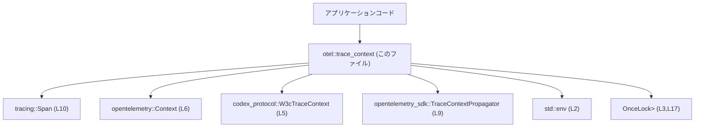
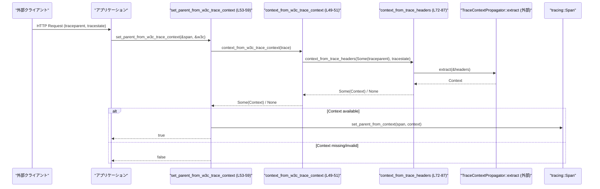

# otel/src/trace_context.rs コード解説

## 0. ざっくり一言

W3C Trace Context 形式（`traceparent` / `tracestate`）と OpenTelemetry / tracing の `Span` / `Context` の間を相互変換し、環境変数からの親トレース継承も行うユーティリティ群です（`trace_context.rs:L15-104`）。

---

## 1. このモジュールの役割

### 1.1 概要

- このモジュールは **W3C Trace Context ヘッダと OpenTelemetry コンテキストの橋渡し** を行います。
- 具体的には:
  - `tracing::Span` → `W3cTraceContext`（ヘッダ表現）への変換
  - `W3cTraceContext` / ヘッダ文字列 → `opentelemetry::Context` への復元
  - 環境変数 `TRACEPARENT` / `TRACESTATE` からのコンテキスト初期化
  - 既存 `Span` に親コンテキストを設定
  を提供します（`trace_context.rs:L19-70`）。

### 1.2 アーキテクチャ内での位置づけ

外部ライブラリとの依存関係を簡略化した図です。



- このモジュールは、アプリケーションコードからは「トレースコンテキストの入出力窓口」として扱われます。
- 低レベルなヘッダ形式や `TraceContextPropagator` の扱いは、このモジュールの内部に隠蔽されています（`trace_context.rs:L23-36,L72-87`）。

### 1.3 設計上のポイント

- **責務の分割**
  - 取得系（`current_span_*`）と変換系（`*_from_*`）と設定系（`set_parent_*`）が関数レベルで分離されています（`trace_context.rs:L19-70`）。
- **状態管理**
  - グローバルな状態は、環境変数由来の `Context` をキャッシュする `OnceLock<Option<Context>>` のみです（`trace_context.rs:L17,L66-70`）。
  - それ以外は基本的に関数呼び出しごとに完結する純粋関数的な構造です。
- **エラーハンドリング**
  - 不正な状態は主に `Option` で表現し、`None` によって「コンテキストなし」「無効」を示します（`trace_context.rs:L25-27,L42-44,L76,L84-86, L90-103`）。
  - パニックを起こすコードは本体には含まれず、テストのみで `unwrap` が使われています（`trace_context.rs:L135-137`）。
- **並行性**
  - `OnceLock` による初期化はスレッド安全であり、`traceparent_context_from_env` は並行呼び出しされても 1 回だけ初期化されます（`trace_context.rs:L17,L66-70`）。
  - 他に共有ミュータブル状態はありません。

---

## 2. 主要な機能一覧

- 現在の span を W3C Trace Context に変換: `current_span_w3c_trace_context` / `span_w3c_trace_context`
- 現在の span から 16 進文字列の trace ID を取得: `current_span_trace_id`
- W3C Trace Context 構造体から OpenTelemetry コンテキストを復元: `context_from_w3c_trace_context`
- W3C Trace Context を使って span に親コンテキストを設定: `set_parent_from_w3c_trace_context`
- 環境変数の `TRACEPARENT` / `TRACESTATE` からコンテキストを一度だけ読み込み・キャッシュ: `traceparent_context_from_env`
- 汎用の traceparent/tracestate ヘッダ文字列からコンテキストを生成: `context_from_trace_headers`（モジュール内コアロジック）
- テスト用: 各関数のエッジケース（無効な traceparent・欠損・現在 span の trace ID 形式）を検証（`tests` モジュール）

---

## 3. 公開 API と詳細解説

### 3.1 型一覧（構造体・列挙体など）

このファイル内で新しく定義される型はありません。

外部の主要型:

| 名前 | 種別 | 役割 / 用途 | 定義位置（このファイルから見える範囲） |
|------|------|-------------|----------------------------------------|
| `W3cTraceContext` | 構造体（外部クレート） | `traceparent` / `tracestate` を保持する W3C Trace Context 表現として使用されます。詳細なフィールド構造はこのチャンクには現れません。 | `trace_context.rs:L5,L32-35,L49-51,L53-59,L122-130,L150-157` |
| `Context` | 構造体（OpenTelemetry） | トレース情報を含む OpenTelemetry のコンテキスト。Span の親子関係を伝播するために使用されます。 | `trace_context.rs:L6,L17,L49-51,L62-63,L66-70,L72-87,L90-104` |
| `Span` | 構造体（tracing） | 現在の処理のトレース span。ここから OpenTelemetry コンテキストを取得したり、親コンテキストを設定します。 | `trace_context.rs:L10,L19-21,L23,L38-40,L53-56,L62-63,L168-169` |

### 3.1.1 コンポーネントインベントリー

このチャンクに含まれる定数・静的変数・関数の一覧です。

| 名前 | 種別 | 公開範囲 | 役割（1 行） | 定義位置 |
|------|------|----------|--------------|----------|
| `TRACEPARENT_ENV_VAR` | 定数 | private | 環境変数名 `"TRACEPARENT"` を保持 | `trace_context.rs:L15-15` |
| `TRACESTATE_ENV_VAR` | 定数 | private | 環境変数名 `"TRACESTATE"` を保持 | `trace_context.rs:L16-16` |
| `TRACEPARENT_CONTEXT` | static `OnceLock<Option<Context>>` | private | 環境変数から読み取った `Context` を一度だけキャッシュ | `trace_context.rs:L17-17` |
| `current_span_w3c_trace_context` | 関数 | `pub` | 現在の span を W3C Trace Context に変換するラッパー | `trace_context.rs:L19-21` |
| `span_w3c_trace_context` | 関数 | `pub` | 任意の span を W3C Trace Context に変換 | `trace_context.rs:L23-36` |
| `current_span_trace_id` | 関数 | `pub` | 現在の span から 16 進文字列の trace ID を取得 | `trace_context.rs:L38-47` |
| `context_from_w3c_trace_context` | 関数 | `pub` | `W3cTraceContext` から `Context` を復元 | `trace_context.rs:L49-51` |
| `set_parent_from_w3c_trace_context` | 関数 | `pub` | `W3cTraceContext` を元に span の親コンテキストを設定 | `trace_context.rs:L53-59` |
| `set_parent_from_context` | 関数 | `pub` | span に直接 `Context` を親として設定 | `trace_context.rs:L62-63` |
| `traceparent_context_from_env` | 関数 | `pub` | 環境変数 `TRACEPARENT`/`TRACESTATE` から親コンテキストを読み込み・キャッシュして返す | `trace_context.rs:L66-70` |
| `context_from_trace_headers` | 関数 | `pub(crate)` | `traceparent` / `tracestate` ヘッダ文字列から `Context` を生成 | `trace_context.rs:L72-87` |
| `load_traceparent_context` | 関数 | private | 実際に環境変数を読み込んで `Context` を構築するヘルパー | `trace_context.rs:L90-104` |
| `parses_valid_w3c_trace_context` | テスト関数 | `#[test]` | W3C Trace Context が正しく `Context` に復元されることを検証 | `trace_context.rs:L122-140` |
| `invalid_traceparent_returns_none` | テスト関数 | `#[test]` | 無効な traceparent で `None` が返ることを検証 | `trace_context.rs:L142-147` |
| `missing_traceparent_returns_none` | テスト関数 | `#[test]` | traceparent 欠損時に `None` が返ることを検証 | `trace_context.rs:L149-157` |
| `current_span_trace_id_returns_hex_trace_id` | テスト関数 | `#[test]` | `current_span_trace_id` のフォーマットを検証 | `trace_context.rs:L161-175` |

---

### 3.2 関数詳細（7 件）

#### `current_span_w3c_trace_context() -> Option<W3cTraceContext>`

**概要**

- 現在の `tracing::Span` から W3C Trace Context (`traceparent` / `tracestate`) を取得するための簡易関数です（`trace_context.rs:L19-21`）。
- 実装自体は `span_w3c_trace_context` への委譲です。

**定義位置**

- `trace_context.rs:L19-21`

**引数**

なし（内部で `Span::current()` を取得します）。

**戻り値**

- `Some(W3cTraceContext)`:
  - 現在の span が OpenTelemetry 的に「有効な」トレースコンテキストを持っている場合。
- `None`:
  - span が存在しない、もしくは span コンテキストが無効な場合（`span_w3c_trace_context` 内で判定）。

**内部処理の流れ**

1. `Span::current()` で現在の span を取得（`trace_context.rs:L20`）。
2. `span_w3c_trace_context` に参照として渡し、その結果をそのまま返却（`trace_context.rs:L20`）。

**Examples（使用例）**

```rust
use codex_protocol::protocol::W3cTraceContext;
use otel::trace_context::current_span_w3c_trace_context;
use tracing::info_span;

fn send_request_with_trace_context() {
    // tracing span を開始する                                     // アプリケーション側のトレース span
    let span = info_span!("send_request");
    let _enter = span.enter();                                     // このスコープ内で span を有効にする

    // 現在の span から W3C Trace Context を取得                   // traceparent / tracestate を取り出す
    if let Some(ctx) = current_span_w3c_trace_context() {          // Option なので None チェックが必要
        // ここで ctx.traceparent / ctx.tracestate を HTTP ヘッダに設定する等
        println!("traceparent header: {:?}", ctx.traceparent);
    }
}
```

**Errors / Panics**

- 本関数自体はエラー型を返さず、パニックも発生させません。
- 失敗は `None` で表現されます（`trace_context.rs:L23-27`）。

**Edge cases（エッジケース）**

- 現在の span が **存在しない** 場合
  - `Span::current()` は「空の span」を返しますが、そのコンテキストが `is_valid() == false` のため `None` になります（`trace_context.rs:L24-27`）。
- tracing が OpenTelemetry に接続されていない場合
  - span コンテキストが無効とみなされ、`None` となる可能性があります。

**使用上の注意点**

- 呼び出し前に `tracing` / `tracing_opentelemetry` レイヤが適切に初期化されている必要があります（テスト例の設定参照 `trace_context.rs:L162-166`）。
- `None` を許容しない呼び出し側では、代替処理（新規トレース開始など）を用意しておく必要があります。

---

#### `span_w3c_trace_context(span: &Span) -> Option<W3cTraceContext>`

**概要**

- 任意の `tracing::Span` から OpenTelemetry コンテキストを取得し、それを W3C Trace Context 形式にシリアライズします（`trace_context.rs:L23-36`）。

**定義位置**

- `trace_context.rs:L23-36`

**引数**

| 引数名 | 型 | 説明 |
|--------|----|------|
| `span` | `&Span` | コンテキストを抽出したい tracing の span 参照 |

**戻り値**

- `Some(W3cTraceContext)`:
  - span に有効なトレースコンテキストが紐づいている場合。
- `None`:
  - span が無効なコンテキストを持つ場合（例: まだトレーサーが設定されていない）。

**内部処理の流れ**

1. `span.context()` で OpenTelemetry の `Context` を取得（`trace_context.rs:L24`）。
2. `context.span().span_context().is_valid()` でコンテキストの有効性をチェック（`trace_context.rs:L25`）。
   - 無効なら `None` を返して終了（`trace_context.rs:L26-27`）。
3. `HashMap<String, String>` を生成（`trace_context.rs:L29`）。
4. `TraceContextPropagator::new().inject_context(&context, &mut headers)` により、`traceparent` / `tracestate` をヘッダ形式で書き出す（`trace_context.rs:L30`）。
5. ヘッダから `"traceparent"` / `"tracestate"` エントリを `remove` し、それを `W3cTraceContext` に入れて返す（`trace_context.rs:L32-35`）。

**Examples（使用例）**

```rust
use codex_protocol::protocol::W3cTraceContext;
use otel::trace_context::span_w3c_trace_context;
use tracing::info_span;

fn serialize_span(span: &tracing::Span) -> Option<W3cTraceContext> {
    // 渡された span から W3C Trace Context を生成する             // span が有効なトレースに紐づいている必要がある
    span_w3c_trace_context(span)
}

fn example() {
    let span = info_span!("my_span");
    let _enter = span.enter();

    if let Some(ctx) = serialize_span(&span) {
        // HTTP ヘッダに利用できる文字列が得られる
        println!("traceparent: {:?}", ctx.traceparent);
    }
}
```

**Errors / Panics**

- パニック要因はありません。
- `TraceContextPropagator::inject_context` 内部での挙動は外部ライブラリ依存ですが、このコードからはパニック条件は読み取れません。
- 無効な span の場合、必ず `None` を返します（`trace_context.rs:L25-27`）。

**Edge cases（エッジケース）**

- `tracestate` が存在しない場合
  - Propagator が `"tracestate"` を追加しない際は、`headers.remove("tracestate")` が `None` となり、そのまま `W3cTraceContext { tracestate: None }` になります（`trace_context.rs:L32-35`）。
- 既存トレースに紐づいていない span
  - `is_valid() == false` のため `None` が返ります。

**使用上の注意点**

- &Span 参照のため所有権の移動は発生せず、安全に呼び出し元で span を使い続けられます。
- トレースを外部に伝搬する前提で利用するため、`None` の場合に新規トレースを開始するかどうかは設計上の判断ポイントです。

---

#### `current_span_trace_id() -> Option<String>`

**概要**

- 現在の span の trace ID を 32 桁の 16 進文字列として取得します（`trace_context.rs:L38-47`）。
- テストで長さ・16 進性・ゼロ以外であることが検証されています（`trace_context.rs:L161-175`）。

**定義位置**

- `trace_context.rs:L38-47`

**引数**

なし。

**戻り値**

- `Some(String)`:
  - 有効な span コンテキストが存在する場合。テストより、32 桁の 16 進数文字列であることが期待されます（`trace_context.rs:L172-173`）。
- `None`:
  - span コンテキストが無効な場合。

**内部処理の流れ**

1. `Span::current().context()` で現在の span の `Context` を取得（`trace_context.rs:L39`）。
2. `context.span().span_context()` から `SpanContext` を取り出す（`trace_context.rs:L40-41`）。
3. `span_context.is_valid()` 判定で有効性を確認し、無効なら `None` を返す（`trace_context.rs:L42-44`）。
4. 有効な場合、`span_context.trace_id().to_string()` を `Some` で包んで返却（`trace_context.rs:L46`）。

**Examples（使用例）**

```rust
use otel::trace_context::current_span_trace_id;
use tracing::info_span;

fn log_trace_id() {
    let span = info_span!("process_request");
    let _entered = span.enter();                         // このスコープ内で current span が有効になる

    if let Some(trace_id) = current_span_trace_id() {
        // ログにトレース ID を出力して後から辿れるようにする
        println!("trace_id = {}", trace_id);
    }
}
```

**Errors / Panics**

- 本関数はパニックを起こしません。
- 失敗は `None` として扱われます。

**Edge cases（エッジケース）**

- tracing / OpenTelemetry の設定がない場合:
  - `Span::current()` のコンテキストが無効で `None` が返ります。
- テストでは、返される ID が
  - 長さ 32, 全て ASCII の 16 進文字, 全ゼロではないことを確認しており（`trace_context.rs:L172-174`）、これが想定される正常値です。

**使用上の注意点**

- 返される文字列のフォーマットそのものは OpenTelemetry 実装に依存しますが、上記のような前提で他システムと連携している可能性があります。
- ログ相関などに利用する際は `None` のケースを必ず考慮する必要があります。

---

#### `context_from_w3c_trace_context(trace: &W3cTraceContext) -> Option<Context>`

**概要**

- `W3cTraceContext` 構造体（W3C ヘッダのラッパー）から OpenTelemetry の `Context` を復元します（`trace_context.rs:L49-51`）。

**定義位置**

- `trace_context.rs:L49-51`

**引数**

| 引数名 | 型 | 説明 |
|--------|----|------|
| `trace` | `&W3cTraceContext` | `traceparent` / `tracestate` を保持する構造体の参照 |

**戻り値**

- `Some(Context)`:
  - ヘッダから有効なトレースコンテキストが復元できた場合。
- `None`:
  - `traceparent` が欠損している、または無効である場合。

**内部処理の流れ**

1. `trace.traceparent.as_deref()` / `trace.tracestate.as_deref()` によって `Option<&str>` に変換（`trace_context.rs:L50`）。
2. `context_from_trace_headers(...)` に処理を委譲し、その結果をそのまま返却（`trace_context.rs:L50`）。

**Examples（使用例）**

```rust
use codex_protocol::protocol::W3cTraceContext;
use otel::trace_context::context_from_w3c_trace_context;

fn from_incoming_headers(
    traceparent: Option<String>,
    tracestate: Option<String>,
) -> Option<opentelemetry::Context> {
    // 外部から受け取ったヘッダ値を W3cTraceContext に詰める         // HTTP 層などから渡される文字列をラップ
    let w3c = W3cTraceContext {
        traceparent,
        tracestate,
    };

    // OpenTelemetry の Context に変換する
    context_from_w3c_trace_context(&w3c)
}
```

**Errors / Panics**

- パニック要因はありません。
- 不正なヘッダは `context_from_trace_headers` 側で検出され、`None` に変換されます（`trace_context.rs:L72-87`）。

**Edge cases（エッジケース）**

- `trace.traceparent == None`:
  - `context_from_trace_headers(None, ..)` となり、`None` を返します（テスト `missing_traceparent_returns_none` 参照 `trace_context.rs:L149-157`）。
- `traceparent` が無効な文字列:
  - 最終的に無効コンテキストと判定され `None` になります（`trace_context.rs:L84-86`、テスト `invalid_traceparent_returns_none`）。

**使用上の注意点**

- W3C Trace Context の仕様上、`traceparent` は必須ヘッダであるため、呼び出し側で `traceparent` が `None` の場合は新規トレース開始等のフォールバック戦略が必要になります。

---

#### `set_parent_from_w3c_trace_context(span: &Span, trace: &W3cTraceContext) -> bool`

**概要**

- W3C Trace Context を解釈して `Context` を生成し、指定された `span` に親コンテキストとして設定します（`trace_context.rs:L53-59`）。
- 親設定の成否を `bool` で返します。

**定義位置**

- `trace_context.rs:L53-59`

**引数**

| 引数名 | 型 | 説明 |
|--------|----|------|
| `span` | `&Span` | 親コンテキストを設定したい tracing span |
| `trace` | `&W3cTraceContext` | 外部から受け取ったトレースコンテキスト |

**戻り値**

- `true`:
  - コンテキスト生成に成功し、`set_parent_from_context` が呼び出された場合。
- `false`:
  - `context_from_w3c_trace_context` が `None` を返した場合（無効・不足など）。

**内部処理の流れ**

1. `context_from_w3c_trace_context(trace)` を呼び出して `Option<Context>` を取得（`trace_context.rs:L54`）。
2. `Some(context)` の場合:
   - `set_parent_from_context(span, context)` を呼び出し（`trace_context.rs:L55`）。
   - `true` を返す（`trace_context.rs:L56`）。
3. `None` の場合:
   - 何もせず `false` を返す（`trace_context.rs:L57-58`）。

**Examples（使用例）**

```rust
use codex_protocol::protocol::W3cTraceContext;
use otel::trace_context::set_parent_from_w3c_trace_context;
use tracing::info_span;

fn handle_incoming_request(headers: &std::collections::HashMap<String, String>) {
    // HTTP ヘッダから W3cTraceContext を構築する                   // 実際には header 名に応じた取り出しが必要
    let w3c = W3cTraceContext {
        traceparent: headers.get("traceparent").cloned(),
        tracestate: headers.get("tracestate").cloned(),
    };

    let span = info_span!("handle_request");
    let _enter = span.enter();

    let attached = set_parent_from_w3c_trace_context(&span, &w3c);
    if !attached {
        // 親トレースが不明な場合の処理（新規トレース開始として扱う等）
        println!("could not attach parent trace context");
    }
}
```

**Errors / Panics**

- パニック要因はありません。
- `Span::set_parent` のエラーは無視されており（戻り値を `_` に束縛するだけ）、この関数からは観測できません（`trace_context.rs:L62-63`）。

**Edge cases（エッジケース）**

- `trace.traceparent == None` または無効:
  - `context_from_w3c_trace_context` が `None` を返し、`set_parent_from_context` は呼び出されません。
- すでに親が設定された span に対して呼び出す場合:
  - `set_parent` がどのように振る舞うかは `tracing-opentelemetry` の仕様に依存し、このチャンクからは分かりません。

**使用上の注意点**

- 親設定の成否は `bool` で返るため、呼び出し側で明示的に確認できる一方、`Span::set_parent` 自体の失敗は検出できません。
- 並行性の観点では、`&Span` と `Context` はいずれもスレッド安全に設計されていますが、同一 span に対して複数スレッドから親を設定するような利用は避ける方が安全です（競合する意味があるか不明）。

---

#### `traceparent_context_from_env() -> Option<Context>`

**概要**

- 環境変数 `TRACEPARENT` / `TRACESTATE` を読み込み、そこから親コンテキストを構築して返します（`trace_context.rs:L66-70`）。
- `OnceLock` により、一度だけ読み込んで結果をキャッシュします。

**定義位置**

- `trace_context.rs:L66-70`

**引数**

なし。

**戻り値**

- `Some(Context)`:
  - 環境変数に有効な `TRACEPARENT` が設定されており、パースに成功した場合。
- `None`:
  - `TRACEPARENT` が未設定、もしくは無効な場合（ログに `warn` が出力されます: `trace_context.rs:L100`）。

**内部処理の流れ**

1. `TRACEPARENT_CONTEXT.get_or_init(load_traceparent_context)` を呼び出し、`OnceLock` に値がなければ `load_traceparent_context` で初期化（`trace_context.rs:L66-68`）。
2. `OnceLock` 内部の `Option<Context>` を `clone()` して返す（`trace_context.rs:L69`）。

**Examples（使用例）**

```rust
use otel::trace_context::traceparent_context_from_env;
use tracing::info_span;

fn main() {
    // 事前に OS の環境変数 TRACEPARENT / TRACESTATE が設定されていると想定
    if let Some(parent) = traceparent_context_from_env() {
        let span = info_span!("startup");
        let _enter = span.enter();

        // 親コンテキストを明示的に設定する                            // 実際には set_parent_from_context を併用
        let _ = span.set_parent(parent);
    } else {
        // 親トレースがない状態で開始
    }
}
```

**Errors / Panics**

- `get_or_init` / `load_traceparent_context` はパニック条件を持ちません。
- `env::var` からのエラーは `ok()?` により `None` に変換されます（`trace_context.rs:L91`）。

**Edge cases（エッジケース）**

- `TRACEPARENT` 未設定:
  - `env::var(...).ok()?` で `None` が返り、`TRACEPARENT_CONTEXT` には `None` が格納されます（`trace_context.rs:L90-92`）。
- `TRACEPARENT` はあるが無効:
  - `load_traceparent_context` 内の `context_from_trace_headers` が `None` を返し、`warn!` ログ後に `None` をキャッシュします（`trace_context.rs:L94-103`）。
- `TRACEPARENT` が変更されても:
  - 一度 `OnceLock` が初期化されると再読み込みされません。プロセス動作中に環境変数を変更しても再反映されないことに注意が必要です。

**使用上の注意点**

- この関数はプロセス起動直後に一度だけ呼び出す想定が自然です。中途で環境変数を変更しても反映されません。
- 並行性面では `OnceLock` が同期を行うため、同時に複数スレッドから呼び出しても安全です。

---

#### `context_from_trace_headers(traceparent: Option<&str>, tracestate: Option<&str>) -> Option<Context>`

**概要**

- `traceparent` / `tracestate` ヘッダ文字列から OpenTelemetry の `Context` を構築するコアロジックです（`trace_context.rs:L72-87`）。
- `pub(crate)` で、同クレート内から再利用されることを想定しています。

**定義位置**

- `trace_context.rs:L72-87`

**引数**

| 引数名 | 型 | 説明 |
|--------|----|------|
| `traceparent` | `Option<&str>` | W3C Trace Context の必須ヘッダ `traceparent` の文字列 |
| `tracestate` | `Option<&str>` | 任意ヘッダ `tracestate` の文字列 |

**戻り値**

- `Some(Context)`:
  - ヘッダ値がパースされ、かつ有効な span コンテキストを含む場合。
- `None`:
  - `traceparent` が `None` の場合、またはパース結果の span コンテキストが無効な場合。

**内部処理の流れ**

1. `let traceparent = traceparent?;` により、`traceparent` が `None` なら即座に `None` を返す（`trace_context.rs:L76`）。
2. `HashMap<String, String>` を作成し、`"traceparent"` キーに値を挿入（`trace_context.rs:L77-78`）。
3. `tracestate` が `Some` なら `"tracestate"` キーに値を挿入（`trace_context.rs:L79-80`）。
4. `TraceContextPropagator::new().extract(&headers)` を呼び出し、ヘッダから `Context` を復元（`trace_context.rs:L83`）。
5. `context.span().span_context().is_valid()` で有効性をチェックし、無効なら `None` を返す（`trace_context.rs:L84-86`）。
6. 有効であれば `Some(context)` を返却（`trace_context.rs:L87`）。

**Examples（使用例）**

```rust
use otel::trace_context::context_from_trace_headers;

fn from_http_headers(
    traceparent: Option<&str>,
    tracestate: Option<&str>,
) -> Option<opentelemetry::Context> {
    // HTTP ヘッダから取り出した値をそのまま渡す                     // None の場合はヘッダ欠損を表す
    context_from_trace_headers(traceparent, tracestate)
}
```

**Errors / Panics**

- パニックはありません。
- ヘッダのパースエラーやフォーマット不備は `TraceContextPropagator::extract` 内で処理され、本関数では `is_valid()` による判定で一律 `None` に変換されます（`trace_context.rs:L83-86`）。

**Edge cases（エッジケース）**

- `traceparent == None`:
  - 早期に `None` が返ります（`trace_context.rs:L76`、テスト `missing_traceparent_returns_none`）。
- `traceparent` が W3C 仕様に沿わない文字列:
  - `extract` がコンテキストを復元できず、`is_valid() == false` となります（`trace_context.rs:L83-86`、テスト `invalid_traceparent_returns_none`）。
- `tracestate == None`:
  - `tracestate` なしの環境として処理され、問題なく `Context` が返り得ます。

**使用上の注意点**

- ヘッダ名（`"traceparent"`, `"tracestate"`）はこの関数内部で固定されているため、呼び出し側は HTTP 層などで適切なヘッダ名から値を取り出して渡す必要があります。
- ヘッダ値の大小文字・空白処理などは `TraceContextPropagator` に依存し、このチャンクには現れません。

---

### 3.3 その他の関数

| 関数名 | 公開範囲 | 役割（1 行） | 定義位置 |
|--------|----------|--------------|----------|
| `set_parent_from_context(span: &Span, context: Context)` | `pub` | 取得済みの `Context` を span の親として設定するシンプルなラッパー | `trace_context.rs:L62-63` |
| `load_traceparent_context() -> Option<Context>` | private | 実際に環境変数を読み込み、`context_from_trace_headers` を用いて `Context` に変換し、ログを出し分けるヘルパー | `trace_context.rs:L90-104` |
| `current_span_w3c_trace_context()` | `pub` | 上述の通り、`span_w3c_trace_context` のラッパー。テストコードはありませんが単純委譲です。 | `trace_context.rs:L19-21` |

---

## 4. データフロー

### 4.1 代表的シナリオ: 受信ヘッダから span に親コンテキストを設定

HTTP リクエストで受け取った `traceparent` / `tracestate` を利用して、アプリケーション側の span の親トレースを継続する流れを示します。



この図は、本チャンクに含まれる以下のコード範囲に対応します:

- `set_parent_from_w3c_trace_context`: `trace_context.rs:L53-59`
- `context_from_w3c_trace_context`: `trace_context.rs:L49-51`
- `context_from_trace_headers`: `trace_context.rs:L72-87`

処理の要点:

- W3C 形式のコンテキストは一度 `W3cTraceContext` としてラップされ、このモジュール内でヘッダマップ → `Context` に変換されます。
- span への親設定は `Span::set_parent` 経由で行われますが、エラーは無視されており、成否はヘッダのパース可否にのみ依存します。

---

## 5. 使い方（How to Use）

### 5.1 基本的な使用方法

典型的なフロー（HTTP サーバでのトレース継続）をまとめます。

```rust
use std::collections::HashMap;
use codex_protocol::protocol::W3cTraceContext;
use otel::trace_context::{
    set_parent_from_w3c_trace_context,
    current_span_w3c_trace_id,
};
use tracing::{info_span, info};
use tracing_subscriber::layer::SubscriberExt;
use tracing_subscriber::util::SubscriberInitExt;
use opentelemetry_sdk::trace::SdkTracerProvider;

fn init_tracing() {
    // OpenTelemetry トレーサーを初期化する                         // 簡略化のため詳細は省略
    let provider = SdkTracerProvider::builder().build();
    let tracer = provider.tracer("example");
    let subscriber = tracing_subscriber::registry()
        .with(tracing_opentelemetry::layer().with_tracer(tracer));
    let _guard = subscriber.set_default();                          // グローバルに設定
}

fn handle_request(headers: &HashMap<String, String>) {
    let span = info_span!("handle_request");
    let _entered = span.enter();

    // 1. ヘッダから W3cTraceContext を構築
    let w3c = W3cTraceContext {
        traceparent: headers.get("traceparent").cloned(),
        tracestate: headers.get("tracestate").cloned(),
    };

    // 2. 親コンテキストを span に設定
    let attached = set_parent_from_w3c_trace_context(&span, &w3c);
    info!(attached, "parent attached");

    // 3. 現在の trace_id をログ出力
    if let Some(trace_id) = current_span_trace_id() {
        info!(%trace_id, "processing request");
    }
}
```

### 5.2 よくある使用パターン

1. **送信側: span → W3C Trace Context**

   - `span_w3c_trace_context` または `current_span_w3c_trace_context` を使い、外向きの HTTP やメッセージにヘッダを付与します。

2. **受信側: W3C Trace Context → span の親**

   - ヘッダを `W3cTraceContext` に詰めて `set_parent_from_w3c_trace_context` に渡し、トレースを継続します。

3. **バッチ/CLI: 環境変数による親トレース継続**

   - 外部から `TRACEPARENT` を渡しておき、`traceparent_context_from_env` で読み込んでメイン処理の span に親を設定します。

### 5.3 よくある間違い

```rust
// 間違い例: traceparent ヘッダが必須であることを考慮していない
let w3c = W3cTraceContext {
    traceparent: None,                            // traceparent を設定していない
    tracestate: Some("vendor=value".into()),
};
let span = info_span!("handle_request");
let _entered = span.enter();
let attached = set_parent_from_w3c_trace_context(&span, &w3c);
// attached は false となり、親トレースは継続されない

// 正しい例: traceparent を必須として扱い、欠損時のフォールバックを用意する
let w3c = W3cTraceContext {
    traceparent: headers.get("traceparent").cloned(),
    tracestate: headers.get("tracestate").cloned(),
};
let attached = set_parent_from_w3c_trace_context(&span, &w3c);
if !attached {
    // ここで「新規トレースとして扱う」などの明示的な方針をとる
}
```

### 5.4 使用上の注意点（まとめ）

- **前提条件**
  - `tracing` と `tracing-opentelemetry` のセットアップが済んでいること（テストの初期化コード参照 `trace_context.rs:L161-166`）。
  - W3C Trace Context の最低限の仕様 (`traceparent` 必須) を守ったヘッダが入力として渡されていること。
- **エラー処理**
  - 本モジュールはエラーを `Option` / `bool` で返し、ログ以外で詳細な理由は提供しません。
  - `None` / `false` の扱いを呼び出し側で統一する必要があります。
- **並行性**
  - `traceparent_context_from_env` は `OnceLock` による一回限りの初期化であり、環境変数の動的変更は反映されません。
- **セキュリティ**
  - 外部から受け取るヘッダ値がそのままトレースに反映されるため、不正な値によりトレース ID が予期せず変えられる可能性があります。
    - ただし、本モジュールは `is_valid()` による最低限の検証を行っており（`trace_context.rs:L84-86`）、完全に任意文字列を許容するわけではありません。

---

## 6. 変更の仕方（How to Modify）

### 6.1 新しい機能を追加する場合

例: B3 ヘッダ（`x-b3-traceid` 等）にも対応したい場合。

1. **ヘッダ解析ロジックの追加**
   - `context_from_trace_headers` の構造に倣い、別のヘッダ形式から `Context` を生成する関数を新規に追加します。
2. **公開 API の追加**
   - 既存の `context_from_w3c_trace_context` と同様のラッパー関数を追加し、`W3cTraceContext` に相当するデータ構造を定義します（このファイルには現れません）。
3. **親設定の統合**
   - `set_parent_from_w3c_trace_context` に倣って、新形式向けの `set_parent_from_*` 関数を用意します。
4. **テスト**
   - 現在のテストモジュールのように、正常系と「無効ヘッダ」「欠損ヘッダ」の 2 パターンを最低限追加するのが一貫したスタイルです（`trace_context.rs:L122-158`）。

### 6.2 既存の機能を変更する場合

- **影響範囲の確認**
  - `context_from_trace_headers` とそれを呼び出す `context_from_w3c_trace_context` / `load_traceparent_context` / テストを確認します（`trace_context.rs:L49-51,L72-87,L90-104,L122-147`）。
- **契約の維持**
  - `traceparent` が欠損 ⇒ `None` を返す、という契約はテストで固定されています（`missing_traceparent_returns_none`）。
  - 無効な `traceparent` で `None` を返すこともテストで固定されています（`invalid_traceparent_returns_none`）。
- **テストの更新**
  - 戻り値の仕様を変える場合は、該当テストを更新・追加する必要があります。
- **ログの扱い**
  - 環境変数の読み込み失敗時のログ文言 (`debug!` / `warn!`) を変更する場合、運用上のログ解析に影響しうるため注意が必要です（`trace_context.rs:L96-101`）。

---

## 7. 関連ファイル

このモジュールと密接に関連する外部ファイル・クレート（実際の定義はこのチャンクには現れません）:

| パス / クレート | 役割 / 関係 |
|-----------------|------------|
| `codex_protocol::protocol::W3cTraceContext` | W3C Trace Context を表現する構造体。ヘッダ文字列を保持し、このモジュールの主要な入出力の一つとなります（`trace_context.rs:L5,L32-35,L49-51`）。 |
| `opentelemetry` / `opentelemetry_sdk` | `Context`, `TraceContextPropagator` などを提供し、W3C Trace Context と内部トレース表現の橋渡しを行います（`trace_context.rs:L6-9,L72-87`）。 |
| `tracing`, `tracing_opentelemetry` | アプリケーションコードが利用する `Span` と OpenTelemetry との連携レイヤ。`Span::current` から `Context` を取得するために使われます（`trace_context.rs:L10,L13,L19-25`）。 |
| `tests` モジュール（このファイル内） | 本モジュールの公開 API の一部 (`context_from_w3c_trace_context`, `context_from_trace_headers`, `current_span_trace_id`) の契約を検証するテストを含みます（`trace_context.rs:L106-175`）。 |

このチャンクに現れない他ファイル（例えばトレーサーやアプリケーション本体）は不明です。
