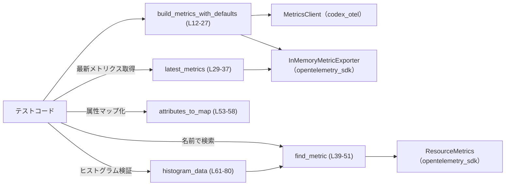
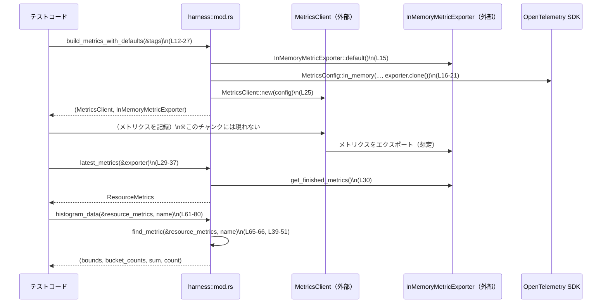

# otel/tests/harness/mod.rs コード解説

## 0. ざっくり一言

OpenTelemetry ベースのメトリクスをテストするために、`MetricsClient` と in‑memory エクスポータの構築・取得・検索・変換を行う補助関数をまとめたテスト用ハーネスモジュールです（`otel/tests/harness/mod.rs` 全体）。

---

## 1. このモジュールの役割

### 1.1 概要

このモジュールは **OpenTelemetry メトリクスのテスト** を行う際の共通処理を提供します。

- in‑memory エクスポータ付きの `MetricsClient` を、テスト用デフォルト設定で構築する（`build_metrics_with_defaults`、`L12-L27`）。
- エクスポータに蓄積されたメトリクスから、最新の `ResourceMetrics` を取得する（`latest_metrics`、`L29-L37`）。
- `ResourceMetrics` の中から特定の名前のメトリクスを検索する（`find_metric`、`L39-L51`）。
- 属性（`KeyValue`）のイテレータを `BTreeMap<String, String>` に変換する（`attributes_to_map`、`L53-L58`）。
- 特定ヒストグラムメトリクスのバケット境界・カウント・合計値・サンプル数を抽出する（`histogram_data`、`L61-L80`）。

### 1.2 アーキテクチャ内での位置づけ

このモジュールは、`codex_otel` クレートのテストコードから利用されることを前提とした **テスト専用ハーネス** です。

- 外部依存:
  - `codex_otel::{MetricsClient, MetricsConfig, Result}`（`L1-L3`）
  - `opentelemetry::KeyValue`（`L4`）
  - `opentelemetry_sdk::metrics::{InMemoryMetricExporter, data::*}`（`L5-L9`）
  - 標準ライブラリ `std::collections::BTreeMap`（`L10`）
- 主なデータフロー（テスト視点）:
  1. テストが `build_metrics_with_defaults` で `MetricsClient` と `InMemoryMetricExporter` を取得。
  2. テスト対象コードが `MetricsClient` を通じてメトリクスを記録し、`InMemoryMetricExporter` にエクスポートされる（このチャンクには記録処理は現れません）。
  3. テストが `latest_metrics` で最新の `ResourceMetrics` を取り出し、`find_metric` / `histogram_data` / `attributes_to_map` で検証する。

依存関係の概略を以下の Mermaid 図に示します。



### 1.3 設計上のポイント

- **完全に関数型（状態を持たない）**
  - すべての関数は `pub(crate) fn` であり、内部に長期的な状態を保持しません（`L12`, `L29`, `L39`, `L53`, `L61`）。
- **テスト前提のエラーハンドリング**
  - 構成構築時は `Result` と `?` でエラーを伝播（`build_metrics_with_defaults`、`L23`, `L25`）。
  - メトリクスが存在しない・型が違う等のテスト失敗条件は `panic!` や `assert_eq!` で即時失敗させる（`latest_metrics` の `panic!` `L31-L35`、`histogram_data` の `panic!`/`assert_eq!` `L66-L79`）。
- **Rust の安全性**
  - `unsafe` ブロックは存在せず、標準的な所有権・借用の仕組みだけで実装されています（ファイル全体）。
- **並行性**
  - このモジュール内にはスレッド生成や async/await は登場せず、明示的な並行処理は行っていません（ファイル全体）。
  - `InMemoryMetricExporter` のスレッドセーフ性などは、このチャンクからは分かりません。
- **OpenTelemetry SDK データモデルをそのまま扱う**
  - `ResourceMetrics` → `scope_metrics()` → `metrics()` → `Metric.data()` → `MetricData::Histogram` という SDK の構造を前提にして処理しています（`L39-L51`, `L67-L75`）。

---

## 2. 主要な機能一覧（コンポーネントインベントリー付き）

まず、このモジュール内の関数コンポーネント一覧です。

| 名前 | 種別 | 役割 / 用途 | 行範囲(根拠) |
|------|------|-------------|--------------|
| `build_metrics_with_defaults` | 関数 | テスト用に、デフォルト設定とタグ付きの `MetricsClient` と `InMemoryMetricExporter` を一緒に構築する | `otel/tests/harness/mod.rs:L12-L27` |
| `latest_metrics` | 関数 | in‑memory エクスポータからエラーなく出力された最後の `ResourceMetrics` を取り出す。無い場合は `panic!` | `otel/tests/harness/mod.rs:L29-L37` |
| `find_metric` | 関数 | `ResourceMetrics` から名前一致する `Metric` を探索し、見つかれば参照を返す | `otel/tests/harness/mod.rs:L39-L51` |
| `attributes_to_map` | 関数 | `&KeyValue` のイテレータを `BTreeMap<String, String>` に変換して、属性を扱いやすい形にする | `otel/tests/harness/mod.rs:L53-L58` |
| `histogram_data` | 関数 | 特定メトリクス名の F64 ヒストグラムから、バケット境界・カウント・合計値・サンプル数を抽出する。型が違うなどの場合 `panic!` | `otel/tests/harness/mod.rs:L61-L80` |

このコンポーネントを通して提供される主な機能は次のとおりです。

- メトリクス送出環境の簡易構築（`build_metrics_with_defaults`）。
- in‑memory エクスポータに蓄積されたメトリクスの取得（`latest_metrics`）。
- メトリクス集合からの名前ベースの検索（`find_metric`）。
- 属性集合の文字列マップ化（`attributes_to_map`）。
- ヒストグラムメトリクスから統計値の抽出（`histogram_data`）。

---

## 3. 公開 API と詳細解説

### 3.1 型一覧（このモジュールで利用する主要な外部型）

このモジュール内で新たに定義される型はありません。代わりに、外部クレートの型を多用しています。

| 名前 | 種別 | 定義元 | 役割 / 用途 | 使用箇所(行範囲) |
|------|------|--------|-------------|------------------|
| `MetricsClient` | 構造体（と推定） | `codex_otel` | メトリクスを発行するクライアント。ここではテスト用に構築されるのみ | `otel/tests/harness/mod.rs:L1`, `L25`, `L61`（戻り値型） |
| `MetricsConfig` | 構造体（と推定） | `codex_otel` | メトリクスクライアントの設定。in‑memory エクスポータ用設定やタグを保持 | `otel/tests/harness/mod.rs:L2`, `L16-L23` |
| `Result<T>` | 型エイリアス（と推定） | `codex_otel` | `build_metrics_with_defaults` の戻り値で利用されるエラーラップ型 | `otel/tests/harness/mod.rs:L3`, `L14` |
| `InMemoryMetricExporter` | 構造体 | `opentelemetry_sdk::metrics` | メトリクスをメモリ上のバッファにエクスポートするテスト向けエクスポータ | `otel/tests/harness/mod.rs:L5`, `L14-L21`, `L29-L37` |
| `ResourceMetrics` | 構造体 | `opentelemetry_sdk::metrics::data` | あるリソースに紐づくメトリクス群を表す | `otel/tests/harness/mod.rs:L9`, `L29`, `L39`, `L61-63` |
| `Metric` | 構造体 | 同上 | 具体的な 1 つのメトリクス（カウンタ、ヒストグラム等）を表す | `otel/tests/harness/mod.rs:L7`, `L39-L51`, `L65-L71` |
| `AggregatedMetrics` | 列挙体 | 同上 | メトリクスの集約結果の型（F64 など）を表す | `otel/tests/harness/mod.rs:L6`, `L67-L68` |
| `MetricData` | 列挙体 | 同上 | メトリクスの具体的なデータ型（ヒストグラム等）を識別 | `otel/tests/harness/mod.rs:L8`, `L69-L75` |
| `KeyValue` | 構造体 | `opentelemetry` | 属性のキーと値のペア | `otel/tests/harness/mod.rs:L4`, `L53-L58` |
| `BTreeMap` | 構造体 | `std::collections` | キーでソートされるマップ。属性をキー順に保持する | `otel/tests/harness/mod.rs:L10`, `L53-L58` |

※ これら外部型の内部構造やメソッドの詳細は、このチャンクには現れません。

---

### 3.2 関数詳細

以下では、5 つの関数すべてについて詳細を記述します。

#### `build_metrics_with_defaults(default_tags: &[(&str, &str)]) -> Result<(MetricsClient, InMemoryMetricExporter)>`

**概要**

テスト用に in‑memory エクスポータを利用する `MetricsClient` を構築し、同時にそのエクスポータも返します。指定されたタグを `MetricsConfig` に追加してからクライアントを生成します（`L12-L27`）。

**引数**

| 引数名 | 型 | 説明 |
|--------|----|------|
| `default_tags` | `&[(&str, &str)]` | `(キー, 値)` からなるタグの配列参照。各要素は `MetricsConfig::with_tag` に順に適用されます（`L13`, `L22-L24`）。 |

**戻り値**

- `Result<(MetricsClient, InMemoryMetricExporter)>`（`L14`）
  - `Ok((metrics, exporter))` : 構成とクライアントの生成に成功し、メトリクスクライアントとエクスポータのタプルを返す（`L25-L26`）。
  - `Err(e)` : タグ付けやクライアント生成のいずれかでエラーが起きた場合、そのエラーをラップして返す（`L23`, `L25` の `?` 演算子から推定）。

**内部処理の流れ**

1. `InMemoryMetricExporter::default()` でエクスポータを生成（`L15`）。
2. `MetricsConfig::in_memory("test", "codex-cli", env!("CARGO_PKG_VERSION"), exporter.clone())` で in‑memory 用設定を作成（`L16-L21`）。
3. 渡された `default_tags` をループし、`config = config.with_tag(*key, *value)?;` でタグを 1 つずつ追加（`L22-L24`）。
4. `MetricsClient::new(config)?` で設定からクライアントを構築（`L25`）。
5. `(metrics, exporter)` を `Ok` で返却（`L26`）。

**Examples（使用例）**

以下は、ヒストグラムメトリクスを検証するテストの疑似コード例です。`MetricsClient` の具体的な API はこのファイルには現れないため、メトリクス記録処理はコメントで表現しています。

```rust
use otel::tests::harness::{
    build_metrics_with_defaults,
    latest_metrics,
    histogram_data,
};

// ヒストグラムメトリクスを検証するテストの例（疑似コード）
#[test]
fn histogram_is_exported_with_expected_buckets() {
    // デフォルトタグ付きの MetricsClient とエクスポータを構築する
    let (metrics, exporter) =
        build_metrics_with_defaults(&[("service", "test-svc"), ("env", "test")]).unwrap();

    // --- ここで metrics を使ってメトリクスを記録する ---
    // このチャンクには MetricsClient の API が現れないため、実際の記録コードは省略。
    // 例: metrics.record_histogram("my_histogram", 1.23, &attributes);

    // 最新の ResourceMetrics を取得する
    let resource_metrics = latest_metrics(&exporter);

    // ヒストグラムデータを抽出して検証する
    let (bounds, bucket_counts, sum, count) =
        histogram_data(&resource_metrics, "my_histogram");

    // bounds / bucket_counts / sum / count に対するアサーションを行う
    assert_eq!(count, 1);
    assert_eq!(sum, 1.23);
    // ... など
}
```

この例は、`build_metrics_with_defaults` が「クライアント＋エクスポータ」のペアを返すことで、その後のテスト処理に進みやすくしていることを示します。

**Errors / Panics**

- この関数内で `panic!` は呼ばれていません（`L12-L27` に `panic!` がないことより）。
- エラー条件:
  - `MetricsConfig::in_memory` 呼び出し自体は `?` でラップされていないため、ここでのエラー伝播は見えません（`L16-L21`）。エラーが返るかどうかはこのチャンクからは不明です。
  - `config.with_tag(*key, *value)?` が `Err` を返した場合（タグが不正など）、`build_metrics_with_defaults` も `Err` を返します（`L22-L24`）。
  - `MetricsClient::new(config)?` が `Err` を返した場合も同様に `Err` を返します（`L25`）。
- 戻り値のエラー型 (`codex_otel::Result` の中身) はこのチャンクには現れません。

**Edge cases（エッジケース）**

- `default_tags` が空配列の場合
  - ループが 1 回も回らず、タグ無しの設定で `MetricsClient` を作成します（`L22-L24`）。
- `default_tags` 内に同じキーが複数回出現する場合
  - 後から追加したタグがどのように扱われるか（上書き・エラーなど）は `with_tag` の実装に依存し、このチャンクからは分かりません（`L22-L24`）。
- `env!("CARGO_PKG_VERSION")` の値
  - コンパイル時に埋め込まれるパッケージバージョン文字列をそのまま利用します（`L19`）。ここでの失敗は通常ありません。

**使用上の注意点**

- `Result` を返すため、テスト側では `unwrap()` / `expect()` するか、`?` で伝播させる必要があります。
- エクスポータはクローンされたインスタンスを設定に渡しつつ、元のインスタンスを返しています（`exporter.clone()` `L20`）。`build_metrics_with_defaults` の戻り値として返される `exporter` インスタンスから `latest_metrics` を呼び出す前提です。
- 並行実行されるテストから同じ `InMemoryMetricExporter` を共有する設計かどうかは、このチャンクからは不明です。テストごとに `build_metrics_with_defaults` を呼び、専用のエクスポータを使うのが自然です。

---

#### `latest_metrics(exporter: &InMemoryMetricExporter) -> ResourceMetrics`

**概要**

in‑memory エクスポータに蓄積されたメトリクスから、「最後にエクスポートされた `ResourceMetrics`」を取り出して返します。エラーやメトリクスが存在しない場合は `panic!` になります（`L29-L37`）。

**引数**

| 引数名 | 型 | 説明 |
|--------|----|------|
| `exporter` | `&InMemoryMetricExporter` | in‑memory エクスポータの参照。`build_metrics_with_defaults` から取得したものを想定（`L29`）。 |

**戻り値**

- `ResourceMetrics` : エクスポータから取得したメトリクス群のうち、最後の 1 つ（`L36`）。

**内部処理の流れ**

1. `exporter.get_finished_metrics()` を呼び出し、結果を `let Ok(metrics) = ... else { panic!("finished metrics error"); };` でパターンマッチ（`L30-L32`）。
   - `Ok(metrics)` 以外（`Err`）の場合は `panic!("finished metrics error")`。
2. 取得した `metrics`（イテレータ可能なコレクション）に対し、`metrics.into_iter().last()` で最後の要素を取得（`L33`）。
   - `Some(metrics)` の場合はそれを採用。
   - `None`（空コレクション）の場合は `panic!("metrics export missing")`（`L33-L35`）。
3. 最後に得られた `ResourceMetrics` を返す（`L36`）。

**Examples（使用例）**

```rust
use otel::tests::harness::{build_metrics_with_defaults, latest_metrics};

#[test]
fn can_fetch_latest_resource_metrics() {
    let (_metrics, exporter) = build_metrics_with_defaults(&[]).unwrap();

    // ... ここで _metrics を利用して何らかのメトリクスを送出する ...

    // 送出後、最新の ResourceMetrics を取得する
    let rm = latest_metrics(&exporter);

    // rm の中身をさらに find_metric や histogram_data で検証するなど
    // assert!(rm.scope_metrics().len() > 0); // （メソッド名は SDK 実装に依存）
}
```

**Errors / Panics**

- `exporter.get_finished_metrics()` が `Err` を返す場合、`panic!("finished metrics error")` で即座にパニック（`L30-L32`）。
- `get_finished_metrics()` が空の結果（1 つもメトリクスを保持していない）を返した場合、`panic!("metrics export missing")`（`L33-L35`）。
- この関数は `Result` を返さず、上記いずれのケースでもテストを失敗させる設計になっています。

**Edge cases（エッジケース）**

- メトリクスがまだ 1 度もエクスポートされていない状態で呼び出した場合:
  - `metrics.into_iter().last()` が `None` となり `panic!("metrics export missing")`（`L33-L35`）。
- エクスポータ内部で何らかのエラーが発生し `get_finished_metrics()` が `Err` を返す場合:
  - `panic!("finished metrics error")`（`L30-L32`）。

**使用上の注意点**

- テスト側は、この関数を呼び出す前に「少なくとも 1 回はメトリクスがエクスポートされている」ことを前提にする必要があります。
- エクスポータ内部のバッファ仕様（呼び出しのたびにクリアされるかどうかなど）はこのチャンクには現れず、`last()` が「どの単位のエクスポートを指すか」は SDK 実装依存です。
- テストが失敗した際には `panic!` メッセージから、おおまかな原因（エクスポートエラーか、メトリクス欠如か）が分かるようになっています（`L31`, `L34`）。

---

#### `find_metric<'a>(resource_metrics: &'a ResourceMetrics, name: &str) -> Option<&'a Metric>`

**概要**

`ResourceMetrics` 内のすべての `Metric` を走査し、指定された名前に一致する最初の `Metric` を探して返します。見つからなければ `None` を返します（`L39-L51`）。

**引数**

| 引数名 | 型 | 説明 |
|--------|----|------|
| `resource_metrics` | `&ResourceMetrics` | 検索対象となるメトリクス集合（`L40`）。 |
| `name` | `&str` | 探索するメトリクス名（`L41`）。`metric.name() == name` で比較されます（`L45`）。 |

**戻り値**

- `Option<&Metric>`（ライフタイム `'a` に紐づく参照、`L42`）
  - `Some(&Metric)` : 最初に名前一致したメトリクス。
  - `None` : 一致するメトリクスが見つからなかった場合（`L50`）。

**内部処理の流れ**

1. `resource_metrics.scope_metrics()` をループ（`for scope_metrics in resource_metrics.scope_metrics()`、`L43`）。
2. 各 `scope_metrics` から `scope_metrics.metrics()` をループ（`L44`）。
3. 各 `metric` に対し、`metric.name() == name` をチェック（`L45`）。
4. 一致した場合、`Some(metric)` を返す（`L46-L47`）。
5. すべて探索しても見つからなかった場合、`None` を返す（`L50`）。

**Examples（使用例）**

```rust
use otel::tests::harness::{build_metrics_with_defaults, latest_metrics, find_metric};

#[test]
fn can_find_metric_by_name() {
    let (metrics, exporter) = build_metrics_with_defaults(&[]).unwrap();

    // ... metrics を使って "my_counter" という名前のメトリクスを記録する ...

    let rm = latest_metrics(&exporter);

    // 名前でメトリクスを探索
    if let Some(metric) = find_metric(&rm, "my_counter") {
        // metric のデータ内容を検証する処理へ進む
        let _ = metric; // 実際には metric.data() などを確認する
    } else {
        panic!("metric 'my_counter' was not exported");
    }
}
```

**Errors / Panics**

- この関数自身は `panic!` も `Result` も使わず、安全に `Option` で結果を返します（`L39-L51`）。
- パニックは呼び出し側が `unwrap()` 等を使った場合にのみ発生します（例: `histogram_data` 内、`L65-L66`）。

**Edge cases（エッジケース）**

- `ResourceMetrics` に同名のメトリクスが複数存在する場合:
  - 最初に見つかったもののみが返されます（`L43-L47`）。
- `name` が空文字列の場合:
  - 空文字の名前を持つメトリクスが存在すればそれが返りますが、そのようなメトリクスを許すかどうかは SDK/利用側依存で、このチャンクからは分かりません。

**使用上の注意点**

- 見つからない可能性があるため、戻り値の `Option` を必ずハンドリングする必要があります。
- 完全一致で比較しているため（`==`、`L45`）、プレフィックス/サフィックス一致などは行われません。

---

#### `attributes_to_map<'a>(attributes: impl Iterator<Item = &'a KeyValue>) -> BTreeMap<String, String>`

**概要**

`KeyValue` 参照のイテレータから、`BTreeMap<String, String>` に変換して返します。属性キー・値を文字列として扱いやすくするためのユーティリティです（`L53-L58`）。

**引数**

| 引数名 | 型 | 説明 |
|--------|----|------|
| `attributes` | `impl Iterator<Item = &'a KeyValue>` | `KeyValue` への参照を要素とする任意のイテレータ（`L54`）。データポイント等から取得することを想定。 |

**戻り値**

- `BTreeMap<String, String>` : キーを `KeyValue.key` の文字列表現、値を `KeyValue.value` の文字列表現として格納したマップ（`L55-L58`）。

**内部処理の流れ**

1. `attributes` イテレータに対して `.map(...)` を呼び出す（`L55-L57`）。
2. 各 `kv: &KeyValue` について `(kv.key.as_str().to_string(), kv.value.as_str().to_string())` のタプルを生成（`L56-L57`）。
   - `key` と `value` の文字列表現を `.to_string()` で所有権を持つ `String` に変換。
3. 最後に `.collect()` により `BTreeMap<String, String>` を生成（`L58`）。
   - 標準ライブラリの `FromIterator` 実装により、同一キーが複数ある場合は最終要素が優先されます（Rust 標準仕様）。

**Examples（使用例）**

```rust
use otel::tests::harness::attributes_to_map;

// attributes: &[_] などからイテレータを作って渡す想定
fn check_attributes<I>(attributes: I)
where
    I: Iterator<Item = &'static opentelemetry::KeyValue>,
{
    let map = attributes_to_map(attributes);
    // map から "service" キーの値を参照して検証する等
    if let Some(service) = map.get("service") {
        assert_eq!(service, "codex-cli");
    }
}
```

※ `KeyValue` の生成方法（例: `KeyValue::new("service", "codex-cli")`）はこのチャンクには現れないため、ここでは示していません。

**Errors / Panics**

- 関数内には `panic!` 呼び出しはありません（`L53-L58`）。
- `kv.key.as_str()` / `kv.value.as_str()` がパニックを起こすかどうかは `KeyValue` の実装依存であり、このチャンクからは分かりません（`L56-L57`）。

**Edge cases（エッジケース）**

- 属性イテレータが空の場合:
  - 空の `BTreeMap` が返ります。
- 同じキーを持つ `KeyValue` が複数含まれる場合:
  - 最後の要素がマップに残ります（`collect()` の標準挙動による）。
- 値が文字列以外の型を表現している `KeyValue` の場合:
  - `value.as_str()` の挙動はこのチャンクからは不明ですが、少なくとも `String` に変換されます（`L56-L57`）。

**使用上の注意点**

- 返り値は `BTreeMap` のため、キー順でソートされています。順序に意味がある検証（挿入順の検証など）には向きません。
- 値はすべて文字列化されるため、元の型情報（数値か文字列かなど）は失われます。

---

#### `histogram_data(resource_metrics: &ResourceMetrics, name: &str) -> (Vec<f64>, Vec<u64>, f64, u64)`

**概要**

指定された `ResourceMetrics` の中から名前が `name` のメトリクスを探し、それが F64 ヒストグラムであることを前提として、以下をまとめて返します（`L61-L80`）。

- バケット境界 (`Vec<f64>`)
- 各バケットのカウント (`Vec<u64>`)
- 合計値 (`f64`)
- サンプル数 (`u64`)

メトリクスが見つからない、型が異なる、データポイントが複数あるなどの場合は `panic!` または `assert_eq!` 失敗でテストを失敗させます。

**引数**

| 引数名 | 型 | 説明 |
|--------|----|------|
| `resource_metrics` | `&ResourceMetrics` | ヒストグラムメトリクスを含むメトリクス集合（`L62`）。 |
| `name` | `&str` | 対象とするヒストグラムメトリクス名（`L63`, `L66`）。 |

**戻り値**

- `(Vec<f64>, Vec<u64>, f64, u64)`（`L64`）
  - `bounds`: バケット境界値のベクタ（`L73`）。
  - `bucket_counts`: 各バケットのカウント値のベクタ（`L74`）。
  - `sum`: ヒストグラムデータポイントの合計値（`L75`）。
  - `count`: サンプル数（`L75`）。

**内部処理の流れ**

1. `find_metric(resource_metrics, name)` を呼び出す（`L65`）。
2. 返り値の `Option<&Metric>` に対して `unwrap_or_else(|| panic!("metric {name} missing"))` を適用し、見つからなければ `panic!`（`L65-L66`）。
3. `metric.data()` を `match` して `AggregatedMetrics::F64(data)` の場合のみ処理（`L67-L68`）。
   - それ以外 (`AggregatedMetrics::I64` 等) の場合は `panic!("unexpected metric data type")`（`L77-L79`）。
4. `data` に対してさらに `match` を行い、`MetricData::Histogram(histogram)` の場合のみ処理（`L69`）。
   - それ以外（例: `MetricData::Sum`, `MetricData::Gauge` 等）は `panic!("unexpected histogram aggregation")`（`L69-L70`, `L77`）。
5. `histogram.data_points().collect()` ですべてのデータポイントを `Vec<_>` に収集（`L70`）。
6. `assert_eq!(points.len(), 1);` により、データポイントがちょうど 1 つであることを確認（`L71`）。
   - 1 つでない場合はアサーション失敗で `panic!`。
7. `let point = points[0];` で唯一のデータポイントを取り出す（`L72`）。
8. `point.bounds().collect()` でバケット境界の `Vec<f64>` を取得（`L73`）。
9. `point.bucket_counts().collect()` でバケットごとのカウントの `Vec<u64>` を取得（`L74`）。
10. `(bounds, bucket_counts, point.sum(), point.count())` のタプルを返す（`L75`）。

**Examples（使用例）**

```rust
use otel::tests::harness::{build_metrics_with_defaults, latest_metrics, histogram_data};

#[test]
fn histogram_data_can_be_extracted() {
    let (metrics, exporter) = build_metrics_with_defaults(&[]).unwrap();

    // ... metrics を使って "latency" という F64 ヒストグラムメトリクスを
    //     一つのデータポイントとして記録する ...

    let rm = latest_metrics(&exporter);

    let (bounds, counts, sum, count) = histogram_data(&rm, "latency");

    // 期待するバケット境界やカウント・合計値を検証する
    assert_eq!(count, 1);
    // assert_eq!(bounds, vec![0.0, 100.0, 200.0]); // 期待値はテスト次第
}
```

**Errors / Panics**

次の条件で `panic!` またはアサーション失敗が発生します。

- `find_metric` が `None` を返した場合
  - `panic!("metric {name} missing")`（`L65-L66`）。
- `metric.data()` が `AggregatedMetrics::F64` でない場合
  - `panic!("unexpected metric data type")`（`L67-L68`, `L77-L79`）。
- `AggregatedMetrics::F64(data)` だが、`data` が `MetricData::Histogram` でない場合
  - `panic!("unexpected histogram aggregation")`（`L69`, `L77`）。
- `histogram.data_points()` の要素数が 1 以外の場合
  - `assert_eq!(points.len(), 1);` の失敗によりパニック（`L70-L71`）。

**Edge cases（エッジケース）**

- 複数のデータポイントが存在するヒストグラム:
  - `points.len()` が 1 でないため、アサーション失敗でパニック（`L70-L71`）。
- ヒストグラムではなくカウンタ等であった場合:
  - `MetricData::Histogram` にマッチしないため `panic!("unexpected histogram aggregation")`（`L69-L70`, `L77`）。
- 整数値ヒストグラムなど、F64 以外の集約型:
  - `AggregatedMetrics::F64` にマッチしないため `panic!("unexpected metric data type")`（`L67-L68`, `L79`）。
- ヒストグラムが空のデータポイントを持つ場合:
  - `data_points().collect()` が空であれば `points.len() == 0` となり、アサーション失敗でパニック（`L70-L71`）。

**使用上の注意点**

- この関数は「正しい前提のもとで使う」ことを想定しており、型やデータポイント数の間違いをテスト失敗（パニック）として扱います。
- 入力 `resource_metrics` / `name` は、「存在する F64 ヒストグラムメトリクス」であることが前提です。
- 他のメトリクスタイプ（カウンタ等）にも対応したい場合は、同様のパターンで別関数を用意するのが自然です（`match` 分岐の追加など）。

---

### 3.3 その他の関数

このモジュールには、上記 5 関数以外の補助的な関数やラッパー関数は存在しません（ファイル全体から確認）。

---

## 4. データフロー

典型的な利用シナリオとして、「テストコードがヒストグラムメトリクスを検証する」場合のデータフローを示します。

1. テストは `build_metrics_with_defaults` を呼び出して、`MetricsClient` と `InMemoryMetricExporter` を取得します（`L12-L27`）。
2. テスト対象コードが `MetricsClient` を用いてメトリクスを記録し、エクスポータへエクスポートします（このチャンクには現れませんが、そのように設計されていると解釈できます）。
3. テストは `latest_metrics` で最新の `ResourceMetrics` を取得します（`L29-L37`）。
4. `histogram_data` を使って、指定名前のヒストグラムメトリクスからバケット情報を抽出します（`L61-L80`）。
5. 必要に応じて、属性を `attributes_to_map` でマップ化して検証します（`L53-L58`）。

このシーケンスを Mermaid の sequence diagram で表します。



この図から分かるように、本モジュールは **クライアント構築とエクスポータからの読み出し・整形** を担い、実際のメトリクス記録処理は `MetricsClient` 側に委ねられています。

---

## 5. 使い方（How to Use）

### 5.1 基本的な使用方法

最も基本的な使い方は、「テストごとに `MetricsClient` と `InMemoryMetricExporter` を構築し、テスト対象コードでメトリクスを記録してから、このハーネス関数で検証する」流れです。

```rust
use otel::tests::harness::{
    build_metrics_with_defaults,
    latest_metrics,
    find_metric,
    histogram_data,
    attributes_to_map,
};

#[test]
fn example_metric_test_flow() {
    // 1. メトリクス環境の初期化
    let (metrics, exporter) = build_metrics_with_defaults(&[("env", "test")]).unwrap();

    // 2. テスト対象コードに metrics を渡し、何らかのメトリクスを記録させる
    // （MetricsClient の API はこのチャンクにはないため、疑似コードとしてコメントで表現）
    // code_under_test(metrics);

    // 3. エクスポータから最新の ResourceMetrics を取得
    let rm = latest_metrics(&exporter);

    // 4. 名前でメトリクスを見つける（例: "request_duration"）
    if let Some(metric) = find_metric(&rm, "request_duration") {
        // metric.data() を直接検証するか、histogram_data を使う
        let (bounds, counts, sum, count) = histogram_data(&rm, "request_duration");
        // 必要な検証を行う...
        let _ = (bounds, counts, sum, count);
    } else {
        panic!("metric 'request_duration' not found");
    }

    // 5. 属性をマップ化して検証（ヒストグラムの属性など）
    // 実際には metric のデータポイントから attributes イテレータを取り出す必要がありますが、
    // その API はこのチャンクには現れません。
    // let attrs_iter = some_data_point.attributes();
    // let attr_map = attributes_to_map(attrs_iter);
}
```

### 5.2 よくある使用パターン

1. **単純な存在チェック**
   - `latest_metrics` → `find_metric` で「メトリクスがエクスポートされているか」を検証。
2. **ヒストグラムの分布検証**
   - `histogram_data` を使ってバケット境界・カウント・合計値を取り出し、期待する分布になっているかを検証。
3. **属性値の検証**
   - データポイントから得られた属性イテレータを `attributes_to_map` に渡し、タグや属性が期待通りかを文字列ベースで確認。

### 5.3 よくある間違い

このモジュールのコードから推測できる、起こりやすい誤用例を挙げます。

```rust
use otel::tests::harness::{build_metrics_with_defaults, latest_metrics, histogram_data};

// 間違い例: メトリクスを送出する前に latest_metrics/histogram_data を呼ぶ
#[test]
fn wrong_usage_example() {
    let (metrics, exporter) = build_metrics_with_defaults(&[]).unwrap();

    // メトリクスを記録しないまま latest_metrics を呼ぶ
    // latest_metrics はエクスポートされたメトリクスが空だと panic! するため危険
    let rm = latest_metrics(&exporter); // ← metrics export missing で panic! の可能性

    // rm が空でも histogram_data を呼ぶと、さらに metric missing 等で panic!
    let _ = histogram_data(&rm, "some_histogram");
}
```

```rust
use otel::tests::harness::{build_metrics_with_defaults, latest_metrics};

// 正しい例: メトリクス送出後に latest_metrics を呼ぶ（疑似コード）
#[test]
fn correct_usage_example() {
    let (metrics, exporter) = build_metrics_with_defaults(&[]).unwrap();

    // ここで metrics を使ってメトリクスを送出する
    // record_metrics(metrics);

    // メトリクス送出後に latest_metrics を呼ぶ
    let rm = latest_metrics(&exporter);

    // rm について find_metric や histogram_data で検証を行う
    let _ = rm;
}
```

### 5.4 使用上の注意点（まとめ）

- **前提条件**
  - `latest_metrics` や `histogram_data` を呼ぶ前に、少なくとも 1 度はメトリクスがエクスポートされている必要があります（`L30-L35`）。
  - `histogram_data` を使う場合、対象メトリクスが F64 ヒストグラムであり、データポイントが 1 つであることが前提です（`L67-L75`）。
- **エラー・パニック**
  - 「テスト前提を満たしていない」状況はすべて `panic!` / `assert_eq!` で表現されます。テストコードはこれらを前提に書かれています（`L31`, `L34`, `L65-L66`, `L71`, `L77-L79`）。
- **スレッド安全性**
  - このモジュール内ではエクスポータやクライアントを複数スレッドで共有するコードはありません。複数スレッドから利用したい場合は、`MetricsClient` / `InMemoryMetricExporter` のスレッドセーフ性を別途確認する必要があります（このチャンクには現れません）。
- **パフォーマンス**
  - メトリクス数やデータポイント数が増えると、`find_metric`（線形探索）や `collect()` によるベクタ作成のコストが増えますが、テスト用途としては通常問題ない規模を想定していると解釈できます。

---

## 6. 変更の仕方（How to Modify）

### 6.1 新しい機能を追加する場合

このモジュールに新しいテストハーネス機能を追加する場合、次のようなステップが自然です。

1. **新しいパターンに対応する関数を追加**
   - 例: 「カウンタメトリクスの値を取得する」関数を追加する場合、`histogram_data` と同様に `find_metric` と `Metric.data()` の `match` を利用して実装する（`L61-L80`, `L39-L51`, `L67-L75` を参考）。
2. **型/前提条件を明文化**
   - ヒストグラム以外の型に対応する場合も、`panic!` メッセージや戻り値で前提条件を明示的にする（`L77-L79` のようなメッセージ）。
3. **既存の関数を再利用**
   - メトリクス名での検索は `find_metric` を再利用し、属性マップ化は `attributes_to_map` を再利用することで、重複コードを避ける。

### 6.2 既存の機能を変更する場合

既存関数の挙動を変更する際には、以下の点に注意する必要があります。

- **テストの前提条件（契約）**
  - `latest_metrics` が「メトリクスがないときは panic! する」という挙動に依存したテストが存在する可能性があります。これを `Option` や `Result` に変えると、多数のテストコードの修正が必要になるかもしれません（`L30-L35`）。
  - `histogram_data` が「F64 ヒストグラムであること」「データポイントが 1 つであること」を暗黙の前提としているため、前提を変える場合はテストと一緒に見直す必要があります（`L67-L75`）。
- **影響範囲の確認**
  - このモジュールは `pub(crate)` で公開されているため、同一クレート内の他のテストモジュールから利用されている可能性があります（関数定義の可視性、`L12`, `L29`, `L39`, `L53`, `L61`）。IDE や `rg` などを使って利用箇所を検索することが推奨されます。
- **エラーメッセージの互換性**
  - テストの中で `panic!` メッセージの文字列まで検証している場合（このチャンクには見えません）、メッセージを変更するとテストが壊れる可能性があります（`L31`, `L34`, `L66`, `L77-L79`）。

---

## 7. 関連ファイル

このモジュールと密接に関係すると考えられるファイル・コンポーネントをまとめます。

| パス / コンポーネント | 役割 / 関係 |
|-----------------------|------------|
| `codex_otel::MetricsClient` | メトリクスを記録するクライアント。`build_metrics_with_defaults` で構築され、テスト対象コードに渡される（`L1`, `L25`）。 |
| `codex_otel::MetricsConfig` | メトリクス設定（in‑memory エクスポータやタグ）を構築するために利用される（`L2`, `L16-L23`）。 |
| `codex_otel::Result` | `build_metrics_with_defaults` の戻り値型。エラー種別はこのチャンクには現れません（`L3`, `L14`）。 |
| `opentelemetry_sdk::metrics::InMemoryMetricExporter` | テスト用の in‑memory メトリクスエクスポータ。`build_metrics_with_defaults` で生成され、`latest_metrics` などで利用されます（`L5`, `L15`, `L29-L37`）。 |
| `opentelemetry_sdk::metrics::data::{ResourceMetrics, Metric, MetricData, AggregatedMetrics}` | エクスポート済みメトリクスのデータモデル。`latest_metrics`, `find_metric`, `histogram_data` の中心データ構造（`L6-L9`, `L29-L37`, `L39-L51`, `L61-L80`）。 |
| `opentelemetry::KeyValue` | 属性を表す型。`attributes_to_map` で文字列マップに変換される（`L4`, `L53-L58`）。 |
| `std::collections::BTreeMap` | 属性マップの実体。キー順にソートされるマップとして利用（`L10`, `L53-L58`）。 |

実際にこのハーネスモジュールがどのテストファイルから利用されているかは、このチャンクには現れませんが、ディレクトリ名から `otel/tests` 以下のテスト群で共通利用されることが想定されます。
