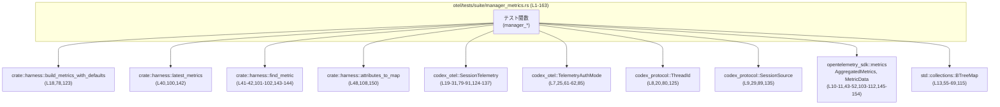
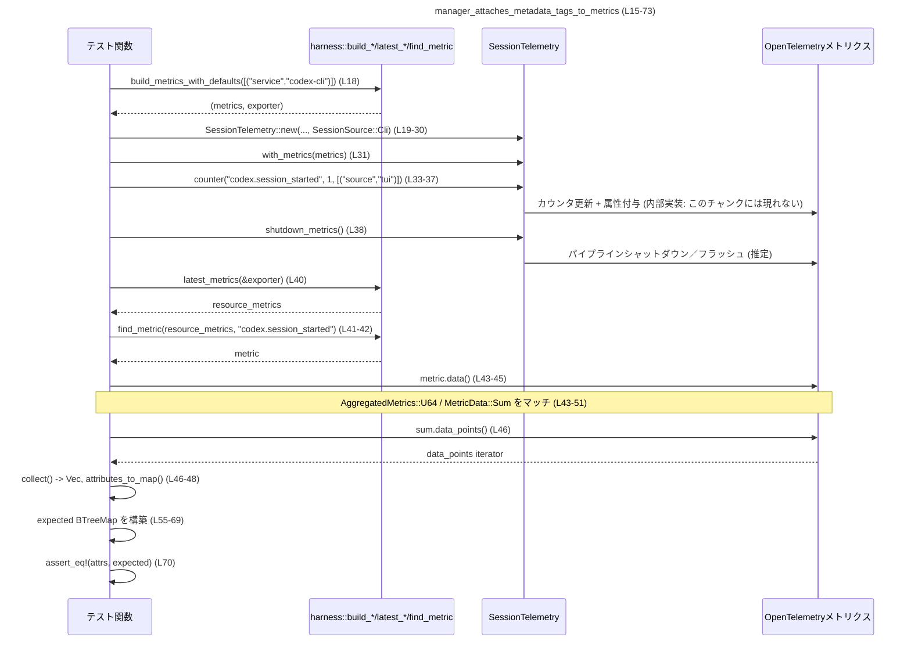

# otel/tests/suite/manager_metrics.rs

## 0. ざっくり一言

`SessionTelemetry` がメトリクス送信時に **どのような属性タグを付与するか／しないか** を検証するテストモジュールです（manager_metrics.rs:L15-73, L75-119, L121-163）。

---

## 1. このモジュールの役割

### 1.1 概要

- `SessionTelemetry` にメトリクスハンドラを組み込み、カウンタを 1 回インクリメントした結果として出力されるメトリクスの **属性タグ集合** を検査するテスト群です（manager_metrics.rs:L18-38, L78-98, L123-141）。
- メタデータタグが自動付与されるケース、無効化されるケース、任意の `service_name` を付けられるケースをカバーしています（manager_metrics.rs:L55-69, L115, L157-160）。

### 1.2 アーキテクチャ内での位置づけ

このファイルは **テスト専用モジュール** であり、本番コードは他モジュールに存在します。依存関係は概ね次の通りです。



- `crate::harness::*` はテスト用ヘルパーモジュールであり、このファイルには実装は存在しません（manager_metrics.rs:L1-4）。
- `codex_otel::SessionTelemetry` がテスト対象のコアコンポーネントです（manager_metrics.rs:L6, L19-31, L79-91, L124-137）。

### 1.3 設計上のポイント

コードから読み取れる設計上の特徴は次の通りです。

- **責務の分離**
  - テストは「メトリクスの収集とエクスポート」を `harness` モジュールに委譲し、ここでは「どの属性タグが付くか」のみを検証しています（manager_metrics.rs:L18, L40-43）。
- **状態の扱い**
  - `SessionTelemetry` インスタンス (`manager`) はメトリクスハンドラを内部状態として保持し、`counter` 呼び出しでカウンタ更新、`shutdown_metrics` でフラッシュ／シャットダウンを行う構造になっています（manager_metrics.rs:L31, L33-38, L91, L93-99, L137, L139-141）。
  - この内部実装は本ファイルには現れず、不明です。
- **エラーハンドリング方針**
  - 各テストは `Result<()>` を返し、`build_metrics_with_defaults` と `shutdown_metrics` のエラーを `?` でそのまま伝播させます（manager_metrics.rs:L17-18, L38, L77-78, L98, L122-123, L140）。
  - メトリクス型が期待通りでない場合は `panic!` で即座に失敗させることで、集約設定の不整合を検出します（manager_metrics.rs:L50-52, L110-112, L152-154）。
- **テストでの契約確認**
  - 属性タグの集合を `BTreeMap` に変換して厳密に比較し、順序に依存しない等価性を検証しています（manager_metrics.rs:L48, L55-70, L115-116）。

---

## 2. 主要な機能一覧（コンポーネントインベントリー）

### 2.1 本ファイルで定義される関数

| 関数名 | 種別 | 役割 / 機能 | 根拠 |
|--------|------|------------|------|
| `manager_attaches_metadata_tags_to_metrics` | テスト関数 (`#[test]`) | メタデータタグが自動的に付与されることを検証 | manager_metrics.rs:L15-73 |
| `manager_allows_disabling_metadata_tags` | テスト関数 (`#[test]`) | メタデータタグ付与を無効化できることを検証 | manager_metrics.rs:L75-119 |
| `manager_attaches_optional_service_name_tag` | テスト関数 (`#[test]`) | 任意の `service_name` タグが付与されることを検証 | manager_metrics.rs:L121-163 |

### 2.2 主要な外部コンポーネント（型・関数・メソッド）

**型**

| 名前 | 種別 | 役割 / 用途 | 根拠 |
|------|------|------------|------|
| `SessionTelemetry` | 構造体（推定） | セッション単位のテレメトリ（メトリクスなど）管理。ここではメトリクス記録のフロントエンドとして利用 | manager_metrics.rs:L6, L19-31, L79-91, L124-137 |
| `TelemetryAuthMode` | 列挙体（推定） | 認証モード（例: `ApiKey`）を表し、タグ `auth_mode` に反映される | manager_metrics.rs:L7, L25, L61-62, L85 |
| `ThreadId` | 構造体（推定） | セッションを識別するための ID として渡される | manager_metrics.rs:L8, L20, L80, L125 |
| `SessionSource` | 列挙体（推定） | `Cli` など、セッションの起点種別を表す | manager_metrics.rs:L9, L29, L89, L135 |
| `AggregatedMetrics` | 列挙体 | OpenTelemetry のメトリクス集約結果。ここでは `U64` バリアントを期待 | manager_metrics.rs:L10, L43-44, L103-104, L145-146 |
| `MetricData` | 列挙体 | メトリクスのデータ種別。ここでは `Sum` バリアントを期待 | manager_metrics.rs:L11, L45-51, L105-111, L147-153 |
| `BTreeMap` | 標準ライブラリの連想配列 | 属性タグをキー順に保持し、比較のために利用 | manager_metrics.rs:L13, L55-69, L115 |

**関数・メソッド**

| 名前 | 所属 | 役割 / 機能 | 根拠 |
|------|------|------------|------|
| `build_metrics_with_defaults` | `crate::harness` | テスト用のメトリクスインストルメンテーションとエクスポータを構築する | manager_metrics.rs:L2, L18, L78, L123 |
| `latest_metrics` | `crate::harness` | エクスポータから最新のリソースメトリクスを取得する | manager_metrics.rs:L4, L40, L100, L142 |
| `find_metric` | `crate::harness` | メトリクス集合から名前で特定のメトリクスを検索する | manager_metrics.rs:L3, L41-42, L101-102, L143-144 |
| `attributes_to_map` | `crate::harness` | OpenTelemetry の属性集合を `BTreeMap<String, String>` に変換する | manager_metrics.rs:L1, L48, L108, L150 |
| `SessionTelemetry::new` | `codex_otel` | セッション情報・モデル名・認証モードなどを指定してテレメトリマネージャを生成 | manager_metrics.rs:L19-30, L79-90, L124-135 |
| `with_metrics` | `SessionTelemetry` メソッド | メトリクスインストルメンテーションを `SessionTelemetry` に紐づける | manager_metrics.rs:L31, L137 |
| `with_metrics_without_metadata_tags` | `SessionTelemetry` メソッド | メトリクスを紐づけるが、メタデータタグ自動付与を無効化 | manager_metrics.rs:L91 |
| `with_metrics_service_name` | `SessionTelemetry` メソッド | メトリクスタグ `service_name` の値をオプションで設定 | manager_metrics.rs:L136 |
| `SessionTelemetry::counter` | メソッド | 名前付きカウンタをインクリメントし、属性を付与して記録 | manager_metrics.rs:L33-37, L93-97, L139 |
| `SessionTelemetry::shutdown_metrics` | メソッド | メトリクスパイプラインをシャットダウンし、エクスポートを完了させる | manager_metrics.rs:L38, L98, L140 |

> `crate::harness` 内でこれらがどのように実装されているかは、このチャンクには現れません。

---

## 3. 公開 API と詳細解説

このファイル自体はテストモジュールのため **公開 API は定義していません**。  
ここでは、テスト関数を「`SessionTelemetry` の利用例／契約を検証するコード」として詳細に解説します。

### 3.1 型一覧（このファイルで重要なもの）

| 名前 | 種別 | 役割 / 用途 | 根拠 |
|------|------|-------------|------|
| `SessionTelemetry` | 構造体（外部定義） | メトリクスを含むセッションテレメトリのエントリポイント。メタデータの設定とメトリクス記録のラッパーとして使用 | manager_metrics.rs:L6, L19-31, L79-91, L124-137 |
| `TelemetryAuthMode` | 列挙体（外部定義） | 認証モードを示し、`auth_mode` タグへ反映される値として使用 | manager_metrics.rs:L7, L25, L61-62, L85 |
| `ThreadId` | 構造体（外部定義） | セッション用 ID として `SessionTelemetry::new` に渡される | manager_metrics.rs:L8, L20, L80, L125 |
| `SessionSource` | 列挙体（外部定義） | セッションの起点（ここでは `Cli`）を表す | manager_metrics.rs:L9, L29, L89, L135 |
| `AggregatedMetrics` | 列挙体 | エクスポートされたメトリクスの型。ここでは `U64` バリアントを期待して分岐 | manager_metrics.rs:L10, L43-44, L103-104, L145-146 |
| `MetricData` | 列挙体 | メトリクスデータの種別。ここでは `Sum` バリアントを期待 | manager_metrics.rs:L11, L45-51, L105-111, L147-153 |
| `BTreeMap<String, String>` | 構造体 | 属性名→文字列値のマップとして、タグ集合の比較に使用 | manager_metrics.rs:L13, L55-69, L115 |

### 3.2 関数詳細

#### `manager_attaches_metadata_tags_to_metrics() -> Result<()>`

**概要**

- `SessionTelemetry` がメトリクスを転送する際に、アプリケーションバージョン・認証方式・モデル名などの **メタデータタグを自動的に付与する** ことを検証するテストです（manager_metrics.rs:L15-73）。

**引数**

- 引数はありません（テスト関数のシグネチャ: `fn manager_attaches_metadata_tags_to_metrics() -> Result<()>`）（manager_metrics.rs:L17）。

**戻り値**

- `codex_otel::Result<()>`（型エイリアスと思われる）を返します。  
  - `build_metrics_with_defaults` または `shutdown_metrics` でエラーが発生した場合に `Err` が返る可能性があります（manager_metrics.rs:L18, L38）。

**内部処理の流れ（アルゴリズム）**

1. テスト用メトリクス環境の構築  
   - `"service" = "codex-cli"` のリソース属性を付与してメトリクスパイプラインを構築し、メトリクスハンドラ `metrics` とエクスポータ `exporter` を取得します（manager_metrics.rs:L18）。
2. `SessionTelemetry` インスタンスの生成  
   - `ThreadId::new()`・モデル名 `"gpt-5.1"`・アカウント ID `"account-id"`・`TelemetryAuthMode::ApiKey`・`originator = "test_originator"`・`log_user_prompts = true`・`SessionSource::Cli` などを指定して `SessionTelemetry::new` を呼び出します（manager_metrics.rs:L19-29）。
   - その後 `.with_metrics(metrics)` でメトリクスハンドラを紐づけます（manager_metrics.rs:L31）。
3. カウンタメトリクスの記録  
   - `manager.counter("codex.session_started", 1, &[("source", "tui")])` を呼び出し、`"codex.session_started"` カウンタを 1 増加させ、属性 `"source"="tui"` を付与します（manager_metrics.rs:L33-37）。
4. メトリクスのシャットダウン  
   - `manager.shutdown_metrics()?` を呼び出してメトリクスパイプラインを終了させ、エクスポートを完了させます（manager_metrics.rs:L38）。
5. エクスポートされたメトリクスの取得とフィルタ  
   - `latest_metrics(&exporter)` で最新のリソースメトリクス集合を取得し（manager_metrics.rs:L40）、  
     `find_metric(&resource_metrics, "codex.session_started")` で対象メトリクスを検索します（manager_metrics.rs:L41-42）。
6. メトリクスデータの型チェックと属性抽出  
   - `metric.data()` から `AggregatedMetrics::U64` を期待してマッチし（manager_metrics.rs:L43-44）、  
     さらに `MetricData::Sum(sum)` を期待してマッチします（manager_metrics.rs:L45-51）。
   - `sum.data_points().collect()` でデータポイントをベクタにし、`points.len() == 1` をアサートした上で、最初のポイントの属性から `attributes_to_map` で `BTreeMap` を作成します（manager_metrics.rs:L46-48）。
7. 期待される属性集合の構築と比較  
   - `BTreeMap::from([...])` を使って期待値を構築し、`assert_eq!(attrs, expected)` で完全一致を確認します（manager_metrics.rs:L55-70）。

**期待されるタグ**

期待値マップは次のキー・値を持ちます（manager_metrics.rs:L55-69）。

- `"app.version"`: `env!("CARGO_PKG_VERSION")`（ビルド時に埋め込まれたパッケージバージョン）
- `"auth_mode"`: `TelemetryAuthMode::ApiKey.to_string()` → `"ApiKey"` 相当
- `"model"`: `"gpt-5.1"`
- `"originator"`: `"test_originator"`
- `"service"`: `"codex-cli"`（`build_metrics_with_defaults` に渡したリソース属性）
- `"session_source"`: `"cli"`（`SessionSource::Cli` から導出）
- `"source"`: `"tui"`（カウンタ呼び出し時に渡した属性）

**Errors / Panics**

- `Result` によるエラー伝播:
  - `build_metrics_with_defaults` 実行時のエラー（manager_metrics.rs:L18）。
  - `manager.shutdown_metrics()` 実行時のエラー（manager_metrics.rs:L38）。
- `panic!` が発生する条件:
  - `find_metric(...).expect("counter metric missing")` で対象メトリクスが存在しない場合（manager_metrics.rs:L41-42）。
  - `metric.data()` の結果が `AggregatedMetrics::U64` 以外の場合（manager_metrics.rs:L43-44, L52）。
  - `MetricData::Sum` 以外の場合（manager_metrics.rs:L45, L50）。
  - `points.len() != 1` の場合、`assert_eq!(points.len(), 1)` が失敗（manager_metrics.rs:L47）。
  - `assert_eq!(attrs, expected)` が失敗した場合（manager_metrics.rs:L70）。

**Edge cases（エッジケース）**

- カウンタが一度も記録されない場合:
  - `find_metric` がメトリクスを見つけられず `None` を返すと、`expect` により panic します（manager_metrics.rs:L41-42）。
- メトリクスバックエンド設定の変更:
  - `AggregatedMetrics` の型や `MetricData` の形が変更されると、マッチアームの `panic!("unexpected ...")` によりテストが失敗します（manager_metrics.rs:L50-52）。
- 属性が追加／削除された場合:
  - 期待マップと実際のマップを完全一致で比較しているため、タグの追加・削除・値の変更はいずれもテスト失敗に直結します（manager_metrics.rs:L55-70）。

**使用上の注意点**

- 本テストが前提とする契約:
  - `"codex.session_started"` カウンタは `U64` の Sum メトリクスとしてエクスポートされる（manager_metrics.rs:L43-51）。
  - `SessionTelemetry` はセッション情報からメタデータタグを自動生成する。
- 実装側でこれらの仕様を変更する際には、このテストの期待値も合わせて更新する必要があります。

---

#### `manager_allows_disabling_metadata_tags() -> Result<()>`

**概要**

- `SessionTelemetry` がメトリクス記録時の **メタデータタグ自動付与を無効化する設定** を提供していることを検証するテストです（manager_metrics.rs:L75-119）。

**内部処理の流れ**

1. メトリクス環境を、追加リソース属性なしで構築（manager_metrics.rs:L78）。
2. `SessionTelemetry::new` で `"gpt-4o"` モデルなどを設定し（manager_metrics.rs:L79-89）、  
   `.with_metrics_without_metadata_tags(metrics)` を呼んでメタデータタグなしモードでメトリクスを紐づけ（manager_metrics.rs:L91）。
3. `"codex.session_started"` カウンタを `"source"="tui"` 属性付きで 1 インクリメント（manager_metrics.rs:L93-97）。
4. `shutdown_metrics` でエクスポート完了（manager_metrics.rs:L98）。
5. `latest_metrics` → `find_metric` → `metric.data()` → `AggregatedMetrics::U64` → `MetricData::Sum` → `data_points` → `attributes_to_map` という流れで属性マップを取り出す（manager_metrics.rs:L100-113）。
6. 期待される属性マップを `BTreeMap::from([("source".to_string(), "tui".to_string())])` とし、完全一致を確認（manager_metrics.rs:L115-116）。

**期待されるタグ**

- `"source"` のみ。`model` や `auth_mode` などのメタデータタグは一切含まれないことを期待しています（manager_metrics.rs:L115）。

**Errors / Panics / Edge cases**

- エラー伝播と panic 条件は、前のテストと同様です（manager_metrics.rs:L78, L91-99, L100-113, L115-116）。
- 特に、もし実装がメタデータタグを誤って付与した場合は、`attrs` に余計なエントリが追加されるため、`assert_eq!` によりテストが失敗します（manager_metrics.rs:L115-116）。

**使用上の注意点**

- プライバシーや機密情報保護の観点から、ユーザやアカウント関連のメタデータをメトリクスとして送信したくない場合、このモードが重要な役割を果たすと解釈できますが、詳細な設計意図はこのチャンクからは分かりません。
- 実装側では「どのタグがメタデータ扱いで、どのタグがユーザ指定か」を明確に分離しておく必要があります（テストは `"source"` のみを残すことを前提にしています: manager_metrics.rs:L93-97, L115）。

---

#### `manager_attaches_optional_service_name_tag() -> Result<()>`

**概要**

- メトリクスに任意の `service_name` タグを **オプションで上書き／追加** できることを検証するテストです（manager_metrics.rs:L121-163）。

**内部処理の流れ**

1. リソース属性なしでメトリクス環境を構築（manager_metrics.rs:L123）。
2. `SessionTelemetry::new` を、アカウント情報や認証モードをすべて `None`/`false` として呼び出し（manager_metrics.rs:L124-135）。
3. `.with_metrics_service_name("my_app_server_client")` でサービス名を設定し（manager_metrics.rs:L136）、  
   続けて `.with_metrics(metrics)` でメトリクスを紐づけ（manager_metrics.rs:L137）。
4. `"codex.session_started"` カウンタを属性なしで 1 インクリメント（manager_metrics.rs:L139）。
5. `shutdown_metrics` → `latest_metrics` → `find_metric` → `metric.data()` → `AggregatedMetrics::U64` → `MetricData::Sum` → `data_points` → `attributes_to_map` と進み、属性マップを取得（manager_metrics.rs:L140-151）。
6. `attrs.get("service_name")` が `"my_app_server_client"` になっていることを `assert_eq!` で検証（manager_metrics.rs:L157-160）。

**確認している契約**

- `with_metrics_service_name` を呼び出した場合、エクスポートされたメトリクスには少なくとも `"service_name"` タグが含まれていること（manager_metrics.rs:L136-137, L157-160）。
- 他のタグ（例: `model`, `session_source` など）が付与されているかどうかについては、このテストは何も主張しません。`attrs` 全体ではなく `"service_name"` キーだけを確認しています（manager_metrics.rs:L157-160）。

**Errors / Panics**

- 先のテストと同様に、メトリクスタイプの不一致・メトリクス不存在・データポイント数の不一致・`service_name` 不一致で panic またはテスト失敗が発生します（manager_metrics.rs:L143-151, L157-160）。

**Edge cases**

- `with_metrics_service_name` を呼んだが実装がタグを付与しない場合:
  - `attrs.get("service_name")` が `None` となり、`assert_eq!` が失敗します（manager_metrics.rs:L157-160）。
- `with_metrics_service_name` が既存のサービス名と衝突する場合:
  - どう扱われるか（上書きかエラーか）は、このチャンクでは確認できません。テストでは上書き or 新規追加のどちらかを期待しているように見えますが、コードからは断定できません。

**使用上の注意点**

- テストからは、`with_metrics_service_name` は `with_metrics` より前に呼び出すことを前提としているように見えます（メソッドチェーンの順序: manager_metrics.rs:L136-137）。
- 実装側でも、この順序依存がある場合は API ドキュメントで明示する必要がありますが、このファイルからは分かりません。

---

### 3.3 その他の関数（外部ヘルパー）

このファイル内で定義されてはいませんが、頻繁に利用される補助関数です。

| 関数名 | 役割（1 行） | 根拠 |
|--------|--------------|------|
| `build_metrics_with_defaults` | テスト用メトリクスパイプラインとエクスポータを標準的な設定で構築する | manager_metrics.rs:L2, L18, L78, L123 |
| `latest_metrics` | エクスポータから直近のメトリクススナップショットを取得する | manager_metrics.rs:L4, L40, L100, L142 |
| `find_metric` | メトリクス集合から指定名のメトリクスを検索し、テストで検証対象を特定する | manager_metrics.rs:L3, L41-42, L101-102, L143-144 |
| `attributes_to_map` | OpenTelemetry の属性を `BTreeMap<String,String>` に変換し、順序非依存な比較を可能にする | manager_metrics.rs:L1, L48, L108, L150 |

これらの具体的な実装はこのチャンクには現れないため、詳細は不明です。

---

## 4. データフロー

### 4.1 代表的な処理シナリオ

ここでは、`manager_attaches_metadata_tags_to_metrics` のデータフローをシーケンス図で示します（manager_metrics.rs:L15-73）。



要点:

- **メトリクス記録→エクスポート→検証** の一連の流れが 1 テスト内で完結しています（manager_metrics.rs:L18-48）。
- メトリクスの属性は OpenTelemetry の API を通して取得し、テスト専用ユーティリティで比較可能な形に変換しています（manager_metrics.rs:L43-48）。

---

## 5. 使い方（How to Use）

このファイルはテストですが、`SessionTelemetry` とメトリクスの **典型的な利用フロー** を示す実用的なサンプルにもなっています。

### 5.1 基本的な使用方法（メタデータタグ付き）

`manager_attaches_metadata_tags_to_metrics` を簡略化した利用例です（コメント付き）。  
実際のテストコードは manager_metrics.rs:L18-38, L40-52, L55-70 を参照してください。

```rust
use codex_otel::{SessionTelemetry, TelemetryAuthMode, Result};       // テレメトリ関連の型をインポート
use codex_protocol::{ThreadId, protocol::SessionSource};             // セッションIDとソース種別
use std::collections::BTreeMap;

// metrics と exporter はテスト用ハーネスから取得しているが、
// 実アプリケーションでは OpenTelemetry SDK でセットアップする想定
fn record_session_started_with_metadata(
    metrics: /* メトリクスハンドラの型 */,
    exporter: /* エクスポータの型 */,
) -> Result<BTreeMap<String, String>> {
    // SessionTelemetry をセッション情報で初期化
    let manager = SessionTelemetry::new(
        ThreadId::new(),                         // セッションID
        "gpt-5.1",                               // model
        "gpt-5.1",                               // base_model など（詳細不明）
        Some("account-id".to_string()),          // アカウントID
        None,                                    // account_email
        Some(TelemetryAuthMode::ApiKey),         // 認証モード
        "test_originator".to_string(),           // originator
        true,                                    // log_user_prompts
        "tty".to_string(),                       // 端末種別
        SessionSource::Cli,                      // セッションソース
    )
    .with_metrics(metrics);                      // メトリクスハンドラを紐づけ

    // カウンタメトリクスを 1 増加
    manager.counter(
        "codex.session_started",                 // メトリクス名
        1,                                       // 増分
        &[("source", "tui")],                    // 任意の属性
    );

    // メトリクスをフラッシュ／シャットダウン
    manager.shutdown_metrics()?;                 // エラーは Result 経由で返す

    // ここで exporter からメトリクスを取り出して attrs を検査することができる
    // （詳細は manager_metrics.rs:L40-52 を参照）

    // 例として空マップを返す（実際には attributes_to_map の結果などを返す）
    Ok(BTreeMap::new())
}
```

### 5.2 よくある使用パターン

このモジュールから読み取れる `SessionTelemetry` の典型的な使い分けを整理します。

1. **通常モード（メタデータタグ付き）**  
   - `.with_metrics(metrics)` を使用（manager_metrics.rs:L31, L137）。  
   - モデル名・認証モード・アプリケーションバージョンなどがタグとして付与されることがテストで検証されています（manager_metrics.rs:L55-69）。

2. **メタデータタグ無効モード**  
   - `.with_metrics_without_metadata_tags(metrics)` を使用（manager_metrics.rs:L91）。  
   - ユーザが渡した属性（ここでは `"source"="tui"`）のみがタグとして残ることを期待（manager_metrics.rs:L93-97, L115）。

3. **サービス名を上書き／追加するモード**  
   - `.with_metrics_service_name("...").with_metrics(metrics)` のようにチェーンして使用（manager_metrics.rs:L136-137）。  
   - `"service_name"` タグが設定されていることを確認（manager_metrics.rs:L157-160）。

### 5.3 よくある間違い（推測できる範囲）

コードから推測される、起こりがちな誤用例と正しい例です。

```rust
// 誤りの例: メトリクスを紐づけずに counter を呼ぶ（推測される誤用）
// let manager = SessionTelemetry::new(...);
// manager.counter("codex.session_started", 1, &[]); // metrics が設定されていないと記録されない可能性

// 正しい例: with_metrics あるいは with_metrics_without_metadata_tags を経由してから使用
let manager = SessionTelemetry::new(/* ... */)
    .with_metrics(metrics); // または .with_metrics_without_metadata_tags(metrics)

manager.counter("codex.session_started", 1, &[]);
manager.shutdown_metrics()?; // エクスポート完了を保証
```

```rust
// 誤りの例: service_name を上書きしたつもりで順序を誤る（推測される誤用）
// let manager = SessionTelemetry::new(...)
//     .with_metrics(metrics)
//     .with_metrics_service_name("my_app_server_client"); // 実装によっては無効かもしれない

// テストが示す順序: 先に service_name を設定してから metrics を紐づけ
let manager = SessionTelemetry::new(/* ... */)
    .with_metrics_service_name("my_app_server_client")   // manager_metrics.rs:L136
    .with_metrics(metrics);                              // manager_metrics.rs:L137
```

> 順序が実際に影響するかどうかは、このチャンクからは分かりませんが、テストは上記の順序を採用しています。

### 5.4 使用上の注意点（まとめ）

- **メトリクスパイプラインの終了**  
  - メトリクスを確実にエクスポートするには `shutdown_metrics()` を呼ぶ必要があります（manager_metrics.rs:L38, L98, L140）。  
  - 呼び忘れると、バックエンドによってはメトリクスが送信されない可能性がありますが、このファイルではそこまで検証していません。
- **タグ付与の契約**  
  - 通常モードでは、多数のメタデータタグが自動付与されることを前提に設計されています（manager_metrics.rs:L55-69）。  
  - プライバシー要件などでタグを削減したい場合は、`with_metrics_without_metadata_tags` の利用が前提になります（manager_metrics.rs:L91, L115）。
- **型と集約の前提**  
  - `AggregatedMetrics::U64 + MetricData::Sum` というペアが前提になっているため、メトリクス設定を変更する際は注意が必要です（manager_metrics.rs:L43-51, L103-111, L145-153）。

---

## 6. 変更の仕方（How to Modify）

### 6.1 新しい機能（新しいタグやモード）を追加する場合

`SessionTelemetry` に新しいタグ機構や設定モードを追加する場合、テスト側では次のような変更パターンが想定されます。

1. **新タグの追加**
   - 例: `region` タグを追加したい場合
     - 実装側: `SessionTelemetry` で `region` を受け取り、メトリクスタグに反映する処理を追加（このファイルには現れない）。
     - テスト側: 既存のテストに期待タグとして `"region" -> "us-east-1"` などを追加し、 `BTreeMap::from` のエントリを増やす（manager_metrics.rs:L55-69, L115 を修正）。

2. **新しいモード（例: 部分的なメタデータのみ許可）**
   - 実装側で新メソッド（仮: `with_metrics_with_limited_metadata`）を追加した場合
   - テスト側に新テスト関数を追加し、以下の流れで期待値を検証:
     - 新メソッドを呼んだ `SessionTelemetry` を構築。
     - カウンタ記録 → shutdown → latest_metrics → find_metric → attributes_to_map。
     - 残すべきタグのみを `expected` に定義して `assert_eq!`。

### 6.2 既存の機能を変更する場合

- **タグ仕様を変更する場合**
  - 例: `service` タグ名を `service_name` に統一する、など。
  - 対応手順:
    - 実装側でタグ名の変更。
    - テストの期待値マップのキーを変更し、古いキーを削除（manager_metrics.rs:L55-69, L115, L157-160）。
    - テストが利用している `find_metric` や `attributes_to_map` の動作に変更がないか確認（別ファイル）。

- **メトリクス型／集約方式を変更する場合**
  - 例: カウンタからゲージに変更する、Sum から Histogram に変更するなど。
  - 対応手順:
    - 実装側でメトリクスの型を変更。
    - 本テストの `match metric.data()` のパターンを新しい型に合わせて修正（manager_metrics.rs:L43-51, L103-111, L145-153）。
    - 期待する属性ロジックに変化がなければ、`attributes_to_map` 周辺は再利用可能です。

- **影響範囲の確認**
  - `SessionTelemetry` を利用している他のテスト・モジュールを全体検索し、同様の契約（メトリクス名・タイプ・タグ）が前提になっていないか確認する必要がありますが、その情報はこのチャンクには現れません。

---

## 7. 関連ファイル

このモジュールと密接に関係するであろうファイル／コンポーネントです。

| パス / コンポーネント | 役割 / 関係 |
|-----------------------|------------|
| `crate::harness`（`attributes_to_map`, `build_metrics_with_defaults`, `find_metric`, `latest_metrics` の定義） | テスト用に OpenTelemetry メトリクスパイプラインを構築・操作するユーティリティ。メトリクスの収集・検索・属性変換の処理を隠蔽する（manager_metrics.rs:L1-4, L18, L40-48, L78, L100-108, L123, L142-150）。 |
| `codex_otel::SessionTelemetry` | 本テストの主対象。セッション情報を持ち、メトリクスやログなどを記録するための API を提供する（manager_metrics.rs:L6, L19-31, L79-91, L124-137）。 |
| `codex_otel::TelemetryAuthMode` | 認証方式の列挙体。`auth_mode` メトリクスタグに文字列として反映されることがテストから読み取れる（manager_metrics.rs:L7, L25, L61-62, L85）。 |
| `codex_protocol::ThreadId` | セッションの識別子。`SessionTelemetry::new` の第 1 引数として使用される（manager_metrics.rs:L8, L20, L80, L125）。 |
| `codex_protocol::protocol::SessionSource` | セッションの起点（CLI など）を表し、`session_source` タグに反映される（manager_metrics.rs:L9, L29, L89, L135, L67）。 |
| `opentelemetry_sdk::metrics::data::{AggregatedMetrics, MetricData}` | エクスポートされたメトリクスの型表現。テストは `U64` カウンタの Sum であることを前提にしている（manager_metrics.rs:L10-11, L43-51, L103-111, L145-153）。 |

---

## 付録: バグ・セキュリティ・並行性などの観点（このファイルから読み取れる範囲）

- **潜在的なバグ検知ポイント**
  - メタデータタグが意図せず追加／削除された場合にテストが即座に検知します（manager_metrics.rs:L55-70, L115-116, L157-160）。
  - メトリクスの型・集約方式が変更された場合も、`match` の `panic!` により異常が検出されます（manager_metrics.rs:L43-52, L103-113, L145-155）。

- **セキュリティ／プライバシー**
  - `manager_allows_disabling_metadata_tags` により、メタデータタグ（アカウント情報や認証方式など）をメトリクスに含めないモードの存在が保証されています（manager_metrics.rs:L79-91, L115）。
  - どのタグが「機微情報」に当たるか、また実際にどの値が出力されるかはこのチャンクだけでは完全には分かりませんが、少なくとも `account-id` などをタグにしない設定パスが存在することが示唆されています。

- **Rust の安全性・並行性**
  - このファイル内では `unsafe` ブロックやマルチスレッド／`async` は使用されておらず、すべて同期的・安全な API のみが利用されています（manager_metrics.rs:L1-163）。
  - `ThreadId::new()` は名前からはスレッドに関連するように見えますが、実際の意味はこのチャンクからは分かりません。少なくとも OS レベルのスレッド操作は直接行っていません。

- **パフォーマンス／スケーラビリティ**
  - テストコードは単一のカウンタ更新とメトリクス取得しか行わないため、パフォーマンス評価には直接関係しません（manager_metrics.rs:L33-38, L93-99, L139-141）。
  - ただし実装側でメタデータタグを増やしすぎると、メトリクスの高カーディナリティ（タグの組み合わせ爆発）につながる可能性があります。この点は一般的な OpenTelemetry の注意事項であり、このファイルからは詳細は分かりません。
