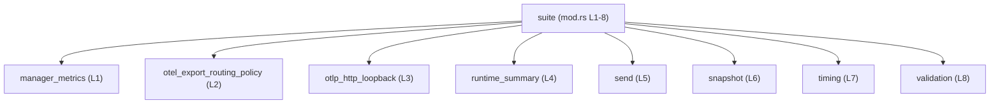
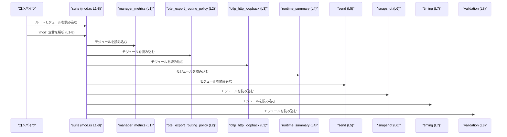

# otel/tests/suite/mod.rs コード解説

## 0. ざっくり一言

- OpenTelemetry（otel）関連のテストを複数のサブモジュールに分割し、1つのテストスイートとして束ねるための「モジュール宣言だけ」のファイルです（`otel/tests/suite/mod.rs:L1-8`）。

---

## 1. このモジュールの役割

### 1.1 概要

- このファイルは、`tests/suite` 統合テストクレートのルートモジュールとして機能し、8個のサブモジュールを `mod` 宣言で登録しています（`otel/tests/suite/mod.rs:L1-8`）。
- 自身では関数・型・定数などの実行ロジックを一切持たず、「どのテストモジュールをこのテストクレートに含めるか」を定義する役割のみを持ちます。

### 1.2 アーキテクチャ内での位置づけ

このファイルは、テストクレート `suite` のルートにあり、各サブモジュール（`manager_metrics` など）の親モジュールとして振る舞います。

- `mod manager_metrics;` 等の宣言により、Rust のモジュールシステムが同名ファイル（`manager_metrics.rs` または `manager_metrics/mod.rs`）を読み込みます（`otel/tests/suite/mod.rs:L1-8`）。
- その結果、`suite` テストクレートの中で、各サブモジュール内のテストコードがコンパイル対象になります。

モジュール間の依存関係（このチャンクで分かる範囲）は次の通りです。



- この図は **このチャンクに現れる情報（`mod` 宣言）だけ** に基づく依存関係を示しています。
- 各サブモジュールが内部でどのプロダクションコード（例: `otel` クレートの型や関数）を利用しているかは、このチャンクからは分かりません。

### 1.3 設計上のポイント

コードから読み取れる設計上の特徴は次の通りです。

- **テストの分割**  
  - テストを 8 つのサブモジュールに分割しています（`otel/tests/suite/mod.rs:L1-8`）。  
  - モジュール名からは「メトリクス」「ルーティングポリシー」「HTTP ループバック」「ランタイムサマリ」「送信」「スナップショット」「タイミング」「バリデーション」といった観点で分類されていると推測できますが、**実装がないため断定はできません**。
- **状態・ロジックを持たないモジュール**  
  - このファイルには関数・構造体・列挙体・定数などの定義が存在せず、実行時ロジックはありません（`otel/tests/suite/mod.rs:L1-8`）。
- **公開範囲**  
  - すべて `mod` であり、`pub mod` ではないため、このテストクレート外にサブモジュールを公開していません（`otel/tests/suite/mod.rs:L1-8`）。
  - そもそも `tests/` 配下は Cargo の仕様上「統合テスト用クレート」であり、ライブラリの公開 API には含まれません。
- **安全性・エラー・並行性**  
  - `mod` 宣言しかなく、`unsafe` ブロックやエラーハンドリング・並行実行に関わるコードは一切ありません（`otel/tests/suite/mod.rs:L1-8`）。  
  - 言語固有の安全性やエラーハンドリング・並行性に関するポイントは、このファイル単体には存在しません。

---

## 2. 主要な機能一覧（コンポーネントインベントリー）

このファイル自体の「機能」は「テスト用サブモジュールを列挙してクレートに含めること」です（`otel/tests/suite/mod.rs:L1-8`）。

### 2.1 コンポーネント一覧（モジュール）

> ※「説明」列のうち、内容に踏み込んだ部分は **名前からの推測** であり、実装がこのチャンクにはないため断定できません。

| コンポーネント名 | 種別 | 定義位置（推定含む） | 根拠 | 説明 |
|------------------|------|----------------------|------|------|
| `suite` | モジュール（テストクレートのルート） | `otel/tests/suite/mod.rs` | `otel/tests/suite/mod.rs:L1-8` | 統合テストクレートのルートモジュール。8つのサブモジュールを `mod` 宣言で登録する役割のみを持つ。 |
| `manager_metrics` | サブモジュール | `otel/tests/suite/manager_metrics.rs` または `otel/tests/suite/manager_metrics/mod.rs` | `otel/tests/suite/mod.rs:L1-1` | テスト用サブモジュール。名称からは「マネージャに関するメトリクス」を扱うテストと推測されますが、このチャンクには実装が現れません。 |
| `otel_export_routing_policy` | サブモジュール | `otel/tests/suite/otel_export_routing_policy.rs` または `.../otel_export_routing_policy/mod.rs` | `otel/tests/suite/mod.rs:L2-2` | テスト用サブモジュール。名称からは「OTel エクスポートのルーティングポリシー」に関するテストと推測されますが、詳細は不明です。 |
| `otlp_http_loopback` | サブモジュール | `otel/tests/suite/otlp_http_loopback.rs` または `.../otlp_http_loopback/mod.rs` | `otel/tests/suite/mod.rs:L3-3` | テスト用サブモジュール。名称からは「OTLP over HTTP のループバック」テストと推測されますが、このチャンクには現れません。 |
| `runtime_summary` | サブモジュール | `otel/tests/suite/runtime_summary.rs` または `.../runtime_summary/mod.rs` | `otel/tests/suite/mod.rs:L4-4` | テスト用サブモジュール。名称からは「ランタイムのサマリ情報」に関するテストと推測されますが、詳細は不明です。 |
| `send` | サブモジュール | `otel/tests/suite/send.rs` または `.../send/mod.rs` | `otel/tests/suite/mod.rs:L5-5` | テスト用サブモジュール。名称からは「送信処理」に関わるテストと推測されますが、このチャンクには中身がありません。 |
| `snapshot` | サブモジュール | `otel/tests/suite/snapshot.rs` または `.../snapshot/mod.rs` | `otel/tests/suite/mod.rs:L6-6` | テスト用サブモジュール。名称からは「スナップショット取得」周りのテストと推測されますが、詳細は不明です。 |
| `timing` | サブモジュール | `otel/tests/suite/timing.rs` または `.../timing/mod.rs` | `otel/tests/suite/mod.rs:L7-7` | テスト用サブモジュール。名称からは「タイミングや時間計測」に関するテストと推測されますが、このチャンクには現れません。 |
| `validation` | サブモジュール | `otel/tests/suite/validation.rs` または `.../validation/mod.rs` | `otel/tests/suite/mod.rs:L8-8` | テスト用サブモジュール。名称からは「各種バリデーション」に関するテストと推測されますが、実装はこのチャンクにはありません。 |

---

## 3. 公開 API と詳細解説

### 3.1 型一覧（構造体・列挙体など）

このファイルには、構造体（`struct`）、列挙体（`enum`）、型エイリアス（`type`）、トレイト（`trait`）などの **型定義は一切存在しません**。

- 根拠: 提示されたコードは 8 行すべてが `mod xxx;` 形式のモジュール宣言であり、それ以外の宣言がありません（`otel/tests/suite/mod.rs:L1-8`）。

したがって、このファイル単体で「公開されている型」はありません。  
テストで利用される具体的な型は、各サブモジュールおよびテスト対象のクレート側に定義されていると考えられますが、**このチャンクには現れません**。

### 3.2 関数詳細

このファイルには関数定義（`fn`）が一つもありません（`otel/tests/suite/mod.rs:L1-8`）。

- そのため、関数シグネチャ、引数・戻り値、エラー型、エッジケースなどを解説できる「公開 API / コアロジック」は **このファイル単体には存在しません**。
- 実際のテスト関数（`#[test] fn ...`）や補助関数は、上記サブモジュール内に配置されているはずですが、内容はこのチャンクには現れません。

### 3.3 その他の関数

補助関数やラッパー関数も含め、このファイルには一切の関数がありません。  
したがって、このセクションで列挙すべき関数はありません。

---

## 4. データフロー

### 4.1 このファイルにおける「データ」の流れ

このファイル自体には実行時処理がないため、**ランタイムにおけるデータフローは存在しません**。

存在するのは「コンパイル時のモジュール解決フロー」です。

1. コンパイラが `tests/suite/mod.rs` をテストクレート `suite` のルートとして読み込む。
2. 各行の `mod xxx;` 宣言（`L1-8`）を順に解釈し、対応するソースファイル（`xxx.rs` または `xxx/mod.rs`）を読み込む。
3. 各サブモジュール内のテストコードがコンパイルされ、最終的に 1 つのテストバイナリ（`suite`）としてリンクされる。

この「フロー」を sequence diagram で表すと、次のようになります。



### 4.2 安全性・エラー・並行性の観点

- **安全性**  
  - このファイルには `unsafe` キーワードや生ポインタ操作が一切なく、モジュール宣言のみです（`otel/tests/suite/mod.rs:L1-8`）。
  - したがって、このファイル単体に起因するメモリ安全性の問題はありません。
- **エラー**  
  - 実行時のエラーハンドリング（`Result` / `Option` / `?` 演算子など）はこのファイルには登場しません。
  - コンパイル時には、対応するモジュールファイルが存在しない場合などにコンパイルエラーになりますが、それは Rust の言語仕様上の挙動です。
- **並行性**  
  - スレッド、`async`/`await`、チャンネルなど並行処理に関するコードが存在しないため、並行性に関する考慮事項もこのファイルにはありません。

---

## 5. 使い方（How to Use）

### 5.1 基本的な使用方法

このファイルは、**統合テストクレート `suite` のエントリポイント**です。

Cargo の仕様では、`tests/suite/mod.rs` はテストターゲット `suite` として扱われます。  
そのため、テストを実行するには、一般的に次のようなコマンドを使用します（プロジェクト設定次第ですが、Rust/Cargo の標準仕様に基づく説明です）。

```bash
# クレート全体のテストを実行（他のテストも含む）
cargo test

# 統合テストクレート `suite` のみを実行
cargo test --test suite
```

- `--test suite` により、`tests/suite/mod.rs` をルートとするテストクレートが実行され、その中で読み込まれた各サブモジュールのテストコードが走ります（サブモジュール側のコードはこのチャンクには現れません）。

### 5.2 よくある使用パターン

このファイルの典型的な使い方は「テストモジュールの追加・整理」です。

#### 5.2.1 サブモジュールを追加する

新しいテストグループを追加したい場合の一般的な手順は次の通りです。

1. `otel/tests/suite/` 配下に新しいファイル `new_feature.rs` を作成する（または `new_feature/mod.rs`）。
2. `mod.rs` に以下の 1 行を追加する。

```rust
// otel/tests/suite/mod.rs

mod manager_metrics;
mod otel_export_routing_policy;
// ... 既存のモジュール ...

mod new_feature; // 新しいテストモジュールを追加（L?）
```

- こうすることで、`cargo test --test suite` 実行時に `new_feature` モジュールもコンパイル・実行対象になります。
- 実際のテスト関数（`#[test] fn ...`）は `new_feature` モジュール側に定義しますが、その内容はこのチャンクにはありません。

### 5.3 よくある間違い

この種の `mod` 集約ファイルで起きがちな誤りと、このファイルがどのように関わるかを整理します。

```rust
// 間違い例: ファイルを作ったが、mod 宣言を追加していない

// otel/tests/suite/new_feature.rs を作成したが、
// mod.rs に次の行を追加していない:
//
// mod new_feature; // ← これが無い
```

- 結果: `new_feature.rs` はテストクレートに含まれず、その中のテストは実行されません。

```rust
// 正しい例: mod 宣言も追加する

mod manager_metrics;
mod otel_export_routing_policy;
// ...

mod new_feature; // new_feature.rs または new_feature/mod.rs を読み込む
```

その他、よくある点:

- モジュール名とファイル名の不一致（例: `mod newFeature;` と CamelCase を使う）  
  → Rust の規約では、モジュール名はスネークケース（`new_feature`）とし、ファイル名もそれに合わせます。
- `pub mod` にしてしまう  
  → `tests/` 配下では通常、外部公開は不要であり、`mod` のままで十分です。このファイルも `pub mod` は使っていません（`otel/tests/suite/mod.rs:L1-8`）。

### 5.4 使用上の注意点（まとめ）

- **モジュールファイルの存在**  
  - `mod name;` に対応する `name.rs` または `name/mod.rs` が存在しないとコンパイルエラーになります。
- **名前の一貫性**  
  - `mod` 宣言の識別子とファイル名は一致させる必要があります（`manager_metrics` → `manager_metrics.rs` など）。
- **実行ロジックは別ファイル**  
  - このファイルにはロジックを追加せず、「テストモジュールの一覧」に専念させる構造になっています（`otel/tests/suite/mod.rs:L1-8`）。  
    実際のテストコードは各サブモジュールに実装されます。

---

## 6. 変更の仕方（How to Modify）

### 6.1 新しい機能（テストグループ）を追加する場合

1. **新しいモジュールファイルを作成**  
   - 例: `otel/tests/suite/new_feature.rs`
2. **`mod.rs` に `mod` 宣言を追加**  

   ```rust
   // otel/tests/suite/mod.rs

   mod manager_metrics;
   mod otel_export_routing_policy;
   // ...

   mod new_feature; // ここを追加 (新規 L?)
   ```

3. **`new_feature.rs` 内にテストを書く**  
   - 例: `#[test] fn something_works() { ... }`（※この部分はこのチャンクには現れません）
4. **`cargo test --test suite`** などで動作確認を行う。

### 6.2 既存の機能を変更する場合

- **テストグループを削除したい場合**
  - 対応する `mod` 行を削除し（例: `mod snapshot;` を削除）、モジュールファイルも削除します。
  - いずれか一方だけを削除するとコンパイルエラーまたは未使用コードが残ります。
- **モジュール名を変更したい場合**
  - `mod` 宣言とファイル名の両方を同じスネークケース名に揃える必要があります。
  - 例: `snapshot` → `histogram_snapshot` に変更する場合  
    - ファイル名を `snapshot.rs` → `histogram_snapshot.rs` に変更  
    - `mod.rs` の行を `mod histogram_snapshot;` に変更
- **テストの構成を整理したい場合**
  - サブモジュールの数が増えすぎた場合、ディレクトリ（`mod.rs`）を挟んで階層化することも一般的ですが、その構造はこのチャンクからは読み取れません。

---

## 7. 関連ファイル

このファイルと密接に関係するのは、`mod` 宣言に対応するサブモジュールファイルです。Rust のモジュール規則に従うと、次のいずれかのパターンで存在します。

| パス（候補） | 役割 / 関係 |
|--------------|------------|
| `otel/tests/suite/manager_metrics.rs` または `otel/tests/suite/manager_metrics/mod.rs` | `mod manager_metrics;`（`otel/tests/suite/mod.rs:L1-1`）に対応するテストモジュール。内容はこのチャンクには現れません。 |
| `otel/tests/suite/otel_export_routing_policy.rs` または `otel/tests/suite/otel_export_routing_policy/mod.rs` | `mod otel_export_routing_policy;`（`L2-2`）に対応。テスト対象や詳細は不明。 |
| `otel/tests/suite/otlp_http_loopback.rs` または `otel/tests/suite/otlp_http_loopback/mod.rs` | `mod otlp_http_loopback;`（`L3-3`）に対応。 |
| `otel/tests/suite/runtime_summary.rs` または `otel/tests/suite/runtime_summary/mod.rs` | `mod runtime_summary;`（`L4-4`）に対応。 |
| `otel/tests/suite/send.rs` または `otel/tests/suite/send/mod.rs` | `mod send;`（`L5-5`）に対応。 |
| `otel/tests/suite/snapshot.rs` または `otel/tests/suite/snapshot/mod.rs` | `mod snapshot;`（`L6-6`）に対応。 |
| `otel/tests/suite/timing.rs` または `otel/tests/suite/timing/mod.rs` | `mod timing;`（`L7-7`）に対応。 |
| `otel/tests/suite/validation.rs` または `otel/tests/suite/validation/mod.rs` | `mod validation;`（`L8-8`）に対応。 |

> これらの関連ファイルの中身（テストコード・使用している API・エラーハンドリング・並行性制御など）は、**このチャンクには一切現れていない**ため、本レポートでは詳細を記述できません。
