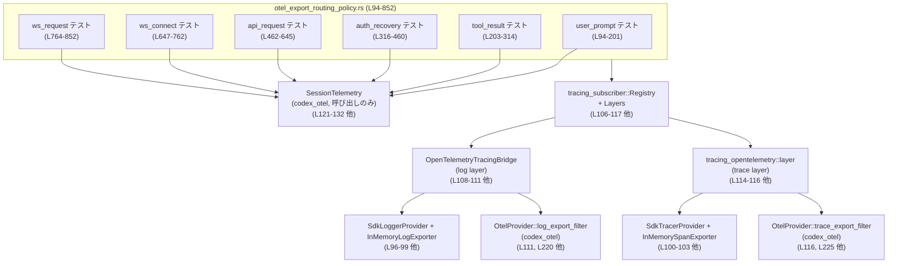
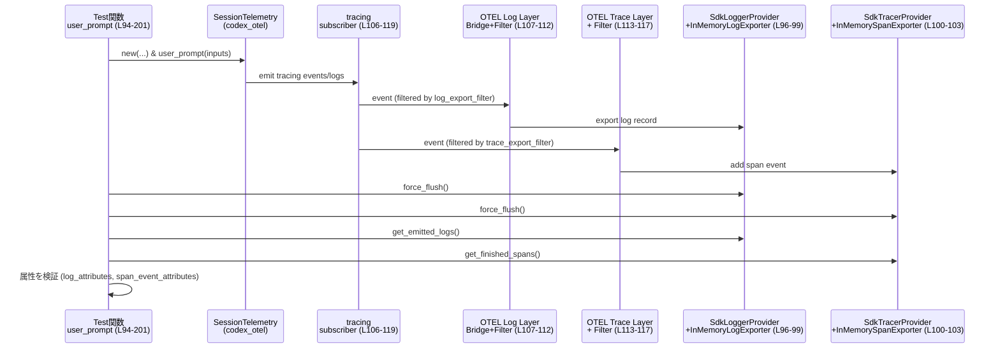

otel/tests/suite/otel_export_routing_policy.rs のテストコードについて解説します。

---

## 0. ざっくり一言

このファイルは、`SessionTelemetry` が生成する OpenTelemetry のログ・トレースが **「どの属性を log に出し、どの属性を trace に出すか」** というルーティングポリシーを、インメモリエクスポーターを用いて検証するテスト群です。  
特に、「ユーザーのプロンプトやメールアドレスなどの秘匿情報が trace には出ず、派生メトリクス（長さや件数）だけが出る」ことを検証しています（otel_export_routing_policy.rs:L94-201, L203-314, L316-460, L462-645, L647-762, L764-852）。

---

## 1. このモジュールの役割

### 1.1 概要

- このモジュールは **SessionTelemetry が発火するテレメトリイベントの log/trace の振り分けが期待通りか** を確認するためのテストです。  
- `InMemoryLogExporter` / `InMemorySpanExporter` を用いて、生成された OpenTelemetry レコードの属性を直接検査します（otel_export_routing_policy.rs:L8-12, L94-104 など）。  
- ユーザープロンプト、ツール実行結果、認証リカバリ、API リクエスト、WebSocket 接続/リクエストといった各イベントについて、  
  - ログ側には秘匿情報を含む詳細が出る  
  - トレース側には秘匿情報を含まず、主にメタ情報や統計値のみが出る  
  というポリシーを検証します（otel_export_routing_policy.rs:L135-147, L174-201, L244-254, L286-313 など）。

### 1.2 アーキテクチャ内での位置づけ

このテストは以下のコンポーネントの結合を検証しています：

- `SessionTelemetry`（codex_otel クレート）: イベント発火の API（例: `user_prompt`, `tool_result_with_tags`）（otel_export_routing_policy.rs:L121-132, L230-241 など）  
- `OtelProvider::{log_export_filter, trace_export_filter}`: tracing Layer のフィルタとして使用され、どのイベントを log / trace に送るかを制御（otel_export_routing_policy.rs:L111-117, L220-226 など）  
- `tracing_subscriber` + `tracing_opentelemetry` + `opentelemetry_appender_tracing`: tracing のイベントを OpenTelemetry SDK へブリッジ（otel_export_routing_policy.rs:L106-117, L215-226 など）  
- `InMemoryLogExporter` / `InMemorySpanExporter`: テストでレコードを取得するためのインメモリ実装（otel_export_routing_policy.rs:L96-104 など）

これを簡略な依存関係図で表します：



### 1.3 設計上のポイント

- **テスト用のインメモリ・エクスポーター**  
  - `InMemoryLogExporter` / `InMemorySpanExporter` を clone し、後で `get_emitted_logs` / `get_finished_spans` で結果を取得しています（otel_export_routing_policy.rs:L96-104, L152-153, L169-170 など）。  
- **共通セットアップパターン**  
  - すべてのテストで、logger provider・tracer provider・subscriber の構築パターンをほぼ共通化しています（otel_export_routing_policy.rs:L96-117, L205-226 など）。  
- **ログ/トレースの分離フィルタ**  
  - `OtelProvider::log_export_filter` と `OtelProvider::trace_export_filter` を `filter_fn` に渡し、  
    ログレイヤーとトレースレイヤーそれぞれに適用しています（otel_export_routing_policy.rs:L111-117, L220-226 など）。  
- **属性検査のヘルパー関数**  
  - `log_attributes`, `span_event_attributes`, `find_log_by_event_name`, `find_span_event_by_name_attr` という小さなヘルパーを定義し、  
    テストの記述を簡潔にしています（otel_export_routing_policy.rs:L28-41, L56-81）。  
- **プライバシー検証**  
  - prompt や email などのフィールドが **trace 側には存在しないこと** を明示的に `assert!(!attrs.contains_key(...))` で確認しています（例: otel_export_routing_policy.rs:L198-200, L310-313）。  

---

## 2. 主要な機能一覧

このファイル内で定義される主要機能は次の通りです。

- `log_attributes`: `SdkLogRecord` の属性を `BTreeMap<String, String>` に変換するユーティリティ（otel_export_routing_policy.rs:L28-33）。
- `span_event_attributes`: OpenTelemetry span event の属性を `BTreeMap<String, String>` に変換するユーティリティ（otel_export_routing_policy.rs:L35-41）。
- `any_value_to_string`: `AnyValue` を文字列化する共通関数（otel_export_routing_policy.rs:L43-53）。
- `find_log_by_event_name`: `event.name` 属性でログを検索し、見つからなければ panic するヘルパー（otel_export_routing_policy.rs:L56-67）。
- `find_span_event_by_name_attr`: `event.name` 属性で span event を検索し、見つからなければ panic するヘルパー（otel_export_routing_policy.rs:L69-81）。
- `auth_env_metadata`: 認証環境に関するメタデータ (`AuthEnvTelemetryMetadata`) を固定値で構築するヘルパー（otel_export_routing_policy.rs:L83-92）。
- テスト関数群:  
  - `otel_export_routing_policy_routes_user_prompt_log_and_trace_events`（ユーザープロンプトのルーティング）（L94-201）
  - `otel_export_routing_policy_routes_tool_result_log_and_trace_events`（ツール結果のルーティング）（L203-314）
  - `otel_export_routing_policy_routes_auth_recovery_log_and_trace_events`（認証リカバリのルーティング）（L316-460）
  - `otel_export_routing_policy_routes_api_request_auth_observability`（API リクエストの認証関連属性検証）（L462-645）
  - `otel_export_routing_policy_routes_websocket_connect_auth_observability`（WebSocket 接続の認証関連属性検証）（L647-762）
  - `otel_export_routing_policy_routes_websocket_request_transport_observability`（WebSocket リクエストのトランスポート・認証関連属性検証）（L764-852）

---

## 3. 公開 API と詳細解説

### 3.1 型一覧（構造体・列挙体など）

このファイル内で **新しく定義される型はありません**。  
ただし、テストの理解に重要な外部型を整理しておきます（いずれも import と使用のみで、定義は他ファイルです）。

| 名前 | 種別 | 出典 / 用途 |
|------|------|-------------|
| `SessionTelemetry` | 構造体 | `codex_otel` クレート。セッション単位でユーザー操作やネットワークイベントのテレメトリを記録する API。テストでは各イベントメソッドを呼び出します（L121-132, L230-241 他）。 |
| `TelemetryAuthMode` | 列挙体（推定） | 認証モード（`ApiKey`, `Chatgpt` など）を表す型。テストでは `SessionTelemetry::new` の引数に用いられます（L127, L349, L495, L680, L797）。|
| `AuthEnvTelemetryMetadata` | 構造体 | 認証関連の環境変数の有無などをまとめたメタデータ。`auth_env_metadata` で生成し、`SessionTelemetry::with_auth_env` に渡されます（L83-92, L501, L686, L803）。|
| `InMemoryLogExporter` | 構造体 | OpenTelemetry SDK のインメモリログエクスポーター。テストでログレコードを取得するために使用（L96, L205, L318, L464, L649, L766）。 |
| `InMemorySpanExporter` | 構造体 | OpenTelemetry SDK のインメモリ span エクスポーター。テストで終了した span を取得するために使用（L100, L209, L322, L468, L653, L770）。 |
| `SdkLogRecord` | 構造体 | OpenTelemetry SDK 内部のログレコード型。`log_attributes` で属性を走査します（L28, L152-156）。 |
| `ThreadId` | 新タイプ | `codex_protocol`。セッションを識別するスレッド ID。`SessionTelemetry::new` に渡されます（L121, L230, L344, L490, L675, L792）。 |

> これらの型の具体的なフィールドや実装は、別ファイルのためこのチャンクからは分かりません。

---

### 3.2 関数詳細（最大 7 件）

#### `log_attributes(record: &SdkLogRecord) -> BTreeMap<String, String>`

**概要**

`SdkLogRecord` が持つ属性をすべて走査し、`BTreeMap<String, String>` にして返すユーティリティです（otel_export_routing_policy.rs:L28-33）。  
テストでは、属性のキー/値を簡単に検索するために使われます（例: L158-167, L266-279）。

**引数**

| 引数名 | 型 | 説明 |
|--------|----|------|
| `record` | `&SdkLogRecord` | OpenTelemetry SDK が内部的に保持するログレコード。`attributes_iter()` で属性にアクセスします。 |

**戻り値**

- `BTreeMap<String, String>`  
  キーが属性名、値が文字列化された属性値のマップです。キーはソートされます（`BTreeMap`）。

**内部処理の流れ**

1. `record.attributes_iter()` で属性のイテレータを取得（L29-30）。
2. 各 `(key, value)` ペアに対し、`key.as_str().to_string()` でキーを `String` 化（L31）。
3. 値は `any_value_to_string(value)` で `AnyValue` から `String` に変換（L31, L43-53）。
4. `collect()` で `BTreeMap` にまとめて返します（L32）。

**Examples（使用例）**

テストでログを取り出して属性を検査する典型パターンです（L152-167）。

```rust
let logs = log_exporter.get_emitted_logs().expect("log export");
let prompt_log = find_log_by_event_name(&logs, "codex.user_prompt"); // event.name = codex.user_prompt を持つログ
let prompt_log_attrs = log_attributes(&prompt_log.record);           // すべての属性を BTreeMap として取得
assert_eq!(
    prompt_log_attrs.get("prompt").map(String::as_str),
    Some("super secret prompt"),
);
```

**Errors / Panics**

- この関数自身は明示的な `panic!` を起こしません。  
- メモリアロケーション失敗などの極端な状況以外は、安全に動作すると見なせます。

**Edge cases（エッジケース）**

- 属性が 1 つもないレコードの場合、空の `BTreeMap` が返ります（`collect()` の挙動から推測、コード上で特別扱いはありません）。  
- `AnyValue` が `ListAny` や `Map` など複合型の場合、`Debug` 表記 (`format!("{value:?}")`) になります（L50-52）。

**使用上の注意点**

- 値はすべて文字列化されるため、数値として再利用したい場合はパースし直す必要があります。  
- フィルタ付き比較などでは、`AnyValue` の元の型は失われる点に注意が必要です。

---

#### `span_event_attributes(event: &opentelemetry::trace::Event) -> BTreeMap<String, String>`

**概要**

OpenTelemetry の span event が持つ属性リストを `BTreeMap<String, String>` に変換します（L35-41）。  
テストでは、特定の span event の属性キー/値を手軽に検査するために使われます（L175-200, L287-313 など）。

**引数**

| 引数名 | 型 | 説明 |
|--------|----|------|
| `event` | `&opentelemetry::trace::Event` | ある span 上で発生したイベント。`attributes` フィールドに `KeyValue` のリストを持ちます（L37-40）。 |

**戻り値**

- `BTreeMap<String, String>`  
  `KeyValue` の `key` を文字列化したものをキー、`value.to_string()` したものを値とするマップです。

**内部処理**

1. `event.attributes.iter()` で `KeyValue` のスライスを反復（L37-38）。
2. `KeyValue { key, value, .. }` というパターンマッチでキーと値を取り出し（L39）。
3. `key.as_str().to_string()` と `value.to_string()` で `String` に変換（L39）。
4. `collect()` で `BTreeMap` にまとめて返却（L40）。

**Examples**

```rust
let span_events = &spans[0].events.events;
let prompt_trace_event = find_span_event_by_name_attr(span_events, "codex.user_prompt");
let prompt_trace_attrs = span_event_attributes(prompt_trace_event);
assert_eq!(
    prompt_trace_attrs.get("prompt_length").map(String::as_str),
    Some("19"),
);
```

**Errors / Panics**

- この関数自体に panic やエラー分岐はありません。

**Edge cases**

- 属性が空の event であれば、空の `BTreeMap` を返します。  
- `value.to_string()` の実際のフォーマットは `AnyValue` 実装に依存します（このファイルには定義がないため詳細不明）。

**使用上の注意点**

- 属性値は人間可読な文字列になりますが、構造化された型情報は失われます。

---

#### `any_value_to_string(value: &AnyValue) -> String`

**概要**

OpenTelemetry の `AnyValue` を、型ごとの分岐をしつつ `String` に変換する関数です（L43-53）。  
`log_attributes` からのみ使われています（L31, L43-53）。

**引数**

| 引数名 | 型 | 説明 |
|--------|----|------|
| `value` | `&AnyValue` | OpenTelemetry のログ属性値の共用体的な型。int / double / string / boolean / bytes / list / map 等を表せます（L45-51）。 |

**戻り値**

- `String`  
  各 `AnyValue` バリアントに応じた文字列表現。

**内部処理**

1. `match value` でバリアントごとに分岐（L44）。  
2. `Int`, `Double`, `Boolean` は `to_string()`（L45-48）。  
3. `String` は `value.as_str().to_string()`（L47）。  
4. `Bytes` は `String::from_utf8_lossy(value).into_owned()` で UTF-8 としてデコード（L49）。  
5. `ListAny` と `Map` は `format!("{value:?}")`（L50-51）。  
6. それ以外のバリアントも `_ => format!("{value:?}")` で `Debug` 表記（L52）。

**Errors / Panics**

- `from_utf8_lossy` は不正な UTF-8 を許容し、置換文字に変換するため panic はしません（L49）。
- その他の分岐でも panic はありません。

**Edge cases**

- 非 UTF-8 のバイト列は「置換文字を含む文字列」になります。  
- 新しい `AnyValue` バリアントが追加された場合は `_` マッチに入り `Debug` 表記されます。

**使用上の注意点**

- ロギングのテスト用途としては十分ですが、「逆変換」する前提ではない文字列化です。  
- JSON などの構造化形式を期待する場合は別途整形する必要があります。

---

#### `find_log_by_event_name<'a>(logs: &'a [LogDataWithResource], event_name: &str) -> &'a LogDataWithResource`

（実際の完全修飾型は `opentelemetry_sdk::logs::in_memory_exporter::LogDataWithResource` です（L56-60）。）

**概要**

`logs` 配列の中から、属性 `"event.name"` が `event_name` と一致する最初のレコードを探して返します（L56-67）。  
見つからない場合は `panic!("missing log event: {event_name}")` します。

**引数**

| 引数名 | 型 | 説明 |
|--------|----|------|
| `logs` | `&[LogDataWithResource]` | `InMemoryLogExporter::get_emitted_logs()` が返すログ配列（L152, L260, L373, L536, L710, L816）。|
| `event_name` | `&str` | 検索したいイベント名。テストでは `"codex.user_prompt"` などが渡されます（L158, L266, L374, L537, L711, L817）。 |

**戻り値**

- `&LogDataWithResource`  
  条件に一致した最初のログレコード。必ず存在すると仮定しています（見つからない場合は panic）。

**内部処理**

1. `logs.iter().find(...)` で線形検索（L60-65）。  
2. 各ログについて `log_attributes(&log.record)` で属性マップを作成（L62-63）。  
3. `"event.name"` キーの値が `Some(value)` かつ `value == event_name` であればマッチ（L63-64）。  
4. `find` の結果が `None` のとき `unwrap_or_else(|| panic!(...))` で panic（L66）。

**Examples**

```rust
let logs = log_exporter.get_emitted_logs().expect("log export");
let tool_log = find_log_by_event_name(&logs, "codex.tool_result"); // 該当イベントがないと panic
let attrs = log_attributes(&tool_log.record);
assert_eq!(attrs.get("arguments").map(String::as_str), Some("secret arguments"));
```

**Errors / Panics**

- 指定した `event_name` を持つログレコードが 1 件もない場合、`panic!("missing log event: {event_name}")` を起こします（L66-67）。  
  テストではこれ自体が「必ずイベントが発生しているべき」という前提のアサーション代わりになっています。

**Edge cases**

- 同じ `event.name` のログが複数ある場合は **最初の 1 件のみ** を返します（`iter().find` の仕様、L60-65）。  
- `"event.name"` 属性が存在しないログは検索対象になりません（L63）。

**使用上の注意点**

- 本来はテスト用のヘルパーであり、プロダクションコードでの利用は想定されていません（panic ベースのエラー処理）。  
- 複数イベントを検証したい場合は、`logs.iter().filter(...)` 等で呼び出し側を変える必要があります。

---

#### `find_span_event_by_name_attr<'a>(events: &'a [Event], event_name: &str) -> &'a Event`

**概要**

span event の配列から、属性 `"event.name"` が `event_name` と一致する最初のイベントを返します（L69-81）。  
見つからなければ panic します。

**引数**

| 引数名 | 型 | 説明 |
|--------|----|------|
| `events` | `&[opentelemetry::trace::Event]` | span が持つイベントのスライス（例: `&spans[0].events.events`、L171, L283, L417, L604, L746, L836）。 |
| `event_name` | `&str` | 検索したい `"event.name"` の値。テストでは `"codex.user_prompt"` 等（L174, L286, L420, L605, L747, L838）。 |

**戻り値**

- `&Event`  
  `"event.name"` が一致した最初のイベント。存在しない場合は panic。

**内部処理**

1. `events.iter().find(...)` で線形検索（L73-79）。  
2. 各イベントに対して `span_event_attributes(event)` を呼び出し、属性マップを作成（L76-77）。  
3. `"event.name"` キーの値が `event_name` と一致するイベントを選択（L77-78）。  
4. 見つからなければ `unwrap_or_else(|| panic!(...))` で panic（L80）。

**Errors / Panics**

- 指定イベントが見つからない場合に `panic!("missing span event: {event_name}")`（L80-81）。

**Edge cases**

- 同じ `"event.name"` のイベントが複数ある場合、最初のみ返します。  
- `"event.name"` 属性がないイベントはスキップされます。

**使用上の注意点**

- テスト用のため、エラーを `Result` ではなく panic で表現しています。  
- 複数イベントの検証では、ユーザー側で `filter` などを使う必要があります。

---

#### `auth_env_metadata() -> AuthEnvTelemetryMetadata`

**概要**

テストで使う「認証環境メタデータ」の固定値を生成するヘルパーです（L83-92）。  
`SessionTelemetry::with_auth_env` に渡され、log/trace に付与される `auth.env_*` 系属性の期待値になります（L501, L686, L803）。

**引数**

- なし。

**戻り値**

- `AuthEnvTelemetryMetadata`  
  以下のフィールドを持つ値を返します（L84-91）。

**内部処理**

1. `AuthEnvTelemetryMetadata { ... }` をリテラルで構築（L84-91）。
2. 各フィールドにテスト用の固定値を設定:  
   - `openai_api_key_env_present: true`（L85）  
   - `codex_api_key_env_present: false`（L86）  
   - `codex_api_key_env_enabled: true`（L87）  
   - `provider_env_key_name: Some("configured".to_string())`（L88）  
   - `provider_env_key_present: Some(true)`（L89）  
   - `refresh_token_url_override_present: true`（L90）

**Examples**

```rust
let manager = SessionTelemetry::new(/* 省略 */)
    .with_auth_env(auth_env_metadata()); // テスト用の環境メタデータを付加（L487-501, L672-687, L789-803）
```

**Errors / Panics**

- この関数内にエラー分岐や panic はありません。

**Edge cases**

- フィールドの一部は `Option` 型ですが、このヘルパーではすべて `Some(...)` または単純な bool で埋められています。

**使用上の注意点**

- 実際の環境状態とは無関係な固定値であるため、本番コードの挙動テストには適合しません。  
  あくまで「ルーティングポリシーが `AuthEnvTelemetryMetadata` を正しく log/trace に反映するか」の検証用です。

---

#### `otel_export_routing_policy_routes_user_prompt_log_and_trace_events()`

**概要**

ユーザープロンプト入力に対して、  

- ログには生のプロンプトとユーザー情報が含まれる  
- トレースイベントにはプロンプト長・入力件数などのメトリクスのみが含まれる（秘匿情報は含まれない）  
ことを検証するテストです（L94-201）。

**引数 / 戻り値**

- `#[test]` 関数であり、引数・戻り値はありません（L94-95）。  
- アサーションに失敗、または内部 helper の panic によりテストとして失敗します。

**内部処理の流れ**

1. **InMemory エクスポーターとプロバイダの構築**（L96-104）  
   - ログ用 `InMemoryLogExporter` と `SdkLoggerProvider`（L96-99）。  
   - span 用 `InMemorySpanExporter` と `SdkTracerProvider`（L100-103）。  
2. **tracing subscriber の構築**（L106-117）  
   - `OpenTelemetryTracingBridge::new(&logger_provider)` に `OtelProvider::log_export_filter` を適用した log layer（L107-112）。  
   - `tracing_opentelemetry::layer().with_tracer(tracer)` に `OtelProvider::trace_export_filter` を適用した trace layer（L113-117）。  
3. **subscriber をスコープ内デフォルトに設定**（L119）  
   - `tracing::subscriber::with_default(subscriber, || { ... })`。  
4. **SessionTelemetry の作成と user_prompt 呼び出し**（L121-147）  
   - `SessionTelemetry::new(...)` でマネージャを作成（L121-132）。  
   - `info_span!("root")` を開始し、そのスコープで `manager.user_prompt(&[UserInput::Text {...}, ...])` を呼び出す（L133-146）。  
5. **ログ・トレースの flush**（L149-150）。  
6. **ログの検証**（L152-167）  
   - すべてのログの `target` が `"codex_otel.log_only"` であることを確認（L152-156）。  
   - `event.name = "codex.user_prompt"` のログを取得し（L158-159）、`prompt` と `user.email` が期待値を持つことを確認（L160-167）。  
7. **トレースの検証**（L169-201）  
   - 終了した span が 1 つであり（L169-171）、イベントも 1 つであることを確認（L171-172）。  
   - `"codex.user_prompt"` イベントを取得し（L174-175）、  
     - `prompt_length = "19"`（L176-179）  
     - `text_input_count = "1"`（L181-185）  
     - `image_input_count = "1"`（L187-191）  
     - `local_image_input_count = "1"`（L193-197）  
     を確認。  
   - さらに `prompt`, `user.email`, `user.account_id` が trace イベントには **存在しない** ことを確認（L198-200）。

**Errors / Panics**

- `get_emitted_logs().expect("log export")` / `get_finished_spans().expect("span export")` は `Result` の `Err` を panic に変換します（L152-153, L169-170）。  
- `find_log_by_event_name` / `find_span_event_by_name_attr` も条件未満足で panic します（L158-159, L174-175）。  

**Edge cases / 契約**

- テストは「`codex.user_prompt` イベントが **必ず 1 回だけ** ログ/トレースに出る」という前提で書かれています（L171-172）。  
- prompt の長さは ASCII 文字列 `"super secret prompt"` で 19 文字のため、`prompt_length` はバイト数/文字数いずれでも 19 になります（L137-138, L176-179）。

**使用上の注意点（SessionTelemetry 観点）**

- ユーザーのプロンプト本文やメールアドレスが trace には出ていないことを確認しており、  
  「秘匿性の高い情報は log-only sink に送る」という設計ポリシーが前提になっています（L160-167, L198-200）。  
- 同様のポリシーで新しいイベントを追加する場合も、このテストを参考に「秘匿情報 vs 派生情報」を分離する必要があります。

---

#### `otel_export_routing_policy_routes_api_request_auth_observability()`

**概要**

API リクエスト実行時の認証周りのテレメトリ（ヘッダー有無、リカバリモード、環境変数状態など）が  
ログ/トレースに期待通り乗るかを検証するテストです（L462-645）。

**内部処理のポイントのみ抜粋**

- `SessionTelemetry::new(...).with_auth_env(auth_env_metadata())` で、認証環境メタデータ付きのマネージャを作成（L487-501）。  
- `conversation_starts(...)` で会話開始イベント、`record_api_request(...)` で API 要求イベントを記録（L504-530）。  
- ログ検証では、以下のような属性を確認（L536-602）。  
  - 会話開始ログ: `auth.env_openai_api_key_present = "true"`, `auth.env_provider_key_name = "configured"`（L540-549）。  
  - API リクエストログ: `auth.header_attached = "true"`, `auth.header_name = "authorization"`, `auth.retry_after_unauthorized = "true"`, `auth.recovery_mode = "managed"`, `auth.recovery_phase = "refresh_token"`, `endpoint = "/responses"`, `auth.error = "missing_authorization_header"`, `auth.env_codex_api_key_enabled = "true"`, `auth.env_refresh_token_url_override_present = "true"`（L553-601）。  
- span イベント検証では、  
  - 会話開始イベント: `auth.env_provider_key_present = "true"`（L605-613）。  
  - API リクエストイベント: `auth.header_attached`, `auth.header_name`, `auth.retry_after_unauthorized`, `endpoint`, `auth.env_openai_api_key_present` 等を確認（L615-643）。

**注目点**

- `auth_env_metadata()` から得られた情報が log/trace 双方に渡っていることを確認しており、  
  認証周りの observability が設計通りであることを保証するテストになっています。

---

### 3.3 その他の関数

残りのテスト関数も、上記と同様のパターンで「特定イベントについて、どの属性が log/trace に出るか」を検証しています。

| 関数名 | 役割（1 行） | 根拠 |
|--------|--------------|------|
| `otel_export_routing_policy_routes_tool_result_log_and_trace_events` | ツール実行結果イベント（`codex.tool_result`）について、ログには `arguments`／`output` 等の詳細が出るが、トレースには長さ・行数などのメトリクスのみが出ることを検証します。 | otel_export_routing_policy.rs:L203-314 |
| `otel_export_routing_policy_routes_auth_recovery_log_and_trace_events` | 認証リカバリイベント（`codex.auth_recovery`）について、ログとトレースの両方に認証状態・エラー情報が適切に出ることを検証します。 | L316-460 |
| `otel_export_routing_policy_routes_websocket_connect_auth_observability` | WebSocket 接続イベント（`codex.websocket_connect`）におけるヘッダー有無、エラー、接続再利用フラグ、環境メタデータ等の属性を検証します。 | L647-762 |
| `otel_export_routing_policy_routes_websocket_request_transport_observability` | WebSocket リクエスト完了イベント（`codex.websocket_request`）における接続再利用フラグ、エラーメッセージ、環境メタデータの log/trace 反映を検証します。 | L764-852 |

---

## 4. データフロー

代表的なシナリオとして、「ユーザープロンプトイベント」のデータフローを示します。

### 4.1 ユーザープロンプトのデータフロー

1. テスト関数が `SessionTelemetry::new` でマネージャを作成し、`user_prompt(&[UserInput::...])` を呼び出す（L121-147）。  
2. `user_prompt` 内部で tracing イベント / log が発行される（詳細実装はこのチャンクにはありません）。  
3. tracing イベントは `tracing_subscriber::registry()` に登録された 2 つの Layer に渡される（L106-117）。  
   - log Layer (`OpenTelemetryTracingBridge`) は `OtelProvider::log_export_filter` に通して `SdkLoggerProvider` → `InMemoryLogExporter` へ（L107-112, L96-99）。  
   - trace Layer (`tracing_opentelemetry::layer`) は `OtelProvider::trace_export_filter` に通して `SdkTracerProvider` → `InMemorySpanExporter` へ（L113-117, L100-103）。  
4. テスト終了直前に `force_flush()` が呼ばれ、エクスポーターにバッファされたログ/スパンが確実にメモリに反映される（L149-150）。  
5. テストコードが `get_emitted_logs()` / `get_finished_spans()` でレコードを取得し、属性を検証する（L152-201）。

これをシーケンス図で表します：



---

## 5. 使い方（How to Use）

ここでの「使い方」は、主に **テレメトリをテストする際のパターン** として捉えると有用です。

### 5.1 基本的な使用方法（テレメトリのテストパターン）

テストで SessionTelemetry の log/trace 出力を検証する基本フローは以下です（L96-150, L152-201 を簡略化）。

```rust
// 1. InMemory エクスポーターとプロバイダを構築する
let log_exporter = InMemoryLogExporter::default();                          // ログ用インメモリエクスポーター（L96）
let logger_provider = SdkLoggerProvider::builder()
    .with_simple_exporter(log_exporter.clone())                             // エクスポーターを登録（L97-99）
    .build();

let span_exporter = InMemorySpanExporter::default();                        // span 用インメモリエクスポーター（L100）
let tracer_provider = SdkTracerProvider::builder()
    .with_simple_exporter(span_exporter.clone())                            // エクスポーターを登録（L101-103）
    .build();
let tracer = tracer_provider.tracer("sink-split-test");                     // Tracer を作成（L104）

// 2. tracing subscriber を構築（ログ用・トレース用 Layer ＋ filter）
let subscriber = tracing_subscriber::registry()
    .with(
        opentelemetry_appender_tracing::layer::OpenTelemetryTracingBridge::new(&logger_provider)
            .with_filter(filter_fn(OtelProvider::log_export_filter)),       // ログ用 filter（L107-112）
    )
    .with(
        tracing_opentelemetry::layer()
            .with_tracer(tracer)
            .with_filter(filter_fn(OtelProvider::trace_export_filter)),     // トレース用 filter（L113-117）
    );

// 3. subscriber を有効化したスコープで SessionTelemetry を使う
tracing::subscriber::with_default(subscriber, || {                          // L119
    tracing::callsite::rebuild_interest_cache();                            // L120
    let manager = SessionTelemetry::new(/* 各種パラメータ */);             // L121-132
    let root_span = tracing::info_span!("root");                            // L133
    let _root_guard = root_span.enter();                                    // L134
    manager.user_prompt(/* ... */);                                         // L135-146 など
});

// 4. flush & 結果取得 & 検証
logger_provider.force_flush().expect("flush logs");                         // L149
tracer_provider.force_flush().expect("flush traces");                       // L150

let logs = log_exporter.get_emitted_logs().expect("log export");            // L152
let spans = span_exporter.get_finished_spans().expect("span export");       // L169
// log_attributes / span_event_attributes で属性を検査
```

このパターンは、他のテスト（tool_result, auth_recovery, api_request, websocket_*）でもほぼ同じ形で使われています（L205-259, L318-372, L464-535, L649-709, L766-814）。

### 5.2 よくある使用パターン

1. **ユーザー操作イベントの検証**（`user_prompt`, `tool_result_with_tags`）  
   - 目的: 入力や結果の内容を log-only にし、trace には統計情報だけ入っているかを検証（L94-201, L203-314）。  

2. **認証フローの検証**（`record_auth_recovery`, `record_api_request`, `record_websocket_connect`）  
   - 目的: 認証ヘッダーの有無、リカバリモード/フェーズ、request_id, cf_ray, error_code などが log/trace 両方に適切に入るかを検証（L316-460, L462-762）。  

3. **トランスポート状態の検証**（`record_websocket_request`）  
   - 目的: WebSocket リクエストにおける接続再利用フラグやエラーメッセージ、認証環境情報の伝播を確認（L764-852）。  

### 5.3 よくある間違い

このファイルから推測できる、ありがちなミスと正しいパターンを示します。

```rust
// 間違い例: subscriber を設定せずに SessionTelemetry を使う
let manager = SessionTelemetry::new(/* ... */);
// ここでイベント発火しても、OTEL SDK 側には何も流れない
manager.user_prompt(&[]);

// 正しい例: tracing subscriber を OTEL レイヤー付きで構成し、そのスコープ内で使う
let subscriber = tracing_subscriber::registry()
    .with(opentelemetry_appender_tracing::layer::OpenTelemetryTracingBridge::new(&logger_provider)
        .with_filter(filter_fn(OtelProvider::log_export_filter)))
    .with(tracing_opentelemetry::layer()
        .with_tracer(tracer)
        .with_filter(filter_fn(OtelProvider::trace_export_filter)));

tracing::subscriber::with_default(subscriber, || {
    tracing::callsite::rebuild_interest_cache();
    let manager = SessionTelemetry::new(/* ... */);
    manager.user_prompt(&[]);
});
```

また、`force_flush()` を呼ばないとテスト完了時点でエクスポーターのバッファに残っている可能性があるため、  
テストでは必ず flush 後に `get_emitted_logs` / `get_finished_spans` を呼んでいます（L149-150, L257-258, L370-371, L533-534, L707-708, L813-814）。

### 5.4 使用上の注意点（まとめ）

- **グローバル状態と並行性**  
  - `tracing::subscriber::with_default` により、スレッドローカルな「現在の subscriber」を一時的に差し替えています（L119, L228, L341, L487, L672, L789）。  
  - テストフレームワークがテストを並列実行する場合、他のコードが同時に `with_default` を使っていない限りは安全ですが、  
    グローバルな subscriber に依存するコードとの干渉には注意が必要です（一般的な tracing の注意点であり、このチャンクでは詳細不明）。  

- **panic ベースのアサーション**  
  - `find_log_by_event_name` / `find_span_event_by_name_attr` は、期待するイベントがない場合に panic します（L66-67, L80-81）。  
  - これはテストとしては有用ですが、ライブラリ関数としては `Result` を返す API に置き換えるのが一般的です。  

- **秘匿情報の扱い**  
  - テストは「ログとトレースで出ている属性が異なる」ことを前提に書かれており、  
    プライバシーに敏感な情報（プロンプト、メールアドレス等）は trace 側に出さない設計を検証しています（L160-167, L198-200, L272-279, L310-313）。  

---

## 6. 変更の仕方（How to Modify）

### 6.1 新しい機能を追加する場合（新しいテレメトリイベントのテスト）

新しい `SessionTelemetry` のイベントメソッドを追加した場合、このファイルにテストを追加する際の流れは次のようになります。

1. **既存テストのセットアップを再利用**  
   - `InMemoryLogExporter` / `InMemorySpanExporter`、`SdkLoggerProvider` / `SdkTracerProvider`、subscriber 構築コードをコピーし、  
     必要に応じて共有ヘルパーに切り出してもよいでしょう（L96-117, L205-226 など）。  
2. **SessionTelemetry の呼び出し**  
   - 新しいイベントメソッド（例: `manager.<new_event>(...)`）を root span のスコープ内で呼び出します（L133-146, L242-254 などを参考）。  
3. **flush & レコード取得**  
   - `force_flush()` を呼び出し、エクスポーターからログ/スパンを取得（L149-150, L152-153, L169-170）。  
4. **属性の検証**  
   - `find_log_by_event_name` / `find_span_event_by_name_attr` を使い、`log_attributes` / `span_event_attributes` で属性マップを取得。  
   - 「ログに出るべき属性」「トレースに出るべき属性」「トレースには出てはいけない属性」を `assert_eq!` / `assert!(!contains_key)` で検証します。

### 6.2 既存の機能を変更する場合（ルーティングポリシーの変更）

`SessionTelemetry` や `OtelProvider` 側で属性やルーティングポリシーを変更した場合、テスト側で注意すべき点:

- **影響範囲の確認**  
  - どのイベントがどの属性を出すかは、各テストの `assert_eq!` / `assert!(!contains_key)` に直接現れています。  
    - 例: prompt 関連は L160-167, L176-197, L198-200。  
    - tool result 関連は L268-279, L289-305, L310-313。  
    - auth_recovery 関連は L376-413, L422-459。  
    - api_request 関連は L551-601, L615-643。  
    - websocket 関連は L713-744, L748-761, L819-851。  
- **契約の明示**  
  - 「trace に出さないこと」がプライバシー上の契約になっている属性（prompt、email など）を、  
    もし trace 側にも出す設計に変えるなら、テストの期待値だけでなくポリシードキュメントの更新が必要です。  
- **テストの修正**  
  - 属性キー名や値の変更があれば、該当 `assert_eq!` の期待値を揃える必要があります。  
  - イベント数（`span_events.len()` など）に関するアサーションも、仕様変更に応じて更新します（L171-172, L283-284, L417-418）。

---

## 7. 関連ファイル

このテストモジュールと密接に関係するのは、インポートされている以下のコンポーネントです。  
ただし、**実際の定義ファイルのパスはこのチャンクからは分かりません**。

| パス / クレート | 役割 / 関係 |
|-----------------|------------|
| `codex_otel::SessionTelemetry` | 本テストが直接呼び出しているテレメトリ API。ユーザー操作・認証・ネットワークイベントの記録を行います（L121-132, L230-241, L344-354, L487-501, L672-687, L789-803）。 |
| `codex_otel::OtelProvider` | `log_export_filter` / `trace_export_filter` を提供し、tracing Layer による log/trace 振り分けロジックをカプセル化しています（L111-117, L220-226, L333-339, L479-485, L664-670, L781-787）。 |
| `codex_otel::AuthEnvTelemetryMetadata` | 認証関連の環境メタデータを保持する型で、`with_auth_env` を通じて SessionTelemetry に渡されます（L83-92, L501, L686, L803）。 |
| `opentelemetry_sdk::logs::InMemoryLogExporter` / `opentelemetry_sdk::trace::InMemorySpanExporter` | OpenTelemetry のインメモリエクスポーター。テストでログ・span を取得するための基盤です（L8-12, L96-104, L205-213, L318-326, L464-472, L649-657, L766-774）。 |
| `tracing_subscriber`, `tracing_opentelemetry`, `opentelemetry_appender_tracing` | tracing イベントを OpenTelemetry SDK にブリッジするためのライブラリ群。テストでは subscriber の構築に使用されています（L106-117, L215-226, L328-339, L474-485, L659-670, L776-787）。 |
| `codex_protocol` 系型 (`ThreadId`, `ReasoningSummary`, `AskForApproval`, `SandboxPolicy`, `SessionSource`, `UserInput`) | SessionTelemetry の API 引数として使われるドメイン型。テストではイベントの文脈や内容を構築するために使用しています（L21-26, L135-145, L505-514, L792-803 など）。 |

---

### Bugs / Security / Contracts まとめ（このファイルから読み取れる範囲）

- **バグの可能性**  
  - このファイルに顕著なロジックバグは見当たりません。helper 関数は単純で、テストも期待どおりの属性を明示的に検証しています。  
- **セキュリティ（プライバシー）**  
  - trace から秘匿情報を排除するポリシーがテストで明示されており、プライバシー保護を重視した設計がコードレベルで保証されています（L198-200, L310-313）。  
- **契約 / エッジケース**  
  - 各テストは、「指定イベントが必ず 1 回発生し、その属性セットが固定である」という強い契約のもとに書かれています（L171-172, L283-284, L417-418 など）。  
  - イベントが増減したり属性が変わった場合、テストが壊れることで変更を検出できます。  

このファイルは、本体実装の「テレメトリ・ルーティングポリシー」の仕様を、最も具体的に示すリファレンスとして利用できるテストコードになっています。
