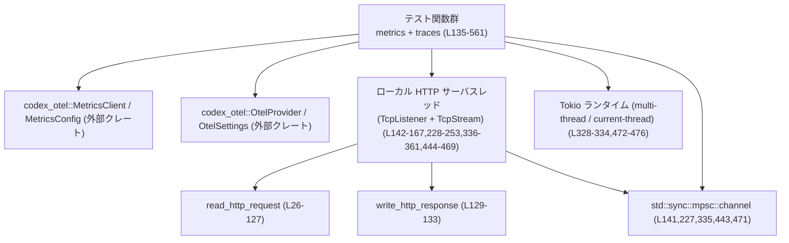
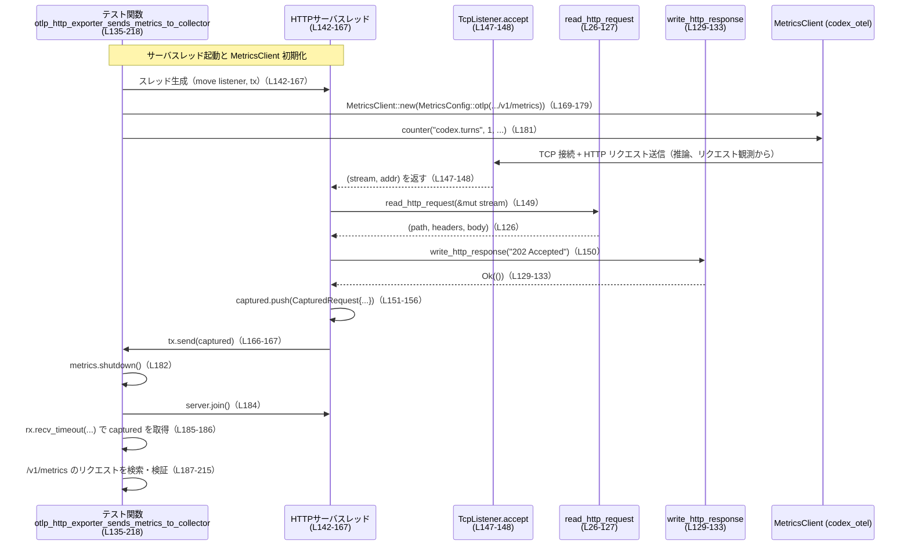

# otel\tests\suite\otlp_http_loopback.rs コード解説

※行番号は、この回答内で示したソース（先頭 `use` 行を 1）から自前で付与したものです。  
`otel\tests\suite\otlp_http_loopback.rs:L開始-終了` という形式で根拠行を示します。

---

## 0. ざっくり一言

- OTLP/HTTP エクスポータ（metrics / traces）が、想定どおりの HTTP リクエストを送るかを、ローカルの簡易 HTTP サーバに対してループバックで検証するテスト群です（metrics 1件、traces 3件）（L135-218, L220-326, L328-434, L436-561）。
- 自前実装のシンプルな HTTP リクエストパーサ（`read_http_request`）とレスポンス送信関数（`write_http_response`）を使って、Content-Type やボディ内容までチェックします（L26-133）。

---

## 1. このモジュールの役割

### 1.1 概要

- このファイルは、`codex_otel` クレートの **OTLP HTTP エクスポータ**（メトリクス・トレース）が、正しいエンドポイント・Content-Type・ペイロードでリクエストを送信することを確認するための **統合テスト** をまとめたものです（L135-218, L220-326, L328-434, L436-561）。
- テストごとにローカル `TcpListener` を立ち上げ、別スレッドで HTTP サーバとして待ち受け、`read_http_request` で 1 リクエスト分を読み取り、`CapturedRequest` としてチャンネル経由でテスト本体に返します（L137-167, L223-253, L331-361, L439-469）。
- テスト本体は `MetricsClient` / `OtelProvider` を OTLP HTTP 設定で初期化し、metrics 送信・span 発行・`shutdown` を行ったあと、受信した HTTP リクエストのパス・Content-Type・ボディの一部を `assert!` で検証します（L169-183, L255-285, L363-393, L478-510, L187-215, L290-323, L398-431, L525-558）。

### 1.2 アーキテクチャ内での位置づけ

このテストモジュール内の主なコンポーネントと依存関係は次のようになっています。



- テスト関数群は、`codex_otel` のクライアント API（metrics / traces）を利用しつつ、ローカル HTTP サーバスレッドとチャンネルで連携しています。
- 非同期環境の検証として、`#[tokio::test]` の multi-thread ランタイムと、自前で構築した current-thread ランタイムの双方で trace エクスポートをテストしています（L328-334, L472-476）。

### 1.3 設計上のポイント

- **責務分割**
  - `read_http_request` / `write_http_response` は HTTP レベルの入出力のみを担当し、テスト関数は OpenTelemetry の設定やアサーションに集中しています（L26-133, L135-218 など）。
  - HTTP サーバは各テストごとに独立したスレッドで動作し、受信したすべてのリクエストを `CapturedRequest` として集約してからチャンネルで返す構造です（L142-167, L228-253, L336-361, L444-469）。
- **状態管理**
  - `CapturedRequest` はリクエスト 1 件のスナップショット（パス・Content-Type・ボディバイト列）を保持する不変データ構造で、テスト側では `Vec<CapturedRequest>` を受け取り、その中から必要なパスのものを検索します（L20-24, L187-200, L290-303, L398-411, L525-538）。
- **エラーハンドリング**
  - ネットワーク I/O は `std::io::Result` / `Result<(), Box<dyn Error>>` で扱いつつ、テストの可読性を優先して多くの箇所で `expect` / `panic!` / `assert!` による失敗時即アボートのスタイルになっています（L137-139, L169-183, L185-215, L223-225 など）。
  - `read_http_request` は読み取りタイムアウト・ヘッダ/ボディサイズの上限・不正な UTF-8 など、代表的な異常系を `std::io::Error` として返すようになっています（L29-31, L58-61, L67-72, L78-83, L110-113, L116-121）。
- **並行性**
  - 各テストは
    - メインスレッド：OTEL クライアントの呼び出しとアサーション
    - サーバスレッド：`TcpListener.accept` ループ + `read_http_request`
    - （一部テストでは）Tokio ランタイムスレッド
    の複数スレッドを使用します（L142-167, L228-253, L336-361, L444-469, L472-520）。
  - スレッド間の同期には `std::sync::mpsc::channel` を用い、受信完了を `recv_timeout` で待つことでテストのデッドロックを避けています（L141, L185-186, L227, L288-289, L335, L396-397, L443, L523-524）。

---

## 2. 主要な機能一覧（コンポーネントインベントリー）

このファイル内の主な構造体・関数・テスト関数と役割です。

- 構造体
  - `CapturedRequest`：HTTP リクエスト 1 件のパス・Content-Type・ボディを保持（L20-24）。
- ヘルパー関数
  - `read_http_request`：`TcpStream` から 1 件分の HTTP リクエストを読み取り、パス・ヘッダ・ボディを返す（L26-127）。
  - `write_http_response`：指定されたステータスラインで、空ボディの HTTP レスポンスを送信する（L129-133）。
- テスト関数
  - `otlp_http_exporter_sends_metrics_to_collector`：OTLP HTTP metrics エクスポータが `/v1/metrics` に JSON で `codex.turns` メトリクスを送ることを検証（L135-218）。
  - `otlp_http_exporter_sends_traces_to_collector`：同期コードで構築した `OtelProvider` が `/v1/traces` に JSON で `trace-loopback` span と `codex-cli` サービス名を送ることを検証（L220-326）。
  - `otlp_http_exporter_sends_traces_to_collector_in_tokio_runtime`：`#[tokio::test]` multi-thread ランタイム上で同様の trace エクスポートが機能することを検証（L328-434）。
  - `otlp_http_exporter_sends_traces_to_collector_in_current_thread_tokio_runtime`：自前で構築した current-thread Tokio ランタイム内で trace エクスポートが機能することを検証（L436-561）。

---

## 3. 公開 API と詳細解説

### 3.1 型一覧（構造体）

| 名前             | 種別   | 役割 / 用途 | 根拠 |
|------------------|--------|-------------|------|
| `CapturedRequest`| 構造体 | ローカル HTTP サーバが受信した 1 リクエストのパス・Content-Type・ボディを保持するための内部用型です。テストスレッドへ送る `Vec<CapturedRequest>` の要素として使用します。 | `otel\tests\suite\otlp_http_loopback.rs:L20-24, L151-156, L237-242, L345-350, L453-458` |

この構造体はテストモジュール内専用であり、クレート外に公開されているわけではありません（`pub` なし、L20）。

---

### 3.2 関数詳細

#### `read_http_request(stream: &mut TcpStream) -> std::io::Result<(String, HashMap<String, String>, Vec<u8>)>`

**概要**

- `TcpStream` から HTTP/1.1 のリクエストを 1 件読み取り、  
  - リクエストパス `path`（例: `/v1/metrics`）
  - ヘッダ `HashMap<String, String>`
  - ボディ `Vec<u8>`
  を返す簡易パーサです（L26-28, L126）。  
- ローカルのテストサーバ用に作られており、`Content-Length` ベースのシンプルなリクエストのみを想定しています。

**引数**

| 引数名   | 型          | 説明 |
|----------|-------------|------|
| `stream` | `&mut TcpStream` | クライアントからの HTTP リクエストが到着する TCP ストリームです。関数内で読み取りタイムアウトを設定し、読み込みに利用します（L29, L34）。 |

**戻り値**

- `Ok((path, headers, body))`：
  - `path`：`GET /v1/metrics HTTP/1.1` のようなリクエストラインから取り出したパス文字列（L85-93）。
  - `headers`：ヘッダ名を小文字化したキーにしたマップ（例: `"content-type"`）（L95-101）。
  - `body`：ボディ部の生バイト列。`Content-Length` が存在する場合、その長さまで読み込み・切り詰め済みです（L103-124）。
- `Err(std::io::Error)`：タイムアウト・EOF・不正なフォーマットなどが発生した場合（L40-44, L58-61, L67-72, L78-83, L110-113, L116-121）。

**内部処理の流れ**

1. ストリームに 2 秒の読み取りタイムアウトを設定し、絶対期限 `deadline` を計算します（L29-30）。
2. クロージャ `read_next` を定義し、`stream.read(buf)` をラップして  
   - `WouldBlock`/`Interrupted` の場合は `deadline` までリトライ（5ms スリープ）  
   - それ以外の `Err` はそのまま返す  
   という挙動を実現します（L32-51）。
3. ヘッダの終端 `\r\n\r\n` が現れるまで、`scratch` バッファを使って `buf` に読み足します。  
   - EOF (`n == 0`) なら `UnexpectedEof`（L57-61）。  
   - バッファ長が 1 MiB を超えたら「headers too large」で `InvalidData` エラー（L67-72）。
4. `buf` をヘッダ部と残り（ボディの先頭）に分割します（L75-76）。
5. ヘッダ部を UTF-8 としてパースし、  
   - 1 行目をリクエストラインとして `path` を抽出（L78-93）。  
   - 以降の各行を `:` 区切りで `HashMap` に格納（キーは小文字化）（L95-101）。
6. `"content-length"` ヘッダが数値としてパースできた場合、その長さ `len` まで `body_bytes` を読み足し、超過 1 MiB を検出したらエラーとします（L103-121）。最後に `body_bytes.truncate(len)` します（L123）。
7. `(path, headers, body_bytes)` を `Ok` で返します（L126）。

**Examples（使用例）**

サーバスレッド内での利用パターン（簡略化）です。

```rust
// リスナからクライアント接続を受け付ける
let (mut stream, _) = listener.accept()?; // L147-148 相当

// 1 リクエスト分を読み取る
let (path, headers, body) = read_http_request(&mut stream)?; // L149, L151-156 相当

println!("path = {path}, content-type = {:?}", headers.get("content-type"));
```

**Errors / Panics**

- `Err(std::io::Error)` になる主な条件：
  - 読み取りが 2 秒を超えても完了せず `WouldBlock` / `Interrupted` が続く場合 → `TimedOut`（L40-44）。
  - ヘッダ終端が来る前に EOF → `UnexpectedEof` 「EOF before headers」（L57-61）。
  - ヘッダサイズが 1 MiB 超 → `InvalidData` 「headers too large」（L67-72）。
  - ヘッダ部が UTF-8 でない → `InvalidData` 「headers not utf-8: ...」（L78-83）。
  - ボディ読み込み中の EOF → `UnexpectedEof` 「EOF before body complete」（L110-113）。
  - ボディサイズが宣言長 + 1 MiB 超 → `InvalidData` 「body too large」（L116-121）。
- 関数内で `panic!` は使用していません。

**Edge cases（エッジケース）**

- `Content-Length` ヘッダがない場合：
  - 既に読み込まれたヘッダ終端以降のバイト列のみが `body` として返され、追加読み込みは行われません（L103-106 の条件に入らない）。
- `Content-Length` が 0 の場合：
  - 追加の読み込みループは実行されず、`truncate(0)` により空ボディが返ります（L107-124）。
- 不完全なヘッダ行（`:` を含まない行）は無視されます（L97-99）。
- `Content-Length` が負値や非常に大きい値を表す文字列の場合：
  - `usize` へのパースに失敗した場合はヘッダなし扱いとなり、追加読み込みは行われません（L103-106）。  
  - パースに成功したが非常に大きい値の場合、実データが足りず `EOF before body complete` になる可能性があります。

**使用上の注意点**

- HTTP/1.1 のごく単純なケースのみを扱う簡易パーサであり、
  - `Transfer-Encoding: chunked`
  - 複数リクエストのパイプライン
  などには対応していません（コードから実装がないことが分かるのみ、L103-124）。
- テストではローカル・短時間での実行を前提としており、2 秒タイムアウトや 1 MiB の上限値はハードコードされています（L29-30, L67-72, L116-121）。  
  本番用途に流用する場合は、これらを設定値化する必要があります。

---

#### `write_http_response(stream: &mut TcpStream, status: &str) -> std::io::Result<()>`

**概要**

- HTTP/1.1 のレスポンスヘッダ（空ボディ、`Content-Length: 0`、`Connection: close`）を指定ステータスで送信します（L129-133）。
- テスト用サーバがクライアントへの最低限のレスポンスを返すために使用されます（L150, L236, L344, L452）。

**引数**

| 引数名  | 型             | 説明 |
|---------|----------------|------|
| `stream`| `&mut TcpStream` | レスポンスを書き込む接続済みの TCP ストリームです。 |
| `status`| `&str`         | ステータスラインに挿入されるステータス部分（例: `"202 Accepted"`）（L129-130）。 |

**戻り値**

- 書き込み・フラッシュが成功すれば `Ok(())`、失敗すれば `Err(std::io::Error)` を返します（L131-133）。

**内部処理の流れ**

1. `format!` で `HTTP/1.1 {status}\r\nContent-Length: 0\r\nConnection: close\r\n\r\n` というレスポンス文字列を組み立てる（L130）。
2. `write_all` で全バイトを書き込み、`flush` で送信を確定させる（L131-132）。

**Examples（使用例）**

```rust
// リクエスト処理後、202 Accepted を返す
write_http_response(&mut stream, "202 Accepted")?; // L150, L236, L344, L452 相当
```

**Errors / Panics**

- `stream.write_all` や `stream.flush` が I/O エラーを返した場合に `Err` を伝搬します（L131-132）。
- `panic!` は使用していません。

**Edge cases / 使用上の注意点**

- 常に `Content-Length: 0` かつ空ボディでレスポンスを返すため、ボディ付きレスポンスが必要なケースには対応していません（L130）。
- `Connection: close` が固定であるため、コネクション再利用は行われません。

---

以下のテスト関数は、すべて「テストシナリオ」を表すものであり、外部から再利用される API ではありませんが、挙動理解のために簡潔に整理します。

#### `otlp_http_exporter_sends_metrics_to_collector() -> codex_otel::Result<()>`

**概要**

- `MetricsClient` を OTLP HTTP (JSON) エクスポータ付きで初期化し、`counter("codex.turns", ...)` 呼び出しによって `/v1/metrics` への HTTP リクエストが送信されることを検証します（L169-183, L187-215）。

**主な処理フロー**

1. ローカル `TcpListener` を `127.0.0.1:0`（任意ポート）でバインドし、非ブロッキングに設定（L137-139）。
2. `Vec<CapturedRequest>` を送る mpsc チャンネルを作成し、別スレッドでサーバループを実行（L141-167）。
   - `listener.accept` 成功ごとに `read_http_request` で 1 リクエスト読み、`write_http_response("202 Accepted")` を返送し、`CapturedRequest` として `captured` ベクタに蓄積（L147-157）。
   - 3 秒間の締切まで `WouldBlock` をリトライし、それ以外のエラーでループ終了（L144, L146-163）。
3. メインスレッドで `MetricsClient::new(MetricsConfig::otlp(...))` を呼び出し、`OtelExporter::OtlpHttp` を `endpoint: http://{addr}/v1/metrics` で構成（L169-179）。
4. `metrics.counter("codex.turns", 1, &[("source", "test")])?;` でメトリクスをインクリメントし、`metrics.shutdown()?;` でエクスポータを終了（L181-182）。
5. サーバスレッドを join し（L184）、チャンネルから `captured` を受信（1 秒タイムアウト付き、L185-186）。
6. `path == "/v1/metrics"` のリクエストを検索し、`Content-Type` が `"application/json"` で始まっていること、ボディ文字列に `"codex.turns"` が含まれることを `assert!` で確認（L187-215）。

**Errors / Edge cases**

- `MetricsClient::new` などが `Err` を返した場合、テストは早期に `Err` で終了します（L169-180）。
- 期待する `/v1/metrics` リクエストが見つからない場合、`panic!` で詳細（受信したパス一覧）を表示します（L187-200）。
- `Content-Type` が欠落している場合は `<missing content-type>` と比較し、`starts_with("application/json")` に失敗すればテスト失敗となります（L201-208）。

---

#### `otlp_http_exporter_sends_traces_to_collector() -> Result<(), Box<dyn Error>>`

**概要**

- 同期コードで構築した `OtelProvider` を使い、`tracing` span を 1 つ発行した際に、`/v1/traces` に JSON で `trace-loopback` span と `codex-cli` サービス名が送信されることを検証します（L255-285, L290-323）。

**主な処理フロー**

- HTTP サーバ部分は metrics テストと同じ（L223-253）。
- `OtelProvider::from(&OtelSettings { ... })?` で
  - `trace_exporter: OtelExporter::OtlpHttp { endpoint: http://{addr}/v1/traces, protocol: Json }` を設定（L255-268）。
- `otel.tracing_layer()` を `tracing_subscriber::registry().with(...)` に組み込み、`tracing::subscriber::with_default` のスコープ内で span を発行（L271-284）。
- span 名 `"trace-loopback"`・属性 `"otel.name" = "trace-loopback"`・サービス名 `"codex-cli"` がリクエストボディに含まれることを検証（L275-281, L313-323）。

---

#### `otlp_http_exporter_sends_traces_to_collector_in_tokio_runtime() -> Result<(), Box<dyn Error>>`

**概要**

- `#[tokio::test(flavor = "multi_thread", worker_threads = 2)]` による multi-thread Tokio ランタイム上でも、前述の trace エクスポートが機能することを確認します（L328-334, L363-393, L398-431）。

**特徴**

- テスト関数自体が `async fn` として宣言されており、`otel.shutdown()` を `await` せず同期的に呼び出していますが、内部実装が非同期ランタイム上で正しく動くかどうかの検証になっています（L328-334, L393）。

---

#### `otlp_http_exporter_sends_traces_to_collector_in_current_thread_tokio_runtime() -> Result<(), Box<dyn Error>>`

**概要**

- 自前で `tokio::runtime::Builder::new_current_thread()` を用いて current-thread ランタイムを構築し、その中で `OtelProvider` と trace エクスポートが利用できることを検証します（L472-476, L478-510）。

**主な処理フロー**

1. HTTP サーバスレッドは他のテストと同様（L439-469）。
2. 別スレッド `runtime_thread` を起動し、その中で current-thread ランタイムを構築（L472-476）。
3. `runtime.block_on(async move { ... })` の非同期ブロック内で `OtelProvider::from(...)` を初期化し、`tracing` span を発行、`otel.shutdown()` を呼び出す（L478-510）。
4. `std::result::Result<(), String>` を mpsc チャンネルで外側に返し、メインスレッド側で `recv_timeout` して `std::io::Error::other` にマッピングすることでエラーを伝搬（L471, L516-519）。
5. 最後に HTTP サーバから `CapturedRequest` を受信し、`trace-loopback-current-thread` と `codex-cli` がボディに含まれることを検証（L522-558）。

---

### 3.3 その他の関数

- このファイルには上記以外の補助関数はありません。

---

## 4. データフロー

ここでは metrics テスト（`otlp_http_exporter_sends_metrics_to_collector`）を例に、リクエストデータの流れを示します。

1. テスト関数がローカル HTTP サーバをスレッドで起動し（L141-167）、同時に `MetricsClient` を OTLP HTTP 設定で初期化します（L169-179）。
2. `metrics.counter(...)` 呼び出しにより、`codex_otel` 内部で `/v1/metrics` 宛の HTTP リクエストが生成され、ローカルサーバへ送信されます（L181）。
3. サーバスレッド側は `listener.accept` で接続を受け付け、`read_http_request` によりリクエストをパースして `CapturedRequest` をベクタに蓄積し、`write_http_response` で `202 Accepted` を返します（L147-157, L149-151）。
4. テスト関数は `metrics.shutdown()` を呼んだあとサーバスレッドを join し、チャンネルから `Vec<CapturedRequest>` を受信してパス・Content-Type・ボディを検証します（L182-186, L187-215）。



この流れは traces テストでもほぼ同様であり、エンドポイントが `/v1/traces` になっている点だけが異なります（L262, L370, L486）。

---

## 5. 使い方（How to Use）

このファイル自体はテスト専用ですが、以下は「ローカル OTLP/HTTP ループバックテストを書く」ときの利用イメージとして参考になります。

### 5.1 基本的な使用方法（パターン）

最小限の構成を抜き出すと、次のような流れになります（metrics テストに相当）。

```rust
use std::collections::HashMap;
use std::net::TcpListener;
use std::sync::mpsc;
use std::time::Duration;
use std::thread;

use codex_otel::{MetricsClient, MetricsConfig, OtelExporter, OtelHttpProtocol};

// 1. ローカル HTTP サーバを起動する
let listener = TcpListener::bind("127.0.0.1:0").expect("bind");
let addr = listener.local_addr().expect("local_addr");
listener.set_nonblocking(true).expect("set_nonblocking");

let (tx, rx) = mpsc::channel(); // Vec<CapturedRequest> を送るチャンネル（L141）
thread::spawn(move || {
    // accept + read_http_request + write_http_response ...（L142-167）
    /* ... */
    let _ = tx.send(captured);
});

// 2. OTLP HTTP エクスポータ付き MetricsClient を構成する
let metrics = MetricsClient::new(MetricsConfig::otlp(
    "test",                       // environment（L169-171）
    "codex-cli",                  // service_name
    env!("CARGO_PKG_VERSION"),    // service_version
    OtelExporter::OtlpHttp {
        endpoint: format!("http://{addr}/v1/metrics"),
        headers: HashMap::new(),
        protocol: OtelHttpProtocol::Json,
        tls: None,
    },
))?;

// 3. メトリクスを送信して shutdown
metrics.counter("codex.turns", 1, &[("source", "test")])?; // L181
metrics.shutdown()?;                                       // L182

// 4. サーバ側から受信結果を取得して検証
let captured = rx.recv_timeout(Duration::from_secs(1)).expect("captured");
```

### 5.2 よくある使用パターン

- **同期コードでの Trace エクスポート検証**（L220-326）
  - `OtelProvider::from(&OtelSettings{ ... })` の `trace_exporter` に `OtlpHttp` を指定し、
  - `tracing_subscriber::registry().with(otel.tracing_layer()?)` で `tracing` と連携。
- **Tokio multi-thread ランタイム上での検証**（L328-434）
  - `#[tokio::test(flavor = "multi_thread")]` を利用し、テスト関数自体を `async` にする。
- **Current-thread ランタイムを自前構築しての検証**（L472-510）
  - テストスレッドとは別スレッドで `new_current_thread()` ランタイムを起動し、その中で `OtelProvider` を初期化・利用する。

### 5.3 よくある間違い・注意点

このコードから推測できる「やりがちな誤り」とその対策です。

- **`shutdown` を呼ばずにテスト終了**
  - metrics/traces テストとも、最後に `shutdown()` を呼んでからサーバを join しています（L182, L285, L393, L510）。  
    これによりバッファされたデータが確実に送信されます。
- **サーバスレッドの結果を待たずにアサーションする**
  - `server.join()` と `rx.recv_timeout` によって、全てのリクエスト受信完了を待ってから検証しています（L184-186, L287-289, L395-397, L522-524）。
- **Tokio ランタイムのライフサイクル管理**
  - current-thread ランタイム版では、`runtime.block_on` の非同期ブロック内で OTEL の利用と `shutdown` を完結させ、結果を別のチャンネルでメインスレッドへ返しています（L478-510, L516-519）。  
    これによりランタイムの終了前に全ての非同期処理が完了することが保証されます。

### 5.4 使用上の注意点（まとめ）

- このモジュールの HTTP 実装（`read_http_request` / `write_http_response`）は **テスト専用** であり、HTTP の全機能はカバーしていません（L26-127, L129-133）。
- タイムアウトや最大サイズがハードコードされているため、大量のデータや高遅延環境での利用には向きません（L29-30, L67-72, L110-121）。
- `TcpListener` / `TcpStream` はテストごとにローカルアドレスで新規に確保されており、他のテストとポート競合しない設計になっています（L137, L223, L331, L439）。
- 並行性に関しては、
  - サーバ側で `listener.set_nonblocking(true)` と I/O タイムアウトを組み合わせることで、テストが無限待ち状態にならないようにしています（L139, L29-31）。
  - mpsc チャンネルの `recv_timeout` により、一方のスレッドがハングしてもテストが一定時間で fail するようになっています（L185-186, L288-289, L396-397, L523-524）。

---

## 6. 変更の仕方（How to Modify）

### 6.1 新しい機能（テストケース）を追加する場合

たとえば「ログエクスポータの OTLP HTTP テスト」などを追加するときの流れです。

1. **HTTP サーバ部分の再利用**
   - 既存テストと同様に `TcpListener::bind("127.0.0.1:0")` + `set_nonblocking(true)` + サーバスレッド + `mpsc::channel` というパターンを再利用します（L137-167 など）。
   - `endpoint` だけ `/v1/logs` のように変更します。
2. **OTEL 設定の拡張**
   - `OtelSettings` や `MetricsConfig::otlp` の設定方法は、このファイルだけでは詳細不明ですが（外部クレート、L2-6, L255-268）、既存テストの設定をコピーしてエクスポータ種別・パスだけ変更するのが安全です。
3. **アサーションの追加**
   - `CapturedRequest` からパス・Content-Type・ボディを取り出し、既存テストと同様に `assert!` で検証します（L187-215, L290-323, L398-431, L525-558）。

### 6.2 既存の機能を変更する場合の注意点

- **`read_http_request` を変更する場合**
  - インターフェース（戻り値 `(String, HashMap<String, String>, Vec<u8>)`）は、すべてのサーバスレッドから利用されているため（L149, L235, L343, L451）、変更すると全テストに影響します。
  - サイズ上限やタイムアウト値を変えると、テストの失敗条件も変わるため、意図した仕様としてコメント等で明示すると安全です。
- **エンドポイントのパスを変更する場合**
  - metrics: `/v1/metrics`（L174, L189）、traces: `/v1/traces`（L262, L291, L370, L399, L486, L527）に依存してアサーションしているため、両方を揃えて変更する必要があります。
- **Tokio ランタイム関連コードの変更**
  - `#[tokio::test]` 版・current-thread 版は「異なるランタイム構成でも動くこと」を検証しているので（L328-334, L472-476）、ランタイム構成を変更する場合はテスト意図（何を検証したいか）を確認してから更新するのが安全です。

### 6.3 潜在的な問題・セキュリティ上の注意

- このファイルはテストコードであり、`127.0.0.1` のみにバインドしているため、外部から直接アクセスされる前提ではありません（L137, L223, L331, L439）。
- HTTP パーサは最小限であり、ヘッダ・ボディサイズの上限チェックはありますが（L67-72, L116-121）、プロトコル仕様を完全には満たしていません。  
  本番コードに流用すると、予期しない入力で誤動作する可能性があります。
- エラー時の詳細ログ出力はほぼ行っておらず、`expect` / `panic!` に頼っているため、テスト失敗時の情報は限定的です（ただしパスやボディの先頭は表示しており、デバッグにはある程度有用です：L196-199, L299-302, L407-410, L535-537）。

### 6.4 性能・スケーラビリティ・トレードオフ（テストとして）

- 同時接続数は 1 テストあたりごく少数に限定されているため、`Vec<CapturedRequest>` と単純なループで十分です（L143-167 等）。
- I/O は全てブロッキングで、busy-loop を避けるために短い sleep を挟んでいます（L46-47, L160-161, L246-247, L354-355, L462-463）。  
  テスト用途ではシンプルさのメリットが大きく、これで十分です。
- より大規模な負荷試験や高並行度検証が必要な場合には、非同期 I/O や HTTP ライブラリ（hyper 等）の利用を検討する余地がありますが、このファイルからはそうした要求は読み取れません。

### 6.5 観測性（Observability）

- OTEL の metrics / traces 自体が観測データですが、このテストコード内では、HTTP サーバ側のログなどは行っていません。
- テスト失敗時には `panic!` メッセージにパス一覧やボディの先頭 2000 文字が含まれるため（L196-199, L299-302, L407-410, L535-537）、問題の切り分けには一定程度役立ちます。
- さらに詳細なデバッグが必要な場合は、`read_http_request` 内やサーバループ内に `eprintln!` や `tracing` ログを追加する余地があります。

---

## 7. 関連ファイル

このファイルから参照されている主な外部コンポーネントと、その関係です。  
（具体的なファイルパスはこのチャンクには現れないため「不明」としています。）

| パス / 型名                         | 役割 / 関係 |
|-------------------------------------|------------|
| `codex_otel::MetricsClient`         | OTLP エクスポータ付きメトリクスクライアント。`MetricsConfig::otlp` で構成し、`counter` / `shutdown` をテスト内から利用しています（L1-2, L169-183）。 |
| `codex_otel::MetricsConfig`         | `MetricsClient` の設定型。`otlp(...)` ファクトリメソッドで OTLP HTTP エクスポータ設定を行います（L2, L169-179）。 |
| `codex_otel::OtelExporter`          | OTLP エクスポータ設定の列挙体。`OtlpHttp` バリアントを metrics / trace で使用しています（L3, L173-178, L260-267, L368-374, L484-490）。 |
| `codex_otel::OtelHttpProtocol`      | HTTP プロトコル表現。ここでは `Json` が指定されています（L4, L176, L264, L372, L488）。 |
| `codex_otel::OtelProvider`          | OpenTelemetry プロバイダ。`OtelSettings` から構築し、`tracing_layer`・`shutdown` を利用しています（L5, L255-270, L271-285, L363-379, L478-510）。 |
| `codex_otel::OtelSettings`          | OTEL 設定構造体。環境名・サービス名・バージョン・エクスポータ設定などをまとめて渡します（L6, L255-268, L363-377, L478-493）。 |
| `codex_otel::Result`                | `otlp_http_exporter_sends_metrics_to_collector` の戻り値に使われるエイリアス型（L7, L135-136）。 |
| `tracing_subscriber::registry`      | `OtelProvider` から取得した `tracing_layer` を組み込むために使用（L18, L271-272, L379-380, L496-497）。 |
| `tokio::runtime::Builder`           | current-thread ランタイムを構築するために利用（L472-476）。 |

このファイルは、これらの外部型の **利用例・統合テスト** を提供している位置づけです。内部実装の詳細（どのように HTTP リクエストを組み立てているか等）は、このチャンクからは分かりません。
