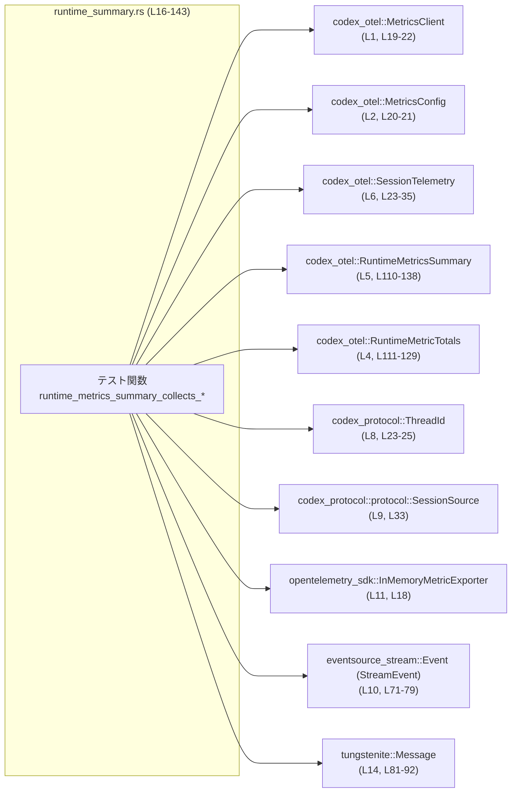
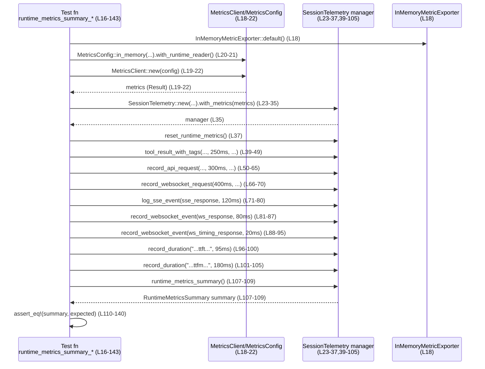

# otel/tests/suite/runtime_summary.rs コード解説

## 0. ざっくり一言

このテストファイルは、`SessionTelemetry` が収集するランタイムメトリクス（ツール呼び出し、HTTP API、SSE/WS ストリーミング、レスポンス API タイミング、ターン TTFT/TTFM）が `runtime_metrics_summary` に正しく集約されることを検証するものです（`runtime_summary.rs:L16-140`）。

---

## 1. このモジュールの役割

### 1.1 概要

- このモジュールは、**セッション中に記録した各種メトリクスが要約構造体 `RuntimeMetricsSummary` に正しく反映されるか**を確認します。
- ツール呼び出し、HTTP API 呼び出し、WebSocket/SSE ベースのストリーミングイベント、レスポンス API のタイミング情報、ターンごとの TTFT/TTFM を 1 回ずつ（または複数回）記録し、それらが期待通りの合計回数・合計時間として集計されるかを検証します（`runtime_summary.rs:L39-105`, `L110-138`）。

### 1.2 アーキテクチャ内での位置づけ

このテストは、`codex_otel` クレートのテレメトリ機能の上に載るユニットテストです。外部コンポーネントとの関係は次のように整理できます。



- テスト関数は、`MetricsClient` と `SessionTelemetry` を初期化したうえで、各種メトリクス記録用メソッドを呼び出し（`runtime_summary.rs:L39-105`）、最後に `runtime_metrics_summary` を取得して検証します（`L107-140`）。
- 実際のメトリクス集約ロジックは `codex_otel` クレート側にあり、本ファイルには実装は現れていません。この点は「このチャンクには現れない」情報です。

### 1.3 設計上のポイント（テストコードとして）

- **In-memory エクスポータの利用**  
  - `InMemoryMetricExporter` を使い、外部システムに依存しないメトリクス収集環境を構築しています（`runtime_summary.rs:L18`）。
- **セッション単位の管理オブジェクト**  
  - `SessionTelemetry::new(...).with_metrics(metrics)` により、スレッド ID などセッション情報とメトリクスクライアントを束ねた `manager` を生成しています（`L23-35`）。
- **リセットから記録 → 集約まで一連の流れをテスト**  
  - `reset_runtime_metrics` で状態を初期化した後（`L37`）、各種記録メソッドを 1 回ずつ呼び、最後に `runtime_metrics_summary` でまとめて検証する構成です（`L39-140`）。
- **エラー処理は `Result` と `?` 演算子**  
  - テスト関数自体が `Result<()>` を返し、メトリクスクライアント初期化失敗などは `?` によって即座にテスト失敗となる設計です（`L17, L19-22`）。
- **並行性要素は本テストには登場しない**  
  - tokio / WebSocket / SSE と関連する型は利用しますが、`async` / `await` やスレッド生成はなく、このテスト自体は同期的に実行されます（`L71-95`）。

---

## 2. 主要な機能一覧（コンポーネントインベントリー）

### 2.1 このファイル内の関数・テスト一覧

| 名前 | 種別 | 役割 / 用途 | 位置 |
|------|------|-------------|------|
| `runtime_metrics_summary_collects_tool_api_and_streaming_metrics` | テスト関数 (`#[test]`) | 各種メトリクスを 1 回ずつ記録し、`RuntimeMetricsSummary` に正しく集約されることを検証する | `runtime_summary.rs:L16-143` |

### 2.2 主な外部コンポーネント一覧（このファイルから見える範囲）

> ここでは「このテストから直接呼ばれている/使われている」ことだけを根拠に説明します。内部実装はこのチャンクには現れません。

| 名前 | 種別 | 役割 / 用途（推測ではなく呼び出し状況からの説明） | 位置 |
|------|------|-----------------------------------------------|------|
| `MetricsClient` | 構造体 | `new` で `MetricsConfig` からメトリクスクライアントを生成し、`SessionTelemetry` に渡す | `runtime_summary.rs:L1, L19-22` |
| `MetricsConfig` | 構造体 | `in_memory(...).with_runtime_reader()` により、インメモリでランタイムメトリクスを収集する設定を構成している | `L2, L20-21` |
| `SessionTelemetry` | 構造体 | `new` でセッション情報を受け取り、`with_metrics` によって `MetricsClient` を紐付けた `manager` を返す | `L6, L23-35` |
| `RuntimeMetricsSummary` | 構造体 | 各種メトリクスの集約結果を表す。テストでは構造体リテラルで期待値を作成し、`summary` と比較している | `L5, L110-138` |
| `RuntimeMetricTotals` | 構造体 | `count` と `duration_ms`（ともに整数）を持つ集計単位として使われている | `L4, L111-129` |
| `ThreadId` | 構造体 | `SessionTelemetry::new` に渡されるスレッド識別子。テストでは `ThreadId::new()` で新規作成 | `L8, L23-25` |
| `SessionSource` | 列挙体（と推測される） | セッションの起点を表すと思われ、ここでは `SessionSource::Cli` が指定されている | `L9, L33` |
| `TelemetryAuthMode` | 列挙体（と推測される） | 認証モードを表すと思われ、ここでは `Some(TelemetryAuthMode::ApiKey)` が渡される | `L7, L29` |
| `InMemoryMetricExporter` | 構造体 | OpenTelemetry SDK のインメモリエクスポータ。テスト用にメトリクスをメモリ内に集約する目的で使われている | `L11, L18` |
| `StreamEvent` (`eventsource_stream::Event`) | 構造体 | SSE (Server-Sent Events) の 1 イベントを表現する型。`log_sse_event` に渡される値の一部を構成 | `L10, L71-79` |
| `Message` (`tokio_tungstenite::tungstenite::Message`) | 列挙体 | WebSocket メッセージを表す型。ここでは `Message::Text` として JSON テキストを渡している | `L14, L81-92` |

---

## 3. 公開 API と詳細解説

このファイル自身はライブラリの公開 API を定義していませんが、**`SessionTelemetry` とその `runtime_metrics_summary` メソッドに対する利用方法**を示すテストとして重要です。

### 3.1 型一覧（このテストで特に重要な型）

| 名前 | 種別 | 役割 / 用途 | 根拠 |
|------|------|-------------|------|
| `RuntimeMetricsSummary` | 構造体 | セッション中に収集されたランタイムメトリクスの集約結果。ツール呼び出し、API 呼び出し、ストリーミング・WebSocket 関連メトリクス、およびレスポンス API のタイミングやターン単位の TTFT/TTFM を保持する | 構造体リテラルによるフィールド列挙から（`runtime_summary.rs:L110-138`） |
| `RuntimeMetricTotals` | 構造体 | `count`（回数）と `duration_ms`（合計時間）を 1 セットで保持する単位。`RuntimeMetricsSummary` の各集計フィールドに使われる | `L111-129` |
| `SessionTelemetry` | 構造体 | セッション情報とメトリクスクライアントをラップし、`tool_result_with_tags` や `record_api_request` などのメトリクス記録メソッドおよび `runtime_metrics_summary` を提供する | 生成とメソッド呼び出しから（`L23-37, L39-105, L107-109`） |
| `MetricsClient` | 構造体 | OpenTelemetry ベースのメトリクスクライアント。`SessionTelemetry` に渡される | `L19-22, L35` |
| `MetricsConfig` | 構造体 | `in_memory(...).with_runtime_reader()` でインメモリ & ランタイムリーダ有りの設定インスタンスを生成する | `L20-21` |

### 3.2 関数詳細

#### `runtime_metrics_summary_collects_tool_api_and_streaming_metrics() -> Result<()>`

**概要**

- ランタイムメトリクスの記録メソッド群（ツール結果、API リクエスト、WebSocket リクエスト/イベント、SSE イベント、任意の duration 記録）を 1 回ずつ呼び出し、その結果 `runtime_metrics_summary` が期待通りの値を返すことを検証するテストです（`runtime_summary.rs:L16-140`）。

**引数**

- なし（テスト関数なので外部入力は取りません）。

**戻り値**

- `Result<()>` (`codex_otel::Result`)  
  - 初期化処理（`MetricsClient::new` など）に失敗した場合は `Err` を返し、テスト失敗扱いになります（`L17, L19-22`）。

**内部処理の流れ（アルゴリズム）**

1. **メトリクスエクスポータの初期化**  
   - `InMemoryMetricExporter::default()` でインメモリエクスポータを生成します（`L18`）。

2. **メトリクスクライアントの構築**  
   - `MetricsConfig::in_memory("test", "codex-cli", env!("CARGO_PKG_VERSION"), exporter)` によりインメモリ設定を構築し、直後に `.with_runtime_reader()` を呼び出します（`L20-21`）。  
   - これを `MetricsClient::new(...)` に渡して `metrics` を生成し、エラーがあれば `?` でテスト終了になります（`L19-22`）。

3. **セッションテレメトリの初期化**  
   - `SessionTelemetry::new(...)` に `ThreadId::new()` やモデル名 `"gpt-5.1"` などを渡し（`L23-33`）、その結果に対して `.with_metrics(metrics)` を呼んで `manager` を得ます（`L34-35`）。

4. **ランタイムメトリクスのリセット**  
   - `manager.reset_runtime_metrics()` を呼び、集計状態を初期化します（`L37`）。

5. **各種メトリクスの記録**  
   1. ツール呼び出し:  
      - `manager.tool_result_with_tags("shell", "call-1", "{\"cmd\":\"echo\"}", Duration::from_millis(250), true, "ok", &[], None, None)`（`L39-49`）。  
        ここで duration 250ms のツール呼び出し 1 件を記録していると解釈できます。
   2. HTTP API 呼び出し:  
      - `manager.record_api_request(1, Some(200), None, Duration::from_millis(300), false, None, false, None, None, "/responses", None, None, None, None)`（`L50-65`）。  
        成功ステータス 200 で duration 300ms の API 呼び出し 1 件を記録しています。
   3. WebSocket 接続（リクエスト）:  
      - `manager.record_websocket_request(Duration::from_millis(400), None, false)` で 400ms の WebSocket リクエストを記録（`L66-70`）。
   4. SSE イベント:  
      - `sse_response` という `Result<Option<Result<StreamEvent, _>>, tokio::time::error::Elapsed>` 型の値を `Ok(Some(Ok(StreamEvent{...})))` として組み立て（`L71-79`）、  
        `manager.log_sse_event(&sse_response, Duration::from_millis(120))` で 120ms の SSE イベント処理を記録します（`L80`）。
   5. WebSocket イベント（通常イベント）:  
      - `ws_response` を `Ok(Some(Ok(Message::Text(r#"{"type":"response.created"}"#))))` として組み立て（`L81-86`）、  
        `manager.record_websocket_event(&ws_response, Duration::from_millis(80))` で 80ms の WebSocket イベントを記録します（`L87`）。
   6. WebSocket イベント（タイミング情報付き）:  
      - `ws_timing_response` を `Ok(Some(Ok(Message::Text(...timing_metrics...))))` として組み立て（`L88-94`）、  
        `manager.record_websocket_event(&ws_timing_response, Duration::from_millis(20))` で 20ms の WebSocket イベントを記録しつつ、内部 JSON の `timing_metrics` フィールドに含まれる各種数値をメトリクスとして取り込むことを期待しています（`L95` と `L92-93` の JSON 文字列）。
   7. 任意 duration メトリクス:  
      - `manager.record_duration("codex.turn.ttft.duration_ms", Duration::from_millis(95), &[])`（`L96-100`）。  
      - `manager.record_duration("codex.turn.ttfm.duration_ms", Duration::from_millis(180), &[])`（`L101-105`）。  
        これらの名前から、TTFT (Time To First Token) / TTFM (Time To First Message) を表すメトリクスと解釈できますが、名前以外の情報はこのチャンクには現れません。

6. **サマリー取得と検証**  
   - `manager.runtime_metrics_summary()` を呼び出し、`expect("runtime metrics summary should be available")` で `Option` から値を取り出します（`L107-109`）。  
   - 期待値として `RuntimeMetricsSummary` の構造体リテラル `expected` を作成し（`L110-138`）、`assert_eq!(summary, expected)` で比較します（`L140`）。

**Examples（使用例）**

この関数自体はテストエントリポイントであり、通常ユーザコードが直接呼び出すことはありません。  
ただし、「`SessionTelemetry` のメトリクス記録 API をどのように呼び、`runtime_metrics_summary` を確認するか」という実用例になっています。

簡略化した疑似コード例（本ファイルのロジックを要約したもの）を示します：

```rust
// メトリクス環境の初期化
let exporter = InMemoryMetricExporter::default(); // メモリ内でメトリクスを集約するエクスポータ
let metrics = MetricsClient::new(
    MetricsConfig::in_memory("test", "codex-cli", env!("CARGO_PKG_VERSION"), exporter)
        .with_runtime_reader(),
)?;

// セッションテレメトリの初期化
let manager = SessionTelemetry::new(
    ThreadId::new(),          // スレッドID
    "gpt-5.1",                // モデル名
    "gpt-5.1",                //（用途不明だが別のモデル識別子かバージョン）
    Some("account-id".into()),// アカウントID
    None,                     // account_email は無し
    Some(TelemetryAuthMode::ApiKey),
    "test_originator".into(), // 呼び出し元識別子
    true,                     // log_user_prompts フラグ
    "tty".into(),             // クライアント種別
    SessionSource::Cli,       // セッション起点: CLI
).with_metrics(metrics);

manager.reset_runtime_metrics(); // 既存メトリクスをクリア

// 何らかの処理の中でメトリクスを記録
manager.tool_result_with_tags(/* ...略... */);
manager.record_api_request(/* ...略... */);
manager.record_websocket_request(/* ...略... */);
manager.log_sse_event(/* ...略... */);
manager.record_websocket_event(/* ...略... */);
manager.record_duration("codex.turn.ttft.duration_ms", Duration::from_millis(95), &[]);
manager.record_duration("codex.turn.ttfm.duration_ms", Duration::from_millis(180), &[]);

// 最後にサマリーを取得
let summary = manager.runtime_metrics_summary().expect("summary must exist");
println!("{summary:?}");
```

**Errors / Panics**

- **Errors（`Result` 関連）**
  - `MetricsClient::new(...)` がエラーを返した場合、`?` によってテスト関数から `Err` が返されます（`runtime_summary.rs:L19-22`）。
  - このテスト内ではそれ以外に `?` は使われておらず、他のメソッド呼び出しは `Result` を返さないか、少なくともここでは `?` で扱われていません。
- **Panics**
  - `manager.runtime_metrics_summary().expect("runtime metrics summary should be available")` は `None` が返ってきた場合に panic を発生させます（`L107-109`）。
  - `assert_eq!(summary, expected)` も条件不一致時に panic を発生させます（`L140`）。
  - これらはいずれもテスト失敗として意図された panic です。

**Edge cases（エッジケース）**

このテストがカバーしている/していないエッジケースは次の通りです。

- カバーしているケース
  - 各メトリクスの記録メソッドを**1 回ずつ**呼び出した場合に合計値が正しく計算されること  
    - 例: `tool_result_with_tags` が 1 回呼ばれ（`L39-49`）、`expected.tool_calls` の `count` が 1, `duration_ms` が 250 になっている（`L111-114`）。
  - WebSocket イベントを 2 回記録した場合、`websocket_events.count == 2` かつ duration 合計が 80 + 20 = 100 になること（`L81-87, L88-95, L127-130`）。
  - `responsesapi.websocket_timing` というタイプの WebSocket メッセージを 1 回受け取ると、`RuntimeMetricsSummary` のタイミング関連フィールドが JSON の値と一致すること  
    - JSON 内の値: `124, 457, 211, 233, 377, 399`（`L92-93`）  
    - サマリー内のフィールド: `responses_api_overhead_ms: 124`, `responses_api_inference_time_ms: 457`, `responses_api_engine_iapi_ttft_ms: 211`, など（`L131-136`）。
- カバーしていないケース（このチャンクには現れない）
  - `error` 引数や HTTP ステータスコードがエラーの場合の集計挙動（テストでは `error: None`, `status: Some(200)` のみを使用しているため：`L51-54`）。
  - 複数回のツール呼び出し / API 呼び出し / WebSocket リクエストなどの繰り返しシナリオ。
  - SSE / WebSocket の `Err` パス（内側または外側の `Result` が `Err` になるケース）。

**使用上の注意点**

このテストを、`SessionTelemetry` の利用例として読む場合の注意点です。

- `reset_runtime_metrics` を呼び出してからメトリクス記録を始めているため（`L37`）、**サマリーが前回の値を含まないこと**が前提になっています。実運用コードで同じ保証が必要かどうかは、このチャンクからは分かりません。
- `runtime_metrics_summary` が `Option` を返す設計になっていることが、このテストから分かります（`L107-109`）。呼び出し側は `None` を考慮する必要があります。
- `record_websocket_event` に渡すメッセージの JSON 形式（`"type":"responsesapi.websocket_timing"` など）は、タイミングメトリクスの抽出に影響していると考えられますが、詳しい仕様はこのチャンクには現れません。

### 3.3 その他の関数

このファイルには、他にローカル関数や補助関数は定義されていません。  
外部メソッド呼び出し（`tool_result_with_tags`, `record_api_request` など）はすべて `SessionTelemetry` のメソッドであり、その実装は別ファイルです。

---

## 4. データフロー

このテストにおける典型的な処理シナリオは「1 セッションの中で各種メトリクスを記録し、最後にサマリーを取得する」という流れです。

1. メトリクス環境（`MetricsClient` + `InMemoryMetricExporter`）を準備する（`runtime_summary.rs:L18-22`）。
2. セッション情報付きの `SessionTelemetry` (`manager`) を構築する（`L23-35`）。
3. `manager` に対して、ツール/API/WS/SSE/任意 duration など複数の記録メソッドを順次呼び出す（`L39-105`）。
4. 最後に `manager.runtime_metrics_summary()` を呼んで、1 つの `RuntimeMetricsSummary` を受け取る（`L107-109`）。

この流れをシーケンス図で表すと次のようになります。



---

## 5. 使い方（How to Use）

このファイル自体はテストコードですが、**`SessionTelemetry` によるメトリクス収集の実用的な利用パターン**を示しています。

### 5.1 基本的な使用方法

`SessionTelemetry` を使って 1 セッション分のメトリクスを収集し、最終的にサマリーを得るまでの基本パターンは次のように整理できます（`runtime_summary.rs:L18-37, L39-109`）。

```rust
// 1. メトリクスエクスポータとクライアントを準備する
let exporter = InMemoryMetricExporter::default();                 // メトリクスの送り先をメモリ内にする
let metrics = MetricsClient::new(                                 // メトリクスクライアントを作成
    MetricsConfig::in_memory("test", "codex-cli",
                             env!("CARGO_PKG_VERSION"), exporter) // インメモリ設定
        .with_runtime_reader(),                                   // ランタイムメトリクス読取を有効化
)?;                                                               // エラーなら呼び出し元に伝播

// 2. セッションテレメトリを初期化する
let manager = SessionTelemetry::new(
    ThreadId::new(),                                              // スレッドID
    "gpt-5.1",                                                    // モデル名など
    "gpt-5.1",
    Some("account-id".to_string()),
    None,                                                         // メールアドレス情報なし
    Some(TelemetryAuthMode::ApiKey),
    "test_originator".to_string(),
    true,                                                         // プロンプトログを有効
    "tty".to_string(),                                            // クライアント種別
    SessionSource::Cli,                                           // セッション起点
).with_metrics(metrics);                                          // メトリクスクライアントを紐付け

manager.reset_runtime_metrics();                                  // 既存メトリクスをクリア

// 3. 実際の処理の中でメトリクスを記録する
manager.tool_result_with_tags(/* ツール呼び出し情報 */);
manager.record_api_request(/* HTTP API 呼び出し情報 */);
manager.record_websocket_request(/* WebSocket 接続情報 */);
manager.log_sse_event(/* SSE イベントと処理時間 */);
manager.record_websocket_event(/* WebSocket メッセージと処理時間 */);
manager.record_duration("codex.turn.ttft.duration_ms",
                        Duration::from_millis(95), &[]);
manager.record_duration("codex.turn.ttfm.duration_ms",
                        Duration::from_millis(180), &[]);

// 4. セッション終了時などにサマリーを取得する
let summary = manager.runtime_metrics_summary()
    .expect("runtime metrics summary should be available");
// summary.tool_calls, summary.api_calls などを監視・ログ出力に利用
```

### 5.2 よくある使用パターン（このテストから読み取れる範囲）

- **ツール・API・ストリーミングを横断的に集計したい場合**  
  1 つの `SessionTelemetry` をセッション全体で使い回し、  
  - ツール呼び出しごとに `tool_result_with_tags`  
  - HTTP API 呼び出しごとに `record_api_request`  
  - WebSocket 接続開始ごとに `record_websocket_request`  
  - SSE/WebSocket イベントごとに `log_sse_event` / `record_websocket_event`  
  - ターン単位の TTFT/TTFM を `record_duration`  
  のように記録していくパターンが想定されます（`runtime_summary.rs:L39-105`）。

### 5.3 よくある間違い（このテストから推測される注意点）

コードから読み取れる範囲で、誤用になりそうなパターンと正しいパターンを整理します。

```rust
// 誤りになりうる例（このチャンクから推測されるもの）:
//
// サマリー取得前に reset_runtime_metrics を呼んでしまう
manager.reset_runtime_metrics();               // 直前にリセットしてしまう
let summary = manager.runtime_metrics_summary()
    .expect("runtime metrics summary should be available");
// -> この場合、summary が空になってしまう可能性があるが、
//    実際の挙動は本チャンクには現れない。

// このテストでの正しい順序:
//
// 1. reset_runtime_metrics で初期化
manager.reset_runtime_metrics();               // L37
// 2. 各種メトリクスを記録
manager.tool_result_with_tags(/* ... */);      // L39-49
manager.record_api_request(/* ... */);         // L50-65
// ... その他の記録メソッド
// 3. 最後に summary を取得
let summary = manager.runtime_metrics_summary()
    .expect("runtime metrics summary should be available"); // L107-109
```

### 5.4 使用上の注意点（まとめ）

- **初期化順序**  
  - `SessionTelemetry` の生成 → `with_metrics` で `MetricsClient` を紐付け → `reset_runtime_metrics` → 計測メソッド呼び出し → `runtime_metrics_summary` の順序がテストで用いられており、この順序を前提とした利用が安全と考えられます（`runtime_summary.rs:L23-37, L39-109`）。
- **`runtime_metrics_summary` の戻り値**  
  - `expect(...)` を呼んでいることから、`runtime_metrics_summary` は `Option<RuntimeMetricsSummary>` のような型であり、**必ずしも常にサマリーを返すとは限らない**ことが分かります（`L107-109`）。
- **メッセージフォーマット依存**  
  - WebSocket メッセージの JSON に `{"type":"responsesapi.websocket_timing","timing_metrics":{...}}` といった構造を期待していることが、テストの期待値から読み取れます（`L88-95, L92-93, L131-136`）。  
    実際のアプリケーションで異なるフォーマットを送ると、タイミングメトリクスが集約されない可能性があります。

---

## 6. 変更の仕方（How to Modify）

このファイルはテストなので、「新しいメトリクスを追加したときにどうテストを拡張するか」という観点で解説します。

### 6.1 新しい機能（メトリクス）を追加する場合

1. **`RuntimeMetricsSummary` 側の変更**  
   - 新しいフィールド（例: `cache_hits: RuntimeMetricTotals` など）が `RuntimeMetricsSummary` に追加された場合、その定義は `codex_otel` クレート側のファイルにあり、このチャンクには現れません。
2. **記録メソッドの追加 or 拡張**  
   - 新しいメトリクス用に `SessionTelemetry` にメソッドが追加された場合、このテストファイルではそのメソッドを 1 回呼び出し、期待される集計値を `expected` に追加するのが自然です（`runtime_summary.rs:L110-138`）。
3. **テストの変更手順（このファイル内での作業）**
   - `manager` に対して新メトリクスを記録する呼び出しを追加（`L39-105` のパターンにならって挿入）。
   - `RuntimeMetricsSummary` の構造体リテラルに、新フィールドの期待値を追加。
   - 必要に応じて、イベントの JSON 文字列なども更新（WebSocket タイミング系メトリクスなどの場合）。

### 6.2 既存の機能を変更する場合

- **影響範囲の確認方法**
  - 例えば `record_websocket_event` の挙動を変更する場合、このテストの  
    - WebSocket イベント 1 回目 (`ws_response` / `"response.created"`)（`L81-87`）  
    - WebSocket イベント 2 回目 (`ws_timing_response` / `"responsesapi.websocket_timing"`)（`L88-95`）  
    に対する影響を確認する必要があります。
- **契約の確認**
  - `RuntimeMetricsSummary` の各フィールド（例: `websocket_events.duration_ms` が「WebSocket イベント処理時間の合計」であること）は、このテストの期待値で暗黙に契約されています（`L127-130`）。  
    集計対象や単位を変更する場合、このテストも合わせて更新する必要があります。
- **テストの再確認**
  - 変更後は、このテストを含むテストスイート全体を実行し、契約違反がないか（`assert_eq!` の失敗がないか）を確認することが重要です。

---

## 7. 関連ファイル

このチャンクから直接分かる範囲で、関連する型・モジュールを一覧にします。実際のファイルパスは `use` 文から一部推測できますが、定義場所のソースファイル名などはこのチャンクには現れません。

| パス / モジュール | 役割 / 関係 | 根拠 |
|-------------------|------------|------|
| `codex_otel::SessionTelemetry` | セッション単位のテレメトリ管理とメトリクス記録 API (`tool_result_with_tags`, `record_api_request` など) を提供し、本テストで中心的に利用されている | `runtime_summary.rs:L6, L23-37, L39-105, L107-109` |
| `codex_otel::RuntimeMetricsSummary` | ランタイムメトリクスの集約結果を表し、このテストで期待値として直接構築される | `L5, L110-138` |
| `codex_otel::RuntimeMetricTotals` | `RuntimeMetricsSummary` のサブフィールドとして、回数と時間の合計を保持する集計単位 | `L4, L111-129` |
| `codex_otel::MetricsClient` / `codex_otel::MetricsConfig` | メトリクスクライアントとその設定を提供し、`SessionTelemetry` に渡される | `L1-2, L19-22` |
| `codex_protocol::ThreadId` | セッションに紐付くスレッド ID を表す | `L8, L23-25` |
| `codex_protocol::protocol::SessionSource` | セッションの起点（ここでは CLI）を表す | `L9, L33` |
| `opentelemetry_sdk::metrics::InMemoryMetricExporter` | OpenTelemetry のインメモリエクスポータ。メトリクスを外部に送信せずメモリ内に保持するためのコンポーネント | `L11, L18` |
| `eventsource_stream::Event` | SSE イベントの型。`log_sse_event` に渡すレスポンス型の一部 | `L10, L71-80` |
| `tokio_tungstenite::tungstenite::Message` | WebSocket メッセージの型。`record_websocket_event` に渡すレスポンス型の一部 | `L14, L81-95` |

---

## 補足: Bugs / Security / Contracts / Tests / パフォーマンス などの観点

このセクションでは、ユーザ指定の観点について、このチャンクから読み取れる範囲だけ簡潔に整理します。

- **Bugs（潜在的な問題）**
  - 本テスト内で明らかなバグは見当たりません。  
    すべての期待値は、直前の呼び出し回数と duration 合計と整合しています（例: WebSocket イベント 2 回 → `count: 2, duration_ms: 100`（`runtime_summary.rs:L81-87, L88-95, L127-130`））。
- **Security（セキュリティ）**
  - テスト内で実際の API キーや認証情報は扱っておらず、`TelemetryAuthMode::ApiKey` の列挙値のみを用いています（`L29`）。  
    ネットワークアクセスもダミーのレスポンスオブジェクト構築のみで、実際の WebSocket/SSE 接続は行っていません。
- **Contracts / Edge Cases**
  - `RuntimeMetricsSummary` のフィールドが「どの記録メソッドからどのように計算されるか」という契約が、このテストの期待値として暗黙に定義されています（`L110-138`）。  
  - エラーケースや複数回呼び出し時の挙動はこのチャンクには現れず、別途テストが存在する可能性がありますが不明です。
- **Tests（このテストの役割）**
  - このテストは、おそらく `SessionTelemetry` のランタイムメトリクス関連機能に対する**包括的なスモークテスト**として機能しており、一通りの種類のメトリクスがサマリーに反映されることを検証しています（`L39-105, L110-138`）。
- **パフォーマンス / スケーラビリティ**
  - テストはすべてインメモリで完結し、単一スレッド・単一セッションを対象としています。  
    大量のイベントや長時間のセッションに対するスケーラビリティは、このチャンクからは評価できません。
- **Observability（可観測性）**
  - このテスト自体が、Observability を高めるためのメトリクス設計（ツール/API/ストリーミング/WebSocket/TTFT/TTFM など）をまとめて検証しており、システム全体の観測ポイントが整理されていることを示しています。
