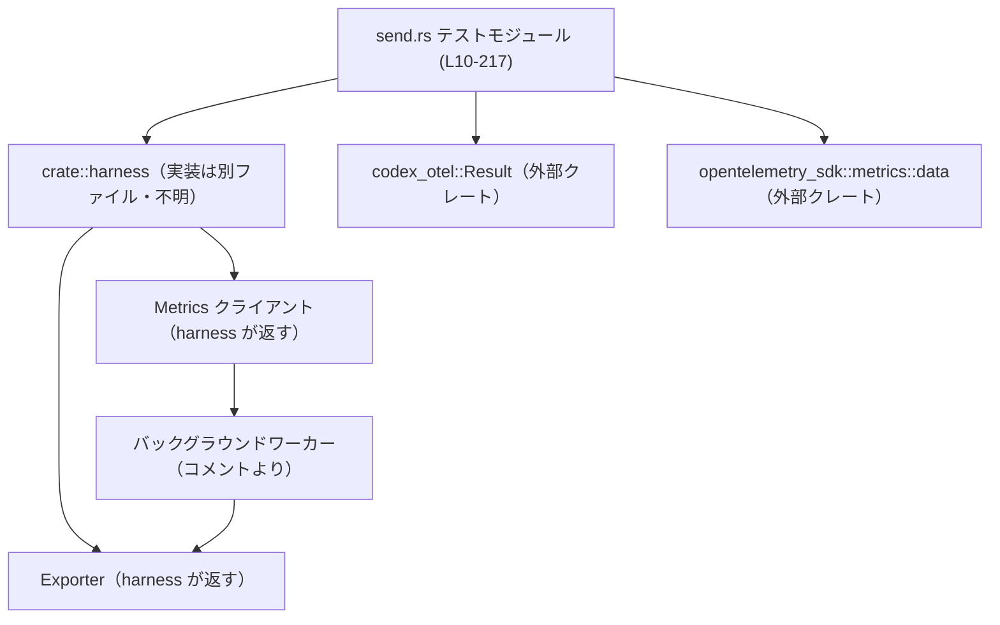
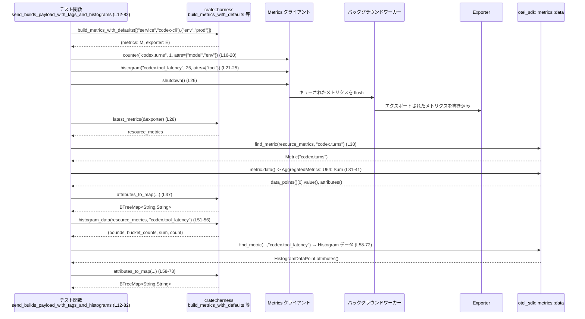

# otel/tests/suite/send.rs コード解説

## 0. ざっくり一言

OpenTelemetry ベースのメトリクスクライアントについて、

- デフォルトタグと呼び出しごとのタグのマージ
- カウンタとヒストグラムの集計結果
- バックグラウンドワーカー＋シャットダウン時のフラッシュ挙動

を検証するテスト群のファイルです（`#[test]` 関数のみで構成されています。  
根拠: `otel/tests/suite/send.rs:L10-217`

---

## 1. このモジュールの役割

### 1.1 概要

このモジュールは、`crate::harness` が提供するテスト用ハーネスを利用して、

- メトリクス送信 API（`metrics.counter`, `metrics.histogram`, `metrics.shutdown`）が期待通りのペイロードを構築すること
- デフォルト属性（タグ）と per-call 属性のマージ・上書きルール
- バックグラウンドワーカー経由のメトリクス配送と、`shutdown` 時のフラッシュ動作

を検証します。  
根拠: `build_metrics_with_defaults`・`latest_metrics`・`find_metric`・`histogram_data`・`attributes_to_map` の呼び出しとコメント  
`otel/tests/suite/send.rs:L10-16,L28-32,L51-52,L84-91,L105-107,L129-131,L155-165,L183-192,L207-215`

### 1.2 アーキテクチャ内での位置づけ

このファイルはテストモジュールであり、主に以下のコンポーネントに依存しています。

- `crate::harness`（別ファイル）  
  - `build_metrics_with_defaults`：メトリクスクライアントとエクスポータを生成  
  - `latest_metrics` / `get_finished_metrics`：エクスポータからエクスポート済みメトリクスを取得  
  - `find_metric` / `histogram_data` / `attributes_to_map`：メトリクス検索・解析ユーティリティ  
- `codex_otel::Result`：テスト関数の戻り値に使う共通 Result 型  
- `opentelemetry_sdk::metrics::data`：実際のメトリクスデータ構造（`AggregatedMetrics`, `MetricData`, `HistogramDataPoint`）  
根拠: `use` 文と各関数呼び出し  
`otel/tests/suite/send.rs:L1-8,L28-32,L51-52,L59-66,L87-91,L105-107,L129-133,L163-167,L191-195`

Mermaid 図で依存関係を示します（この図は **本チャンクのコード範囲 L1-217** に基づきます）。



- `worker`（バックグラウンドワーカー）はコメント「Verifies enqueued metrics are delivered by the background worker.」から存在が示唆されていますが、実装はこのチャンクには現れません。  
  根拠: `otel/tests/suite/send.rs:L155-158`

### 1.3 設計上のポイント

- **テスト専用モジュール**  
  - すべての関数は `#[test]` 属性付きで、外部公開 API はありません。  
    根拠: `otel/tests/suite/send.rs:L11,L85,L156,L184,L208`
- **ハーネス経由でメトリクスを検証**  
  - 生の OpenTelemetry API を直接操作せず、`crate::harness` の関数を通じてメトリクスクライアントとエクスポータを取得・検査します。  
    根拠: `otel/tests/suite/send.rs:L1-5,L13-14,L28,L51-52,L87-91,L105,L129,L158,L163,L186,L191,L210,L214`
- **型安全なメトリクス検査**  
  - `opentelemetry_sdk::metrics::data::AggregatedMetrics` および `MetricData` を `match` で詳細にパターンマッチし、予期しないバリアントの場合は `panic!` で即時失敗にします。  
    根拠: `otel/tests/suite/send.rs:L31-41,L108-118,L131-141,L165-173,L193-201`
- **属性比較のための安定したマップ表現**  
  - 属性は `attributes_to_map` で `BTreeMap<String, String>` に変換し、`BTreeMap::from([...])` で構築した期待値と比較します。  
    根拠: `otel/tests/suite/send.rs:L8,L37,L44-48,L58-59,L74-79,L120-127,L143-150,L177-178`
- **エラー処理**  
  - すべてのテスト関数は `Result<()>` を返し、`?` 演算子でハーネス API のエラーを伝搬します。  
    根拠: `otel/tests/suite/send.rs:L6,L12,L16-21,L26,L51-52,L86-91,L93-103,L157-161,L185-189,L209-212`
- **並行性**  
  - バックグラウンドワーカーの存在がコメントで示されていますが、スレッドや非同期処理の直接的な制御はこのファイルにはありません。ワーカーの実装・スレッド安全性はこのチャンクには現れません。  
    根拠: `otel/tests/suite/send.rs:L155-161`

---

## 2. 主要な機能一覧

このファイルの「機能」はすべてテストケースです。

- `send_builds_payload_with_tags_and_histograms`: デフォルトタグと per-call タグを持つカウンタ・ヒストグラムのペイロードと属性を検証するテスト  
  根拠: コメントと本体  
  `otel/tests/suite/send.rs:L10-82`
- `send_merges_default_tags_per_line`: デフォルトタグがメトリクス単位でマージされ、per-call タグの上書きが優先されることを検証するテスト  
  根拠: コメントと本体  
  `otel/tests/suite/send.rs:L84-153`
- `client_sends_enqueued_metric`: バックグラウンドワーカーにキューされたメトリクスが実際にエクスポータへ配送されることを検証するテスト  
  根拠: コメントと本体  
  `otel/tests/suite/send.rs:L155-181`
- `shutdown_flushes_in_memory_exporter`: in-memory エクスポータに対して `shutdown` がフラッシュ処理を行うことを検証するテスト  
  根拠: コメントと本体  
  `otel/tests/suite/send.rs:L183-205`
- `shutdown_without_metrics_exports_nothing`: メトリクスを一度も記録せずに `shutdown` した場合、何もエクスポートされないことを検証するテスト  
  根拠: コメントと本体  
  `otel/tests/suite/send.rs:L207-217`

### コンポーネント一覧（関数）

このチャンクに現れる関数コンポーネントを表にまとめます。

| 名前 | 種別 | 役割 / 用途 | 根拠行 |
|------|------|-------------|--------|
| `send_builds_payload_with_tags_and_histograms` | テスト関数 (`#[test]`) | カウンタ・ヒストグラムの値および属性の構築と集計結果を検証 | `otel/tests/suite/send.rs:L10-82` |
| `send_merges_default_tags_per_line` | テスト関数 (`#[test]`) | デフォルトタグと per-call タグのマージ/上書きルールを検証 | `otel/tests/suite/send.rs:L84-153` |
| `client_sends_enqueued_metric` | テスト関数 (`#[test]`) | キューイングされたメトリクスがバックグラウンドワーカー経由でエクスポートされることを検証 | `otel/tests/suite/send.rs:L155-181` |
| `shutdown_flushes_in_memory_exporter` | テスト関数 (`#[test]`) | in-memory エクスポータに対する `shutdown` のフラッシュ挙動を検証 | `otel/tests/suite/send.rs:L183-205` |
| `shutdown_without_metrics_exports_nothing` | テスト関数 (`#[test]`) | 送信されていない状態での `shutdown` が何もエクスポートしないことを検証 | `otel/tests/suite/send.rs:L207-217` |

### 外部依存コンポーネント（このファイルから呼び出されるもの）

| 名前 | 所属 | 想定される役割（コードから読み取れる範囲） | 使用箇所 / 根拠行 |
|------|------|--------------------------------------------|-------------------|
| `build_metrics_with_defaults` | `crate::harness` | デフォルト属性を受け取り、メトリクスクライアントとエクスポータを返す | `otel/tests/suite/send.rs:L13-14,L87-91,L158,L186,L210` |
| `latest_metrics` | `crate::harness` | エクスポータから最新の `resource_metrics` を取得する | `otel/tests/suite/send.rs:L28,L105,L163,L191` |
| `find_metric` | `crate::harness` | 指定名のメトリクスを `resource_metrics` から検索し、オプションで返す | `otel/tests/suite/send.rs:L30,L59,L107,L130,L164,L192` |
| `histogram_data` | `crate::harness` | `resource_metrics` から指定ヒストグラムのバケット境界・カウント・合計・件数を抽出する | `otel/tests/suite/send.rs:L51-52` |
| `attributes_to_map` | `crate::harness` | OpenTelemetry の属性集合を `BTreeMap<String, String>` に変換する | `otel/tests/suite/send.rs:L1,L37,L58,L120,L143,L177` |
| `get_finished_metrics` | `exporter` メソッド | 完了済みメトリクスの一覧を取得する（`Result<_>` を返す） | `otel/tests/suite/send.rs:L214-215` |

`crate::harness` や `exporter` 型の実装詳細やスレッドモデルは、このチャンクには現れません。

---

## 3. 公開 API と詳細解説

このファイルはテストモジュールであり、新たな公開型は定義していません。  
（すべての関数は `#[test]` 付きのローカルテスト関数です。）

### 3.1 型一覧（構造体・列挙体など）

このファイル内で新規定義される構造体・列挙体はありません。

補足として、外部型の利用だけ挙げます（定義は別モジュール）。

| 名前 | 種別 | 役割 / 用途 | 根拠行 |
|------|------|-------------|--------|
| `Result` | 型エイリアス（`codex_otel::Result`） | テスト関数の戻り値型として利用される共通 `Result` | `otel/tests/suite/send.rs:L6,L12,L86,L157,L185,L209` |
| `BTreeMap` | 構造体（標準ライブラリ） | 属性の比較用に使用。キー順序に依存しない比較が可能 | `otel/tests/suite/send.rs:L8,L44-48,L74-78,L121-126,L144-149` |

### 3.2 関数詳細

以下では、5 つのテスト関数すべてについて詳細を記載します。

---

#### `send_builds_payload_with_tags_and_histograms() -> Result<()>`

**概要**

- デフォルト属性（`service=codex-cli`, `env=prod`）に対して、
  - カウンタ `codex.turns` に per-call 属性（`model`, `env`）を付与した結果の属性マージ
  - ヒストグラム `codex.tool_latency` の値・バケット・属性
  を検証します。  
  根拠: `otel/tests/suite/send.rs:L10-27,L44-48,L51-56,L74-79`

**引数**

- 引数はありません（`fn send_builds_payload_with_tags_and_histograms()`）。

**戻り値**

- `Result<()>` (`codex_otel::Result`)  
  - ハーネス API（`build_metrics_with_defaults`, `metrics.counter`, `metrics.histogram`, `metrics.shutdown`）のエラーを `?` で伝搬します。  
  根拠: `otel/tests/suite/send.rs:L6,L12,L13-14,L16-21,L22-26`

**内部処理の流れ（アルゴリズム）**

1. デフォルト属性 `service=codex-cli`, `env=prod` を指定してメトリクスクライアントとエクスポータを生成する。  
   根拠: `otel/tests/suite/send.rs:L13-14`
2. カウンタ `codex.turns` に値 `1` を追加し、per-call 属性 `model=gpt-5.1`, `env=dev` を付与する。  
   根拠: `otel/tests/suite/send.rs:L16-20`
3. ヒストグラム `codex.tool_latency` に値 `25` を `tool=shell` 属性付きで記録する。  
   根拠: `otel/tests/suite/send.rs:L21-25`
4. `metrics.shutdown()` を呼び出し、バックグラウンドワーカーを含むすべてのメトリクスをフラッシュさせる。  
   根拠: `otel/tests/suite/send.rs:L26`
5. `latest_metrics(&exporter)` でエクスポータから最新のメトリクス（resource 単位）を取得する。  
   根拠: `otel/tests/suite/send.rs:L28`
6. `find_metric` で `codex.turns` を検索し、見つからなければ `expect` でパニックさせる。  
   `counter.data()` を `AggregatedMetrics::U64` → `MetricData::Sum` とマッチし、  
   - データポイントが 1 件であること  
   - `value() == 1` であること  
   を検証したうえで、その属性を `attributes_to_map` で `BTreeMap` に変換する。  
   根拠: `otel/tests/suite/send.rs:L30-42`
7. 期待される属性マップ（`service=codex-cli`, `env=dev`, `model=gpt-5.1`）と比較する。  
   根拠: `otel/tests/suite/send.rs:L44-49`
8. `histogram_data` で `codex.tool_latency` のバケット境界・バケットカウント・合計・件数を取得し、  
   - 境界が空でないこと  
   - 合計カウントが 1  
   - 合計値 `sum` が 25.0  
   - 件数 `count` が 1  
   を検証する。  
   根拠: `otel/tests/suite/send.rs:L51-56`
9. 再度 `find_metric` で `codex.tool_latency` を取得し、  
   - `AggregatedMetrics::F64` かつ `MetricData::Histogram` であること  
   - 最初のデータポイントの属性から `attributes_to_map` でマップを生成  
   - 期待される属性（`service=codex-cli`, `env=prod`, `tool=shell`）と一致すること  
   を検証する。  
   根拠: `otel/tests/suite/send.rs:L58-79`

**Examples（使用例）**

この関数自体が「メトリクスを記録し、エクスポートされた結果を検証する」標準的な使用例になっています。  
テスト実行時には通常の `cargo test` から呼ばれます。

```rust
// 例: このテストファイル全体を実行する
// Cargo.toml などの設定が済んでいる前提
// シェル上で:
$ cargo test --test otel_send_suite
```

**Errors / Panics**

- `Result` としてのエラー
  - 以下の呼び出しが `Err` を返した場合、このテストも即座に `Err` を返します。  
    - `build_metrics_with_defaults`  
    - `metrics.counter`  
    - `metrics.histogram`  
    - `metrics.shutdown`  
  - これらのエラー条件は、このチャンクには現れないため不明です。  
    根拠: `otel/tests/suite/send.rs:L13-14,L16-21,L22-26`
- `panic!` / `assert!` による失敗条件
  - `find_metric` が `codex.turns` または `codex.tool_latency` を見つけられない場合（`expect` がパニック）。  
    根拠: `otel/tests/suite/send.rs:L30,L59-72`
  - `counter.data()` の戻り値が `AggregatedMetrics::U64` でない場合、またはその内側が `MetricData::Sum` でない場合（`panic!("unexpected ...")`）。  
    根拠: `otel/tests/suite/send.rs:L31-41`
  - `histogram` のケースでも `AggregatedMetrics::F64` かつ `MetricData::Histogram` でない場合（`panic!("unexpected ...")`）。  
    根拠: `otel/tests/suite/send.rs:L60-67`
  - データポイント数が 1 でない場合（`assert_eq!(points.len(), 1)` 失敗）。  
    根拠: `otel/tests/suite/send.rs:L35,L112,L135,L174,L202`
  - カウンタ値やヒストグラムの `sum` / `count` が期待値と異なる場合（`assert_eq!` 失敗）。  
    根拠: `otel/tests/suite/send.rs:L36,L55-56`
  - ヒストグラムにデータポイントが存在せず `.next()` が `None` を返した場合（最後の `match` で `None` 分岐が `panic!`）。  
    根拠: `otel/tests/suite/send.rs:L64-72`

**Edge cases（エッジケース）**

- カウンタ・ヒストグラムが複数回記録された場合の挙動は、このテストでは「データポイント数が 1 であること」を前提としているため、検証されていません。  
  根拠: `otel/tests/suite/send.rs:L35,L55-56`
- デフォルト属性と per-call 属性に同一キーが存在する場合、per-call 属性が優先されることはカウンタ（`env`）で確認できますが、ヒストグラムではデフォルト属性のみを使用するケースになっており、上書きの有無はテストしていません。  
  根拠: `otel/tests/suite/send.rs:L13-21,L74-79`

**使用上の注意点**

- このテストは、`shutdown()` がすべてのメトリクスのエクスポート完了までブロックすることを前提としています。そうでない実装の場合、`latest_metrics` でまだフラッシュされていないメトリクスを見てしまう可能性があります（実際の実装はこのチャンクには現れません）。  
  根拠: `otel/tests/suite/send.rs:L26,L28,L51-52,L58-79`

---

#### `send_merges_default_tags_per_line() -> Result<()>`

**概要**

- メトリクスクライアントのデフォルト属性が、メトリクス単位（「行ごと」）にマージされ、per-call 属性が同一キーの値を上書きすることを検証するテストです。  
  根拠: コメントとアサーション  
  `otel/tests/suite/send.rs:L84-91,L93-103,L119-127,L142-150`

**戻り値**

- `Result<()>`。デフォルト属性付きメトリクスクライアントの生成と `metrics.counter`・`metrics.shutdown` のエラーを `?` で伝搬します。  
  根拠: `otel/tests/suite/send.rs:L86-91,L93-103`

**内部処理の流れ**

1. デフォルト属性 `service=codex-cli`, `env=prod`, `region=us` を指定してメトリクスクライアントとエクスポータを生成。  
   根拠: `otel/tests/suite/send.rs:L87-91`
2. カウンタ `codex.alpha` に値 `1`、per-call 属性 `env=dev`, `component=alpha` を付与して記録。  
   根拠: `otel/tests/suite/send.rs:L93-97`
3. カウンタ `codex.beta` に値 `2`、per-call 属性 `service=worker`, `component=beta` を付与して記録。  
   根拠: `otel/tests/suite/send.rs:L98-102`
4. `metrics.shutdown()` でメトリクスをフラッシュ。  
   根拠: `otel/tests/suite/send.rs:L103`
5. `latest_metrics` により `resource_metrics` を取得。  
   根拠: `otel/tests/suite/send.rs:L105`
6. `find_metric` で `codex.alpha` を取得し、カウンタの `Sum` データポイントを 1 つ取り出し、値 `1` を検証。  
   属性を `attributes_to_map` により `BTreeMap` 化し、  
   `component=alpha`, `env=dev`, `region=us`, `service=codex-cli` が含まれることを検証。  
   根拠: `otel/tests/suite/send.rs:L106-127`
7. 同様に `codex.beta` を取得し、値 `2` を検証。  
   属性が `component=beta`, `env=prod`, `region=us`, `service=worker` となっていることを検証。  
   根拠: `otel/tests/suite/send.rs:L129-150`

**Errors / Panics**

- `Result` としてのエラー
  - `build_metrics_with_defaults`, `metrics.counter`, `metrics.shutdown` が `Err` の場合に伝搬。条件はこのチャンクには現れません。  
    根拠: `otel/tests/suite/send.rs:L87-91,L93-103`
- `panic!` / `assert!` 条件
  - `find_metric` が `codex.alpha` / `codex.beta` を見つけられない場合。  
    根拠: `otel/tests/suite/send.rs:L106-107,L129-130`
  - `AggregatedMetrics::U64` 以外、もしくは `MetricData::Sum` 以外の場合。  
    根拠: `otel/tests/suite/send.rs:L108-118,L131-141`
  - データポイント数が 1 でない（`assert_eq!(points.len(), 1)`）。  
    根拠: `otel/tests/suite/send.rs:L111-113,L134-136`
  - カウンタ値が期待値と異なる（`assert_eq!(alpha_point.value(), 1)` など）。  
    根拠: `otel/tests/suite/send.rs:L119,L142`
  - 属性マップが期待値と一致しない（`assert_eq!(alpha_attrs, expected_alpha_attrs)` など）。  
    根拠: `otel/tests/suite/send.rs:L127,L150`

**Edge cases**

- デフォルト属性と per-call 属性が多くのキーで衝突する場合の挙動は、`env` と `service` キーに関してのみ検証されています。それ以外のキーでの衝突はこのチャンクには現れません。  
  根拠: `otel/tests/suite/send.rs:L87-91,L93-102,L121-126,L144-149`

**使用上の注意点**

- このテストは、「デフォルト属性は各メトリクス呼び出しごとにマージされ、per-call 属性が同名キーを上書きする」という契約を前提にしています。  
  - たとえば `codex.alpha` では `env` が `prod` → `dev` に上書きされ、`codex.beta` では `service` が `codex-cli` → `worker` に上書きされることを期待しています。  
  根拠: `otel/tests/suite/send.rs:L87-97,L98-102,L121-126,L144-149`

---

#### `client_sends_enqueued_metric() -> Result<()>`

**概要**

- メトリクスがバックグラウンドワーカーにキューイングされた後、`shutdown` の呼び出しにより確実にエクスポートされることを検証するテストです。  
  根拠: コメントと処理内容  
  `otel/tests/suite/send.rs:L155-161,L163-178`

**内部処理の流れ**

1. デフォルト属性なし（空スライス）でメトリクスクライアントとエクスポータを生成。  
   根拠: `otel/tests/suite/send.rs:L158`
2. カウンタ `codex.turns` に値 `1` と属性 `model=gpt-5.1` を記録。  
   根拠: `otel/tests/suite/send.rs:L160`
3. `metrics.shutdown()` でバックグラウンドワーカーをフラッシュ。  
   根拠: `otel/tests/suite/send.rs:L161`
4. `latest_metrics` → `find_metric` → `counter.data()` → `Sum` → `data_points().collect()` という流れでデータポイント一覧を取得し、  
   - データポイントが 1 件  
   - `value() == 1`  
   - 属性マップの `"model"` キーの値が `"gpt-5.1"`  
   を検証。  
   根拠: `otel/tests/suite/send.rs:L163-178`

**Errors / Panics**

- `Result` エラー: `build_metrics_with_defaults`, `metrics.counter`, `metrics.shutdown` のエラー条件は不明ですが、`?` で伝搬します。  
  根拠: `otel/tests/suite/send.rs:L158,L160-161`
- `panic!` / `assert!`
  - `find_metric` が `codex.turns` を見つけられない場合。  
    根拠: `otel/tests/suite/send.rs:L164`
  - `AggregatedMetrics::U64` 以外 / `MetricData::Sum` 以外の場合。  
    根拠: `otel/tests/suite/send.rs:L165-173`
  - データポイント数が 1 でない、値が 1 でない、属性 `"model"` が `"gpt-5.1"` でない場合。  
    根拠: `otel/tests/suite/send.rs:L174-178`

**Edge cases**

- バックグラウンドワーカーが非同期に動作し、`shutdown()` がすぐに戻る実装だと、このテストはレースコンディションになる可能性があります。このテストは `shutdown()` が配送完了を待つ契約を暗黙に前提としています。  
  （その契約の実装はこのチャンクには現れません。）  
  根拠: `otel/tests/suite/send.rs:L155-161,L163-178`

---

#### `shutdown_flushes_in_memory_exporter() -> Result<()>`

**概要**

- in-memory エクスポータに対して `shutdown()` を呼ぶと、キューにあるメトリクスがエクスポートされ、結果として 1 つのデータポイントが取得できることを確認するテストです。  
  根拠: コメントと処理内容  
  `otel/tests/suite/send.rs:L183-189,L191-203`

**内部処理の流れ**

1. デフォルト属性なしでメトリクスクライアントと in-memory エクスポータを生成（コメントより in-memory であることが分かる）。  
   根拠: `otel/tests/suite/send.rs:L183-187`
2. カウンタ `codex.turns` に値 `1` を記録（属性なし）。  
   根拠: `otel/tests/suite/send.rs:L188`
3. `metrics.shutdown()` を呼び出し、エクスポータへのフラッシュを行う。  
   根拠: `otel/tests/suite/send.rs:L189`
4. `latest_metrics` → `find_metric` → `data()` → `Sum` → `data_points().collect()` の流れでデータポイントを取得し、1 件だけであることを検証。  
   根拠: `otel/tests/suite/send.rs:L191-203`

**Errors / Panics**

- `Result` エラーの扱いは他テストと同様（`build_metrics_with_defaults`, `metrics.counter`, `metrics.shutdown`）。  
  根拠: `otel/tests/suite/send.rs:L186-189`
- `panic!` / `assert!`
  - `find_metric` で `codex.turns` が見つからない場合。  
    根拠: `otel/tests/suite/send.rs:L192`
  - `AggregatedMetrics::U64` / `MetricData::Sum` 以外の場合。  
    根拠: `otel/tests/suite/send.rs:L193-201`
  - データポイント数が 1 でない場合。  
    根拠: `otel/tests/suite/send.rs:L202`

**Edge cases**

- 値そのもの（`value()`）は検証していないため、`Sum` の値が 1 以外であっても、このテストは通過してしまいます。この点は仕様上の保証対象外であると言えます。  
  根拠: `otel/tests/suite/send.rs:L193-203`（`value()` を参照していない）

---

#### `shutdown_without_metrics_exports_nothing() -> Result<()>`

**概要**

- 何もメトリクスを記録しないまま `shutdown()` した場合、エクスポータは空の結果（メトリクスなし）を返すことを検証するテストです。  
  根拠: コメントと処理  
  `otel/tests/suite/send.rs:L207-217`

**内部処理の流れ**

1. デフォルト属性なしでメトリクスクライアントとエクスポータを生成。  
   根拠: `otel/tests/suite/send.rs:L210`
2. メトリクスを一切記録せず、すぐに `metrics.shutdown()` を呼び出す。  
   根拠: `otel/tests/suite/send.rs:L212`
3. `exporter.get_finished_metrics().unwrap()` で完了済みメトリクス一覧を取得し、空であることを `assert!(finished.is_empty())` で検証。  
   根拠: `otel/tests/suite/send.rs:L214-215`

**Errors / Panics**

- `Result` エラー
  - `build_metrics_with_defaults` と `metrics.shutdown` のエラーを `?` で伝搬。条件は不明です。  
    根拠: `otel/tests/suite/send.rs:L210,L212`
- `panic!`
  - `exporter.get_finished_metrics()` が `Err` を返した場合、`unwrap()` によりパニック。  
  - 結果が空でない場合、`assert!(finished.is_empty(), ...)` によりパニック。  
  根拠: `otel/tests/suite/send.rs:L214-215`

**Edge cases**

- フラッシュ済みだが、内部的に「空のメトリクス」を 1 エントリとして表現するような実装があると、このテストは失敗します。このテストは「何もエクスポートされない＝配列が空」という契約を前提にしています。  
  実際のエクスポータの仕様はこのチャンクには現れません。

---

### 3.3 その他の関数

テストファイルであり、補助関数やラッパー関数の定義はありません。

---

## 4. データフロー

ここでは代表例として、`send_builds_payload_with_tags_and_histograms` の処理におけるデータフローを示します。  
（図は **本チャンク L12-82** のコードに基づきます。）



**要点**

- テスト関数は `build_metrics_with_defaults` を通じてメトリクス送信用コンポーネント（`metrics`）と収集用コンポーネント（`exporter`）を取得します。  
  根拠: `otel/tests/suite/send.rs:L13-14`
- メトリクスはまず `metrics` に記録され、`shutdown` によりバックグラウンドワーカーとエクスポータにフラッシュされる想定です（ワーカーの実装はこのチャンクには現れません）。  
  根拠: コメントと `shutdown()` 呼び出し  
  `otel/tests/suite/send.rs:L21-27,L155-161,L183-189`
- テストは `latest_metrics` や `find_metric` でエクスポート済みメトリクスを取得し、OpenTelemetry のデータ構造を `match` によりデコードしています。  
  根拠: `otel/tests/suite/send.rs:L28-42,L51-56,L58-79`

---

## 5. 使い方（How to Use）

このファイル自体はテスト専用ですが、同様のテストを書くときのパターンとして利用できます。

### 5.1 基本的な使用方法

メトリクスクライアント経由でメトリクスを記録し、`shutdown` 後にエクスポータから結果を検証する基本フローは次のようになります。

```rust
use crate::harness::{build_metrics_with_defaults, latest_metrics, find_metric, attributes_to_map};
use codex_otel::Result;

// テスト例: 基本的なカウンタメトリクスの検証
#[test]
fn example_counter_metric() -> Result<()> {
    // 1. デフォルト属性付きでメトリクスクライアントとエクスポータを取得する
    let (metrics, exporter) = build_metrics_with_defaults(&[("service", "my-service")])?;

    // 2. カウンタメトリクスを 1 回インクリメントする
    metrics.counter("my.counter", 1, &[("key", "value")])?;

    // 3. シャットダウンして、バックグラウンドワーカーを含め全メトリクスを flush する
    metrics.shutdown()?;

    // 4. エクスポータから最新のメトリクスを取得する
    let resource_metrics = latest_metrics(&exporter);

    // 5. 対象メトリクスを検索し、値や属性を検証する
    let metric = find_metric(&resource_metrics, "my.counter").expect("metric missing");
    let points = match metric.data() {
        opentelemetry_sdk::metrics::data::AggregatedMetrics::U64(data) => match data {
            opentelemetry_sdk::metrics::data::MetricData::Sum(sum) => {
                sum.data_points().collect::<Vec<_>>()
            }
            _ => panic!("unexpected counter aggregation"),
        },
        _ => panic!("unexpected counter data type"),
    };
    assert_eq!(points.len(), 1);
    assert_eq!(points[0].value(), 1);
    let attrs = attributes_to_map(points[0].attributes());
    assert_eq!(attrs.get("key").map(String::as_str), Some("value"));
    assert_eq!(attrs.get("service").map(String::as_str), Some("my-service"));

    Ok(())
}
```

この例は、`client_sends_enqueued_metric` や `send_builds_payload_with_tags_and_histograms` のパターンを簡略化したものです。

### 5.2 よくある使用パターン

- **デフォルト属性付きメトリクス**
  - `build_metrics_with_defaults(&[("service", "..."), ("env", "...")])` で共通タグを設定し、各 `metrics.counter`／`metrics.histogram` 呼び出し時に追加の属性や上書き属性を渡す。  
    根拠: `otel/tests/suite/send.rs:L13-21,L87-102`
- **属性の上書き検証**
  - 同じキーをデフォルトと per-call の両方で指定し、エクスポート結果の属性から上書きルールを確認する。  
    例: `"env"`（`prod`→`dev`）、`"service"`（`codex-cli`→`worker`）。  
    根拠: `otel/tests/suite/send.rs:L87-97,L98-102,L121-126,L144-149`
- **ヒストグラムのバケット検証**
  - `histogram_data` でバケット境界とカウント、合計値・件数を取得して検証する。  
    根拠: `otel/tests/suite/send.rs:L51-56`

### 5.3 よくある間違い

このファイルから推測できる誤用例と、正しい例の対比です。

```rust
// 誤り例: shutdown を呼ばずにエクスポート結果を検査しようとする
let (metrics, exporter) = build_metrics_with_defaults(&[])?;
// メトリクスを記録する
metrics.counter("codex.turns", 1, &[])?;
// shutdown していない
let resource_metrics = latest_metrics(&exporter); // まだフラッシュされていない可能性がある

// 正しい例: shutdown 後にエクスポータを検査する
let (metrics, exporter) = build_metrics_with_defaults(&[])?;
metrics.counter("codex.turns", 1, &[])?;
metrics.shutdown()?; // フラッシュを保証
let resource_metrics = latest_metrics(&exporter); // この時点でメトリクスが揃っている前提
```

- テストコードはすべて `shutdown()` の後に `latest_metrics` や `get_finished_metrics` を呼んでおり、この順序が重要な契約になっています。  
  根拠: `otel/tests/suite/send.rs:L26-28,L103-105,L161-163,L189-191,L212-215`

### 5.4 使用上の注意点（まとめ）

- **前提条件**
  - `build_metrics_with_defaults` が有効なメトリクスクライアントとエクスポータを返し、`metrics.shutdown()` がエクスポート完了を待機することを前提としています（実装はこのチャンクには現れません）。  
- **エラー処理**
  - テスト関数はすべて `Result<()>` を返し、ハーネス側のエラーをそのまま呼び出し元（テストランナー）に伝えます。  
- **パニック条件**
  - メトリクスの型や集計形式が期待と異なる場合（`AggregatedMetrics::U64` 以外など）、テストは即座に `panic!` します。これはライブラリの契約を検証するための仕様です。  
- **並行性**
  - バックグラウンドワーカーやスレッドの具合はこのファイルからは分かりませんが、テストは「`shutdown()` の後ならメトリクスが利用可能である」という契約を前提に書かれています。  

---

## 6. 変更の仕方（How to Modify）

### 6.1 新しい機能を追加する場合（新しいテストケース）

新しいメトリクス機能や属性ルールを検証するテストを追加する際の基本手順は、既存テストと同様です。

1. **テストケースの追加**
   - 本ファイルに `#[test]` 関数を追加し、`Result<()>` を返すシグネチャを採用します。  
     根拠: 既存テストのシグネチャ  
     `otel/tests/suite/send.rs:L11-12,L85-86,L156-157,L184-185,L208-209`
2. **ハーネスからクライアントとエクスポータ取得**
   - `build_metrics_with_defaults` を用いて、必要なデフォルト属性を設定します。  
3. **メトリクスを記録**
   - `metrics.counter`, `metrics.histogram` などでメトリクスを記録し、必要に応じて属性を指定します。
4. **シャットダウンと取得**
   - `metrics.shutdown()?` の後に `latest_metrics(&exporter)` または `exporter.get_finished_metrics()` で結果を取得します。
5. **検証**
   - `find_metric` や `histogram_data`、`attributes_to_map` を使って OpenTelemetry の生データを分解し、期待する値・属性と比較します。
   - 型や集計形式が重要な場合は、既存の `match` パターンを参考に `AggregatedMetrics` / `MetricData` を判定します。

### 6.2 既存の機能を変更する場合

- **影響範囲の確認**
  - いずれかのテストで使用しているメトリクス名（例: `"codex.turns"`, `"codex.tool_latency"`, `"codex.alpha"` など）や属性キーを変更する場合、ライブラリ側の実装と本テストの両方を一貫して変更する必要があります。  
    根拠: メトリクス名の固定値  
    `otel/tests/suite/send.rs:L17,L22,L30,L51,L59,L94,L99,L107,L130,L160,L164,L188,L192`
- **契約の確認**
  - デフォルト属性と per-call 属性のマージルール（per-call 優先）や、`shutdown()` がフラッシュ完了まで待つことなどは、このテストで暗黙に契約として検証されています。  
  - ライブラリ側で契約を変更する場合は、テスト内容も合わせて更新する必要があります。
- **関連するテストの再確認**
  - `shutdown` の挙動を変える場合は、少なくとも `client_sends_enqueued_metric` と `shutdown_flushes_in_memory_exporter`、`shutdown_without_metrics_exports_nothing` の 3 つへの影響を確認する必要があります。  
    根拠: これらのテストが `shutdown` の挙動を直接検証していること  
    `otel/tests/suite/send.rs:L155-181,L183-205,L207-217`

---

## 7. 関連ファイル

このモジュールと密接に関係すると考えられるコンポーネントをまとめます（ファイルパスはこのチャンクには現れないものも含まれます）。

| パス / モジュール名 | 役割 / 関係 |
|----------------------|------------|
| `crate::harness`（具体的なファイルパスは不明。このチャンクには現れない） | `build_metrics_with_defaults`, `latest_metrics`, `find_metric`, `histogram_data`, `attributes_to_map` を提供し、本テストからメトリクスの構築・取得・検査に利用されています。 |
| `codex_otel`（外部クレート） | 共通の `Result` 型エイリアス `codex_otel::Result` を提供し、テスト関数の戻り値として利用されています。 |
| `opentelemetry_sdk::metrics::data`（外部クレート） | `AggregatedMetrics`, `MetricData`, `HistogramDataPoint` などのメトリクスデータ型を提供し、本テストではエクスポート結果の検査に利用されています。 |
| `pretty_assertions` | `assert_eq!` を拡張し、差分を見やすくするテスト用ユーティリティとして使用されています。`assert_eq!` の挙動自体は標準マクロと同様にパニックベースです。 |
| `std::collections::BTreeMap` | 属性の比較のために使われます。キー順序に依存しない比較を行うために利用されていると解釈できます（単体テスト内で構築・比較）。 |

これらの関連コンポーネントの具体的な実装やパフォーマンス特性、スレッド安全性などは、このチャンクには現れません。
