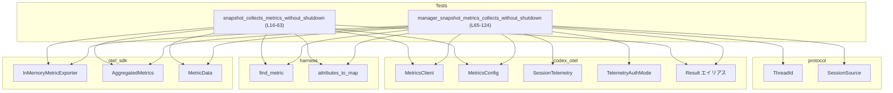
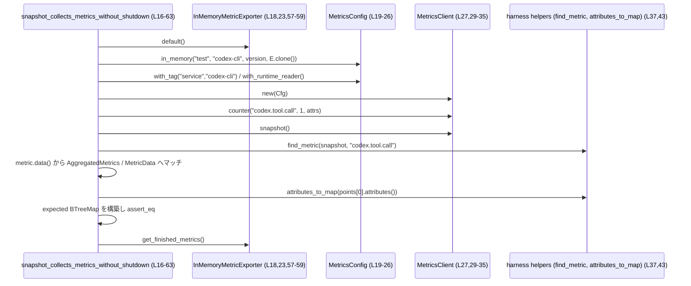
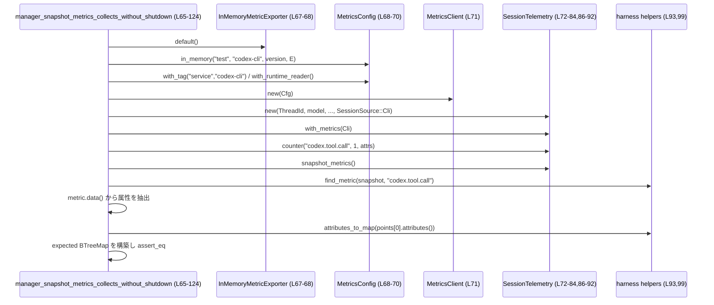

# otel/tests/suite/snapshot.rs コード解説

## 0. ざっくり一言

このテストモジュールは、`codex_otel` のメトリクス機能が **シャットダウン前でもスナップショットでメトリクスを読み取れること** と、`SessionTelemetry` 経由のメトリクスが **期待どおりの属性（タグ）を付与して収集されること** を検証するものです（snapshot.rs:L16-63, L65-124）。

---

## 1. このモジュールの役割

### 1.1 概要

- このモジュールは、`MetricsClient::snapshot` および `SessionTelemetry::snapshot_metrics` が、  
  OpenTelemetry の `InMemoryMetricExporter` を用いて **現在のメトリクス状態を即時に取得できるか** を確認します（snapshot.rs:L18-27, L35-38, L67-72, L92-93）。
- あわせて、取得されるメトリクスに **どの属性キー・値が含まれるか**（例: `service`, `tool`, `auth_mode` など）という契約をテストします（snapshot.rs:L50-54, L106-121）。
- さらに、スナップショットの取得が **periodic export（定期エクスポート）をトリガーしない** ことを `InMemoryMetricExporter::get_finished_metrics` の内容で検証します（snapshot.rs:L57-60）。

### 1.2 アーキテクチャ内での位置づけ

このファイルは **テストコード** であり、アプリケーション本体のコンポーネントに依存して動作を検証します。

主な依存関係は次の通りです。

- テストハーネス:
  - `crate::harness::attributes_to_map` / `find_metric`（メトリクススナップショットの走査と属性のマップ化）（snapshot.rs:L1-2, L37, L43, L93, L99）
- codex_otel:
  - `MetricsConfig`, `MetricsClient`, `SessionTelemetry`, `TelemetryAuthMode`, `Result`（snapshot.rs:L3-7, L19-27, L29-35, L68-72, L72-84, L92）
- OpenTelemetry SDK:
  - `InMemoryMetricExporter`, `AggregatedMetrics`, `MetricData`（snapshot.rs:L10-12, L18, L23, L39-47, L95-103）
- codex_protocol:
  - `ThreadId`, `SessionSource`（snapshot.rs:L8-9, L72-83）
- 検証用ユーティリティ:
  - `pretty_assertions::assert_eq`, `std::collections::BTreeMap`（snapshot.rs:L13-14, L42, L50-55, L98, L106-122）

依存関係の概要を Mermaid で表すと次のようになります。



※ 各外部コンポーネントの定義場所（ファイルパス）は、このチャンクには現れません。

### 1.3 設計上のポイント

- **テスト専用モジュール**
  - 2 つの `#[test]` 関数のみを定義し、公開 API はありません（snapshot.rs:L16, L65）。
- **Result によるエラーハンドリング**
  - テスト関数自体が `codex_otel::Result<()>` を返し、`?` 演算子で構成・初期化時のエラーを上位（テストランナー）に伝播します（snapshot.rs:L5, L17, L27, L29, L35, L66-67, L71-72, L92）。
- **panic ベースの検証**
  - メトリクスの形（型・集約種別）が想定外だった場合 `panic!` してテストを失敗させます（snapshot.rs:L45-47, L101-103）。
  - `assert_eq!` や `assert!`、`expect` で契約違反時に明示的に失敗させています（snapshot.rs:L42, L55, L58-60, L98, L122）。
- **OpenTelemetry の in-memory エクスポータ利用**
  - `InMemoryMetricExporter` を用いて外部システムへの I/O を行わず、テスト中にメトリクス内容を直接検証可能にしています（snapshot.rs:L10, L18, L67, L57-59）。
- **並行性**
  - このファイル内にはスレッド生成や async/await はなく、テストは単一スレッド・同期コードとして記述されています（snapshot.rs 全体に `async` やスレッド API の記述はありません）。

---

## 2. 主要な機能一覧

このモジュールが提供する（＝検証する）主要な機能は次の 2 点です。

- **スナップショットによるメトリクス取得（クライアント直接）**  
  `MetricsClient::snapshot` を使い、カウンターメトリクスとその属性が正しく取得できること、およびスナップショット取得がエクスポート済みメトリクスを増やさないことを検証します（snapshot.rs:L16-63）。
- **SessionTelemetry 経由のメトリクス取得**  
  `SessionTelemetry::snapshot_metrics` により、セッション情報（モデル名、認証モード、originator など）が属性として付与されたメトリクスが収集されることを検証します（snapshot.rs:L65-124）。

### 2.1 このファイルで定義される関数（コンポーネントインベントリー）

| 名前 | 種別 | 役割 / 用途 | 定義位置（根拠） |
|------|------|-------------|------------------|
| `snapshot_collects_metrics_without_shutdown` | 関数（テスト） | `MetricsClient` でカウンターをインクリメントし、`snapshot` で取得したメトリクスの属性セットと、`InMemoryMetricExporter` の finished バッファが空のままであることを検証する | snapshot.rs:L16-63 |
| `manager_snapshot_metrics_collects_without_shutdown` | 関数（テスト） | `SessionTelemetry` に `MetricsClient` を紐付けてカウンターをインクリメントし、`snapshot_metrics` で取得したメトリクスにセッション関連の属性が付与されていることを検証する | snapshot.rs:L65-124 |

---

## 3. 公開 API と詳細解説

このファイル自体には公開 API はありませんが、理解のために本モジュールが利用している主要な外部型と、2 つのテスト関数の詳細を整理します。

### 3.1 型一覧（主に外部の型）

このファイル内で新たに定義される構造体・列挙体はありません。以下は利用している外部型の一覧です。

| 名前 | 種別 | 役割 / 用途 | 参照位置（根拠） |
|------|------|-------------|------------------|
| `MetricsClient` | 構造体（推定） | メトリクスを送信／カウントし、`snapshot` で現在値を取得するクライアント | コンストラクタ `new` や `counter`, `snapshot` を呼び出し（snapshot.rs:L3, L27, L29-35, L35, L71, L86-90, L92） |
| `MetricsConfig` | 構造体（推定） | メトリクスの出力先やタグなどの設定を保持する。`in_memory` で `InMemoryMetricExporter` と紐付け、`with_tag`, `with_runtime_reader` で設定を追加 | snapshot.rs:L4, L19-26, L68-70 |
| `SessionTelemetry` | 構造体（推定） | セッション単位のテレメトリ（モデル名、originator など）を管理し、`counter` や `snapshot_metrics` を通じてメトリクスを記録・取得する | snapshot.rs:L6, L72-84, L86-90, L92 |
| `TelemetryAuthMode` | 列挙体（推定） | テレメトリの認証モードを表す。ここでは `ApiKey` バリアントを使用し、属性値として `.to_string()` した値を付与している | snapshot.rs:L7, L78, L112-113 |
| `ThreadId` | 構造体（推定） | セッションやスレッドを識別する ID。`ThreadId::new()` で新規作成され、`SessionTelemetry::new` の引数として渡される | snapshot.rs:L8, L73 |
| `SessionSource` | 列挙体（推定） | セッションがどこから来たか（CLI など）を表す。ここでは `SessionSource::Cli` を使用し、`session_source` 属性 `"cli"` として期待しています | snapshot.rs:L9, L82, L117-118 |
| `InMemoryMetricExporter` | 構造体 | OpenTelemetry SDK の in-memory メトリクスエクスポータ。テストでは `default` で作成し、`get_finished_metrics` で内部バッファを参照する | snapshot.rs:L10, L18, L23, L57-59, L67-68 |
| `AggregatedMetrics` | 列挙体 | メトリクスデータの集約された型を表す。ここでは `AggregatedMetrics::U64` バリアントのみを許容している | snapshot.rs:L11, L38-40, L94-96 |
| `MetricData` | 列挙体 | 単一メトリクスのデータ種別（Sum / Histogram など）を表す。ここでは `MetricData::Sum` のみを許容している | snapshot.rs:L12, L39-41, L95-97 |
| `BTreeMap<String, String>` | 構造体（標準ライブラリ） | 属性キー・値をソート順に保持し、期待されるタグセットとの比較に使う | snapshot.rs:L14, L50-54, L106-121 |

※ これらの型の詳細な定義（フィールドなど）は、このチャンクには現れません。

### 3.2 関数詳細

#### `snapshot_collects_metrics_without_shutdown() -> Result<()>`

**概要**

- `MetricsClient` を直接使ってカウンターを 1 回インクリメントし、`snapshot` から得られるメトリクスが期待どおりの属性セットを持つことを検証します（snapshot.rs:L29-35, L50-55）。
- さらに同時に使用している `InMemoryMetricExporter` の `get_finished_metrics` が空であることを確認し、スナップショット取得が periodic export を発生させないことを保証します（snapshot.rs:L57-60）。

**引数**

この関数は引数を取りません（snapshot.rs:L17）。

**戻り値**

- 型: `codex_otel::Result<()>`（snapshot.rs:L5, L17）
- 意味:
  - `Ok(())`: テストロジック中で例外的なエラーが発生しなかったこと（設定・クライアント生成・カウンター記録・スナップショット取得などの呼び出しが全て成功したこと）。
  - `Err(..)`: 設定生成 (`with_tag`), `MetricsClient::new`, `counter`, `snapshot` のいずれかでエラーが発生したことを示し、テストランナー側で失敗として扱われます（snapshot.rs:L25-27, L29-30, L35）。

具体的なエラー型（`Err(E)` の `E`）は `Result` エイリアスの定義がこのチャンクにないため不明です。

**内部処理の流れ**

1. **エクスポータの初期化**  
   `InMemoryMetricExporter::default()` でメモリ内エクスポータを作成します（snapshot.rs:L18）。

2. **メトリクス設定の構築**  
   - `MetricsConfig::in_memory("test", "codex-cli", env!("CARGO_PKG_VERSION"), exporter.clone())` を呼び、in-memory エクスポータを用いる設定を作成します（snapshot.rs:L19-24）。
   - その設定に対して `.with_tag("service", "codex-cli")?` で `service=codex-cli` のタグを追加し（snapshot.rs:L25）、`.with_runtime_reader()` でランタイム情報の読み取りを有効化します（snapshot.rs:L26）。

3. **MetricsClient の生成**  
   上記設定を `MetricsClient::new(config)?` に渡し、クライアントを生成します（snapshot.rs:L27）。

4. **カウンターメトリクスのインクリメント**  
   `metrics.counter("codex.tool.call", 1, &[("tool", "shell"), ("success", "true")])?` を呼び、`codex.tool.call` という名前のカウンターを 1 増やします（snapshot.rs:L29-33）。

5. **スナップショットの取得**  
   `let snapshot = metrics.snapshot()?;` で現在までのメトリクスをスナップショットとして取得します（snapshot.rs:L35）。

6. **対象メトリクスの抽出と属性取得**  
   - `find_metric(&snapshot, "codex.tool.call")` でスナップショットから該当メトリクスを検索し、見つからない場合は `expect("counter metric missing")` で panic します（snapshot.rs:L37）。
   - `metric.data()` から `AggregatedMetrics` を取得し、`AggregatedMetrics::U64` かつ `MetricData::Sum` の場合のみ処理を続行します。それ以外は `panic!` します（snapshot.rs:L38-47）。
   - Sum の `data_points()` を `collect` して `Vec` にし、長さが 1 であることを `assert_eq!(points.len(), 1)` で検証し（snapshot.rs:L41-42）、その単一データポイントの属性を `attributes_to_map(points[0].attributes())` で `BTreeMap<String, String>` に変換します（snapshot.rs:L43-44）。

7. **期待される属性セットとの比較**  
   - 期待される属性として `service=codex-cli`, `success=true`, `tool=shell` を `BTreeMap::from([...])` で構築します（snapshot.rs:L50-54）。
   - 実際の属性マップと `assert_eq!(attrs, expected)` で完全一致を要求します（snapshot.rs:L55）。

8. **エクスポータの finished メトリクス確認**  
   - `exporter.get_finished_metrics().expect("finished metrics should be readable")` でエクスポータから「終了済みメトリクス」を取得します（snapshot.rs:L57-59）。
   - `assert!(finished.is_empty(), "expected no periodic exports yet")` で、まだ何もエクスポートされていないことを検証します（snapshot.rs:L60）。

9. **正常終了**  
   全ての検証が通れば `Ok(())` を返して終了します（snapshot.rs:L62）。

**Examples（使用例）**

この関数自体が一つの使用例になっていますが、必要部分を抜き出した最小構成の例です。

```rust
use codex_otel::{MetricsClient, MetricsConfig, Result};
use opentelemetry_sdk::metrics::InMemoryMetricExporter;

fn example_snapshot() -> Result<()> {
    // InMemory エクスポータを作成する（snapshot.rs:L18 を簡略化）
    let exporter = InMemoryMetricExporter::default();

    // in_memory 設定を作成し、service タグを付与してランタイムリーダーを有効化（snapshot.rs:L19-26）
    let config = MetricsConfig::in_memory("test", "codex-cli", env!("CARGO_PKG_VERSION"), exporter.clone())
        .with_tag("service", "codex-cli")?
        .with_runtime_reader();

    // MetricsClient を生成（snapshot.rs:L27）
    let metrics = MetricsClient::new(config)?;

    // カウンターを 1 回インクリメント（snapshot.rs:L29-33）
    metrics.counter(
        "codex.tool.call",
        1,
        &[("tool", "shell"), ("success", "true")],
    )?;

    // スナップショットを取得（snapshot.rs:L35）
    let snapshot = metrics.snapshot()?;

    // snapshot の後でも exporter の finished メトリクスは空であることが期待される（snapshot.rs:L57-60）
    // 実際の finished の中身は InMemoryMetricExporter の実装次第

    Ok(())
}
```

**Errors / Panics**

- `Err` が返る可能性がある箇所（`?` を付けている呼び出し）（snapshot.rs:L25-27, L29-30, L35）:
  - `with_tag("service", "codex-cli")?`
  - `MetricsClient::new(config)?`
  - `metrics.counter(..)?`
  - `metrics.snapshot()?`
- `panic` となる条件（snapshot.rs:L37, L41-47, L58-60）:
  - `find_metric` が `"codex.tool.call"` メトリクスを見つけられず `expect("counter metric missing")` が発火した場合（snapshot.rs:L37）。
  - `metric.data()` が `AggregatedMetrics::U64` 以外の場合（snapshot.rs:L38, L47）。
  - `AggregatedMetrics::U64` の中身が `MetricData::Sum` 以外の場合（snapshot.rs:L39-40, L45）。
  - データポイント数が 1 以外の場合（`assert_eq!(points.len(), 1)` の不一致）（snapshot.rs:L41-42）。
  - `attrs` と `expected` が一致しない場合（snapshot.rs:L50-55）。
  - `exporter.get_finished_metrics()` が `Err` を返した場合（`expect("finished metrics should be readable")`）（snapshot.rs:L58-59）。
  - `finished.is_empty()` が偽の場合（snapshot.rs:L60）。

**Edge cases（エッジケース）**

- メトリクスが存在しない場合  
  → `find_metric` が `None`（または `Err`）を返すと `expect` により panic します（snapshot.rs:L37）。
- メトリクスの集約型が変わった場合  
  → 例えば `Histogram` に変わったなど、`AggregatedMetrics::U64` / `MetricData::Sum` でなくなると panic します（snapshot.rs:L38-40, L45-47）。
- データポイントが複数存在する場合  
  → `assert_eq!(points.len(), 1)` によりテスト失敗になります（snapshot.rs:L41-42）。
- エクスポータがスナップショット取得時に finished メトリクスを生成する実装だった場合  
  → `finished.is_empty()` が偽となりテストが失敗します（snapshot.rs:L57-60）。
- セキュリティ／入力値  
  → すべての文字列・数値はソースコード中にリテラルとして書かれており、外部から渡される入力はありません（snapshot.rs:L20-23, L31-33）。  
     このため、このテスト関数自体は入力バリデーションやセキュリティ上の懸念点を持ちません。

**使用上の注意点**

- `Result<()>` を返すため、呼び出し側（通常はテストランナー）は `?` による早期リターンでエラーを受け取ります。  
  テストの中でエラーを握り潰さず、そのまま失敗として扱う設計になっています（snapshot.rs:L17, L25-27, L29-30, L35）。
- メトリクスの型や集約方法が仕様変更された場合、このテストは panic で失敗します。  
  これは「メトリクスの公開仕様」の一部として、型・集約方式まで固定していることを意味します（snapshot.rs:L38-47）。
- `exporter.clone()` の Semantics（同じ内部バッファを共有するかどうか）はこのチャンクからは分かりません。  
  テストでは clone した方を `MetricsConfig` に渡し、元の `exporter` から `get_finished_metrics` を呼んでいます（snapshot.rs:L18, L23-24, L57-59）。  
  clone の仕様如何によっては「空であること」の意味が異なるため、実際の挙動は `InMemoryMetricExporter` の実装に依存します。

---

#### `manager_snapshot_metrics_collects_without_shutdown() -> Result<()>`

**概要**

- `SessionTelemetry` を用いてメトリクスを記録し、`snapshot_metrics` で取得したメトリクスに **セッション関連の属性**（アプリのバージョン、認証モード、モデル名、originator、セッションソースなど）が含まれていることを検証します（snapshot.rs:L72-84, L86-90, L92-93, L106-121）。

**引数**

この関数も引数を取りません（snapshot.rs:L66）。

**戻り値**

- 型: `codex_otel::Result<()>`（snapshot.rs:L5, L66）
- 意味:
  - `Ok(())`: `MetricsConfig` 構築、`MetricsClient`／`SessionTelemetry` 初期化、`snapshot_metrics` 取得が全て成功したこと。
  - `Err(..)`: これらのいずれかでエラーが発生したこと。具体的なエラー型はこのチャンクには現れません。

**内部処理の流れ**

1. **エクスポータと設定の構築**  
   - `InMemoryMetricExporter::default()` でエクスポータを作成します（snapshot.rs:L67）。
   - `MetricsConfig::in_memory("test", "codex-cli", env!("CARGO_PKG_VERSION"), exporter)` で設定を作成し（snapshot.rs:L68）、`.with_tag("service", "codex-cli")?` で `service` タグを追加、`.with_runtime_reader()` でランタイム情報の読み取りを有効化します（snapshot.rs:L69-70）。

2. **MetricsClient の生成**  
   `MetricsClient::new(config)?` でクライアントを生成します（snapshot.rs:L71）。

3. **SessionTelemetry の生成と MetricsClient の紐付け**  
   - `SessionTelemetry::new(..)` を呼び出し、次の情報を与えます（snapshot.rs:L72-83）。
     - 新しい `ThreadId`（snapshot.rs:L73）
     - モデル名・表示名 `"gpt-5.1"`（snapshot.rs:L74-75）
     - アカウント ID `"account-id"`（Someで指定）（snapshot.rs:L76）
     - `account_email` は `None`（snapshot.rs:L77）
     - `TelemetryAuthMode::ApiKey`（Some で指定）（snapshot.rs:L78）
     - `originator` として `"test_originator"`（snapshot.rs:L79）
     - `log_user_prompts` = `true`（snapshot.rs:L80）
     - 出力チャネル `"tty"`（snapshot.rs:L81）
     - `SessionSource::Cli`（snapshot.rs:L82）
   - その戻り値に対して `.with_metrics(metrics)` を呼び、先ほど作成した `MetricsClient` を紐付けます（snapshot.rs:L83-84）。

4. **SessionTelemetry 経由でのカウンターインクリメント**  
   `manager.counter("codex.tool.call", 1, &[("tool", "shell"), ("success", "true")]);` でメトリクスを増やします。ここでは `?` を使っていないため、`counter` はエラーを返さない（もしくは無視できる） API であると読み取れます（snapshot.rs:L86-90）。

5. **スナップショットの取得**  
   `let snapshot = manager.snapshot_metrics()?;` でセッションに紐づくメトリクスのスナップショットを取得します（snapshot.rs:L92）。

6. **メトリクス抽出と属性取得**  
   - `find_metric(&snapshot, "codex.tool.call").expect("counter metric missing")` で該当メトリクスを取得します（snapshot.rs:L93）。
   - メトリクスデータに対して `AggregatedMetrics::U64` → `MetricData::Sum` のネストしたパターンマッチを行い、Sum の data points をベクタに収集します（snapshot.rs:L94-101）。
   - データポイント数が 1 であることを `assert_eq!(points.len(), 1)` で確認し、その唯一の data point の属性を `attributes_to_map(points[0].attributes())` により `BTreeMap<String, String>` に変換します（snapshot.rs:L97-99）。

7. **期待される属性との比較**  
   期待される属性セットを次のように構築し、`assert_eq!(attrs, expected)` で完全一致を検証します（snapshot.rs:L106-122）。

   - `"app.version"`: `env!("CARGO_PKG_VERSION").to_string()`（snapshot.rs:L108-110）
   - `"auth_mode"`: `TelemetryAuthMode::ApiKey.to_string()`（snapshot.rs:L112-113）
   - `"model"`: `"gpt-5.1"`（snapshot.rs:L115-116）
   - `"originator"`: `"test_originator"`（snapshot.rs:L116）
   - `"service"`: `"codex-cli"`（snapshot.rs:L117）
   - `"session_source"`: `"cli"`（snapshot.rs:L117-118）
   - `"success"`: `"true"`（snapshot.rs:L119）
   - `"tool"`: `"shell"`（snapshot.rs:L120）

8. **正常終了**  
   すべての検証に成功すると `Ok(())` を返します（snapshot.rs:L124）。

**Examples（使用例）**

`SessionTelemetry` とメトリクスを組み合わせる基本パターンは、テストとほぼ同じです。

```rust
use codex_otel::{MetricsClient, MetricsConfig, SessionTelemetry, TelemetryAuthMode, Result};
use codex_protocol::{ThreadId, protocol::SessionSource};
use opentelemetry_sdk::metrics::InMemoryMetricExporter;

fn example_session_metrics() -> Result<()> {
    let exporter = InMemoryMetricExporter::default();                           // snapshot.rs:L67
    let config = MetricsConfig::in_memory("test", "codex-cli", env!("CARGO_PKG_VERSION"), exporter)
        .with_tag("service", "codex-cli")?                                      // snapshot.rs:L68-70
        .with_runtime_reader();

    let metrics = MetricsClient::new(config)?;                                  // snapshot.rs:L71

    let manager = SessionTelemetry::new(                                        // snapshot.rs:L72-83
        ThreadId::new(),
        "gpt-5.1",
        "gpt-5.1",
        Some("account-id".to_owned()),
        None,
        Some(TelemetryAuthMode::ApiKey),
        "test_originator".to_owned(),
        true,
        "tty".to_owned(),
        SessionSource::Cli,
    ).with_metrics(metrics);                                                    // snapshot.rs:L84

    manager.counter(
        "codex.tool.call",
        1,
        &[("tool", "shell"), ("success", "true")],
    );                                                                          // snapshot.rs:L86-90

    let snapshot = manager.snapshot_metrics()?;                                 // snapshot.rs:L92

    // snapshot の内容は find_metric / attributes_to_map などで検証できる

    Ok(())
}
```

**Errors / Panics**

- `Err` が返りうる箇所（snapshot.rs:L69-71, L92）:
  - `with_tag("service", "codex-cli")?`
  - `MetricsClient::new(config)?`
  - `manager.snapshot_metrics()?`
- `panic` 条件（snapshot.rs:L93-103, L106-122）:
  - `"codex.tool.call"` メトリクスが見つからない（`expect("counter metric missing")`）（snapshot.rs:L93）。
  - `metric.data()` が `AggregatedMetrics::U64` でない／中身が `MetricData::Sum` でない（snapshot.rs:L94-101）。
  - data points の数が 1 でない（snapshot.rs:L97-99）。
  - 属性マップが期待値と一致しない（snapshot.rs:L106-122）。

**Edge cases（エッジケース）**

- `SessionTelemetry` に紐付く属性が変わる／追加される場合  
  → テストで期待している属性セットが固定されているため、仕様変更があれば `assert_eq!(attrs, expected)` が失敗します（snapshot.rs:L106-122）。
- 認証モードやモデル名を変えた場合  
  → `TelemetryAuthMode::ApiKey` や `"gpt-5.1"` を前提とした期待値を持つため、他のモード／モデルに変更した場合はテストを更新する必要があります（snapshot.rs:L74-75, L78, L106-116）。
- セキュリティ面  
  → 認証モード・アカウント ID などはテストコード内に固定文字列として埋め込まれており、外部からの機微情報入力はありません（snapshot.rs:L76, L78-79）。  
     このため、テスト自体が機密情報をログやメトリクスに漏洩するような挙動はコード上からは読み取れません。

**使用上の注意点**

- `SessionTelemetry::counter` はこのテストでは戻り値を無視しています（snapshot.rs:L86-90）。  
  したがって、この API はエラーを返さないか、返しても無視可能である設計と考えられますが、詳細はこのチャンクからは分かりません。
- セッション関連の属性がどのようにメトリクスに付与されるかは `SessionTelemetry` の内部実装に依存しており、このテストはその「外部契約」（キー名・値）を固定しています（snapshot.rs:L106-121）。

### 3.3 その他の関数

このファイル内には上記 2 つ以外の関数定義はありません（snapshot.rs 全体を確認）。

---

## 4. データフロー

ここでは、代表的な処理として 2 つのテスト関数のデータフローを示します。

### 4.1 `snapshot_collects_metrics_without_shutdown` のデータフロー

このテストでは、テスト関数 → メトリクス設定 → クライアント → スナップショット → ハーネスヘルパー → アサーションという流れでデータが処理されます（snapshot.rs:L18-60）。



**ポイント**

- メトリクス値そのものは `MetricsClient` 内部と `InMemoryMetricExporter` 内部で管理され、テストコードからは `snapshot` と `get_finished_metrics` で間接的にアクセスしています（snapshot.rs:L35, L57-59）。
- 属性の比較は BTreeMap で行うため、属性の順序に依存せずに検証できます（snapshot.rs:L50-55）。

### 4.2 `manager_snapshot_metrics_collects_without_shutdown` のデータフロー

こちらは `SessionTelemetry` が間に入る点だけが異なります（snapshot.rs:L67-92）。



**ポイント**

- `SessionTelemetry` が `MetricsClient` にセッション情報を重ね合わせてメトリクスを発行する層として機能していることが、このテストから読み取れます（snapshot.rs:L72-84, L86-90, L106-121）。
- 追加される属性（`app.version`, `auth_mode`, `model`, `originator`, `session_source` など）は、このテストで固定文字列と比較されています（snapshot.rs:L106-121）。

---

## 5. 使い方（How to Use）

このファイルはテストコードですが、`MetricsClient` と `SessionTelemetry` の典型的な利用パターンを示しています。

### 5.1 基本的な使用方法

**MetricsClient でメトリクスをカウントし、スナップショットを取得する流れ**

```rust
use codex_otel::{MetricsClient, MetricsConfig, Result};
use opentelemetry_sdk::metrics::InMemoryMetricExporter;

fn basic_metrics_flow() -> Result<()> {
    // 1. エクスポータを用意する（snapshot.rs:L18）
    let exporter = InMemoryMetricExporter::default();

    // 2. in_memory 設定を構築し、タグやランタイムリーダーを設定（snapshot.rs:L19-26）
    let config = MetricsConfig::in_memory("test", "codex-cli", env!("CARGO_PKG_VERSION"), exporter.clone())
        .with_tag("service", "codex-cli")?
        .with_runtime_reader();

    // 3. MetricsClient を初期化（snapshot.rs:L27）
    let metrics = MetricsClient::new(config)?;

    // 4. カウンターをインクリメント（snapshot.rs:L29-33）
    metrics.counter(
        "codex.tool.call",
        1,
        &[("tool", "shell"), ("success", "true")],
    )?;

    // 5. スナップショットで現在値を取得（snapshot.rs:L35）
    let snapshot = metrics.snapshot()?;

    // 6. snapshot から find_metric / attributes_to_map で詳細を確認できる（snapshot.rs:L37-44）

    Ok(())
}
```

**言語固有の観点**

- エラー処理:
  - `?` 演算子で `Result` を伝播し、テスト関数／この例のようなラッパー関数は `Result<()>` を返します（snapshot.rs:L17, L25-27, L29-30, L35）。
- メモリ安全性:
  - このファイルには `unsafe` キーワードはなく、すべて Safe Rust で書かれています（snapshot.rs 全体）。
- 並行性:
  - スレッド生成や `async` 関数はなく、メトリクス操作は単一スレッドの同期処理として行われます。

### 5.2 よくある使用パターン

1. **クライアント直接 vs SessionTelemetry 経由**

   - 直接利用: メトリクスのみを扱いたい場合、`MetricsClient` を直接使う（snapshot.rs:L18-35）。
   - セッション文脈付き: ユーザーセッション／モデル名／認証情報などをメトリクスに付与したい場合、`SessionTelemetry` に `MetricsClient` を渡して利用する（snapshot.rs:L72-84, L86-92）。

2. **アプリケーションバージョンやその他メタデータの付与**

   - `env!("CARGO_PKG_VERSION")` を利用してビルド時にアプリのバージョン文字列を埋め込み、それを属性として付与するパターンが使われています（snapshot.rs:L22, L68, L108-110）。

### 5.3 よくある間違い（推測可能な範囲）

コードから推測できる「誤用になりそうな例」と、その正しい使い方です。

```rust
// 誤り例: MetricsClient を初期化せずに SessionTelemetry を使おうとする
// let manager = SessionTelemetry::new(/* ... */);
// manager.counter("codex.tool.call", 1, &[("tool", "shell")]);

// 正しい例: SessionTelemetry に MetricsClient を紐付けてから使う（snapshot.rs:L71-84, L86-90）
let metrics = MetricsClient::new(config)?;         // 先に MetricsClient を用意
let manager = SessionTelemetry::new(/* ... */)
    .with_metrics(metrics);                        // with_metrics で紐付け
manager.counter("codex.tool.call", 1, &[("tool", "shell"), ("success", "true")]);
```

```rust
// 誤り例: snapshot しただけで exporter の finished にデータが入っていると期待する
let snapshot = metrics.snapshot()?;
// let finished = exporter.get_finished_metrics()?;
// assert!(!finished.is_empty()); // このテストの契約とは逆（snapshot.rs:L57-60）

// 正しい例: snapshot は exporter の periodic export とは独立であることを前提とする
let finished = exporter.get_finished_metrics()?;
assert!(finished.is_empty());                      // snapshot.rs:L57-60
```

### 5.4 使用上の注意点（まとめ）

- **契約の固定化**  
  - テストは `AggregatedMetrics::U64` ＋ `MetricData::Sum` であることや、属性セットのキー／値を厳密に固定しています（snapshot.rs:L38-47, L50-55, L94-101, L106-121）。  
    メトリクスの仕様変更を行う場合は、これらのテストを同時に更新する必要があります。
- **エラー・パニックの扱い**  
  - エラーは `Result` で上位に伝播し、仕様違反は `panic` 系で即座にテスト失敗としています（snapshot.rs:L25-27, L29-30, L35, L37, L41-47, L55, L58-60, L93-103, L122）。
- **セキュリティ**  
  - テストで扱う値はすべてコード内のリテラルであり、ユーザー入力やネットワーク入力は登場しません（snapshot.rs:L20-23, L31-33, L74-82, L88-89）。  
    このテストモジュール自体がセキュリティ上のリスクを増やす可能性は低いと考えられます（事実として外部入力を扱っていない、という意味で）。
- **性能・スケーラビリティ**  
  - `InMemoryMetricExporter` を用いることで、テストはメモリ内で完結し、外部 I/O を伴いません（snapshot.rs:L10, L18, L67）。  
    大量のメトリクスを扱うケースでの性能については、この短いテストからは判断できません。

---

## 6. 変更の仕方（How to Modify）

### 6.1 新しい機能（テスト）を追加する場合

例として、「別のメトリクス名や別の属性を検証するテスト」を追加する場合のステップです。

1. **同様のセットアップコードを再利用する**  
   - `InMemoryMetricExporter` → `MetricsConfig::in_memory` → `with_tag` → `with_runtime_reader` → `MetricsClient::new` の流れをコピーまたは共通関数化します（snapshot.rs:L18-27, L67-71）。
2. **新しいメトリクス操作を追加する**  
   - `metrics.counter` や `manager.counter` を、検証したいメトリクス名と属性で呼び出します（snapshot.rs:L29-33, L86-90）。
3. **スナップショットと検証ロジックを追加する**  
   - `snapshot` または `snapshot_metrics` を呼び出し（snapshot.rs:L35, L92）、`find_metric` / `attributes_to_map` で属性を抽出します（snapshot.rs:L37, L43, L93, L99）。
   - 期待する属性セットを `BTreeMap::from([...])` で構築し、`assert_eq!` で比較します（snapshot.rs:L50-55, L106-122）。

### 6.2 既存の機能を変更する場合

- **メトリクスの型や集約方法を変える場合**
  - 例えばカウンターを Sum 以外の表現に変更すると、`AggregatedMetrics::U64` / `MetricData::Sum` のマッチが失敗し、テストが panic します（snapshot.rs:L38-40, L94-97）。
  - 変更時にはマッチ条件と検証部分を新しい型に合わせて変更する必要があります。
- **属性キー／値を変更する場合**
  - ラベル名（例: `"service"`, `"session_source"`）や値（`"cli"` など）を変更した場合、期待する `BTreeMap` を更新しなければ `assert_eq!` が失敗します（snapshot.rs:L50-54, L106-121）。
- **影響範囲の確認**
  - これらのテストは、メトリクスの「外部仕様」（公開されるメトリクス名・属性）を保証している可能性があります。  
    メトリクス仕様を利用している他のコンポーネントがあるかどうかはこのチャンクには現れませんが、仕様変更時には関連コード・ドキュメントの確認が必要です。

---

## 7. 関連ファイル

このモジュールと密接に関係するファイル・モジュールを、コードから分かる範囲で列挙します。

| パス / モジュール | 役割 / 関係 | 根拠 |
|------------------|------------|------|
| `crate::harness` | `attributes_to_map` と `find_metric` を提供するテストハーネスモジュール。スナップショットからメトリクスを検索し、属性をマップに変換する処理を担当 | モジュール参照と関数呼び出し（snapshot.rs:L1-2, L37, L43, L93, L99） |
| `codex_otel` | メトリクス関連の主要コンポーネント（`MetricsClient`, `MetricsConfig`, `SessionTelemetry`, `TelemetryAuthMode`, `Result`）を提供するクレート | `use codex_otel::...` と各種メソッド呼び出し（snapshot.rs:L3-7, L19-27, L29-35, L68-72, L72-84, L86-92） |
| `codex_protocol` | セッション ID (`ThreadId`) やセッションソース (`SessionSource`) を提供するクレート | `use codex_protocol::ThreadId; use codex_protocol::protocol::SessionSource;`（snapshot.rs:L8-9, L73, L82） |
| `opentelemetry_sdk::metrics` | `InMemoryMetricExporter`, `AggregatedMetrics`, `MetricData` を提供する OpenTelemetry SDK | `use opentelemetry_sdk::metrics::...` および `default`, `get_finished_metrics`, `data`, `Sum`, `data_points` の使用（snapshot.rs:L10-12, L18, L23, L38-41, L57-59, L94-97） |
| `pretty_assertions` | 差分が見やすい `assert_eq!` マクロを提供 | `use pretty_assertions::assert_eq;` とアサーション呼び出し（snapshot.rs:L13, L42, L55, L98, L122） |

※ これらのモジュールの実装内容やファイルパスの詳細はこのチャンクには現れませんが、本モジュールはそれらに依存してメトリクスのスナップショット機能と属性付与の契約をテストしています。
