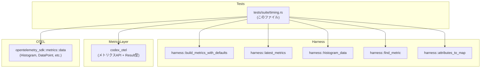
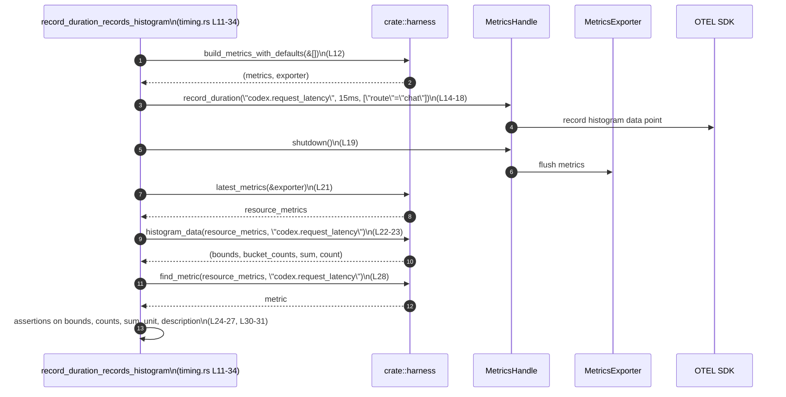
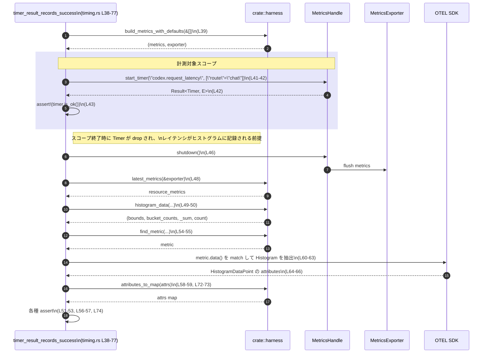

# otel/tests/suite/timing.rs

## 0. ざっくり一言

OpenTelemetry ベースのメトリクス実装について、**レイテンシ計測（duration / timer）がヒストグラムとして正しく記録・エクスポートされること**を検証するテストモジュールです。

---

## 1. このモジュールの役割

### 1.1 概要

- このモジュールは、`codex.request_latency` というメトリクス名で
  - 直接 `Duration` を記録する API（`record_duration`）
  - スコープ終了時に自動で計測・記録されるタイマー API（`start_timer`）
- が、OpenTelemetry のヒストグラムとして正しく出力されることを確認します  
  （otel/tests/suite/timing.rs:L9-34, L36-77）。

### 1.2 アーキテクチャ内での位置づけ

このテストは、テスト用ハーネスと OpenTelemetry SDK の上に乗った `codex_otel` メトリクス層を検証しています。



- ハーネス経由でメトリクスレジストリとエクスポータを構築しています  
  `build_metrics_with_defaults` 呼び出し（L12, L39）。
- そのメトリクスハンドルに対して `record_duration` / `start_timer` を呼び出し（L14-18, L42）。
- `metrics.shutdown()` のあとに `latest_metrics` でエクスポート済みメトリクスを取得し（L19-22, L46-50）、
  `histogram_data` / `find_metric` / `attributes_to_map` で検証しています（L22-31, L48-58）。

### 1.3 設計上のポイント

- **テストハーネスの活用**  
  - メトリクスのセットアップとデータ取得はすべて `crate::harness` モジュールに委譲されています（L1-4, L21-23, L48-50, L54-59, L58-73）。  
    これにより、テストは「計測 API の呼び出し」と「期待値の検証」に集中しています。
- **`Result<()>` を返すテスト関数**  
  - 両テストは `codex_otel::Result<()>` を返し（L5, L11, L38）、`?` 演算子でエラーを伝播させています（L12, L18, L19, L39, L46）。  
    失敗時はテストが即座に失敗する構造です。
- **ヒストグラム・メトリクス仕様の検証**  
  - バケット境界が空でないこと（L24, L51）、サンプル数・合計値が期待どおりであること（L25-27, L52-53）、
    unit/description が特定の文字列であること（L30-31, L56-57）をテストしています。
- **RAII ベースのタイマー**  
  - `start_timer` が返すオブジェクトをスコープブロックに閉じ込め、ブロック終了時の drop により計測が完了することを前提にしています（L41-44）。
- **OTel SDK 生データへのアクセス**  
  - 2つ目のテストでは、`opentelemetry_sdk::metrics::data::AggregatedMetrics` と `HistogramDataPoint` を直接 `match` で扱い、
    最初のデータポイントの attributes を取り出して検証しています（L58-67）。

---

## 2. 主要な機能一覧

このファイル内で定義される「機能」は 2 つのテスト関数です。

- `record_duration_records_histogram`: `record_duration` による `Duration` 記録がヒストグラムに反映され、単位・説明・バケットが期待どおりであることを検証します（L9-34）。
- `timer_result_records_success`: `start_timer` によるスコープベースのタイマーがヒストグラムに 1 データポイントを記録し、属性 `route="chat"` も付与されることを検証します（L36-77）。

---

## 3. 公開 API と詳細解説

### 3.1 型一覧（構造体・列挙体など）

このファイル内には新しい型定義はありませんが、外部の主要な型の使用状況を整理します。

| 名前 | 種別 | 役割 / 用途 | 定義位置 / 出現位置 |
|------|------|-------------|----------------------|
| `Result<T>` | 型エイリアスまたは型（詳細不明） | テスト関数の戻り値として使用される共通の結果型。`?` でエラー伝播を可能にします。具体的な定義はこのチャンクには現れません。 | `otel/tests/suite/timing.rs:L5-5, L11-11, L38-38` |
| `Duration` | 標準ライブラリ構造体 | 記録するレイテンシの時間幅を表現します。ここでは `from_millis(15)` が使用されています。 | `otel/tests/suite/timing.rs:L7-7, L16-16` |
| `AggregatedMetrics::F64` | 列挙体バリアント | OpenTelemetry SDK の集約済みメトリクスデータ。F64 ベースのメトリクス（ここでは Histogram）を表します。 | `otel/tests/suite/timing.rs:L61-63` |
| `MetricData::Histogram` | 列挙体バリアント | メトリクスデータのうちヒストグラム型を表します。 | `otel/tests/suite/timing.rs:L61-63` |
| `HistogramDataPoint` | 構造体 | 個々のヒストグラムデータポイント（バケット・属性を含む）を表します。ここでは attributes の取得に使用されています。 | `otel/tests/suite/timing.rs:L64-66` |

※ `build_metrics_with_defaults` 等が返すメトリクスハンドルやエクスポータの具体的な型は、このチャンクには現れませんが、タプルであることは `let (metrics, exporter)` から読み取れます（L12, L39）。

### 3.2 関数詳細

#### `record_duration_records_histogram() -> Result<()>`

**概要**

- メトリクスハーネスを初期化し、`record_duration` で 15ms のレイテンシを 1 回記録したときに、
  - ヒストグラムのサンプル数・合計値
  - メトリクスの単位・説明
  が期待どおりであることを確認するテストです（L9-34）。

**引数**

- 引数はありません（`fn record_duration_records_histogram() -> Result<()>`、L11）。

**戻り値**

- `Result<()>`（L11）
  - 成功時は `Ok(())`（L33）。
  - `build_metrics_with_defaults`, `record_duration`, `shutdown` などの失敗時には `Err(...)` が返り、テストは失敗します（L12, L18-19）。

**内部処理の流れ（アルゴリズム）**

1. **メトリクス環境の初期化**  
   - `build_metrics_with_defaults(&[])` を呼び出し、メトリクスハンドル `metrics` とエクスポータ `exporter` を取得します（L12）。  
     ここで `?` を使っているため、初期化に失敗した場合は即座にテストが `Err` で終了します。
2. **レイテンシの記録**  
   - `metrics.record_duration("codex.request_latency", Duration::from_millis(15), &[("route", "chat")])?;` で、指定メトリクス名・属性付きで 15ms を記録します（L14-18）。
3. **メトリクスのシャットダウン / フラッシュ**  
   - `metrics.shutdown()?;` でメトリクスをシャットダウンし、エクスポータにフラッシュします（L19-19）。
4. **エクスポート済みメトリクスの取得**  
   - `latest_metrics(&exporter)` を用いて最新のリソースメトリクスを取得します（L21）。
5. **ヒストグラムデータの抽出**  
   - `histogram_data(&resource_metrics, "codex.request_latency")` から `(bounds, bucket_counts, sum, count)` を取得します（L22-23）。
6. **ヒストグラムの検証**  
   - `bounds` が空でないこと（L24）。  
   - `bucket_counts` の合計が 1 であること（L25）。  
   - `sum == 15.0`、`count == 1` であること（L26-27）。
7. **メトリクスメタデータの検証**  
   - `find_metric` を使ってメトリクスを取得し（L28-29）、見つからない場合は `panic!` します。  
   - `metric.unit() == "ms"`（L30）、`metric.description() == "Duration in milliseconds."`（L31）であることを検証します。
8. **成功終了**  
   - `Ok(())` を返してテストを成功させます（L33）。

**Examples（使用例）**

このテスト自体が典型的な使用例です。概念的には次のようなアプリケーションコードに対応します（関数シグネチャは呼び出しから読み取れる範囲に限定しています）。

```rust
// メトリクス環境の初期化（テストでは build_metrics_with_defaults を利用）
// 実際の型はこのチャンクには現れません。
let (metrics, _exporter) = build_metrics_with_defaults(&[])?;

// 何らかの処理時間を計測したあと、その時間を記録する
let latency = std::time::Duration::from_millis(15);
metrics.record_duration(
    "codex.request_latency", // メトリクス名
    latency,                 // Duration
    &[("route", "chat")],    // 属性
)?;

// 必要に応じてシャットダウン / フラッシュ
metrics.shutdown()?;
```

**Errors / Panics**

- `?` を用いているため、以下のいずれかが `Err` を返すとテストが失敗します（L12, L18-19）。
  - `build_metrics_with_defaults`
  - `metrics.record_duration`
  - `metrics.shutdown`
- `find_metric` の戻り値が `None` の場合、`unwrap_or_else(|| panic!("metric codex.request_latency missing"))` により `panic!` が発生します（L28-29）。  
  これは「メトリクスが必ず存在するべき」というテストの契約を表現しています。

**Edge cases（エッジケース）**

コードから読み取れる範囲のエッジケースは次のとおりです。

- メトリクスが 1 回も記録されなかった場合
  - `histogram_data` の結果がどうなるかはこのチャンクには現れませんが、その場合は `bucket_counts` の合計や `count` が 0 などになり、アサーションが失敗する可能性があります（L25-27）。
- メトリクス名が誤っている場合
  - `histogram_data(&resource_metrics, "codex.request_latency")`（L22-23）や `find_metric`（L28-29）が期待するメトリクスを見つけられず、アサーションあるいは `panic` が発生します。
- 単位・説明の変更
  - メトリクス定義の unit/description が変更された場合、`"ms"` / `"Duration in milliseconds."` という前提に依存しているこのテストが失敗します（L30-31）。

**使用上の注意点**

- テストでは、**メトリクスを読み出す前に `metrics.shutdown()` を必ず呼んでいます**（L19, L46）。  
  これは、シャットダウンによってメトリクスがエクスポータにフラッシュされる前提を置いていると解釈できます。
- メトリクス名・単位・説明文字列は、アプリケーション側で変更するとテストが壊れるため、変更時にはこのテストも更新する必要があります。

---

#### `timer_result_records_success() -> Result<()>`

**概要**

- `start_timer` でスコープベースのタイマーを開始し、スコープ終了時にヒストグラムへ 1 つのデータポイントが記録されること、
  さらに `route="chat"` という属性が付与されていることを検証するテストです（L36-77）。

**引数**

- 引数はありません（`fn timer_result_records_success() -> Result<()>`、L38）。

**戻り値**

- `Result<()>`（L38）
  - 初期化や `shutdown` でエラーが発生すると `Err` を返し、テストが失敗します（L39, L46）。
  - テストロジックがすべて成功すると `Ok(())` を返します（L76）。

**内部処理の流れ（アルゴリズム）**

1. **メトリクス環境の初期化**  
   - `build_metrics_with_defaults(&[])` で `metrics` と `exporter` を取得します（L39）。
2. **RAII タイマーの開始**  
   - ブロック `{ ... }` の中で `metrics.start_timer("codex.request_latency", &[("route", "chat")])` を呼びます（L41-42）。  
   - 戻り値 `timer` に対し `assert!(timer.is_ok())` を行い、タイマー生成に成功していることを確認します（L43）。
   - ブロックを抜けると `timer`（`Result<_, _>`）がドロップされます。  
     `Ok` であれば中のタイマーオブジェクトも drop され、このタイミングで計測結果が記録される設計であると解釈できます（RAII パターン）。
3. **メトリクスのシャットダウン / フラッシュ**  
   - ブロックの外で `metrics.shutdown()?` を呼び、メトリクスをフラッシュします（L46）。
4. **ヒストグラムの検証**  
   - `latest_metrics(&exporter)` でリソースメトリクスを取得し（L48）、  
     `histogram_data` で `(bounds, bucket_counts, _sum, count)` を取得します（L49-50）。
   - `bounds` が空でないこと（L51）、`count == 1` であること（L52）、`bucket_counts` の合計も 1 であることを確認します（L53）。  
     これにより「タイマーの 1 回の利用が 1 データポイントとして記録される」ことを確認しています。
5. **メトリクスメタデータの検証**  
   - 1つ目のテスト同様、`find_metric` でメトリクスを取得し、unit / description を検証します（L54-57）。
6. **属性の取り出しと検証**  
   - `find_metric` → `metric.data()` → `AggregatedMetrics::F64(MetricData::Histogram(histogram))` というパターンマッチでヒストグラムに到達します（L58-63）。
   - `histogram.data_points().next()` で 1 つ目のデータポイントを取得し（L64-65）、  
     その `attributes` を取り出します（L66）。
   - 取得に失敗した場合は `panic!("attributes missing")`（L70-71）。  
   - 得られた attributes を `attributes_to_map` で `HashMap<String, String>` のようなマップに変換し（L58-59, L72-73）、  
     `attrs.get("route").map(String::as_str) == Some("chat")` を検証します（L74）。
7. **成功終了**  
   - `Ok(())` を返しテストを成功させます（L76）。

**Examples（使用例）**

RAII スタイルのタイマー利用例として、テストのパターンを簡略化したコードは次のようになります。

```rust
let (metrics, _exporter) = build_metrics_with_defaults(&[])?;

// ある処理の実行時間をスコープで計測する
{
    let timer = metrics.start_timer(
        "codex.request_latency", // メトリクス名
        &[("route", "chat")],    // 属性
    );
    assert!(timer.is_ok());     // タイマー生成に成功したか確認

    // 計測対象の処理をここに書く
    // do_work();
} // ここを抜けると timer が drop され、処理時間が記録される

metrics.shutdown()?; // 記録されたメトリクスをフラッシュ
```

**Errors / Panics**

- `build_metrics_with_defaults` / `metrics.shutdown` が `Err` を返すとテストは失敗します（L39, L46）。
- タイマー生成に失敗した場合
  - `assert!(timer.is_ok())`（L43）が失敗し `panic!` します。
- メトリクスが見つからない場合
  - `find_metric` の `unwrap_or_else(|| panic!(...))` が `panic!` を発生させます（L54-55）。
- ヒストグラム以外のメトリクスが返ってきた場合
  - `match metric.data()` のパターンが `_ => None` となるため（L60-68）、  
    その結果 `attributes missing` の `panic!` に到達します（L70-71）。

**Edge cases（エッジケース）**

- `start_timer` が `Err` を返す場合
  - どのような条件で `Err` が返るかはこのチャンクには現れませんが、少なくともテストは `assert!(timer.is_ok())` によりエラーを許容していません（L42-43）。
- ヒストグラムが複数のデータポイントを持つ場合
  - コードは `data_points().next()` の 1 件目のみを検査しているため（L64-65）、  
    複数データポイントが存在するケースを明示的には検証していません。
- メトリクスがヒストグラム以外の型に変わった場合
  - パターンマッチの `_ => None` によって attributes が取得できず `panic!("attributes missing")` が発生します（L61-63, L70-71）。

**使用上の注意点**

- コメント `// Ensures time_result returns the closure output and records timing.`（L36）と実際のコードは一致しておらず、  
  コードでは `start_timer` のみを検証しています。コメントが古い可能性があります。
- 属性の取得は OpenTelemetry SDK の具体的な型（`AggregatedMetrics::F64`, `MetricData::Histogram`, `HistogramDataPoint`）に依存しているため（L60-66）、  
  SDK の内部表現が変わるとテストの修正が必要になる可能性があります。

### 3.3 その他の関数

このファイル内には、テスト関数以外の関数定義はありません。  
利用しているが定義がこのチャンクに存在しない関数は以下のとおりです（いずれも `crate::harness` モジュールからのインポートまたは完全修飾呼び出し）。

| 関数名 | 役割（1 行） | 使用位置 |
|--------|--------------|----------|
| `build_metrics_with_defaults` | テスト用のメトリクスハンドルとエクスポータを構築するヘルパー関数と解釈できます。具体的実装はこのチャンクには現れません。 | `otel/tests/suite/timing.rs:L2-2, L12-12, L39-39` |
| `latest_metrics` | エクスポータから最新の `ResourceMetrics` を取得するヘルパー関数と解釈できます。 | `otel/tests/suite/timing.rs:L4-4, L21-21, L48-48` |
| `histogram_data` | 指定メトリクスのヒストグラムからバケット境界・カウント・合計・サンプル数を取り出すヘルパー。 | `otel/tests/suite/timing.rs:L3-3, L22-23, L49-50` |
| `find_metric` | メトリクスセットから名前で `Metric` を検索するヘルパー。 | `otel/tests/suite/timing.rs:L28-29, L54-55, L59-60` |
| `attributes_to_map` | Attributes をマップ形式に変換するユーティリティ。 | `otel/tests/suite/timing.rs:L1-1, L58-59, L72-73` |

---

## 4. データフロー

ここでは `record_duration_records_histogram` の処理フローを例に、メトリクスデータがどのように流れるかを説明します。

### 4.1 ヒストグラム記録のフロー（record_duration, L11-34）



- 記録された `Duration` は、`record_duration` 内で OTel SDK のヒストグラムに変換され、その後 `shutdown` を介してエクスポータへフラッシュされる前提です。
- テストはハーネス API（`histogram_data`, `find_metric`）を通じて SDK レベルの情報を抽出し、期待値と比較しています。

### 4.2 タイマー記録のフロー（start_timer, L38-77）



---

## 5. 使い方（How to Use）

このファイル自体はテストですが、ここで示されているパターンは実際のアプリケーションコードでのメトリクス利用にも直結します。

### 5.1 基本的な使用方法

#### 5.1.1 既知の Duration を直接記録する

`record_duration` の利用パターンは次のように整理できます（L14-18）。

```rust
// メトリクスハンドルの取得方法は環境依存ですが、
// テストでは build_metrics_with_defaults(&[]) から得ています（L12, L39）。
let (metrics, _exporter) = build_metrics_with_defaults(&[])?;

// 例えばリクエストのレイテンシが 15 ミリ秒だった場合
let latency = std::time::Duration::from_millis(15); // L16 相当

// メトリクスに記録する
metrics.record_duration(
    "codex.request_latency", // メトリクス名（L15）
    latency,                 // Duration
    &[("route", "chat")],    // 属性 key/value（L17）
)?;

// 必要に応じて flush / shutdown
metrics.shutdown()?;
```

このスタイルは、「すでに計測済みの Duration をメトリクスとして送る」ケースに適しています。

#### 5.1.2 スコープベースで自動計測する

`start_timer` は、スコープの開始と終了で自動的に経過時間を測り、その結果をヒストグラムに記録する用途に適しています（L41-44）。

```rust
let (metrics, _exporter) = build_metrics_with_defaults(&[])?;

// あるブロックの処理時間を計測する
{
    let timer = metrics.start_timer(
        "codex.request_latency", // メトリクス名
        &[("route", "chat")],    // 属性
    );
    assert!(timer.is_ok()); // タイマーが正常に開始されたか検証（L43）

    // ここに計測したい処理を書く
    // do_work();
} // ← ブロックを出ると timer が drop され、計測値が記録される設計（L41-44）

metrics.shutdown()?; // その後にメトリクスを flush（L46）
```

### 5.2 よくある使用パターン

- **ラベル付きレイテンシメトリクス**  
  両テストで共通して `"route"` 属性を `"chat"` で設定しています（L17, L42, L74）。  
  これにより「どのルートのレイテンシか」を区別できる設計になっていると考えられます。

- **テストでのメトリクス検証**  
  - `build_metrics_with_defaults` のようなハーネスを用意し、
  - テスト対象 API を呼び、
  - `latest_metrics` / `histogram_data` / `find_metric` などのヘルパーで内部状態を検証する  
  というパターンは、メトリクス周りの回帰テストに一般的に使える構造です（L12, L21-23, L39, L48-50）。

### 5.3 よくある間違い

このテストから推測できる、起こりやすい誤用とその結果です。

```rust
// 誤り例: shutdown 前にメトリクスを読み出そうとする
let (metrics, exporter) = build_metrics_with_defaults(&[])?;
metrics.record_duration("codex.request_latency", Duration::from_millis(15), &[])?;

// metrics.shutdown()?; を呼んでいない
let resource_metrics = latest_metrics(&exporter); // データがまだ flush されていない可能性がある
```

```rust
// 正しい例: テストが行っている順序
let (metrics, exporter) = build_metrics_with_defaults(&[])?;
metrics.record_duration("codex.request_latency", Duration::from_millis(15), &[])?;
metrics.shutdown()?; // 先に shutdown で flush（L19, L46）

let resource_metrics = latest_metrics(&exporter); // その後に読み出す（L21, L48）
```

- テストでは必ず `shutdown` の後に `latest_metrics` を呼んでおり（L19-21, L46-48）、  
  この順序が守られないと期待どおりのデータが取得できない前提でテストが設計されていると解釈できます。

### 5.4 使用上の注意点（まとめ）

- **前提条件**
  - メトリクスを読み出して検証する前に、`metrics.shutdown()` もしくはそれに相当するフラッシュ処理を行う前提になっています（L19, L46）。
  - `start_timer` の戻り値について、テストは `is_ok()` を強制しており、エラーを許容していません（L42-43）。
- **契約に基づく前提**
  - `codex.request_latency` はヒストグラム型であり、`unit() == "ms"`, `description() == "Duration in milliseconds."` であることを前提にしています（L30-31, L56-57）。
  - タイマーの drop により 1 データポイントが記録されることを前提としています（L41-44, L49-53）。
- **コメントと実装の不一致**
  - 2つ目のテストのコメントは `time_result` の挙動を説明していますが（L36）、実装では `start_timer` のみを使っており、後者が正しいテスト対象と考えられます。  
    コメントの更新漏れには注意が必要です。

---

## 6. 変更の仕方（How to Modify）

### 6.1 新しい機能を追加する場合（テストの追加）

- **別の属性やタグを検証したい場合**
  1. `timer_result_records_success` を参考に、新しいテスト関数を同ファイルに追加します。
  2. `start_timer` / `record_duration` 呼び出し時の属性を変更し（例: `("status", "error")`）、  
     その属性が `attrs` に含まれることを検証します（L58-74 を参考）。
- **異常系を検証したい場合**
  - 例えば `start_timer` が `Err` を返すケースがあるなら、
    `assert!(timer.is_err())` を期待するテストを追加することもできます。  
    ただし、どの条件で `Err` が返るかはこのチャンクには現れません。

### 6.2 既存の機能を変更する場合（テストの更新）

- メトリクス名・単位・説明が変更される場合
  - `codex.request_latency` という文字列（L15, L22-23, L42, L49-50, L54-55, L59）、
    `"ms"` および `"Duration in milliseconds."`（L30-31, L56-57）依存のアサーションを更新する必要があります。
- メトリクスタイプがヒストグラムから他の型に変わる場合
  - `histogram_data` の利用（L22-23, L49-50）や `MetricData::Histogram` へのパターンマッチ（L61-63）を、  
    新しい型に合わせて書き換える必要があります。
- OpenTelemetry SDK の内部型が変わる場合
  - `AggregatedMetrics::F64` や `HistogramDataPoint` への依存部分（L60-66）を確認し、  
    新しい API に合わせた書き換えが必要になることがあります。

変更時には、**テストが意図している契約**（1 回の記録でヒストグラムに 1 データポイントが追加されること、属性が保持されること）を壊していないかに注意する必要があります。

---

## 7. 関連ファイル

このモジュールと密接に関連するコンポーネントを列挙します。  
具体的なファイルパスはこのチャンクには出てこないため、モジュール名ベースで記述します。

| パス / モジュール | 役割 / 関係 |
|-------------------|------------|
| `crate::harness` | テスト専用のメトリクスハーネスを提供します。`build_metrics_with_defaults`, `latest_metrics`, `histogram_data`, `find_metric`, `attributes_to_map` がここから提供されています（L1-4, L21-23, L28-29, L48-50, L54-60, L58-73）。 |
| `codex_otel` | `Result` 型およびメトリクス API（`record_duration`, `start_timer`, `shutdown` など）を提供するクレートです。具体的な定義はこのチャンクには現れませんが、テスト対象のコアロジックが含まれます（L5, L12, L14-19, L39, L41-43, L46）。 |
| `opentelemetry_sdk::metrics::data` | OpenTelemetry SDK のメトリクスデータ表現です。`AggregatedMetrics`, `MetricData::Histogram`, `HistogramDataPoint` などにより、内部ヒストグラム構造と属性へのアクセスを提供します（L60-66）。 |
| `pretty_assertions` | `assert_eq!` マクロをカスタマイズするテスト用クレートで、差分が見やすいアサーションを提供します（L6, L25-27, L30-31, L52-53, L56-57, L74）。 |

このモジュールは、上記コンポーネントを組み合わせて **メトリクス計測ロジックの契約** をテストする役割を持っています。
