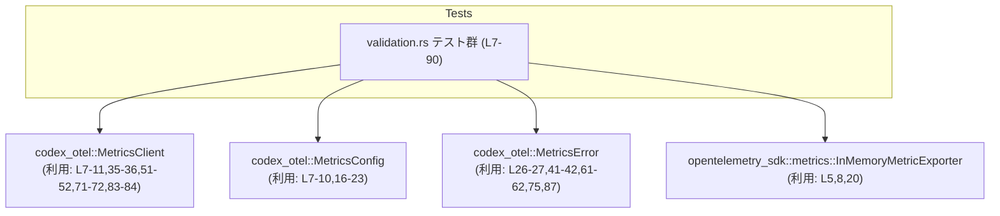
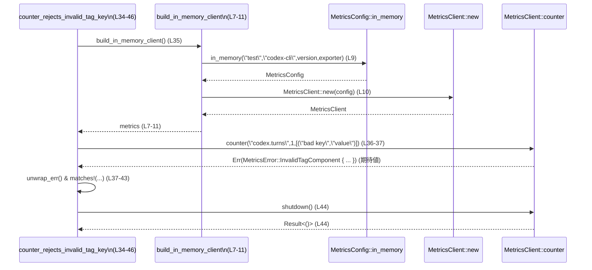

# otel/tests/suite/validation.rs コード解説

## 0. ざっくり一言

`codex_otel` のメトリクス API（設定・カウンタ・ヒストグラム）が **不正な入力を正しく拒否しているか** を検証するテスト群です（`MetricsConfig` / `MetricsClient` / `MetricsError` を使用、validation.rs:L1-5, L15-90）。

---

## 1. このモジュールの役割

### 1.1 概要

- このモジュールは、`codex_otel` のメトリクス周りの **入力バリデーション** が契約どおり動作することを確認するためのテストを提供します（validation.rs:L13-15, L32-35, L48-51, L68-71, L81-83）。
- 対象となるのは、
  - タグのキー・値（config 構築時と per-metric の両方）
  - メトリクス名
  - カウンタのインクリメント値
  に対するバリデーションです（validation.rs:L16-23, L35-38, L51-58, L72-72, L84-84）。
- 全テストは `Result<()>` を返す形で書かれており、`?` 演算子でエラー伝播を行います（validation.rs:L15, L34, L50, L70, L82）。

### 1.2 アーキテクチャ内での位置づけ

このファイルは **テストモジュール** であり、本体コード（`codex_otel` クレート）の公開 API を呼び出すだけです。

- 依存している主なコンポーネント:
  - `codex_otel::MetricsClient`（メトリクス送信クライアント；メソッド呼び出しから推測、validation.rs:L1, L7-11, L35-36, L51-52, L71-72, L83-84）
  - `codex_otel::MetricsConfig`（メトリクス設定オブジェクトと推測、validation.rs:L2, L7-10, L16-23）
  - `codex_otel::MetricsError`（メトリクス関連のエラー列挙体と推測、validation.rs:L3, L26-27, L41-42, L61-62, L75, L87）
  - `opentelemetry_sdk::metrics::InMemoryMetricExporter`（インメモリエクスポータ、validation.rs:L5, L8, L20）

依存関係の概要を Mermaid 図で示します（このチャンク全体: validation.rs:L1-90）。



※ `MetricsClient` / `MetricsConfig` / `MetricsError` の実装はこのファイルには含まれておらず、詳細な挙動は不明です。

### 1.3 設計上のポイント

コードから読み取れる設計上の特徴です。

- **テスト用クライアント生成ヘルパ**  
  - `build_in_memory_client` で In-Memory Exporter を組み込んだ `MetricsClient` を構築し、テスト間での重複を避けています（validation.rs:L7-11）。
- **テストごとに独立したクライアントインスタンス**  
  - 各テストで `build_in_memory_client` を呼び出し、自前のクライアントを取得した後、最後に `shutdown` を呼んで終了しています（validation.rs:L35-36, L44, L51-52, L64, L71, L77, L83-84, L89）。
- **エラー契約を厳密に検証**  
  - すべてのテストで `unwrap_err()` と `matches!` マクロを用い、**エラーが発生することに加えて、エラー variant とフィールド値まで一致する** ことを確認しています（validation.rs:L22-23, L24-28, L37-38, L39-43, L58-58, L59-63, L72-72, L73-76, L84-84, L85-88）。
- **言語機能を活かした安全な書き方**  
  - テスト関数は `Result<()>` を返し、`?` 演算子で `build_in_memory_client` や `shutdown` の失敗を伝播します（validation.rs:L34-35, L44, L50-51, L64, L70-71, L77, L82-83, L89）。  
    これにより、予期せぬエラーはテストの失敗として扱われ、パニックではなくエラーとして管理されています。

---

## 2. 主要な機能（コンポーネントインベントリー）

このファイル内で定義される関数の一覧です。

| 名前 | 種別 | 役割 / 説明 | 行範囲 |
|------|------|-------------|--------|
| `build_in_memory_client` | 非テスト関数 | In-Memory Exporter を使った `MetricsClient` を生成するヘルパ関数 | validation.rs:L7-11 |
| `invalid_tag_component_is_rejected` | テスト | config 構築時に不正なタグキーが指定された場合のエラー検証 | validation.rs:L15-30 |
| `counter_rejects_invalid_tag_key` | テスト | カウンタ呼び出し時の不正なタグキーに対するエラー検証 | validation.rs:L34-46 |
| `histogram_rejects_invalid_tag_value` | テスト | ヒストグラム呼び出し時の不正なタグ値に対するエラー検証 | validation.rs:L50-66 |
| `counter_rejects_invalid_metric_name` | テスト | 不正なメトリクス名を持つカウンタ呼び出し時のエラー検証 | validation.rs:L70-79 |
| `counter_rejects_negative_increment` | テスト | カウンタに負の値を渡した場合のエラー検証 | validation.rs:L81-90 |

主要な機能の概要（役割を一言で）:

- In-Memory メトリクスクライアント生成: テスト用に `MetricsClient` を構築（validation.rs:L7-11）。
- Config 構築時のタグ検証: 不正なタグコンポーネントを拒否（validation.rs:L15-30）。
- カウンタのタグキー検証: per-metric のタグキーを検証（validation.rs:L34-46）。
- ヒストグラムのタグ値検証: per-metric のタグ値を検証（validation.rs:L50-66）。
- メトリクス名検証: 不正なメトリクス名（例: `"bad name"`）を拒否（validation.rs:L70-79）。
- カウンタ値検証: 負のインクリメント値を拒否（validation.rs:L81-90）。

---

## 3. 公開 API と詳細解説

### 3.1 型一覧（構造体・列挙体など）

このファイル **内で定義される型はありません**（構造体・列挙体・型エイリアスの `struct` / `enum` / `type` 定義は存在しません、validation.rs:L1-90）。

ただし、外部からインポートして使用している主要な型は以下のとおりです。

| 名前 | 種別 | 定義元（モジュールパス） | 役割 / 用途（コードから分かる範囲） | 行範囲 |
|------|------|--------------------------|--------------------------------------|--------|
| `MetricsClient` | 外部型（おそらく構造体） | `codex_otel` | `Result<MetricsClient>` の戻り値として生成され、`counter` / `histogram` / `shutdown` メソッドを持つ型（メソッド呼び出しより事実、役割はメトリクスクライアントと推測） | validation.rs:L1, L7-11, L35-36, L51-52, L71-72, L83-84 |
| `MetricsConfig` | 外部型 | `codex_otel` | `MetricsConfig::in_memory` 関数や `with_tag` メソッドを提供する設定型と見なせます（役割はメトリクス設定と推測） | validation.rs:L2, L7-10, L16-23 |
| `MetricsError` | 外部型（おそらく enum） | `codex_otel` | `InvalidTagComponent` / `InvalidMetricName` / `NegativeCounterIncrement` の variant を持つエラー型（`matches!` のパターンから事実） | validation.rs:L3, L26-27, L41-42, L61-62, L75, L87 |
| `Result` | 型エイリアスと推測 | `codex_otel` | 戻り値として `Result<T>` を使うことで一貫したエラー型を利用（`Result<MetricsClient>` や `Result<()>` が使われています） | validation.rs:L4, L7, L15, L34, L50, L70, L82 |
| `InMemoryMetricExporter` | 外部型 | `opentelemetry_sdk::metrics` | `::default()` で生成される In-Memory メトリクスエクスポータ。構成済みの `MetricsConfig` に渡されます | validation.rs:L5, L8, L20 |

※ 役割の説明は、名称と使用方法からの推測が一部含まれます。その点は明示しています。

---

### 3.2 関数詳細

6 個すべての関数について、テンプレートに従い解説します。

#### `build_in_memory_client() -> Result<MetricsClient>`

**概要**

- テスト用に、In-Memory エクスポータを組み込んだ `MetricsClient` を構築して返すヘルパ関数です（validation.rs:L7-11）。

**引数**

- 引数はありません（validation.rs:L7）。

**戻り値**

- `Result<MetricsClient>`（validation.rs:L7）  
  - 成功時: 初期化済みの `MetricsClient` インスタンス。  
  - 失敗時: `MetricsError`（もしくは `codex_otel::Result` がラップするエラー型）を内包した `Err`。エラーの具体的な variant はこのファイルからは分かりません。

**内部処理の流れ**

1. `InMemoryMetricExporter::default()` を呼び出し、インメモリエクスポータを作成（validation.rs:L8）。
2. `MetricsConfig::in_memory("test", "codex-cli", env!("CARGO_PKG_VERSION"), exporter)` でテスト用のメトリクス設定を生成（validation.rs:L9）。
3. 上記設定を `MetricsClient::new(config)` に渡し、クライアントを生成して返します（validation.rs:L10）。

**Examples（使用例）**

テスト内での典型的な利用方法は以下のとおりです（validation.rs:L35-36）。

```rust
// テスト内での利用例
let metrics = build_in_memory_client()?; // テスト関数が Result<()> を返すため ? が使える
```

**Errors / Panics**

- `MetricsConfig::in_memory` もしくは `MetricsClient::new` がエラーを返した場合、この関数も `Err` を返します（validation.rs:L9-10）。  
  そのエラー種別はこのファイルからは不明です。
- `env!("CARGO_PKG_VERSION")` はコンパイル時に展開されるため、通常はパニック要因にはなりません（ビルド時に未定義ならコンパイルエラーになります）（validation.rs:L9）。

**Edge cases（エッジケース）**

- 特別な分岐はありません。エクスポータや設定の失敗時にどう振る舞うかは、呼び出し先の実装次第であり、このファイルからは判別できません。

**使用上の注意点**

- テストでのみ使われており、プロダクションコードから呼び出されることは想定されていません（呼び出しはすべて `#[test]` 関数内、validation.rs:L35, L51, L71, L83）。
- 戻り値は `Result` なので、呼び出し側で `?` もしくは `match` でエラー処理を行う必要があります。

---

#### `invalid_tag_component_is_rejected() -> Result<()>`

**概要**

- Config 構築時に `with_tag("bad key", "value")` のような不正なタグキーを渡した場合、`MetricsError::InvalidTagComponent` が返ることをテストします（validation.rs:L15-30）。

**引数**

- なし（テスト関数、validation.rs:L15）。

**戻り値**

- `Result<()>`（validation.rs:L15）  
  - テスト内で `?` を使うために `Result` を返しますが、この関数内では `?` は実際には使用されていません（validation.rs:L15-30）。  
  - 正常に検証が終わると `Ok(())` を返します（validation.rs:L29）。

**内部処理の流れ**

1. `MetricsConfig::in_memory(...)` で In-Memory の config を生成し（validation.rs:L16-21）、
2. その戻り値に対して `.with_tag("bad key", "value")` を呼び出します（validation.rs:L22）。
3. その結果の `Result` に対して `.unwrap_err()` を呼び、**必ず `Err` であること** を前提にエラー値を取得します（validation.rs:L22-23）。
4. `assert!(matches!(...))` で、
   - variant が `MetricsError::InvalidTagComponent { label, value }` であること
   - `label == "tag key"` かつ `value == "bad key"` であること  
   を検証します（validation.rs:L24-28）。
5. 最後に `Ok(())` を返して終了します（validation.rs:L29）。

**Examples（使用例）**

このテストが示す「不正なタグキー検証」の使い方:

```rust
let err = MetricsConfig::in_memory(
        "test",
        "codex-cli",
        env!("CARGO_PKG_VERSION"),
        InMemoryMetricExporter::default(),
    )
    .with_tag("bad key", "value")
    .unwrap_err(); // Err であることを期待

assert!(matches!(
    err,
    MetricsError::InvalidTagComponent { label, value }
        if label == "tag key" && value == "bad key"
));
```

**Errors / Panics**

- 期待通り **不正タグが `Err` を返さない場合**、`unwrap_err()` がパニックします（validation.rs:L22-23）。
- これはテストとして意図的なものであり、実装がバリデーションをしなくなった場合にテストが失敗します。

**Edge cases（エッジケース）**

- `"bad key"` はスペースを含む文字列であり、このテストでは「不正」なタグキーとして扱われています（validation.rs:L22, L27）。  
  ただし、何が「不正」なのか（スペースか、その他の条件か）の詳細は、このファイルからは判断できません。
- `with_tag` が成功（`Ok`) を返すケースはこのテストでは扱っていません。

**使用上の注意点**

- 本テストは `label` に `"tag key"` が入ることも検証するため、`MetricsError::InvalidTagComponent` のフィールド値仕様を変更する場合には、このテストの修正が必要になります（validation.rs:L26-27）。

---

#### `counter_rejects_invalid_tag_key() -> Result<()>`

**概要**

- `MetricsClient::counter` 呼び出し時に、不正なタグキー（`"bad key"`）を含む配列を渡した場合に `MetricsError::InvalidTagComponent` が返ることをテストします（validation.rs:L34-46）。

**引数**

- なし（テスト関数、validation.rs:L34）。

**戻り値**

- `Result<()>`（validation.rs:L34）。`build_in_memory_client` や `metrics.shutdown` からのエラーを `?` で伝播します（validation.rs:L35, L44）。

**内部処理の流れ**

1. `build_in_memory_client()?` を呼び出し、`metrics` クライアントを取得（validation.rs:L35）。
2. `metrics.counter("codex.turns", 1, &[("bad key", "value")])` を呼び出し（validation.rs:L36-37）、
3. 戻り値に対して `.unwrap_err()` を呼び、エラーである前提で値を取得（validation.rs:L37-38）。
4. `assert!(matches!(...))` で `MetricsError::InvalidTagComponent { label, value }` かつ `label == "tag key"`, `value == "bad key"` を検証（validation.rs:L39-43）。
5. `metrics.shutdown()?` を呼び、クライアントを正しくシャットダウン（validation.rs:L44）。
6. 最後に `Ok(())` を返します（validation.rs:L45）。

**Examples（使用例）**

```rust
let metrics = build_in_memory_client()?; // In-Memory クライアントを生成
let err = metrics
    .counter("codex.turns", 1, &[("bad key", "value")])
    .unwrap_err();

assert!(matches!(
    err,
    MetricsError::InvalidTagComponent { label, value }
        if label == "tag key" && value == "bad key"
));

metrics.shutdown()?; // 後始末
```

**Errors / Panics**

- `metrics.counter` が `Ok` を返した場合、`.unwrap_err()` がパニックします（validation.rs:L37-38）。
- `build_in_memory_client` か `metrics.shutdown` が `Err` を返した場合、`?` によってテストが `Err` で終了します（validation.rs:L35, L44）。

**Edge cases**

- タグキー `"bad key"`（スペースを含む）を不正として扱う仕様を仮定していますが、何が不正条件かはこのファイルからは確定できません（validation.rs:L37, L42）。
- タグ配列が空の場合や、複数タグを持つ場合の挙動はこのテストからは分かりません。

**使用上の注意点**

- `metrics.shutdown()` が明示的に呼ばれているため、クライアント利用後のシャットダウンが要求される API であることが示唆されます（validation.rs:L44）。  
  本仕様は `MetricsClient` の実装側を確認する必要があります。

---

#### `histogram_rejects_invalid_tag_value() -> Result<()>`

**概要**

- `MetricsClient::histogram` 呼び出し時に、不正なタグ値（`"bad value"`）を含むタグを渡すと `MetricsError::InvalidTagComponent`（`label == "tag value"`）が返ることをテストします（validation.rs:L50-66）。

**引数**

- なし（validation.rs:L50）。

**戻り値**

- `Result<()>`（validation.rs:L50）。`build_in_memory_client` と `shutdown` からのエラーを `?` で伝播します（validation.rs:L51, L64）。

**内部処理の流れ**

1. `build_in_memory_client()?` で `metrics` を取得（validation.rs:L51）。
2. `metrics.histogram("codex.request_latency", 3, &[("route", "bad value")])` を呼ぶ（validation.rs:L52-57）。
3. 戻り値に対して `.unwrap_err()` を実行（validation.rs:L58）。
4. `MetricsError::InvalidTagComponent { label, value }` かつ `label == "tag value"`, `value == "bad value"` であることを `matches!` で検証（validation.rs:L59-63）。
5. `metrics.shutdown()?` の後、`Ok(())` を返す（validation.rs:L64-65）。

**Examples（使用例）**

```rust
let metrics = build_in_memory_client()?;
let err = metrics
    .histogram("codex.request_latency", 3, &[("route", "bad value")])
    .unwrap_err();

assert!(matches!(
    err,
    MetricsError::InvalidTagComponent { label, value }
        if label == "tag value" && value == "bad value"
));

metrics.shutdown()?;
```

**Errors / Panics**

- `histogram` が `Ok` を返した場合、`.unwrap_err()` がパニックします（validation.rs:L58）。
- `build_in_memory_client`/`shutdown` が `Err` のとき、`?` によりテストが `Err` で終了します（validation.rs:L51, L64）。

**Edge cases**

- タグ値 `"bad value"`（スペースを含む）を不正として扱う仕様を検証していますが、詳細な不正条件は不明です（validation.rs:L56, L62）。
- 他のタグ値形式（空文字列・非常に長い文字列など）はこのテストでは扱っていません。

**使用上の注意点**

- このテストから、`MetricsError::InvalidTagComponent` がタグキーとタグ値を区別するための `label` フィールドを持っていることが分かります（validation.rs:L61-62）。

---

#### `counter_rejects_invalid_metric_name() -> Result<()>`

**概要**

- カウンタの名前として `"bad name"`（スペースを含む）を指定した場合に `MetricsError::InvalidMetricName` が返ることをテストします（validation.rs:L70-79）。

**引数**

- なし（validation.rs:L70）。

**戻り値**

- `Result<()>`（validation.rs:L70）。`build_in_memory_client` と `shutdown` のエラーを `?` で伝播します（validation.rs:L71, L77）。

**内部処理の流れ**

1. `build_in_memory_client()?` で `metrics` を取得（validation.rs:L71）。
2. `metrics.counter("bad name", 1, &[])` を実行（validation.rs:L72）。
3. `.unwrap_err()` でエラーを取り出す（validation.rs:L72）。
4. `assert!(matches!(err, MetricsError::InvalidMetricName { name } if name == "bad name"))` で variant と name が一致することを検証（validation.rs:L73-76）。
5. `metrics.shutdown()?` の後、`Ok(())` を返す（validation.rs:L77-78）。

**Examples（使用例）**

```rust
let metrics = build_in_memory_client()?;
let err = metrics.counter("bad name", 1, &[]).unwrap_err();

assert!(matches!(
    err,
    MetricsError::InvalidMetricName { name } if name == "bad name"
));

metrics.shutdown()?;
```

**Errors / Panics**

- `metrics.counter` が `Ok` を返した場合、`.unwrap_err()` がパニックします（validation.rs:L72）。
- `build_in_memory_client` / `shutdown` のエラーは `?` によって伝播します（validation.rs:L71, L77）。

**Edge cases**

- `"bad name"` はスペースを含む名前で、このテストでは「不正」なメトリクス名の一例として使われています（validation.rs:L72, L75）。  
  「不正」な条件がスペースの有無なのか、その他の制約なのかは、実装を見ないと不明です。
- 正常なメトリクス名（例: `"codex.turns"`）との比較は他のテスト（`counter_rejects_invalid_tag_key`）の呼び出しから推測できます（validation.rs:L37）。

**使用上の注意点**

- `MetricsError::InvalidMetricName` variant の `name` フィールドに、実際に指定したメトリクス名が入ることを確認しているため、この挙動を変える場合はテスト更新が必要です（validation.rs:L73-76）。

---

#### `counter_rejects_negative_increment() -> Result<()>`

**概要**

- カウンタに負のインクリメント値 `-1` を渡した場合に、`MetricsError::NegativeCounterIncrement { name, inc }` が返ることをテストします（validation.rs:L81-90）。

**引数**

- なし（validation.rs:L82）。

**戻り値**

- `Result<()>`（validation.rs:L82）。`build_in_memory_client` / `shutdown` のエラーを `?` で伝播します（validation.rs:L83, L89）。

**内部処理の流れ**

1. `build_in_memory_client()?` で `metrics` を取得（validation.rs:L83）。
2. `metrics.counter("codex.turns", -1, &[])` を呼び出す（validation.rs:L84）。
3. `.unwrap_err()` により、`Err` を必須としてエラー値を取得（validation.rs:L84）。
4. `assert!(matches!(err, MetricsError::NegativeCounterIncrement { name, inc } if name == "codex.turns" && inc == -1))` で variant と `name` / `inc` フィールドを検証（validation.rs:L85-88）。
5. `metrics.shutdown()?` の後 `Ok(())` を返す（validation.rs:L89-90）。

**Examples（使用例）**

```rust
let metrics = build_in_memory_client()?;
let err = metrics.counter("codex.turns", -1, &[]).unwrap_err();

assert!(matches!(
    err,
    MetricsError::NegativeCounterIncrement { name, inc }
        if name == "codex.turns" && inc == -1
));

metrics.shutdown()?;
```

**Errors / Panics**

- `metrics.counter` が負のインクリメントを許容して `Ok` を返すと、`.unwrap_err()` がパニックします（validation.rs:L84）。
- 他のテストと同様に、`build_in_memory_client` / `shutdown` のエラーは `?` で伝播します（validation.rs:L83, L89）。

**Edge cases**

- インクリメントが 0 や非常に大きい数値などのケースは、このファイルでは検証されていません。
- 負の値の代表例として `-1` のみが使われています（validation.rs:L84, L88）。

**使用上の注意点**

- `MetricsError::NegativeCounterIncrement` の `name` と `inc` フィールドが、元の引数をそのまま含むことを前提にしています（validation.rs:L85-88）。

---

### 3.3 その他の関数

- 本ファイルの関数はすべて上記で詳細説明済みであり、このセクションで挙げる補助関数はありません。

---

## 4. データフロー

代表的なシナリオとして、`counter_rejects_invalid_tag_key` におけるデータの流れを示します（validation.rs:L34-46）。

**テキストでの流れ**

1. テスト関数 `counter_rejects_invalid_tag_key` が `build_in_memory_client()` を呼び、In-Memory エクスポータ付きの `MetricsClient` を取得します（validation.rs:L35-36）。
2. テストは `metrics.counter("codex.turns", 1, &[("bad key", "value")])` を実行し、`Result` を得ます（validation.rs:L36-37）。
3. `unwrap_err()` によって、`Result` が `Err(MetricsError::InvalidTagComponent { ... })` であることを前提にエラー値を取り出します（validation.rs:L37-38）。
4. `matches!` で variant とフィールドを検証し、期待通りのエラーであることを確認します（validation.rs:L39-43）。
5. 最後に `metrics.shutdown()` を呼び、クライアントを終了します（validation.rs:L44）。

**Mermaid シーケンス図**



※ `MetricsConfig::in_memory` や `MetricsClient::new` / `counter` / `shutdown` の内部実装はこのチャンクにはないため、図は呼び出し関係のみを示しています。

**並行性について**

- このファイル内にスレッド生成 (`std::thread::spawn` など) や `async` / `await` は一切登場せず、**すべて同期的な処理** です（validation.rs:L1-90）。
- 複数テストが並列実行されるかどうかは、Rust のテストランナー側の設定に依存し、このファイルからは分かりません。

---

## 5. 使い方（How to Use）

### 5.1 基本的な使用方法

このファイルはテストコードですが、`MetricsClient` / `MetricsConfig` の基本的な利用パターンを示しています。

典型的なフロー:

```rust
use codex_otel::{MetricsClient, MetricsConfig, Result};
use opentelemetry_sdk::metrics::InMemoryMetricExporter;

// 1. Exporter を準備
let exporter = InMemoryMetricExporter::default(); // validation.rs:L8

// 2. Config を構築（in-memory 用）
let config = MetricsConfig::in_memory(
    "test",
    "codex-cli",
    env!("CARGO_PKG_VERSION"),
    exporter,
); // validation.rs:L9, L16-21

// 3. MetricsClient を生成
let metrics = MetricsClient::new(config)?; // validation.rs:L10

// 4. メトリクスを記録（例: カウンタ）
metrics.counter("codex.turns", 1, &[("route", "/api")])?;

// 5. 利用終了時にシャットダウン
metrics.shutdown()?; // validation.rs:L44, L64, L77, L89
```

このファイルでは、あえて不正な入力を渡してエラーを検証していますが、正常系では `?` を使って `Result` を処理する使い方が想定されます。

### 5.2 よくある使用パターン

1. **テスト用 In-Memory クライアントの構築**  
   - `build_in_memory_client` のように In-Memory Exporter を使って、テスト環境でだけ使うクライアントを構築する（validation.rs:L7-11）。

2. **エラー契約のテスト**  
   - 不正な入力をあえて渡し、`.unwrap_err()` + `matches!` でエラー variant とそのフィールドを検証するパターン（validation.rs:L22-23, L24-28, L37-38, L39-43, L58-58, L59-63, L72, L73-76, L84, L85-88）。

3. **テスト終了時の明示的シャットダウン**  
   - 各テストで `metrics.shutdown()?` を呼び、後始末を行うパターン（validation.rs:L44, L64, L77, L89）。

### 5.3 よくある間違い（このテストが防いでいるもの）

このファイルのテストは、以下のような誤用を検出する目的で書かれています。

```rust
// 間違い例 1: 不正なタグキー（スペースを含むなど）
metrics.counter("codex.turns", 1, &[("bad key", "value")])?;
// → テストでは MetricsError::InvalidTagComponent { label: "tag key", value: "bad key" } を期待（validation.rs:L37-43）

// 間違い例 2: 不正なタグ値
metrics.histogram("codex.request_latency", 3, &[("route", "bad value")])?;
// → MetricsError::InvalidTagComponent { label: "tag value", value: "bad value" } を期待（validation.rs:L52-63）

// 間違い例 3: 不正なメトリクス名
metrics.counter("bad name", 1, &[])?;
// → MetricsError::InvalidMetricName { name: "bad name" } を期待（validation.rs:L72-76）

// 間違い例 4: カウンタへの負のインクリメント
metrics.counter("codex.turns", -1, &[])?;
// → MetricsError::NegativeCounterIncrement { name: "codex.turns", inc: -1 } を期待（validation.rs:L84-88）
```

### 5.4 使用上の注意点（まとめ）

- **エラー型の契約**
  - 指定された不正入力に対して、  
    - タグキー: `MetricsError::InvalidTagComponent { label: "tag key", value: <key> }`（validation.rs:L39-43）  
    - タグ値: `MetricsError::InvalidTagComponent { label: "tag value", value: <value> }`（validation.rs:L59-63）  
    - メトリクス名: `MetricsError::InvalidMetricName { name }`（validation.rs:L73-76）  
    - 負のカウンタ: `MetricsError::NegativeCounterIncrement { name, inc }`（validation.rs:L85-88）  
    となることがこのテストの前提です。
- **タグ・メトリクス名の制約**
  - このテストは「スペースを含むキー・値・名前」が不正な例として使われていますが、正確な制約条件（許可される文字種など）はコードからは分かりません。
- **シャットダウンの呼び出し**
  - 各テストで `metrics.shutdown()?` が呼ばれていることから、クライアントの明示的なクローズ操作が必要であることが示唆されます（validation.rs:L44, L64, L77, L89）。
- **安全性・パニック**
  - テストは意図的に `.unwrap_err()` を使用しているため、実装側が仕様を満たさないとパニックしますが、これはバグ検出のための意図した挙動です（validation.rs:L22-23, L37-38, L58, L72, L84）。
- **セキュリティ面**
  - ファイル I/O やネットワークアクセスは行っておらず、すべてインメモリの処理です（validation.rs:L1-90）。このファイルから読み取れる範囲では、特別なセキュリティ上の懸念はありません。

---

## 6. 変更の仕方（How to Modify）

### 6.1 新しい機能（バリデーション）を追加する場合

新たなバリデーション仕様（例: ヒストグラムのメトリクス名ルール、タグ長の制限など）を `codex_otel` 側に実装した際、このテストファイルにテストを追加する流れの一例です。

1. **既存テストを参考にする**
   - 近い性質のテスト（カウンタ名／タグなど）を確認し、パターンを把握します（validation.rs:L34-46, L50-66, L70-79, L81-90）。
2. **テスト関数名とコメントを決める**
   - 例: `histogram_rejects_invalid_metric_name` のように「対象メトリクス + rejects + 条件」を関数名に含めると、一貫性が保たれます。
3. **不正入力を用意して呼び出す**
   - `build_in_memory_client()?` でクライアントを用意し、対象メソッドに不正入力を渡して `.unwrap_err()` を呼びます（validation.rs:L35-38, L51-58, L71-72, L83-84）。
4. **期待される `MetricsError` variant を `matches!` で検証**
   - フィールド値まで検証するスタイルに揃えます（validation.rs:L24-28, L39-43, L59-63, L73-76, L85-88）。
5. **最後に `metrics.shutdown()?` を呼ぶ**
   - 資源解放のパターンを合わせます（validation.rs:L44, L64, L77, L89）。

### 6.2 既存の機能（バリデーション仕様）を変更する場合

バリデーション仕様やエラー型の構造を変更する際に注意すべき点です。

- **エラー variant 名・フィールドの変更**
  - `MetricsError::InvalidTagComponent` / `InvalidMetricName` / `NegativeCounterIncrement` の **variant 名・フィールド名** を変更した場合、`matches!` のパターンがコンパイルエラーになります（validation.rs:L26-27, L41-42, L61-62, L75, L87）。
- **エラー時の `label` / `value` の内容変更**
  - `label == "tag key"` / `"tag value"` といった文字列は契約としてテストされています（validation.rs:L26-27, L41-42, L61-62）。  
    これらの文字列を変更する場合、テストの期待値も更新する必要があります。
- **「不正」判定条件の変更**
  - 例えば「スペースを含むタグは不正」という条件を緩和/強化する場合、新旧仕様に応じてテストケースを追加・修正します。  
    現在は `"bad key"` / `"bad value"` / `"bad name"` のような具体例に依存しています（validation.rs:L22, L37, L56, L72, L84）。
- **シャットダウンの仕様変更**
  - `metrics.shutdown()` のエラー契約を変える場合、各テストで `?` を通じてエラーが外に伝播する点を考慮し、必要なら専用のテスト（シャットダウン失敗時の挙動など）を追加します（validation.rs:L44, L64, L77, L89）。

---

## 7. 関連ファイル

このテストモジュールと密接に関連するコードは、`codex_otel` クレート内のメトリクス関連コンポーネントです。具体的なファイルパスは、このチャンクには現れません。

| パス / モジュール | 役割 / 関係 |
|-------------------|------------|
| `codex_otel::MetricsClient` | メトリクス送信のためのクライアント型と推測。`counter` / `histogram` / `shutdown` メソッドがテストから利用されます（validation.rs:L35-37, L51-52, L71-72, L83-84）。 |
| `codex_otel::MetricsConfig` | メトリクス設定を表す型と推測。`in_memory` 関数および `with_tag` メソッドがテストで利用されています（validation.rs:L7-10, L16-23）。 |
| `codex_otel::MetricsError` | メトリクス関連エラーの列挙体。`InvalidTagComponent` / `InvalidMetricName` / `NegativeCounterIncrement` を通じてバリデーション仕様を表現しています（validation.rs:L26-27, L41-42, L61-62, L75, L87）。 |
| `opentelemetry_sdk::metrics::InMemoryMetricExporter` | In-Memory のメトリクスエクスポータ。テスト用クライアント構築のための依存コンポーネントです（validation.rs:L5, L8, L20）。 |

これらの実装詳細を確認することで、タグやメトリクス名のバリデーション仕様、`MetricsError` の全 variant、スレッド安全性などをより正確に把握できますが、その情報は本チャンクには含まれていません。
