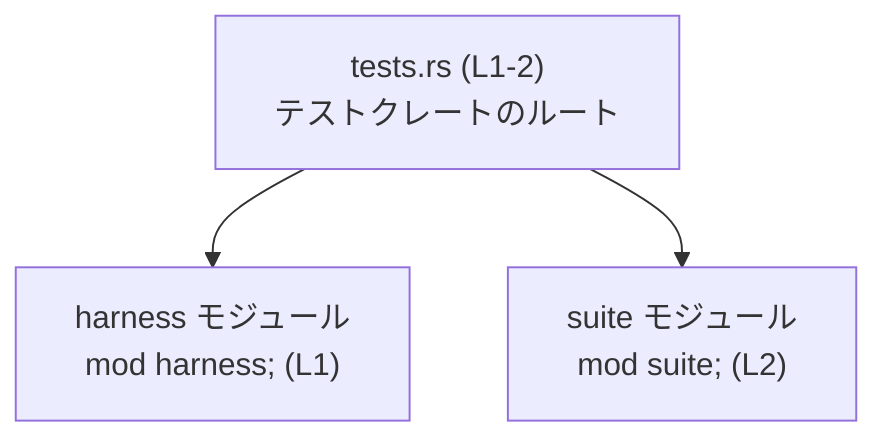

# otel/tests/tests.rs 解説レポート

## 0. ざっくり一言

このファイルは、テスト用クレート（またはテストモジュール）のルートとして、2 つのサブモジュール `harness` と `suite` をコンパイル対象に登録する役割を持っています（`tests.rs:L1-2`）。

---

## 1. このモジュールの役割

### 1.1 概要

- このファイルは **テストコードを格納したサブモジュールを束ねるエントリポイント** となっています。
- 具体的には、`mod harness;` と `mod suite;` によって 2 つのモジュールを宣言しており、実際のテストロジックはそれらのモジュール側に分割されている構造になっています（`tests.rs:L1-2`）。
- このファイル自身には関数・型定義やテスト関数は存在しません。

### 1.2 アーキテクチャ内での位置づけ

このファイルを中心としたモジュール依存関係は、次のように整理できます。



- `tests.rs` はこのテストコンパイル単位のルートモジュールです。
- ルートから `harness` と `suite` という 2 つのモジュールが読み込まれます（`tests.rs:L1-2`）。
- `harness`・`suite` の内部構造や提供 API は、このチャンクの情報からは分かりません（「このチャンクには現れない」）。

### 1.3 設計上のポイント

コードから読み取れる設計上の特徴は次のとおりです。

- **責務の分割**
  - ルートファイル `tests.rs` はモジュール宣言だけを持ち、実際のテストロジックを `harness` および `suite` に分離しています（`tests.rs:L1-2`）。
- **状態管理**
  - このファイル内にはグローバル変数や構造体などの状態を持つ要素はありません。
- **エラーハンドリング**
  - 実行時ロジックがないため、ランタイムエラー処理は行っていません。
  - 代わりに、コンパイル時の前提条件（対応するモジュールファイルが存在することなど）が重要になります。存在しない場合はコンパイルエラーになります。

---

## 2. 主要な機能一覧（＋コンポーネントインベントリー）

このファイルが提供する機能は非常に限定的で、次の 1 点に集約されます。

- **サブモジュールの登録**
  - `harness` モジュールの宣言（`tests.rs:L1`）
  - `suite` モジュールの宣言（`tests.rs:L2`）

### コンポーネント一覧（このファイル内）

| 名前          | 種別           | 定義位置              | 根拠                        | 役割 / 説明 |
|---------------|----------------|-----------------------|-----------------------------|-------------|
| （暗黙のルート） | モジュール（ファイル全体） | `tests.rs` 全体        | ファイル構造（`tests.rs:L1-2`） | テストクレート（またはテストモジュール）のルート。`harness` と `suite` を包含する。 |
| `harness`     | サブモジュール | `mod harness;`        | `tests.rs:L1-1`            | テスト関連のロジックを含むと推測されるサブモジュール。内容はこのチャンクには現れない。 |
| `suite`       | サブモジュール | `mod suite;`          | `tests.rs:L2-2`            | テストケース群などを含む可能性があるサブモジュール。内容はこのチャンクには現れない。 |

> 備考: `mod harness;` / `mod suite;` は、Rust のモジュール規則に従い、通常は同一ディレクトリ内の `harness.rs` / `suite.rs` または `harness/mod.rs` / `suite/mod.rs` に対応します。ただし、このチャンクからは実際のファイル構成は確認できません。

---

## 3. 公開 API と詳細解説

### 3.1 型一覧（構造体・列挙体など）

このファイルには構造体・列挙体などの型定義は存在しません。

| 名前 | 種別 | 役割 / 用途 | 根拠 |
|------|------|-------------|------|
| なし | -    | -           | このファイルに型定義行が存在しない（`tests.rs:L1-2`） |

### 3.2 関数詳細

このファイルには関数定義（`fn ...`）が一切存在しないため、詳細解説の対象となる関数はありません（`tests.rs:L1-2` を全て確認しても関数宣言がないことが根拠です）。

### 3.3 その他の関数

- 該当なし（このファイルに補助関数やテスト関数は定義されていません）。

---

## 4. データフロー

### 4.1 コンパイル時のモジュール解決フロー

このファイルには実行時ロジックがないため、**コンパイル時のモジュール解決** が主な「フロー」となります。

1. Rust コンパイラが `tests.rs` を読み込みます。
2. 行 1 の `mod harness;` を見て、対応する `harness` モジュールのソースを読み込みます（`tests.rs:L1`）。
3. 行 2 の `mod suite;` を見て、対応する `suite` モジュールのソースを読み込みます（`tests.rs:L2`）。

これを sequence diagram で表すと次のようになります。

```mermaid
sequenceDiagram
    participant C as Rustコンパイラ
    participant T as tests.rs (L1-2)
    participant H as harnessモジュール (mod harness; L1)
    participant S as suiteモジュール (mod suite; L2)

    C->>T: ファイルを読み込む
    T->>H: mod harness; を解決
    T->>S: mod suite; を解決
```

- ここでの「データ」はソースコードそのものです。
- 実行時に値が流れるような処理は、このファイルだけからは確認できません。

---

## 5. 使い方（How to Use）

### 5.1 基本的な使用方法

このファイル自体は通常、外部から直接呼び出す対象ではなく、**テストクレートのルート**として自動的に利用されます。

Rust の観点で見ると、`tests.rs` に書かれている内容は次のような意味になります。

```rust
mod harness; // tests.rs と同じディレクトリ内の harness モジュールを読み込む（tests.rs:L1）
mod suite;   // 同様に suite モジュールを読み込む（tests.rs:L2）
```

- 実際のテスト関数（`#[test] fn ...`）や補助ロジックは、`harness` や `suite` の中に定義されているはずですが、その内容はこのチャンクには現れません。
- `cargo test` 等でテストを実行するとき、このファイルで宣言されたモジュールに含まれるテストが（コンパイルさえ通れば）実行対象になります。

### 5.2 よくある使用パターン

このファイル構成から想定できる一般的なパターンを、言語仕様ベースで説明します。

- **テストの分類**
  - `harness` に共通のセットアップ・ヘルパ関数を置き、
  - `suite` に具体的なテストケース群を置く、といった分割がよくあります。
  - ただし、このリポジトリの実際の構成がそのようになっているかどうかは、このチャンクからは分かりません。

- **サブモジュール追加のパターン（一般的な例）**

  ```rust
  // tests.rs にモジュールを追加する例（仮想コード）
  mod harness;
  mod suite;
  mod integration_v2; // 新しいテスト群を別モジュールに分割する
  ```

  - 上記は一般的な Rust の使い方の例であり、実際にこのリポジトリに `integration_v2` が存在するわけではありません。

### 5.3 よくある間違い（このファイルに関するもの）

このファイルの内容に関連して発生しうる典型的な誤りは、次のようなものです。

```rust
// 間違い例: モジュール宣言だけして対応するファイルを用意していない
mod harness; // tests.rs:L1 に相当
mod suite;   // tests.rs:L2 に相当
// → harness.rs / suite.rs（または対応する mod.rs）が存在しないとコンパイルエラーになる
```

```rust
// 正しい例（一般的なパターン）:
// tests.rs（このファイル）
mod harness;
mod suite;

// 同じディレクトリに harness.rs と suite.rs を置き、そこにテスト関数を定義する
// （実際にこのリポジトリに存在するかどうかは、このチャンクからは分かりません）
```

### 5.4 使用上の注意点（まとめ）

- **前提条件**
  - `mod harness;` / `mod suite;` に対応するソースファイルが存在している必要があります（存在しない場合はコンパイルエラー）。
- **禁止事項 / 注意点**
  - このファイル内にテスト関数を置かず、サブモジュール側にも一切テストがない場合、`cargo test` を実行しても何もテストされない可能性があります。
  - 同名のモジュールを別ファイルや別ディレクトリで重複定義すると、コンパイルエラーや混乱の原因になります。
- **並行性・パフォーマンス**
  - このファイルには実行時処理がないため、並行性やパフォーマンスに関する懸念はありません。
  - 実際のテストコードの並行実行や負荷は `harness` / `suite` の中身に依存し、このチャンクからは判断できません。

---

## 6. 変更の仕方（How to Modify）

### 6.1 新しい機能（テストモジュール）を追加する場合

新しいテストモジュールを追加する一般的な手順は次のとおりです。

1. **新しいモジュールファイルを作成する**
   - 例: `otel/tests/new_suite.rs`（パスは例示であり、実在は不明です）。
2. **`tests.rs` に `mod` 宣言を追加する**

   ```rust
   mod harness;     // 既存
   mod suite;       // 既存
   mod new_suite;   // 新規に追加
   ```

3. **新モジュール内にテスト関数を定義する**
   - 例: `#[test] fn something_works() { ... }`
   - ここでのテスト内容や API 利用は `harness` / `suite` および対象クレートの API に依存しますが、このチャンクからは詳細は分かりません。

変更時のポイント:

- 対応する `.rs` / `mod.rs` ファイルを作成し忘れるとコンパイルに失敗します。
- モジュール名とファイル名は、Rust のモジュール規則に従って一致させる必要があります。

### 6.2 既存の機能（モジュール構成）を変更する場合

`harness` や `suite` の構成を変更するときの注意点です。

- **モジュール名の変更**
  - 例として `harness` を `common` にリネームする場合:
    - ファイル名を `harness.rs` → `common.rs` に変更（または `harness/mod.rs` → `common/mod.rs`）。
    - `tests.rs` の宣言も `mod harness;` → `mod common;` に変更。
    - これらが一致していないとコンパイルエラーになります。
- **モジュールの削除**
  - `suite` モジュールを削除する場合は、
    - `suite.rs`（または `suite/mod.rs`）を削除するだけでなく、
    - `tests.rs` から `mod suite;` の行（`tests.rs:L2`）も削除する必要があります。
- **影響範囲の確認**
  - `harness` / `suite` に定義されているテストやヘルパ関数を他のモジュールから `use` している場合、
    - そのパスが変わるとコンパイルエラーになるため、関連箇所をすべて確認する必要があります。
  - これらの依存関係は、このチャンクには現れないため、実際のコードベースで検索して確認する必要があります。

---

## 7. 関連ファイル

このファイルから参照されるモジュールおよび、その候補となるファイルパスを整理します。

| パス / 候補                         | 役割 / 関係 | 根拠 |
|-------------------------------------|-------------|------|
| `otel/tests/tests.rs`              | 本レポート対象のファイル。テストクレートのルートとして `mod harness;` / `mod suite;` を宣言する。 | 問題文のファイル指定、および `tests.rs:L1-2` |
| `otel/tests/harness.rs` または `otel/tests/harness/mod.rs` | `mod harness;` が解決される先の候補。実際に存在するかどうかはこのチャンクからは不明。 | Rust のモジュール規則と `tests.rs:L1-1` |
| `otel/tests/suite.rs` または `otel/tests/suite/mod.rs`   | `mod suite;` が解決される先の候補。実際に存在するかどうかはこのチャンクからは不明。 | Rust のモジュール規則と `tests.rs:L2-2` |

> テストコードそのもの（テスト関数、アサーション、OTel 関連のロジックなど）は、おそらく `harness` / `suite` 側に定義されていますが、その内容はこのチャンクには現れません。そのため、バグ・セキュリティ・パフォーマンス・観測可能性（ログ・メトリクス）の詳細についても、このファイル単体からは判断できません。

---

### このファイル単体から読み取れる契約・エッジケースのまとめ

- **契約（前提条件）**
  - `mod harness;` / `mod suite;` に対応するモジュールが、コンパイル時に解決できる場所に存在していること。
- **エッジケース**
  - 片方のみ存在する（例: `harness` はあるが `suite` がない）場合、`tests.rs` の該当行だけがコンパイルエラーの原因となります。
  - `harness` / `suite` どちらも空モジュールであれば、テストクレートはコンパイルは通るものの、実行されるテストが 0 件になる可能性があります。
- **セキュリティ・並行性・性能**
  - このファイルには実行コードがないため、これらの観点に影響するロジックは存在しません。
  - 実際のテストの振る舞いは `harness` / `suite` の中身に依存し、ここからは分かりません。
