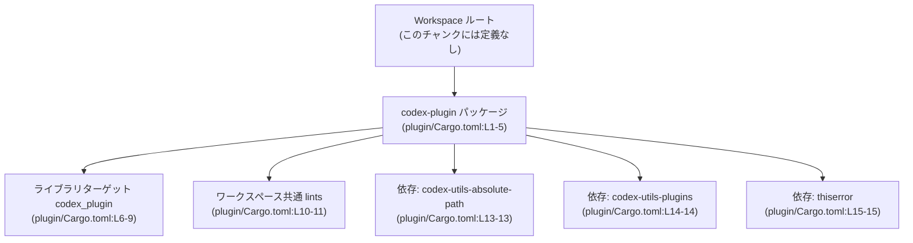
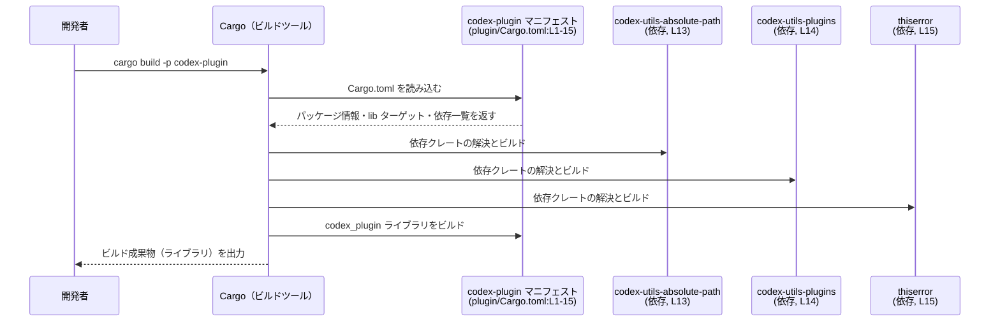

# plugin/Cargo.toml コード解説

## 0. ざっくり一言

`plugin/Cargo.toml` は、Rust クレート `codex-plugin` の Cargo マニフェストで、ライブラリターゲット `codex_plugin` の基本メタデータ・ビルド設定・依存クレートを定義しています（plugin/Cargo.toml:L1-9, L12-15）。

---

## 1. このモジュールの役割

### 1.1 概要

- このファイルは Rust のビルドツール Cargo に対して、**`codex-plugin` パッケージの定義と依存関係** を伝えるために存在します（plugin/Cargo.toml:L1-5, L12-15）。
- ライブラリクレート `codex_plugin` のエントリポイント `src/lib.rs` を指定し（plugin/Cargo.toml:L6-9）、ワークスペース共通の edition / license / version / lints を参照します（plugin/Cargo.toml:L2-3, L5, L10-11）。

### 1.2 アーキテクチャ内での位置づけ

このマニフェストは、「workspace 全体」から見た `codex-plugin` クレートの位置づけと依存関係を定義します。



- edition / license / version / lints は workspace ルート側に実体があり、このファイルからそれらを参照しています（`.workspace = true` / `workspace = true` 指定, plugin/Cargo.toml:L2-3, L5, L10-11）。
- コアロジックや公開 API は `src/lib.rs` にあると考えられますが、その中身はこのチャンクには現れません（plugin/Cargo.toml:L9）。

### 1.3 設計上のポイント（このファイルから読み取れる範囲）

- **ワークスペース共通設定の活用**  
  edition / license / version / lints を workspace 共通値に委譲しており、複数クレートでの一貫性を保つ構成になっています（plugin/Cargo.toml:L2-3, L5, L10-11）。
- **ライブラリクレート専用（bin 未定義）**  
  `[lib]` セクションのみが定義されており、バイナリターゲットは定義されていません（plugin/Cargo.toml:L6-9）。
- **ドキュメントテストの無効化**  
  `doctest = false` により、`src/lib.rs` などのドキュメントコメント中のコードブロックは doctest として実行されません（plugin/Cargo.toml:L7）。
- **エラー処理用クレートへの依存**  
  `thiserror` に依存しており、エラー型を定義する準備が整っていますが、具体的なエラー型やエラー発生条件はこのチャンクには現れません（plugin/Cargo.toml:L15）。
- **プラグイン関連ユーティリティへの依存**  
  `codex-utils-absolute-path` と `codex-utils-plugins` に依存していますが、その API や挙動はこのチャンクからは分かりません（plugin/Cargo.toml:L13-14）。

---

## 2. 主要な機能一覧

### 2.1 コンポーネントインベントリー

このチャンクに **定義が現れるコンポーネント** の一覧です（関数・構造体など Rust コードそのものは含まれません）。

| コンポーネント | 種別 | 役割 / 説明 | 定義箇所 |
|---------------|------|-------------|----------|
| `codex-plugin` | Cargo パッケージ | パッケージ名。workspace 内でのクレート識別子になります。 | plugin/Cargo.toml:L1-5 |
| `codex_plugin` | ライブラリターゲット | `src/lib.rs` をルートとするライブラリクレート。公開 API やコアロジックはここに実装されますが、このチャンクには現れません。 | plugin/Cargo.toml:L6-9 |
| edition（workspace） | 共通メタデータ（参照） | Rust edition を workspace 共通設定から参照します。 | plugin/Cargo.toml:L2-2 |
| license（workspace） | 共通メタデータ（参照） | ライセンス文字列を workspace 共通設定から参照します。 | plugin/Cargo.toml:L3-3 |
| version（workspace） | 共通メタデータ（参照） | バージョン番号を workspace 共通設定から参照します。 | plugin/Cargo.toml:L5-5 |
| lints（workspace） | 共通 lint 設定（参照） | 警告レベルなどの lint 設定を workspace 共通設定から適用します。 | plugin/Cargo.toml:L10-11 |
| `codex-utils-absolute-path` | 依存クレート | workspace 内で定義された依存クレート。名前から絶対パスに関するユーティリティであると推測されますが、このチャンクから挙動は断定できません。 | plugin/Cargo.toml:L13-13 |
| `codex-utils-plugins` | 依存クレート | workspace 内の別クレート。プラグイン管理に関係する可能性がありますが、詳細はこのチャンクには現れません。 | plugin/Cargo.toml:L14-14 |
| `thiserror` | 依存クレート | 一般にエラー型定義に用いられるクレート。`codex_plugin` から利用可能な状態です。 | plugin/Cargo.toml:L15-15 |

#### このチャンクに現れる関数・型定義

- Rust の関数・構造体・列挙体などの**定義そのものは一切含まれていません**（すべての行が Cargo の設定記述のみ, plugin/Cargo.toml:L1-15）。
- `codex_plugin` クレートの公開 API / コアロジックは `src/lib.rs` にあると考えられますが、その内容は **このチャンクには現れない** ため、不明です（plugin/Cargo.toml:L9）。

### 2.2 このマニフェストが提供する主要な「機能」

- パッケージメタデータの定義（名前、バージョン、ライセンス、edition を workspace 共通設定経由で指定）（plugin/Cargo.toml:L1-5）。
- ライブラリターゲット `codex_plugin` のエントリポイントと doctest 設定（plugin/Cargo.toml:L6-9）。
- lint 設定を workspace 共通設定から一括適用（plugin/Cargo.toml:L10-11）。
- 3 つの依存クレートの宣言（plugin/Cargo.toml:L12-15）。

---

## 3. 公開 API と詳細解説

### 3.1 型一覧（構造体・列挙体など）

このファイルは Cargo の設定ファイルであり、Rust の型定義は含まれていません。

| 名前 | 種別 | 役割 / 用途 | 備考 |
|------|------|-------------|------|
| （なし） | - | - | Rust の構造体・列挙体・型別名などはこのファイルには現れません（plugin/Cargo.toml:L1-15）。 |

※ 実際の公開 API（構造体・関数など）は `src/lib.rs` で定義されますが、その内容はこのチャンクからは分かりません（plugin/Cargo.toml:L9）。

### 3.2 関数詳細（最大 7 件）

**このファイルには関数定義が存在しないため、本セクションで解説すべき関数はありません。**  
すべての行が Cargo マニフェストのキーと値の宣言になっており（plugin/Cargo.toml:L1-15）、実行時ロジックは含まれていません。

### 3.3 その他の関数

- 該当なし（Cargo 設定のみであり、関数ラッパーなども存在しません, plugin/Cargo.toml:L1-15）。

---

## 4. データフロー

このファイルから分かるのは **ビルド時の依存関係の流れ** であり、実行時の「データフロー」や「呼び出し関係」は分かりません。ここでは Cargo と依存クレートの関係をシーケンス図として示します。



- ここに示したフローは **ビルドプロセス** に限られます。  
  実行時に `codex_plugin` がどのように `codex-utils-*` や `thiserror` を呼び出すかは、このチャンクには現れません。

---

## 5. 使い方（How to Use）

### 5.1 基本的な使用方法（ビルド視点）

`codex-plugin` クレートを workspace 内で利用する基本的な流れを示します。

1. workspace ルート `Cargo.toml` で、このパッケージをメンバーとして登録する（このファイルにはその記述はありませんが、一般的には `[workspace]` の `members` に `plugin` を追加します）。
2. `plugin/Cargo.toml` で定義された内容に従って、`codex_plugin` ライブラリがビルドされます（plugin/Cargo.toml:L6-9）。
3. 同じ workspace 内の別クレートから、`codex_plugin` を依存として指定し、API を利用します。

依存として利用する側の `Cargo.toml` のイメージ（あくまで一般的な例であり、このチャンクには登場しません）:

```toml
[dependencies]
codex-plugin = { path = "plugin" } # workspace 内の plugin パッケージを参照する例
```

### 5.2 よくある使用パターン（このファイルから分かる範囲）

このマニフェストから読み取れる典型的パターンは次のとおりです。

- **ライブラリクレートとしての利用**  
  `src/lib.rs` をルートにビルドされるライブラリ `codex_plugin` を、他のクレートから `codex_plugin::...` という形で利用するパターンが想定されます（plugin/Cargo.toml:L8-9）。  
  ただし、実際にどのシンボルが存在するかはこのチャンクには現れません。
- **workspace 共通設定での一元管理**  
  edition / license / version / lints を workspace ルートに一元管理することで、複数クレートの設定を揃えるパターンです（plugin/Cargo.toml:L2-3, L5, L10-11）。

### 5.3 よくある間違い（この設定に関して起こり得るもの）

このファイルに関係しうる誤用例を、Cargo 設定の観点から挙げます。

```toml
# 間違い例: workspace ルートで edition/version/license を定義していないのに
# 個々のクレート側で `.workspace = true` を指定している
[package]
edition.workspace = true
license.workspace = true
version.workspace = true
```

- workspace ルートに対応するキーが定義されていない場合、Cargo はビルド時にエラーになります。

```toml
# 正しい例（イメージ）: workspace ルート側に共通設定を持たせたうえで、
# 個々のクレートが `.workspace = true` でそれを参照する
# (これは plugin/Cargo.toml には含まれない root 側の設定例です)

# ルート Cargo.toml
[workspace.package]
edition = "2021"
license = "MIT"
version = "0.1.0"
```

`plugin/Cargo.toml` では実際に `.workspace = true` が指定されているため（plugin/Cargo.toml:L2-3, L5, L10-11）、この前提が満たされていないとビルドに失敗します。

### 5.4 使用上の注意点（まとめ）

このマニフェストに関する共通の注意点です。

- **workspace ルートの前提**  
  - `edition.workspace = true` / `license.workspace = true` / `version.workspace = true` / `lints.workspace = true` が指定されているため（plugin/Cargo.toml:L2-3, L5, L10-11）、workspace ルートの `Cargo.toml` でこれらが定義されている必要があります。  
    定義がない場合、Cargo がエラーを出します。
- **doctest が無効**  
  - `doctest = false` により、ドキュメントコメント中のコード例がテストされません（plugin/Cargo.toml:L7）。  
    そのため、ドキュメントのコードが古くなってもビルドで検出されない可能性があります。
- **エラー処理 / 安全性 / 並行性について**  
  - `thiserror` に依存しているため、エラー型は `thiserror` を使って表現できる状態ですが、実際にどのようなエラーが定義されているかは不明です（plugin/Cargo.toml:L15）。  
  - 並行性（スレッド安全性や非同期処理）に関する情報はこのファイルには一切書かれていません。公開 API のスレッド安全性などは `src/lib.rs` の実装を確認する必要があります（plugin/Cargo.toml:L9）。
- **セキュリティへの影響**  
  - このファイル自体は設定のみであり、直接的なセキュリティホールは含みません。  
    ただし、依存クレート（特に `codex-utils-*` や `thiserror`）のバージョンや設定は workspace ルート側で管理されているため、セキュリティ上の更新状況はそちらを確認する必要があります（plugin/Cargo.toml:L13-15）。

---

## 6. 変更の仕方（How to Modify）

### 6.1 新しい機能を追加する場合（このファイルに対する変更）

「新しい機能」といっても、このファイルでは **ビルド構成レベルの変更** に限られます。

- **新しい依存クレートを追加する**  
  - `codex_plugin` に別のユーティリティクレートなどを利用させたい場合、`[dependencies]` セクションに追記します（plugin/Cargo.toml:L12-15）。
- **feature フラグを導入する**  
  - 条件付きコンパイルを導入する場合、`[features]` セクションを追加することになりますが、このチャンクにはまだ存在しません。必要があれば新規追加します。
- **ドキュメントテストを有効にする**  
  - `doctest = false` を削除するか `true` に変更すると、ドキュメントコメントのコード例がテストされるようになります（plugin/Cargo.toml:L7）。

### 6.2 既存の機能を変更する場合（影響範囲と注意点）

- **パッケージ名の変更 (`name = "codex-plugin"`)**  
  - 他クレートの `Cargo.toml` からの依存指定に影響します（plugin/Cargo.toml:L4）。  
    workspace 内の依存関係（`[dependencies]` など）をすべて確認する必要があります。
- **ライブラリ名の変更 (`name = "codex_plugin"`)**  
  - `use codex_plugin::...` のようなコード上のパスに影響します（plugin/Cargo.toml:L8）。  
    既存のコードをすべて置き換える必要があり、変更範囲が大きくなり得ます。
- **依存クレートの削除・変更**  
  - `codex-utils-absolute-path` / `codex-utils-plugins` / `thiserror` を削除・差し替えする場合、`src/lib.rs` などでその依存を利用しているコードを全て確認し、コンパイルエラーや挙動変更がないかを確認する必要があります（plugin/Cargo.toml:L13-15）。
- **workspace 共通設定の解除**  
  - `.workspace = true` をやめてローカルに値を書くことも可能ですが（plugin/Cargo.toml:L2-3, L5, L10-11）、workspace 内の他クレートと設定がずれるため、バージョンや edition の不一致による混乱を生む可能性があります。

---

## 7. 関連ファイル

このマニフェストと密接に関係するファイル・ディレクトリです。

| パス | 役割 / 関係 |
|------|------------|
| `plugin/src/lib.rs` | ライブラリターゲット `codex_plugin` のルートモジュール。公開 API やコアロジックはここに定義されますが、このチャンクには内容が現れません（plugin/Cargo.toml:L8-9）。 |
| `Cargo.toml`（workspace ルート） | `edition` / `license` / `version` / `lints` の実体や、`codex-plugin` を含む workspace 構成を定義するファイル。`.workspace = true` の参照元ですが、このチャンクには内容が現れません（plugin/Cargo.toml:L2-3, L5, L10-11）。 |
| `codex-utils-absolute-path` の Cargo.toml | 依存クレート `codex-utils-absolute-path` の設定。API や挙動はこのクレート側の `src/lib.rs` に依存します（plugin/Cargo.toml:L13-13）。 |
| `codex-utils-plugins` の Cargo.toml | 依存クレート `codex-utils-plugins` の設定。同様に、詳細な仕様はそちらのソースコードを参照する必要があります（plugin/Cargo.toml:L14-14）。 |

---

### このチャンクから分からないことの明示

- `codex_plugin` クレートの具体的な公開関数・構造体・エラー型・並行性の扱いなど **実行時ロジックに関する情報** は、このチャンクには一切現れません（plugin/Cargo.toml:L1-15）。
- したがって、「公開 API とコアロジック」「言語固有の安全性/エラー/並行性」の詳細な分析には、少なくとも `plugin/src/lib.rs` 以降のコードが必要になります。
