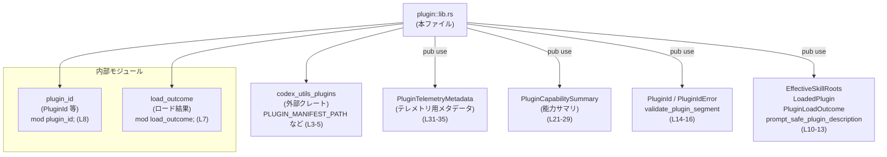
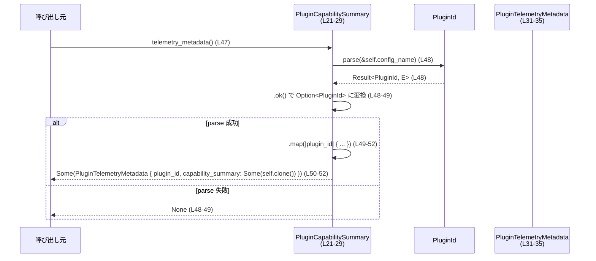
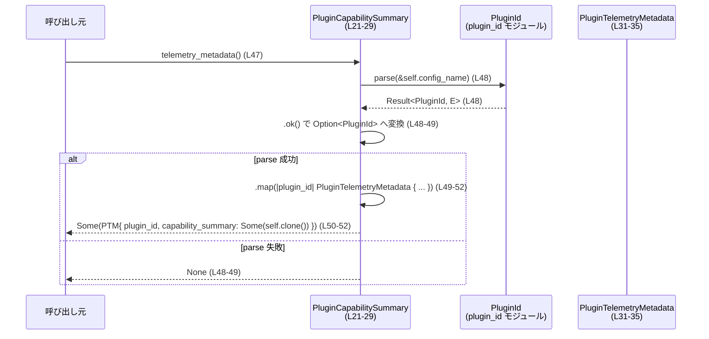

# plugin/src/lib.rs コード解説

## 0. ざっくり一言

プラグインの識別子・ロード結果・テレメトリ（利用状況送信）向けの要約情報を集約し、再エクスポートするハブ的なモジュールです。  
特に、`PluginId` とテレメトリ用メタデータ `PluginTelemetryMetadata` / `PluginCapabilitySummary` を定義・公開しています。

---

## 1. このモジュールの役割

### 1.1 概要

- このモジュールは、**プラグインを一意に識別する ID と、そのテレメトリ用メタデータを扱うための共通型**を提供します。
- 併せて、プラグイン関連ユーティリティ（マニフェストパス、メンション構文、名前空間）や、プラグイン ID / ロード結果関連の型を再エクスポートし、上位コードからの利用を簡略化します（`pub use` 群, `plugin/src/lib.rs:L3-16`）。

### 1.2 アーキテクチャ内での位置づけ

このモジュールは、内部モジュール `plugin_id` / `load_outcome` と、外部クレート `codex_utils_plugins` のラッパ／ファサードとして振る舞います。



この図は、「lib.rs がどのモジュールから何を再エクスポートしているか」を表現しています。

### 1.3 設計上のポイント

- **ファサード設計**  
  - 外部からは `plugin` クレート（またはモジュール）のルートを経由して、プラグイン ID 関連・ロード結果・テレメトリ用メタデータを一括して利用できる構造です（`pub use` 群, `plugin/src/lib.rs:L3-16`）。
- **データ中心の設計**  
  - `AppConnectorId`, `PluginCapabilitySummary`, `PluginTelemetryMetadata` は、いずれもフィールドのみから成るデータキャリア（DTO 的）な構造体です（`plugin/src/lib.rs:L18-35`）。
- **エラーハンドリング方針**  
  - `PluginCapabilitySummary::telemetry_metadata` は、`PluginId::parse` の結果を `Result` から `Option` に変換し（`.ok()` を使用, `plugin/src/lib.rs:L48-49`）、**失敗時は `None` を返してエラー詳細を隠蔽**する設計になっています。
- **状態・並行性**  
  - 本モジュールの型は状態を持ちますが、単なる値オブジェクトであり、スレッドや非同期 I/O を直接扱うコードは含まれていません。
  - スレッド安全性（`Send` / `Sync`）については、`PluginId` 等の定義がこのチャンクには現れないため、ここからは判定できません。

---

## 2. 主要な機能一覧

- プラグインユーティリティの再エクスポート:  
  `PLUGIN_MANIFEST_PATH`, `mention_syntax`, `plugin_namespace_for_skill_path` を `codex_utils_plugins` から再エクスポートします（`plugin/src/lib.rs:L3-5`）。
- プラグイン ID / 検証関連の再エクスポート:  
  `PluginId`, `PluginIdError`, `validate_plugin_segment` を `plugin_id` モジュールから再エクスポートします（`plugin/src/lib.rs:L14-16`）。
- プラグインロード結果関連の再エクスポート:  
  `EffectiveSkillRoots`, `LoadedPlugin`, `PluginLoadOutcome`, `prompt_safe_plugin_description` を `load_outcome` モジュールから再エクスポートします（`plugin/src/lib.rs:L10-13`）。
- アプリコネクタ ID 型の定義:  
  `AppConnectorId` によってアプリケーションコネクタ識別子を `String` のラッパとして表現します（`plugin/src/lib.rs:L18-19`）。
- プラグイン能力サマリの定義:  
  `PluginCapabilitySummary` で、プラグインの設定名・表示名・説明・スキル有無・MCP サーバー名・アプリコネクタ ID をまとめます（`plugin/src/lib.rs:L21-29`）。
- テレメトリ用メタデータの定義と生成:  
  - `PluginTelemetryMetadata` が、`PluginId` と任意の `PluginCapabilitySummary` を保持します（`plugin/src/lib.rs:L31-35`）。
  - `PluginTelemetryMetadata::from_plugin_id` で ID のみからメタデータを生成します（`plugin/src/lib.rs:L37-43`）。
  - `PluginCapabilitySummary::telemetry_metadata` で、設定名から `PluginId` を解析し、成功時のみテレメトリ用メタデータを生成します（`plugin/src/lib.rs:L46-54`）。

---

## 3. 公開 API と詳細解説

### 3.1 型一覧（構造体・列挙体など）

| 名前 | 種別 | 役割 / 用途 | 定義 / 根拠 |
|------|------|-------------|-------------|
| `AppConnectorId` | 構造体（タプル構造体） | アプリケーションコネクタの識別子を、`String` のラッパとして表現します。 | `pub struct AppConnectorId(pub String);`（`plugin/src/lib.rs:L18-19`） |
| `PluginCapabilitySummary` | 構造体 | プラグインの設定名・表示名・説明・スキル有無・MCP サーバー名・アプリコネクタ ID をまとめた能力サマリです。 | `pub struct PluginCapabilitySummary { ... }`（`plugin/src/lib.rs:L21-29`） |
| `PluginTelemetryMetadata` | 構造体 | テレメトリ送信時に用いる、`PluginId` と任意の能力サマリをまとめたメタデータです。 | `pub struct PluginTelemetryMetadata { ... }`（`plugin/src/lib.rs:L31-35`） |
| `PluginId` | 不明（再エクスポートのみ） | プラグインを一意に識別する ID と思われる型ですが、具体的な種別（構造体・列挙体など）はこのチャンクからは判定できません。 | `pub use plugin_id::PluginId;`（`plugin/src/lib.rs:L14`） |
| `PluginIdError` | 不明（再エクスポートのみ） | `PluginId` 関連のエラー型と推測されますが、詳細な定義はこのチャンクには現れません。 | `pub use plugin_id::PluginIdError;`（`plugin/src/lib.rs:L15`） |

> `EffectiveSkillRoots`, `LoadedPlugin`, `PluginLoadOutcome`, `prompt_safe_plugin_description` は `load_outcome` から再エクスポートされていますが（`plugin/src/lib.rs:L10-13`）、型か関数かはこのチャンクだけでは判定できないため、ここでは種別を確定していません。

### 3.2 関数詳細（最大 7 件）

このファイル内で定義されている主要な関数（メソッド）は 2 件です。

#### `PluginTelemetryMetadata::from_plugin_id(plugin_id: &PluginId) -> PluginTelemetryMetadata`

**概要**

- 既存の `PluginId` から、能力サマリを持たない `PluginTelemetryMetadata` を生成します。
- テレメトリ送信時に、ID のみが分かっているケース向けのコンストラクタです（`plugin/src/lib.rs:L37-43`）。

**引数**

| 引数名 | 型 | 説明 |
|--------|----|------|
| `plugin_id` | `&PluginId` | 生成元となるプラグイン ID への参照です（`plugin/src/lib.rs:L38`）。 |

**戻り値**

- `PluginTelemetryMetadata`  
  - `plugin_id` フィールドには引数のクローンが入り（`plugin_id: plugin_id.clone()`、`plugin/src/lib.rs:L40`）、  
    `capability_summary` フィールドには `None` が設定されたインスタンスが返されます（`plugin/src/lib.rs:L41`）。

**内部処理の流れ**

1. `Self { ... }` 構文で `PluginTelemetryMetadata` を生成します（`plugin/src/lib.rs:L39-42`）。
2. `plugin_id` フィールドに、引数の `plugin_id` を `clone()` して設定します（`plugin/src/lib.rs:L40`）。
3. `capability_summary` フィールドを `None` に固定して設定します（`plugin/src/lib.rs:L41`）。
4. 生成した構造体を返します（`plugin/src/lib.rs:L39-43`）。

**Examples（使用例）**

`PluginId` が既に取得済みで、能力サマリなしのメタデータを作る例です。  
`PluginId::parse` のシグネチャはこのチャンクには現れませんが、`telemetry_metadata` 内で `Result` として扱われていることから `.parse(...) -> Result<PluginId, _>` であると判断できます（`plugin/src/lib.rs:L48-49`）。

```rust
use plugin::{PluginId, PluginTelemetryMetadata}; // 実際のパスはクレート名に依存する

fn build_metadata_from_id() -> PluginTelemetryMetadata {
    // 文字列から PluginId を生成する（parse の戻り値は Result と推測される）
    let plugin_id = PluginId::parse("example_plugin").unwrap();  // エラー処理は簡略化のため unwrap

    // PluginId だけを使ったテレメトリメタデータを作成
    PluginTelemetryMetadata::from_plugin_id(&plugin_id)
    // -> capability_summary は None の状態
}
```

**Errors / Panics**

- この関数自身は `Result` を返さず、内部でも `unwrap` などを呼んでいないため、**この関数内でエラーや panic が発生する可能性はコード上確認できません**（`plugin/src/lib.rs:L37-43`）。
- `clone()` 実装がパニックを起こさない前提ですが、標準的な実装では通常パニックしません。

**Edge cases（エッジケース）**

- `plugin_id` がどのような値であっても、そのままクローンして格納します。  
  無効な ID かどうかの検証は、この関数内では行われません（`plugin/src/lib.rs:L40-41`）。
- `plugin_id` が他のスレッドで共有されているかどうかなどの状態は関知せず、単に値をコピーするのみです。

**使用上の注意点**

- **前提条件**:  
  引数 `plugin_id` は、すでに妥当な ID として検証済みであることが期待されます。検証ロジックは `PluginId` の生成側（`plugin_id` モジュール）に依存します。
- **意味上の注意**:  
  返される `PluginTelemetryMetadata` は `capability_summary: None` なので、能力サマリを利用する集計・分析処理では、その情報が欠落します。
- **パフォーマンス**:  
  `plugin_id.clone()` が行われるため、`PluginId` が大型のデータを内部に持つ場合にはコピーコストが発生します。ただし、`PluginId` の実装はこのチャンクには現れません。

---

#### `PluginCapabilitySummary::telemetry_metadata(&self) -> Option<PluginTelemetryMetadata>`

**概要**

- `PluginCapabilitySummary` からテレメトリ用メタデータ `PluginTelemetryMetadata` を生成します（`plugin/src/lib.rs:L46-54`）。
- 内部で `self.config_name` を `PluginId::parse` に渡し、**パースに成功した場合だけ `Some` を返し、失敗した場合は `None` を返す**設計です（`plugin/src/lib.rs:L48-49`）。

**引数**

| 引数名 | 型 | 説明 |
|--------|----|------|
| `&self` | `&PluginCapabilitySummary` | 能力サマリ自身への参照です。内部で `self.clone()` が行われ、`PluginTelemetryMetadata` に格納されます（`plugin/src/lib.rs:L52`）。 |

**戻り値**

- `Option<PluginTelemetryMetadata>`  
  - `Some(PluginTelemetryMetadata)` : `config_name` のパースに成功した場合。  
    - `plugin_id` フィールド: `PluginId::parse` によって得られた ID（`plugin/src/lib.rs:L50`）。  
    - `capability_summary` フィールド: `Some(self.clone())`（`plugin/src/lib.rs:L52`）。
  - `None` : `config_name` を `PluginId` にパースできなかった場合（`plugin/src/lib.rs:L48-49`）。

**内部処理の流れ（アルゴリズム）**

1. `PluginId::parse(&self.config_name)` を呼び出し、`config_name` 文字列から `PluginId` をパースしようとします（`plugin/src/lib.rs:L48`）。
2. 戻り値（`Result<PluginId, _>` と推測されます）に対して `.ok()` を呼び、成功時は `Some(plugin_id)`、失敗時は `None` に変換します（`plugin/src/lib.rs:L48-49`）。
3. `.map(|plugin_id| PluginTelemetryMetadata { ... })` を呼び、成功時の `plugin_id` を使って `PluginTelemetryMetadata` を生成します（`plugin/src/lib.rs:L49-52`）。
   - `plugin_id` フィールドにパース結果の ID を代入（`plugin/src/lib.rs:L50`）。
   - `capability_summary` フィールドに `Some(self.clone())` を代入（`plugin/src/lib.rs:L52`）。
4. 全体として、`Option<PluginTelemetryMetadata>` が返されます（`plugin/src/lib.rs:L47-54`）。

**処理フロー図（telemetry_metadata, L46-54）**



**Examples（使用例）**

プラグイン構成情報からテレメトリメタデータを生成する典型例です。

```rust
use plugin::{
    AppConnectorId,
    PluginCapabilitySummary,
    PluginTelemetryMetadata,
};

fn build_metadata_from_capability() -> Option<PluginTelemetryMetadata> {
    // アプリケーションコネクタ ID を作成
    let connector = AppConnectorId("my-connector".to_string());

    // プラグイン能力サマリを定義
    let summary = PluginCapabilitySummary {
        config_name: "example_plugin".to_string(), // PluginId::parse 可能な名前である必要がある
        display_name: "Example Plugin".to_string(),
        description: Some("サンプルプラグインです".to_string()),
        has_skills: true,
        mcp_server_names: vec!["example-mcp".to_string()],
        app_connector_ids: vec![connector],
    };

    // config_name を PluginId として解釈し、成功すればテレメトリメタデータを返す
    summary.telemetry_metadata()
}
```

**Errors / Panics**

- `PluginId::parse` がエラーになるケースでは、`Result` が `Err` のため `.ok()` の結果は `None` となり、**`telemetry_metadata` の戻り値も `None` になります**（`plugin/src/lib.rs:L48-49`）。
  - エラーの詳細（エラーメッセージやエラー型）はここで破棄され、呼び出し側からは参照できません。
- この関数内では `unwrap` やインデックスアクセスなどは行われていないため、コードからは明示的な panic の可能性は読み取れません（`plugin/src/lib.rs:L47-54`）。

**Edge cases（エッジケース）**

- `config_name` が空文字列や不正なフォーマットの場合:
  - 具体的な条件は `PluginId::parse` の実装に依存し、このチャンクからは判定できませんが、**パースに失敗した場合は常に `None` を返す**ことだけは分かります（`plugin/src/lib.rs:L48-49`）。
- `self` の他のフィールド（`display_name`, `description` など）は、パース成否に影響しません。
- `self.app_connector_ids` が空、`self.mcp_server_names` が空の場合でも、パースが成功すれば `Some(PluginTelemetryMetadata)` が返ります（`plugin/src/lib.rs:L50-52` より、これらの値を変更する処理は存在しません）。

**使用上の注意点**

- **エラー情報の喪失**:  
  `Result` を `Option` に変換してしまうため（`.ok()`、`plugin/src/lib.rs:L48-49`）、`PluginId::parse` の失敗理由が呼び出し側から分からなくなります。  
  テレメトリ収集側で `None` を「メタデータが作れない」理由として扱う必要があります。
- **前提条件**:  
  `config_name` は `PluginId::parse` にとって妥当な形式であるべきです。形式の詳細は `plugin_id` モジュールの実装に依存します。
- **パフォーマンス**:  
  成功時には `self.clone()` によって `PluginCapabilitySummary` 全体がコピーされます（`plugin/src/lib.rs:L52`）。  
  `mcp_server_names` や `app_connector_ids` が大きなベクタの場合、コピーコストが無視できない可能性があります。
- **セキュリティ / ロバストネス**:  
  入力である `config_name` はそのまま `PluginId::parse` に渡されます（`plugin/src/lib.rs:L48`）。  
  不正な文字列を与えたときの挙動（例: ログ出力の有無、拒否・正規化など）は `PluginId::parse` の実装に依存し、このチャンクからは判断できません。

---

### 3.3 その他の関数・再エクスポート

このチャンクでは実装本体は現れませんが、次の識別子が再エクスポートされています（`plugin/src/lib.rs:L3-5, L10-16`）。

| 名前 | 出典 | 役割（1 行） |
|------|------|--------------|
| `PLUGIN_MANIFEST_PATH` | `codex_utils_plugins` | プラグインマニフェストのパスやパス名に関連する定数または関数と推測されますが、具体的な定義はこのチャンクには現れません。 |
| `mention_syntax` | `codex_utils_plugins` | プラグインやスキルをメンションする構文（文字列表現）関連のユーティリティと推測されます。命名に基づく推測であり、詳細は不明です。 |
| `plugin_namespace_for_skill_path` | `codex_utils_plugins` | スキルパスからプラグイン名前空間を導くユーティリティと推測されますが、定義はこのチャンクには現れません。 |
| `EffectiveSkillRoots` | `load_outcome` | 「有効なスキルルート」を表す型または関数名ですが、種別・詳細は不明です。 |
| `LoadedPlugin` | `load_outcome` | ロード済みプラグインを表現するエンティティと推測されますが、このチャンクだけでは型か関数か判定できません。 |
| `PluginLoadOutcome` | `load_outcome` | プラグインロードの結果を表す型（成功・失敗など）と推測されます。 |
| `prompt_safe_plugin_description` | `load_outcome` | プロンプトに安全に埋め込めるプラグイン説明文を生成・フィルタするユーティリティと推測されます。 |
| `validate_plugin_segment` | `plugin_id` | プラグイン ID の一部分（セグメント）を検証する関数名と推測されます。 |

> 上記の役割は名前からの推測であり、**コード上の根拠は再エクスポートされているという事実のみ**です（`plugin/src/lib.rs:L3-5, L10-16`）。  
> 正確な型・シグネチャ・挙動は、それぞれの元モジュールの実装を確認する必要があります。

---

## 4. データフロー

ここでは、`PluginCapabilitySummary` から `PluginTelemetryMetadata` を生成する代表的なフローを示します。

### 4.1 概要

1. 上位コードが `PluginCapabilitySummary` を構築します（`plugin/src/lib.rs:L21-29`）。
2. 上位コードが `summary.telemetry_metadata()` を呼び出します（`plugin/src/lib.rs:L47`）。
3. メソッド内で `config_name` が `PluginId::parse` に渡され、ID 化されます（`plugin/src/lib.rs:L48`）。
4. 成功時には `PluginTelemetryMetadata` に `plugin_id` と `summary` のクローンが格納されて返され、失敗時には `None` が返されます（`plugin/src/lib.rs:L49-52`）。

### 4.2 シーケンス図



このフローから、**テレメトリメタデータ生成の成否が `config_name` のパース成功にのみ依存している**ことが分かります。

---

## 5. 使い方（How to Use）

### 5.1 基本的な使用方法

典型的なコードフローは次のようになります。

1. プラグインの設定名などから `PluginCapabilitySummary` を構築する。
2. `telemetry_metadata()` でテレメトリ用メタデータを生成する（成功すれば `Some`）。
3. あるいは、`PluginId` のみが分かっている場合は `PluginTelemetryMetadata::from_plugin_id` を使う。

```rust
use plugin::{
    AppConnectorId,
    PluginCapabilitySummary,
    PluginTelemetryMetadata,
    PluginId,
};

fn main() {
    // 1. PluginId を作成する（plugin_id モジュールの API に依存）
    let plugin_id = PluginId::parse("example_plugin").unwrap();

    // 2. ID のみからテレメトリメタデータを作成
    let meta_from_id = PluginTelemetryMetadata::from_plugin_id(&plugin_id);
    // meta_from_id.capability_summary は None

    // 3. 能力サマリ付きでテレメトリメタデータを作成
    let summary = PluginCapabilitySummary {
        config_name: "example_plugin".to_string(), // PluginId と対応した設定名
        display_name: "Example Plugin".to_string(),
        description: Some("サンプル".to_string()),
        has_skills: true,
        mcp_server_names: vec!["example-mcp".to_string()],
        app_connector_ids: vec![AppConnectorId("connector-1".to_string())],
    };

    if let Some(meta_with_summary) = summary.telemetry_metadata() {
        // テレメトリ処理に meta_with_summary を渡す
        send_telemetry(meta_with_summary);
    } else {
        // config_name のパースに失敗した可能性がある
        eprintln!("PluginId を config_name から生成できませんでした");
    }
}

// ダミーの送信関数（実際の実装は別途存在する前提）
fn send_telemetry(_meta: PluginTelemetryMetadata) {
    // ここでテレメトリ送信を行うと想定される
}
```

### 5.2 よくある使用パターン

1. **能力サマリを持たない ID ベースのテレメトリ**

   - ログやテレメトリでプラグイン ID だけが必要なケース。
   - `PluginTelemetryMetadata::from_plugin_id` を使用（`plugin/src/lib.rs:L37-43`）。

2. **設定情報に基づく詳細なテレメトリ**

   - UI 上の表示名やスキル有無、MCP サーバー名なども分析に利用したい場合。
   - `PluginCapabilitySummary` を組み立て、`telemetry_metadata()` を通じて `PluginTelemetryMetadata` を生成（`plugin/src/lib.rs:L21-29, L46-54`）。

### 5.3 よくある間違い

```rust
// 間違い例: telemetry_metadata の戻り値を必ず Some だと仮定してしまう
let meta = summary.telemetry_metadata().unwrap(); // パース失敗時には panic する可能性がある
```

```rust
// 正しい例: None になりうることを考慮して処理する
if let Some(meta) = summary.telemetry_metadata() {
    send_telemetry(meta);
} else {
    // config_name が PluginId として不正な可能性
    log::warn!("Invalid plugin config_name for telemetry: {}", summary.config_name);
}
```

**注意点**

- `telemetry_metadata()` が `Option` を返していること（`plugin/src/lib.rs:L47`）から、  
  **呼び出し側で `None` を正しく扱うことが契約上重要**です。
- `config_name` がどのような形式であれば有効なのかは `PluginId::parse` に依存し、このチャンクからは分かりません。

### 5.4 使用上の注意点（まとめ）

- **エラー伝播**:  
  `telemetry_metadata()` はエラー内容を返さずに `None` に変換する設計です（`plugin/src/lib.rs:L48-49`）。  
  エラー詳細が必要な場合は、より低レベルな API（`PluginId::parse`）を直接利用する必要があります。
- **コピーコスト**:  
  `PluginCapabilitySummary::telemetry_metadata` では `self.clone()` が行われます（`plugin/src/lib.rs:L52`）。  
  大量のサマリを高頻度で処理する場合、パフォーマンスに注意する必要があります。
- **スレッド安全性**:  
  本ファイルからは `Send` / `Sync` 実装状況は明確ではありませんが、`String` や `Vec` が含まれているため、通常は所有権・借用の原則に従ってスレッド間で共有・移動します。`PluginId` の実装次第で最終的なスレッド安全性が決まります。

---

## 6. 変更の仕方（How to Modify）

### 6.1 新しい機能を追加する場合

- **新しいテレメトリ項目を追加したい場合**
  1. `PluginCapabilitySummary` に新フィールドを追加する（`plugin/src/lib.rs:L21-29`）。
  2. そのフィールドを `PluginTelemetryMetadata` にも保持したい場合は、構造体にフィールドを追加し（`plugin/src/lib.rs:L31-35`）、`telemetry_metadata` 内で値を設定するように変更する（`plugin/src/lib.rs:L50-52` 近辺）。
  3. 既存の構築コード・テストコード（このチャンクには現れません）をすべて更新し、新フィールドの初期化漏れがないか確認する。

- **エラー内容を保持したい場合**
  1. `PluginCapabilitySummary::telemetry_metadata` の戻り値を `Result<Option<PluginTelemetryMetadata>, PluginIdError>` などに変更するなど、設計を見直す必要があります。
  2. `.ok().map(...)` という現状の処理を、エラー情報を保持するように書き換えます（`plugin/src/lib.rs:L48-49`）。
  3. 戻り値型変更は API 互換性に影響するため、呼び出し元すべてに影響します。

### 6.2 既存の機能を変更する場合

- **PluginId パース条件を変更したい場合**
  - 変更箇所は `plugin_id` モジュール側であり、このファイルではありません。
  - ただし、`telemetry_metadata` の成功確率やエラー率に影響するため、テレメトリ上の統計やログにも影響が出る可能性があります。

- **契約・前提条件の確認ポイント**
  - `PluginTelemetryMetadata::from_plugin_id` は「有効な `PluginId` を受け取る」と暗黙に仮定しています（`plugin/src/lib.rs:L38-42`）。
  - `telemetry_metadata` は「`config_name` から `PluginId` を生成できる場合にのみ `Some` を返す」という契約に依存しています（`plugin/src/lib.rs:L48-52`）。

- **テストについて**
  - このチャンクにはテストコードが含まれていないため、どのようなテストが存在するかは不明です。
  - 仕様変更時には、`telemetry_metadata` の `Option` の振る舞い（成功 / 失敗ケース）をカバーするテストの追加・更新が必要です。

---

## 7. 関連ファイル

| パス / モジュール | 役割 / 関係 |
|------------------|------------|
| `plugin/src/plugin_id.rs`（`mod plugin_id;`） | `PluginId`, `PluginIdError`, `validate_plugin_segment` の定義および `PluginId::parse` などの API を提供すると考えられます。`telemetry_metadata` はこのモジュールの `parse` に依存しています（`plugin/src/lib.rs:L8, L14-16, L48`）。 |
| `plugin/src/load_outcome.rs`（`mod load_outcome;`） | `EffectiveSkillRoots`, `LoadedPlugin`, `PluginLoadOutcome`, `prompt_safe_plugin_description` の定義元です（`plugin/src/lib.rs:L7, L10-13`）。プラグインロード処理の結果やプロンプト向け説明文生成に関わると推測されます。 |
| `codex_utils_plugins` クレート | `PLUGIN_MANIFEST_PATH`, `mention_syntax`, `plugin_namespace_for_skill_path` の定義元です（`plugin/src/lib.rs:L3-5`）。プラグイン関連の共通ユーティリティ群を提供していると考えられます。 |

> 上記のうち、`plugin_id` / `load_outcome` / `codex_utils_plugins` の具体的な実装はこのチャンクには現れないため、役割の詳細はそれぞれのファイル／クレートを参照する必要があります。

---

このレポートは、`plugin/src/lib.rs` に含まれる情報のみを根拠として記述しています。  
他ファイルの詳細仕様や実装に依存する部分については、「このチャンクからは不明」と明示しました。
