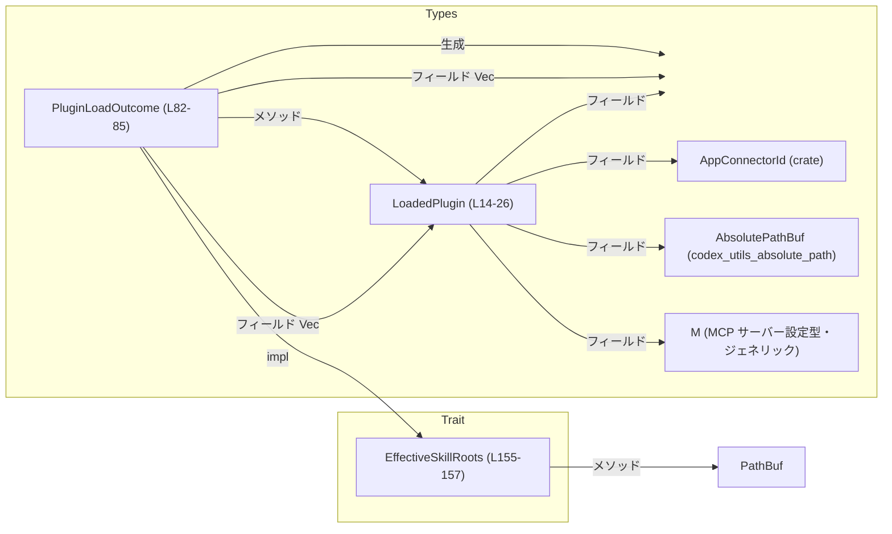
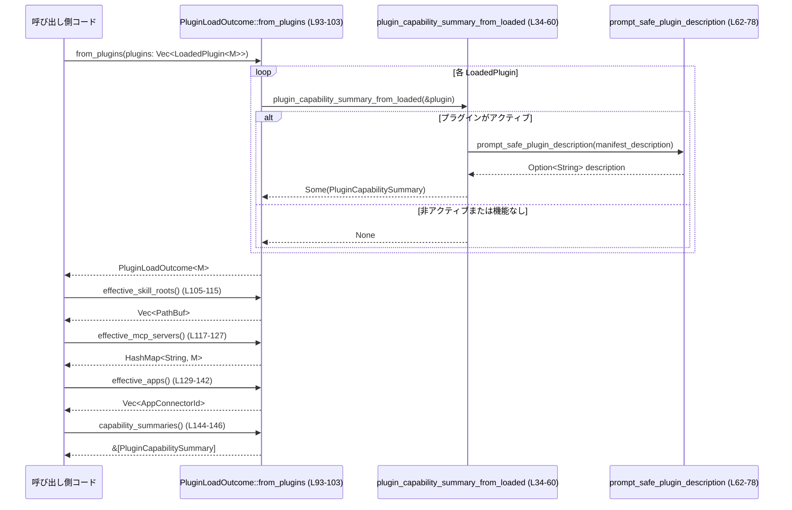

# plugin/src/load_outcome.rs コード解説

## 0. ざっくり一言

プラグインのロード結果を表現し、そこから「有効なスキル・MCP サーバー・アプリコネクタ」と「モデル向け能力サマリ」を集約して取り出すためのユーティリティです（plugin/src/load_outcome.rs:L12-25, L80-85）。  

---

## 1. このモジュールの役割

### 1.1 概要

- ディスクからロードされた各プラグインを `LoadedPlugin<M>` として保持します（L12-25）。
- その一覧から、使用可能なスキルルート・MCP サーバー・アプリコネクタを重複排除して集約します（L105-142, L117-127）。
- モデルに渡すための `PluginCapabilitySummary` を生成・保持します（L34-60, L82-85, L93-103）。
- 呼び出し側が MCP 設定型 `M` を意識せずにスキルルートだけ取得できるように、`EffectiveSkillRoots` トレイトを提供します（L153-162）。

### 1.2 アーキテクチャ内での位置づけ

`LoadedPlugin<M>` と `PluginLoadOutcome<M>` を中心とした依存関係は次の通りです。



`PluginLoadOutcome<M>` は、個々の `LoadedPlugin<M>` から「有効な情報だけを抽出して統合するファサード」として機能している構造になっています（L93-103, L105-142）。

### 1.3 設計上のポイント

- **責務の分離**
  - `LoadedPlugin<M>` は「単一プラグインの状態保持」（設定名・マニフェスト・エラーなど）に限定されています（L14-25）。
  - `PluginLoadOutcome<M>` は「複数プラグインからの集約と問い合わせ API」を提供します（L82-85, L93-150）。
- **有効/無効の判定**
  - プラグインが「有効」とみなされるのは `enabled == true` かつ `error.is_none()` のときだけで、これを `is_active` で一元化しています（L28-31）。
- **集約時のフィルタリング**
  - 能力サマリは「アクティブかつ何らかの機能（スキル / MCP / アプリ）を持つプラグイン」だけを対象に生成されます（L34-60）。
  - スキルルート・MCP サーバー・アプリとも、アクティブなプラグインのみを対象にしています（L105-110, L119-120, L133-134）。
- **重複排除・優先順位**
  - スキルルートはソート＋`dedup` でパスの重複を排除します（L112-113）。
  - MCP サーバーは最初に出現した定義を優先し、同名キーの後続定義は無視されます（`entry().or_insert_with()` の使用, L121-123）。
  - アプリコネクタは HashSet を使って ID の重複を排除しつつ、最初に現れた順で `Vec` に追加します（L129-137）。
- **安全性 / 並行性**
  - すべての操作はイミュータブルな参照と所有権・クローンに基づく純粋なデータ変換であり、内部でスレッドや `unsafe` は使っていません（ファイル全体）。
  - そのため、`PluginLoadOutcome` を複数スレッドから読み取り専用で共有する場合は、通常の Rust の共有（`&` や `Arc`）のルールに従えば良い構造です。

---

## 2. 主要な機能一覧

このモジュールが提供する主な機能は次の通りです。

- 個々のプラグイン状態の表現: `LoadedPlugin<M>`（L14-25）
- プラグインの「アクティブ」判定: `LoadedPlugin::is_active`（L28-31）
- モデル向け能力サマリの生成: `plugin_capability_summary_from_loaded`（L34-60）
- 説明文の正規化・長さ制限: `prompt_safe_plugin_description`（L62-78）
- ロード結果の集約表現: `PluginLoadOutcome<M>`（L82-85）
- プラグイン一覧からのロード結果構築: `PluginLoadOutcome::from_plugins`（L93-103）
- 有効なスキルルート一覧の取得: `PluginLoadOutcome::effective_skill_roots`（L105-115）
- 有効な MCP サーバー定義の統合: `PluginLoadOutcome::effective_mcp_servers`（L117-127）
- 有効なアプリコネクタ ID の統合: `PluginLoadOutcome::effective_apps`（L129-142）
- 能力サマリの取得: `PluginLoadOutcome::capability_summaries`（L144-146）
- 元のプラグイン一覧の取得: `PluginLoadOutcome::plugins`（L148-150）
- MCP 型を明示しないスキルルート取得インターフェース: `EffectiveSkillRoots` トレイトとその実装（L153-162）

---

## 3. 公開 API と詳細解説

### 3.1 型一覧（構造体・列挙体など）

| 名前 | 種別 | 公開性 | 役割 / 用途 | 定義位置 |
|------|------|--------|-------------|----------|
| `LoadedPlugin<M>` | 構造体 | `pub` | 単一プラグインの設定名、マニフェスト情報、スキルルート、MCP サーバー定義、アプリコネクタ、エラー状態などを保持します。ジェネリック型 `M` は MCP サーバー設定の型です。 | plugin/src/load_outcome.rs:L14-25 |
| `PluginLoadOutcome<M>` | 構造体 | `pub` | 複数プラグインのロード結果を保持し、そこから「有効なスキルルート / MCP サーバー / アプリコネクタ」および能力サマリを提供します。内部フィールドは非公開です。 | plugin/src/load_outcome.rs:L82-85 |
| `EffectiveSkillRoots` | トレイト | `pub` | 呼び出し側が `PluginLoadOutcome` のジェネリック型 `M` を知らなくても、スキルルート一覧を取得できるようにするための抽象インターフェースです。 | plugin/src/load_outcome.rs:L155-157 |

#### コンポーネント（関数・メソッド）インベントリー

| 名前 | 種別 | 説明 | 定義位置 |
|------|------|------|----------|
| `LoadedPlugin::is_active` | メソッド | 有効フラグとエラー有無からプラグインがアクティブかを判定します。 | plugin/src/load_outcome.rs:L28-31 |
| `plugin_capability_summary_from_loaded` | 関数（非公開） | アクティブなプラグインから `PluginCapabilitySummary` を生成します。 | plugin/src/load_outcome.rs:L34-60 |
| `prompt_safe_plugin_description` | 関数（公開） | 説明文の空白正規化と最大長カットを行い、モデル向けサマリに安全に埋め込める形にします。 | plugin/src/load_outcome.rs:L62-78 |
| `PluginLoadOutcome::default` | 関連関数（`Default`実装） | 空のプラグイン一覧から空のアウトカムを生成します。 | plugin/src/load_outcome.rs:L87-91 |
| `PluginLoadOutcome::from_plugins` | 関連関数 | プラグイン一覧からアウトカムと能力サマリを構築します。 | plugin/src/load_outcome.rs:L93-103 |
| `PluginLoadOutcome::effective_skill_roots` | メソッド | アクティブなプラグインからスキルルートを集約し、ソートと重複排除を行います。 | plugin/src/load_outcome.rs:L105-115 |
| `PluginLoadOutcome::effective_mcp_servers` | メソッド | アクティブなプラグインから MCP サーバー設定を集約し、同名キーは最初の定義を採用します。 | plugin/src/load_outcome.rs:L117-127 |
| `PluginLoadOutcome::effective_apps` | メソッド | アクティブなプラグインからアプリコネクタ ID を重複排除して列挙します。 | plugin/src/load_outcome.rs:L129-142 |
| `PluginLoadOutcome::capability_summaries` | メソッド | 生成済みの能力サマリ配列への参照を返します。 | plugin/src/load_outcome.rs:L144-146 |
| `PluginLoadOutcome::plugins` | メソッド | 元の `LoadedPlugin<M>` 配列への参照を返します。 | plugin/src/load_outcome.rs:L148-150 |
| `EffectiveSkillRoots::effective_skill_roots` | トレイトメソッド | 実装型から有効なスキルルート一覧を取得するためのメソッドです。 | plugin/src/load_outcome.rs:L155-157 |
| `EffectiveSkillRoots for PluginLoadOutcome<M>` | トレイト実装 | `PluginLoadOutcome<M>` を `EffectiveSkillRoots` として扱えるようにします。内部では同名メソッドを呼び出します。 | plugin/src/load_outcome.rs:L159-162 |

---

### 3.2 関数詳細（主要 7 件）

#### `LoadedPlugin<M>::is_active(&self) -> bool`

**概要**

- プラグインが「アクティブ」とみなされるかどうかを返します（L28-31）。
- `enabled` が `true` であり、かつ `error` が `None` の場合のみ `true` になります。

**引数**

| 引数名 | 型 | 説明 |
|--------|----|------|
| `&self` | `&LoadedPlugin<M>` | 判定対象のプラグインです。 |

**戻り値**

- `bool` — アクティブなら `true`、それ以外は `false` です。

**内部処理の流れ**

1. `self.enabled` をチェックします（L30）。
2. `self.error.is_none()` をチェックします（L30）。
3. 両方を論理積 `&&` で結合した結果をそのまま返します（L30）。

**Examples（使用例）**

```rust
fn is_plugin_usable<M>(plugin: &LoadedPlugin<M>) -> bool {
    // enabled=true かつ error=None のときだけ true になる
    plugin.is_active()
}
```

**Errors / Panics**

- 明示的なエラー型や `panic!` は使用していません。
- `LoadedPlugin` のフィールドアクセスだけなので、通常の使用でパニックは発生しません。

**Edge cases（エッジケース）**

- `enabled == false` かつ `error == None` の場合: `false` を返します（L30）。
- `enabled == true` かつ `error == Some(_)` の場合: `false` を返します（L30）。
- `enabled == false` かつ `error == Some(_)` の場合: `false` を返します。

**使用上の注意点**

- 「無効化されたプラグイン」だけでなく、「ロード中にエラーが発生したプラグイン」もアクティブとはみなされません。  
  そのため、ロード処理側で `error` を正しく設定することが前提条件です。

---

#### `fn plugin_capability_summary_from_loaded<M>(plugin: &LoadedPlugin<M>) -> Option<PluginCapabilitySummary>`

**概要**

- 単一の `LoadedPlugin` から `PluginCapabilitySummary` を生成します（L34-60）。
- プラグインが非アクティブ、もしくはスキル / MCP / アプリのいずれも持たない場合は `None` を返します（L37-39, L56-59）。

**引数**

| 引数名 | 型 | 説明 |
|--------|----|------|
| `plugin` | `&LoadedPlugin<M>` | サマリ対象のプラグインです。 |

**戻り値**

- `Option<PluginCapabilitySummary>`  
  - サマリが生成される条件を満たす場合は `Some(summary)`。  
  - それ以外は `None`。

**内部処理の流れ**

1. `plugin.is_active()` が `false` の場合は早期に `None` を返します（L37-39）。
2. `plugin.mcp_servers` のキー（サーバー名）一覧を取得し、`Vec<String>` にクローンします（L41）。
3. MCP サーバー名を `sort_unstable` でソートします（L42）。
4. `PluginCapabilitySummary` を生成します（L44-54）。
   - `config_name` は `plugin.config_name.clone()`（L45）。
   - `display_name` は `manifest_name` があればそれを、なければ `config_name` を用います（L46-49）。
   - `description` は `prompt_safe_plugin_description` で正規化・長さ制限されたものです（L50, L62-78）。
   - `has_skills`, `mcp_server_names`, `app_connector_ids` は `LoadedPlugin` からコピーします（L51-53）。
5. 生成した `summary` が少なくとも何らかの機能を持つかをチェックします（L56-58）。
   - `has_skills == true` または `mcp_server_names` 非空 または `app_connector_ids` 非空。
6. 上記条件が真であれば `Some(summary)`、偽であれば `None` を返します（L56-59）。

**Examples（使用例）**

```rust
fn build_single_summary<M: Clone>(
    plugin: &LoadedPlugin<M>,
) -> Option<PluginCapabilitySummary> {
    // from_plugins 内部と同等のロジックを単体で使いたい場合の例
    plugin_capability_summary_from_loaded(plugin)
}
```

※ 実際のコードではこの関数は非公開であり、`PluginLoadOutcome::from_plugins` 内部からのみ利用されています（L95-98）。

**Errors / Panics**

- 明示的なエラー型や `panic!` を使用していません。
- `manifest_name` や `manifest_description` が `None` の場合も安全に処理されます（`Option` のメソッドを使用, L46-50）。

**Edge cases（エッジケース）**

- プラグインが非アクティブ: `None`（L37-39）。
- `has_skills == false` かつ `mcp_servers` 空 かつ `apps` 空の場合:
  - サマリは構築されますが、最後の条件判定により `None` となります（L56-59）。
- 説明文が `None` または空白のみの場合:
  - `description` フィールドも `None` になります（`prompt_safe_plugin_description` の仕様, L64-70）。

**使用上の注意点**

- 「能力サマリを持たないプラグイン」が存在しうることを前提に、呼び出し側（`from_plugins`）では `filter_map` を用いて `None` を除外しています（L96-98）。
- プラグインの能力の有無によって UI やモデルへの提示対象を変える場合、この条件式（L56-59）が仕様になります。

---

#### `pub fn prompt_safe_plugin_description(description: Option<&str>) -> Option<String>`

**概要**

- プラグインの説明文を「単一空白に正規化し、最大長で切り詰めた」形で返します（L62-78）。
- 説明が `None` または空白のみで構成される場合には `None` を返します（L64-70）。

**引数**

| 引数名 | 型 | 説明 |
|--------|----|------|
| `description` | `Option<&str>` | 元の説明文（UTF-8 文字列）のオプションです。 |

**戻り値**

- `Option<String>` — 正規化された説明文。入力が `None` または実質空の場合は `None`。

**内部処理の流れ**

1. `description?` により、`description` が `None` の場合は即座に `None` を返します（`?` 演算子, L64）。
2. 非 `None` の場合、`split_whitespace` で空白類文字を区切りとして分割します（L65）。
3. 分割結果を `Vec<_>` に収集した後、スペース `" "` を区切りとして `join` し、連続空白などを単一空白に正規化します（L65-67）。
4. 正規化後の文字列が空であれば `None` を返します（L68-70）。
5. 空でない場合、`chars().take(MAX_CAPABILITY_SUMMARY_DESCRIPTION_LEN)` で最大長に切り詰め、`String` に収集して `Some` で返します（L72-77）。

**Examples（使用例）**

```rust
fn normalized_description() -> Option<String> {
    let raw = Some("  This   is  a   description\nwith lines. ");
    // "This is a description with lines." に正規化され、先頭 1024 文字までに切り詰められる
    prompt_safe_plugin_description(raw)
}
```

**Errors / Panics**

- 明示的なエラー型や `panic!` は使用していません。
- `.chars()` による切り詰めのため、UTF-8 マルチバイト文字の途中で分断されることはありません（L73-76）。

**Edge cases（エッジケース）**

- `description == None`: そのまま `None` を返します（L64）。
- `description == Some("    ")` のような空白のみ:
  - `split_whitespace` の結果が空となり、`join` 後に空文字列 `""` になり、`None` が返ります（L65-70）。
- 非常に長い説明文:
  - 先頭から最大 `MAX_CAPABILITY_SUMMARY_DESCRIPTION_LEN` 文字（デフォルト 1024 文字）だけが残ります（L72-76）。

**使用上の注意点**

- 「文字数の上限」は**文字（`char`）単位**であり、バイト数ではありません。
- 説明文の内容自体の安全性チェック（HTML エスケープや NG ワードフィルタなど）は行っていません。ここで行っているのは空白正規化と長さ制限のみです。

---

#### `pub fn PluginLoadOutcome<M>::from_plugins(plugins: Vec<LoadedPlugin<M>>) -> Self`

**概要**

- `LoadedPlugin<M>` のリストから `PluginLoadOutcome<M>` を構築し、同時に能力サマリ一覧も生成します（L93-103）。
- 能力サマリは `plugin_capability_summary_from_loaded` によって生成され、`None` になったものは捨てられます（L95-98）。

**引数**

| 引数名 | 型 | 説明 |
|--------|----|------|
| `plugins` | `Vec<LoadedPlugin<M>>` | ロード済みプラグインの一覧です。所有権がこの関数に移動します。 |

**戻り値**

- `PluginLoadOutcome<M>` — `plugins` と、それに対応する能力サマリを保持する構造体です。

**内部処理の流れ**

1. `plugins.iter()` でイテレータを取得します（L95-96）。
2. 各プラグインに対して `plugin_capability_summary_from_loaded` を適用し、`Option<PluginCapabilitySummary>` を得ます（L97）。
3. `filter_map` により `None` のものを除外し、`Vec<PluginCapabilitySummary>` に収集します（L96-98）。
4. `Self { plugins, capability_summaries }` で構造体を生成し返します（L99-102）。

**Examples（使用例）**

```rust
fn load_outcome_from_plugins<M: Clone>(plugins: Vec<LoadedPlugin<M>>) -> PluginLoadOutcome<M> {
    PluginLoadOutcome::from_plugins(plugins)
}
```

**Errors / Panics**

- 明示的なエラー型や `panic!` は使用していません。
- `plugins` が空でも、そのまま `plugins: Vec::new()` と `capability_summaries: Vec::new()` を持つアウトカムが生成されます（L95-99）。

**Edge cases（エッジケース）**

- `plugins.is_empty() == true`: 能力サマリも空のアウトカムが返されます。
- すべてのプラグインの能力サマリが `None` になる場合:
  - `capability_summaries` は空の `Vec` になります（L96-98）。

**使用上の注意点**

- `PluginLoadOutcome<M>` に対する `Default` 実装は、内部的に `Self::from_plugins(Vec::new())` を呼び出しています（L87-91）。  
  初期状態として「プラグインなし」のアウトカムが必要な場合に利用できます。
- `PluginLoadOutcome` のフィールドは非公開なので、外部から状態を変更したい場合は追加のメソッドが必要になります。

---

#### `pub fn PluginLoadOutcome<M>::effective_skill_roots(&self) -> Vec<PathBuf>`

**概要**

- アクティブなプラグインからスキルルートを集約し、ソートした上で重複を削除して返します（L105-115）。
- 無効なプラグインやエラーを持つプラグインのスキルルートは含まれません（L107-110）。

**引数**

| 引数名 | 型 | 説明 |
|--------|----|------|
| `&self` | `&PluginLoadOutcome<M>` | 集約対象のプラグイン群です。 |

**戻り値**

- `Vec<PathBuf>` — 有効なスキルルートの一覧。ソート済みで重複なしです。

**内部処理の流れ**

1. `self.plugins.iter()` で各 `LoadedPlugin` を走査します（L107）。
2. `filter(|plugin| plugin.is_active())` でアクティブなプラグインだけを対象にします（L109）。
3. 各プラグインの `skill_roots` を `flat_map` で平坦化し、`cloned()` しながら `Vec<PathBuf>` に収集します（L110-111）。
4. `sort_unstable` によりソートします（L112）。
5. `dedup` により隣接する同一パスを削除します（L113）。
6. 最終的な `Vec<PathBuf>` を返します（L114）。

**Examples（使用例）**

```rust
fn collect_skill_roots<M: Clone>(outcome: &PluginLoadOutcome<M>) -> Vec<PathBuf> {
    // アクティブなプラグインに紐づくスキルルートだけが重複排除されて返る
    outcome.effective_skill_roots()
}
```

**Errors / Panics**

- 明示的なエラー型や `panic!` は使用していません。
- `sort_unstable` は比較可能な `PathBuf` に依存していますが、これは標準ライブラリで実装済みです。

**Edge cases（エッジケース）**

- すべてのプラグインが非アクティブ: 空の `Vec` が返されます。
- 同一パスが複数プラグインの `skill_roots` に含まれている場合:
  - ソート後に `dedup` されるため、一度だけ出現します（L112-113）。

**使用上の注意点**

- 戻り値は新しく確保された `Vec` であり、呼び出しごとに再計算されます。高頻度に呼び出す場合は結果をキャッシュする設計も検討できます。
- トレイト `EffectiveSkillRoots` からも同等の動作で呼び出されます（L159-162）。

---

#### `pub fn PluginLoadOutcome<M>::effective_mcp_servers(&self) -> HashMap<String, M>`

**概要**

- アクティブなプラグインから MCP サーバー定義を集約して `HashMap<String, M>` にまとめます（L117-127）。
- 同じサーバー名が複数プラグインで定義されている場合、**最初に出現した定義のみ** を採用します（L121-123）。

**引数**

| 引数名 | 型 | 説明 |
|--------|----|------|
| `&self` | `&PluginLoadOutcome<M>` | 集約対象のプラグイン群です。 |

**戻り値**

- `HashMap<String, M>` — サーバー名から `M`（MCP サーバー設定型）へのマップ。

**内部処理の流れ**

1. 空の `HashMap<String, M>` を作成します（L118）。
2. アクティブなプラグインだけを `filter` で列挙します（L119）。
3. 各プラグインの `mcp_servers` を走査し、`(name, config)` を取得します（L120）。
4. `mcp_servers.entry(name.clone()).or_insert_with(|| config.clone());` によって:
   - キーが存在しなければ `config.clone()` を挿入します。
   - すでに存在すれば何もしません（最初の定義が優先）。（L121-123）
5. 完成したマップを返します（L126）。

**Examples（使用例）**

```rust
fn collect_mcp_servers<M: Clone>(outcome: &PluginLoadOutcome<M>) -> HashMap<String, M> {
    // サーバー名ごとに一つの設定に統合される
    outcome.effective_mcp_servers()
}
```

**Errors / Panics**

- 明示的なエラー型や `panic!` は使用していません。
- `M: Clone` の制約（impl ブロックのジェネリック境界）があるため、`M` が `Clone` を実装していないとコンパイルエラーになります（L93, L117）。

**Edge cases（エッジケース）**

- すべてのプラグインが非アクティブ、または MCP サーバーを持たない: 空のマップが返されます。
- 同名サーバーが複数存在:
  - 最初に現れたプラグインの設定が採用され、後続の定義は無視されます（L121-123）。

**使用上の注意点**

- 「どのプラグインの定義を優先するか」は、`self.plugins` の並び順に依存します。
- `M` が大きな構造体の場合、`clone` によるコストが発生する点に注意が必要です。

---

#### `pub fn PluginLoadOutcome<M>::effective_apps(&self) -> Vec<AppConnectorId>`

**概要**

- アクティブなプラグインから `AppConnectorId` を集約し、重複を排除しながら `Vec` として返します（L129-142）。
- すでに見た ID を `HashSet` で記録し、初回出現の順序で結果に追加します（L130-137）。

**引数**

| 引数名 | 型 | 説明 |
|--------|----|------|
| `&self` | `&PluginLoadOutcome<M>` | 集約対象のプラグイン群です。 |

**戻り値**

- `Vec<AppConnectorId>` — 有効なアプリコネクタ ID の一覧（順序は「プラグインの順序 × 各プラグイン内の順序」に依存）。

**内部処理の流れ**

1. 結果格納用の空の `Vec<AppConnectorId>` を用意します（L130）。
2. 既出 ID を記録するための空の `HashSet` を用意します（L131）。
3. アクティブなプラグインのみを対象にしてループします（L133）。
4. 各プラグインの `apps` を列挙し、それぞれの `connector_id` について:
   - `seen_connector_ids.insert(connector_id.clone())` を実行します（L135）。
   - `insert` が `true`（初出）なら `apps.push(connector_id.clone())` を実行します（L135-137）。
5. 最終的な `apps` ベクタを返します（L141）。

**Examples（使用例）**

```rust
fn collect_apps<M: Clone>(outcome: &PluginLoadOutcome<M>) -> Vec<AppConnectorId> {
    // アクティブなプラグインで一度でも出現したアプリコネクタ ID が重複なしで返る
    outcome.effective_apps()
}
```

**Errors / Panics**

- 明示的なエラー型や `panic!` は使用していません。
- `AppConnectorId` は `HashSet` のキーとして使用されるため、`Eq + Hash + Clone` を実装している前提です。この実装は他ファイルに存在すると推測されますが、当該チャンクからは詳細不明です。

**Edge cases（エッジケース）**

- すべてのプラグインが非アクティブ: 空の `Vec` が返されます。
- 同じ `AppConnectorId` が複数プラグイン・複数回出現する場合:
  - 最初に出現した位置でだけ `Vec` に追加されます（L135-137）。

**使用上の注意点**

- 戻り値は毎回新しい `Vec` であり、順序は「`self.plugins` の順＋各 `apps` の順」によって決まります。
- ハッシュ集合を利用しているため、`AppConnectorId` の `Eq` / `Hash` 実装が ID の同一性を適切に表すことが重要です。

---

#### `pub fn PluginLoadOutcome<M>::capability_summaries(&self) -> &[PluginCapabilitySummary]`

※ 補足的ですが、公開 API として重要なため、簡潔に説明します（L144-146）。

**概要**

- `from_plugins` 時に構築された能力サマリ一覧へのスライス参照を返します（L93-103, L144-146）。

**戻り値**

- `&[PluginCapabilitySummary]` — 読み取り専用のスライスです。

**使用上の注意点**

- `PluginCapabilitySummary` はこのファイル外で定義されているため、フィールドの詳細は別ファイルを参照する必要があります（L8）。

---

### 3.3 その他の関数

| 関数名 / メソッド名 | 役割（1 行） | 定義位置 |
|---------------------|--------------|----------|
| `PluginLoadOutcome::default` | 空のプラグイン一覧から空のアウトカムを生成する `Default` 実装です。 | plugin/src/load_outcome.rs:L87-91 |
| `PluginLoadOutcome::plugins` | 元の `Vec<LoadedPlugin<M>>` への参照を返します。 | plugin/src/load_outcome.rs:L148-150 |
| `EffectiveSkillRoots::effective_skill_roots` | スキルルート一覧を返すためのトレイトメソッドです。 | plugin/src/load_outcome.rs:L155-157 |
| `EffectiveSkillRoots for PluginLoadOutcome<M>::effective_skill_roots` | トレイトメソッドから `PluginLoadOutcome::effective_skill_roots` を呼び出します。 | plugin/src/load_outcome.rs:L159-162 |

---

## 4. データフロー

### 4.1 代表的な処理シナリオ

代表的なフローは「`Vec<LoadedPlugin<M>>` を入力として `PluginLoadOutcome<M>` を構築し、そこから有効なスキル・MCP・アプリと能力サマリを取得する」というものです（L93-103, L105-142）。



この図から分かる通り、ロード後の処理はすべてイミュータブルなデータ変換であり、状態の更新や I/O は含みません。

---

## 5. 使い方（How to Use）

### 5.1 基本的な使用方法

ここでは、実際の型定義が別ファイルにある `AppConnectorId` や `AbsolutePathBuf` などを簡略化したスタブで置き換えた例を示します。**あくまで利用パターンの参考**であり、実際のプロジェクトでは本物の型を使用する必要があります。

```rust
use std::collections::{HashMap, HashSet};
use std::path::PathBuf;

// --- 以下はこのファイル外で定義されている型の簡略スタブです ---
#[derive(Debug, Clone, PartialEq)]
struct AbsolutePathBuf(PathBuf);

#[derive(Debug, Clone, PartialEq, Eq, Hash)]
struct AppConnectorId(String);

#[derive(Debug, Clone, PartialEq)]
struct DummyMcpConfig;
// --- ここまでスタブ ---

use plugin::load_outcome::{LoadedPlugin, PluginLoadOutcome, EffectiveSkillRoots};

fn main() {
    // 1. LoadedPlugin を作成する（通常は別のロード処理から渡ってくる）
    let plugin1 = LoadedPlugin {
        config_name: "plugin1".to_string(),
        manifest_name: Some("Plugin One".to_string()),
        manifest_description: Some("Provides skills and MCP servers".to_string()),
        root: AbsolutePathBuf(PathBuf::from("/path/to/plugin1")),
        enabled: true,
        skill_roots: vec![PathBuf::from("/path/to/plugin1/skills")],
        disabled_skill_paths: HashSet::new(),
        has_enabled_skills: true,
        mcp_servers: {
            let mut map = HashMap::new();
            map.insert("server1".to_string(), DummyMcpConfig);
            map
        },
        apps: vec![AppConnectorId("app-1".into())],
        error: None,
    };

    let plugin2 = LoadedPlugin {
        config_name: "plugin2".to_string(),
        manifest_name: None, // display_name には config_name が使われる
        manifest_description: Some("   Another   plugin   ".to_string()),
        root: AbsolutePathBuf(PathBuf::from("/path/to/plugin2")),
        enabled: true,
        skill_roots: vec![PathBuf::from("/path/to/plugin2/skills")],
        disabled_skill_paths: HashSet::new(),
        has_enabled_skills: false,
        mcp_servers: HashMap::new(),
        apps: vec![AppConnectorId("app-2".into()), AppConnectorId("app-1".into())],
        error: None,
    };

    // 2. PluginLoadOutcome を構築する
    let outcome: PluginLoadOutcome<DummyMcpConfig> =
        PluginLoadOutcome::from_plugins(vec![plugin1, plugin2]);

    // 3. 有効なスキルルートを取得する
    let skill_roots = outcome.effective_skill_roots();
    // 4. 有効な MCP サーバー一覧を取得する
    let mcp_servers = outcome.effective_mcp_servers();
    // 5. 有効なアプリコネクタ一覧を取得する
    let apps = outcome.effective_apps();
    // 6. 能力サマリ一覧を取得する
    let summaries = outcome.capability_summaries();

    println!("skills: {:?}", skill_roots);
    println!("mcp_servers: {:?}", mcp_servers.keys().collect::<Vec<_>>());
    println!("apps: {:?}", apps);
    println!("summaries: {:?}", summaries);
}
```

この例では、`plugin2` はスキルを持たないため `has_skills == false` ですが、アプリコネクタを持つため能力サマリが生成される点に注意が必要です（L56-59）。

### 5.2 よくある使用パターン

1. **MCP 型に依存しないスキルルート取得**

```rust
fn collect_skill_roots_generic<T: EffectiveSkillRoots>(src: &T) -> Vec<PathBuf> {
    // T が PluginLoadOutcome<M> でも、別の実装でも同一インターフェースで利用できる
    src.effective_skill_roots()
}
```

`EffectiveSkillRoots` トレイトを介することで、呼び出し側は MCP 設定型 `M` の具体的な型を知らずにスキルルートを取得できます（L153-162）。

1. **能力サマリから UI / モデルへの表示用データを構築する**

```rust
fn list_plugin_names<M: Clone>(outcome: &PluginLoadOutcome<M>) -> Vec<String> {
    outcome
        .capability_summaries()
        .iter()
        .map(|summary| summary.display_name.clone())
        .collect()
}
```

ここでは `PluginCapabilitySummary` のフィールド（`display_name` 等）が別ファイルで定義されていますが、このファイルからはその存在のみが確認できます（L8, L44-54）。

### 5.3 よくある間違い

```rust
fn wrong_use<M: Clone>(outcome: &PluginLoadOutcome<M>) {
    // 間違い例: plugins を直接見て有効/無効を自前で判定してしまう
    for plugin in outcome.plugins() {
        // is_active を使わず、enabled フラグだけを見ている
        if plugin.enabled {
            // error が Some でもここに入ってしまう可能性がある
        }
    }
}

fn correct_use<M: Clone>(outcome: &PluginLoadOutcome<M>) {
    // 正しい例: is_active を使ってアクティブ判定を一元化する
    for plugin in outcome.plugins() {
        if plugin.is_active() {
            // enabled=true かつ error=None の場合だけここに来る
        }
    }
}
```

`is_active` には「エラーがあるプラグインはアクティブでない」という仕様が含まれているため、自前で条件を書くと仕様漏れが起こりやすくなります（L28-31）。

### 5.4 使用上の注意点（まとめ）

- **前提条件**
  - `PluginLoadOutcome<M>` のメソッドは、内部の `plugins` が外部から書き換えられない前提（フィールド非公開）で動作します（L82-85, L148-150）。
  - `effective_mcp_servers` / `effective_apps` の利用には `M: Clone` と `AppConnectorId: Eq + Hash + Clone` といったトレイト実装が必要です（L93, L117, L129-137）。
- **重複時の仕様**
  - MCP サーバー名が重複した場合は「最初の定義が勝つ」仕様です（L121-123）。
  - スキルルートはパス単位で重複排除され、ソートされます（L112-113）。
  - アプリコネクタ ID は最初に出現した順に `Vec` に残ります（L135-137）。
- **エラー・セキュリティ**
  - このファイル内では `Result` によるエラー処理や `panic!` は行っていません。エラーは `LoadedPlugin.error: Option<String>` に格納され、アクティブ判定で利用されています（L19, L25, L28-31）。
  - 説明文の正規化は長さ制限と空白正規化のみであり、内容のフィルタリング（危険な文字列の除去など）は行っていません（L62-78）。
- **並行性**
  - 内部でスレッドや非同期処理を扱っていないため、`PluginLoadOutcome` への読み取り専用アクセスはスレッドセーフな Rust の共有ルールに従って扱えます。
  - ただし、`M` や `AppConnectorId` のスレッドセーフ性（`Send` / `Sync`）については別定義の型に依存し、このチャンクからは判断できません。

---

## 6. 変更の仕方（How to Modify）

### 6.1 新しい機能を追加する場合

1. **新しい集約情報を追加したい場合**
   - 例: 「無効化されたスキルの一覧」を得たい場合。
   - 参考フィールド: `LoadedPlugin.disabled_skill_paths`（L21）。
   - 変更ステップ:
     1. `PluginLoadOutcome<M>` に新しいメソッド `effective_disabled_skill_paths` のようなものを追加します。
     2. 実装は `effective_skill_roots` と同様に、アクティブかどうかの扱いを仕様として決め、`plugins` から該当フィールドを `flat_map` して集約します（L105-115 を参照）。
2. **能力サマリにフィールドを追加したい場合**
   - 変更ステップ:
     1. `PluginCapabilitySummary` 定義側にフィールドを追加します（別ファイル、L8, L44-54 から参照される構造）。
     2. `plugin_capability_summary_from_loaded` の `PluginCapabilitySummary { ... }` 初期化部に対応するフィールド設定を追加します（L44-54）。

### 6.2 既存の機能を変更する場合

- **アクティブ判定の仕様を変える**
  - 影響箇所:
    - `LoadedPlugin::is_active`（L28-31）。
    - これを利用しているすべての箇所（`plugin_capability_summary_from_loaded`, `effective_skill_roots`, `effective_mcp_servers`, `effective_apps` - L37-39, L109-110, L119-120, L133-134）。
  - 変更時の注意:
    - 仕様変更は、どのプラグインが「見える」かに直結するため、すべての利用箇所の期待動作を確認する必要があります。
- **MCP サーバーの優先順位を変える**
  - 影響箇所:
    - `effective_mcp_servers` の `or_insert_with` 部分（L121-123）。
  - 変更例:
    - 「最後に出現したものを優先する」仕様にしたい場合は、`insert` で上書きする、または別の条件ロジックを導入する必要があります。
- **性能改善（結果のキャッシュなど）**
  - 現状、`effective_*` 系メソッドは毎回新しいコレクションを生成します（L105-115, L117-127, L129-142）。
  - 高頻度で呼び出される場合、`PluginLoadOutcome` にキャッシュ用フィールドと更新ロジックを追加する、といった拡張が可能です。ただし、その場合はフィールドが非公開であることを活かし、外部との契約を変えないようにします。

---

## 7. 関連ファイル

このモジュールは以下の型・クレートに依存していますが、定義自体はこのチャンクには含まれていません。

| パス / シンボル | 役割 / 関係 |
|----------------|------------|
| `codex_utils_absolute_path::AbsolutePathBuf` | プラグインのルートディレクトリを絶対パスとして表現するために使用されます（L5, L18）。 |
| `crate::AppConnectorId` | アプリケーションコネクタを一意に識別する ID 型です（L7, L24, L129-137）。 |
| `crate::PluginCapabilitySummary` | モデル向けのプラグイン能力サマリを表現する構造体で、能力一覧や表示名などを含むと考えられます（L8, L44-54, L82-85, L93-103, L144-146）。 |
| `std::collections::HashMap` / `HashSet` | MCP サーバー定義やアプリコネクタ ID の集約・重複排除に利用されます（L1-2, L23, L21, L117-123, L129-137）。 |
| `std::path::PathBuf` | スキルルートや無効化されたスキルパスなど、ファイルシステム上のパスを表現します（L3, L20-21, L105-115）。 |

このチャンクにはテストコードは含まれていないため、振る舞いを確認する場合は別途テストモジュールや上位層の呼び出しコードを参照する必要があります。
