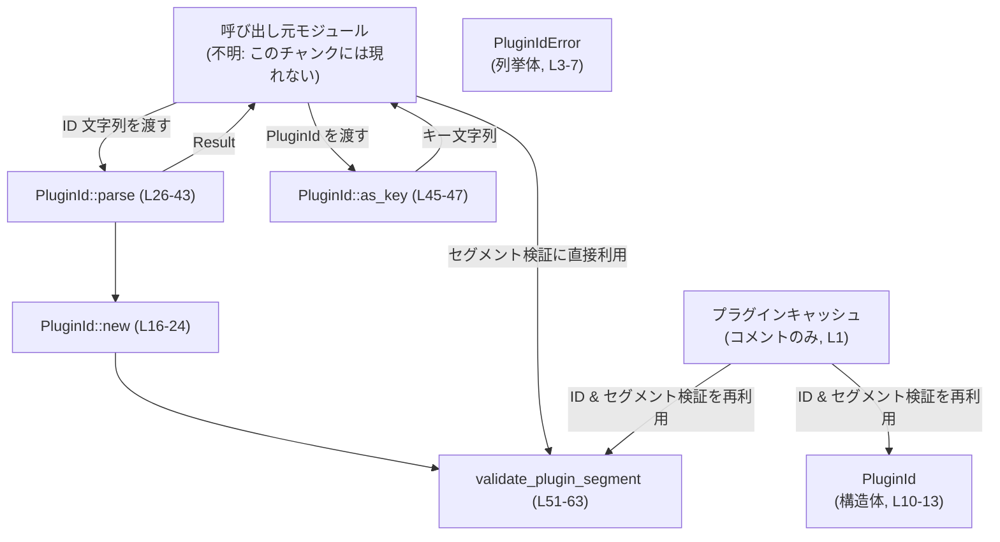
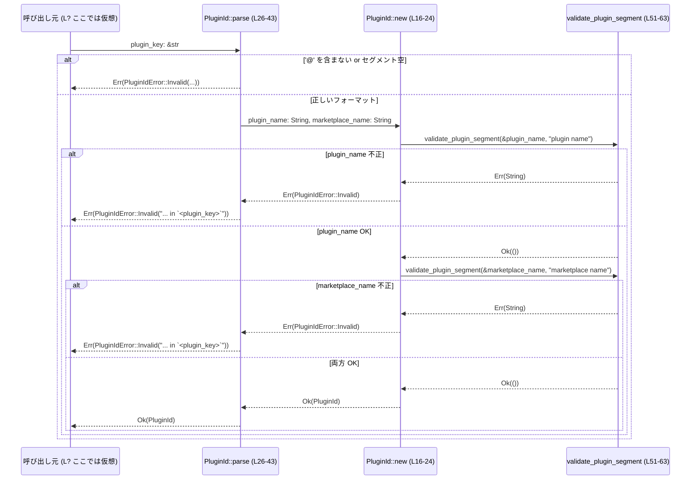

# plugin/src/plugin_id.rs

## 0. ざっくり一言

プラグイン識別子（`<plugin>@<marketplace>` 形式）の **パース・検証・文字列表現の生成** を行う小さなユーティリティモジュールです（`plugin_id.rs:L1-1`）。

---

## 1. このモジュールの役割

### 1.1 概要

- このモジュールは、プラグインとマーケットプレイスを一意に識別するための **安定したプラグイン ID** を扱います。
- 具体的には、`<plugin>@<marketplace>` 形式の文字列から `PluginId` 構造体を生成・検証し、逆に `PluginId` から文字列表現を生成します（`plugin_id.rs:L10-47`）。
- ID を構成する各セグメント（プラグイン名・マーケットプレイス名）の妥当性チェックも共通ロジックとして提供され、コメントにある通りプラグインキャッシュと共有されます（`plugin_id.rs:L1-1`, `L50-51`）。

### 1.2 アーキテクチャ内での位置づけ

このファイル内の依存関係と、コメントから読み取れる周辺コンポーネントの関係を簡略化して表します。



- コメントから「plugin cache と共有される」ことは分かりますが、実際のキャッシュ実装の場所や型はこのチャンクには現れません（`plugin_id.rs:L1-1`）。

### 1.3 設計上のポイント

- **責務の分割**
  - `PluginId` は「構造（データ）」と「生成・パース・文字列化」を担当（`plugin_id.rs:L10-47`）。
  - `validate_plugin_segment` はセグメント単位のバリデーションを担当し、`PluginId::new` から再利用されています（`plugin_id.rs:L16-19`, `L50-63`）。
- **エラーハンドリング**
  - ユーザ向けの API (`PluginId::new`, `PluginId::parse`) は `Result<_, PluginIdError>` を返します（`plugin_id.rs:L16-16`, `L26-26`）。
  - 内部バリデーション関数は `Result<(), String>` を返し、`PluginIdError::Invalid(String)` に変換されます（`plugin_id.rs:L3-6`, `L16-19`, `L51-61`）。
- **状態管理**
  - グローバル状態や内部可変状態は持たず、すべての関数は引数にのみ依存する純粋関数的な設計になっています。
- **安全性・並行性**
  - `unsafe` コードは存在せず安全な Rust のみで実装されています。
  - `PluginId` は `String` フィールドのみから成るため、`Send` / `Sync` な値としてスレッド間で安全にやり取りできる構造になっています（Rust 標準ライブラリの性質に基づく）。

---

## 2. 主要な機能一覧

### 2.1 コンポーネント一覧（インベントリー）

| 名前 | 種別 | 公開範囲 | 役割 | 根拠 |
|------|------|----------|------|------|
| `PluginIdError` | enum | `pub` | プラグイン ID に関するバリデーションエラーを表現する | `plugin_id.rs:L3-7` |
| `PluginId` | struct | `pub` | プラグイン ID を構成するプラグイン名とマーケットプレイス名を保持する | `plugin_id.rs:L9-13` |
| `PluginId::new` | 関数（関連関数） | `pub` | 2 つのセグメントからバリデーションを行った上で `PluginId` を生成する | `plugin_id.rs:L16-24` |
| `PluginId::parse` | 関数（関連関数） | `pub` | `<plugin>@<marketplace>` 形式の文字列から `PluginId` をパースする | `plugin_id.rs:L26-43` |
| `PluginId::as_key` | メソッド | `pub` | `PluginId` を `<plugin>@<marketplace>` 形式の文字列に変換する | `plugin_id.rs:L45-47` |
| `validate_plugin_segment` | 関数（自由関数） | `pub` | セグメント文字列（プラグイン名・マーケットプレイス名）の妥当性を検査する | `plugin_id.rs:L50-63` |

### 2.2 機能の一覧（要約）

- プラグイン ID のエラー表現: `PluginIdError::Invalid(String)` でバリデーション失敗理由を保持（`plugin_id.rs:L3-6`）。
- プラグイン ID の構造表現: `PluginId { plugin_name, marketplace_name }`（`plugin_id.rs:L10-13`）。
- セグメント検証付き ID 生成: `PluginId::new(plugin_name, marketplace_name)`（`plugin_id.rs:L16-24`）。
- 文字列からの ID パース: `PluginId::parse("<plugin>@<marketplace>")`（`plugin_id.rs:L26-43`）。
- ID からキー文字列の生成: `PluginId::as_key()` で `<plugin>@<marketplace>` を返す（`plugin_id.rs:L45-47`）。
- セグメント共通バリデーション: `validate_plugin_segment(segment, kind)`（`plugin_id.rs:L50-63`）。

---

## 3. 公開 API と詳細解説

### 3.1 型一覧（構造体・列挙体など）

| 名前 | 種別 | 役割 / 用途 | フィールド / バリアント | 根拠 |
|------|------|-------------|--------------------------|------|
| `PluginIdError` | 列挙体（enum） | プラグイン ID のパース・生成時の検証エラーを表現する | `Invalid(String)` – エラーメッセージを格納（`thiserror::Error` により `Display` 実装） | `plugin_id.rs:L3-6` |
| `PluginId` | 構造体（struct） | プラグインを一意に識別する ID を保持するデータ構造 | `plugin_name: String`, `marketplace_name: String` | `plugin_id.rs:L9-13` |

---

### 3.2 関数詳細

#### `PluginId::new(plugin_name: String, marketplace_name: String) -> Result<Self, PluginIdError>`

**概要**

- プラグイン名とマーケットプレイス名の 2 つのセグメントを受け取り、それぞれを `validate_plugin_segment` で検証したうえで `PluginId` を生成します（`plugin_id.rs:L16-24`）。
- 検証に失敗した場合は `PluginIdError::Invalid` を返します。

**引数**

| 引数名 | 型 | 説明 |
|--------|----|------|
| `plugin_name` | `String` | プラグイン名セグメント。空でない ASCII 英数字・`_`・`-` のみから成る必要があります（`plugin_id.rs:L16-18`, `L51-61`）。 |
| `marketplace_name` | `String` | マーケットプレイス名セグメント。同じくバリデーション対象です（`plugin_id.rs:L16-19`, `L51-61`）。 |

**戻り値**

- `Ok(PluginId)`:
  - 両方のセグメントが `validate_plugin_segment` を通過した場合に返される `PluginId` インスタンスです（`plugin_id.rs:L20-23`）。
- `Err(PluginIdError::Invalid(message))`:
  - いずれかのセグメントが不正な場合に返されます。

**内部処理の流れ**

1. `plugin_name` を `validate_plugin_segment(&plugin_name, "plugin name")` で検証し、`Err(String)` の場合は `PluginIdError::Invalid` に変換します（`plugin_id.rs:L16-18`）。
2. `marketplace_name` についても同様に `validate_plugin_segment` を呼び出し、`"marketplace name"` として検証します（`plugin_id.rs:L18-19`）。
3. 両方成功した場合、`PluginId { plugin_name, marketplace_name }` を構築して `Ok` で返します（`plugin_id.rs:L20-23`）。

**Examples（使用例）**

```rust
use plugin::PluginId; // 実際のクレートパスはこのチャンクには現れないため仮のものです

fn main() -> Result<(), plugin::PluginIdError> {
    // 妥当なプラグイン名・マーケットプレイス名から PluginId を生成
    let id = PluginId::new("my_plugin".to_string(), "official_market".to_string())?;
    assert_eq!(id.plugin_name, "my_plugin");
    assert_eq!(id.marketplace_name, "official_market");

    Ok(())
}
```

**Errors / Panics**

- エラー条件（`Err(PluginIdError::Invalid(_))`）:
  - `plugin_name` または `marketplace_name` が空文字列の場合（`plugin_id.rs:L52-53`）。
  - いずれかの文字が ASCII 英数字 (`is_ascii_alphanumeric`) でも、`'-'` でも `'_'` でもない場合（`plugin_id.rs:L55-61`）。
- panic:
  - `panic!` 呼び出しはなく、`unwrap` なども使っていないため、`PluginId::new` 自体がパニックすることはありません。

**Edge cases（エッジケース）**

- `plugin_name = ""` または `marketplace_name = ""`:
  - `validate_plugin_segment` により `"invalid plugin name: must not be empty"` のようなメッセージで `Err` になります（`plugin_id.rs:L51-53`）。
- 許可されていない文字（空白・`@`・スラッシュなど）が含まれる場合:
  - `"invalid plugin name: only ASCII letters, digits,`_`, and`-`are allowed"` といったメッセージで `Err` になります（`plugin_id.rs:L55-61`）。

**使用上の注意点**

- 引数は `String` 所有権を消費するため、呼び出し側で再利用したい場合は事前に `clone` する必要があります。
- 呼び出し結果は必ず `Result` として扱い、`Err` の場合の処理（ログ出力・ユーザへのエラーメッセージなど）を用意する必要があります。

---

#### `PluginId::parse(plugin_key: &str) -> Result<Self, PluginIdError>`

**概要**

- `<plugin>@<marketplace>` 形式の文字列から `PluginId` をパースします（`plugin_id.rs:L26-43`）。
- フォーマットチェックとセグメント検証を行い、不正な文字列に対してはエラーを返します。

**引数**

| 引数名 | 型 | 説明 |
|--------|----|------|
| `plugin_key` | `&str` | `<plugin>@<marketplace>` 形式を期待するキー文字列。 |

**戻り値**

- `Ok(PluginId)`:
  - 形式が正しく、両方のセグメントが `validate_plugin_segment` に合格した場合の `PluginId`。
- `Err(PluginIdError::Invalid(message))`:
  - フォーマット不正またはセグメント内容不正の詳細メッセージ付きエラー。

**内部処理の流れ**

1. `plugin_key.rsplit_once('@')` で文字列を末尾から 1 回だけ `@` で分割し、`(plugin_name, marketplace_name)` を得ようとします（`plugin_id.rs:L27-27`）。
2. `rsplit_once` が `None` を返した場合（`@` を 1 つも含まない場合）、`"invalid plugin key`<plugin_key>`; expected <plugin>@<marketplace>"` というエラーメッセージの `PluginIdError::Invalid` を返します（`plugin_id.rs:L27-31`）。
3. 分割に成功した場合、`plugin_name` または `marketplace_name` が空文字列でないかチェックし、空であれば同じメッセージでエラーを返します（`plugin_id.rs:L32-36`）。
4. `plugin_name.to_string()` と `marketplace_name.to_string()` を `PluginId::new` に渡し、セグメント検証を実施します（`plugin_id.rs:L38-38`）。
5. `PluginId::new` から返ってきた `PluginIdError::Invalid(message)` を、`"{message} in`<plugin_key>`"` に変換して返します（`plugin_id.rs:L38-42`）。

**Examples（使用例）**

```rust
use plugin::PluginId; // 実際のパスは不明

fn parse_and_use(key: &str) {
    match PluginId::parse(key) {
        Ok(id) => {
            println!("plugin={} marketplace={}", id.plugin_name, id.marketplace_name);
        }
        Err(err) => {
            // thiserror::Error によりユーザ向け文字列を直接表示可能
            eprintln!("Invalid plugin key: {}", err);
        }
    }
}

fn main() {
    parse_and_use("my_plugin@official_market"); // 成功
    parse_and_use("invalid plugin key");        // 形式エラー
}
```

**Errors / Panics**

- エラー条件:
  - `plugin_key` に `'@'` が一切含まれない場合（`rsplit_once` が `None`）（`plugin_id.rs:L27-31`）。
  - `plugin_key` が `"plugin@"` や `"@market"` のように、どちらかのセグメントが空の場合（`plugin_id.rs:L32-36`）。
  - `plugin_name` / `marketplace_name` に許可されない文字が含まれる、または空である場合（`PluginId::new` 内の `validate_plugin_segment` に起因）（`plugin_id.rs:L38-42`, `L51-61`）。
- panic:
  - パニックを発生させるコードは含まれていません。

**Edge cases（エッジケース）**

- `plugin_key = ""`:
  - `rsplit_once('@')` が `None` となり、「expected `<plugin>@<marketplace>`」メッセージで `Err`（`plugin_id.rs:L27-31`）。
- `plugin_key = "foo"`:
  - 同様に `@` がないためエラー。
- `plugin_key = "plugin@"` または `"@market"`:
  - 分割自体は成功するが、いずれかのセグメントが空 → セグメント空チェックで同じエラーメッセージ（`plugin_id.rs:L32-36`）。
- `plugin_key = "a@b@c"`:
  - `rsplit_once` のため分割結果は `("a@b", "c")`。
  - `plugin_name` に `@` が含まれるため `validate_plugin_segment` で不正となり、エラーメッセージは `"... in`a@b@c`"` のように元のキーを含んだものになります（`plugin_id.rs:L38-42`）。
- 許可されない文字（空白・スラッシュ等）を含むキー:
  - 最終的に `validate_plugin_segment` のフォーマットエラーとして扱われます。

**使用上の注意点**

- 戻り値のエラーには **元のキー文字列** が含まれるため、そのままログに出すことでデバッグしやすくなっています（`plugin_id.rs:L38-42`）。
- `PluginId::parse` は ID の「唯一の正規の文字列表現」として `<plugin>@<marketplace>` を想定しているため、キーのフォーマットを変える場合は他のコードとの互換性に注意が必要です。
- 別のフォーマットを受け付ける必要がある場合でも、この関数の契約を変えるかどうかは慎重に検討する必要があります（プラグインキャッシュと共有されている旨のコメントに基づく: `plugin_id.rs:L1-1`）。

---

#### `PluginId::as_key(&self) -> String`

**概要**

- `PluginId` を `<plugin>@<marketplace>` 形式のキー文字列へ変換します（`plugin_id.rs:L45-47`）。

**引数**

| 引数名 | 型 | 説明 |
|--------|----|------|
| `&self` | `&PluginId` | 変換対象のプラグイン ID。 |

**戻り値**

- `String`:
  - `format!("{}@{}", self.plugin_name, self.marketplace_name)` による文字列表現（`plugin_id.rs:L46-46`）。

**内部処理の流れ**

1. `self.plugin_name` と `self.marketplace_name` を `format!` で連結し、`"<plugin>@<marketplace>"` 形式の `String` を生成します（`plugin_id.rs:L46-46`）。
2. 生成した `String` を返します。

**Examples（使用例）**

```rust
use plugin::PluginId;

fn main() -> Result<(), plugin::PluginIdError> {
    let id = PluginId::parse("my_plugin@official_market")?;
    let key = id.as_key();
    assert_eq!(key, "my_plugin@official_market"); // round-trip が成り立つ

    Ok(())
}
```

**Errors / Panics**

- エラーは返さず、パニックも発生しません（単純な `format!` 呼び出しのみ）。

**Edge cases（エッジケース）**

- `plugin_name` や `marketplace_name` にどのような文字列が入っていても、そのまま連結されます。
  - ただし通常は `PluginId::new` / `parse` を経由して生成されるため、許可された文字種のみが入る前提です。

**使用上の注意点**

- この関数の返す文字列は `PluginId::parse` に再度渡すことで逆変換できる **正規化されたキー** として機能します。
- この文字列を外部システムやキャッシュキーとして使う場合は、`PluginId::parse` と組にして round-trip が成り立つことを前提として利用できます。

---

#### `validate_plugin_segment(segment: &str, kind: &str) -> Result<(), String>`

**概要**

- プラグイン ID を構成する単一セグメント（プラグイン名・マーケットプレイス名など）が妥当かどうかを検証します（`plugin_id.rs:L50-63`）。
- 空でないこと、および ASCII 英数字・`_`・`-` のみから成ることをチェックします。

**引数**

| 引数名 | 型 | 説明 |
|--------|----|------|
| `segment` | `&str` | 検証対象の文字列。 |
| `kind` | `&str` | エラーメッセージに埋め込む種別名（例: `"plugin name"`）。 |

**戻り値**

- `Ok(())`:
  - セグメントが条件を満たす場合。
- `Err(String)`:
  - バリデーションに失敗した場合のエラーメッセージ。

**内部処理の流れ**

1. `segment.is_empty()` をチェックし、空であれば `"invalid {kind}: must not be empty"` を返します（`plugin_id.rs:L52-53`）。
2. `segment.chars().all(...)` で全ての文字が以下のいずれかであることを検証します（`plugin_id.rs:L55-57`）。
   - ASCII 英字または数字（`ch.is_ascii_alphanumeric()`）
   - `'-'`
   - `'_'`
3. 条件を満たさない文字が含まれている場合は `"invalid {kind}: only ASCII letters, digits,`_`, and`-`are allowed"` を返します（`plugin_id.rs:L59-61`）。
4. いずれの条件にも引っかからなければ `Ok(())` を返します（`plugin_id.rs:L63-63`）。

**Examples（使用例）**

```rust
use plugin::validate_plugin_segment;

fn main() {
    assert!(validate_plugin_segment("valid_name-1", "plugin name").is_ok());
    assert!(validate_plugin_segment("with space", "plugin name").is_err());
    assert!(validate_plugin_segment("", "plugin name").is_err());
}
```

**Errors / Panics**

- エラー条件:
  - `segment` が空文字列。
  - 非 ASCII または空白・`@`・スラッシュなど、許可されていない文字を含む場合。
- panic:
  - パニックはありません。

**Edge cases（エッジケース）**

- マルチバイト文字（絵文字、日本語など）:
  - `is_ascii_alphanumeric()` が `false` を返すため許可されません。
- 非表示文字（タブや改行など）:
  - ASCII 制御文字であり、`is_ascii_alphanumeric()` が `false` なので許可されません。

**使用上の注意点**

- エラー型は `String` であり、呼び出し側でさらにラップして利用する前提の低レベル関数です（`PluginId::new` で `PluginIdError` に変換されている: `plugin_id.rs:L16-19`）。
- エラーメッセージに `kind` を埋め込むため、呼び出し側は `"plugin name"` のようなユーザに分かりやすい文字列を渡すとよいです。

---

### 3.3 その他の関数

- このファイルには、上記以外の公開関数・メソッドは存在しません（`plugin_id.rs:L3-63`）。

---

## 4. データフロー

ここでは、`PluginId::parse` を入口とした典型的なデータの流れを示します。

### 4.1 文字列キーから `PluginId` 生成まで



- 入口は常に `&str` のキー文字列であり、コミュニケーション境界（ユーザ入力や設定ファイルなど）から渡されることが想定されます（コードからは入力元は不明）。
- 最終的に `PluginId` を得るまでに、フォーマットチェックとセグメントバリデーションの 2 段階の検証が行われます。

---

## 5. 使い方（How to Use）

### 5.1 基本的な使用方法

**(1) 文字列キーから `PluginId` を得る**

```rust
use plugin::{PluginId, PluginIdError}; // 実際のモジュールパスはこのチャンクには現れません

fn main() -> Result<(), PluginIdError> {
    // 設定やユーザ入力から取得したキー文字列
    let key = "my_plugin@official_market";

    // 文字列から PluginId に変換（パースとバリデーションを同時に行う）
    let id = PluginId::parse(key)?;

    // フィールドにアクセス
    println!("plugin: {}", id.plugin_name);
    println!("marketplace: {}", id.marketplace_name);

    // 再度文字列表現に戻す
    let normalized = id.as_key();
    assert_eq!(normalized, key);

    Ok(())
}
```

**(2) セグメントを個別に扱う場合**

```rust
use plugin::{PluginId, PluginIdError, validate_plugin_segment};

fn main() -> Result<(), PluginIdError> {
    // 個別に検証してから PluginId を構築するケース
    let plugin = "my_plugin";
    let marketplace = "official";

    // 必要なら事前にセグメントだけを検証
    validate_plugin_segment(plugin, "plugin name")
        .map_err(PluginIdError::Invalid)?;
    validate_plugin_segment(marketplace, "marketplace name")
        .map_err(PluginIdError::Invalid)?;

    // その後で所有権を移して PluginId を生成
    let id = PluginId::new(plugin.to_string(), marketplace.to_string())?;

    println!("key = {}", id.as_key());
    Ok(())
}
```

### 5.2 よくある使用パターン

- **設定ファイルや環境変数から読み込んだキーの検証**
  - 入力をそのまま `PluginId::parse` に渡し、`Result` で成功/失敗を分岐する。
- **キャッシュやストレージのキーとして利用**
  - `PluginId` を内部的に保持しつつ、外部キーとして `id.as_key()` を利用する。
  - 読み戻す際はキー文字列から `PluginId::parse` することで一貫したバリデーションを再利用できる。

### 5.3 よくある間違い

```rust
use plugin::PluginId;

// 間違い例: Result を無視している
fn bad_example() {
    // parse の結果を無視してしまう
    let _ = PluginId::parse("invalid key"); // エラーが握りつぶされる
}

// 正しい例: Result をきちんと扱う
fn good_example() {
    match PluginId::parse("invalid key") {
        Ok(id) => {
            println!("Valid plugin id: {}", id.as_key());
        }
        Err(err) => {
            eprintln!("Invalid plugin id: {}", err);
        }
    }
}
```

- **誤用例**: `unwrap()` で強制的に成功を仮定すると、不正なキーが来たときにアプリケーション全体がパニックする可能性があります。
- **正しい例**: `match` や `?` 演算子などでエラーを呼び出し元に伝搬または適切に処理します。

### 5.4 使用上の注意点（まとめ）

- **前提条件**
  - プラグイン名・マーケットプレイス名は空であってはならず、ASCII 英数字と `_`・`-` のみを含む必要があります（`plugin_id.rs:L51-61`）。
- **エラー扱い**
  - `PluginId::parse` / `PluginId::new` は常に `Result` を返すため、エラー処理を必ず行う必要があります。
- **並行性**
  - `PluginId` はイミュータブルなデータ構造であり、`Clone` が実装されているため（`plugin_id.rs:L9-9`）、スレッド間でコピーしても安全です。
- **セキュリティ**
  - 許可される文字を厳しく制限しているため、ファイルパスや URL パスの一部として使用する場合にも、パストラバーサルなどのリスクを抑えられます（`plugin_id.rs:L50-61`）。
  - ただし、この制約がすべてのコンテキストで十分かどうかは、利用側の要件に依存します。

---

## 6. 変更の仕方（How to Modify）

### 6.1 新しい機能を追加する場合

- **ID 形式を拡張したい場合**
  - 例: 追加のセグメント（バージョンやベンダーなど）を導入する場合。
  - 検討する箇所:
    - `PluginId` 構造体にフィールドを追加（`plugin_id.rs:L10-13`）。
    - `PluginId::new` の引数と `validate_plugin_segment` 呼び出しを拡張（`plugin_id.rs:L16-24`）。
    - `PluginId::parse` のフォーマット（`rsplit_once` の部分）とエラーメッセージを変更（`plugin_id.rs:L26-43`）。
    - `PluginId::as_key` のフォーマットを変更（`plugin_id.rs:L45-47`）。
  - プラグインキャッシュなど、他のコンポーネントとの互換性に注意が必要です（コメント: `plugin_id.rs:L1-1`）。

- **バリデーションルールを強化したい場合**
  - 例: 長さ制限を追加する、予約語を禁止するなど。
  - 追加する箇所:
    - `validate_plugin_segment` 内で長さチェックやブラックリストチェックを追加（`plugin_id.rs:L51-61`）。

### 6.2 既存の機能を変更する場合

- **エラー型を拡張する場合**
  - `PluginIdError` に別のバリアントを追加する場合は、`PluginId::parse` の `map_err(|err| match err { ... })` がコンパイルエラーになるため、必ずマッチ文を更新する必要があります（`plugin_id.rs:L3-6`, `L38-42`）。
- **文字セットの変更**
  - 許可する文字種を増やしたり減らしたりする場合は、`validate_plugin_segment` の `.all(...)` 条件を変更します（`plugin_id.rs:L55-57`）。
  - その変更が既存のデータやストレージにどのような影響を与えるか（既存キーが無効化されないか）を確認する必要があります。
- **フォーマット文字列の変更**
  - `PluginId::parse` のエラーメッセージや `PluginId::as_key` のフォーマットを変更すると、ログや外部インターフェイスの互換性に影響します（`plugin_id.rs:L28-35`, `L46-46`）。

---

## 7. 関連ファイル

このチャンクから明確に参照できる関連コンポーネントはコメントのみですが、推測できる範囲で整理します。

| パス / モジュール | 役割 / 関係 |
|-------------------|------------|
| プラグインキャッシュ関連モジュール（パス不明） | ファイル冒頭のコメント `Stable plugin identifier parsing and validation shared with the plugin cache.` から、この `PluginId` と `validate_plugin_segment` がプラグインキャッシュと共有されることが分かります（`plugin_id.rs:L1-1`）。このチャンクには具体的なパスや型は現れません。 |
| その他のプラグイン管理モジュール（不明） | 呼び出し元として `PluginId` / `PluginId::parse` / `validate_plugin_segment` を利用するモジュールが存在すると考えられますが、このチャンクには現れません。 |

---

### 補足: テスト・パフォーマンス・監視

- **テスト**
  - このファイルチャンク内にテストコード（`#[test]` など）は存在しません（`plugin_id.rs:L3-63`）。
- **パフォーマンス**
  - 各関数は文字列操作と簡単なループ（`chars().all(...)`）のみで、大きなオブジェクトや I/O は扱っていません。
  - ボトルネックになる可能性は低いですが、大量の ID を処理する場合は `String` の再確保回数（`to_string()` 呼び出し）に注意する余地があります（`plugin_id.rs:L38-38`, `L46-46`）。
- **監視・ログ**
  - このモジュール自体はログ出力機能を持たず、エラー情報は `Display` 可能なメッセージとして呼び出し側に委譲する設計になっています（`PluginIdError` と `validate_plugin_segment` のエラーメッセージ: `plugin_id.rs:L3-6`, `L52-61`）。
