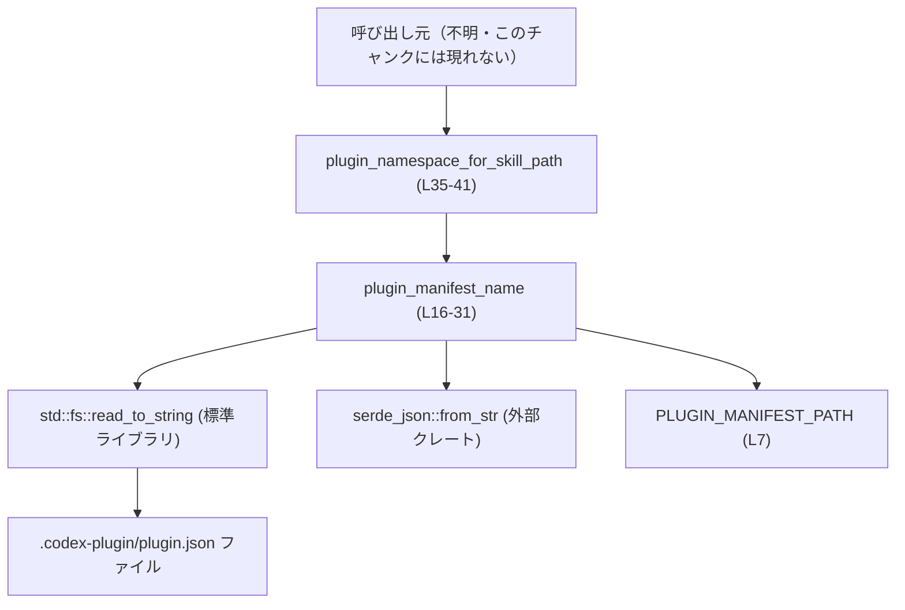
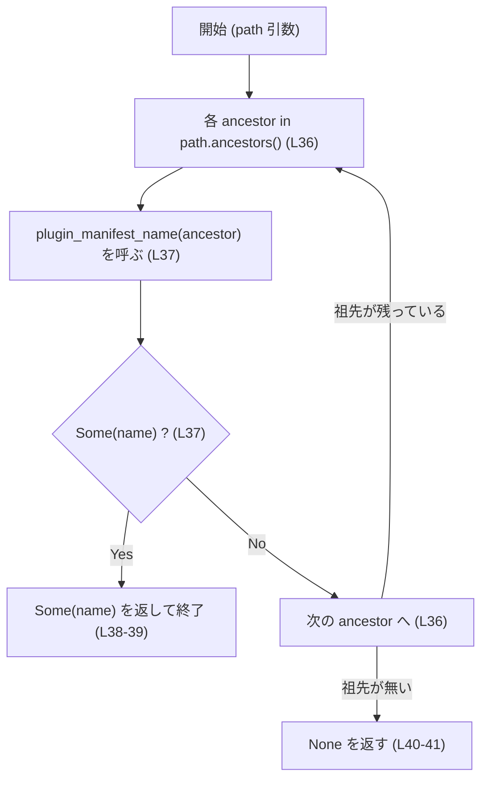

# plugin\src\plugin_namespace.rs コード解説

## 0. ざっくり一言

skill ファイルのパスから親ディレクトリをさかのぼって `plugin.json` を探し、プラグインの「名前空間」（manifest の `name`）を決定するユーティリティです（`plugin_namespace.rs:L1-1, L33-35`）。

---

## 1. このモジュールの役割

### 1.1 概要

- このモジュールは、**skill ファイルのパスだけが分かっている状況でも、その skill が属するプラグインの名前を特定する**ために存在します（`plugin_namespace.rs:L1-1, L33-35`）。
- プラグインのルート直下（正確には任意の祖先ディレクトリ）にある `.codex-plugin/plugin.json` を読み、そこから `name` を決定します（`plugin_namespace.rs:L6-7, L16-23`）。
- `name` フィールドが空の場合は、プラグインのルートディレクトリ名を名前として使うルールになっています（`plugin_namespace.rs:L23-30`）。

### 1.2 アーキテクチャ内での位置づけ

このモジュールは、ファイルシステムと JSON パーサ（`serde_json`）に依存しつつ、「skill パス → プラグイン名」という解決を行う純粋なヘルパー層です。



- **呼び出し元**: skill ファイルのパスを持つ上位モジュール（このチャンクには現れない）。
- **`plugin_namespace_for_skill_path`**: skill パスから祖先ディレクトリをたどり、最初に有効な manifest を見つける高レベル関数（`plugin_namespace.rs:L35-41`）。
- **`plugin_manifest_name`**: 単一のディレクトリに対して manifest を読み取り、名前を解決する低レベル関数（`plugin_namespace.rs:L16-31`）。
- **`PLUGIN_MANIFEST_PATH`**: すべての manifest の相対パスを一元管理する定数（`plugin_namespace.rs:L6-7`）。

### 1.3 設計上のポイント

- **ステートレス**  
  - グローバルな可変状態は持たず、すべての情報は関数引数とファイルシステムから取得します（`plugin_namespace.rs:L16-31, L35-41`）。
- **Option によるエラーハンドリング**  
  - manifest ファイルが存在しない・読めない・JSON が壊れているなどの異常は、すべて `None` として扱い、呼び出し元に「見つからなかった」として伝えます（`plugin_namespace.rs:L18-22`）。
- **名前解決ルールのカプセル化**  
  - `name` フィールドが空ならディレクトリ名を使う、というルールを `plugin_manifest_name` 内部に閉じ込め、公開 API 側は単に「名前をもらう」だけにしています（`plugin_namespace.rs:L23-30, L35-38`）。
- **同期 I/O・単純な制御フロー**  
  - すべて同期的なファイル I/O であり、非同期処理やスレッドを直接扱っていません。ループはパスの祖先列挙のみです（`plugin_namespace.rs:L21, L35-37`）。

---

## 2. 主要な機能一覧（コンポーネントインベントリー）

このファイル内の主要コンポーネントと役割です。

| 名前 | 種別 | 公開 | 役割 / 用途 | 根拠 |
|------|------|------|-------------|------|
| `PLUGIN_MANIFEST_PATH` | 定数 `&'static str` | 公開 (`pub`) | プラグインルートから manifest への相対パス `.codex-plugin/plugin.json` を表す | `plugin_namespace.rs:L6-7` |
| `RawPluginManifestName` | 構造体 | 非公開 | JSON manifest から `name` フィールドだけをデシリアライズするための内部用型 | `plugin_namespace.rs:L9-14` |
| `plugin_manifest_name` | 関数 | 非公開 | 指定ディレクトリ配下の manifest を読み、プラグイン名を返す | `plugin_namespace.rs:L16-31` |
| `plugin_namespace_for_skill_path` | 関数 | 公開 | skill ファイルのパスから祖先をさかのぼり、最も近い有効な manifest の `name` を返す | `plugin_namespace.rs:L33-41` |
| `tests` | モジュール | 非公開（テストビルドのみ） | manifest の `name` がそのまま namespace として返ることを検証するユニットテスト | `plugin_namespace.rs:L44-69` |
| `uses_manifest_name` | 関数（テスト） | 非公開 | 単一のプラグインディレクトリ構造を作り、期待通りの名前が返ることを確認する | `plugin_namespace.rs:L50-69` |

---

## 3. 公開 API と詳細解説

### 3.1 型一覧（構造体・定数など）

| 名前 | 種別 | 公開 | フィールド / 値 | 役割 / 用途 | 根拠 |
|------|------|------|-----------------|-------------|------|
| `PLUGIN_MANIFEST_PATH` | 定数 `&'static str` | 公開 | 値: `".codex-plugin/plugin.json"` | 各プラグインルートから manifest までの固定相対パス | `plugin_namespace.rs:L6-7` |
| `RawPluginManifestName` | 構造体（`serde::Deserialize` 派生） | 非公開 | `name: String`（`#[serde(default)]`） | JSON manifest の `name` フィールドのみを取り出す内部用型。`name` が欠けていても空文字列として扱える | `plugin_namespace.rs:L9-14` |

### 3.2 関数詳細（コアロジック）

#### `pub fn plugin_namespace_for_skill_path(path: &Path) -> Option<String>`

**概要**

- 引数 `path` の祖先ディレクトリを順にたどり、**最初に有効な `plugin.json` が見つかったディレクトリの「プラグイン名」**を返します（`plugin_namespace.rs:L33-41`）。
- manifest が見つからない、またはすべて無効な場合は `None` を返します。

**引数**

| 引数名 | 型 | 説明 |
|--------|----|------|
| `path` | `&Path` | skill ファイル、もしくはその配下にある任意のパス。実在するかどうかは問わず、単に「基準ディレクトリを特定するためのパス」として使われます（`plugin_namespace.rs:L35-37`）。 |

**戻り値**

- `Option<String>`  
  - `Some(name)` : `path` の祖先のいずれかに有効な manifest が存在し、その manifest から決定されたプラグイン名 `name` が返る（`plugin_namespace.rs:L36-39`）。  
  - `None` : どの祖先ディレクトリにも有効な manifest が存在しなかった（`plugin_namespace.rs:L40-41`）。

**内部処理の流れ（アルゴリズム）**

1. `path.ancestors()` で、`path` 自身からルートまでの祖先ディレクトリを列挙します（`plugin_namespace.rs:L36`）。
2. 各 `ancestor` について、内部関数 `plugin_manifest_name(ancestor)` を呼びます（`plugin_namespace.rs:L37`）。
3. `plugin_manifest_name` が `Some(name)` を返した場合、その `name` をすぐに `Some(name)` として返し、探索を終了します（`plugin_namespace.rs:L37-39`）。
4. すべての祖先で `None` だった場合、`None` を返します（`plugin_namespace.rs:L40-41`）。



**Examples（使用例）**

基本的な使い方の例です。`skills/search/SKILL.md` からプラグイン名を解決する想定です。

```rust
use std::path::Path;
use plugin::plugin_namespace_for_skill_path; // 実際のクレートパスはこのチャンクには現れません

fn main() {
    // skill ファイルのパス（存在していると仮定）
    let skill_path = Path::new("plugins/sample/skills/search/SKILL.md");

    // プラグインの名前空間を解決する
    let namespace = plugin_namespace_for_skill_path(skill_path);

    match namespace {
        Some(name) => {
            // 有効な plugin.json がどこかの祖先に存在し、その name を取得できた
            println!("Plugin namespace: {}", name);
        }
        None => {
            // どの祖先にも有効な manifest が無かった
            println!("No plugin manifest found for this skill path");
        }
    }
}
```

テストコード内での実際の使われ方は以下のとおりです（`plugin_namespace.rs:L50-69`）。

```rust
// 一時ディレクトリに plugins/sample/.codex-plugin/plugin.json を作成し、
// skills/search/SKILL.md から namespace を解決する（L52-63）。
let tmp = tempdir().expect("tempdir");
let plugin_root = tmp.path().join("plugins/sample");
let skill_path = plugin_root.join("skills/search/SKILL.md");
// ... 省略: ディレクトリ作成と manifest / skill の書き込み ...
assert_eq!(
    plugin_namespace_for_skill_path(&skill_path),
    Some("sample".to_string()),
);
```

**Errors / Panics**

- この関数自身は `Result` ではなく `Option` を返します。
  - manifest が存在しない、読めない、壊れた JSON である等はすべて `None` に集約されます（`plugin_namespace.rs:L37-40`）。
- 関数内部では `unwrap` / `expect` 等を呼んでおらず、通常の使用で panic する経路はありません（`plugin_namespace.rs:L35-41`）。
- ただし、呼び出し元が `Option::unwrap()` などを使用した場合は、`None` に対して panic する可能性があります。

**Edge cases（エッジケース）**

- `path` が実在しないパス  
  - `Path::ancestors` は文字列ベースの処理であり、存在確認を行わないため、この関数は問題なく動作します。manifest の存在チェックは各祖先ディレクトリで行われます（`plugin_namespace.rs:L36-38`）。
- 祖先のどこかに manifest はあるが、JSON が壊れている場合  
  - `plugin_manifest_name` が `None` を返し、そのディレクトリは「manifest 無し」と同じ扱いになります（`plugin_namespace.rs:L21-22, L37-38`）。
- 複数の祖先に manifest が存在する場合  
  - 一番近い祖先（`path` に最も近い方）で有効な manifest のみが使用されます（`plugin_namespace.rs:L36-38`）。
- `path` 自身がディレクトリのパスかファイルのパスか  
  - どちらの場合も `ancestors()` の挙動は同様であり、最初の要素として `path` 自身が使われます（`plugin_namespace.rs:L36`）。

**使用上の注意点**

- **戻り値の `Option` を必ず処理すること**  
  - manifest が存在しない環境でも `None` が返るだけでエラーにはならないため、呼び出し側で `None` を考慮した分岐を書く必要があります。
- **I/O 負荷**  
  - 各祖先ディレクトリごとに manifest の存在チェックと必要に応じてファイル読み込みが行われるため、深いディレクトリ構造で頻繁に呼び出す場合は I/O コストに注意が必要です（`plugin_namespace.rs:L17-22, L36-38`）。
- **並行性**  
  - グローバルな状態に依存しておらず、引数とファイルシステムの状態のみを参照するため、この関数自体は複数スレッドから同時に呼び出しても共有状態の競合を起こさない構造になっています（`plugin_namespace.rs:L35-41`）。
  - ただし、裏側のファイルシステムアクセスは OS に依存し、ファイルの作成/削除と競合した場合の結果は OS の挙動次第です（このチャンクには詳細は現れません）。

---

#### `fn plugin_manifest_name(plugin_root: &Path) -> Option<String>`

**概要**

- 1 つのディレクトリ `plugin_root` に対して、`.codex-plugin/plugin.json` を探し、そこからプラグイン名を決定します（`plugin_namespace.rs:L16-23`）。
- manifest が存在しない、読めない、デコードできない場合は `None` を返します（`plugin_namespace.rs:L18-22`）。

**引数**

| 引数名 | 型 | 説明 |
|--------|----|------|
| `plugin_root` | `&Path` | プラグインルート候補となるディレクトリパス。ここから相対パスで manifest を探します（`plugin_namespace.rs:L16-18`）。 |

**戻り値**

- `Option<String>`  
  - `Some(name)` : manifest が存在し、読み込み・JSON デコードに成功し、名前解決ルールに従って決定された `name` が返ります（`plugin_namespace.rs:L21-30`）。  
  - `None` : manifest が無い、ファイルではない、読み込みに失敗、または JSON デコードに失敗した場合（`plugin_namespace.rs:L18-22`）。

**内部処理の流れ（アルゴリズム）**

1. `plugin_root.join(PLUGIN_MANIFEST_PATH)` で manifest のフルパスを組み立てます（`plugin_namespace.rs:L17`）。
2. `manifest_path.is_file()` でファイルの存在と種別を確認し、ファイルでなければ `None` を返します（`plugin_namespace.rs:L18-20`）。
3. `fs::read_to_string(&manifest_path).ok()?` でファイルを読み込みます。I/O エラーなら `None` を返します（`plugin_namespace.rs:L21`）。
4. `serde_json::from_str::<RawPluginManifestName>(&contents).ok()?` で JSON を `RawPluginManifestName` にデコードします。失敗したら `None` を返します（`plugin_namespace.rs:L22`）。
5. `RawPluginManifestName { name: raw_name }` から `raw_name: String` を取り出します（`plugin_namespace.rs:L22`）。
6. `raw_name` が空白のみかどうかで名前決定ルールを適用します（`plugin_namespace.rs:L23-30`）:
   - `raw_name.trim().is_empty()` が **真** なら、`plugin_root.file_name()`（最後のディレクトリ名）を UTF-8 文字列に変換して使用。
   - そうでなければ `raw_name` をそのまま使用。
7. 決定された名前を `Some(name.to_string())` として返します（`plugin_namespace.rs:L23-30`）。

**Examples（使用例）**

内部関数ですが、単体での挙動イメージを示します。

```rust
use std::path::Path;

// plugin_root が "plugins/sample" で、その配下に
// "plugins/sample/.codex-plugin/plugin.json" があると仮定します。
// JSON: {"name": "sample"}

let plugin_root = Path::new("plugins/sample");
let name = plugin_manifest_name(plugin_root); // 非公開関数なので実際には同一モジュール内のみ利用可能

assert_eq!(name, Some("sample".to_string()));
```

`name` フィールドが空の場合の例です（実装から読み取れるルールのイメージ）。

```rust
// JSON: {"name": ""} または {"name": "   "} といった空白のみ

let plugin_root = Path::new("plugins/sample");
let name = plugin_manifest_name(plugin_root);

// raw_name が空なので、ディレクトリ名 "sample" が使われる
assert_eq!(name, Some("sample".to_string()));
```

**Errors / Panics**

- `fs::read_to_string` や `serde_json::from_str` のエラーは `.ok()?` によって `None` に変換されます（`plugin_namespace.rs:L21-22`）。
- `plugin_root.file_name()` が `None` の場合（ルートディレクトリなど）や、`to_str()` が `None` の場合（非 UTF-8 パス）は、そのまま `raw_name` が使用されます。これらは `unwrap` されていないため panic にはなりません（`plugin_namespace.rs:L24-28`）。
- この関数自体にも `unwrap` / `expect` は含まれず、通常の実行パスでは panic は発生しません（`plugin_namespace.rs:L16-31`）。

**Edge cases（エッジケース）**

- manifest ファイルが存在しない  
  - `is_file()` が偽となり、即座に `None` を返します（`plugin_namespace.rs:L18-20`）。
- manifest パスがディレクトリなどファイル以外  
  - `is_file()` が偽となり、同様に `None` を返します（`plugin_namespace.rs:L18-20`）。
- 読み取り権限が無い、または一時的な I/O エラー  
  - `read_to_string` が `Err` を返し、`.ok()?` により `None` になります（`plugin_namespace.rs:L21`）。
- JSON が無効（構文エラーなど）  
  - `serde_json::from_str` が `Err` を返し、`.ok()?` により `None` になります（`plugin_namespace.rs:L22`）。
- `name` フィールドが欠けている  
  - `RawPluginManifestName` の `#[serde(default)]` により、`name` には空文字列が入ります（`plugin_namespace.rs:L12-14`）。
  - 結果として「`name` が空 → ディレクトリ名を使用」というルールが適用されます（`plugin_namespace.rs:L23-30`）。
- パスが非 UTF-8 の場合  
  - `file_name().and_then(|e| e.to_str())` が `None` になり、`unwrap_or(raw_name.as_str())` により `raw_name` が使用されます（`plugin_namespace.rs:L24-28`）。

**使用上の注意点**

- **manifest の妥当性**  
  - JSON 全体の内容は `name` 以外見ておらず、`name` も文字列であればよい、という最小限の検証のみです（`plugin_namespace.rs:L9-14, L22`）。他のフィールドに対する検証はこのモジュールでは行いません。
- **名前のフォールバックルール**  
  - manifest の `name` が空白のみの場合にディレクトリ名へフォールバックするルールは、この関数に埋め込まれており、呼び出し元からは変更できません（`plugin_namespace.rs:L23-30`）。
- **セキュリティ上の観点**  
  - 名前の決定に使うのは manifest 内の文字列とディレクトリ名だけであり、コマンド実行などは行っていません。  
  - manifest が壊れていても `None` となるだけで、パース結果を部分的に使うような中途半端な状態は発生しません（`plugin_namespace.rs:L21-22`）。

### 3.3 その他の関数

| 関数名 | 役割（1 行） | 根拠 |
|--------|--------------|------|
| `uses_manifest_name` | テスト用関数。実際に一時ディレクトリにプラグイン構造を作成し、`plugin_namespace_for_skill_path` が manifest の `name` をそのまま返すことを検証する | `plugin_namespace.rs:L50-69` |

---

## 4. データフロー

典型的な処理シナリオとして、「skill ファイルのパスからプラグイン名を解決する」場合のデータフローを示します。

```mermaid
sequenceDiagram
    participant Caller as 呼び出し元
    participant NS as plugin_namespace_for_skill_path (L35-41)
    participant PM as plugin_manifest_name (L16-31)
    participant FS as ファイルシステム
    participant JSON as serde_json::from_str

    Caller->>NS: &Path (skill パス)
    loop 各 ancestor in path.ancestors() (L36)
        NS->>PM: &Path (ancestor)
        PM->>FS: read_to_string(ancestor + PLUGIN_MANIFEST_PATH) (L17-21)
        alt 読み込み & JSON デコード成功 (L21-22)
            PM->>JSON: RawPluginManifestName にデコード
            PM-->>NS: Some(決定した name) (L23-30)
            NS-->>Caller: Some(name) を返す (L37-39)
            break
        else 失敗 (ファイル無し / 読めない / JSON 無効)
            PM-->>NS: None (L18-22)
        end
    end
    NS-->>Caller: None （どの ancestor でも Some が返らなかった場合, L40-41）
```

要点:

- skill パス自体の存在は検証せず、単に「祖先列挙の起点」として使用します。
- 実際の I/O は manifest ファイルに対してのみ行われます。
- エラーや異常はすべて「その ancestor には有効な manifest が無い」と見なされ、上位へは `None` として表現されます。

---

## 5. 使い方（How to Use）

### 5.1 基本的な使用方法

実運用で想定される、skill ファイルのパスからプラグイン namespace を取得する最小例です。

```rust
use std::path::Path;
use plugin::plugin_namespace_for_skill_path; // 実際のクレートパスはこのチャンクには現れません

fn resolve_namespace(skill_path: &Path) -> String {
    match plugin_namespace_for_skill_path(skill_path) {
        Some(name) => name,
        None => {
            // 見つからなかった場合のデフォルト動作を決めておく
            // ここでは空文字列を返す例
            String::new()
        }
    }
}

fn main() {
    // 例: コマンドライン引数から skill のパスを受け取る想定
    let skill_path = Path::new("plugins/sample/skills/search/SKILL.md");

    let namespace = resolve_namespace(skill_path);
    println!("Resolved namespace: {:?}", namespace);
}
```

### 5.2 よくある使用パターン

1. **manifest に明示的な `name` がある場合**

   - `plugin_root/.codex-plugin/plugin.json`:

     ```json
     {"name": "sample-plugin"}
     ```

   - 呼び出し:

     ```rust
     let skill_path = Path::new("plugins/sample/skills/SKILL.md");
     let ns = plugin_namespace_for_skill_path(skill_path);
     assert_eq!(ns, Some("sample-plugin".to_string()));
     ```

2. **manifest の `name` を省略し、ディレクトリ名を名前空間として使う場合**

   - manifest:

     ```json
     {}
     ```

     または:

     ```json
     {"name": "   "}
     ```

   - ルールにより、`plugins/sample` の `sample` が namespace になります（`plugin_namespace.rs:L23-30`）。

     ```rust
     let skill_path = Path::new("plugins/sample/skills/SKILL.md");
     let ns = plugin_namespace_for_skill_path(skill_path);
     assert_eq!(ns, Some("sample".to_string()));
     ```

3. **複数プラグイン階層がある場合**

   - 例: `plugins/sample/sub/skills/SKILL.md` のように、サブディレクトリの下にも skill がある場合。
   - もっとも近い ancestor（`sub` 直下→`sample` 直下→…）の順に manifest を探し、最初に見つかった有効なものが使われます（`plugin_namespace.rs:L36-38`）。

### 5.3 よくある間違い

```rust
// 間違い例: Option を無条件に unwrap してしまう
let skill_path = Path::new("plugins/unknown/skills/SKILL.md");
let ns = plugin_namespace_for_skill_path(skill_path).unwrap(); // manifest が無いと panic する
```

```rust
// 正しい例: None を考慮する
let skill_path = Path::new("plugins/unknown/skills/SKILL.md");
let ns = plugin_namespace_for_skill_path(skill_path);
match ns {
    Some(name) => println!("namespace = {}", name),
    None => println!("manifest が見つかりませんでした"),
}
```

```rust
// 間違い例: skill パスに対して存在確認をしているつもりでいる
if skill_path.exists() {
    // ここで plugin_namespace_for_skill_path を呼べば manifest も存在すると誤解してしまう
}
```

- `plugin_namespace_for_skill_path` は **skill パスの存在とは無関係**に動作し、manifest の有無のみを見ています（`plugin_namespace.rs:L35-41`）。

### 5.4 使用上の注意点（まとめ）

- **戻り値は `Option<String>`**  
  - manifest が見つからない環境を正常系として扱う設計になっているため、呼び出し側で `None` を必ず考慮する必要があります。
- **ファイルシステム依存**  
  - 実行時のワーキングディレクトリやパスの指定方法に依存して解決結果が変わります。相対パス・絶対パスの扱いに注意が必要です（`plugin_namespace.rs:L35-37`）。
- **I/O とパフォーマンス**  
  - 深いディレクトリ階層で頻繁に呼ぶ場合は、キャッシュなど上位層での最適化を検討する余地があります（このモジュール自身にはキャッシュはありません）。
- **並行性**  
  - モジュールは状態を持たないため、複数スレッドから読み取り専用に利用しても内部的なデータ競合は発生しません（`plugin_namespace.rs:L16-41`）。  
  - ただし、ファイルの作成・削除と同時に呼ぶと、「見つからない」「壊れている」と判断されるタイミングがあり得ます。

---

## 6. 変更の仕方（How to Modify）

### 6.1 新しい機能を追加する場合

例として、「manifest の内容をすべて読み込む」関数を追加する場合の流れです。

1. **ファイル位置の選定**  
   - manifest を扱うロジックは本ファイルにまとまっているため、新しい関数も `plugin_namespace.rs` に追加するのが自然です。
2. **既存関数の再利用**  
   - `plugin_manifest_name` は「名前決定ルール」をすでに実装しているので、同様のルールが必要であれば、その一部を共通化することを検討できます（`plugin_namespace.rs:L23-30`）。
3. **公開範囲の決定**  
   - 外部から直接呼ばれる必要がある場合は `pub fn` として定義し、そうでなければ内部関数として `fn` のままにします。
4. **I/O エラーの扱い**  
   - 既存の関数は `Option` ベースですが、新機能では `Result` を返したい場合もあります。その場合には、呼び出し元との一貫性を意識した設計が必要です。
5. **テストの追加**  
   - `tests` モジュールの中に新たなテスト関数を追加し、想定するディレクトリ構造を一時ディレクトリで再現して検証する形が既存と整合的です（`plugin_namespace.rs:L44-69`）。

### 6.2 既存の機能を変更する場合

- **影響範囲の確認**
  - `plugin_namespace_for_skill_path` は公開 API なので、他モジュールから広く呼ばれている可能性があります（呼び出し側はこのチャンクには現れません）。戻り値の型や意味を変える場合は、その影響範囲に注意が必要です。
- **契約（前提条件・返り値の意味）の維持**
  - 現状、「最も近い有効な manifest の名前を返す」という契約があります（`plugin_namespace.rs:L33-41`）。探索順やフォールバックルールを変える場合は、この契約が変わるかどうかを明確にすべきです。
- **エラー処理の方針**
  - 現在は「エラーは `None`」という方針です（`plugin_namespace.rs:L18-22, L37-40`）。`Result` に変更する場合は、呼び出し側のエラー処理ロジックが大きく変わることになります。
- **テストの更新**
  - 特に `plugin_manifest_name` のフォールバックルール（`name` が空ならディレクトリ名）を変える場合は、新しい仕様を反映したテストケース（空 `name`、非 UTF-8 パスなど）を追加する必要があります（現状は `uses_manifest_name` の 1 ケースのみです: `plugin_namespace.rs:L50-69`）。

---

## 7. 関連ファイル

このチャンク内では、他ファイルとの直接の依存関係は明示されていませんが、コメントから以下の関連が示唆されます。

| パス / モジュール | 役割 / 関係 | 根拠 |
|-------------------|------------|------|
| `codex-core`（推定モジュール名） | 「同じ `name` ルール」を共有しているとコメントされており、プラグイン manifest のフルロードや他のメタデータ処理を行っている可能性があります。このチャンクには実体は現れません。 | `plugin_namespace.rs:L33-34` |
| `serde` / `serde_json` | JSON manifest のデシリアライズに使用されます。`RawPluginManifestName` の `Deserialize` 派生と `serde_json::from_str` が依存しています。 | `plugin_namespace.rs:L9-14, L22` |
| `tempfile`（テスト用） | 一時ディレクトリを作成し、テスト用のプラグイン構造を構築するために使用されています。 | `plugin_namespace.rs:L44-48` |

このファイル単体で、プラグイン namespace 解決のロジックは完結しており、skill 処理やコマンド実行などの上位レイヤーはこのチャンクには現れていません。
