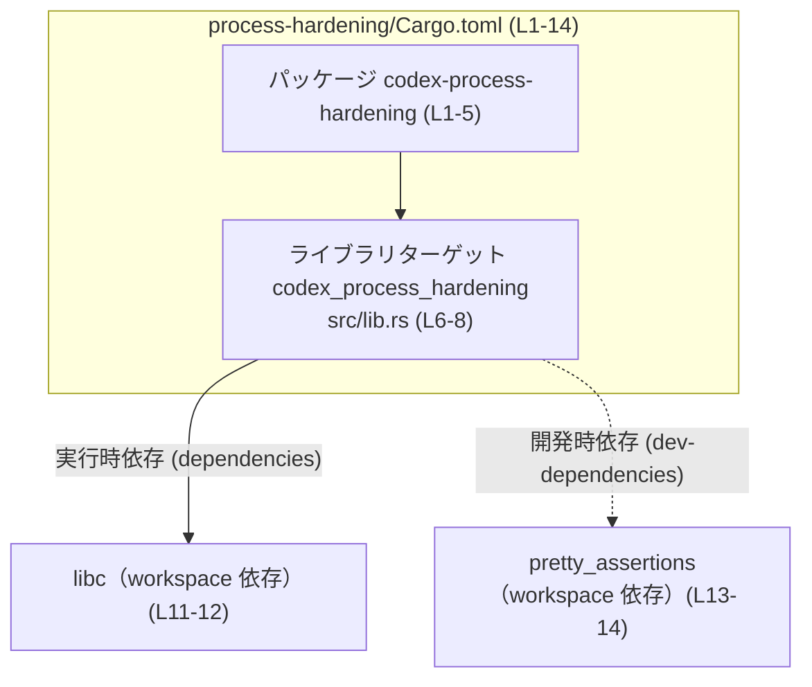
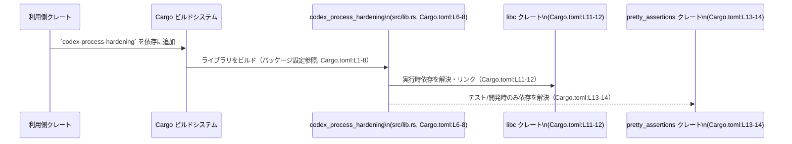

# process-hardening/Cargo.toml コード解説

## 0. ざっくり一言

このファイルは、Rust ライブラリクレート `codex-process-hardening` の Cargo マニフェストであり、クレート名・ライブラリターゲット・ワークスペース設定・依存クレート（`libc` と `pretty_assertions`）を定義しています（Cargo.toml:L1-14）。

---

## 1. このモジュールの役割

### 1.1 概要

- このファイルは、Rust のビルドツール Cargo が参照するパッケージ定義ファイルです。
- パッケージ名 `codex-process-hardening` と、ライブラリターゲット `codex_process_hardening` を定義しています（Cargo.toml:L1-8）。
- バージョン・edition・ライセンス・lints をワークスペース共通設定に委ねています（Cargo.toml:L3-5, L9-10）。
- 実行時依存として `libc`、開発時（テスト用）依存として `pretty_assertions` を宣言しています（Cargo.toml:L11-14）。

このファイルからは、実際の関数や構造体といった API の中身は読み取れません。ソースコード本体は `src/lib.rs` に存在します（Cargo.toml:L7-8）。

### 1.2 アーキテクチャ内での位置づけ

この `Cargo.toml` から読み取れるアーキテクチャ上の関係は次のとおりです。

- パッケージ `codex-process-hardening` は、ワークスペースの一部です（`version.workspace = true` など、Cargo.toml:L3-5, L9-10）。
- ライブラリターゲット `codex_process_hardening` が `src/lib.rs` として定義されています（Cargo.toml:L6-8）。
- 実行時依存（通常ビルド・実行で利用）として `libc` を利用します（Cargo.toml:L11-12）。
- 開発時依存（テストなど）として `pretty_assertions` を利用します（Cargo.toml:L13-14）。

依存関係の概略図は次のとおりです。



`libc` や `pretty_assertions` のどの API が使われるか、またプロセスのハードニングを具体的にどう行うかは、このチャンクには現れず不明です。

### 1.3 設計上のポイント

コードから読み取れる設計上の特徴は次のとおりです。

- **ワークスペース集中管理**  
  - バージョン・edition・ライセンス・lints をワークスペースに委譲しています（Cargo.toml:L3-5, L9-10）。  
    これにより、複数クレート間で設定を一元管理する構成になっています。
- **ライブラリ専用クレート**  
  - `[lib]` セクションのみがあり、`[bin]` や `[[bin]]` はありません（Cargo.toml:L6-8）。  
    したがって、このクレートはライブラリとして他クレートから利用される位置づけです。
- **低レベル依存 (`libc`) の利用**  
  - 実行時依存として `libc` が指定されています（Cargo.toml:L11-12）。  
    一般に `libc` は C 標準ライブラリや OS の低レベル機能へアクセスするためのクレートです。  
    ただし、このファイルだけからは具体的にどの機能を使うかは分かりません。
- **テスト用の表現強化 (`pretty_assertions`)**  
  - `pretty_assertions` を dev-dependency として利用しています（Cargo.toml:L13-14）。  
    これは通常、テスト失敗時の diff 表示を見やすくするために利用されます。

---

## 2. 主要な機能一覧

このファイルはあくまでビルド設定であり、ライブラリの「関数レベルの機能」は定義していません。そのため、ここでは Cargo レベルの機能を列挙します。

- パッケージ定義: パッケージ名 `codex-process-hardening` とワークスペース連携設定を定義する（Cargo.toml:L1-5）。
- ライブラリターゲット定義: ライブラリ名 `codex_process_hardening` とそのエントリポイント `src/lib.rs` を指定する（Cargo.toml:L6-8）。
- ワークスペース共通 lints の適用: `[lints]` セクションでワークスペース設定を有効化する（Cargo.toml:L9-10）。
- 実行時依存の宣言: `libc` を実行時依存として追加する（Cargo.toml:L11-12）。
- 開発時依存の宣言: `pretty_assertions` を開発時依存として追加する（Cargo.toml:L13-14）。

### 2.1 コンポーネントインベントリー（このファイルから分かる範囲）

このチャンクから分かるコンポーネントを一覧にします。

| 種別 | 名前 | 定義/場所 | 説明 | 根拠 |
|------|------|-----------|------|------|
| パッケージ | `codex-process-hardening` | この `Cargo.toml` | クレート全体を表す Cargo パッケージ名 | Cargo.toml:L1-2 |
| ライブラリターゲット | `codex_process_hardening` | `src/lib.rs` | Rust ライブラリとしてビルドされるターゲット名。実コードは `src/lib.rs` に配置 | Cargo.toml:L6-8 |
| ワークスペース設定 | `version.workspace` | ワークスペースルート `Cargo.toml` | バージョン番号をワークスペース共通設定から取得 | Cargo.toml:L3 |
| ワークスペース設定 | `edition.workspace` | ワークスペースルート `Cargo.toml` | Rust edition をワークスペース共通設定から取得 | Cargo.toml:L4 |
| ワークスペース設定 | `license.workspace` | ワークスペースルート `Cargo.toml` | ライセンス情報をワークスペース共通設定から取得 | Cargo.toml:L5 |
| ワークスペース設定 | `[lints] workspace = true` | ワークスペースルート `Cargo.toml` | lints 設定をワークスペース共通設定から適用 | Cargo.toml:L9-10 |
| 実行時依存クレート | `libc` | 外部クレート（workspace 依存） | C 標準ライブラリ/OS 機能へのアクセス用クレート | Cargo.toml:L11-12 |
| 開発時依存クレート | `pretty_assertions` | 外部クレート（workspace 依存） | テストのアサーション表示を強化するクレート | Cargo.toml:L13-14 |

このファイルには関数や構造体の定義は含まれていません。そのため、API レベルのコンポーネントインベントリーは `src/lib.rs` 以降を参照しないと把握できません。

---

## 3. 公開 API と詳細解説

この `Cargo.toml` には関数・構造体・列挙体などの Rust コードは含まれておらず、公開 API の具体的な内容は不明です。

### 3.1 型一覧（構造体・列挙体など）

- このチャンクには型定義は現れません。  
  型は `src/lib.rs` およびそこから参照されるモジュールに定義されていると考えられますが、実際の内容はこのファイルからは分かりません（Cargo.toml:L7-8）。

### 3.2 関数詳細（最大 7 件）

- 関数定義がこのファイルには存在しないため、このセクションで詳細に説明できる関数はありません。

### 3.3 その他の関数

- 同様に、このチャンクには関数が現れません。

---

## 4. データフロー

### 4.1 ビルド時の依存関係フロー

実行時のデータフローはこのファイルからは読み取れませんが、ビルド時の依存関係の流れは次のように整理できます。



- `libc` と `pretty_assertions` のどの関数が呼ばれるか、どのような引数が渡されるかといった実際のデータフローは、このチャンクからは分かりません。
- ただし、`libc` を用いる場合はしばしば `unsafe` コードや FFI（Foreign Function Interface）が絡み、安全性やエラーハンドリング・並行性に注意が必要になることが多い、という一般的な性質があります。  
  本クレートがそれに該当するかどうかは `src/lib.rs` の内容を見ないと判断できません。

---

## 5. 使い方（How to Use）

### 5.1 基本的な使用方法（他クレートからの利用）

他のクレートからこのライブラリを利用する一般的な流れは次のとおりです。

1. 利用側クレートの `Cargo.toml` に依存を追加する。
2. Rust コードから `codex_process_hardening` クレートを `use` する。
3. 公開 API（関数・構造体など）を呼び出す。

依存の追加例（同一ワークスペース内のローカル依存の例。パスはあくまで一例であり、このチャンクからは正確な相対パスは分かりません）:

```toml
# 利用側クレートの Cargo.toml の例
[dependencies]
codex-process-hardening = { path = "../process-hardening" }  # パスはワークスペース構成に応じて調整
```

Rust コード側の利用イメージ（公開シンボル名は不明なのでワイルドカード例）:

```rust
// 利用側クレートの lib.rs または main.rs の例

// ライブラリクレートをインポート
use codex_process_hardening::*; // 具体的な関数・型名は src/lib.rs がないためこのチャンクからは不明

fn main() {
    // ここで codex_process_hardening の公開 API を呼び出す
    // 例: let result = some_api(...);
    // ※ 実際の関数名・引数は不明
}
```

### 5.2 よくある使用パターン（推測を含むが API は不明）

クレート名から、プロセスの「ハードニング」（権限制限・サンドボックス化など）に関する機能を提供する可能性がありますが、これはクレート名からの推測であり、このチャンクのコードだけでは断定できません。

そのため、具体的なパターン（例: `harden_current_process()` のような関数呼び出し）は、このレポートでは提示できません。

### 5.3 よくある間違い（Cargo.toml 観点）

Cargo マニフェストの観点で起こり得る誤り例と、正しい設定例を示します。

```toml
# 誤り例: クレート名を間違えて依存を指定している
[dependencies]
codex_process_hardning = "0.1"  # スペルミス（`hardening` の `e` が抜けている）

# 正しい例: パッケージ名通りに依存を指定する
[dependencies]
codex-process-hardening = "0.1" # 実際のバージョンはワークスペース設定に依存（Cargo.toml:L3）
```

```toml
# 誤り例: 手動で edition や license を重複設定してしまう
[package]
name = "codex-process-hardening"
edition = "2021"         # ワークスペース管理を上書きしてしまう可能性
license = "MIT"          # 同様に手動設定で一貫性を失う恐れ

# 正しい例: ワークスペース管理に委譲する（このファイルの形）
[package]
name = "codex-process-hardening"
version.workspace = true
edition.workspace = true
license.workspace = true
```

### 5.4 使用上の注意点（まとめ）

- このファイルはビルド設定のみを扱い、実行時のロジック・エラー処理・並行性制御は `src/lib.rs` 以降に存在します。  
  したがって、安全性やエラーハンドリングの設計を評価するにはコード本体の確認が必要です。
- `libc` に依存しているため、ライブラリ内部で `unsafe` な FFI 呼び出しが行われている可能性があります（Cargo.toml:L11-12）。  
  これは一般論であり、本クレートが実際にどのようなコードを書いているかはこのチャンクからは分かりません。
- ワークスペースに設定を委譲しているため、edition・lints などの変更はワークスペースルート `Cargo.toml` 側で行うのが前提になっています（Cargo.toml:L3-5, L9-10）。

---

## 6. 変更の仕方（How to Modify）

### 6.1 新しい機能を追加する場合

新しい Rust の機能（関数・構造体など）を追加する際、この `Cargo.toml` に関して必要になる作業は次のようになります。

1. **コード本体の追加先**  
   - 実際の機能は `src/lib.rs` またはその配下のモジュールに追加します（Cargo.toml:L7-8）。
   - このファイル自体には Rust コードは書きません。

2. **新たな依存クレートが必要な場合**  
   - 新機能で別のクレートが必要になった場合、`[dependencies]` または `[dev-dependencies]` に追記します（Cargo.toml:L11-14 を参考）。
   - 例: テスト専用であれば `[dev-dependencies]` に追加する。

3. **ワークスペース設定との整合性**  
   - バージョン・edition・ライセンス・lints はワークスペースで管理されているため、通常はこのファイル側を変更する必要はありません（Cargo.toml:L3-5, L9-10）。

### 6.2 既存の機能を変更する場合（Manifest 観点）

Cargo マニフェストを変更する際の注意点は次のとおりです。

- **クレート名の変更**  
  - `[package] name` や `[lib] name` を変更すると、他クレートからの依存指定や `use` パスが変わります（Cargo.toml:L1-2, L6-7）。
  - 影響範囲として、ワークスペース内の他クレートの `Cargo.toml` や Rust コードでのインポート箇所を再確認する必要があります。
- **依存クレートの追加・削除**  
  - `libc` や `pretty_assertions` のバージョン・有無を変えると、ビルドやテスト結果が変わる可能性があります（Cargo.toml:L11-14）。
  - 特に低レベル依存（`libc`）を削除・変更する場合、内部コード側での FFI 呼び出しの有無・代替手段を確認する必要があります。
- **ワークスペース設定の解除**  
  - `version.workspace` などを削除して個別に設定することも可能ですが、その場合はワークスペース全体の一貫性が崩れる可能性があります（Cargo.toml:L3-5, L9-10）。

---

## 7. 関連ファイル

この `Cargo.toml` と密接に関係するファイル・ディレクトリは次のとおりです。

| パス / 場所 | 役割 / 関係 | 根拠 |
|-------------|------------|------|
| `src/lib.rs` | ライブラリターゲット `codex_process_hardening` の実装が置かれるエントリポイント。公開 API やコアロジックはここに存在する | Cargo.toml:L6-8 |
| ワークスペースルートの `Cargo.toml` | `version.workspace` / `edition.workspace` / `license.workspace` / `[lints] workspace = true` の設定元。バージョン・edition・ライセンス・lints などを集中管理 | Cargo.toml:L3-5, L9-10 |
| （不明）テストコードファイル | `pretty_assertions` が dev-dependency として使われるテストコード。通常は `tests/` ディレクトリや `src/lib.rs` 内の `#[cfg(test)]` モジュールに存在するが、このチャンクには現れません | Cargo.toml:L13-14 |

---

### 安全性・エラー・並行性に関する補足（このファイルから分かる範囲）

- この `Cargo.toml` 自体は設定ファイルであり、実行時の安全性やエラーハンドリング、並行性制御に直接関わるコードは含みません。
- ただし、`libc` への依存（Cargo.toml:L11-12）は、クレート内部で OS レベルの機能や C API を利用している可能性を示唆します。  
  その場合、一般的には次の点に注意が必要です（あくまで一般論であり、このクレート固有の挙動は不明です）。
  - `unsafe` ブロックを用いたポインタ操作や FFI の正当性
  - OS 呼び出しの失敗時のエラーハンドリング（戻り値のチェック、`errno` の扱いなど）
  - プロセスやスレッドに対するハードニング設定が並行性に与える影響（例: 権限制限によるスレッド生成制限など）

これらの点を具体的に確認するには、`src/lib.rs` 以下の実装コードを参照する必要があります。このチャンクのみからは詳細は分かりません。
