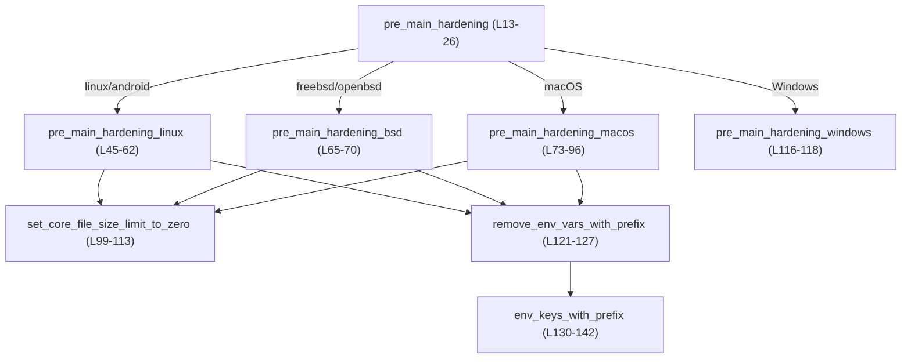
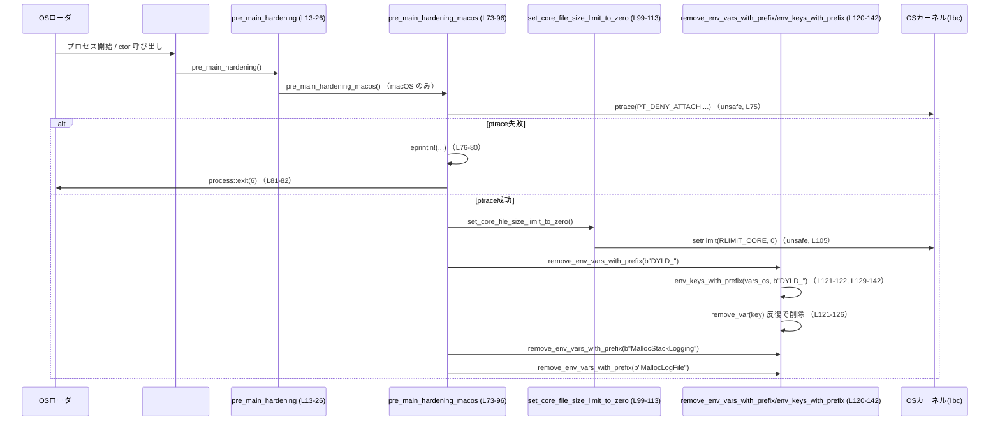

# process-hardening/src/lib.rs コード解説

## 0. ざっくり一言

プロセス起動直後（pre-main）に実行されることを想定した、「コアダンプ無効化」「デバッガのアタッチ禁止」「危険な環境変数の削除」などのプロセスハードニング処理をまとめたモジュールです（`pre_main_hardening` が公開 API）  
（根拠: process-hardening/src/lib.rs:L7-13, L45-62, L65-70, L73-96, L121-142）

---

## 1. このモジュールの役割

### 1.1 概要

- このモジュールは、**プロセスが起動してすぐの段階で安全性を高める（ハードニングする）** ために存在し、以下の機能を提供します。
  - コアダンプ（`core` ファイル）の生成を無効化（Unix 系 OS）  
    （根拠: L56-57, L66-67, L84-85, L99-113）
  - Linux/macOS でのデバッガ（`ptrace` / `PT_DENY_ATTACH`）によるアタッチを禁止  
    （根拠: L45-48, L72-82）
  - `LD_*` / `DYLD_*` / `MallocStackLogging*` など、ライブラリ読み込みやメモリアロケータ診断に影響する環境変数を削除  
    （根拠: L59-61, L87-95, L121-142）

- これらの処理は、単一の公開関数 `pre_main_hardening()` を呼び出すだけで、**ターゲット OS に応じた適切な処理** が実行されるように設計されています（根拠: L13-25）。

### 1.2 アーキテクチャ内での位置づけ

このファイルはクレートの中核となる `lib.rs` で、OS ごとのハードニング関数と共通ヘルパー関数から構成されます。

- エントリポイント: `pre_main_hardening()`（唯一の `pub` 関数）  
  → OS に応じて `pre_main_hardening_linux` / `_macos` / `_bsd` / `_windows` を呼び分け  
  （根拠: L13-25, L45-62, L65-70, L72-96, L115-118）
- 共通ヘルパー:
  - `set_core_file_size_limit_to_zero()` … RLIMIT_CORE を 0 に設定  
    （根拠: L98-113）
  - `remove_env_vars_with_prefix()` → `env_keys_with_prefix()` … 指定プレフィックスの環境変数キーを抽出し削除  
    （根拠: L120-142）

Mermaid による依存関係図（このチャンクのみの範囲）:



### 1.3 設計上のポイント

- **OS ごとの機能切り分けをコンパイル時に行う**  
  - `#[cfg(...)]` によって、対象 OS に必要なコードだけをビルドする構成です（根拠: L13-25, L28-42, L44-45, L64-65, L72-73, L98, L115, L120, L129, L144）。  
- **エラーは即時プロセス終了で扱う**  
  - `libc::prctl` / `libc::ptrace` / `libc::setrlimit` の失敗時に `std::process::exit` で固有の終了コードを返して強制終了します（根拠: L28-42, L47-54, L75-82, L99-113）。
- **環境変数名をバイト列として扱い、非 UTF-8 対応**  
  - `OsStrExt::as_bytes()` とバイト列プレフィックス `&[u8]` を用いて `LD_` 等を判定し、非 UTF-8 な環境変数名も扱えるようにしています（根拠: L1-5, L87-89, L120-142, L152-188）。
- **環境変数削除の前にキー一覧を収集**  
  - `env_keys_with_prefix(std::env::vars_os(), prefix)` でまずキーを `Vec<OsString>` に収集し、その後で `remove_var` を実行することで、走査中に環境を書き換えない構造になっています（根拠: L121-127, L130-142）。
- **FFI と unsafe の利用**  
  - `libc::prctl` / `libc::ptrace` / `libc::setrlimit` 呼び出しのために `unsafe` ブロックを利用しています（根拠: L47, L75, L105）。  
  - `std::env::remove_var` 呼び出しも `unsafe` ブロック内に置かれていますが、この関数自体は unsafe ではなく、ここでの `unsafe` は意味上は不要です（根拠: L121-126）。

---

## 2. 主要な機能一覧（コンポーネントインベントリー）

### 2.1 機能一覧（概要）

- `pre_main_hardening`: OS に応じてプロセスハードニング処理をまとめて実行する公開 API。
- `pre_main_hardening_linux`: Linux/Android 用に、ptrace 無効化・コアダンプ無効化・`LD_*` 環境変数削除を行う。
- `pre_main_hardening_bsd`: FreeBSD/OpenBSD 用に、コアダンプ無効化・`LD_*` 環境変数削除を行う。
- `pre_main_hardening_macos`: macOS 用に、デバッガアタッチ禁止・コアダンプ無効化・`DYLD_*`/`Malloc*` 環境変数削除を行う。
- `pre_main_hardening_windows`: Windows 用（現在は TODO の空実装）。
- `set_core_file_size_limit_to_zero`: Unix で `RLIMIT_CORE` を 0 に設定する。
- `remove_env_vars_with_prefix`: 指定バイトプレフィックスで始まる環境変数を削除する。
- `env_keys_with_prefix`: 指定プレフィックスで始まる環境変数「キー」だけを抽出する。
- テスト関数: `env_keys_with_prefix` の非 UTF-8 対応とフィルタリング挙動を検証する。

### 2.2 関数インベントリー

| 名前 | 種別 | 可視性 | cfg 条件 | 役割 / 用途 | 定義位置 |
|------|------|--------|----------|-------------|----------|
| `pre_main_hardening()` | 関数 | `pub` | なし（常に） | OS ごとのハードニング処理を呼び分けるエントリポイント | `process-hardening/src/lib.rs:L13-26` |
| `pre_main_hardening_linux()` | 関数 | `pub(crate)` | `linux` / `android` | `prctl` による dump 禁止、`RLIMIT_CORE`=0 設定、`LD_*` 削除 | `L44-62` |
| `pre_main_hardening_bsd()` | 関数 | `pub(crate)` | `freebsd` / `openbsd` | `RLIMIT_CORE`=0 設定 と `LD_*` 削除 | `L64-70` |
| `pre_main_hardening_macos()` | 関数 | `pub(crate)` | `macos` | `ptrace(PT_DENY_ATTACH)`、`RLIMIT_CORE`=0 設定、`DYLD_*` / `Malloc*` 削除 | `L72-96` |
| `pre_main_hardening_windows()` | 関数 | `pub(crate)` | `windows` | Windows 向けハードニング（現在は TODO） | `L115-118` |
| `set_core_file_size_limit_to_zero()` | 関数 | `fn` | `unix` | `setrlimit(RLIMIT_CORE)` でコアダンプ無効化 | `L98-113` |
| `remove_env_vars_with_prefix()` | 関数 | `fn` | `unix` | 指定プレフィックスに一致する環境変数を削除 | `L120-127` |
| `env_keys_with_prefix()` | 関数 | `fn` | `unix` | 環境変数イテレータから、指定プレフィックスで始まるキーだけを収集 | `L129-142` |
| `env_keys_with_prefix_handles_non_utf8_entries()` | テスト | `#[test]` | `all(test, unix)` | 非 UTF-8 な環境変数名でも `LD_` プレフィックス判定が機能することを検証 | `L152-174` |
| `env_keys_with_prefix_filters_only_matching_keys()` | テスト | `#[test]` | `all(test, unix)` | `LD_` で始まるキーだけが抽出されることを検証 | `L176-188` |

### 2.3 定数インベントリー

| 名前 | 型 | cfg 条件 | 役割 | 定義位置 |
|------|----|----------|------|----------|
| `PRCTL_FAILED_EXIT_CODE` | `i32` | `linux` / `android` | `prctl(PR_SET_DUMPABLE, 0)` 失敗時のプロセス終了コード | `L28-29` |
| `PTRACE_DENY_ATTACH_FAILED_EXIT_CODE` | `i32` | `macos` | `ptrace(PT_DENY_ATTACH)` 失敗時の終了コード | `L31-32` |
| `SET_RLIMIT_CORE_FAILED_EXIT_CODE` | `i32` | `linux` / `android` / `macos` / `freebsd` / `netbsd` / `openbsd` | `setrlimit(RLIMIT_CORE, ...)` 失敗時の終了コード | `L34-42` |

---

## 3. 公開 API と詳細解説

### 3.1 型一覧（構造体・列挙体など）

このファイル内では、新しい構造体・列挙体・型エイリアスは定義されていません。標準ライブラリ `OsString` / `OsStr` などの型を利用しています（根拠: L1-5, L129-133, L148-150）。

### 3.2 関数詳細（主要 7 件）

#### `pub fn pre_main_hardening()`

**概要**

- プロセス起動直後に呼び出すことを想定したハードニング関数です。  
- コンパイルターゲット OS に応じて、対応する内部関数（Linux/macOS/BSD/Windows）を呼び出します（根拠: L13-25）。

**引数**

- なし。

**戻り値**

- なし（`()`）。  
- ただし内部で致命的エラーが発生した場合は `std::process::exit(...)` によりプロセス自体が終了する可能性があります（根拠: L45-54, L72-82, L99-113）。

**内部処理の流れ**

1. コンパイルターゲットが `linux` / `android` の場合のみ、`pre_main_hardening_linux()` を呼び出し（根拠: L14-15）。
2. ターゲットが `macos` の場合のみ、`pre_main_hardening_macos()` を呼び出し（根拠: L17-18）。
3. ターゲットが `freebsd` / `openbsd` の場合のみ、`pre_main_hardening_bsd()` を呼び出し（根拠: L20-22）。
4. ターゲットが `windows` の場合のみ、`pre_main_hardening_windows()` を呼び出し（根拠: L24-25）。

**Examples（使用例）**

pre-main で実行する典型例（コメント通り `#[ctor::ctor]` を用いた想定）:

```rust
// Cargo.toml 側でこのクレートを依存に追加した上での使用例です。
// use process_hardening::pre_main_hardening;

#[ctor::ctor]                       // プロセス開始直後（main 前）に実行される
fn harden_process() {               // pre-main ハードニング関数
    process_hardening::pre_main_hardening(); // OS に応じたハードニングを実行
}

fn main() {
    // ここに到達する前に pre_main_hardening が実行済みとなる想定。
    // アプリケーションの本処理を書く。
}
```

または、単純に `main` の最初で呼ぶ形:

```rust
fn main() {
    process_hardening::pre_main_hardening(); // まずプロセスをハードニング
    // 続いてアプリケーション本体の処理を行う。
}
```

**Errors / Panics**

- `pre_main_hardening` 自身はパニックや `Result` を返しませんが、内部で次のような挙動があります。
  - Linux/Android で `prctl(PR_SET_DUMPABLE, 0)` が失敗した場合、終了コード `5` でプロセスが終了（根拠: L28-29, L47-54）。
  - macOS で `ptrace(PT_DENY_ATTACH)` が失敗した場合、終了コード `6` でプロセスが終了（根拠: L31-32, L75-82）。
  - Unix 各種で `setrlimit(RLIMIT_CORE)` が失敗した場合、終了コード `7` でプロセスが終了（根拠: L34-42, L99-113）。

**Edge cases（エッジケース）**

- NetBSD ターゲットの場合  
  - `SET_RLIMIT_CORE_FAILED_EXIT_CODE` は定義されていますが、`pre_main_hardening` からはいずれの OS 固有関数も呼ばれず、実質的に何もしません（根拠: L34-42, L13-25）。  
- Windows ターゲットの場合  
  - `pre_main_hardening_windows()` が呼ばれますが中身は TODO であり、現状では実質 no-op です（根拠: L24-25, L115-118）。

**使用上の注意点**

- 並行性の観点からは、**スレッド生成前（pre-main）に呼ぶ** ことが想定されています。環境変数の削除や RLIMIT の変更はプロセス全体に影響するためです。
- 本関数の呼び出しによって、環境変数（特に `LD_*`, `DYLD_*`, `Malloc*` 系）が消去されるため、これらに依存するデバッグや挙動変更は使えなくなります。

---

#### `pub(crate) fn pre_main_hardening_linux()`

**概要**

- Linux / Android 向けのハードニング処理です。  
- `prctl(PR_SET_DUMPABLE, 0)` によるコアダンプ抑制、および `RLIMIT_CORE` を 0 に設定し、`LD_*` 環境変数を削除します（根拠: L44-62）。

**引数**

- なし。

**戻り値**

- なし（`()`）。失敗時はプロセスを終了します。

**内部処理の流れ**

1. `libc::prctl(libc::PR_SET_DUMPABLE, 0, 0, 0, 0)` を `unsafe` ブロック内で呼び出し、戻り値を `ret_code` に格納（根拠: L46-47）。
2. `ret_code != 0` の場合、`eprintln!` でエラーメッセージを出力し、`std::process::exit(PRCTL_FAILED_EXIT_CODE)` で終了コード 5 で終了（根拠: L48-54）。
3. `set_core_file_size_limit_to_zero()` を呼び、`RLIMIT_CORE` を 0 に設定（根拠: L56-57, L99-113）。
4. `remove_env_vars_with_prefix(b"LD_")` を呼んで `LD_` から始まる環境変数を削除（根拠: L59-61, L120-142）。

**Examples（使用例）**

クレート内からのみ呼べる関数ですが、想定される利用イメージ:

```rust
#[cfg(any(target_os = "linux", target_os = "android"))]
fn init() {
    // Linux/Android 専用ハードニング
    pre_main_hardening_linux();  // コアダンプ禁止 + LD_* 環境変数削除
}
```

**Errors / Panics**

- `prctl` が 0 以外を返した場合、終了コード 5 でプロセス終了（根拠: L28-29, L47-54）。
- `setrlimit(RLIMIT_CORE)` が失敗した場合、終了コード 7 でプロセス終了（根拠: L34-42, L99-113）。

**Edge cases**

- `LD_PRELOAD` などの `LD_` 変数を利用している場合はすべて削除されるため、意図しないライブラリ差し替えなどは防止されますが、デバッグ目的の使用も抑止されます（根拠: L59-61, L120-142）。

**使用上の注意点**

- FFI (`libc::prctl`) の呼び出しは `unsafe` であり、システムコールの仕様に依存します（根拠: L47）。
- 環境変数操作はプロセス全体に影響するため、アプリケーション全体の設計として、起動直後に呼ぶ前提で利用する必要があります。

---

#### `pub(crate) fn pre_main_hardening_bsd()`

**概要**

- FreeBSD / OpenBSD 向けのハードニング処理です（根拠: L64-70）。
- `RLIMIT_CORE` を 0 に設定し、`LD_*` 環境変数を削除します。

**引数 / 戻り値**

- 引数なし、戻り値なし。

**内部処理の流れ**

1. `set_core_file_size_limit_to_zero()` を呼び、コアダンプを無効化（根拠: L66-67, L99-113）。
2. `remove_env_vars_with_prefix(b"LD_")` で `LD_` 環境変数を削除（根拠: L69, L120-142）。

**Examples（使用例）**

```rust
#[cfg(any(target_os = "freebsd", target_os = "openbsd"))]
fn init() {
    pre_main_hardening_bsd();
}
```

**Errors / Panics**

- `setrlimit` 失敗時は終了コード 7 でプロセス終了（根拠: L34-42, L99-113）。

**Edge cases**

- Linux と異なり、ptrace 相当のアタッチ禁止などは行っていません（このチャンクにはそうした呼び出しはありません; 根拠: L64-70 全体）。

**使用上の注意点**

- Linux 同様、環境変数 `LD_*` への依存は破棄されます。

---

#### `pub(crate) fn pre_main_hardening_macos()`

**概要**

- macOS 向けのハードニング処理です（根拠: L72-96）。
- `ptrace(PT_DENY_ATTACH)` によるデバッガアタッチ禁止、`RLIMIT_CORE` を 0 に設定、`DYLD_*` および malloc 関連環境変数（`MallocStackLogging*` / `MallocLogFile*`）を削除します。

**内部処理の流れ**

1. `libc::ptrace(libc::PT_DENY_ATTACH, 0, std::ptr::null_mut(), 0)` を `unsafe` ブロックで実行し、戻り値を `ret_code` に格納（根拠: L74-75）。
2. `ret_code == -1` の場合、エラーメッセージを `eprintln!` で出力し、`std::process::exit(PTRACE_DENY_ATTACH_FAILED_EXIT_CODE)` で終了コード 6 で終了（根拠: L76-82）。
3. `set_core_file_size_limit_to_zero()` を呼び、`RLIMIT_CORE` を 0 に設定（根拠: L84-85, L99-113）。
4. `remove_env_vars_with_prefix(b"DYLD_")` で `DYLD_*` 環境変数を削除（根拠: L87-89, L120-142）。
5. `remove_env_vars_with_prefix(b"MallocStackLogging")` と `remove_env_vars_with_prefix(b"MallocLogFile")` で malloc 関連の環境変数を削除（根拠: L91-95, L120-142）。

**Examples（使用例）**

```rust
#[cfg(target_os = "macos")]
fn init() {
    pre_main_hardening_macos();  // macOS 専用のデバッガ対策 + 環境変数削除
}
```

**Errors / Panics**

- `ptrace(PT_DENY_ATTACH)` が -1 を返した場合、終了コード 6 でプロセス終了（根拠: L31-32, L75-82）。
- `setrlimit` 失敗時に終了コード 7 でプロセス終了（根拠: L34-42, L99-113）。

**Edge cases**

- `DYLD_*` や `Malloc*` によるデバッグ・トレース設定が一切使えなくなるため、デバッグビルドや開発用途での利用時は注意が必要です（根拠: L87-95）。
- これらの環境変数名もバイト列プレフィックス判定で処理されるため、非 UTF-8 のキーはほぼ現実的には想定されませんが、コード上は対応可能です（根拠: L120-142）。

**使用上の注意点**

- `PT_DENY_ATTACH` を設定すると、以後デバッガをアタッチできなくなるため、開発時にこのハードニングを有効にするかどうかはビルド設定で切り替える必要があります。

---

#### `#[cfg(unix)] fn set_core_file_size_limit_to_zero()`

**概要**

- Unix 系 OS で、プロセスの `RLIMIT_CORE`（コアファイルサイズ制限）を現在値・上限値ともに 0 に設定し、コアダンプ生成を抑止します（根拠: L98-113）。

**引数 / 戻り値**

- 引数なし、戻り値なし。

**内部処理の流れ**

1. `libc::rlimit { rlim_cur: 0, rlim_max: 0 }` を作成（根拠: L100-103）。
2. `unsafe { libc::setrlimit(libc::RLIMIT_CORE, &rlim) }` を呼び出し、戻り値を `ret_code` に格納（根拠: L105）。
3. `ret_code != 0` の場合、エラーを標準エラーに出力し、`std::process::exit(SET_RLIMIT_CORE_FAILED_EXIT_CODE)` で終了コード 7 で終了（根拠: L106-112）。

**Examples（使用例）**

```rust
#[cfg(unix)]
fn disable_core_dump() {
    set_core_file_size_limit_to_zero();  // 以後 core ファイルが出力されなくなる
}
```

**Errors / Panics**

- `setrlimit` が失敗した場合、終了コード 7 でプロセス終了（根拠: L34-42, L105-112）。

**Edge cases**

- 実行ユーザに `RLIMIT_CORE` を 0 に設定する権限がない場合など、OS 側の制約で失敗する可能性があります。その場合も即座にプロセス終了します。

**使用上の注意点**

- プロセス全体のコアダンプが完全に抑止されるため、障害解析に core が必要な運用とは相性が良くありません。

---

#### `#[cfg(unix)] fn remove_env_vars_with_prefix(prefix: &[u8])`

**概要**

- 現在のプロセス環境変数から、**バイト列のプレフィックス `prefix` で始まるキー** を持つものを全て削除します（根拠: L120-127, L130-142）。

**引数**

| 引数名 | 型 | 説明 |
|--------|----|------|
| `prefix` | `&[u8]` | 環境変数キーの先頭バイトと比較するプレフィックス（例: `b"LD_"`） |

**戻り値**

- なし（`()`）。

**内部処理の流れ**

1. `env_keys_with_prefix(std::env::vars_os(), prefix)` を呼び出して、`prefix` で始まるキーを `Vec<OsString>` として取得（根拠: L121-122, L129-142）。
2. 取得したキーごとに `std::env::remove_var(key)` を呼び、環境変数を削除（根拠: L121-126）。

**Examples（使用例）**

```rust
#[cfg(unix)]
fn clear_ld_envs() {
    // "LD_" で始まる環境変数 (LD_PRELOAD など) をすべて削除する
    remove_env_vars_with_prefix(b"LD_");
}
```

**Errors / Panics**

- `std::env::remove_var` 自体は safe 関数であり、このコードからはパニック条件は読み取れません（キーは OS から渡される `OsString` であり、通常は環境変数名に禁止文字を含まないため; 根拠: L130-142, L121-126）。

**Edge cases**

- **非 UTF-8 の環境変数名**  
  - `env_keys_with_prefix` が `OsStrExt::as_bytes()` を使うため、UTF-8 でないキーもバイト列として安全に処理できます。テストでこのケースが確認されています（根拠: L130-142, L152-174）。
- 環境変数が同名で複数存在することは通常ありませんが、もしあればすべて削除されます（1回の `remove_var` がどう振る舞うかは標準ライブラリ仕様に依存）。

**使用上の注意点**

- `unsafe` ブロックでラップされていますが、中で呼んでいる `std::env::remove_var` 自体は unsafe ではありません（根拠: L121-126）。  
  つまり、この `unsafe` は機能的な必然性は無く、コード上の意味としては不要なものです。
- 環境変数操作はプロセス全体に影響するため、ほかのライブラリやアプリケーションが期待する環境変数も削除される可能性があります。

---

#### `#[cfg(unix)] fn env_keys_with_prefix<I>(vars: I, prefix: &[u8]) -> Vec<OsString>`

**概要**

- 任意の「環境変数風」イテレータ `vars` から、キーが `prefix` で始まるエントリだけを抽出し、そのキーを `Vec<OsString>` として返すヘルパー関数です（根拠: L129-142）。
- テストでは実際の環境ではなくベクタからの擬似環境を与えて挙動を検証しています（根拠: L152-188）。

**引数**

| 引数名 | 型 | 説明 |
|--------|----|------|
| `vars` | `I` where `I: IntoIterator<Item = (OsString, OsString)>` | `(キー, 値)` のタプルを要素とするイテレータ。通常は `std::env::vars_os()`。 |
| `prefix` | `&[u8]` | キーの先頭バイト列と比較するプレフィックス。 |

**戻り値**

- `Vec<OsString>`: `prefix` で始まるすべてのキーを収集したベクタ。

**内部処理の流れ**

1. `vars.into_iter()` でイテレータを取得（根拠: L134）。
2. `.filter_map(|(key, _)| { ... })` で各 `(key, value)` からキーだけを見る（根拠: L134-138）。
3. `key.as_os_str().as_bytes().starts_with(prefix)` が `true` なら `Some(key)`、それ以外は `None` を返す（根拠: L135-139）。
4. すべての `Some(key)` を `.collect()` して `Vec<OsString>` にまとめる（根拠: L134-141）。

**Examples（使用例）**

テストコードに近い使用例:

```rust
#[cfg(unix)]
fn list_ld_keys() {
    use std::ffi::OsString;

    // 擬似環境変数
    let vars = vec![
        (OsString::from("PATH"), OsString::from("/usr/bin")),
        (OsString::from("LD_PRELOAD"), OsString::from("libfoo.so")),
    ];

    // "LD_" で始まるキーを抽出
    let keys = env_keys_with_prefix(vars, b"LD_");
    // keys には "LD_PRELOAD" のみが含まれる
}
```

**Errors / Panics**

- `env_keys_with_prefix` 自体はパニックやエラーを発生させません。  
  すべての処理は safe Rust で書かれており、`as_bytes()` も UTF-8 非準拠文字列を許容します（根拠: L129-142）。

**Edge cases**

- **非 UTF-8 キー**  
  - テスト `env_keys_with_prefix_handles_non_utf8_entries` で、UTF-8 ではないキー（`"R\xD6DBURK"`, `"LD_\xF0"`）を含むケースを検証しており、`LD_` で始まる非 UTF-8 キーのみが返されることが確認されています（根拠: L152-174）。
- **一致しないキーが含まれる場合**  
  - `env_keys_with_prefix_filters_only_matching_keys` で、`PATH` や `DYLD_FOO` は除外され、`LD_TEST` のみが返ることが検証されています（根拠: L176-188）。

**使用上の注意点**

- あくまで **キーの先頭バイト列** で判定するため、大文字小文字の区別はそのまま行われます（例えば `ld_` は `b"LD_"` とは一致しません）。

---

### 3.3 その他の関数

| 関数名 | 役割（1 行） | 定義位置 |
|--------|--------------|----------|
| `pub(crate) fn pre_main_hardening_windows()` | Windows 用ハードニング処理のプレースホルダ。現在は TODO で実質 no-op。 | `L115-118` |
| `#[test] fn env_keys_with_prefix_handles_non_utf8_entries()` | 非 UTF-8 な環境変数名が正しくフィルタされることのテスト。 | `L152-174` |
| `#[test] fn env_keys_with_prefix_filters_only_matching_keys()` | プレフィックスに一致するキーだけが抽出されることのテスト。 | `L176-188` |

---

## 4. データフロー

### 4.1 代表的なシナリオ: プロセス起動〜ハードニング

典型的には、`#[ctor::ctor]` などを用いてプロセス起動直後に `pre_main_hardening()` が呼ばれ、その中で OS 固有の処理 → 共通ヘルパー → OS カーネル／環境変数に作用する、という流れです。

macOS の場合のシーケンス図（このチャンクの範囲に限定）:



要点:

- エラーが発生した場合は **その場でプロセスが終了** するため、呼び出し側で `Result` を扱う必要はありませんが、回避もできません。
- 環境変数は、まずキーだけが列挙され、その後に削除されるため、列挙と削除のタイミングが分離されています（根拠: L121-127, L129-142）。

---

## 5. 使い方（How to Use）

### 5.1 基本的な使用方法

最も基本的な使い方は、アプリケーション開始直後に `pre_main_hardening()` を呼ぶことです。

```rust
// main.rs などアプリケーション側のコード例
fn main() {
    // 起動直後にプロセスをハードニング
    process_hardening::pre_main_hardening();  // L13-26 の公開 API

    // ここからアプリケーションの本処理
    // ...
}
```

`#[ctor::ctor]` を用いて **pre-main** で確実に実行するパターン:

```rust
// lib.rs または main.rs

#[ctor::ctor]                      // プロセス起動時に自動実行される
fn harden_process() {
    process_hardening::pre_main_hardening(); // pre-main でハードニングを実施
}
```

### 5.2 よくある使用パターン

1. **Unix のみで使用するアプリケーション**

```rust
fn main() {
    #[cfg(unix)]
    {
        // Unix のみハードニング（Windows ターゲットでは呼ばれない）
        process_hardening::pre_main_hardening();
    }

    // OS 共通の処理
}
```

1. **開発ビルドでは無効化、リリースビルドでのみ有効化**

```rust
fn main() {
    #[cfg(all(unix, not(debug_assertions)))]
    {
        // リリースビルドかつ Unix の場合にのみハードニング
        process_hardening::pre_main_hardening();
    }

    // デバッグ時は環境変数やデバッガ利用を阻害しない
}
```

### 5.3 よくある間違い

```rust
// 間違い例: スレッドを起動したあとに呼び出す
fn main() {
    std::thread::spawn(|| {
        // ここで環境変数を読むスレッドがいるかもしれない
    });

    // その後でハードニングを行う
    process_hardening::pre_main_hardening();  // 環境変数削除などが並行処理に影響しうる
}
```

```rust
// 正しい例: すべてのスレッドを起動する前にハードニングを実施
fn main() {
    process_hardening::pre_main_hardening();  // まずプロセス設定と環境変数を確定させる

    // その後にスレッドを起動
    std::thread::spawn(|| {
        // ハードニング済みの環境・制限のもとで動作
    });
}
```

### 5.4 使用上の注意点（まとめ）

- **プロセス全体への影響**
  - `setrlimit(RLIMIT_CORE)` や環境変数削除はプロセス全体に影響するため、ライブラリ単体で導入した場合でもアプリケーションの挙動を大きく変える可能性があります（根拠: L56-57, L66-67, L84-85, L120-142）。
- **エラー時の挙動**
  - FFI 呼び出し失敗時は `Result` ではなく `std::process::exit` によりプロセス終了するため、呼び出し側でリカバリする余地はありません（根拠: L47-54, L75-82, L105-112）。
- **デバッグとのトレードオフ**
  - macOS の `PT_DENY_ATTACH` や `DYLD_*` / `Malloc*` 削除は、デバッグツールの利用を阻害します（根拠: L72-96）。
- **スレッド安全性**
  - コードからは、環境変数削除前にキー一覧を収集することで、列挙中に環境を書き換えないよう配慮していることが読み取れます（根拠: L121-127, L129-142）。  
    ただし環境自体がプロセスグローバルであり、他スレッドからもアクセスされ得るため、起動直後に呼ぶ前提で使うことが安全です。

---

## 6. 変更の仕方（How to Modify）

### 6.1 新しい機能を追加する場合

1. **新しい OS 向けのハードニング処理を追加する**
   - 例: NetBSD 向けに `pre_main_hardening_netbsd` を追加したい場合。
   - 手順例:
     1. `lib.rs` に `#[cfg(target_os = "netbsd")] pub(crate) fn pre_main_hardening_netbsd() { ... }` を追加する（このチャンクには存在しません）。
     2. `pre_main_hardening()` に `#[cfg(target_os = "netbsd")] pre_main_hardening_netbsd();` を追加する（根拠: 現状のパターン L13-25）。
     3. 必要に応じて `set_core_file_size_limit_to_zero()` や `remove_env_vars_with_prefix()` を再利用する。

2. **削除対象の環境変数プレフィックスを増やす**
   - 例: Linux で `LD_` 以外の変数も消したい場合。
   - `pre_main_hardening_linux()` 内で `remove_env_vars_with_prefix(b"XXX_");` を追加すればよい（根拠: L59-61 の既存呼び出しパターン）。

3. **終了コードを変更する**
   - 各 OS 用に定義された定数 (`PRCTL_FAILED_EXIT_CODE`, `PTRACE_DENY_ATTACH_FAILED_EXIT_CODE`, `SET_RLIMIT_CORE_FAILED_EXIT_CODE`) を変更し、それに依存する `process::exit` 呼び出し箇所を確認する（根拠: L28-42, L47-54, L75-82, L105-112）。

### 6.2 既存の機能を変更する場合

- **影響範囲の確認**
  - `pre_main_hardening` からの呼び出し関係を確認する（根拠: L13-25）。
  - 環境変数関連の挙動を変更する場合は、`env_keys_with_prefix` に対するテスト `env_keys_with_prefix_*` の挙動も見直す必要があります（根拠: L152-188）。

- **契約（前提条件・返り値の意味）**
  - 現在の契約は「失敗時はプロセス終了」であり、呼び出し側がエラーを扱わない設計になっています。  
    これを `Result` を返す形に変える場合は、公開 API `pre_main_hardening` のシグネチャ変更や、上位コードのエラーハンドリング設計も合わせて変更する必要があります。

- **テストの更新**
  - 環境変数名のプレフィックス判定や非 UTF-8 対応を変更する場合、テスト `env_keys_with_prefix_handles_non_utf8_entries` / `env_keys_with_prefix_filters_only_matching_keys` を更新または追加する必要があります（根拠: L152-188）。

---

## 7. 関連ファイル

このチャンクには他のモジュールやファイルへの `mod` 宣言や参照は現れず、`lib.rs` 単体で完結しています。そのため、リポジトリ内の他ファイルとの関係についてはこのチャンクからは分かりません。

| パス | 役割 / 関係 |
|------|------------|
| `process-hardening/src/lib.rs` | 本レポート対象のファイル。プロセスハードニングのエントリポイントと内部実装を提供する。 |
| （不明） | このチャンクには他ファイルとの関連を示す情報は現れません。 |

外部クレートとしては `libc`（FFI 用）と `pretty_assertions`（テスト用）がこのファイルから利用されていることが分かります（根拠: `libc` 関数呼び出し L47, L75, L105, `pretty_assertions::assert_eq` L147）。
