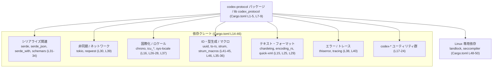
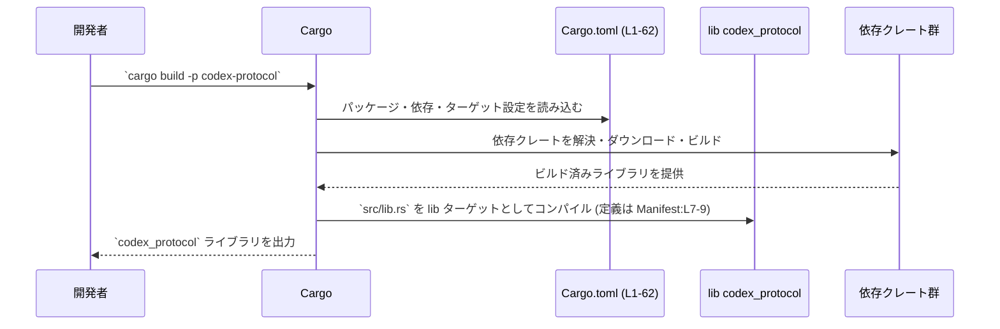

# protocol/Cargo.toml コード解説

## 0. ざっくり一言

- このファイルは、ライブラリクレート `codex-protocol` の Cargo マニフェストであり、パッケージ情報・ライブラリターゲット・依存クレート・開発用依存クレート・`cargo-shear` 用メタデータを定義しています（Cargo.toml:L1-5, L7-9, L14-46, L48-56, L58-62）。

---

## 1. このモジュールの役割

### 1.1 概要

- このファイルは Rust のビルドツール Cargo が読む設定ファイルで、`codex-protocol` パッケージのビルド方法を定義します（Cargo.toml:L1）。
- パッケージ名、エディション、ライセンス、バージョンはいずれもワークスペース共通設定を参照しています（Cargo.toml:L1-5）。
- ライブラリターゲット `codex_protocol` とそのソースパス `src/lib.rs` を指定しています（Cargo.toml:L7-9）。
- 多数の外部クレートへの依存、Linux のみで有効な依存、テスト・開発用依存、そして `cargo-shear` というツール向けのメタデータを定義しています（Cargo.toml:L14-46, L48-56, L58-62）。

このファイル自体には関数や構造体といった実行時ロジックは含まれておらず、公開 API やコアロジックは `src/lib.rs` など別ファイルに存在します（Cargo.toml:L9）。

### 1.2 アーキテクチャ内での位置づけ

`codex-protocol` クレートと依存クレートの関係を、ビルド単位（コンポーネント）として概観します。



- 中央のコンポーネントはライブラリクレート `codex_protocol` です（Cargo.toml:L7-9）。
- その周囲に、シリアライゼーション、非同期・ネットワーク処理、国際化、エラー処理、テキスト処理などの用途を持つと一般に理解されているクレート群が依存として配置されています（Cargo.toml:L14-46）。
- Linux ターゲットに限り `landlock` と `seccompiler` に依存することで、Linux 特有の機能（一般にサンドボックスなど）を利用する構成になっています（Cargo.toml:L48-50）。

> 注: 上図の各依存クレートの「一般的な用途」はクレート自身の性質によるもので、本クレート内での具体的な使われ方は Cargo.toml からは分かりません。

### 1.3 設計上のポイント

コードから読み取れる範囲で、このマニフェストの設計上の特徴を整理します。

- **ワークスペース共通設定の活用**  
  - `edition.workspace = true`、`license.workspace = true`、`version.workspace = true` により、エディション・ライセンス・バージョンはワークスペースルートで一元管理されています（Cargo.toml:L1-5）。  
  - 依存クレートもすべて `workspace = true` で宣言されており、バージョンやオプションはワークスペース側に集約されています（Cargo.toml:L14-46, L48-56）。

- **ライブラリ専用クレート**  
  - `[lib]` セクションのみが存在し、`[[bin]]` のようなバイナリターゲットの定義はありません（Cargo.toml:L7-9）。  
  - したがって、このパッケージは他クレートから利用されるライブラリとして設計されています。

- **lint 設定のワークスペース集約**  
  - `[lints] workspace = true` により、コンパイラの警告や lint ポリシーもワークスペースで一元管理されています（Cargo.toml:L11-12）。

- **非同期・ネットワーク処理を想定した依存**  
  - `tokio` と `reqwest` に依存しており（Cargo.toml:L30, L39）、一般に非同期 I/O や HTTP クライアント処理を行うクレート構成になっています。  
  - これにより、本クレート内部（`src/lib.rs` など）で非同期関数や並行処理が存在する可能性がありますが、具体的な実装はこのファイルからは分かりません。

- **エラー・トレースの整備**  
  - `thiserror` と `tracing` に依存しており（Cargo.toml:L38, L40）、一般にカスタムエラー型の定義と構造化ログ／トレース出力のための基盤が用意されています。

- **国際化・ロケール対応**  
  - `chrono`, `icu_decimal`, `icu_locale_core`, `icu_provider`, `sys-locale` など、日付・数値フォーマットやロケール関連のクレートに依存しています（Cargo.toml:L16, L26-28, L37）。  
  - `icu_provider` には `sync` フィーチャを有効化しており（Cargo.toml:L28）、このフィーチャが `icu_decimal` に必要であることがコメントで明示されています（Cargo.toml:L60）。

- **Linux 専用のセキュリティ機構**  
  - ターゲットが Linux の場合のみ `landlock` と `seccompiler` に依存します（Cargo.toml:L48-50）。  
  - コメントはありませんが、一般にこれらは Linux のセキュリティサンドボックスや seccomp 関連機能を提供するクレートです。  
  - コード側でも `cfg(target_os = "linux")` 等による条件コンパイルが前提となります（この点は Rust/Cargo の一般的な用法です）。

- **TypeScript 連携とスキーマ生成**  
  - `ts-rs` に対し `uuid-impl`, `serde-json-impl`, `no-serde-warnings` フィーチャが有効化されています（Cargo.toml:L41-45）。  
  - `schemars` にも依存しており（Cargo.toml:L31）、一般に JSON スキーマや TypeScript 型定義の生成が可能な構成です。

- **`cargo-shear` 用メタデータによる依存整理の調整**  
  - `[package.metadata.cargo-shear]` セクションで `icu_provider` と `strum` を `ignored` に指定し、依存削減ツール `cargo-shear` による誤った削除を防いでいます（Cargo.toml:L58-62）。  
  - コメントによれば、`icu_provider` は `icu_decimal` の `sync` フィーチャのために必要であり、`strum` は非 nightly ビルドで `strum_macros` に必要なため、ツールからは「未使用」と扱わないようにしています（Cargo.toml:L59-61）。

---

## 2. 主要な機能一覧

このファイルは実行時の機能ではなくビルド設定を提供します。その観点での「機能」を列挙します。

- パッケージメタデータの定義: パッケージ名 `codex-protocol` とワークスペース由来のエディション・ライセンス・バージョンを定義します（Cargo.toml:L1-5）。
- ライブラリターゲットの定義: ライブラリ名 `codex_protocol` とエントリポイント `src/lib.rs` を指定します（Cargo.toml:L7-9）。
- lint 設定のワークスペース委譲: コンパイラの lint 設定をワークスペースに委譲します（Cargo.toml:L11-12）。
- 共通依存クレートの宣言: シリアライゼーション・非同期 I/O・国際化・エラー処理・ロギング・ユーティリティ類など、多数の依存クレートをワークスペース共通設定で宣言します（Cargo.toml:L14-46）。
- Linux 限定依存クレートの宣言: Linux ターゲットでのみビルドされる `landlock` と `seccompiler` を追加します（Cargo.toml:L48-50）。
- 開発・テスト用依存クレートの宣言: `anyhow`, `http`, `pretty_assertions`, `tempfile` など、テストや開発時に利用されるクレートを定義します（Cargo.toml:L52-56）。
- `cargo-shear` 用メタデータ: 依存削減ツール `cargo-shear` が特定クレートを誤って削除しないように `ignored` リストを設定します（Cargo.toml:L58-62）。

---

## 3. 公開 API と詳細解説

### 3.1 型一覧（構造体・列挙体など）

このファイルは Cargo の設定ファイルであり、Rust の構造体・列挙体などの型定義は一切含まれていません。  
ただし、ビルドターゲットや依存クレートを「コンポーネント」とみなしてインベントリーを整理します。

#### ビルドターゲット / 設定コンポーネント

| 名前 | 種別 | 役割 / 用途 | 定義位置 |
|------|------|-------------|----------|
| `codex-protocol` | パッケージ | Cargo 上でのパッケージ名。クレートを他プロジェクトから依存指定する際の名前になります。 | Cargo.toml:L1-5 |
| `codex_protocol` | ライブラリターゲット | Rust コード側から `use codex_protocol::...` のように参照されるライブラリ名を定義します。エントリポイントは `src/lib.rs` です。 | Cargo.toml:L7-9 |
| `lints.workspace` | lint 設定 | lint 設定をワークスペース共通設定に委譲します。 | Cargo.toml:L11-12 |
| `package.metadata.cargo-shear` | ツール用メタデータ | `cargo-shear` に対し、`icu_provider` と `strum` を依存削減対象から除外する設定です。 | Cargo.toml:L58-62 |

#### 依存クレート一覧

> 注: 「役割 / 用途」は各クレート自体の一般的な機能を示します。本クレートでの具体的な使われ方は、この Cargo.toml だけからは分かりません。

| クレート名 | 種別 | 役割 / 用途（一般的な機能） | 定義位置 |
|-----------|------|------------------------------|----------|
| `chardetng` | 通常依存 | 文字コード自動判別ライブラリとして一般に利用されます。 | Cargo.toml:L15 |
| `chrono` | 通常依存 | 日付・時刻の扱い用クレート。ここでは `serde` フィーチャが有効です。 | Cargo.toml:L16 |
| `codex-async-utils` | 通常依存 | プロジェクト固有の非同期ユーティリティと推測されますが、用途はこのファイルからは不明です。 | Cargo.toml:L17 |
| `codex-execpolicy` | 通常依存 | 実行ポリシー関連の機能を提供すると命名から推測されますが、詳細は不明です。 | Cargo.toml:L18 |
| `codex-git-utils` | 通常依存 | Git 関連ユーティリティクレートと推測されますが、詳細は不明です。 | Cargo.toml:L19 |
| `codex-network-proxy` | 通常依存 | ネットワークプロキシ関連の機能と推測されますが、詳細は不明です。 | Cargo.toml:L20 |
| `codex-utils-absolute-path` | 通常依存 | 絶対パス操作用ユーティリティと推測されます。 | Cargo.toml:L21 |
| `codex-utils-image` | 通常依存 | 画像関連ユーティリティと推測されます。 | Cargo.toml:L22 |
| `codex-utils-string` | 通常依存 | 文字列操作ユーティリティと推測されます。 | Cargo.toml:L23 |
| `codex-utils-template` | 通常依存 | テンプレート処理ユーティリティと推測されます。 | Cargo.toml:L24 |
| `encoding_rs` | 通常依存 | 各種文字コードのエンコード / デコードを行うクレートです。 | Cargo.toml:L25 |
| `icu_decimal` | 通常依存 | ICU ベースの数値フォーマット機能を提供するクレートです。 | Cargo.toml:L26 |
| `icu_locale_core` | 通常依存 | ICU ロケール関連のコア機能を提供します。 | Cargo.toml:L27 |
| `icu_provider` | 通常依存 | ICU 用のデータプロバイダ機能。`sync` フィーチャが有効であり、`icu_decimal` のために必要であるとコメントされています。 | Cargo.toml:L28, L60 |
| `quick-xml` | 通常依存 | 高速な XML パーサ / ライター。`serialize` フィーチャが有効です。 | Cargo.toml:L29 |
| `reqwest` | 通常依存 | HTTP クライアントクレートとして広く利用されます。 | Cargo.toml:L30 |
| `schemars` | 通常依存 | Rust 型から JSON スキーマを生成するクレートです。 | Cargo.toml:L31 |
| `serde` | 通常依存 | シリアライゼーション / デシリアライゼーションフレームワーク。`derive` フィーチャが有効です。 | Cargo.toml:L32 |
| `serde_json` | 通常依存 | JSON のシリアライズ / デシリアライズを行うクレートです。 | Cargo.toml:L33 |
| `serde_with` | 通常依存 | `serde` の補助クレート。ここでは `macros`, `base64` フィーチャが有効です。 | Cargo.toml:L34 |
| `strum` | 通常依存 | 列挙体向けユーティリティ / デリバイマクロ群のランタイム部。`cargo-shear` で `ignored` に設定されています。 | Cargo.toml:L35, L61-62 |
| `strum_macros` | 通常依存 | 列挙体向けの derive マクロクレート。nightly でないビルドでは `strum` が必要であるとコメントされています。 | Cargo.toml:L36, L61 |
| `sys-locale` | 通常依存 | OS のロケール情報取得に関連するクレートです。 | Cargo.toml:L37 |
| `thiserror` | 通常依存 | エラー型を簡潔に定義するための derive マクロを提供します。 | Cargo.toml:L38 |
| `tokio` | 通常依存 | 非同期ランタイム（イベントループ、タスクスケジューラなど）を提供します。 | Cargo.toml:L39 |
| `tracing` | 通常依存 | 構造化ログ / トレース用のフレームワークです。 | Cargo.toml:L40 |
| `ts-rs` | 通常依存 | Rust 型から TypeScript 型定義を生成するクレート。`uuid-impl`, `serde-json-impl`, `no-serde-warnings` フィーチャが有効です。 | Cargo.toml:L41-45 |
| `uuid` | 通常依存 | UUID 生成・操作クレート。`serde`, `v7`, `v4` フィーチャが有効です。 | Cargo.toml:L46 |
| `landlock` | Linux ターゲット依存 | Linux の Landlock セキュリティ機構を利用するためのクレート（一般的な用途）。 | Cargo.toml:L48-49 |
| `seccompiler` | Linux ターゲット依存 | Linux の seccomp ルールを管理・生成するクレート（一般的な用途）。 | Cargo.toml:L48, L50 |
| `anyhow` | 開発依存 | エラーをラップするための汎用エラー型を提供します。テストやサンプルコードで汎用的に利用されることが多いです。 | Cargo.toml:L52-53 |
| `http` | 開発依存 | HTTP の型定義（リクエスト/レスポンスなど）を提供するクレートです。 | Cargo.toml:L52, L54 |
| `pretty_assertions` | 開発依存 | アサーション失敗時の差分表示を見やすくするテスト支援クレートです。 | Cargo.toml:L55 |
| `tempfile` | 開発依存 | 一時ファイル・ディレクトリの安全な生成用クレートです。 | Cargo.toml:L56 |

この表から、エラー処理（`thiserror`, `anyhow`）、並行性/非同期性（`tokio`）、国際化（`icu_*`, `sys-locale`）、観測性（`tracing`）、セキュリティ（`landlock`, `seccompiler`）など、言語レベルの安全性や運用面を支える多様なコンポーネントに依存していることが分かります。

### 3.2 関数詳細

このファイルには Rust の関数定義が存在しないため、「関数詳細」に該当する対象がありません。  
公開 API やコアロジックの関数は `src/lib.rs` 以降に定義されていると考えられますが、このチャンクには現れません。

### 3.3 その他の関数

上記と同様、このファイルには関数が一切含まれていないため、このセクションに記載すべき内容はありません。

---

## 4. データフロー

このファイル自体は設定ファイルであり、実行時のデータフローや関数呼び出し関係は記述されていません。  
ここでは、**Cargo がこの Cargo.toml (L1-62) を用いてビルドする際の一般的なフロー**を示します（Rust/Cargo の一般的な挙動であり、このプロジェクト固有のロジックではありません）。



- この図は、ビルドツールとしての Cargo と Cargo.toml の関係を示すものであり、アプリケーション内部のデータフローはこのチャンクには現れません。
- 依存クレート群の内部処理や、本クレートの公開関数がどのようなデータフローを持つかは、`src/lib.rs` など実際のコードを確認する必要があります。

---

## 5. 使い方（How to Use）

### 5.1 基本的な使用方法

このパッケージはライブラリクレートとして定義されており（Cargo.toml:L7-9）、他のクレートから利用することが想定されます。

#### 他クレートの `Cargo.toml` からの依存指定例

```toml
[dependencies]
# パスはワークスペース内のこのクレートの位置に応じて調整する
codex-protocol = { path = "protocol" }
```

- ここで `codex-protocol` はパッケージ名であり（Cargo.toml:L4）、依存の指定に用います。

#### Rust コードからの利用例（概念的な例）

```rust
// ライブラリ名 `codex_protocol` として公開されます（Cargo.toml:L8）
use codex_protocol; // 実際には公開 API に応じてモジュールや型を指定する

fn main() {
    // ここで codex_protocol クレートの公開関数・型を利用する
    // 具体的な API 名はこのチャンクには現れないため不明です。
}
```

- `use codex_protocol::...` のように、[lib] セクションで指定された名前（Cargo.toml:L8）を使って参照します。
- どのモジュールや関数が存在するかは `src/lib.rs` 以降のコードに依存し、このファイルからは分かりません。

### 5.2 よくある使用パターン（ビルド / テスト）

このファイルが設定している開発用依存クレートから、以下のような利用が一般に想定できます。

- **ビルド**  
  - `cargo build -p codex-protocol`  
    - `codex_protocol` ライブラリをビルドします（Cargo.toml:L1, L7-9）。

- **テスト**  
  - `cargo test -p codex-protocol`  
    - テストコード内で `anyhow`, `http`, `pretty_assertions`, `tempfile` などの dev-dependencies が利用される可能性があります（Cargo.toml:L52-56）。  
    - 具体的なテスト内容はこのチャンクには現れません。

- **Linux 専用機能**  
  - `cargo test -p codex-protocol --target x86_64-unknown-linux-gnu` のように Linux ターゲットを指定すると、`landlock` と `seccompiler` がビルド対象に含まれます（Cargo.toml:L48-50）。

### 5.3 よくある間違い（この構成から推測される注意点）

このマニフェスト構成から起こりうる典型的な問題と、その回避方法を一般的な形で示します。

```rust
// (誤りの例: Linux 専用クレートを無条件に use している)

// このようなコードが non-Linux ターゲットでコンパイルされると仮定すると…
use landlock; // Cargo.toml:L49 によれば、依存は Linux ターゲットにのみ存在する

fn main() {
    // ...
}
```

```rust
// 正しい例（概念図）: 条件コンパイルを行う
#[cfg(target_os = "linux")]
use landlock; // Cargo.toml:L48-50 で Linux 限定依存として宣言されている

fn main() {
    #[cfg(target_os = "linux")]
    {
        // Linux でのみ landlock による機能を利用する
    }

    #[cfg(not(target_os = "linux"))]
    {
        // 他 OS 向けのフォールバックまたは何もしない分岐
    }
}
```

- `[target.'cfg(target_os = "linux")'.dependencies]` により、`landlock` と `seccompiler` は Linux ターゲットでのみ利用可能です（Cargo.toml:L48-50）。
- コード側で `cfg(target_os = "linux")` を付けずにこれらのクレートを `use` すると、非 Linux ターゲットでコンパイルエラーになる可能性があります。

### 5.4 使用上の注意点（まとめ）

- **ワークスペース依存への依存**  
  - すべての依存クレートが `workspace = true` によりワークスペースルートでバージョン管理されています（Cargo.toml:L14-46, L48-56）。  
  - 依存バージョンやフィーチャを変更する場合は、ワークスペースルートの `Cargo.toml` を編集する必要があります（このチャンクには現れません）。

- **Linux 限定依存の条件コンパイル**  
  - `landlock` と `seccompiler` は Linux ターゲットでのみ利用可能です（Cargo.toml:L48-50）。  
  - コード側でも `#[cfg(target_os = "linux")]` によるガードを行わないと、他 OS 向けビルドでコンパイルエラーが発生します。

- **エラー／トレース基盤の前提**  
  - `thiserror` と `tracing` に依存しているため（Cargo.toml:L38, L40）、エラー定義やログ出力にはこれらのクレートに沿ったスタイルが採用されている可能性があります。  
  - 新たなコードを追加する際は、既存コードのエラー型・トレース出力スタイルに合わせることが望ましいですが、その詳細は `src/lib.rs` などを確認する必要があります。

- **`cargo-shear` 設定との整合性**  
  - `icu_provider` や `strum` に関する依存関係を追加・削除する場合、`[package.metadata.cargo-shear]` の `ignored` 設定も併せて見直す必要があります（Cargo.toml:L58-62）。  
  - 特に、`icu_decimal` のように他クレートのフィーチャに依存しているケースでは、誤って必要な依存を削除しないよう注意が必要です（Cargo.toml:L60）。

---

## 6. 変更の仕方（How to Modify）

### 6.1 新しい機能を追加する場合

このファイルを変更して新しい機能を実現する場合の、ビルド設定レベルでの入口を整理します。

1. **ライブラリコードの追加先**  
   - 実際のロジックや公開 API は `src/lib.rs` 以下に追加します（Cargo.toml:L9）。
   - このチャンクには `src/lib.rs` の中身がないため、どのモジュール構造かは不明です。

2. **必要な依存クレートの追加**  
   - 新しい機能に外部クレートが必要な場合は、まずワークスペースルートの `Cargo.toml` にそのクレートを追加し、`workspace = true` で共有できるようにすることが多いと考えられます（Cargo.toml:L14-46, L48-56）。  
   - その後、このファイルの `[dependencies]` または適切な target セクションに `foo = { workspace = true }` のように追記します。

3. **ターゲット固有機能の追加**  
   - OS 依存の機能を追加する場合は、`[target.'cfg(...)'.dependencies]` セクションを参考に、対象 OS ごとに依存クレートを分けます（Cargo.toml:L48-50）。  
   - コード側では `#[cfg(...)]` を用いた条件コンパイルが必要です。

4. **スキーマ / TypeScript 連携が必要な場合**  
   - `schemars` や `ts-rs` が既に依存に含まれているため（Cargo.toml:L31, L41-45）、Rust 型に派生属性を付ける形でスキーマや TypeScript 型を生成する実装が可能です。  
   - ただし、具体的な既存の利用パターンはこのチャンクには現れません。

### 6.2 既存の機能を変更する場合

既存機能や依存の変更にあたって、設定レベルで注意すべき点を列挙します。

- **依存クレートの削除 / 差し替え**  
  - `cargo-shear` が参照する `ignored` リストに挙がっているクレート（`icu_provider`, `strum`）については、削除する場合にメタデータも更新する必要があります（Cargo.toml:L58-62）。  
  - `icu_decimal` や `strum_macros` のように連動しているクレート（コメント参照）は、片方だけを削除するとビルドエラーになる可能性があります（Cargo.toml:L60-61）。

- **フィーチャの変更**  
  - `chrono` の `serde`、`icu_provider` の `sync`、`quick-xml` の `serialize`、`serde_with` の `macros` / `base64`、`ts-rs` の複数フィーチャ、`uuid` の `serde` / `v7` / `v4` など、いくつかのクレートでフィーチャが明示的に指定されています（Cargo.toml:L16, L28-29, L34, L41-46）。  
  - これらを無効化すると、コード側で利用している派生や API が使えなくなりうるため、`src/lib.rs` を確認しながら変更する必要があります。

- **ターゲット固有依存の見直し**  
  - Linux 以外の OS でしか使わない機能を追加する場合は、既存の Linux セクション（Cargo.toml:L48-50）と同様に、別の `cfg` セクションを追加する形で管理します。  
  - コードの `cfg` 条件とマニフェストの target セクションが不整合になると、ビルドエラーの原因になります。

- **テスト関連依存の変更**  
  - `anyhow`, `http`, `pretty_assertions`, `tempfile` の dev-dependencies を変更すると、テストコードに影響します（Cargo.toml:L52-56）。  
  - テストコードはこのチャンクには現れないため、削除やバージョン変更の際は `tests/` や `src/*` 内のテストモジュールを確認する必要があります。

---

## 7. 関連ファイル

この Cargo.toml と密接に関係するファイル・モジュールを整理します。

| パス / コンポーネント | 役割 / 関係 |
|----------------------|------------|
| `protocol/src/lib.rs` | `codex_protocol` ライブラリターゲットのエントリポイントです（Cargo.toml:L7-9）。公開 API やコアロジックはここから始まります。このチャンクには内容が現れません。 |
| ワークスペースルートの `Cargo.toml`（パス不明） | `edition.workspace`, `license.workspace`, `version.workspace`, およびすべての `workspace = true` 依存の実体を定義していると推定されるファイルです（Cargo.toml:L1-5, L14-46, L48-56）。パス名はこのチャンクには現れませんが、ワークスペース機能を利用するために存在している必要があります。 |
| `codex-async-utils` ほか `codex-*` 各クレートの Cargo.toml | 多くの `codex-*` プレフィックスを持つ依存クレートが宣言されており（Cargo.toml:L17-24, L19-21）、同一ワークスペース内の別パッケージである可能性が高いですが、正確なパスや役割はこのチャンクには現れません。 |
| テストコード (`tests/` や `src/*` 内の `mod tests` など) | `anyhow`, `http`, `pretty_assertions`, `tempfile` といった dev-dependencies（Cargo.toml:L52-56）を利用するテストが存在する可能性がありますが、このチャンクには現れません。 |

---

このレポートはあくまで `protocol/Cargo.toml` 単体から読み取れる事実と、外部クレートの一般的な性質に基づいています。  
公開 API やコアロジックの詳細、安全性・エラー処理・並行性の具体的な設計については、`src/lib.rs` 以降のコードを確認する必要があります。
