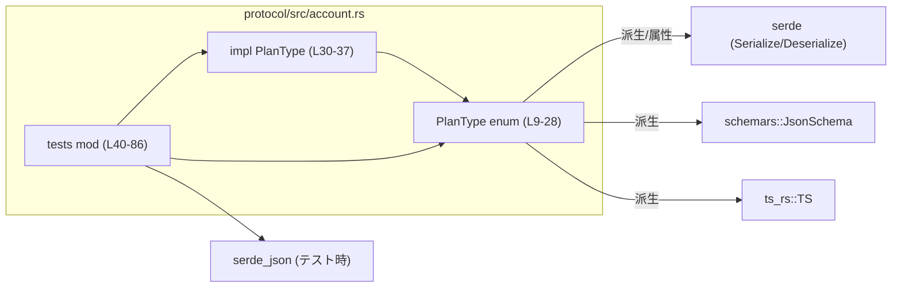
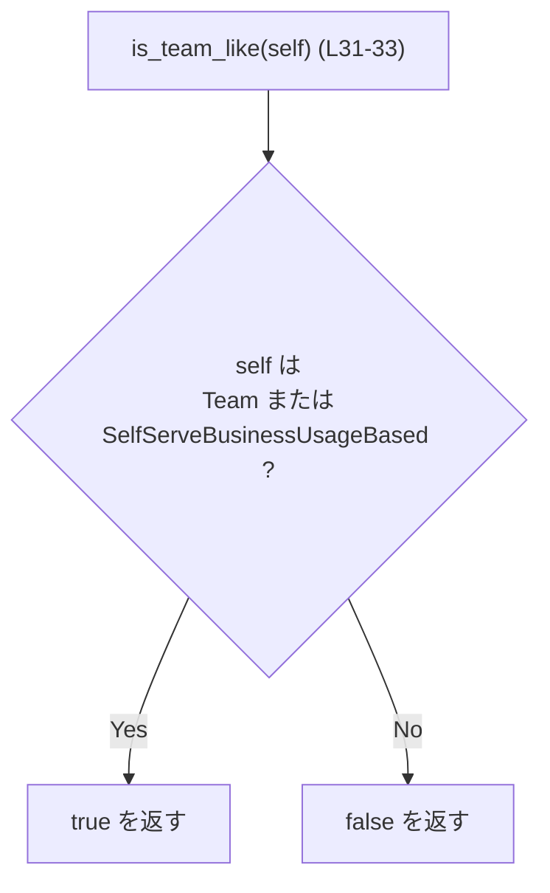
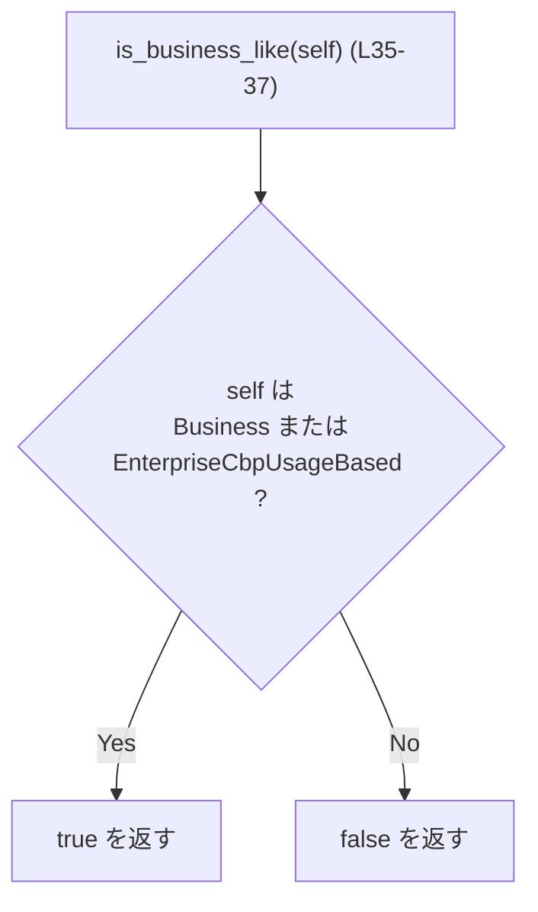
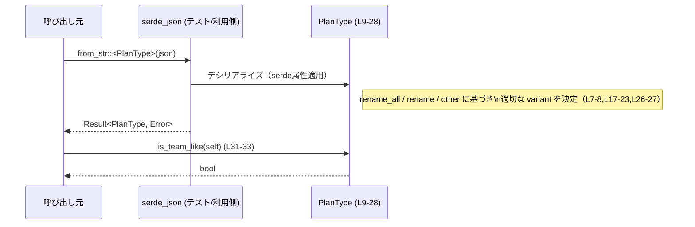

# protocol/src/account.rs

## 0. ざっくり一言

- アカウントのプラン種別を表す `PlanType` enum と、そのプランを「チーム系」「ビジネス系」に分類するためのヘルパーメソッドを提供するモジュールです（`protocol/src/account.rs:L6-38`）。
- Serde・schemars・ts-rs を用いて、Rust 型を JSON / JSON Schema / TypeScript にシリアライズ可能にする設定も含まれています（`protocol/src/account.rs:L1-4,L6-8`）。

---

## 1. このモジュールの役割

### 1.1 概要

- このモジュールは、アカウントの課金プランを表すための **列挙型 `PlanType`** を定義します（`protocol/src/account.rs:L9-28`）。
- `PlanType` は Serde・schemars・ts-rs の各属性を持ち、JSON 文字列・JSON Schema・TypeScript 型との相互連携を前提とした「ワイヤフォーマット」（外部とのデータ交換形式）を決めています（`protocol/src/account.rs:L6-8,L17-23,L26-27`）。
- さらに、プランを「チーム系」「ビジネス系」とみなすための 2 つのヘルパー関数 `is_team_like` / `is_business_like` を提供します（`protocol/src/account.rs:L30-37`）。

### 1.2 アーキテクチャ内での位置づけ

このチャンクで分かる依存関係は以下です。

- 外部クレート
  - `serde::{Serialize, Deserialize}`: JSON 等とのシリアライズ/デシリアライズ（`protocol/src/account.rs:L2-3`）
  - `schemars::JsonSchema`: JSON Schema 生成（`protocol/src/account.rs:L1,L6`）
  - `ts_rs::TS`: TypeScript 型生成（`protocol/src/account.rs:L4,L6,L8`）
- テスト時のみ
  - `serde_json`: 実際の JSON 文字列との相互変換テストで使用（`protocol/src/account.rs:L47-74`）
  - `pretty_assertions::assert_eq`: テスト用アサート（`protocol/src/account.rs:L43`）

モジュール内の関係を簡略化すると、次のようになります。



### 1.3 設計上のポイント

- **データ表現の一元化**  
  - プラン種別はすべて `PlanType` enum で表現し、文字列は Serde の属性で制御しています（`protocol/src/account.rs:L7-8,L17-23,L26-27`）。
- **未知値の安全な取り扱い**  
  - `#[serde(other)]` によって、未知の JSON 文字列を `PlanType::Unknown` にフォールバックする設計になっています（`protocol/src/account.rs:L26-27`）。
- **シンプルなヘルパーによる分類**  
  - `is_team_like` / `is_business_like` は `matches!` マクロを使った単純なパターンマッチのみで構成され、副作用やエラーがありません（`protocol/src/account.rs:L31-37`）。
- **テスト駆動のワイヤ形式保証**  
  - テストでシリアライズ/デシリアライズの文字列値とヘルパーの分類が明示的に検証されています（`protocol/src/account.rs:L45-86`）。

---

### 1.4 コンポーネント一覧（インベントリー）

| 名前 | 種別 | 公開性 | 概要 | 定義位置 |
|------|------|--------|------|----------|
| `PlanType` | enum | `pub` | アカウントのプラン種別（Free/Go/Plus/Pro/ProLite/Team/Usage-based/Business/Enterprise/Edu/Unknown）を表現 | `protocol/src/account.rs:L9-28` |
| `PlanType::is_team_like` | メソッド | `pub` | `Team` 系のプランかどうか（Team または SelfServeBusinessUsageBased）を判定して `bool` を返す | `protocol/src/account.rs:L30-33` |
| `PlanType::is_business_like` | メソッド | `pub` | `Business` 系のプランかどうか（Business または EnterpriseCbpUsageBased）を判定して `bool` を返す | `protocol/src/account.rs:L35-37` |
| `tests` | モジュール（cfg(test)） | 非公開 | シリアライズ/デシリアライズのワイヤ名と、分類ヘルパーの動作を検証するユニットテスト | `protocol/src/account.rs:L40-86` |
| `usage_based_plan_types_use_expected_wire_names` | テスト関数 | 非公開 | Usage-based プランと ProLite の JSON 文字列との対応を検証 | `protocol/src/account.rs:L45-75` |
| `plan_family_helpers_group_usage_based_variants_with_existing_plans` | テスト関数 | 非公開 | Usage-based プランが既存プランと同じファミリーに分類されることを検証 | `protocol/src/account.rs:L77-85` |

---

## 2. 主要な機能一覧

- プラン種別の定義: `PlanType` enum によるプラン種別の型安全な表現（`protocol/src/account.rs:L9-28`）
- JSON / TypeScript / JSON Schema との連携:
  - `Serialize` / `Deserialize` / `JsonSchema` / `TS` の derive と `rename_all` / `rename` 属性によるワイヤ形式の制御（`protocol/src/account.rs:L6-8,L17-23,L26-27`）
- プラン分類ヘルパー:
  - `PlanType::is_team_like`: チーム系プランかどうかの判定（`protocol/src/account.rs:L31-33`）
  - `PlanType::is_business_like`: ビジネス系プランかどうかの判定（`protocol/src/account.rs:L35-37`）

---

## 3. 公開 API と詳細解説

### 3.1 型一覧

| 名前 | 種別 | 役割 / 用途 | 主な属性・トレイト | 定義位置 |
|------|------|-------------|--------------------|----------|
| `PlanType` | enum | アカウントの契約プラン種別を列挙する。シリアライズ可能・スキーマ生成可能・TypeScript 型生成可能。 | `Serialize`, `Deserialize`, `Copy`, `Clone`, `Debug`, `PartialEq`, `Eq`, `JsonSchema`, `TS`, `Default` / `#[serde(rename_all = "lowercase")]` / `#[ts(rename_all = "lowercase")]` / 一部 variant に個別 `rename` / `#[serde(other)]` | `protocol/src/account.rs:L6-8,L9-28` |

`PlanType` の主な variant とワイヤ形式（JSON/TS 上の文字列）は、コードから次のように読み取れます。

| Rust variant | デフォルト/属性 | JSON/TS 上の文字列 | 根拠 |
|--------------|-----------------|--------------------|------|
| `Free` | `#[default]` / `rename_all = "lowercase"` | `"free"` | `protocol/src/account.rs:L10-11` |
| `Go` | `rename_all = "lowercase"` | `"go"` | `protocol/src/account.rs:L12` |
| `Plus` | 同上 | `"plus"` | `protocol/src/account.rs:L13` |
| `Pro` | 同上 | `"pro"` | `protocol/src/account.rs:L14` |
| `ProLite` | 同上 | `"prolite"`（テストで確認） | `protocol/src/account.rs:L15,L58-60` |
| `Team` | 同上 | `"team"` | `protocol/src/account.rs:L16` |
| `SelfServeBusinessUsageBased` | `#[serde(rename = "self_serve_business_usage_based")]` / `#[ts(rename = "self_serve_business_usage_based")]` | `"self_serve_business_usage_based"` | `protocol/src/account.rs:L17-19,L47-51,L61-65` |
| `Business` | `rename_all = "lowercase"` | `"business"` | `protocol/src/account.rs:L20` |
| `EnterpriseCbpUsageBased` | `#[serde(rename = "enterprise_cbp_usage_based")]` / `#[ts(rename = "enterprise_cbp_usage_based")]` | `"enterprise_cbp_usage_based"` | `protocol/src/account.rs:L21-23,L52-56,L71-73` |
| `Enterprise` | `rename_all = "lowercase"` | `"enterprise"` | `protocol/src/account.rs:L24` |
| `Edu` | 同上 | `"edu"` | `protocol/src/account.rs:L25` |
| `Unknown` | `#[serde(other)]` | 不明な文字列がここにマッピングされる | `protocol/src/account.rs:L26-27` |

### 3.2 関数詳細

#### `PlanType::is_team_like(self) -> bool`

**概要**

- プランが「チーム系」のプランかどうかを判定し、真偽値で返します（`protocol/src/account.rs:L31-33`）。
- 現時点では `Team` と `SelfServeBusinessUsageBased` の 2 つを「チーム系」とみなしています。

**引数**

| 引数名 | 型 | 説明 |
|--------|----|------|
| `self` | `PlanType`（値渡し） | 判定対象のプラン種別。`Copy` を実装しているので、値渡しでも所有権の移動コストは軽微です（`protocol/src/account.rs:L6`）。 |

**戻り値**

- `bool`  
  - `true`: `PlanType::Team` または `PlanType::SelfServeBusinessUsageBased` の場合（`protocol/src/account.rs:L32`）。
  - `false`: 上記以外のすべての variant の場合。

**内部処理の流れ**

1. `matches!` マクロを用いて、`self` が `Self::Team` または `Self::SelfServeBusinessUsageBased` に一致するか評価します（`protocol/src/account.rs:L32`）。
2. 一致する場合は `true`、そうでなければ `false` を返します。
   - `matches!` はパターンマッチングを行う標準マクロで、副作用はありません。

簡易フロー:



**Examples（使用例）**

チーム系プランに対して機能を有効化する例です。

```rust
use protocol::account::PlanType; // 実際のパスは不明（このチャンクには現れない）

fn can_use_team_feature(plan: PlanType) -> bool {
    // チーム関連機能は Team および SelfServeBusinessUsageBased のみ許可する
    plan.is_team_like()
}

fn example() {
    let plan = PlanType::Team; // enum の直接指定（protocol/src/account.rs:L16）

    assert!(can_use_team_feature(plan)); // true になる
}
```

**Errors / Panics**

- この関数は常に `bool` を返し、エラー型や `panic!` を含むコードはありません（`protocol/src/account.rs:L31-33`）。
- Rust の観点では、所有権・ライフタイム・スレッド安全性に関する特別な懸念はありません。
  - `PlanType` は `Copy` であり、`is_team_like` は読み取り専用の処理のみを行います（`protocol/src/account.rs:L6`）。

**Edge cases（エッジケース）**

- `PlanType::Unknown` の場合: `matches!` のパターンに含まれていないため `false` になります（`protocol/src/account.rs:L26-27,L32`）。
- `Team` / `SelfServeBusinessUsageBased` 以外のすべての既知プラン (`Free`, `Go`, `Plus`, `Pro`, `ProLite`, `Business`, `EnterpriseCbpUsageBased`, `Enterprise`, `Edu`) も `false` になります（`protocol/src/account.rs:L11-25,L32`）。
- 将来、新しい variant が追加された場合:
  - 追加された variant が `is_team_like` に明示的に追加されない限り `false` になります（`matches!` の仕様）。

**使用上の注意点**

- 「チーム系」の定義は、この関数内のパターンで決まっており、enum 側の variant 追加だけでは自動的には拡張されません。
  - チーム系とみなす新 variant を追加する際は、`is_team_like` も併せて更新する必要があります（`protocol/src/account.rs:L31-33`）。
- `Unknown` variant を含む全プランに対して意味のあるロジックを構築したい場合、`is_team_like` の戻り値だけに依存するのではなく、必要に応じて `Unknown` を明示的に扱うことが望ましいです（Unknown へフォールバックされる設計: `protocol/src/account.rs:L26-27`）。

---

#### `PlanType::is_business_like(self) -> bool`

**概要**

- プランが「ビジネス系」のプランかどうかを判定し、真偽値で返します（`protocol/src/account.rs:L35-37`）。
- 現時点では `Business` と `EnterpriseCbpUsageBased` の 2 つを「ビジネス系」とみなしています。

**引数**

| 引数名 | 型 | 説明 |
|--------|----|------|
| `self` | `PlanType` | 判定対象のプラン種別（`Copy` のため軽量）。 |

**戻り値**

- `bool`  
  - `true`: `PlanType::Business` または `PlanType::EnterpriseCbpUsageBased` の場合（`protocol/src/account.rs:L36`）。
  - `false`: 上記以外のすべての variant の場合。

**内部処理の流れ**

1. `matches!` マクロで `self` が `Self::Business` または `Self::EnterpriseCbpUsageBased` か判定します（`protocol/src/account.rs:L36`）。
2. 一致すれば `true`、それ以外は `false` を返します。

フロー図:



**Examples（使用例）**

ビジネス系プランにのみ請求書払いを許可する例です。

```rust
use protocol::account::PlanType; // 実際のモジュールパスはこのチャンクには現れない

fn can_use_invoicing(plan: PlanType) -> bool {
    plan.is_business_like()
}

fn example() {
    let plan = PlanType::EnterpriseCbpUsageBased; // usage-based enterprise（protocol/src/account.rs:L21-23）

    assert!(can_use_invoicing(plan)); // true
}
```

**Errors / Panics**

- 例外や `panic!` につながるコードは含まれていません（`protocol/src/account.rs:L35-37`）。
- 非同期処理・スレッド共有なども行っておらず、並行性に起因するエラー要因もありません。

**Edge cases（エッジケース）**

- `PlanType::Unknown` を含む、ビジネス系以外の variant はすべて `false`（`protocol/src/account.rs:L11-16,L24-27,L36`）。
- 将来 variant が追加されても、明示的に `matches!` のパターンに加えない限り `false` になります。

**使用上の注意点**

- 「ビジネス系」の定義はこの関数にハードコードされているため、プラン体系の変更に合わせて定期的に見直す必要があります（`protocol/src/account.rs:L36`）。
- チーム系とビジネス系は排他的とは限りませんが、現状の実装では同一プランが両方 `true` になるケースはありません（パターン集合が非交差: `Team`/`SelfServeBusinessUsageBased` vs `Business`/`EnterpriseCbpUsageBased`）。

---

### 3.3 その他の関数（テスト専用）

| 関数名 | 役割（1 行） | 定義位置 |
|--------|--------------|----------|
| `usage_based_plan_types_use_expected_wire_names` | Usage-based プランと `ProLite` のシリアライズ/デシリアライズの文字列値が期待通りであることを確認する | `protocol/src/account.rs:L45-75` |
| `plan_family_helpers_group_usage_based_variants_with_existing_plans` | `is_team_like` / `is_business_like` が usage-based プランを既存の Team/Business ファミリーと同じグループに分類しているか検証する | `protocol/src/account.rs:L77-85` |

これらは `#[cfg(test)]` モジュール内にあり、本番バイナリには含まれません（`protocol/src/account.rs:L40`）。

---

## 4. データフロー

代表的なシナリオとして、「JSON 文字列からプランを読み込み、そのプランがチーム系かどうかを判定する」流れを整理します。

1. 外部から JSON 文字列（例: `"self_serve_business_usage_based"`）が渡される。
2. `serde_json::from_str::<PlanType>` が呼ばれ、Serde が `PlanType` の属性に従って文字列を `PlanType` の variant に変換する（`protocol/src/account.rs:L7-8,L17-19,L62-65`）。
3. 得られた `PlanType` に対して `is_team_like` が呼ばれ、チーム系かどうかが判定される（`protocol/src/account.rs:L31-33`）。

これを sequence diagram で表すと次のようになります。



テスト `usage_based_plan_types_use_expected_wire_names (L45-75)` では、この流れのうちシリアライズ/デシリアライズ部分が、`plan_family_helpers_group_usage_based_variants_with_existing_plans (L77-85)` では `is_team_like` / `is_business_like` 呼び出し部分が具体的に検証されています。

---

## 5. 使い方（How to Use）

### 5.1 基本的な使用方法

`PlanType` を使って、外部から受け取った JSON のプラン情報を扱い、分類ヘルパーで条件分岐する基本的な例です。

```rust
use serde_json;
use protocol::account::PlanType; // 実際のパスはこのチャンクには現れません

fn main() -> Result<(), Box<dyn std::error::Error>> {
    // 外部 API などから受け取った JSON プラン名
    let json = "\"self_serve_business_usage_based\"";

    // JSON から PlanType へデシリアライズ（protocol/src/account.rs:L17-19,L61-65）
    let plan: PlanType = serde_json::from_str(json)?;

    // チーム系プランかどうか判定（L31-33）
    if plan.is_team_like() {
        println!("このユーザーにはチーム機能を有効化します。");
    }

    // ビジネス系プランかどうか判定（L35-37）
    if plan.is_business_like() {
        println!("このユーザーにはビジネス機能を有効化します。");
    }

    Ok(())
}
```

このコードでは、Serde が `PlanType` の属性に基づいて `"self_serve_business_usage_based"` を `PlanType::SelfServeBusinessUsageBased` に変換しています（`protocol/src/account.rs:L17-19,L61-65`）。

### 5.2 よくある使用パターン

1. **プランに応じた機能フラグの制御**

```rust
fn features_for(plan: PlanType) {
    if plan.is_team_like() {
        // チームコラボレーション機能
    }

    if plan.is_business_like() {
        // 請求書払いなどのビジネス機能
    }

    // それ以外のプランは個別に match で分けることも可能
}
```

1. **TypeScript との型共有（ts-rs を利用する場合）**

このチャンクからは具体的なビルド方法は分かりませんが、`#[derive(TS)]` と `#[ts(rename_all = "lowercase")]` により、`PlanType` に対応する TypeScript 型定義が生成される前提になっています（`protocol/src/account.rs:L6,L8`）。

### 5.3 よくある間違いと注意（コードから読み取れる範囲）

```rust
// よくない例: Unknown を無視したまま文字列を直接扱う
fn bad(plan_str: &str) {
    // serde を使わず生文字列で比較している
    if plan_str == "team" {
        // ...
    }
}

// より安全な例: PlanType を経由する
use serde_json;

fn better(json_str: &str) -> Result<(), serde_json::Error> {
    let plan: PlanType = serde_json::from_str(json_str)?; // 不明な文字列は Unknown になる（L26-27）
    match plan {
        PlanType::Team => { /* ... */ }
        PlanType::Unknown => {
            // 想定外のプラン名を個別に処理できる
        }
        _ => { /* その他 */ }
    }
    Ok(())
}
```

- `Unknown` にフォールバックする設計により、**予期しない文字列でデコードエラーになりにくい** 一方で、`Unknown` を見逃すと「想定外プラン」を区別できなくなる点に注意が必要です（`protocol/src/account.rs:L26-27`）。

### 5.4 使用上の注意点（まとめ）

- **Unknown の存在**  
  - 未知の JSON 文字列は `Unknown` にマップされます（`protocol/src/account.rs:L26-27`）。ロジック上で「すべて既知のプラン」と仮定しないことが重要です。
- **ヘルパーの対象範囲**  
  - `is_team_like` / `is_business_like` が `true` を返す variant は、コード内の `matches!` に限定されます（`protocol/src/account.rs:L32,L36`）。新しいプランを導入する際は、必要に応じて更新が必要です。
- **シリアライズ名の固定**  
  - 特定の variant は `rename` でワイヤ名が固定されており、これを変更すると外部 API との互換性に影響します（`protocol/src/account.rs:L17-23`）。

---

## 6. 変更の仕方（How to Modify）

### 6.1 新しいプラン種別を追加する場合

1. **`PlanType` に variant を追加**

   ```rust
   pub enum PlanType {
       // 既存の variant...
       NewPlan, // 新プラン（位置は任意） (仮想例)
   }
   ```

   - 実際の追記位置は任意ですが、現在の variant 定義は `protocol/src/account.rs:L9-28` にあります。

2. **ワイヤ名（JSON/TS の文字列）を決める**

   - `rename_all = "lowercase"` の影響で、特別な指定をしない場合は小文字化された名前になります（`protocol/src/account.rs:L7-8`）。
   - 既存の外部仕様に合わせる必要がある場合は、既存の usage-based プランと同様に `#[serde(rename = "...")]` / `#[ts(rename = "...")]` を付与します（`protocol/src/account.rs:L17-23`）。

3. **分類ヘルパーの更新**

   - 新プランをチーム系に含める場合は `is_team_like` の `matches!` に追加します（`protocol/src/account.rs:L31-33`）。
   - ビジネス系に含める場合は `is_business_like` の `matches!` に追加します（`protocol/src/account.rs:L35-37`）。

4. **テストの追加または更新**

   - シリアライズ/デシリアライズのワイヤ名を検証するテスト（`usage_based_plan_types_use_expected_wire_names`）に倣い、新プランに関するアサートを追加できます（`protocol/src/account.rs:L45-75`）。
   - 分類ヘルパーが期待通り動作するかは、`plan_family_helpers_group_usage_based_variants_with_existing_plans` に倣ってテストを追加できます（`protocol/src/account.rs:L77-85`）。

### 6.2 既存の機能を変更する場合

- **ワイヤ名の変更**
  - `#[serde(rename = "...")]` / `#[ts(rename = "...")]` の値を変更すると、外部との互換性に直結します（`protocol/src/account.rs:L17-23`）。
  - 変更前後でどのクライアントがどの文字列を期待しているかを確認し、必要に応じてマイグレーションを検討する必要があります（このチャンクにはクライアント側コードは現れません）。

- **分類ロジックの変更**
  - `is_team_like` / `is_business_like` の `matches!` に含める variant を変更すると、テスト `plan_family_helpers_group_usage_based_variants_with_existing_plans` の期待値も変える必要があります（`protocol/src/account.rs:L36,L79-85`）。
  - これらの関数は他のモジュールからも広く呼ばれている可能性がありますが、このチャンクからは呼び出し元は分かりません。そのため、変更前にリポジトリ全体の参照箇所を検索することが推奨されます（呼び出し元は「このチャンクには現れない」）。

- **Unknown の取り扱い変更**
  - `#[serde(other)]` を削除すると、未知の文字列が `Unknown` にフォールバックせず、デシリアライズエラーになるよう挙動が変わります（`protocol/src/account.rs:L26-27`）。
  - エラー処理のポリシーを変える場合は、外部から渡される文字列のバリエーションを考慮する必要があります。

---

## 7. 関連ファイル

このチャンクに現れる直接の依存は外部クレートのみで、同一クレート内の他ファイルへの参照はありません。

| パス / クレート | 役割 / 関係 |
|-----------------|------------|
| `schemars::JsonSchema` | `PlanType` の JSON Schema 生成に使用されるトレイト。`#[derive(JsonSchema)]` により自動実装されています（`protocol/src/account.rs:L1,L6`）。 |
| `serde::{Serialize, Deserialize}` | `PlanType` を JSON 等にシリアライズ/デシリアライズするためのトレイト。`rename_all` / `rename` / `other` 属性でワイヤ形式を制御（`protocol/src/account.rs:L2-3,L6-8,L17-23,L26-27`）。 |
| `ts_rs::TS` | Rust の型から TypeScript 型定義を生成するためのトレイト。`PlanType` でも利用（`protocol/src/account.rs:L4,L6,L8`）。 |
| `serde_json` | テスト内で JSON のシリアライズ/デシリアライズを実際に行い、ワイヤ名を検証するために使用（`protocol/src/account.rs:L47-74`）。 |
| `pretty_assertions::assert_eq` | テスト用の比較マクロ。挙動は標準 `assert_eq!` と同様ですが、出力が見やすくなるものです（`protocol/src/account.rs:L43`）。 |

同一リポジトリ内の他の Rust ファイルとの関係は、このチャンクには現れておらず不明です（呼び出し元や拡張ユーティリティなどは「不明／このチャンクには現れない」）。
