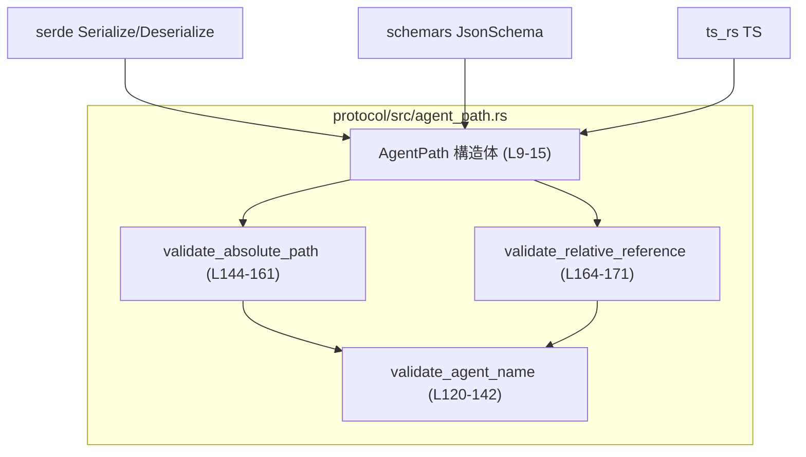
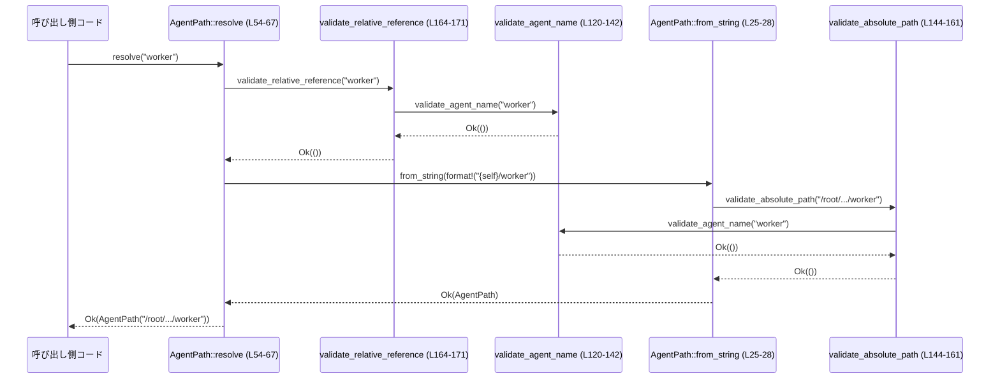

# protocol/src/agent_path.rs コード解説

## 0. ざっくり一言

`AgentPath` は、`/root` を起点とするエージェント階層の **絶対パス** を表現・検証するための型とユーティリティ関数を提供するモジュールです（`protocol/src/agent_path.rs:L9-67, L120-171`）。

---

## 1. このモジュールの役割

### 1.1 概要

- このモジュールは **「`/root` から始まる論理的なエージェントパスを、安全に扱う」** 問題を解決するために存在し、`AgentPath` 構造体とそのバリデーションロジックを提供します（`L9-15, L17-68`）。
- 文字列から `AgentPath` を生成する際に、**形式・予約語・許可される文字** などを検証し、不正なパスを早期に拒否します（`L25-28, L49-52, L54-67, L120-171`）。
- Serde / schemars / ts-rs の属性により、**シリアライズ時は単なる文字列として扱いつつ、逆シリアライズ時に検証をかける** 設計になっています（`L9-15`）。

### 1.2 アーキテクチャ内での位置づけ

このモジュール単体では外部モジュールへの依存は最小限で、主に標準ライブラリとシリアライゼーション関連クレートに依存しています。

- 外部依存:
  - `serde::{Serialize, Deserialize}`（シリアライズ/デシリアライズ）`L2-3`
  - `schemars::JsonSchema`（JSON Schema 生成）`L1`
  - `ts_rs::TS`（TypeScript 型生成）`L7`
  - 標準ライブラリの `fmt`, `Deref`, `FromStr` など `L4-6`

`AgentPath` 自体は他モジュールには依存しておらず、**ドメイン値オブジェクト** として他の層（設定・RPC・内部ロジック）から利用される想定です。このチャンクには、`AgentPath` を使う他モジュールは現れません（不明）。



### 1.3 設計上のポイント

- **不変な値オブジェクト**  
  - `AgentPath` は内部に `String` を 1 つだけ持つ新しい型です（`L15`）。
  - メソッドは全て `&self` を取り、内部状態を書き換えません（`L21-67, L30-38, L49-54`）。
- **強い不変条件（invariant）**  
  - 生成経路（`from_string`, `join`, `resolve`, `TryFrom` など）で必ずバリデーション関数を通し、  
    「`/root` から始まる」「末尾に `/` がない」「各セグメントがルールに従う」といった条件を保証します（`L25-28, L49-52, L54-67, L120-171`）。
- **エラー処理**  
  - 失敗は全て `Result<_, String>` で表現し、エラー内容をそのままユーザー向けメッセージにできる形で保持します（例: `agent_name must use only lowercase letters...` `L137-139`）。
  - ライブラリ本体には `panic!` 相当の処理はありません（`L21-171` に `panic`, `unwrap` などは登場しません）。
- **シリアライズ境界での検証**  
  - `#[serde(try_from = "String", into = "String")]` により、serde 経由のデータ流入時にも必ず `TryFrom<String>` → `from_string` → バリデーションが走る構造です（`L12, L70-75`）。
- **並行性**  
  - 内部は `String` のみで、ミューテーションや共有可変状態はなく、関数も純粋関数的です。  
    Rust の自動トレイトのルールから、`AgentPath` は `Send` / `Sync` として扱える設計になっています（`L15`）。

---

## 2. 主要なコンポーネント一覧（インベントリー）

### 2.1 型・定数

| 名前 | 種別 | 公開 | 役割 / 用途 | 定義位置 |
|------|------|------|-------------|----------|
| `AgentPath` | 構造体（新しい型） | 公開 | `/root` を起点としたエージェントの絶対パスを表現し、不変条件付きで保持する | `protocol/src/agent_path.rs:L9-15` |
| `ROOT` | 関連定数 | 公開 | ルートパスを表す文字列リテラル `"/root"` | `protocol/src/agent_path.rs:L18-18` |
| `ROOT_SEGMENT` | 関連定数 | 非公開 | ルートのセグメント名 `"root"`。`name()` など内部処理専用 | `protocol/src/agent_path.rs:L19-19` |

### 2.2 メソッド・関数

**`AgentPath` の公開 API（メソッド・関連関数）**

| 名称 | 種別 | 概要 | 定義位置 |
|------|------|------|----------|
| `AgentPath::root()` | 関連関数 | ルートパス `/root` を表す `AgentPath` を生成する | `protocol/src/agent_path.rs:L21-23` |
| `AgentPath::from_string(path: String)` | 関連関数 | 与えられた文字列を検証し、有効なら `AgentPath` に変換する | `protocol/src/agent_path.rs:L25-28` |
| `AgentPath::as_str(&self)` | メソッド | 内部文字列への `&str` ビューを返す | `protocol/src/agent_path.rs:L30-32` |
| `AgentPath::is_root(&self)` | メソッド | パスが `/root` かどうかを判定する | `protocol/src/agent_path.rs:L34-36` |
| `AgentPath::name(&self)` | メソッド | パス末尾のセグメント名（エージェント名）を返す | `protocol/src/agent_path.rs:L38-47` |
| `AgentPath::join(&self, agent_name: &str)` | メソッド | 子エージェント名を現在のパスに連結して新しい `AgentPath` を作る | `protocol/src/agent_path.rs:L49-52` |
| `AgentPath::resolve(&self, reference: &str)` | メソッド | 相対/絶対参照文字列を現在のパスから解決し、新しい `AgentPath` を返す | `protocol/src/agent_path.rs:L54-67` |

**変換・ユーティリティ実装（トレイト impl）**

| 名称 | 種別 | 概要 | 定義位置 |
|------|------|------|----------|
| `impl TryFrom<String> for AgentPath` | トレイト実装 | 検証付きで `String` → `AgentPath` を行う | `protocol/src/agent_path.rs:L70-75` |
| `impl TryFrom<&str> for AgentPath` | トレイト実装 | 検証付きで `&str` → `AgentPath` を行う | `protocol/src/agent_path.rs:L78-83` |
| `impl From<AgentPath> for String` | トレイト実装 | `AgentPath` の内部文字列を取り出して `String` にする | `protocol/src/agent_path.rs:L86-89` |
| `impl FromStr for AgentPath` | トレイト実装 | 文字列からのパース（`"..."`.parse::<AgentPath>()`）を可能にする | `protocol/src/agent_path.rs:L92-97` |
| `impl AsRef<str> for AgentPath` | トレイト実装 | `&AgentPath` を `&str` として参照するための共通インターフェイス | `protocol/src/agent_path.rs:L100-103` |
| `impl Deref<Target = str> for AgentPath` | トレイト実装 | `*agent_path` やメソッドチェーンで `str` として扱えるようにする | `protocol/src/agent_path.rs:L106-111` |
| `impl fmt::Display for AgentPath` | トレイト実装 | `{}` で人間向け表示（内部文字列）を出力する | `protocol/src/agent_path.rs:L114-117` |

**内部バリデーション関数**

| 名称 | 公開 | 概要 | 定義位置 |
|------|------|------|----------|
| `validate_agent_name(agent_name: &str)` | 非公開 | エージェント名が許可された形式（小文字・数字・`_`）かを検証し、予約語や `/` を禁止する | `protocol/src/agent_path.rs:L120-142` |
| `validate_absolute_path(path: &str)` | 非公開 | 絶対パス文字列が `/root` から始まり、末尾 `/` がなく、全セグメントが有効かを検証する | `protocol/src/agent_path.rs:L144-161` |
| `validate_relative_reference(reference: &str)` | 非公開 | 相対参照中の各セグメントが有効なエージェント名かを検証し、末尾 `/` を禁止する | `protocol/src/agent_path.rs:L164-171` |

**テスト**

| 名称 | 種別 | 概要 | 定義位置 |
|------|------|------|----------|
| `root_has_expected_name` | テスト関数 | ルートパス生成と `name`/`is_root` の挙動を検証 | `protocol/src/agent_path.rs:L180-185` |
| `join_builds_child_paths` | テスト関数 | `join` による子パス生成を検証 | `protocol/src/agent_path.rs:L188-193` |
| `resolve_supports_relative_and_absolute_references` | テスト関数 | `resolve` が相対/絶対参照を正しく解決することを検証 | `protocol/src/agent_path.rs:L195-205` |
| `invalid_names_and_paths_are_rejected` | テスト関数 | 不正な名前・パスが `Err` になることを検証 | `protocol/src/agent_path.rs:L208-221` |

---

## 3. 公開 API と詳細解説

### 3.1 型一覧（構造体・列挙体など）

| 名前 | 種別 | 役割 / 用途 | 主な関連関数・トレイト | 定義位置 |
|------|------|-------------|------------------------|----------|
| `AgentPath` | 構造体 | `/root` から始まるエージェントの絶対パスを表す値オブジェクト。生成時に形式検証を行い、不変条件を保証する | `root`, `from_string`, `join`, `resolve`, `name`, `is_root`, `TryFrom`, `FromStr`, `Display` など | `protocol/src/agent_path.rs:L9-15` |

### 3.2 関数詳細（7 件）

#### `AgentPath::from_string(path: String) -> Result<Self, String>`

**概要**

- 生の `String` から `AgentPath` を生成する主要コンストラクタです（`L25-28`）。
- 内部で `validate_absolute_path` を呼び出し、不正な形式のパスを拒否します。

**定義位置**

- `protocol/src/agent_path.rs:L25-28`

**引数**

| 引数名 | 型 | 説明 |
|--------|----|------|
| `path` | `String` | 絶対パス形式（`/root/...`）の文字列。検証対象。 |

**戻り値**

- `Result<AgentPath, String>`  
  - `Ok(AgentPath)` : 検証に成功した場合のパスオブジェクト。  
  - `Err(String)` : 検証エラー時のメッセージ（人間が読める英語文）。

**内部処理の流れ**

1. `validate_absolute_path(path.as_str())` を呼び出し、形式を検証する（`L26`）。
2. エラーならそのまま `Err` として返す（`?` 演算子で早期リターン）。
3. 検証成功時は `Ok(Self(path))` で新しい `AgentPath` を返す（`L27-28`）。

**Examples（使用例）**

```rust
use std::convert::TryFrom;
use protocol::agent_path::AgentPath; // 仮のモジュールパス

fn main() -> Result<(), String> {
    // 有効な絶対パスから AgentPath を生成する                             
    let path_str = "/root/researcher/worker".to_string();       // 絶対パス文字列を用意
    let agent_path = AgentPath::from_string(path_str)?;          // 検証付きで AgentPath に変換

    println!("{}", agent_path);                                 // Display 実装により文字列として出力

    Ok(())
}
```

**Errors / Panics**

- `Err` になる条件（`validate_absolute_path` 由来、`L144-161`）:
  - 先頭が `/` でない（`strip_prefix('/')` に失敗） → `"absolute agent paths must start with`/root`"`（`L145-147`）
  - `/` の後ろの最初のセグメントが存在しない → `"absolute agent path must not be empty"`（`L148-151`）
  - 最初のセグメントが `"root"` 以外 → `"absolute agent paths must start with`/root`"`（`L152-154`）
  - 末尾が `/` で終わる → `"absolute agent path must not end with`/`"`（`L155-157`）
  - それ以外のセグメントのいずれかが不正なエージェント名（`validate_agent_name` が `Err`）`L158-160`。
- ライブラリコード側で `panic` が発生する可能性は見当たりません（`L25-28`）。

**Edge cases（エッジケース）**

- 空文字列 `""` を渡した場合  
  - `strip_prefix('/')` に失敗し、`Err("absolute agent paths must start with`/root`")`（`L145-147`）。
- `"/"` や `"/root/"` のような末尾 `/``:
  - `"/"` は root セグメントが空のため `"absolute agent path must not be empty"`（`L148-151`）。
  - `"/root/"` は `stripped.ends_with('/')` で弾かれ `"absolute agent path must not end with`/`"`（`L155-157`）。
- セグメントに大文字やハイフンが含まれる場合  
  - `validate_agent_name` により `"agent_name must use only lowercase letters, digits, and underscores"`（`L133-139`）。

**使用上の注意点**

- 入力は常に **絶対パス** を想定しており、相対パス（例: `"worker"`）はこの関数では受け付けません。相対指定には `resolve` を使用します。
- ユーザー入力をそのまま渡す場合、エラーメッセージを UI やログに表示する想定で `String` エラーが返ることに注意します。

---

#### `AgentPath::resolve(&self, reference: &str) -> Result<Self, String>`

**概要**

- 現在の `AgentPath` を基準に、**相対 / 絶対 参照文字列** を新しい `AgentPath` に解決する関数です（`L54-67`）。
- 相対参照は `"child/grandchild"` のような形式を取り、絶対参照は `"/root/..."` 形式を取ります。

**定義位置**

- `protocol/src/agent_path.rs:L54-67`

**引数**

| 引数名 | 型 | 説明 |
|--------|----|------|
| `&self` | `&AgentPath` | 基準となる現在のパス。 |
| `reference` | `&str` | 相対または絶対の参照文字列。空文字列は禁止。 |

**戻り値**

- `Result<AgentPath, String>`  
  - 成功時: 解決された絶対パス。  
  - 失敗時: 相対・絶対パスとして不正な場合のエラーメッセージ。

**内部処理の流れ**

1. `reference.is_empty()` をチェックし、空文字列なら `"agent path must not be empty"` の `Err`（`L55-57`）。
2. `reference == "/root"` なら常に `Ok(Self::root())` を返す（`L58-60`）。
3. `reference.starts_with('/')` なら絶対パス参照とみなし、`Self::try_from(reference)` を呼ぶ（`L61-62`）。  
   - ここで `TryFrom<&str>` → `from_string` → `validate_absolute_path` が呼ばれます（`L78-83, L25-28, L144-161`）。
4. それ以外は相対参照とみなし、`validate_relative_reference(reference)` で検証（`L65`）。
5. 検証後、`format!("{self}/{reference}")` で新しい絶対パス文字列を組み立て、`from_string` で `AgentPath` を生成（`L66`）。

**Examples（使用例）**

```rust
use protocol::agent_path::AgentPath; // 仮のパス

fn main() -> Result<(), String> {
    // 基準となる現在のパスを作成する                                   
    let current = AgentPath::from_string("/root/researcher".to_string())?;   // /root/researcher

    // 相対参照を解決する                                                  
    let worker = current.resolve("worker")?;                                 // /root/researcher/worker
    assert_eq!(worker.as_str(), "/root/researcher/worker");

    // 絶対参照を解決する                                                  
    let other = current.resolve("/root/other")?;                             // /root/other
    assert_eq!(other.as_str(), "/root/other");

    Ok(())
}
```

**Errors / Panics**

- `Err` になる条件:
  - `reference` が空文字列 → `"agent path must not be empty"`（`L55-57`）。
  - 絶対参照の場合: `Self::try_from(reference)` の内部で `validate_absolute_path` が失敗したとき（前項参照）。
  - 相対参照の場合: `validate_relative_reference(reference)` が失敗したとき（`L65, L164-171`）。
- `panic` は使用していません（`L54-67`）。

**Edge cases（エッジケース）**

- `"."` や `".."` を含む相対参照:
  - `validate_relative_reference` 内で `validate_agent_name` が `"agent_name`.`is reserved"` / `"agent_name`..`is reserved"` を返します（`L127-129`）。
- `reference` が `"worker/"` のように末尾 `/` の場合:
  - `"relative agent path must not end with`/`"` の `Err`（`L165-167`）。
- 多段セグメント `"worker/sub"`:
  - `reference.split('/')` で分割し、各セグメントを `validate_agent_name` で検証（`L168-170`）。

**使用上の注意点**

- `"../sibling"` のような **親ディレクトリ参照はサポートしていません**。`.` / `..` は予約済みでありエラーになります（`L127-129`）。
- `reference` をユーザー入力から受ける場合、エラーメッセージはそのまま UI に出しても意味がわかる形式です（英語）。
- `self` は変更されず、新しい `AgentPath` が常に返されるため、イミュータブルに扱えます。

---

#### `AgentPath::join(&self, agent_name: &str) -> Result<Self, String>`

**概要**

- 現在の `AgentPath` に **1 セグメントの子エージェント名** を連結し、新しい `AgentPath` を作るメソッドです（`L49-52`）。
- 内部で `validate_agent_name` と `from_string` を通すことで、不変条件を保ちます。

**定義位置**

- `protocol/src/agent_path.rs:L49-52`

**引数**

| 引数名 | 型 | 説明 |
|--------|----|------|
| `&self` | `&AgentPath` | 親の絶対パス。 |
| `agent_name` | `&str` | 子エージェントの名前（1 セグメント）。`/` を含めてはいけません。 |

**戻り値**

- `Result<AgentPath, String>`  
  - 成功時: 連結された絶対パス。  
  - 失敗時: `agent_name` が不正な場合のエラーメッセージ。

**内部処理の流れ**

1. `validate_agent_name(agent_name)` でエージェント名を検証（`L50`）。
2. 検証に失敗するとそのまま `Err` を返す。
3. `format!("{self}/{agent_name}")` で新しいパス文字列 `/root/.../agent_name` を組み立て（`L51`）。
4. `Self::from_string` を通して絶対パスとして再検証し、`AgentPath` を返す（`L51`）。

**Examples（使用例）**

```rust
use protocol::agent_path::AgentPath;

fn main() -> Result<(), String> {
    let root = AgentPath::root();                             // /root を取得
    let child = root.join("researcher")?;                      // /root/researcher
    assert_eq!(child.as_str(), "/root/researcher");

    // さらに子をつなげる                                            
    let worker = child.join("worker")?;                        // /root/researcher/worker
    assert_eq!(worker.as_str(), "/root/researcher/worker");

    Ok(())
}
```

**Errors / Panics**

- `Err` になる条件（`validate_agent_name` 由来、`L120-142`）:
  - 空文字列 → `"agent_name must not be empty"`（`L121-123`）
  - `"root"` → `"agent_name`root`is reserved"`（`L124-126`）
  - `"."`, `".."` → `"agent_name`.`is reserved"` / `"agent_name`..`is reserved"`（`L127-129`）
  - `'/'` を含む → `"agent_name must not contain`/`"`（`L130-132`）
  - 小文字・数字・`_` 以外の文字を含む → `"agent_name must use only lowercase letters, digits, and underscores"`（`L133-139`）

**Edge cases（エッジケース）**

- `agent_name` に `"BadName"` のように大文字を含めると `Err` になります。  
  実際にテスト `invalid_names_and_paths_are_rejected` で検証されています（`L209-213`）。
- 多段セグメント（`"a/b"`）には対応していないため、`agent_name.contains('/')` で弾かれます（`L130-132`）。

**使用上の注意点**

- **1 セグメント専用** のメソッドです。複数階層をまとめて追加する場合は `resolve("child/grandchild")` を使います。
- `join` の結果も再び `join` できるため、ループで深い階層を構築する用途にも適しています。

---

#### `AgentPath::name(&self) -> &str`

**概要**

- `AgentPath` が表すパスの **末尾セグメント名（エージェント名）** を返します（`L38-47`）。
- `/root` 自体に対しては `"root"` を返します。

**定義位置**

- `protocol/src/agent_path.rs:L38-47`

**引数**

| 引数名 | 型 | 説明 |
|--------|----|------|
| `&self` | `&AgentPath` | セグメント名を取得したいパス。 |

**戻り値**

- `&str`  
  - `/root/parent/child` → `"child"`  
  - `/root` → `"root"`（特別扱い）

**内部処理の流れ**

1. `self.is_root()` が `true` のときは即座に `ROOT_SEGMENT`（`"root"`）を返す（`L39-41`）。
2. それ以外の場合:
   - `self.as_str()` で内部文字列へアクセス（`L42`）。
   - `rsplit('/')` で末尾から `/` 区切りにセグメントをたどり（`L43`）、
   - `.next()` で最後のセグメントを取り出す（`L44`）。
   - `.filter(|segment| !segment.is_empty())` で空セグメント（理論上あり得ないが防御的）を除外（`L45`）。
   - `.unwrap_or(Self::ROOT_SEGMENT)` で、万一空の場合に `"root"` を返す（`L46`）。

**Examples（使用例）**

```rust
use protocol::agent_path::AgentPath;

fn main() -> Result<(), String> {
    let root = AgentPath::root();                             // /root
    assert_eq!(root.name(), "root");                          // ルートの名前は "root"

    let worker = root.join("researcher")?
                      .join("worker")?;                       // /root/researcher/worker
    assert_eq!(worker.name(), "worker");                      // 末尾セグメント名

    Ok(())
}
```

**Errors / Panics**

- `panic` を起こす要素はありません。`unwrap_or` を使用しているため、`None` の場合でも `"root"` を返します（`L46`）。

**Edge cases（エッジケース）**

- `/root` → `"root"`（`is_root()` が `true` なので特別扱い、`L39-41`）。
- 不正なパス文字列は `AgentPath` として生成できないため、`name` が扱うのは常に正規の絶対パスのみです。

**使用上の注意点**

- このメソッドはパスの末尾の識別子（エージェント名）を取得する用途に向きます。親パスを取得する機能は実装されていません（このチャンクには現れません）。

---

#### `validate_agent_name(agent_name: &str) -> Result<(), String>`

**概要**

- エージェント名 1 セグメントがルールに従っているかを検証する内部関数です（`L120-142`）。
- `join`, `validate_absolute_path`, `validate_relative_reference` の共通基盤です。

**定義位置**

- `protocol/src/agent_path.rs:L120-142`

**引数**

| 引数名 | 型 | 説明 |
|--------|----|------|
| `agent_name` | `&str` | 検証対象のエージェント名（1 セグメント）。 |

**戻り値**

- `Result<(), String>`  
  - `Ok(())` : 問題なし。  
  - `Err(String)` : 違反理由を説明するメッセージ。

**内部処理の流れ**

1. 空文字列を禁止（`is_empty()`） → `"agent_name must not be empty"`（`L121-123`）。
2. `"root"` を予約語として禁止 → `"agent_name`root`is reserved"`（`L124-126`）。
3. `"."` と `".."` を予約語として禁止 → `"agent_name`.`is reserved"` / `"agent_name`..`is reserved"`（`L127-129`）。
4. `'/'` を含む場合を禁止 → `"agent_name must not contain`/`"`（`L130-132`）。
5. 許可される文字を `chars().all(|ch| ch.is_ascii_lowercase() || ch.is_ascii_digit() || ch == '_')` で検証（`L133-136`）。
6. 5 に違反した場合 `"agent_name must use only lowercase letters, digits, and underscores"` を返す（`L137-139`）。
7. 全て通過した場合 `Ok(())` を返す（`L141-142`）。

**Examples（使用例）**

この関数は非公開ですが、`join` 経由で挙動を確認できます。

```rust
use protocol::agent_path::AgentPath;

fn main() {
    let root = AgentPath::root();

    assert!(root.join("valid_name_123").is_ok());              // 有効な名前

    assert_eq!(
        root.join("BadName"),
        Err("agent_name must use only lowercase letters, digits, and underscores".to_string())
    );
}
```

**Errors / Panics**

- すべての失敗パターンで `Err(String)` を返し、`panic` はありません（`L120-142`）。

**Edge cases（エッジケース）**

- `"root"` / `"."` / `".."` は明示的に予約語として禁止されています（`L124-129`）。
- 空文字列 `""` は `"must not be empty"` で拒否（`L121-123`）。
- Unicode 文字は許可されません。`is_ascii_lowercase` / `is_ascii_digit` で判定しているためです（`L133-136`）。

**使用上の注意点**

- この関数は 1 セグメント想定です。複数セグメントを含む文字列には直接使わず、`validate_relative_reference` のように `split('/')` した結果に対して使う必要があります。

---

#### `validate_absolute_path(path: &str) -> Result<(), String>`

**概要**

- `/root` から始まる絶対パス文字列の形式を検証する内部関数です（`L144-161`）。
- `AgentPath::from_string` および `TryFrom` 実装の根幹となるロジックです。

**定義位置**

- `protocol/src/agent_path.rs:L144-161`

**引数**

| 引数名 | 型 | 説明 |
|--------|----|------|
| `path` | `&str` | 検証対象の絶対パス文字列。 |

**戻り値**

- `Result<(), String>`  
  - `Ok(())` : 有効な絶対パス。  
  - `Err(String)` : 形式違反の理由。

**内部処理の流れ**

1. `path.strip_prefix('/')` で先頭の `/` を削除。失敗したら `"absolute agent paths must start with`/root`"`（`L145-147`）。
2. `stripped.split('/')` でセグメント列に分割し、最初のセグメント `root` を取り出す（`L148-150`）。
   - 取得できなければ `"absolute agent path must not be empty"`（`L150-151`）。
3. 最初のセグメントが `"root"` でなければ `"absolute agent paths must start with`/root`"`（`L152-154`）。
4. `stripped.ends_with('/')` なら `"absolute agent path must not end with`/`"`（`L155-157`）。
5. 残りのセグメントをループし、すべて `validate_agent_name` で検証（`L158-160`）。
6. 全て通れば `Ok(())`（`L161`）。

**Examples（使用例）**

```rust
use protocol::agent_path::AgentPath;

fn main() {
    // 有効な絶対パス                                                      
    assert!(AgentPath::from_string("/root/a_b/worker1".to_string()).is_ok());

    // 無効: /root で始まらない                                            
    assert_eq!(
        AgentPath::from_string("/not-root".to_string()),
        Err("absolute agent paths must start with `/root`".to_string())
    );
}
```

**Errors / Panics**

- すべて `Err(String)` で表現され、`panic` はありません。

**Edge cases（エッジケース）**

- `/root` 自体は:
  - `stripped` は `"root"` となり、追加セグメントなし → 問題なく `Ok(())`。
- `/`, `/root/`:
  - `/` は root セグメントが空で `"absolute agent path must not be empty"`。
  - `/root/` は末尾スラッシュで `"absolute agent path must not end with`/`"`。

**使用上の注意点**

- この関数は **絶対パス専用** です。相対パスは `validate_relative_reference` を使う必要があります。
- エラーメッセージは絶対パス前提の文言なので、呼び出し側で誤用すると文脈と合わないメッセージになる可能性があります。

---

#### `validate_relative_reference(reference: &str) -> Result<(), String>`

**概要**

- `"child/grandchild"` のような相対参照文字列を検証する内部関数です（`L164-171`）。
- `AgentPath::resolve` の相対参照ケースで使用されます。

**定義位置**

- `protocol/src/agent_path.rs:L164-171`

**引数**

| 引数名 | 型 | 説明 |
|--------|----|------|
| `reference` | `&str` | 相対参照文字列（`/` から始めない）。 |

**戻り値**

- `Result<(), String>`  
  - `Ok(())` : 全セグメントが有効。  
  - `Err(String)` : 末尾 `/` や不正なセグメント名が含まれる。

**内部処理の流れ**

1. 末尾が `/` かどうかをチェックし、そうであれば `"relative agent path must not end with`/`"` を返す（`L165-167`）。
2. `reference.split('/')` でセグメントに分割し、各セグメントに `validate_agent_name` を適用（`L168-170`）。
3. 全てのセグメントが通過すれば `Ok(())`（`L171`）。

**Examples（使用例）**

`resolve` を介して利用されます。

```rust
use protocol::agent_path::AgentPath;

fn main() -> Result<(), String> {
    let base = AgentPath::from_string("/root/researcher".to_string())?;

    // 有効な相対参照                                                       
    let ok = base.resolve("worker/sub")?;
    assert_eq!(ok.as_str(), "/root/researcher/worker/sub");

    // 無効: 末尾スラッシュ                                                 
    assert_eq!(
        base.resolve("worker/"),
        Err("relative agent path must not end with `/`".to_string())
    );

    Ok(())
}
```

**Errors / Panics**

- 末尾スラッシュ → `"relative agent path must not end with`/`"`（`L165-167`）。
- 各セグメントの検証失敗 → `validate_agent_name` のエラーメッセージ（前述）。

**Edge cases（エッジケース）**

- `"."` や `".."` を含むセグメントは予約語として禁止されます（`L127-129`）。
- 空文字列は `resolve` 側で既に禁止されており（`L55-57`）、この関数には渡りません。

**使用上の注意点**

- ここでは先頭 `/` の有無をチェックしません。呼び出し側（`resolve`）で、絶対/相対の切り替えを行う設計です（`L61-63`）。

---

#### `AgentPath::root() -> Self`

**概要**

- 絶対パス `/root` を表す `AgentPath` を返す定番コンストラクタです（`L21-23`）。

**定義位置**

- `protocol/src/agent_path.rs:L21-23`

**引数**

- なし。

**戻り値**

- `AgentPath` : 文字列 `"/root"` を内部に持つインスタンス。

**内部処理の流れ**

1. `Self::ROOT`（`"/root"`）を `to_string()` で `String` にして（`L22`）。
2. それを `Self(...)` で包んで `AgentPath` を返します（`L22`）。

**Examples（使用例）**

```rust
use protocol::agent_path::AgentPath;

fn main() {
    let root = AgentPath::root();                           // /root
    assert!(root.is_root());                                // true
    assert_eq!(root.as_str(), "/root");                     // 内部表現
}
```

**Errors / Panics**

- 失敗の可能性はありません（固定文字列からの生成のみ）。

**Edge cases（エッジケース）**

- 特になし。

**使用上の注意点**

- ルートオブジェクトを作る際は、文字列 `"/root"` から作るのではなく、この関数を使う方が安全で意図が明確です。

---

### 3.3 その他の関数・トレイト実装（概要）

| 関数 / 実装 | 役割（1 行） | 定義位置 |
|-------------|--------------|----------|
| `AgentPath::as_str(&self) -> &str` | 内部 `String` の `&str` へのビューを返すシンプルなアクセサ | `protocol/src/agent_path.rs:L30-32` |
| `AgentPath::is_root(&self) -> bool` | 内部文字列が `"/root"` と一致するか判定するヘルパー | `protocol/src/agent_path.rs:L34-36` |
| `impl TryFrom<String> for AgentPath` | `AgentPath::from_string` をラップし、`TryFrom` インターフェイスを提供 | `protocol/src/agent_path.rs:L70-75` |
| `impl TryFrom<&str> for AgentPath` | `value.to_string()` → `from_string` で `&str` からの変換に対応 | `protocol/src/agent_path.rs:L78-83` |
| `impl From<AgentPath> for String` | 所有権を消費して内部 `String` を取り出す | `protocol/src/agent_path.rs:L86-89` |
| `impl FromStr for AgentPath` | `"...".parse::<AgentPath>()` でのパースを提供 | `protocol/src/agent_path.rs:L92-97` |
| `impl AsRef<str> for AgentPath` | 汎用的な `AsRef` インターフェイスで `&str` として扱えるようにする | `protocol/src/agent_path.rs:L100-103` |
| `impl Deref<Target = str> for AgentPath` | `&*agent_path` などで直接 `str` として操作可能にする | `protocol/src/agent_path.rs:L106-111` |
| `impl fmt::Display for AgentPath` | `{}` フォーマットで内部文字列を出力 | `protocol/src/agent_path.rs:L114-117` |

---

## 4. データフロー

### 4.1 代表的なシナリオの説明

典型的なデータフローは、「文字列入力 → `AgentPath` への変換 → 相対パスの解決」という流れです。

1. 外部から JSON などで `"/root/researcher"` のような文字列が渡される。
2. Serde によるデシリアライズで `String` → `AgentPath` へ変換され、その際に `TryFrom<String>` → `from_string` → `validate_absolute_path` → `validate_agent_name` が呼ばれる（`L12, L70-75, L25-28, L144-161, L120-142`）。
3. ランタイム中に、`AgentPath::resolve("worker")` のような相対参照解決が行われ、`validate_relative_reference` → `validate_agent_name` → `from_string` → `validate_absolute_path` の順で検証される（`L54-67, L164-171`）。

### 4.2 シーケンス図（相対参照解決）

以下は `current.resolve("worker")` を呼び出したときのデータフローです。



この図は、**1 回の `resolve` 呼び出しで複数段階の検証ロジックが再利用されている** ことを示しています。

---

## 5. 使い方（How to Use）

### 5.1 基本的な使用方法

ルートから子エージェントパスを組み立て、さらに相対参照を解決する一連の流れの例です。

```rust
use std::convert::TryFrom;
use protocol::agent_path::AgentPath; // 実際のクレートパスに合わせて調整する

fn main() -> Result<(), String> {
    // ルートパスを取得する                                             
    let root = AgentPath::root();                               // /root

    // 子エージェントをつなげていく                                 
    let researcher = root.join("researcher")?;                  // /root/researcher
    let worker = researcher.join("worker")?;                    // /root/researcher/worker

    // name() で末尾のエージェント名を取得                          
    assert_eq!(worker.name(), "worker");

    // 文字列から直接 AgentPath を作る                              
    let same_worker = AgentPath::try_from("/root/researcher/worker")?;
    assert_eq!(worker, same_worker);

    // 相対参照を解決する                                             
    let other_worker = researcher.resolve("worker")?;           // /root/researcher/worker
    assert_eq!(worker, other_worker);

    Ok(())
}
```

### 5.2 よくある使用パターン

1. **設定ファイルからの読み込み（Serde 経由）**

   `AgentPath` は `Serialize` / `Deserialize` / `JsonSchema` / `TS` を derive しており（`L9-15`）、文字列としてシリアライズされます。

   ```rust
   use serde::Deserialize;
   use protocol::agent_path::AgentPath;

   #[derive(Deserialize)]
   struct Config {
       // JSON 上は "agent_path": "/root/researcher"
       agent_path: AgentPath,                                  // 文字列から自動で検証付き変換
   }

   fn load_config(json: &str) -> Result<Config, serde_json::Error> {
       serde_json::from_str(json)                              // 無効なパスならデシリアライズ時にエラー
   }
   ```

2. **`FromStr` / `TryFrom` を使ったパース**

   ```rust
   use std::str::FromStr;
   use protocol::agent_path::AgentPath;

   fn parse_example() -> Result<(), String> {
       let path = AgentPath::from_str("/root/researcher")?;    // FromStr 実装（L92-97）
       let same = "/root/researcher".parse::<AgentPath>()?;    // 同じく FromStr

       assert_eq!(path, same);
       Ok(())
   }
   ```

3. **`String` との相互変換**

   ```rust
   use protocol::agent_path::AgentPath;

   fn stringify_example() -> Result<(), String> {
       let path = AgentPath::try_from("/root/researcher")?;    // TryFrom<&str>（L78-83）

       // AgentPath -> String
       let s: String = path.clone().into();                    // From<AgentPath> for String（L86-89）
       assert_eq!(s, "/root/researcher");

       Ok(())
   }
   ```

### 5.3 よくある間違い

```rust
use protocol::agent_path::AgentPath;

fn wrong_examples() {
    let root = AgentPath::root();

    // 間違い例 1: 大文字を含むエージェント名                            
    // let child = root.join("BadName").unwrap();               // ここで Err になるので unwrap は危険

    // 正しい例: 小文字 + 数字 + '_' のみを使う                        
    let child_ok = root.join("good_name_1");
    assert!(child_ok.is_ok());

    // 間違い例 2: 絶対パスで /root を付け忘れる                       
    // let invalid = AgentPath::from_string("/not-root".to_string()).unwrap();

    // 正しい例: /root から始める                                     
    let valid = AgentPath::from_string("/root/agent".to_string());
    assert!(valid.is_ok());

    // 間違い例 3: resolve で親参照を使おうとする                      
    // let _ = root.resolve("../sibling").unwrap();             // ".." は予約語でエラーになる

    // 正しい例: 親参照の概念はなく、常に子方向のみ                    
    let _child = root.resolve("child");                         // /root/child
}
```

### 5.4 使用上の注意点（まとめ）

- **入力制約**
  - エージェント名は **ASCII 小文字・数字・`_` のみ** です（`L133-139`）。
  - `"root"`, `"."`, `".."` は予約語として禁止されています（`L124-129`）。
- **パス形式**
  - 絶対パスは **必ず `/root` から始まる** 必要があります（`L145-147, L152-154`）。
  - 絶対・相対ともに **末尾 `/` は禁止** です（`L155-157, L165-167`）。
- **安全性 / セキュリティ**
  - `".."` などを禁止することで、相対パスを用いた階層外への「抜け」が起きないようになっています（`L127-129`）。
  - ただし、これは OS のファイルパスではなく論理パスであり、このチャンクからは実際の利用先（ファイル I/O 等）は分かりません。
- **並行性**
  - `AgentPath` は内部に `String` を 1 つだけ持つイミュータブルな型であり（`L15, L17-68`）、スレッド共有しても内部状態は変化しません。
- **エラー処理**
  - エラーはすべて `Result<_, String>` で返されるため、`?` 演算子で呼び出し元に伝播しやすい反面、エラー種別の静的な分類はされていません。

---

## 6. 変更の仕方（How to Modify）

### 6.1 新しい機能を追加する場合

**例: 親パスを取得する `parent()` を追加したい場合**

1. **`impl AgentPath` 内にメソッドを追加**  
   - `protocol/src/agent_path.rs:L17-68` の `impl AgentPath` ブロックに `pub fn parent(&self) -> Option<Self>` などを定義します。
2. **既存ロジックの再利用**
   - 親パスも絶対パスである必要があるので、内部で文字列操作を行った後、`AgentPath::from_string` を使って再検証するのが一貫した設計です（`L25-28`）。
3. **テストの追加**
   - `mod tests`（`L174-222`）に対応するテストを追加し、`root` の親が `None` になるなどの仕様を確認します。

### 6.2 既存の機能を変更する場合

- **名前規則を変えたい場合**
  - `validate_agent_name`（`L120-142`）のみを変更すれば、`join`, `resolve`, `from_string` など全てに反映されます。
  - 影響範囲は `validate_agent_name` を呼ぶ関数とテスト `invalid_names_and_paths_are_rejected`（`L208-221`）です。
- **ルートの表現を変えたい場合（例: `/agents` にしたい）**
  - `AgentPath::ROOT` および `ROOT_SEGMENT`（`L18-19`）と、`validate_absolute_path` の先頭チェック（`L145-154`）を一貫して変更する必要があります。
  - さらに、既存データとの互換性や他モジュールへの影響（このチャンクには現れません）を確認する必要があります。
- **エラーメッセージの国際化**
  - すべてのエラーメッセージはハードコードされた英語 `String` です（`L121-139, L145-157, L165-167`）。
  - 国際化する場合は、`Result<_, ErrorEnum>` に変更してから表示層でメッセージを組み立てる、といった大きめの変更が必要になります。

---

## 7. 関連ファイル

このチャンクには `AgentPath` を利用する他ファイルは現れません。そのため、以下は一般的な関係性の推測ではなく、「不明」と明示します。

| パス | 役割 / 関係 |
|------|------------|
| （不明） | `AgentPath` をどのモジュールが利用しているかは、このチャンクからは分かりません。 |
| `protocol/src/agent_path.rs` | 本モジュール自身。`AgentPath` の定義・検証ロジック・単体テストを含みます。 |

---

### まとめ（安全性・バグ・テストの観点）

- **安全性**
  - 不変条件を徹底したバリデーションにより、不正なパス文字列を `AgentPath` 型として保持しない設計になっています（`L25-28, L49-52, L54-67, L120-171`）。
  - `panic` を用いず `Result` でエラーを表現しているため、呼び出し側で安全に扱えます。
- **既知のバグ / セキュリティ懸念**
  - このチャンクからは明らかなバグやセキュリティ上の問題は確認できません。
  - 実際の利用シナリオ（ファイルシステム操作など）は不明であり、そのレイヤでのチェックはこのコードでは行っていません。
- **テスト**
  - 主要な機能（ルート生成、`join`, `resolve`, バリデーションエラー）は単体テストでカバーされています（`L179-221`）。

このドキュメントに基づき、`AgentPath` を利用・拡張する際には、**バリデーション関数を経由して不変条件を守る** ことが最も重要なポイントとなります。
