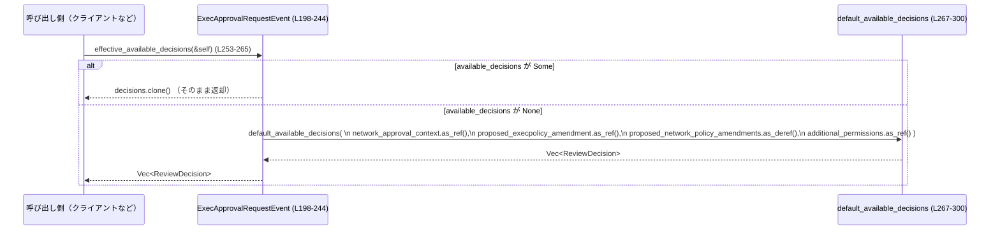

# protocol/src/approvals.rs

## 0. ざっくり一言

このモジュールは、エージェントの実行・パッチ適用・ネットワークアクセス・MCP ツール利用などに対する「承認（approval）」関連のイベント／ペイロード型と、その選択肢（`ReviewDecision`）を導出するためのロジックを定義するモジュールです（根拠: `protocol/src/approvals.rs:L17-196`, `L198-244`, `L267-300`）。

---

## 1. このモジュールの役割

### 1.1 概要

- エージェントがユーザーや「guardian」システムに対して送信する承認リクエスト／評価イベントの **データ構造（スキーマ）** を定義します（`GuardianAssessmentEvent`, `ExecApprovalRequestEvent`, `ApplyPatchApprovalRequestEvent` など）（`L165-196`, `L198-244`, `L352-367`）。
- 実行コマンド・ネットワークアクセス・パッチ適用・MCP ツール呼び出しなど、さまざまな「危険なアクション」を表す共通の `GuardianAssessmentAction` を提供します（`L125-157`）。
- `ExecApprovalRequestEvent` については、ユーザーに提示するレビュー選択肢（`ReviewDecision`）の **デフォルト集合** を決定するポリシーロジックを持ちます（`default_available_decisions`）（`L267-300`）。
- すべて安全な Rust（`unsafe` 不使用）で記述されており、このモジュール単体では I/O や並行処理を行わず、純粋なデータ定義と軽量ロジックにとどまります（コード全体に `unsafe` やスレッド API が現れないことから）（`L1-426`）。

### 1.2 アーキテクチャ内での位置づけ

このモジュールは「プロトコル層」の一部として、他モジュールで定義される型を組み合わせて承認関連イベントを表現します。

- 依存する外部型:
  - `RequestId`（`crate::mcp`）: MCP 関連リクエスト ID（`L1`, `L332-341`）。
  - `PermissionProfile`（`crate::models`）: 追加ファイルシステム権限などをまとめたプロファイル（詳細はこのファイルには現れない）（`L2`, `L233-235`）。
  - `ParsedCommand`（`crate::parse_command`）: コマンドのパース結果（`L3`, `L243`）。
  - `FileSystemSandboxPolicy`, `NetworkSandboxPolicy`（`crate::permissions`）: サンドボックスポリシー（`L4-5`, `L19-21`）。
  - `FileChange`, `ReviewDecision`, `SandboxPolicy`（`crate::protocol`）: ファイル変更の内容・レビュー結果の種類・サンドボックス制御（`L6-8`, `L360`）。

主要な依存関係を Mermaid で表すと次のようになります。

```mermaid
graph TD
    subgraph "protocol::approvals (L17-367)"
        Permissions["Permissions (L17-22)"]
        EscPerms["EscalationPermissions (L24-29)"]
        ExecReq["ExecApprovalRequestEvent (L198-244)"]
        GuardianEvt["GuardianAssessmentEvent (L165-196)"]
        PatchReq["ApplyPatchApprovalRequestEvent (L352-367)"]
        ElicReq["ElicitationRequestEvent (L332-342)"]
    end

    ExecReq -->|uses| ParsedCommand["parse_command::ParsedCommand (参照のみ, 詳細不明)"]
    ExecReq -->|uses| ReviewDecision["protocol::ReviewDecision (参照のみ, 詳細不明)"]
    ExecReq -->|uses| PermissionProfile["models::PermissionProfile (参照のみ, 詳細不明)"]
    ExecReq -->|uses| NetCtx["NetworkApprovalContext (L71-75)"]
    ExecReq -->|uses| ExecAmend["ExecPolicyAmendment (L36-41)"]
    ExecReq -->|uses| NetAmend["NetworkPolicyAmendment (L159-163)"]

    GuardianEvt -->|uses| GuardAction["GuardianAssessmentAction (L125-157)"]
    PatchReq -->|uses| FileChange["protocol::FileChange (参照のみ, 詳細不明)"]

    Permissions -->|wraps| SandboxPolicy["protocol::SandboxPolicy (参照のみ, 詳細不明)"]
    Permissions -->|wraps| FsPolicy["permissions::FileSystemSandboxPolicy (参照のみ, 詳細不明)"]
    Permissions -->|wraps| NetPolicy["permissions::NetworkSandboxPolicy (参照のみ, 詳細不明)"]
```



> 外部モジュール側の詳細な処理内容は、このチャンクには現れないため不明です。

### 1.3 設計上のポイント

- **データ中心設計**  
  ほぼすべてが `struct` / `enum` の定義であり、状態を持たない純粋データオブジェクトとして設計されています（`L17-163`, `L165-196`, `L198-244`, `L303-322`, `L332-350`, `L352-367`）。
- **シリアライズ互換性と後方互換性**  
  - すべての公開型に `Deserialize`, `Serialize`, `JsonSchema`, `TS` 派生が付与されています（`L36`, `L59`, `L71`, `L77`, `L84`, `L93`, `L102`, `L112`, `L118`, `L125`, `L159`, `L165`, `L198`, `L303`, `L332`, `L344`, `L352`）。
  - 多くのフィールドが `#[serde(default, skip_serializing_if = "Option::is_none")]` を持ち、古い送信側から値が欠けていても安全にデシリアライズできるようになっています（例: `GuardianAssessmentEvent::turn_id`, `ExecApprovalRequestEvent::turn_id`, `available_decisions` など）（`L174-176`, `L210-212`, `L240-242`）。
- **ポリシー決定ロジックの局所化**  
  - レビュー選択肢のデフォルト集合は `ExecApprovalRequestEvent::default_available_decisions` に集約されており（`L267-300`）、他からは `effective_available_decisions` 経由で利用する構造になっています（`L253-265`）。
- **安全性（Rust 的観点）**  
  - ファイル全体に `unsafe` ブロックや低レベルメモリ操作は存在せず、すべて安全な抽象のみを利用しています（`L1-426`）。
  - エラーやパニックを起こし得る標準メソッド呼び出し（`unwrap`, `expect`）も公開 API 内には現れません（テスト内は `expect` を使用）（`L375-382`, `L404-405`, `L408-409`）。
- **並行性**  
  - このモジュールはデータ型と純粋関数のみで、スレッド生成や同期原語を直接扱っていません。並行アクセス時の安全性は、これらの型をどのように共有するかを決める上位レイヤーに依存します。

---

## 2. 主要な機能一覧

このモジュールが提供する主な機能は次の通りです。

- 実行承認イベントの表現: `ExecApprovalRequestEvent` により、コマンド実行やネットワークアクセスの承認リクエストを表現（`L198-244`）。
- 実行承認の選択肢決定: `ExecApprovalRequestEvent::effective_available_decisions` / `default_available_decisions` により、ユーザーに提示する `ReviewDecision` の集合を決定（`L253-265`, `L267-300`）。
- Guardian 評価イベントの表現: `GuardianAssessmentEvent` および `GuardianAssessmentAction` 群により、保護システムによるリスク評価・承認／否認プロセスを表現（`L125-157`, `L165-196`）。
- ネットワークポリシー関連: `NetworkApprovalContext` と `NetworkPolicyAmendment` により、特定ホスト・プロトコルに対するネットワーク許可／拒否のコンテキストと変更案を表現（`L71-75`, `L159-163`）。
- Execpolicy 変更提案: `ExecPolicyAmendment` により、特定コマンドプレフィックスを許可する execpolicy ルールの提案を表現（`L31-41`）。
- MCP エリシテーション要求: `ElicitationRequest` / `ElicitationRequestEvent` と `ElicitationAction` により、フォーム／URL ベースの追加情報取得フローを表現（`L303-322`, `L332-342`, `L344-349`）。
- パッチ適用承認: `ApplyPatchApprovalRequestEvent` により、ファイル変更（`FileChange`）とルートディレクトリ許可に関する承認リクエストを表現（`L352-367`）。
- サンドボックス権限の束ね: `Permissions` と `EscalationPermissions` により、ファイルシステム／ネットワークのサンドボックスポリシーや `PermissionProfile` をまとめて表現（`L17-22`, `L24-29`）。

---

## 3. 公開 API と詳細解説

### 3.1 型一覧（構造体・列挙体など）

主要な公開型の一覧です（行番号は定義範囲）。

| 名前 | 種別 | 定義箇所 | 役割 / 用途 |
|------|------|-----------|-------------|
| `Permissions` | 構造体 | `approvals.rs:L17-22` | サンドボックスの総合的な権限セット（`SandboxPolicy`, ファイルシステム／ネットワークサンドボックス）を束ねます。 |
| `EscalationPermissions` | enum | `L24-29` | 権限エスカレーション要求を、`PermissionProfile` または `Permissions` のどちらかで表現します。 |
| `ExecPolicyAmendment` | 構造体 | `L31-41` | execpolicy に追加するコマンドプレフィックス（トークン列）を表現します。JSON では単なる `string` 配列としてシリアライズされます（`#[serde(transparent)]`）（`L36-41`）。 |
| `NetworkApprovalProtocol` | enum | `L59-69` | ネットワーク承認のプロトコル種別（`Http`, `Https`, `Socks5Tcp`, `Socks5Udp`）を表します。 |
| `NetworkApprovalContext` | 構造体 | `L71-75` | ネットワーク承認リクエストのコンテキスト（ホスト名＋プロトコル）を表現します。 |
| `NetworkPolicyRuleAction` | enum | `L77-82` | ネットワークポリシー上のアクション（`Allow`/`Deny`）を表します。 |
| `GuardianRiskLevel` | enum | `L84-91` | Guardian によるリスクレベル（`low`〜`critical`）を表します。 |
| `GuardianUserAuthorization` | enum | `L93-100` | 対話 transcript におけるユーザーの明示的な許可度合いを表現します。 |
| `GuardianAssessmentStatus` | enum | `L102-110` | Guardian 評価プロセスの状態（進行中／承認／否認／タイムアウト／中断）を表します。 |
| `GuardianAssessmentDecisionSource` | enum | `L112-116` | 最終決定を下したソース（現状は `Agent` のみ）を表現します。 |
| `GuardianCommandSource` | enum | `L118-123` | コマンドのソース（`Shell`・`UnifiedExec`）を表現します。 |
| `GuardianAssessmentAction` | enum | `L125-157` | Guardian が評価する具体的アクション（コマンド実行・execve・パッチ適用・ネットワークアクセス・MCP ツール呼び出し）を列挙します。Tagged enum としてシリアライズされます（`type` フィールド）（`L125-127`）。 |
| `NetworkPolicyAmendment` | 構造体 | `L159-163` | 特定ホストに対するネットワークポリシー変更案（`Allow` または `Deny`）を表します。 |
| `GuardianAssessmentEvent` | 構造体 | `L165-196` | 単一の Guardian 評価ライフサイクル（ID, ターン ID, ステータス, リスク, 説明, アクション等）を表すイベントです。 |
| `ExecApprovalRequestEvent` | 構造体 | `L198-244` | コマンド／ネットワークアクセスの承認リクエスト（コマンド列, `cwd`, ネットワークコンテキスト, 追加権限, 提案ポリシー変更, 利用可能な決定肢など）を表します。 |
| `ElicitationRequest` | enum | `L303-322` | ユーザー／外部システムから追加情報を引き出す要求の内容（フォーム入力要求か URL アクセス要求）を表します。 |
| `ElicitationRequestEvent` | 構造体 | `L332-342` | MCP サーバーに起因するエリシテーション要求イベント（ターン ID, サーバー名, リクエスト ID, 内容）を表します。 |
| `ElicitationAction` | enum | `L344-349` | エリシテーションに対するアクション（受諾／拒否／キャンセル）を表します。 |
| `ApplyPatchApprovalRequestEvent` | 構造体 | `L352-367` | パッチ適用に対する承認リクエスト（コール ID, ターン ID, ファイル変更群, 理由, セッション中の write root 許可）を表現します。 |

### 3.2 関数詳細（重要な関数）

#### `ExecPolicyAmendment::new(command: Vec<String>) -> ExecPolicyAmendment`

**定義箇所**: `approvals.rs:L43-46`

**概要**

- コマンドトークン列から新しい `ExecPolicyAmendment` を生成するコンストラクタです。
- JSON/TS では単に `string[]` として扱われます（`#[serde(transparent)]`）（`L36-41`）。

**引数**

| 引数名 | 型 | 説明 |
|--------|----|------|
| `command` | `Vec<String>` | execpolicy に許可プレフィックスとして追加するコマンドトークン列。空であっても特に制約はありません。 |

**戻り値**

- 渡された `command` を内部フィールドとして保持する `ExecPolicyAmendment` を返します。

**内部処理の流れ**

1. 構造体リテラル `Self { command }` でフィールドを初期化するだけです（`L45-46`）。

**Examples（使用例）**

```rust
use crate::protocol::approvals::ExecPolicyAmendment;

// "git status" を許可プレフィックスとして追加したい場合
let amendment = ExecPolicyAmendment::new(vec![
    "git".to_string(),     // 実行ファイル
    "status".to_string(),  // サブコマンド
]);

assert_eq!(amendment.command(), &["git".to_string(), "status".to_string()]);
```

**Errors / Panics**

- この関数自体はエラーもパニックも発生させません。
- メモリ確保に失敗した場合のみ、Rust ランタイムレベルのパニックがあり得ますが、これは全関数共通の性質です。

**Edge cases（エッジケース）**

- `command` が空ベクタの場合: 空のプレフィックスとしてそのまま保持されます。意味づけはこのチャンクには現れないため不明です。

**使用上の注意点**

- 意図しない広いプレフィックスを与えると、execpolicy の許可範囲が必要以上に広がる可能性があります。ポリシー評価側の実装と整合する形でトークン列を構成する必要があります（実際の解釈は他モジュールに依存し、このチャンクには現れません）。

---

#### `ExecApprovalRequestEvent::effective_approval_id(&self) -> String`

**定義箇所**: `approvals.rs:L247-251`

**概要**

- 承認リクエストの「実際の ID」を文字列として返します。
- `approval_id` が存在すればそれを、存在しなければ `call_id` を返します（`L247-251`）。

**引数**

| 引数名 | 型 | 説明 |
|--------|----|------|
| `&self` | `&ExecApprovalRequestEvent` | 対象の承認リクエストイベント。 |

**戻り値**

- `String` 型の ID。  
  - サブコマンドなど細分化された承認には `approval_id` を使用。  
  - それ以外ではコール単位の `call_id` を使用（コメントにも明記）（`L200-208`）。

**内部処理の流れ**

1. `self.approval_id.clone().unwrap_or_else(|| self.call_id.clone())` を評価します（`L248-250`）。
   - `approval_id` が `Some(v)` なら `v.clone()` を返却。
   - `None` ならクロージャ内で `self.call_id.clone()` を返却。

**Examples（使用例）**

```rust
use crate::protocol::approvals::ExecApprovalRequestEvent;
use std::path::PathBuf;

let base_event = ExecApprovalRequestEvent {
    call_id: "call-123".to_string(),  // コマンド実行自体の ID
    approval_id: None,                // サブコマンド ID なし
    turn_id: "turn-1".to_string(),
    command: vec!["ls".to_string()],
    cwd: PathBuf::from("/tmp"),
    reason: None,
    network_approval_context: None,
    proposed_execpolicy_amendment: None,
    proposed_network_policy_amendments: None,
    additional_permissions: None,
    available_decisions: None,
    parsed_cmd: vec![],
};

assert_eq!(base_event.effective_approval_id(), "call-123".to_string());

let sub_event = ExecApprovalRequestEvent {
    approval_id: Some("approval-xyz".to_string()), // サブコマンド用 ID
    ..base_event.clone()
};

assert_eq!(sub_event.effective_approval_id(), "approval-xyz".to_string());
```

**Errors / Panics**

- パニックを起こし得る個所はありません（`unwrap` ではなく `unwrap_or_else` を使用）（`L248-250`）。

**Edge cases**

- `call_id` / `approval_id` が空文字列でも、そのまま返されます。  
  ID の一意性や形式チェックはこの型の責務ではなく、上位レイヤーに委ねられています。

**使用上の注意点**

- ログやトレースで「承認イベント」を識別する場合には、このメソッドを通じて ID を取得することで、サブコマンド承認かどうかを意識せずに扱えます。
- ただし、`call_id` と `approval_id` の関係性（一意性・スコープなど）は別のモジュールで定義されていると考えられ、このチャンクには現れません。

---

#### `ExecApprovalRequestEvent::effective_available_decisions(&self) -> Vec<ReviewDecision>`

**定義箇所**: `approvals.rs:L253-265`

**概要**

- この承認リクエストに対してクライアントがユーザーに提示すべき `ReviewDecision` の一覧を返します。
- `available_decisions` フィールドに値があればそれを優先し、なければ `default_available_decisions` に基づくレガシー互換ロジックで計算します（`L253-265`）。

**引数**

| 引数名 | 型 | 説明 |
|--------|----|------|
| `&self` | `&ExecApprovalRequestEvent` | 対象の承認リクエストイベント。 |

**戻り値**

- `Vec<ReviewDecision>`: ユーザーに提示する選択肢の一覧です。順序は UI にも影響する想定です（コメントより）（`L236-243`）。

**内部処理の流れ**

1. `available_decisions` を `match` でチェックします（`L256-264`）。
2. `Some(decisions)` の場合は `decisions.clone()` を返します。
3. `None` の場合は、`Self::default_available_decisions(...)` を呼び出し、  
   - `network_approval_context`  
   - `proposed_execpolicy_amendment`  
   - `proposed_network_policy_amendments`  
   - `additional_permissions`  
   を `Option` 参照として渡して結果を返却します（`L258-263`）。

**Examples（使用例）**

```rust
use crate::protocol::approvals::{
    ExecApprovalRequestEvent, NetworkApprovalContext, NetworkApprovalProtocol,
    NetworkPolicyAmendment, NetworkPolicyRuleAction,
};
use crate::protocol::ReviewDecision;
use std::path::PathBuf;

// ネットワーク承認コンテキストがあるケース（available_decisions 未指定）
let event = ExecApprovalRequestEvent {
    call_id: "call-1".into(),
    approval_id: None,
    turn_id: "turn-1".into(),
    command: vec!["curl".into(), "https://example.com".into()],
    cwd: PathBuf::from("/tmp"),
    reason: None,
    network_approval_context: Some(NetworkApprovalContext {
        host: "example.com".into(),
        protocol: NetworkApprovalProtocol::Https,
    }),
    proposed_execpolicy_amendment: None,
    proposed_network_policy_amendments: Some(vec![
        NetworkPolicyAmendment {
            host: "example.com".into(),
            action: NetworkPolicyRuleAction::Allow,
        },
    ]),
    additional_permissions: None,
    available_decisions: None,   // レガシー互換ロジックにフォールバック
    parsed_cmd: vec![],
};

let decisions = event.effective_available_decisions();
// decisions は [Approved, ApprovedForSession, NetworkPolicyAmendment{...}, Abort] の順になります。
assert!(decisions.len() >= 3);
assert_eq!(decisions.first(), Some(&ReviewDecision::Approved));
```

**Errors / Panics**

- `clone` と `Vec` 生成のみであり、通常の使用で panic 条件はありません。
- `available_decisions` が巨大なベクタでもそのままクローンされるため、メモリ使用量は呼び出し側で考慮する必要があります。

**Edge cases**

- `available_decisions` が `Some(vec![])`（空ベクタ）の場合も、そのまま空の選択肢が返ります。この挙動で問題がないかは上位の仕様次第です。
- `available_decisions` に「意味のない」`ReviewDecision` が入っていても、一切検証せずにそのまま返します。安全性や UX は送信側の責務です。

**使用上の注意点**

- 新しいクライアントは `available_decisions` を尊重しつつ、古い送信側との互換性のためにこのメソッドを使用するとよい設計になっています（コメントより）（`L254-255`, `L236-243`）。
- セキュリティ観点からは、`available_decisions` に期待以上の権限付与オプションが含まれていないかを送信側・受信側の両方で設計・レビューする必要があります（このモジュールは検証を行いません）。

---

#### `ExecApprovalRequestEvent::default_available_decisions(...) -> Vec<ReviewDecision>`

**定義箇所**: `approvals.rs:L267-300`

**概要**

- `ExecApprovalRequestEvent` 内のコンテキスト（ネットワーク・追加権限・execpolicy 提案など）に応じて、レガシー互換なデフォルトのレビュー決定肢集合を構築します。
- `effective_available_decisions` から内部的に利用されます（`L258-263`）。

**引数**

| 引数名 | 型 | 説明 |
|--------|----|------|
| `network_approval_context` | `Option<&NetworkApprovalContext>` | ネットワークアクセスに対する承認文脈。`Some` ならネットワーク関連の決定肢が優先されます（`L268-273`）。 |
| `proposed_execpolicy_amendment` | `Option<&ExecPolicyAmendment>` | execpolicy 変更提案。ネットワーク承認ではない場合に `ApprovedExecpolicyAmendment` を追加するかどうかを決定します（`L269`, `L292-297`）。 |
| `proposed_network_policy_amendments` | `Option<&[NetworkPolicyAmendment]>` | 将来のネットワークポリシー変更候補。`Allow` アクションのものが一つ選ばれます（`L270`, `L275-282`）。 |
| `additional_permissions` | `Option<&PermissionProfile>` | 追加ファイルシステム権限要求の有無。ネットワークコンテキストがない場合に `Approved`/`Abort` のみのシンプルなセットに切り替えます（`L271`, `L288-290`）。 |

**戻り値**

- `Vec<ReviewDecision>`: デフォルトのレビュー決定肢。  
  コンテキストに応じて構築される内容は次の通りです。

**内部処理の流れ（アルゴリズム）**

1. **ネットワークコンテキスト優先**（`L273-286`）  
   `network_approval_context.is_some()` の場合:
   - `decisions = vec![Approved, ApprovedForSession]`（`L274-275`）。
   - `proposed_network_policy_amendments` が `Some` のとき、最初に `Allow` アクションを持つ `NetworkPolicyAmendment` を検索（`L275-279`）。
   - 見つかれば `ReviewDecision::NetworkPolicyAmendment { network_policy_amendment: amendment.clone() }` を追加（`L280-282`）。
   - 最後に `Abort` を追加し（`L284`）、`decisions` を返却（`L285`）。
2. **追加権限コンテキスト**（`L288-290`）  
   `network_approval_context` が `None` かつ `additional_permissions.is_some()` の場合:
   - `[Approved, Abort]` をそのまま返します。
3. **execpolicy コンテキスト（またはデフォルト）**（`L292-299`）  
   上記どちらでもない場合:
   - `decisions = vec![Approved]` として開始（`L292`）。
   - `proposed_execpolicy_amendment` が `Some` なら `ApprovedExecpolicyAmendment { ... }` を追加（`L293-296`）。
   - 最後に `Abort` を追加し（`L298`）、`decisions` を返却（`L299`）。

**Examples（使用例）**

```rust
use crate::protocol::approvals::{
    ExecApprovalRequestEvent, NetworkApprovalContext, NetworkApprovalProtocol,
    ExecPolicyAmendment, NetworkPolicyAmendment, NetworkPolicyRuleAction,
};
use crate::protocol::ReviewDecision;

// 1. ネットワークコンテキストあり + Allow ポリシー提案あり
let decisions_net = ExecApprovalRequestEvent::default_available_decisions(
    Some(&NetworkApprovalContext {
        host: "example.com".into(),
        protocol: NetworkApprovalProtocol::Https,
    }),
    None,
    Some(&[
        NetworkPolicyAmendment {
            host: "example.com".into(),
            action: NetworkPolicyRuleAction::Allow,
        },
    ]),
    None,
);
// decisions_net = [Approved, ApprovedForSession, NetworkPolicyAmendment{...}, Abort]

// 2. ネットワークなし + execpolicy 提案あり
let decisions_exec = ExecApprovalRequestEvent::default_available_decisions(
    None,
    Some(&ExecPolicyAmendment::new(vec!["cargo".into(), "build".into()])),
    None,
    None,
);
// decisions_exec = [Approved, ApprovedExecpolicyAmendment{...}, Abort]
```

**Errors / Panics**

- 入力に依存したパニック条件はありません。
- `proposed_network_policy_amendments` の中に `Allow` が一件もない場合でも、何も追加しないだけで正常終了します（`L275-283`）。

**Edge cases（エッジケース）**

- `network_approval_context.is_some()` かつ `proposed_network_policy_amendments` が `Some(&[])`（空スライス）の場合:
  - `Approved`, `ApprovedForSession`, `Abort` の 3 つのみになります。
- `network_approval_context.is_some()` かつ `additional_permissions.is_some()` の場合:
  - ネットワーク分岐が最優先され、追加権限情報はデフォルト集合の構築には影響しません（`L273-286`）。
- `additional_permissions.is_some()` かつ `proposed_execpolicy_amendment.is_some()` の場合:
  - 追加権限分岐が優先され、`ApprovedExecpolicyAmendment` は追加されません（`L288-290`）。

**使用上の注意点（契約・セキュリティ）**

- この関数は「ポリシーエンジンの一部」です。  
  変更すると UI に提示される選択肢と、それに伴う権限付与の可能性が変わるため、セキュリティレビューが必須の変更点です。
- `NetworkPolicyAmendment` は最初に見つかった `Allow` のみが選択されるため、複数の候補を列挙したい場合は設計を見直す必要があります（現状は 1 件のみ）（`L275-282`）。

---

#### `ElicitationRequest::message(&self) -> &str`

**定義箇所**: `approvals.rs:L324-329`

**概要**

- `ElicitationRequest` のバリアント（`Form` または `Url`）にかかわらず、共通の `message` フィールドへの参照を返します。
- エリシテーションの本文メッセージを簡便に取得するためのユーティリティです。

**引数**

| 引数名 | 型 | 説明 |
|--------|----|------|
| `&self` | `&ElicitationRequest` | 対象のリクエスト。 |

**戻り値**

- `&str`: 内部の `message: String` への参照です（`L311`, `L318-319`）。

**内部処理の流れ**

1. `match self` で `Form` と `Url` をパターンマッチ（`L326-327`）。
2. どちらの分岐でも `message` フィールドへの参照を返します。
   - `Self::Form { message, .. } | Self::Url { message, .. } => message`（`L326-327`）。

**Examples（使用例）**

```rust
use crate::protocol::approvals::ElicitationRequest;
use serde_json::json;

let form_req = ElicitationRequest::Form {
    meta: None,
    message: "Please fill this form".to_string(),
    requested_schema: json!({"type": "object"}),
};

let url_req = ElicitationRequest::Url {
    meta: None,
    message: "Open this URL".to_string(),
    url: "https://example.com".to_string(),
    elicitation_id: "elic-1".to_string(),
};

assert_eq!(form_req.message(), "Please fill this form");
assert_eq!(url_req.message(), "Open this URL");
```

**Errors / Panics**

- 分岐は全バリアントを網羅しており、`unreachable!` なども使用していないため、安全です。
- 所有権・ライフタイム的にも単純な参照返却であり、コンパイル時に保証されます。

**Edge cases**

- `message` が空文字列の場合でも、そのまま空文字列を参照として返します。

**使用上の注意点**

- `&str` を返すため、呼び出し側で `String` が必要なら `.to_string()` などでコピーが必要になります。
- 大きなメッセージに対して繰り返し `message()` を呼んでもコピーは発生しない（参照のみ）ため、パフォーマンス面で問題はありません。

---

### 3.3 その他の関数

補助的な関数や単純なラッパー関数の一覧です。

| 関数名 | 定義箇所 | 役割（1 行） |
|--------|----------|--------------|
| `ExecPolicyAmendment::command(&self) -> &[String]` | `L48-50` | 内部の `command` ベクタをスライスとして返します。 |
| `impl From<Vec<String>> for ExecPolicyAmendment::from(command: Vec<String>) -> Self` | `L53-56` | `Vec<String>` から `ExecPolicyAmendment` への変換を提供し、`into()` での利用を可能にします。 |

> テスト関数 `guardian_assessment_action_deserializes_command_shape` / `guardian_assessment_action_round_trips_execve_shape` は `#[cfg(test)]` 内にあり、公開 API ではありませんが、シリアライズ／デシリアライズ形状の正しさを検証しています（`L369-425`）。

---

## 4. データフロー

ここでは、このモジュール内で唯一の「非トリビアルなロジック」である `ExecApprovalRequestEvent::effective_available_decisions` 周辺のデータフローを示します。

### 4.1 レビュー決定肢導出のフロー

`ExecApprovalRequestEvent` インスタンスから、提示すべき `ReviewDecision` のリストがどのように決まるかを表します。



**要点**

- **明示指定（available_decisions）を最優先**  
  送信側が `available_decisions` を埋めている場合、その意図を尊重してそのまま返します（`L256-258`）。
- **レガシー互換ロジック**  
  古い送信側では `available_decisions` が欠けるため、`default_available_decisions` が `network_approval_context`・`additional_permissions`・`proposed_execpolicy_amendment` などから決定します（`L254-255`, `L267-300`）。
- **副作用はない**  
  いずれの関数も `self` を変更せず、新しい `Vec<ReviewDecision>` を構築して返すのみです。

---

## 5. 使い方（How to Use）

### 5.1 基本的な使用方法: 実行承認イベント

典型的なフローは「承認イベントの構築 → 利用可能な決定肢の取得 → UI 表示／選択結果送信」です。

```rust
use crate::protocol::approvals::{
    ExecApprovalRequestEvent, NetworkApprovalContext, NetworkApprovalProtocol,
    NetworkPolicyAmendment, NetworkPolicyRuleAction,
};
use crate::protocol::ReviewDecision;
use std::path::PathBuf;

// 1. 承認イベントを構築する
let event = ExecApprovalRequestEvent {
    call_id: "exec-123".to_string(),                // コマンドの ID
    approval_id: None,                              // サブコマンド ID なし
    turn_id: "turn-1".to_string(),                  // 会話ターン ID
    command: vec!["curl".into(), "https://example.com".into()], // 実行コマンド
    cwd: PathBuf::from("/tmp"),                     // 作業ディレクトリ
    reason: Some("Network access blocked; needs approval".into()),
    network_approval_context: Some(NetworkApprovalContext {
        host: "example.com".into(),                 // ターゲットホスト
        protocol: NetworkApprovalProtocol::Https,   // HTTPS アクセス
    }),
    proposed_execpolicy_amendment: None,            // この例では使用しない
    proposed_network_policy_amendments: Some(vec![
        NetworkPolicyAmendment {
            host: "example.com".into(),
            action: NetworkPolicyRuleAction::Allow, // 今後はこのホストを許可したい
        },
    ]),
    additional_permissions: None,                   // 追加ファイル権限なし
    available_decisions: None,                      // デフォルトロジックに任せる
    parsed_cmd: vec![],                             // ParsedCommand の詳細は別モジュール
};

// 2. ユーザーに提示する決定肢を取得する
let decisions: Vec<ReviewDecision> = event.effective_available_decisions();

// 3. decisions をもとに UI にボタンを並べ、ユーザー選択結果を上位プロトコルで送信する
```

### 5.2 よくある使用パターン

#### 5.2.1 Guardian 評価イベントを構築する

```rust
use crate::protocol::approvals::{
    GuardianAssessmentEvent, GuardianAssessmentStatus,
    GuardianAssessmentAction, GuardianCommandSource,
    GuardianRiskLevel, GuardianUserAuthorization,
};
use std::path::PathBuf;

let event = GuardianAssessmentEvent {
    id: "guardian-1".to_string(),                     // 評価ライフサイクル ID
    target_item_id: Some("thread-item-42".to_string()),
    turn_id: "turn-1".to_string(),
    status: GuardianAssessmentStatus::Approved,       // 最終ステータス
    risk_level: Some(GuardianRiskLevel::Low),         // 粗いリスクラベル
    user_authorization: Some(GuardianUserAuthorization::High),
    rationale: Some("User explicitly approved this dangerous command.".into()),
    decision_source: None,                            // この例では省略
    action: GuardianAssessmentAction::Command {
        source: GuardianCommandSource::Shell,
        command: "rm -rf /tmp/file".into(),
        cwd: PathBuf::from("/tmp"),
    },
};

// serde_json などでイベントをログ出力したり、外部サービスに送信したりできる
let json = serde_json::to_string(&event).unwrap();
```

#### 5.2.2 エリシテーション要求イベント

```rust
use crate::protocol::approvals::{
    ElicitationRequestEvent, ElicitationRequest,
};
use crate::mcp::RequestId;
use serde_json::json;

// フォーム入力を促すエリシテーション要求
let request = ElicitationRequest::Form {
    meta: None,
    message: "Please provide your API token".into(),
    requested_schema: json!({
        "type": "object",
        "properties": {
            "token": { "type": "string" }
        },
        "required": ["token"]
    }),
};

let event = ElicitationRequestEvent {
    turn_id: Some("turn-1".into()),
    server_name: "my-mcp-server".into(),
    id: RequestId::from("req-1"), // RequestId の具体形は他ファイルで定義
    request,
};

// message() で文面を取り出して UI に表示
let msg = event.request.message();
assert!(msg.contains("API token"));
```

### 5.3 よくある間違い

```rust
use crate::protocol::approvals::ExecApprovalRequestEvent;

// 間違い例: available_decisions を無視して自前で決定肢を構成してしまう
fn build_choices_wrong(event: &ExecApprovalRequestEvent) {
    // 上位仕様で available_decisions が埋められている可能性を無視している
    let _choices = ExecApprovalRequestEvent::default_available_decisions(
        event.network_approval_context.as_ref(),
        event.proposed_execpolicy_amendment.as_ref(),
        event.proposed_network_policy_amendments.as_deref(),
        event.additional_permissions.as_ref(),
    );
}

// 正しい例: effective_available_decisions を通す
fn build_choices(event: &ExecApprovalRequestEvent) {
    let _choices = event.effective_available_decisions();
}
```

**ポイント**

- `effective_available_decisions` を使わずに直接 `default_available_decisions` を呼ぶと、新しい送信側が埋める `available_decisions` を無視してしまい、プロトコル仕様違反になります（`L253-265`）。

### 5.4 使用上の注意点（まとめ）

- **セキュリティ**
  - このモジュールの型は、コマンド実行・ファイル書き込み・ネットワークアクセスなど、高権限アクションの承認を表します。  
    これらのペイロードを処理するコード（このモジュールの外側）は、入力バリデーション・ログ・監査などを慎重に設計する必要があります。
  - `default_available_decisions` の変更は、ユーザーに提示される選択肢を通じてシステムの攻撃面を変化させ得ます。セキュリティレビューが必須です（`L267-300`）。
- **エラー処理**
  - 本モジュールの関数はエラーを返さず、`Result` も利用しません。  
    実際のエラー処理は、シリアライズ／デシリアライズ時やネットワーク I/O を行う上位レイヤーに委ねられています。
- **並行性**
  - すべてのメソッドは `&self` あるいは静的メソッドであり、内部ミュータビリティを持たないため、複数スレッドから同時に読み取っても競合は発生しません。
  - ただし、これらの型を `Arc<Mutex<_>>` などで共有するかどうかは別途決める必要があります。
- **後方互換性**
  - `#[serde(default)]` と `Option` フィールドが多く使われているため、新旧バージョン間の互換性を意識した設計になっています（例: `turn_id`, `available_decisions`）（`L174-176`, `L210-212`, `L240-242`）。  
    フィールドの追加／削除時はこの方針に従うとよいです。

---

## 6. 変更の仕方（How to Modify）

### 6.1 新しい機能を追加する場合

#### 例: Guardian が評価するアクションの種類を増やす

1. **アクションの追加**
   - `GuardianAssessmentAction` に新しいバリアントを追加します（`L125-157`）。  
     例: `FileDelete { path: PathBuf }` など。
2. **関連フィールドの確認**
   - `GuardianAssessmentEvent` の `action: GuardianAssessmentAction` のみがこの enum を参照しているため、基本的にはここだけを更新すれば十分です（`L195`）。
3. **シリアライズ互換性**
   - `#[serde(tag = "type", rename_all = "snake_case")]` が付いているため、新バリアントの `type` 名も snake_case で JSON に現れます（`L125-127`）。  
     既存クライアントが新バリアントを扱えるか確認してください。
4. **テストの追加**
   - 既存のテストと同様に、JSON との往復テスト（`guardian_assessment_action_round_trips_execve_shape` など）を追加すると安全です（`L396-425`）。

#### 例: 新しいネットワークプロトコルの承認

1. `NetworkApprovalProtocol` に新しいバリアント（例: `Websocket`）を追加します（`L59-69`）。
2. `GuardianAssessmentAction::NetworkAccess` の `protocol` フィールドは既にこの enum を使用しているため、追加バリアントも自動的にサポートされます（`L144-148`）。
3. TypeScript / JSON Schema への影響も自動的に反映されます（`JsonSchema`, `TS` 派生）。

### 6.2 既存の機能を変更する場合

- **影響範囲の確認**
  - 構造体フィールドや enum バリアントを変更する場合、その型を参照している全てのモジュールのコンパイルが影響を受けます。  
    特に `ExecApprovalRequestEvent` と `GuardianAssessmentEvent` はプロトコルの中心なので、変更前に検索して影響範囲を確認するべきです。
- **契約（前提条件・返り値の意味）の維持**
  - `effective_available_decisions` / `default_available_decisions` は、  
    「ネットワークコンテキストがある場合は `Approved` / `ApprovedForSession` / `NetworkPolicyAmendment?` / `Abort`」といった事実上の契約を持っています（`L273-286`）。  
    これを変える場合は、クライアント側 UI の変更も必要になります。
- **テストの更新**
  - 本ファイルには Guardian 関連のシリアライズテストのみがあります（`L369-425`）。  
    他モジュールのテストも含めて、変更後のスキーマが正しく扱われるか再実行する必要があります。
- **パフォーマンス上の注意**
  - `effective_available_decisions` は毎回 `Vec` を新規作成し、必要に応じて `clone` を行います（`L256-258`）。  
    この呼び出しが高頻度・大量になる場合は、上位レイヤーでキャッシュするなどの対策を検討できますが、本モジュール内での最適化余地は小さいです。

---

## 7. 関連ファイル

このモジュールと密接に関係する外部ファイル・モジュール（このチャンクに名前だけ現れるもの）を整理します。

| パス / モジュール | 役割 / 関係 |
|-------------------|------------|
| `crate::mcp::RequestId` | MCP 関連リクエスト ID を表す型。`ElicitationRequestEvent::id` で使用されます（`L1`, `L339-341`）。具体的な定義はこのチャンクには現れません。 |
| `crate::models::PermissionProfile` | 追加ファイルシステム権限などのプロファイルと推測されますが、詳細はこのチャンクには現れません。`EscalationPermissions` と `ExecApprovalRequestEvent::additional_permissions` で使用されています（`L2`, `L24-28`, `L232-235`）。 |
| `crate::parse_command::ParsedCommand` | コマンド解析結果を表す型と推測されます。`ExecApprovalRequestEvent::parsed_cmd` により、承認対象コマンドの解析済み表現を保持します（`L3`, `L243`）。 |
| `crate::permissions::FileSystemSandboxPolicy` | ファイルシステムサンドボックスポリシー。`Permissions` に含まれます（`L4`, `L20`）。 |
| `crate::permissions::NetworkSandboxPolicy` | ネットワークサンドボックスポリシー。`Permissions` に含まれます（`L5`, `L21`）。 |
| `crate::protocol::SandboxPolicy` | より高レベルなサンドボックスポリシー。`Permissions::sandbox_policy` として格納されます（`L8`, `L19`）。 |
| `crate::protocol::FileChange` | パッチ適用時のファイル変更内容を表す型。`ApplyPatchApprovalRequestEvent::changes` に使用されます（`L6`, `L360`）。 |
| `crate::protocol::ReviewDecision` | レビュー結果／ユーザー決定肢を表す enum。`ExecApprovalRequestEvent::available_decisions` および `default_available_decisions` / `effective_available_decisions` の戻り値型です（`L7`, `L236-243`, `L253-265`, `L267-300`）。 |

> これら関連モジュールの実装詳細はこのチャンクには現れないため、ここでは型名と利用箇所のみを列挙しています。

---

### Bugs / Security（補足）

- コード上、明確なバグやパニック条件は見当たりません（`unsafe` なし、`unwrap` なし）（`L1-301`）。
- セキュリティ上の懸念点は、主に **設計レベル** にあります:
  - `available_decisions` を検証なしで採用するため、送信側が誤って過剰な権限付与オプションを含めると、そのまま UI に載る可能性があります（`L256-258`）。
  - `default_available_decisions` のロジック変更は権限付与面に直接影響するため、変更時には注意が必要です（`L267-300`）。

### Tests（補足）

- テストは Guardian の `Command` / `Execve` アクションのシリアライズ形状を検証する 2 つのテストが含まれています（`L369-425`）。
  - JSON を `GuardianAssessmentAction` にデシリアライズし、期待通りのバリアントになることを確認。
  - さらに再シリアライズして元の JSON と一致することを確認（`L396-425`）。
- 他の型（`ExecApprovalRequestEvent`, `ElicitationRequestEvent` 等）のラウンドトリップテストはこのチャンクには現れません。
