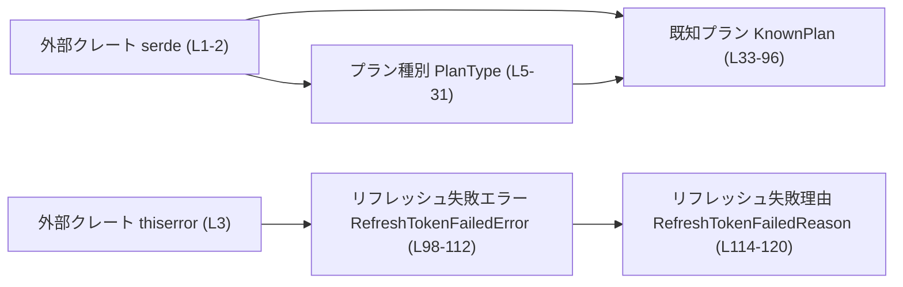
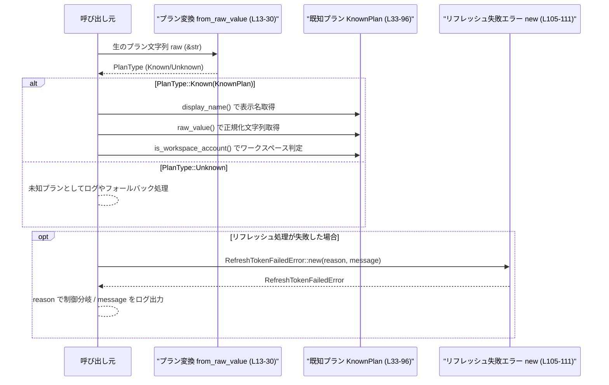

# protocol/src/auth.rs

## 0. ざっくり一言

サブスクリプションプランを表す型（既知・未知プランの表現とユーティリティ）と、リフレッシュトークン失敗理由を表すエラー型を定義するモジュールです（`protocol/src/auth.rs:L5-L31, L33-L120`）。

---

## 1. このモジュールの役割

### 1.1 概要

- 文字列で与えられるプラン名を、列挙型 `KnownPlan` / ラッパー型 `PlanType` にマッピングする機能を提供します（`protocol/src/auth.rs:L5-L31, L33-L50`）。
- 既知プランに対して、表示用名称・シリアライズ用の生の文字列・ワークスペースアカウントであるかどうかの判定を行います（`protocol/src/auth.rs:L52-L95`）。
- トークンリフレッシュ処理が失敗したときの理由とメッセージを保持する `RefreshTokenFailedError` / `RefreshTokenFailedReason` を提供します（`protocol/src/auth.rs:L98-L120`）。

### 1.2 アーキテクチャ内での位置づけ

外部クレート `serde` と `thiserror` に依存しつつ、プラン種別と認証系エラー（と推測される）を表現するピュアな型群です。  
このチャンクには他の自前モジュールへの `use` は現れていません（`protocol/src/auth.rs:L1-L3`）。



- `PlanType` は `KnownPlan` を内包し、シリアライズ／デシリアライズに `serde(untagged)` を使います（`protocol/src/auth.rs:L5-L9`）。
- `KnownPlan` 自体も `Serialize` / `Deserialize` を実装し、文字列表現の規約をカプセル化します（`protocol/src/auth.rs:L33-L50`）。
- `RefreshTokenFailedError` は `thiserror::Error` により `std::error::Error` を実装し、`RefreshTokenFailedReason` を内包します（`protocol/src/auth.rs:L98-L103`）。

※ ファイル名 `auth.rs` から認証・認可周辺で使われることが想定されますが、このチャンクだけからは具体的な呼び出し元は分かりません。

### 1.3 設計上のポイント

- **既知／未知プランの分離**  
  - `PlanType` で「既知プラン（`KnownPlan`）とそうでない文字列」を明確に区別しています（`protocol/src/auth.rs:L7-L9`）。
- **シリアライズ方針**  
  - `PlanType` は `#[serde(untagged)]` によりタグ無しでシリアライズされ、`KnownPlan` は小文字や特定の文字列にリネームされます（`protocol/src/auth.rs:L5-L6, L33-L46, L47-L49`）。
- **エラー設計**  
  - リフレッシュ失敗の「機械可読な理由」と「人間向けメッセージ」を分離した構造体 `RefreshTokenFailedError` を用意しています（`protocol/src/auth.rs:L100-L103`）。
- **状態・並行性**  
  - すべて値型のみで、グローバル状態や `unsafe` 使用はありません。並列処理や非同期処理に関するコードは含まれていません（`protocol/src/auth.rs:L1-L120`）。

---

## 2. 主要な機能一覧

- プラン種別の表現: `PlanType` により既知プランと未知プラン文字列を統一的に扱う。
- 文字列から既知プランへの変換: `PlanType::from_raw_value` によるケースインセンシティブなマッピング（`protocol/src/auth.rs:L13-L30`）。
- 既知プランの表示名取得: `KnownPlan::display_name` でUI向けの名前文字列を取得（`protocol/src/auth.rs:L53-L67`）。
- 既知プランの生の値取得: `KnownPlan::raw_value` でシステム内部／外部連携用の文字列表現を取得（`protocol/src/auth.rs:L69-L83`）。
- ワークスペースアカウント判定: `KnownPlan::is_workspace_account` による、特定プラン群の真偽判定（`protocol/src/auth.rs:L85-L95`）。
- リフレッシュ失敗エラーの表現: `RefreshTokenFailedError` / `RefreshTokenFailedReason` により、失敗理由とメッセージをカプセル化（`protocol/src/auth.rs:L98-L120`）。

---

## 3. 公開 API と詳細解説

### 3.1 型一覧（構造体・列挙体など）

#### コンポーネントインベントリー（型）

| 名前 | 種別 | 役割 / 用途 | 主な関連関数 | 定義位置 |
|------|------|-------------|--------------|----------|
| `PlanType` | enum | 既知プラン (`KnownPlan`) と未知のプラン文字列を区別して保持するための列挙体 | `from_raw_value` | `protocol/src/auth.rs:L5-L31` |
| `KnownPlan` | enum | システムが認識しているサブスクリプションプランの一覧。シリアライズ時の文字列表現も決める | `display_name`, `raw_value`, `is_workspace_account` | `protocol/src/auth.rs:L33-L96` |
| `RefreshTokenFailedError` | struct | リフレッシュトークン処理の失敗理由とエラーメッセージを表現するエラー型 | `new` | `protocol/src/auth.rs:L98-L112` |
| `RefreshTokenFailedReason` | enum | リフレッシュトークン失敗の原因区分（期限切れなど） | - | `protocol/src/auth.rs:L114-L120` |

---

### 3.2 関数詳細

#### 関数インベントリー

| 関数名 | 所属型 | 役割（1行） | 定義位置 |
|--------|--------|------------|----------|
| `from_raw_value` | `PlanType` | 生のプラン文字列から `PlanType` を構築する | `protocol/src/auth.rs:L13-L30` |
| `display_name` | `KnownPlan` | 表示用のプラン名（人間向け）を返す | `protocol/src/auth.rs:L53-L67` |
| `raw_value` | `KnownPlan` | システム内部／外部 API 連携で用いる生の文字列表現を返す | `protocol/src/auth.rs:L69-L83` |
| `is_workspace_account` | `KnownPlan` | プランがワークスペースアカウントに該当するかを判定する | `protocol/src/auth.rs:L85-L95` |
| `new` | `RefreshTokenFailedError` | 失敗理由とメッセージからエラー値を生成するコンストラクタ | `protocol/src/auth.rs:L105-L111` |

---

#### `PlanType::from_raw_value(raw: &str) -> Self`

**概要**

- 生のプラン名文字列を受け取り、既知のプランは `PlanType::Known(KnownPlan)`、未知のプランは `PlanType::Unknown(String)` に変換します（`protocol/src/auth.rs:L13-L30`）。

**引数**

| 引数名 | 型 | 説明 |
|--------|----|------|
| `raw` | `&str` | 入力となるプラン名文字列。大小文字は区別されず、ASCIIベースで小文字化されます（`to_ascii_lowercase`、`protocol/src/auth.rs:L14`）。 |

**戻り値**

- `PlanType`  
  - 一致する既知プランがあれば `PlanType::Known(対応する KnownPlan)`、そうでなければ `PlanType::Unknown(raw.to_string())` を返します（`protocol/src/auth.rs:L15-L28`）。

**内部処理の流れ**

1. `raw.to_ascii_lowercase()` で入力文字列をASCIIベースで小文字化し（`protocol/src/auth.rs:L14`）、
2. その `&str` に対して `match` で既知のプラン文字列と比較します（`protocol/src/auth.rs:L14-L27`）。
3. `"enterprise"` と `"hc"`、`"education"` と `"edu"` のように、複数の別名を同じプランにマップするケースがあります（`protocol/src/auth.rs:L26-L27`）。
4. どの既知プランにもマッチしない場合は、`PlanType::Unknown(raw.to_string())` を返します（`protocol/src/auth.rs:L28`）。

**Examples（使用例）**

```rust
use crate::auth::{PlanType, KnownPlan}; // このファイルが crate 直下の auth モジュールである前提

fn classify_plan(raw: &str) {
    let plan_type = PlanType::from_raw_value(raw); // 文字列から PlanType へ変換

    match plan_type {
        PlanType::Known(k) => {
            // 既知プランの場合、さらに KnownPlan の API が利用可能
            println!("known plan: {:?}", k);
        }
        PlanType::Unknown(original) => {
            // 未知プラン: 入力文字列をそのまま保持
            println!("unknown plan: {}", original);
        }
    }
}

fn main() {
    classify_plan("Pro"); // 大小文字に関わらず KnownPlan::Pro になる
    classify_plan("hc");  // KnownPlan::Enterprise として扱われる
    classify_plan("MyCustomPlan"); // Unknown("MyCustomPlan")
}
```

**Errors / Panics**

- この関数内で `panic!` になり得るコードはありません。標準ライブラリの `to_ascii_lowercase` や文字列比較はいずれも通常入力ではパニックを発生させません（`protocol/src/auth.rs:L14-L28`）。
- `Result` などのエラー型は返さず、未知プランは `Unknown` バリアントとして扱う設計です（`protocol/src/auth.rs:L7-L9, L28`）。

**Edge cases（エッジケース）**

- 空文字列 `""` の場合  
  - いずれのパターンにもマッチしないため、`PlanType::Unknown("".to_string())` になります（`protocol/src/auth.rs:L28`）。
- 前後に空白が含まれる場合（例: `" pro "`）  
  - トリム処理は行っていないため、小文字化しても `" pro "` のままになり、既知プランにはマッチせず Unknown になります（`protocol/src/auth.rs:L14-L28`）。
- 非ASCII文字を含む場合  
  - `to_ascii_lowercase` はASCII文字のみ小文字化し、それ以外はそのまま残します。  
    その結果、既知プラン文字列と一致しなければ Unknown になります（`protocol/src/auth.rs:L14`）。
- `"enterprise"` / `"hc"` / `"education"` / `"edu"`  
  - `"enterprise"` と `"hc"` はどちらも `KnownPlan::Enterprise` にマップされます（`protocol/src/auth.rs:L26`）。  
  - `"education"` と `"edu"` はどちらも `KnownPlan::Edu` にマップされます（`protocol/src/auth.rs:L27`）。

**使用上の注意点**

- 入力を正規化するのは「ASCII小文字化のみ」です。前後の空白除去や、全角半角変換などは行われません。
- `KnownPlan` に新しいプランを追加した場合、`from_raw_value` にも対応する分岐を追加しないと、Unknown のまま扱われます（`protocol/src/auth.rs:L15-L27`）。
- 未知プランも `Unknown` として保持されるため、「入力値をそのまま外部に再表示する」処理では XSS などの対策が別途必要になります（ここでは値を検証・サニタイズしていません）。

---

#### `KnownPlan::display_name(self) -> &'static str`

**概要**

- 各既知プランに対して、人間向けの表示名を返します（`protocol/src/auth.rs:L53-L67`）。

**引数**

| 引数名 | 型 | 説明 |
|--------|----|------|
| `self` | `KnownPlan` | 対象となるプラン。`Copy` なので値渡しでも move の問題はありません（`protocol/src/auth.rs:L33-L40`）。 |

**戻り値**

- `&'static str`  
  - プログラム埋め込みの固定文字列を返します。所有権の移動は発生しません（`protocol/src/auth.rs:L55-L65`）。

**内部処理の流れ**

1. `match self` で各バリアントごとに対応する文字列リテラルを返します（`protocol/src/auth.rs:L54-L65`）。
2. 例: `KnownPlan::ProLite` → `"Pro Lite"`、`KnownPlan::SelfServeBusinessUsageBased` → `"Self Serve Business Usage Based"`（`protocol/src/auth.rs:L59-L63`）。

**Examples（使用例）**

```rust
use crate::auth::KnownPlan;

fn print_display_name(plan: KnownPlan) {
    let name = plan.display_name(); // &'static str を取得
    println!("Display name: {}", name);
}

fn main() {
    print_display_name(KnownPlan::ProLite); // "Pro Lite"
    print_display_name(KnownPlan::Edu);     // "Edu"
}
```

**Errors / Panics**

- すべてのバリアントを `match` で網羅しており、`unreachable!()` 等もないためパニック要因はありません（`protocol/src/auth.rs:L54-L65`）。

**Edge cases（エッジケース）**

- バリアントごとに固定の文字列が返るだけで、入力依存の変化はありません。
- 表示名と `raw_value` は必ずしも一致しません（例: `"Pro Lite"` vs `"prolite"`、`protocol/src/auth.rs:L59, L75`）。

**使用上の注意点**

- UI 表示など、人間向けのラベルに限定して使うのが適切です。外部 API との連携や永続化には `raw_value` の使用が一貫性の点で安全です。

---

#### `KnownPlan::raw_value(self) -> &'static str`

**概要**

- シリアライズや外部システムとの連携など、機械向けの「正規化された」文字列表現を返します（`protocol/src/auth.rs:L69-L83`）。

**引数**

| 引数名 | 型 | 説明 |
|--------|----|------|
| `self` | `KnownPlan` | 対象プラン。`Copy` なので所有権移動の心配は不要です。 |

**戻り値**

- `&'static str`  
  - 小文字やアンダースコアなどで構成された固定文字列です（`protocol/src/auth.rs:L71-L81`）。

**内部処理の流れ**

1. `match self` で各バリアントに対応する文字列を返します（`protocol/src/auth.rs:L70-L82`）。
2. 複雑なプランは、外部インターフェイスで使われそうなスネークケース表現を返します  
   （例: `SelfServeBusinessUsageBased` → `"self_serve_business_usage_based"`、`protocol/src/auth.rs:L77`）。

**Examples（使用例）**

```rust
use crate::auth::KnownPlan;

fn key_for_storage(plan: KnownPlan) -> String {
    // 例えばデータベースのキーや設定ファイルの値として利用
    plan.raw_value().to_string()
}

fn main() {
    assert_eq!(KnownPlan::Free.raw_value(), "free");
    assert_eq!(KnownPlan::EnterpriseCbpUsageBased.raw_value(), "enterprise_cbp_usage_based");
}
```

**Errors / Panics**

- パニック要因はありません。すべてのバリアントを網羅しています（`protocol/src/auth.rs:L70-L82`）。

**Edge cases（エッジケース）**

- `KnownPlan::Enterprise` に対しては常に `"enterprise"` が返されます。  
  `PlanType::from_raw_value` は `"enterprise"` と `"hc"` を同じ `Enterprise` にマップしますが、`raw_value` は `"hc"` にはなりません（`protocol/src/auth.rs:L26, L80`）。
- `KnownPlan::Edu` に対しては `"edu"` が返ります。  
  一方、`from_raw_value` は `"education"` も `Edu` にマップするため、「入力値」と「正規化された出力値」が異なる場合があります（`protocol/src/auth.rs:L27, L81`）。

**使用上の注意点**

- 文字列を永続化したり、外部 API とやり取りする際は `raw_value` を用いておくと、入力の揺れ（別名表現）を吸収できます。
- `display_name` と混同しないよう、用途（人間向け／機械向け）を明確に分ける必要があります。

---

#### `KnownPlan::is_workspace_account(self) -> bool`

**概要**

- そのプランが「ワークスペースアカウント」（チーム・ビジネス・教育など、複数人利用を想定したプランと考えられるもの）に該当するかどうかを真偽値で返します（`protocol/src/auth.rs:L85-L95`）。

**引数**

| 引数名 | 型 | 説明 |
|--------|----|------|
| `self` | `KnownPlan` | 判定対象のプラン。 |

**戻り値**

- `bool`  
  - `Team`, `SelfServeBusinessUsageBased`, `Business`, `EnterpriseCbpUsageBased`, `Enterprise`, `Edu` のいずれかであれば `true`、それ以外は `false` です（`protocol/src/auth.rs:L88-L93`）。

**内部処理の流れ**

1. `matches!` マクロで `self` が特定のバリアントのいずれかに含まれるかを判定します（`protocol/src/auth.rs:L85-L94`）。
2. 対象バリアントは `Team` / `SelfServeBusinessUsageBased` / `Business` / `EnterpriseCbpUsageBased` / `Enterprise` / `Edu` です（`protocol/src/auth.rs:L88-L93`）。

**Examples（使用例）**

```rust
use crate::auth::KnownPlan;

fn main() {
    assert_eq!(KnownPlan::Free.is_workspace_account(), false);
    assert_eq!(KnownPlan::Team.is_workspace_account(), true);
    assert_eq!(KnownPlan::Enterprise.is_workspace_account(), true);
    assert_eq!(KnownPlan::Edu.is_workspace_account(), true);
}
```

**Errors / Panics**

- `matches!` だけを用いており、パニックの可能性はありません（`protocol/src/auth.rs:L86-L94`）。

**Edge cases（エッジケース）**

- 列挙対象以外のプラン (`Free`, `Go`, `Plus`, `Pro`, `ProLite`) はすべて `false` になります（`protocol/src/auth.rs:L36-L41, L88-L93`）。

**使用上の注意点**

- 新しいプランが「ワークスペース」相当かどうかのビジネスルールは、この関数に埋め込まれます。  
  新規プラン追加時にこの判定ロジックを更新し忘れると、誤判定が生じます。
- 呼び出し側は、`false` = 「必ず個人アカウント」とは限らず、「この関数でワークスペースとして扱っていないプラン」であることを前提に扱う必要があります。

---

#### `RefreshTokenFailedError::new(reason: RefreshTokenFailedReason, message: impl Into<String>) -> Self`

**概要**

- `RefreshTokenFailedReason` とメッセージ文字列から `RefreshTokenFailedError` を生成するシンプルなコンストラクタです（`protocol/src/auth.rs:L105-L111`）。

**引数**

| 引数名 | 型 | 説明 |
|--------|----|------|
| `reason` | `RefreshTokenFailedReason` | 失敗の理由区分（期限切れ、回数上限など）（`protocol/src/auth.rs:L115-L119`）。 |
| `message` | `impl Into<String>` | エラーメッセージ。`&str` や `String` 等から暗黙変換されます（`protocol/src/auth.rs:L106-L110`）。 |

**戻り値**

- `RefreshTokenFailedError`  
  - `reason` と `message.into()` をフィールドに詰めた新しいインスタンス（`protocol/src/auth.rs:L107-L110`）。

**内部処理の流れ**

1. `message` を `Into<String>` で `String` に変換します（`protocol/src/auth.rs:L109`）。
2. 与えられた `reason` と変換済み `message` をフィールドに持つ `RefreshTokenFailedError` を構築して返します（`protocol/src/auth.rs:L107-L110`）。
3. `#[error("{message}")]` により、このエラーを `Display` した際には `message` の内容がそのまま表示されます（`protocol/src/auth.rs:L99`）。

**Examples（使用例）**

```rust
use crate::auth::{RefreshTokenFailedError, RefreshTokenFailedReason};

fn refresh_token() -> Result<(), RefreshTokenFailedError> {
    // 例: 期限切れを検出したとする
    Err(RefreshTokenFailedError::new(
        RefreshTokenFailedReason::Expired,
        "refresh token expired", // &str から String に自動変換される
    ))
}

fn main() {
    match refresh_token() {
        Ok(()) => println!("refresh succeeded"),
        Err(e) => {
            // Display 実装は message フィールドだけを表示する
            eprintln!("refresh failed: {}", e);
            // プログラム側は reason で機械的な分岐が可能
            eprintln!("reason: {:?}", e.reason);
        }
    }
}
```

**Errors / Panics**

- コンストラクタ自身はエラーやパニックになりません（`protocol/src/auth.rs:L105-L111`）。
- `String` のアロケーションが行われますが、メモリ確保失敗によるパニックなどは Rust ランタイムの通常挙動に従います。

**Edge cases（エッジケース）**

- `message` に空文字列を渡した場合でも問題なく構築されます。`Display` 出力も空文字になります（`protocol/src/auth.rs:L99-L103`）。
- `reason` が `Other` の場合、詳細な意味づけは呼び出し側の運用に依存します（`protocol/src/auth.rs:L119`）。

**使用上の注意点**

- 人間に見せるメッセージは `message` フィールドに集約されるため、ログやユーザー表示に再利用しやすい一方で、多言語化やマスク処理が必要な場合は上位レイヤーでの制御が必要になります。
- `reason` を使うことで、プログラム側はメッセージ文字列に依存せずに分岐できます（例: 期限切れなら再ログインを促す等）。

---

### 3.3 その他の関数

- このファイルには、上記以外の公開関数・補助関数は定義されていません（`protocol/src/auth.rs:L1-L120`）。

---

## 4. データフロー

ここでは、「プラン文字列を処理して KnownPlan に変換し、必要に応じてワークスペース判定や表示名を使う」という典型的なフローを示します。  
`RefreshTokenFailedError` は同じモジュール内ですが、プラン処理とは独立して呼ばれることが想定されるため、呼び出し元から別々に利用される形で図示します。



要点:

- プラン文字列はまず `PlanType::from_raw_value` に渡され、既知プランと未知プランに分岐します（`protocol/src/auth.rs:L13-L30`）。
- 既知プランであれば `KnownPlan` のメソッドを通じて表示名・正規化された文字列・ワークスペースかどうかを取得できます（`protocol/src/auth.rs:L52-L95`）。
- リフレッシュ処理の成否は、別途 `RefreshTokenFailedError` を通じて表現されます（`protocol/src/auth.rs:L98-L112`）。

---

## 5. 使い方（How to Use）

### 5.1 基本的な使用方法

生のプラン文字列を解釈し、既知プランなら各種ユーティリティを使い、未知プランならそのまま扱う基本フローの例です。

```rust
use crate::auth::{
    PlanType,
    KnownPlan,
    RefreshTokenFailedError,
    RefreshTokenFailedReason,
};

fn handle_plan_and_refresh(raw_plan: &str) -> Result<(), RefreshTokenFailedError> {
    // 1. 文字列から PlanType に変換する（L13-30）
    let plan_type = PlanType::from_raw_value(raw_plan);

    match plan_type {
        PlanType::Known(plan) => {
            // 既知プラン: 表示名と raw_value を利用（L53-67, L69-83）
            let display = plan.display_name();
            let raw = plan.raw_value();
            let is_workspace = plan.is_workspace_account(); // L85-95

            println!(
                "plan display={}, raw={}, workspace={}",
                display, raw, is_workspace
            );
        }
        PlanType::Unknown(original) => {
            // 未知プラン: 入力値をログなどに残す
            println!("unknown plan: {}", original);
        }
    }

    // 2. 例として、ここでリフレッシュ処理を行い、失敗したと仮定する
    let refresh_succeeded = false;

    if !refresh_succeeded {
        // RefreshTokenFailedError::new でエラー値を構築（L105-111）
        return Err(RefreshTokenFailedError::new(
            RefreshTokenFailedReason::Exhausted,
            "refresh token usage exhausted",
        ));
    }

    Ok(())
}
```

### 5.2 よくある使用パターン

1. **外部からのプラン文字列を正規化して保管する**

```rust
use crate::auth::{PlanType, KnownPlan};

fn normalize_plan_for_storage(raw: &str) -> (String, bool) {
    match PlanType::from_raw_value(raw) {
        PlanType::Known(plan) => {
            // 正規化された文字列（raw_value）とワークスペース判定を保存
            (plan.raw_value().to_string(), plan.is_workspace_account())
        }
        PlanType::Unknown(original) => {
            // 未知プランはそのまま保存し、ワークスペース扱いは false
            (original, false)
        }
    }
}
```

1. **シリアライズとの組み合わせ**

`KnownPlan` / `PlanType` は `Serialize` / `Deserialize` を実装しているため、`serde_json` などでそのまま JSON にシリアライズできます（`protocol/src/auth.rs:L5-L6, L33-L34`）。

```rust
use crate::auth::{KnownPlan, PlanType};
use serde_json;

fn to_json(plan: PlanType) -> String {
    serde_json::to_string(&plan).expect("serialization should not fail")
}

fn main() {
    let plan = PlanType::Known(KnownPlan::Team);
    let json = to_json(plan);
    // 例: "\"team\"" のような JSON 文字列になる
    println!("{}", json);
}
```

### 5.3 よくある間違い

```rust
use crate::auth::PlanType;

// 間違い例: すでに小文字化済みの前提で直接比較してしまう
fn is_pro_wrong(raw: &str) -> bool {
    // "Pro" や "PRO" を渡すと false になってしまう
    raw == "pro"
}

// 正しい例: from_raw_value を通して KnownPlan 判定を行う
fn is_pro(raw: &str) -> bool {
    match PlanType::from_raw_value(raw) {
        PlanType::Known(crate::auth::KnownPlan::Pro) => true,
        _ => false,
    }
}
```

**注意点:**

- 自前で文字列比較を行うと、大文字・小文字や別名（`hc` / `enterprise`、`education` / `edu`）対応を漏らす可能性があります。  
  可能な限り `PlanType::from_raw_value` を経由して判定する方が一貫した扱いになります（`protocol/src/auth.rs:L15-L27`）。
- `PlanType::from_raw_value` は空白除去などは行わないため、その挙動を期待する場合は呼び出し前に `trim()` 等を行う必要があります。

### 5.4 使用上の注意点（まとめ）

- **エラーと安全性**
  - このモジュールには `unsafe` コードや I/O は含まれておらず、すべて純粋な値操作です（`protocol/src/auth.rs:L1-L120`）。
  - `RefreshTokenFailedError` は `thiserror::Error` の派生により `std::error::Error` を実装しており、標準的なエラー連鎖の一部として使えます（`protocol/src/auth.rs:L98-L99`）。
- **セキュリティ**
  - `PlanType::Unknown` 内の文字列は検証されていません。そのまま HTML 等に出力する場合は、XSS 対策を含む適切なエスケープが別途必要です。
  - エラー `message` も任意の文字列を保持できるため、ユーザー入力をそのまま埋め込む場合は同様の注意が必要です（`protocol/src/auth.rs:L100-L103`）。
- **並行性**
  - グローバル可変状態はなく、すべてが値型なので、通常の Rust の所有権／借用ルールに従ってマルチスレッド環境でも扱えます。  
    ただし、`Send` / `Sync` 実装についてこのチャンクで明示されているわけではありません。
- **パフォーマンス**
  - `from_raw_value` は入力文字列長に比例する `to_ascii_lowercase` と、固定個数のパターンマッチのみで構成されており、一般的な用途では十分軽量です（`protocol/src/auth.rs:L14-L28`）。
  - 他のメソッドはすべて O(1) の単純なマッチングのみです。

---

## 6. 変更の仕方（How to Modify）

### 6.1 新しい機能を追加する場合

**例: 新しいプラン種別 `EnterprisePlus` を追加したい場合**

1. **`KnownPlan` にバリアントを追加**  
   - 列挙体 `KnownPlan` に新しいバリアントを定義し、必要なら `#[serde(rename = "...")]` でシリアライズ名を指定します（`protocol/src/auth.rs:L35-L49`）。
2. **`display_name` に表示名を追加**  
   - `match self` に新しい分岐を追加し、人間向け表示名を定義します（`protocol/src/auth.rs:L54-L65`）。
3. **`raw_value` に生の値を追加**  
   - 正規化された文字列表現を `match` に追加します（`protocol/src/auth.rs:L70-L82`）。
4. **`is_workspace_account` での扱いを決める**  
   - ワークスペース相当なら `matches!` マクロの対象に含め、そうでなければ含めない判断を行います（`protocol/src/auth.rs:L88-L93`）。
5. **`PlanType::from_raw_value` に入力マッピングを追加**  
   - 新しいプランに対応する文字列（および別名）があれば `match` 分岐に追加します（`protocol/src/auth.rs:L15-L27`）。

この一連の変更により、「入力文字列 → KnownPlan → 表示／保存／判定」の一貫した経路が維持されます。

### 6.2 既存の機能を変更する場合

- **`PlanType::from_raw_value` のマッピングを変更する場合**
  - 影響範囲: 文字列からプランを解釈するすべての呼び出し元。  
    例えば `"hc"` の扱いを変えると、既存データやログとの互換性に影響します（`protocol/src/auth.rs:L26`）。
  - 変更時には、`KnownPlan::raw_value` やシリアライズ設定との整合性を確認する必要があります（`protocol/src/auth.rs:L69-L83`）。
- **ワークスペース判定のルールを変更する場合**
  - `KnownPlan::is_workspace_account` の `matches!` 列挙を変更します（`protocol/src/auth.rs:L88-L93`）。
  - 呼び出し側が「ワークスペース扱い」かどうかで挙動を変えている箇所（権限・UI・課金処理など）があれば、その前提を確認する必要があります（このチャンクには呼び出し元は現れません）。
- **エラーメッセージの仕様を変更する場合**
  - `RefreshTokenFailedError` の `message` はユーザー／ログ両方で使われる可能性があるため、文言変更や多言語対応を行う際は上位レイヤーも含めて確認が必要です（`protocol/src/auth.rs:L98-L103`）。

---

## 7. 関連ファイル

このチャンクから直接参照されているのは外部クレートのみで、自前の他モジュールは現れていません。

| パス / クレート | 役割 / 関係 |
|----------------|------------|
| `serde`（`Serialize`, `Deserialize`） | `PlanType` と `KnownPlan` のシリアライズ／デシリアライズを提供します（`protocol/src/auth.rs:L1-L2, L5, L33`）。 |
| `thiserror`（`Error`） | `RefreshTokenFailedError` に対して `std::error::Error` 実装と `Display` 実装を導出します（`protocol/src/auth.rs:L3, L98-L99`）。 |
| （自前の他モジュール） | このチャンクには `use crate::...` のような宣言は現れておらず、どこから呼び出されるかは不明です。 |

**テストについて**

- このファイル内にはテストコード（`#[cfg(test)]` や `mod tests` 等）は含まれていません（`protocol/src/auth.rs:L1-L120`）。  
  マッピングの変更やプラン追加を行う場合は、別ファイルにテストが存在するか確認し、なければ `from_raw_value` と `raw_value` の対応関係を検証するテストを追加することが一般的に有用です。
