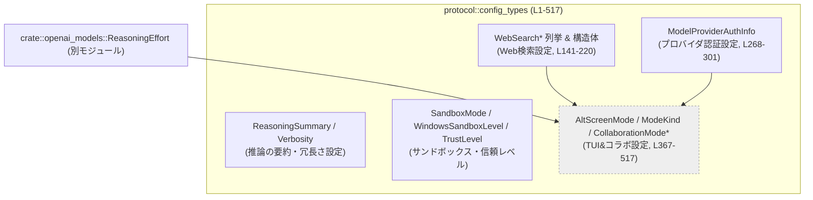
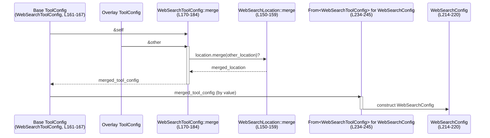
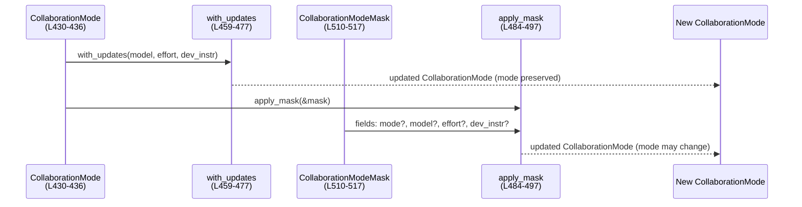

# protocol/src/config_types.rs コード解説

## 0. ざっくり一言

このファイルは、Codex プロトコルの「設定スキーマ」をまとめたモジュールです。  
モデルの推論設定、サンドボックスや Web 検索設定、TUI の表示モード、コラボレーションモード、モデルプロバイダ認証などを表す列挙体・構造体と、それらをマージ・変換するための補助ロジックを提供します（`protocol/src/config_types.rs:L13-517`）。

---

## 1. このモジュールの役割

### 1.1 概要

- このモジュールは **Codex/LLM クライアント全体の「設定値」** を型安全に扱うために存在します。
- Serde / Schemars / ts-rs を使って、**Config ファイル → Rust 構造体 → JSON Schema → TypeScript 型** まで一貫して扱えるようになっています（`L1-12, L141-147, L161-167, L187-191, L203-220, L268-291, L431-517`）。
- 一部の型には、「マスク適用」や「設定のマージ」「Duration への変換」などの小さなビジネスロジックが含まれます（`L150-159, L169-184, L293-301, L411-427, L438-497`）。

### 1.2 アーキテクチャ内での位置づけ

このモジュールは、アプリケーションの他のコンポーネントに対し「設定値」を提供する立場にあります。唯一の内部依存は `crate::openai_models::ReasoningEffort` です（`L11, L448-449, L503-505, L530-531`）。



- 上位（CLI, TUI, エージェントなど）からはこのモジュールの型を通じて設定を取得します。
- Web 検索設定はツールレベル設定 → 全体設定への変換を担います（`impl From<WebSearchToolConfig> for WebSearchConfig`、`L234-245`）。
- コラボレーションモードは UI やセッション管理から扱われる想定です（`L430-497`）。

### 1.3 設計上のポイント

- **完全にデータ指向**  
  - すべての主要な構造体・列挙体はフィールドのみを持つ「設定コンテナ」です（`L141-147, L161-167, L187-191, L203-220, L268-291, L431-436, L502-517`）。
  - 状態を変更するメソッドは新しい値を返すイミュータブル設計になっています（`CollaborationMode::with_updates`, `apply_mask`, `L459-497`）。

- **シリアライズ／スキーマ生成対応**  
  - 多くの型が `Serialize`, `Deserialize`, `JsonSchema`, `TS` を実装し、設定の読み書き・バリデーション・フロントエンド型生成までカバーしています（`L13-121, L132-143, L161-167, L187-191, L203-220, L248-262, L268-291, L339-345, L367-372, L383-387, L431-436, L501-517`）。

- **オプションフィールドとマージ戦略**  
  - Web 検索関連設定では、「ベース設定に対して上書き設定（overlay）をマージする」処理が用意されています（`WebSearchLocation::merge`, `L150-159`; `WebSearchToolConfig::merge`, `L169-184`）。
  - CollaborationModeMask も同様に、`Some` のみ上書きするマスク適用ロジックを持ちます（`L484-497`）。

- **エラーハンドリング方針**  
  - 多くの API は `Result` を返さずパニックも発生しませんが、一部の内部ヘルパーで不正なデフォルト値や環境異常に対して `panic!` を用います（`non_zero_u64`, `default_provider_auth_cwd`, `L314-319, L321-331`）。
  - 認証のリフレッシュ間隔は `Option<Duration>` として表現し、「0＝無効」をコンパイル時にわかりやすい形に変換しています（`L298-300`）。

- **並行性**  
  - このモジュール内にはスレッドを共有するような内部可変状態や同期プリミティブは登場せず、すべての型は普通の所有型（`String`, `Option`, `Vec` など）で構成されています。  
    そのため、設定値を複数スレッドで共有して読み取る用途に適した構造になっています。

---

## 2. 主要な機能一覧

- モデル推論出力設定（`ReasoningSummary`, `Verbosity`）: 要約の有無・詳細度の制御（`L13-50`）。
- サンドボックスおよびレビュー設定（`SandboxMode`, `WindowsSandboxLevel`, `ApprovalsReviewer`, `TrustLevel`）: 実行環境の安全性・承認フローの構成（`L52-83, L85-95, L337-345`）。
- モデルの「パーソナリティ」指定（`Personality`）: モデルの振る舞い傾向を表現（`L97-118`）。
- Web 検索設定一式（`WebSearchMode`, `WebSearchContextSize`, `WebSearchLocation`, `WebSearchToolConfig`, `WebSearchFilters`, `WebSearchUserLocation*`, `WebSearchConfig`）とマージ・変換ロジック（`L120-220, L150-159, L169-184, L222-245`）。
- サービス階層／ログイン経路指定（`ServiceTier`, `ForcedLoginMethod`）（`L248-262`）。
- モデルプロバイダ認証設定（`ModelProviderAuthInfo`）とタイムアウト／リフレッシュ間隔の `Duration` 化（`L268-301`）。
- TUI の Alt スクリーンモード指定（`AltScreenMode`）（`L347-380`）。
- コラボレーションモード（`ModeKind`, `CollaborationMode`, `Settings`, `CollaborationModeMask`, `TUI_VISIBLE_COLLABORATION_MODES`）と、モード更新／マスク適用ロジック（`L382-517`）。

---

## 3. 公開 API と詳細解説

### 3.1 型一覧（構造体・列挙体など）

| 名前 | 種別 | 役割 / 用途 | 根拠 |
|------|------|-------------|------|
| `ReasoningSummary` | enum | モデルの推論サマリー（なし/簡潔/詳細/自動）を指定（Responses API 用） | `config_types.rs:L13-26` |
| `Verbosity` | enum | GPT-5 系モデルの出力の長さ・詳細度制御（low/medium/high） | `L28-50` |
| `SandboxMode` | enum | ファイルシステムサンドボックスの権限レベル（読み取り専用/ワークスペース書き込み/フルアクセス） | `L52-67` |
| `ApprovalsReviewer` | enum | サンドボックス逸脱や危険操作などの承認要求を誰にルーティングするか（ユーザ or サブエージェント） | `L69-83` |
| `WindowsSandboxLevel` | enum | Windows 環境向けサンドボックスレベル（無効/制限付きトークン/昇格） | `L85-95` |
| `Personality` | enum | モデルの人格スタイル（なし/フレンドリー/実務的） | `L97-118` |
| `WebSearchMode` | enum | Web 検索ツールの利用モード（無効/キャッシュ/ライブ） | `L120-130` |
| `WebSearchContextSize` | enum | Web 検索結果の文脈サイズ（low/medium/high） | `L132-139` |
| `WebSearchLocation` | struct | Web 検索の地理的場所設定（国/地域/都市/タイムゾーン） | `L141-147` |
| `WebSearchToolConfig` | struct | Web 検索ツールの設定（文脈サイズ/許可ドメイン/ロケーション） | `L161-167` |
| `WebSearchFilters` | struct | 検索時に許可するドメインのフィルタ | `L187-191` |
| `WebSearchUserLocationType` | enum | ユーザロケーションの種別（現状は近似のみ） | `L193-201` |
| `WebSearchUserLocation` | struct | ユーザロケーション + 種別 | `L203-212` |
| `WebSearchConfig` | struct | Web 検索全体設定（フィルタ・ユーザロケーション・コンテキストサイズ） | `L214-220` |
| `ServiceTier` | enum | サービス層（高速/柔軟） | `L248-254` |
| `ForcedLoginMethod` | enum | ログイン経路の強制（ChatGPT UI / API） | `L256-262` |
| `ModelProviderAuthInfo` | struct | コマンド実行によるプロバイダの bearer token 取得設定 | `L267-291` |
| `TrustLevel` | enum | プロジェクトディレクトリの信頼レベル（trusted/untrusted） | `L337-345` |
| `AltScreenMode` | enum | TUI の Alt スクリーン利用モード（auto/always/never） | `L347-380` |
| `ModeKind` | enum | コラボレーションモード種別（Plan/Default/内部用 PairProgramming/Execute） | `L382-407` |
| `TUI_VISIBLE_COLLABORATION_MODES` | `pub const [ModeKind; 2]` | TUI 上でユーザに見えるモードのリスト（Default, Plan） | `L409-409` |
| `CollaborationMode` | struct | 1 セッションのコラボモードとその設定（モデル名・推論負荷・開発者指示） | `L430-436` |
| `Settings` | struct | コラボレーションモードの設定本体 | `L501-505` |
| `CollaborationModeMask` | struct | CollaborationMode/Settings に対する部分更新マスク | `L510-517` |

### 3.2 関数詳細（重要なもの）

以下では、主に「設定のマージ・変換」や「UI 振る舞い」を決める重要な関数を取り上げます。

---

#### `WebSearchLocation::merge(&self, other: &Self) -> Self`

**概要**

- 2 つの `WebSearchLocation` をマージし、「`other` 側に `Some` があればそれを優先し、`None` の場合は `self` を使う」戦略を実装します（`L150-159`）。
- ベース設定に対してオーバレイ（上書き設定）を適用する用途を想定しています。

**引数**

| 引数名 | 型 | 説明 |
|--------|----|------|
| `self` | `&WebSearchLocation` | ベースとなるロケーション設定 |
| `other` | `&WebSearchLocation` | 上書き設定（優先される） |

**戻り値**

- `WebSearchLocation`  
  マージ後のロケーション設定を新しい値として返します（元の値は変更しません）。

**内部処理の流れ**

1. 新しい `WebSearchLocation` を `Self { ... }` で構築。
2. 各フィールドについて `other.<field>.clone().or_else(|| self.<field>.clone())` を適用し、`other` の `Some` を優先。
3. すべてのフィールドをマージして返却。

**Examples（使用例）**

```rust
use protocol::config_types::WebSearchLocation; // モジュールパスは例示です

// ベースとなるロケーション
let base = WebSearchLocation {
    country: Some("US".to_string()),
    region: Some("CA".to_string()),
    city: None,
    timezone: Some("America/Los_Angeles".to_string()),
};

// 上書き用のロケーション
let overlay = WebSearchLocation {
    country: None,                              // None なので base.country が使われる
    region: Some("WA".to_string()),             // 上書き
    city: Some("Seattle".to_string()),          // 上書き（base は None）
    timezone: None,                             // None なので base.timezone が使われる
};

// オーバレイを適用
let merged = base.merge(&overlay);

// 結果:
// country = "US", region = "WA", city = "Seattle", timezone = "America/Los_Angeles"
```

この挙動はテスト `web_search_location_merge_prefers_overlay_values` により検証されています（`L576-598`）。

**Errors / Panics**

- パニックやエラーは発生しません。

**Edge cases（エッジケース）**

- 両方 `None` の場合: そのフィールドは `None` になります。
- `other` のみ `Some`: `other` の値が採用されます。
- `self` のみ `Some`: `self` の値が採用されます。

**使用上の注意点**

- `self` と `other` のどちらを「ベース」「オーバレイ」とみなすかを間違えると、優先される設定が逆になります。

---

#### `WebSearchToolConfig::merge(&self, other: &Self) -> Self`

**概要**

- `WebSearchToolConfig` 同士をマージする関数です（`L169-184`）。
- コンテキストサイズは単純な上書き, 許可ドメインはベクタのオーバレイ, ロケーションは `WebSearchLocation::merge` を用いて結合します。

**引数**

| 引数名 | 型 | 説明 |
|--------|----|------|
| `self` | `&WebSearchToolConfig` | ベース設定 |
| `other` | `&WebSearchToolConfig` | 上書き設定 |

**戻り値**

- `WebSearchToolConfig`  
  マージ後のツール設定。

**内部処理の流れ**

1. `context_size`: `other.context_size.or(self.context_size)` で `other` を優先。
2. `allowed_domains`: `other.allowed_domains.clone().or_else(|| self.allowed_domains.clone())` で `other` の `Some` を優先。
3. `location`: `(self.location, other.location)` に応じて
   - 両方 `Some`: `location.merge(other_location)` を採用
   - `self` だけ `Some`: `self` の値
   - `other` だけ `Some`: `other` の値
   - 両方 `None`: `None`

**Examples（使用例）**

```rust
use protocol::config_types::{WebSearchToolConfig, WebSearchContextSize, WebSearchLocation};

// ベース設定
let base = WebSearchToolConfig {
    context_size: Some(WebSearchContextSize::Low),
    allowed_domains: Some(vec!["openai.com".to_string()]),
    location: Some(WebSearchLocation {
        country: Some("US".to_string()),
        region: Some("CA".to_string()),
        city: None,
        timezone: Some("America/Los_Angeles".to_string()),
    }),
};

// オーバレイ設定
let overlay = WebSearchToolConfig {
    context_size: Some(WebSearchContextSize::High), // 上書き
    allowed_domains: None,                          // None → base が維持される
    location: Some(WebSearchLocation {
        country: None,
        region: Some("WA".to_string()),
        city: Some("Seattle".to_string()),
        timezone: None,
    }),
};

let merged = base.merge(&overlay);
// context_size: High
// allowed_domains: ["openai.com"]
// location.region: "WA", city: "Seattle", それ以外は base を維持
```

この挙動はテスト `web_search_tool_config_merge_prefers_overlay_values` で確認されています（`L601-635`）。

**Errors / Panics**

- パニックやエラーはありません。

**Edge cases**

- 両方の `allowed_domains` が `None` の場合、フィルタなしとなります。
- どちらか一方のみ `location` が `Some` の場合、その値が採用されます。

**使用上の注意点**

- 「オーバレイ側の `None` でフィールドをクリアする」ということはできません。  
  `None` は「変更しない」を意味します。値を明示的にクリアしたい場合は、別途設計が必要です。

---

#### `ModelProviderAuthInfo::timeout(&self) -> Duration`

**概要**

- 認証コマンドのタイムアウト（ミリ秒）を `Duration` に変換します（`L293-296`）。

**引数**

| 引数名 | 型 | 説明 |
|--------|----|------|
| `self` | `&ModelProviderAuthInfo` | 認証設定 |

**戻り値**

- `Duration`  
  `timeout_ms` フィールド（`NonZeroU64`）をミリ秒として解釈した `Duration`。

**内部処理の流れ**

1. `self.timeout_ms.get()` で `NonZeroU64` から `u64` を取得。
2. `Duration::from_millis(..)` に渡して `Duration` を生成。

**Errors / Panics**

- `timeout_ms` 自体は `NonZeroU64` なので `0` の値は存在せず、ここでパニックは発生しません。
- ただし、デフォルト値生成に使う `default_provider_auth_timeout_ms` で `0` を与えるとパニックする設計です（`non_zero_u64`, `L303-319`）。

**Edge cases**

- きわめて大きなミリ秒値を設定すると `Duration` が非常に長くなり、認証プロセスが長時間ブロックする可能性があります。

**使用上の注意点**

- 実際に認証コマンドを実行する側は、この `Duration` をタイムアウトとして使う必要があります。
- 設定ファイルから無効値（0）を受け付けない点に注意が必要です（`NonZeroU64` を使っているため）。

---

#### `ModelProviderAuthInfo::refresh_interval(&self) -> Option<Duration>`

**概要**

- 認証トークンのリフレッシュ間隔（ミリ秒）を `Option<Duration>` に変換します（`L298-300`）。
- `refresh_interval_ms == 0` の場合は `None` を返し、「プロアクティブリフレッシュ無効」を意味します（コメント `L282-285`）。

**引数**

| 引数名 | 型 | 説明 |
|--------|----|------|
| `self` | `&ModelProviderAuthInfo` | 認証設定 |

**戻り値**

- `Option<Duration>`  
  - `Some(duration)` : `refresh_interval_ms > 0` の場合のリフレッシュ間隔。  
  - `None` : `refresh_interval_ms == 0`（プロアクティブリフレッシュ無効）。

**内部処理の流れ**

1. `NonZeroU64::new(self.refresh_interval_ms)` を呼び出し。
2. 0 の場合は `None`、それ以外は `Some(NonZeroU64)`。
3. `map` で `Duration::from_millis(value.get())` に変換し、`Option<Duration>` を返す。

**Examples（使用例）**

```rust
use protocol::config_types::ModelProviderAuthInfo;
use std::time::Duration;

// 例: 設定を構築（値は例示）
let info = ModelProviderAuthInfo {
    command: "auth-cli".to_string(),
    args: vec!["token".to_string()],
    timeout_ms: std::num::NonZeroU64::new(5_000).unwrap(),
    refresh_interval_ms: 300_000, // 5 分
    cwd: /* 何らかの AbsolutePathBuf */,
};

let interval: Option<Duration> = info.refresh_interval();
assert_eq!(interval, Some(Duration::from_millis(300_000)));

// refresh_interval_ms = 0 の場合
let info2 = ModelProviderAuthInfo { refresh_interval_ms: 0, ..info };
assert_eq!(info2.refresh_interval(), None);
```

**Errors / Panics**

- 本メソッド自体はパニックしません。

**Edge cases**

- 0 の場合のみ特別扱い（`None`）になります。
- 非常に短い間隔を設定すると、認証コマンドが頻繁に実行されることがあります（パフォーマンス要注意）。

**使用上の注意点**

- 呼び出し側が `None` を「リフレッシュ無効」として扱う契約が暗黙にあります（コメント `L282-285`）。
- 0 以外の値はミリ秒単位です。設定ファイル側で単位を誤解しない必要があります。

---

#### `ModeKind::is_tui_visible(self) -> bool`

**概要**

- モードが TUI 上でユーザに表示されるべきかを判定する関数です（`L421-423`）。
- 現状、「Plan」と「Default」のみが可視であり、それは `TUI_VISIBLE_COLLABORATION_MODES` と一致します（テスト `L563-572`）。

**引数**

| 引数名 | 型 | 説明 |
|--------|----|------|
| `self` | `ModeKind` | 判定対象のモード |

**戻り値**

- `bool`  
  `true` の場合、このモードは TUI でユーザに見えるべきです。

**内部処理の流れ**

1. `matches!(self, Self::Plan | Self::Default)` で列挙体のバリアントをマッチング。
2. Plan / Default の場合 `true`、それ以外（PairProgramming, Execute）は `false`。

**Examples（使用例）**

```rust
use protocol::config_types::ModeKind;

assert!(ModeKind::Plan.is_tui_visible());
assert!(ModeKind::Default.is_tui_visible());
assert!(!ModeKind::PairProgramming.is_tui_visible());
assert!(!ModeKind::Execute.is_tui_visible());
```

**Errors / Panics**

- パニックは発生しません。

**Edge cases**

- 新しいモードを `ModeKind` に追加した場合、この関数と `TUI_VISIBLE_COLLABORATION_MODES` を更新しないと、一貫性が崩れる可能性があります。

**使用上の注意点**

- テスト `tui_visible_collaboration_modes_match_mode_kind_visibility`（`L562-572`）が `TUI_VISIBLE_COLLABORATION_MODES` とこの関数の整合性をチェックしています。モード追加時にはテストの更新も必要です。

---

#### `CollaborationMode::with_updates(&self, model: Option<String>, effort: Option<Option<ReasoningEffort>>, developer_instructions: Option<Option<String>>) -> Self`

**概要**

- コラボレーションモードの設定（モデル名・推論負荷・開発者指示）を部分的に更新した新しい `CollaborationMode` を返します（`L459-477`）。
- `Option<Option<...>>` により、「値を変えない / 値をクリアする / 値を別の値にする」を区別します。

**引数**

| 引数名 | 型 | 説明 |
|--------|----|------|
| `self` | `&CollaborationMode` | 元となるモード |
| `model` | `Option<String>` | `Some(s)` ならモデル名を `s` に変更、`None` なら変更なし |
| `effort` | `Option<Option<ReasoningEffort>>` | `Some(Some(e))` で `e` をセット, `Some(None)` でクリア, `None` で変更なし |
| `developer_instructions` | `Option<Option<String>>` | 上と同様に指示文のセット/クリア/変更なしを表現 |

**戻り値**

- `CollaborationMode`  
  モード種別 `mode` はそのままに、`settings` を更新した新しいインスタンス。

**内部処理の流れ**

1. `settings_ref` で既存の `Settings` への参照を取得（`L465`）。
2. `Settings` を新たに構築し、
   - `model`: `model.unwrap_or_else(|| settings.model.clone())`
   - `reasoning_effort`: `effort.unwrap_or(settings.reasoning_effort)`
   - `developer_instructions`: `developer_instructions.unwrap_or_else(|| settings.developer_instructions.clone())`
3. 新しい `CollaborationMode { mode: self.mode, settings: updated_settings }` を返却。

**Examples（使用例）**

```rust
use protocol::config_types::{CollaborationMode, ModeKind, Settings};
use crate::openai_models::ReasoningEffort;

// 元のモード
let base = CollaborationMode {
    mode: ModeKind::Default,
    settings: Settings {
        model: "gpt-5.2-codex".to_string(),
        reasoning_effort: Some(ReasoningEffort::High),
        developer_instructions: Some("stay focused".to_string()),
    },
};

// モデル名だけ変更、effort は削除、developer_instructions は変更なし
let updated = base.with_updates(
    Some("gpt-5.2-codex-fast".to_string()),
    Some(None),   // effort をクリア
    None,         // developer_instructions はそのまま
);
```

**Errors / Panics**

- パニックは発生しません。

**Edge cases**

- `effort == Some(None)` で `reasoning_effort` が `None` にクリアされます。
- すべて `None` を渡すと、元と同じ値をコピーした新インスタンスが返ります（モード名も含め変更なし）。

**使用上の注意点**

- `effort` と `developer_instructions` に 2 重の `Option` を使っているため、呼び出し側で意図を間違えないよう注意が必要です。
- モード種別 `mode` は変更されません。モードも変えたい場合は `apply_mask` を使うか別インスタンスを構築する必要があります。

---

#### `CollaborationMode::apply_mask(&self, mask: &CollaborationModeMask) -> Self`

**概要**

- `CollaborationModeMask` に基づいて、`CollaborationMode` に対する部分更新を行います（`L484-497`）。
- マスク内の `Some` のみを適用し、`None` は元の値を保持します。`name` フィールドは無視されます（コメント `L479-483`）。

**引数**

| 引数名 | 型 | 説明 |
|--------|----|------|
| `self` | `&CollaborationMode` | 元のモード |
| `mask` | `&CollaborationModeMask` | 適用したい部分更新マスク |

**戻り値**

- `CollaborationMode`  
  マスク適用後の新しいモード。

**内部処理の流れ**

1. `settings_ref` で既存 `Settings` を参照（`L485`）。
2. `mode`: `mask.mode.unwrap_or(self.mode)` で上書き or 維持。
3. `settings` は以下のルールで構築:
   - `model`: `mask.model.clone().unwrap_or_else(|| settings.model.clone())`
   - `reasoning_effort`: `mask.reasoning_effort.unwrap_or(settings.reasoning_effort)`
   - `developer_instructions`: `mask.developer_instructions.clone().unwrap_or_else(|| settings.developer_instructions.clone())`
4. 新しい `CollaborationMode` を返却。

テスト `apply_mask_can_clear_optional_fields` は、この関数がオプションフィールドをクリアできることを確認しています（`L524-551`）。

**Examples（使用例）**

```rust
use protocol::config_types::{CollaborationMode, CollaborationModeMask, ModeKind, Settings};
use crate::openai_models::ReasoningEffort;

// 元のモード
let base = CollaborationMode {
    mode: ModeKind::Default,
    settings: Settings {
        model: "gpt-5.2-codex".to_string(),
        reasoning_effort: Some(ReasoningEffort::High),
        developer_instructions: Some("stay focused".to_string()),
    },
};

// マスクで effort / instructions をクリア
let mask = CollaborationModeMask {
    name: "Clear optional".to_string(),
    mode: None,                 // モードは変えない
    model: None,                // モデル名は変えない
    reasoning_effort: Some(None),          // クリア
    developer_instructions: Some(None),    // クリア
};

let updated = base.apply_mask(&mask);
// updated.mode == Default
// updated.settings.model == "gpt-5.2-codex"
// updated.settings.reasoning_effort == None
// updated.settings.developer_instructions == None
```

**Errors / Panics**

- パニックは発生しません。

**Edge cases**

- マスクの全フィールドが `None`（+ name）の場合、`self` と同値のコピーが返ります。
- `reasoning_effort: Some(None)` で値をクリアできる点は `with_updates` と同じです。

**使用上の注意点**

- `CollaborationMode` を直接構築する代わりに、複数のプリセットマスクを用意して適用することで設定変更を管理しやすくなります。
- `name` は純粋なメタデータであり、`apply_mask` には影響しません。

---

#### `impl From<WebSearchToolConfig> for WebSearchConfig`

**概要**

- ツール固有の Web 検索設定 (`WebSearchToolConfig`) を、より一般的な `WebSearchConfig` に変換します（`L234-245`）。
- 許可ドメイン配列は `WebSearchFilters` に変換されます。

**引数**

| 引数名 | 型 | 説明 |
|--------|----|------|
| `config` | `WebSearchToolConfig` | 変換元の設定 |

**戻り値**

- `WebSearchConfig`  
  フィルタ・ユーザロケーション・コンテキストサイズを含んだ設定。

**内部処理の流れ**

1. `filters`: `config.allowed_domains.map(|allowed_domains| WebSearchFilters { allowed_domains: Some(allowed_domains) })`。
2. `user_location`: `config.location.map(Into::into)` で `WebSearchLocation` から `WebSearchUserLocation` へ変換（`From<WebSearchLocation>` の実装、`L222-231`）。
3. `search_context_size`: `config.context_size` をそのままコピー。

**Examples（使用例）**

```rust
use protocol::config_types::{WebSearchToolConfig, WebSearchConfig};

// ツール固有の設定を構築
let tool_cfg: WebSearchToolConfig = /* 何らかの読み込み */;

// 汎用 WebSearchConfig へ変換
let cfg: WebSearchConfig = tool_cfg.into();

// cfg.filters や cfg.user_location を使って RPC などのリクエストを構築する
```

**Errors / Panics**

- パニックは発生しません。

**Edge cases**

- `allowed_domains` が `None` の場合、`filters` は `None` になります（「フィルタなし」）。
- `location` が `None` の場合、`user_location` も `None` です。

**使用上の注意点**

- `WebSearchToolConfig` を複数回 `.into()` すると所有権がムーブされることに注意してください（Rust の所有権ルールによる）。

---

### 3.3 その他の関数

補助的な関数や単純なラッパーを一覧として示します。

| 関数名 | 定義位置 | 役割（1 行） |
|--------|----------|--------------|
| `WebSearchUserLocation::from(WebSearchLocation)` | `L222-231` | ロケーションをユーザロケーション構造体に変換し、`r#type` を `Approximate` に設定する |
| `ModelProviderAuthInfo::timeout(&self)` | `L293-296` | 認証コマンドのタイムアウトを `Duration` で返す |
| `ModelProviderAuthInfo::refresh_interval(&self)` | `L298-300` | 認証トークンのリフレッシュ間隔を `Option<Duration>` に変換する |
| `ModeKind::display_name(self)` | `L411-419` | モードの表示名（英語）を返す |
| `ModeKind::allows_request_user_input(self)` | `L425-427` | モードがユーザ入力リクエストを許可するか（Plan のみ true）を判定する |
| `CollaborationMode::settings_ref(&self)` | `L438-442` | `settings` への参照を返す内部ヘルパー（モジュール外からは非公開） |
| `CollaborationMode::model(&self)` | `L444-446` | `Settings.model` を `&str` で取得する |
| `CollaborationMode::reasoning_effort(&self)` | `L448-450` | `Settings.reasoning_effort` を取得する |
| `default_provider_auth_timeout_ms()` | `L303-308` | 認証タイムアウトのデフォルト値を `NonZeroU64` として返す（0 の場合はパニック） |
| `default_provider_auth_refresh_interval_ms()` | `L310-312` | 認証リフレッシュ間隔のデフォルト値（ミリ秒）を返す |
| `non_zero_u64(value, field_name)` | `L314-319` | 0 ならパニック、非 0 なら `NonZeroU64` を返す内部ヘルパー |
| `default_provider_auth_cwd()` | `L321-331` | `"."` を `AbsolutePathBuf` にデシリアライズし、失敗したら `current_dir` を使って解決する（失敗時はパニック） |
| `is_default_provider_auth_cwd(path)` | `L333-335` | 引数がデフォルトの CWD と同じかを判定し、Config スキーマでの `skip_serializing_if` 判定に用いる |

---

## 4. データフロー

ここでは、代表的な 2 つのデータフローを整理します。

### 4.1 Web 検索設定のマージと変換

ベースのツール設定に CLI／ユーザ設定などのオーバレイを適用し、最終的な `WebSearchConfig` へ変換する流れです。



- `WebSearchLocation::merge` はフィールドごとにオーバレイの値を優先しつつ、`None` の場合はベース値を保持します（`L150-159`）。
- `WebSearchToolConfig::merge` は `context_size` / `allowed_domains` / `location` をマージします（`L170-184`）。
- 最終的に `From<WebSearchToolConfig> for WebSearchConfig` で `filters` や `user_location` に変換されます（`L234-245`）。

### 4.2 コラボレーションモードの更新

コラボレーションモードに対して、直接更新 (`with_updates`) やマスク適用 (`apply_mask`) を行う流れです。



- `with_updates` はモード種別を固定したまま設定のみ変更します（`L459-477`）。
- `apply_mask` はモード種別も含めてマスクにより更新できます（`L484-497`）。
- どちらも元の `CollaborationMode` を変更せず、新しいインスタンスを返すイミュータブル設計です。

---

## 5. 使い方（How to Use）

### 5.1 基本的な使用方法

#### 例: コラボレーションモードの初期化と更新

```rust
use protocol::config_types::{
    CollaborationMode, Settings, ModeKind, CollaborationModeMask
};
use crate::openai_models::ReasoningEffort;

// 1. 設定や依存オブジェクトを用意する
let base_settings = Settings {
    model: "gpt-5.2-codex".to_string(),              // 使用するモデル名
    reasoning_effort: Some(ReasoningEffort::Medium), // 推論負荷
    developer_instructions: None,                    // 開発者向け指示は未設定
};

// 2. コラボレーションモードを初期化する
let base_mode = CollaborationMode {
    mode: ModeKind::Default,                         // デフォルトのコラボモード
    settings: base_settings,
};

// 3. 一時的にモデル名と推論負荷を変更したモードを作る
let fast_mode = base_mode.with_updates(
    Some("gpt-5.2-codex-fast".to_string()),          // モデル名を変更
    Some(Some(ReasoningEffort::High)),               // 推論負荷を High に
    None,                                            // 開発者指示は変更しない
);

// 4. マスクを用いたプリセット変更
let clear_optional_mask = CollaborationModeMask {
    name: "clear_optional".to_string(),              // マスクの説明
    mode: None,                                      // モードは変えない
    model: None,                                     // モデル名は変えない
    reasoning_effort: Some(None),                    // 推論負荷をクリア
    developer_instructions: Some(None),              // 開発者指示をクリア
};

let cleared = fast_mode.apply_mask(&clear_optional_mask);
// cleared は optional フィールドが None になったモード
```

### 5.2 よくある使用パターン

- **Web 検索設定の上書き（base + overlay）**

  - ベース設定（例: プロジェクト global 設定）に対して、ユーザ／CLI 指定のオーバレイを `WebSearchToolConfig::merge` でマージする（`L169-184`）。
  - その後 `.into()` で `WebSearchConfig` に変換し、実際の RPC などに使う。

- **モード種別の UI 表示**

  ```rust
  use protocol::config_types::{ModeKind, TUI_VISIBLE_COLLABORATION_MODES};

  for mode in TUI_VISIBLE_COLLABORATION_MODES {
      if mode.is_tui_visible() {
          println!("Show mode: {}", mode.display_name());
      }
  }
  ```

  `TUI_VISIBLE_COLLABORATION_MODES` と `is_tui_visible` の整合性はテストで保証されています（`L562-572`）。

### 5.3 よくある間違い

```rust
use protocol::config_types::ModelProviderAuthInfo;
use std::num::NonZeroU64;

// 間違い例: 0 をそのまま NonZeroU64 にしようとする
// let info = ModelProviderAuthInfo {
//     command: "auth-cli".to_string(),
//     args: vec![],
//     timeout_ms: NonZeroU64::new(0).unwrap(),  // ← ここで panic
//     refresh_interval_ms: 0,
//     cwd: /* ... */,
// };

// 正しい例: timeout_ms は 0 以外を使う（デフォルト関数も利用可能）
let info = ModelProviderAuthInfo {
    command: "auth-cli".to_string(),
    args: vec![],
    timeout_ms: NonZeroU64::new(5_000).unwrap(), // 5 秒
    refresh_interval_ms: 0,                       // 0 は「リフレッシュ無効」を意味する
    cwd: /* ... */,
};
```

- `timeout_ms` は `NonZeroU64` のため 0 を許容しません（`L279-280`）。
- `refresh_interval_ms` だけが 0 を有効な値としており、`refresh_interval()` で `None` に変換されます（`L283-285, L298-300`）。

### 5.4 使用上の注意点（まとめ）

- **パニックを引き起こす可能性のあるヘルパー**

  - `non_zero_u64` は値が 0 の場合 `panic!("{field_name} must be non-zero")` を実行します（`L314-319`）。
  - `default_provider_auth_cwd` は `AbsolutePathBuf::deserialize(".")` および `AbsolutePathBuf::current_dir()` の両方が失敗した場合にパニックします（`L321-331`）。

- **シリアライズの挙動**

  - `ModeKind::PairProgramming` と `ModeKind::Execute` は `#[serde(skip_serializing, skip_deserializing)]` で外部とのやりとりから隠蔽されています（`L397-406`）。
  - `ModeKind` の `"code"`, `"pair_programming"`, `"execute"`, `"custom"` はすべて `Default` にマッピングされるエイリアスです（`L390-395, L554-559`）。

- **並行性**

  - すべての設定型はイミュータブルに扱う前提で設計されており、共有して読み取る用途に向いています。  
    明示的な内部可変性（`RefCell`, `Mutex` など）は使用していません。

---

## 6. 変更の仕方（How to Modify）

### 6.1 新しい機能を追加する場合

- **新しい Web 検索オプションを追加したい場合**

  1. 対応する enum/struct（例: `WebSearchContextSize` に新しいバリアント）を追加する（`L132-139`）。
  2. そのフィールドを持つ構造体（`WebSearchToolConfig`, `WebSearchConfig` など）にフィールドを追加する（`L161-167, L214-220`）。
  3. `WebSearchToolConfig::merge` や `From<WebSearchToolConfig> for WebSearchConfig` でマージ・変換ロジックを拡張する（`L169-184, L234-245`）。
  4. 挙動をテストするユニットテストを `mod tests` 内に追加する（`L519-635`）。

- **新しいコラボレーションモードを追加したい場合**

  1. `ModeKind` に新バリアントを追加（`L383-407`）。
  2. `display_name`, `is_tui_visible`, `allows_request_user_input` での扱いを追加（`L411-427`）。
  3. `TUI_VISIBLE_COLLABORATION_MODES` に含めるかどうかを決めて更新（`L409-409`）。
  4. `mode_kind_deserializes_alias_values_to_default` 等のテストを更新（`L553-559`）。

### 6.2 既存の機能を変更する場合

- **WebSearchToolConfig::merge の挙動を変える**

  - 影響範囲:
    - `WebSearchToolConfig::merge` 本体（`L169-184`）。
    - `web_search_tool_config_merge_prefers_overlay_values` テスト（`L601-635`）。
    - 呼び出し側でマージの前提に依存しているコード（このチャンクには現れません）。

  - 注意すべき契約:
    - 現在は「オーバレイの `Some` を優先、`None` はベースを保持」という契約になっています。
    - `None` でフィールドクリアを可能にするよう仕様変更する場合、既存の設定ファイルとの互換性を慎重に検討する必要があります。

- **CollaborationMode::apply_mask の仕様変更**

  - 影響範囲:
    - `apply_mask` 本体（`L484-497`）。
    - テスト `apply_mask_can_clear_optional_fields`（`L524-551`）。
    - マスクを前提にした上位層（このチャンクには現れません）。

  - 注意点:
    - `Some(None)` でフィールドをクリアできる契約は、設定マスクの表現力に直結するため、変更すると上位コードに影響が大きくなります。

---

## 7. 関連ファイル

| パス / モジュール | 役割 / 関係 |
|------------------|------------|
| `crate::openai_models` モジュール（ファイルパス不明） | `ReasoningEffort` 型を提供し、`CollaborationMode` や `Settings` で推論負荷を表現するのに利用されます（`L11, L448-449, L503-505, L530-531`）。 |
| （不明）ModelProviderAuthInfo の実行側 | `ModelProviderAuthInfo` の `command`, `args`, `cwd`, `timeout`, `refresh_interval` を実際に使って認証コマンドを実行するコンポーネントです。このチャンクには実装が現れません。 |
| （不明）TUI / CLI フロントエンド | `AltScreenMode`, `ModeKind`, `TUI_VISIBLE_COLLABORATION_MODES`, `CollaborationMode` を参照して UI の挙動を決めるコンポーネントです。このチャンクには現れません。 |

---

### Bugs / Security（まとめ）

- **潜在的なパニック**

  - `non_zero_u64` に 0 を渡すコードが追加されると、実行時パニックになります（`L314-319`）。
  - `default_provider_auth_cwd` が `AbsolutePathBuf::deserialize(".")` と `AbsolutePathBuf::current_dir()` の両方で失敗するとパニックします（`L321-331`）。これは環境異常時のフェイルファストと解釈できます。

- **セキュリティ上の注意**

  - `ModelProviderAuthInfo` は任意のシェルコマンドと引数を保持できます（`L270-276`）。実際にコマンドを実行する側では、ユーザからの入力をそのまま信頼せず、必要に応じてサニタイズや許可リストチェックを行う必要があります。
  - サンドボックスや信頼レベル（`SandboxMode`, `TrustLevel` 等）の判断ロジックはこのファイルには含まれておらず、別コンポーネントで安全に利用する必要があります。

- **Contracts / Edge Cases**

  - `refresh_interval_ms == 0` → プロアクティブリフレッシュ無効 (`refresh_interval() == None`) という契約はコメントにも明記されており（`L282-285, L298-300`）、呼び出し側で尊重する必要があります。
  - Web 検索マージ系 (`WebSearchLocation::merge`, `WebSearchToolConfig::merge`) は「オーバレイの `Some` を優先、`None` はベース維持」という明確なルールに基づいています（`L150-159, L169-184`）。
