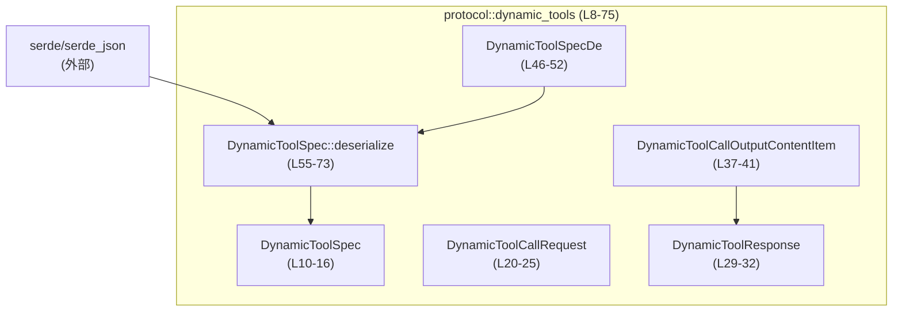
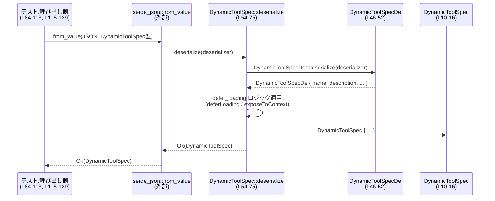

# protocol/src/dynamic_tools.rs コード解説

## 0. ざっくり一言

動的なツール呼び出しのための **仕様・リクエスト・レスポンス** のデータ型と、`DynamicToolSpec` 用の **後方互換なデシリアライズ処理** を提供するモジュールです（`dynamic_tools.rs:L8-75`）。

---

## 1. このモジュールの役割

### 1.1 概要

- このモジュールは、動的ツールに関する以下の情報を表現するための **シリアライズ可能な型** を定義します（`dynamic_tools.rs:L10-42`）。
  - ツールの仕様（名前・説明・入力スキーマ・遅延ロードフラグ）
  - ツール呼び出しのリクエスト
  - ツール実行結果のレスポンスと、その内容アイテム
- あわせて、ツール仕様 `DynamicToolSpec` の JSON からのデシリアライズ時に、**新旧2種類のフィールド名に対応しつつ、デフォルト値を決めるロジック** を実装しています（`dynamic_tools.rs:L44-75`）。

### 1.2 アーキテクチャ内での位置づけ

このモジュールはデータ型とデシリアライズのみを提供し、外部依存として `serde`・`serde_json`・`schemars`・`ts_rs` を利用しています（`dynamic_tools.rs:L1-6`）。他の自前モジュールへの依存は、このチャンクには現れていません。



- `DynamicToolCallResponse` は `DynamicToolCallOutputContentItem` をフィールドとして保持します（`dynamic_tools.rs:L29-31`）。
- `DynamicToolSpecDe` と `DynamicToolSpec::deserialize` は、`DynamicToolSpec` のデシリアライズ専用の内部実装です（`dynamic_tools.rs:L44-75`）。

### 1.3 設計上のポイント

- **データ定義 + スキーマ**  
  すべての公開型が `Serialize`・`Deserialize`（一部はカスタム実装）・`JsonSchema`・`TS` を実装しており、Rust ↔ JSON ↔ TypeScript の型整合性を保ちやすくなっています（`dynamic_tools.rs:L8-9,L18-20,L27-29,L34-37`）。
- **カスタムデシリアライズによる後方互換対応**  
  - 内部の `DynamicToolSpecDe` で旧フィールド `exposeToContext` を受け取り（`dynamic_tools.rs:L46-52`）、
  - 公開型 `DynamicToolSpec` の `defer_loading` に変換するロジックを `Deserialize` 実装でまとめています（`dynamic_tools.rs:L54-73`）。
- **タグ付き enum によるコンテンツ種別表現**  
  レスポンスの内容を `DynamicToolCallOutputContentItem` の列挙型で表現し、`type` フィールドでバリアントを切り分ける設計になっています（`dynamic_tools.rs:L34-41`）。
- **安全性**  
  - ライブラリコードには `unwrap` や `expect` は使用されておらず、`Option::unwrap_or` のみを使ってデフォルト値を設定しています（`dynamic_tools.rs:L71-72`）。
  - `unsafe` ブロックや並行処理 API は一切登場せず、このモジュールは純粋なデータ変換に限定されています。

---

## 2. 主要な機能一覧

- 動的ツール仕様 `DynamicToolSpec` の定義と、JSON からのデシリアライズ時の互換ロジック（`dynamic_tools.rs:L10-16,L44-75`）
- ツール呼び出しリクエスト `DynamicToolCallRequest` の定義（`dynamic_tools.rs:L20-25`）
- ツール呼び出しレスポンス `DynamicToolResponse` の定義（`dynamic_tools.rs:L29-32`）
- レスポンス内コンテンツ項目 `DynamicToolCallOutputContentItem`（テキスト・画像入力）の定義（`dynamic_tools.rs:L37-41`）
- テストによる `DynamicToolSpec` デシリアライズロジックの検証（`dynamic_tools.rs:L77-130`）

---

## 3. 公開 API と詳細解説

### 3.1 型一覧（構造体・列挙体など）

#### 構造体・列挙体インベントリー

| 名前 | 種別 | 公開 | 役割 / 用途 | 定義位置 |
|------|------|------|-------------|----------|
| `DynamicToolSpec` | 構造体 | 公開 | 動的ツールの仕様を表す。名前・説明・入力スキーマ・遅延ロードフラグを保持する。 | `dynamic_tools.rs:L10-16` |
| `DynamicToolCallRequest` | 構造体 | 公開 | 動的ツールの呼び出しリクエスト。呼び出し ID・ターン ID・ツール名・引数 JSON を保持する。 | `dynamic_tools.rs:L20-25` |
| `DynamicToolResponse` | 構造体 | 公開 | 動的ツールの実行結果。コンテンツ項目と成功フラグを保持する。 | `dynamic_tools.rs:L29-32` |
| `DynamicToolCallOutputContentItem` | 列挙体 | 公開 | レスポンス内のコンテンツ項目。`InputText` と `InputImage` の2種類を持つ。 | `dynamic_tools.rs:L37-41` |
| `DynamicToolSpecDe` | 構造体 | 非公開 | `DynamicToolSpec` のデシリアライズ専用内部型。旧フィールド `exposeToContext` を受け取るために使用。 | `dynamic_tools.rs:L46-52` |

#### 各型のフィールド概要

**DynamicToolSpec**（`dynamic_tools.rs:L10-16`）

- `name: String`  
  ツール名。JSON では `name` キーとして camelCase で表現されます（`#[serde(rename_all = "camelCase")]`、`dynamic_tools.rs:L9-L11`）。
- `description: String`  
  ツールの説明文（`dynamic_tools.rs:L12`）。
- `input_schema: JsonValue`  
  入力の JSON スキーマを表す任意の JSON 値（`serde_json::Value`）（`dynamic_tools.rs:L13`）。
- `defer_loading: bool`  
  ツールのロードを遅延するかどうかを表すフラグ。デフォルトは `false` で、デシリアライズ時に `deferLoading` または `exposeToContext` から決まります（`dynamic_tools.rs:L14-15,L71-72`）。

**DynamicToolCallRequest**（`dynamic_tools.rs:L20-25`）

- `call_id: String`  
  呼び出しを識別する ID（`dynamic_tools.rs:L21`）。
- `turn_id: String`  
  会話や対話のターンを識別する ID（`dynamic_tools.rs:L22`）。
- `tool: String`  
  呼び出すツールの識別子と思われますが、このチャンクでは意味付けは明示されていません（`dynamic_tools.rs:L23`）。
- `arguments: JsonValue`  
  ツールへの引数を表す JSON（`dynamic_tools.rs:L24`）。

**DynamicToolResponse**（`dynamic_tools.rs:L29-32`）

- `content_items: Vec<DynamicToolCallOutputContentItem>`  
  レスポンス内のコンテンツ項目の配列（`dynamic_tools.rs:L30`）。
- `success: bool`  
  ツール呼び出しが成功したかどうかを表すブール値（`dynamic_tools.rs:L31`）。

**DynamicToolCallOutputContentItem**（`dynamic_tools.rs:L37-41`）

- タグ付き enum（`#[serde(tag = "type", rename_all = "camelCase")]` / `#[ts(tag = "type")]`）として定義されており、JSON では `type` フィールドでバリアントが識別されます（`dynamic_tools.rs:L35-37`）。
  - `InputText { text: String }`  
    テキスト入力を表すバリアント（`dynamic_tools.rs:L38-39`）。
  - `InputImage { image_url: String }`  
    画像入力を表すバリアント（`dynamic_tools.rs:L40-41`）。

**DynamicToolSpecDe**（`dynamic_tools.rs:L46-52`）

- デシリアライズ専用の内部構造体で、`expose_to_context: Option<bool>` を持っています（`dynamic_tools.rs:L51`）。
- フィールド:
  - `name: String`（`dynamic_tools.rs:L47`）
  - `description: String`（`dynamic_tools.rs:L48`）
  - `input_schema: JsonValue`（`dynamic_tools.rs:L49`）
  - `defer_loading: Option<bool>`（`dynamic_tools.rs:L50`）
  - `expose_to_context: Option<bool>`（`dynamic_tools.rs:L51`）

### 3.2 関数詳細（重要なもの）

#### `impl<'de> Deserialize<'de> for DynamicToolSpec::deserialize<D>(deserializer: D) -> Result<Self, D::Error>`

**概要**

- `DynamicToolSpec` のカスタムデシリアライズ処理です（`dynamic_tools.rs:L54-75`）。
- 新しいフィールド `deferLoading` と、レガシーな `exposeToContext` の両方を受け取り、`DynamicToolSpec.defer_loading` に変換します（`dynamic_tools.rs:L60-65,L71-72`）。

**引数**

| 引数名 | 型 | 説明 |
|--------|----|------|
| `deserializer` | `D` (`where D: Deserializer<'de>`) | Serde のデシリアライザ。JSON などの入力から `DynamicToolSpec` を構築するために使われます（`dynamic_tools.rs:L55-57`）。 |

**戻り値**

- `Result<DynamicToolSpec, D::Error>`  
  - 成功時: `DynamicToolSpec` インスタンス（`Ok(Self { ... })`、`dynamic_tools.rs:L67-73`）。  
  - 失敗時: Serde のデシリアライズエラー（`DynamicToolSpecDe::deserialize(deserializer)?` の `?` を通じて返されます、`dynamic_tools.rs:L65`）。

**内部処理の流れ**

1. `DynamicToolSpecDe::deserialize(deserializer)` を呼んで、一度内部型 `DynamicToolSpecDe` にパースします（`dynamic_tools.rs:L59-65`）。
2. `DynamicToolSpecDe` の各フィールドを分解代入で取り出します（`dynamic_tools.rs:L59-65`）。
3. 取り出した `name`, `description`, `input_schema` をそのまま `DynamicToolSpec` にコピーします（`dynamic_tools.rs:L68-70`）。
4. `defer_loading` フィールドの値を次のロジックで決定します（`dynamic_tools.rs:L71-72`）:
   - まず `defer_loading`（`Option<bool>`）が `Some(v)` なら、`v` を採用する（`unwrap_or_else` が呼ばれない）。
   - `defer_loading` が `None` の場合のみクロージャが呼ばれ、そのなかで:
     - `expose_to_context.map(|visible| !visible)` により、`expose_to_context` が `Some(v)` なら `Some(!v)`、`None` なら `None` になる（`dynamic_tools.rs:L71-72`）。
     - それに対して `unwrap_or(false)` を適用し、`Some(!v)` なら `!v` を、`None` なら `false` を選びます。
5. 以上を `DynamicToolSpec { ... }` に詰めて `Ok(Self { ... })` を返します（`dynamic_tools.rs:L67-73`）。

**Examples（使用例）**

1. `deferLoading` を直接指定する例（テストと同等、`dynamic_tools.rs:L84-113` を元にしたもの）:

```rust
use serde_json::json;
// DynamicToolSpec は同一モジュール内（dynamic_tools.rs）にある前提です。

let value = json!({
    "name": "lookup_ticket",          // name フィールド
    "description": "Fetch a ticket",  // description フィールド
    "inputSchema": {                  // input_schema にマッピング
        "type": "object",
        "properties": {
            "id": { "type": "string" }
        }
    },
    "deferLoading": true,             // defer_loading に直接マッピング
});

let spec: DynamicToolSpec =
    serde_json::from_value(value).expect("deserialize succeeded"); // dynamic_tools.rs:L97 に相当

assert!(spec.defer_loading); // true になる（dynamic_tools.rs:L110-111 に相当）
```

1. レガシーな `exposeToContext` を使う例（`dynamic_tools.rs:L115-129` を元にしたもの）:

```rust
use serde_json::json;

let value = json!({
    "name": "lookup_ticket",
    "description": "Fetch a ticket",
    "inputSchema": {
        "type": "object",
        "properties": {}
    },
    "exposeToContext": false,        // レガシーフィールドのみ指定
});

let spec: DynamicToolSpec =
    serde_json::from_value(value).expect("deserialize succeeded");

// exposeToContext == false → defer_loading == !false == true
assert!(spec.defer_loading); // dynamic_tools.rs:L127-129 に相当
```

1. 両方指定した場合（コードから導かれる挙動）:

```rust
use serde_json::json;

let value = json!({
    "name": "lookup_ticket",
    "description": "Fetch a ticket",
    "inputSchema": { "type": "object" },
    "deferLoading": false,
    "exposeToContext": false,
});

let spec: DynamicToolSpec = serde_json::from_value(value).unwrap();

// defer_loading は deferLoading が優先され、false になる
assert!(!spec.defer_loading);
```

- ここでは `defer_loading: defer_loading.unwrap_or_else(...)`（`dynamic_tools.rs:L71-72`）により、`deferLoading` が `Some(false)` なのでクロージャは呼ばれず、`exposeToContext` は無視されます。

**Errors / Panics**

- **エラー条件**（すべて `serde_json::from_*` 側から `D::Error` として通知）:
  - 必須フィールド `name`, `description`, `input_schema` が JSON に存在しない、または型が一致しない場合にエラーになります（`DynamicToolSpecDe` の必須フィールド、`dynamic_tools.rs:L47-49`）。
  - `deferLoading` や `exposeToContext` がブール値ではない場合も同様にエラーになります（`dynamic_tools.rs:L50-51`）。
- **パニック**:
  - ライブラリコード中では `unwrap` や `expect` は使用しておらず（`dynamic_tools.rs:L54-75`）、`Option::unwrap_or` のみなので、通常のデシリアライズ処理でパニックは発生しません。
  - `expect("deserialize")` や `assert!` はテストコード内にのみ存在します（`dynamic_tools.rs:L83,L97,L127,L129`）。

**Edge cases（エッジケース）**

- **`deferLoading` も `exposeToContext` も指定しない場合**  
  - `defer_loading` フィールドは `false` になります。  
    根拠: `defer_loading: defer_loading.unwrap_or_else(|| expose_to_context.map(|visible| !visible).unwrap_or(false))`（`dynamic_tools.rs:L71-72`）で、両方 `None` の場合 `unwrap_or(false)` が選ぶデフォルトが `false`。
- **`deferLoading` のみ指定した場合**  
  - `defer_loading` は `deferLoading` の値そのままになります（`unwrap_or_else` が呼ばれないため、`exposeToContext` は無視されます、`dynamic_tools.rs:L71-72`）。
- **`exposeToContext` のみ指定した場合**  
  - `defer_loading` は `!exposeToContext` になります。  
    例: `exposeToContext: false` → `defer_loading: true`（テストで検証、`dynamic_tools.rs:L115-129`）。  
    根拠: `expose_to_context.map(|visible| !visible)`（`dynamic_tools.rs:L71-72`）。
- **両方指定した場合**  
  - `deferLoading` が優先され、`exposeToContext` は無視されます（`unwrap_or_else` の仕様より、`dynamic_tools.rs:L71-72`）。
- **JSON 以外のフォーマット**  
  - このチャンクでは JSON 以外での使用例は現れませんが、Serde の通常のデシリアライズの仕組みに従います。

**使用上の注意点**

- `DynamicToolSpec` にフィールドを追加する場合、`DynamicToolSpecDe` と `deserialize` 実装も同時に更新する必要があります（`dynamic_tools.rs:L46-52,L54-73`）。
- レガシーな `exposeToContext` をどこまでサポートするかは、`DynamicToolSpecDe` と `deserialize` ロジックに依存します。挙動を変える場合はテスト（`dynamic_tools.rs:L84-113,L115-129`）も更新する必要があります。
- デシリアライズ自体は I/O を伴わず、CPU コストのみですが、`input_schema` が大きな JSON の場合、それに比例したパースコストがかかります（`dynamic_tools.rs:L13,L49`）。
- 並行性: このモジュールには共有可変状態や `unsafe` は存在せず（`dynamic_tools.rs:L1-75`）、型は純粋なデータホルダです。並列にデシリアライズを行うかどうかは呼び出し側に依存します。

### 3.3 その他の関数（テスト）

| 関数名 | 種別 | 役割（1 行） | 定義位置 |
|--------|------|--------------|----------|
| `dynamic_tool_spec_deserializes_defer_loading` | テスト | `deferLoading` フィールドが `DynamicToolSpec.defer_loading` に正しくマッピングされることを検証する。 | `dynamic_tools.rs:L84-113` |
| `dynamic_tool_spec_legacy_expose_to_context_inverts_to_defer_loading` | テスト | レガシーフィールド `exposeToContext` が `!exposeToContext` として `defer_loading` に変換されることを検証する。 | `dynamic_tools.rs:L115-129` |

---

## 4. データフロー

ここでは代表的なシナリオとして、JSON から `DynamicToolSpec` を復元する処理の流れを示します。

### 4.1 `DynamicToolSpec` デシリアライズの流れ

1. 呼び出し側が `serde_json::from_value` や `from_str` を用いて JSON を `DynamicToolSpec` に変換しようとします（`dynamic_tools.rs:L97,L127`）。
2. Serde は `DynamicToolSpec` の `Deserialize` 実装を呼び出します（`dynamic_tools.rs:L54-75`）。
3. カスタム実装内で、まず `DynamicToolSpecDe` にデシリアライズされます（`dynamic_tools.rs:L59-65`）。
4. `DynamicToolSpecDe` から `DynamicToolSpec` へ、`defer_loading` の変換ロジックを適用しながら構築します（`dynamic_tools.rs:L67-73`）。



- この図は `dynamic_tools.rs:L54-75,L84-113,L115-129` に基づきます。
- リクエスト/レスポンス型（`DynamicToolCallRequest`, `DynamicToolResponse`）の外部とのやりとりは、このチャンクでは具体的に示されていません。

---

## 5. 使い方（How to Use）

### 5.1 基本的な使用方法

このモジュールは主に **データ定義** と **デシリアライズロジック** を提供します。以下は同一モジュール内での基本的な利用例です。

```rust
use serde_json::json;
// dynamic_tools.rs 内にいる前提のサンプルコードです。

fn parse_tool_spec_from_json() -> serde_json::Result<DynamicToolSpec> {
    // ツール仕様の JSON（deferLoading を使用）
    let value = json!({
        "name": "lookup_ticket",
        "description": "Fetch a ticket",
        "inputSchema": {
            "type": "object",
            "properties": {
                "id": { "type": "string" }
            }
        },
        "deferLoading": true, // 新しいフィールド
    });

    // JSON から DynamicToolSpec に変換（dynamic_tools.rs:L97 を一般化）
    let spec: DynamicToolSpec = serde_json::from_value(value)?;
    Ok(spec)
}
```

同様に、レスポンス型の構築はシンプルな構造体リテラルで行えます。

```rust
fn build_response_example() -> DynamicToolResponse {
    let item = DynamicToolCallOutputContentItem::InputText {
        text: "hello".to_string(), // dynamic_tools.rs:L38-39 に対応
    };

    DynamicToolResponse {
        content_items: vec![item], // dynamic_tools.rs:L30
        success: true,             // dynamic_tools.rs:L31
    }
}
```

### 5.2 よくある使用パターン

1. **新形式 (`deferLoading`) のみを使う JSON を受け入れる**

```rust
use serde_json::json;

let value = json!({
    "name": "tool",
    "description": "desc",
    "inputSchema": { "type": "object" },
    "deferLoading": false,
});

let spec: DynamicToolSpec = serde_json::from_value(value)?;
assert!(!spec.defer_loading);
```

1. **レガシー形式 (`exposeToContext`) をサポートしつつ、新形式も扱う**

```rust
fn parse_spec(value: serde_json::Value) -> serde_json::Result<DynamicToolSpec> {
    // DynamicToolSpec::deserialize が新旧両方に対応しているので、
    // 呼び出し側では特別な分岐は不要です（dynamic_tools.rs:L54-73）。
    serde_json::from_value(value)
}
```

### 5.3 よくある間違いとその回避

```rust
use serde_json::json;

// ❌ 誤り例: 必須フィールド inputSchema を省略している
let value = json!({
    "name": "lookup_ticket",
    "description": "Fetch a ticket",
    // "inputSchema": ... がない（dynamic_tools.rs:L49 が必須）
    "deferLoading": true,
});

// → これは DynamicToolSpecDe の input_schema が必須フィールドのため、
//    デシリアライズエラーになります（dynamic_tools.rs:L46-49）。
let result: Result<DynamicToolSpec, _> = serde_json::from_value(value);
assert!(result.is_err());

// ✅ 正しい例: inputSchema を含める
let value_ok = json!({
    "name": "lookup_ticket",
    "description": "Fetch a ticket",
    "inputSchema": { "type": "object" },
    "deferLoading": true,
});
let spec_ok: DynamicToolSpec = serde_json::from_value(value_ok)?;
```

### 5.4 使用上の注意点（まとめ）

- `DynamicToolSpec` の必須フィールド `name`, `description`, `input_schema` を JSON から読み込む場合は、必ず値と型を適切に指定する必要があります（`dynamic_tools.rs:L47-49`）。
- `deferLoading` と `exposeToContext` の両方を指定した場合、**`deferLoading` が優先される** 点に注意してください（`dynamic_tools.rs:L71-72`）。
- このモジュールはバリデーションロジックを含みません。たとえば `input_schema` の内容が妥当かどうかは、呼び出し側の責任となります（`dynamic_tools.rs:L13,L49`）。
- ログ出力やメトリクス収集などの観測性機能は含まれていないため、必要であれば上位レイヤーでログを追加する必要があります。

---

## 6. 変更の仕方（How to Modify）

### 6.1 新しい機能（フィールド・バリアントなど）を追加する場合

1. **`DynamicToolSpec` にフィールドを追加する**
   - `DynamicToolSpec` に新フィールドを追加する場合（`dynamic_tools.rs:L10-16`）:
     - 同名のフィールドを `DynamicToolSpecDe` にも追加する（`dynamic_tools.rs:L46-52`）。
     - `DynamicToolSpec::deserialize` 内の `Ok(Self { ... })` にもそのフィールドのコピー処理を追加する（`dynamic_tools.rs:L67-73`）。
2. **`DynamicToolCallOutputContentItem` にバリアントを追加する**
   - enum に新しいバリアントを追加し（`dynamic_tools.rs:L37-41`）、
   - 必要に応じて `#[serde(rename_all = "camelCase")]` により JSON のキー名が camelCase になることを意識します（`dynamic_tools.rs:L38,L40`）。
   - TypeScript との整合性が必要な場合は、`ts_rs::TS` による生成結果も確認する必要があります（`dynamic_tools.rs:L34-37`）。

### 6.2 既存の機能（デシリアライズロジック）を変更する場合

- **`defer_loading` のデフォルト挙動を変える**
  - 現在は `deferLoading` も `exposeToContext` も指定されない場合、`false` が選択されています（`dynamic_tools.rs:L71-72`）。
  - これを変更する場合、`unwrap_or(false)` の引数を変更すればよいですが、テスト（`dynamic_tools.rs:L84-113,L115-129`）も更新する必要があります。
- **レガシーフィールド `exposeToContext` の扱いを変更・廃止する**
  - 変換ロジックは `DynamicToolSpecDe` と `DynamicToolSpec::deserialize` に局所化されているため（`dynamic_tools.rs:L46-52,L54-73`）、ここを修正すれば挙動は変わります。
  - 後方互換性への影響が大きいので、使用箇所の確認が必要ですが、このチャンクだけでは使用箇所は特定できません。
- **Contracts / Edge Cases に関する注意**
  - 型レベルで「非空文字列」などの制約は課していません（`dynamic_tools.rs:L10-16, L20-25, L29-32`）。不変条件を強化する場合は、別途バリデーションレイヤーを追加する必要があります。

---

## 7. 関連ファイル

このチャンクから直接参照できるのは外部クレートのみで、同一プロジェクト内の他ファイルへの参照は現れていません（`dynamic_tools.rs:L1-6`）。

| パス / クレート | 役割 / 関係 |
|-----------------|------------|
| `serde`, `serde::Deserialize`, `serde::Serialize` | JSON などへのシリアライズ/デシリアライズを提供し、本モジュールの全データ型の変換基盤になっています（`dynamic_tools.rs:L2-4,L18,L27,L34,L44,L54-57`）。 |
| `serde_json::Value` | `input_schema` や `arguments` など任意の JSON データを表現するために使用されています（`dynamic_tools.rs:L5,L13,L24,L49`）。 |
| `schemars::JsonSchema` | JSON Schema 自動生成用のトレイト。API スキーマの生成などに用いられる想定ですが、このチャンクには利用箇所は現れていません（`dynamic_tools.rs:L1,L8,L18,L27,L34`）。 |
| `ts_rs::TS` | TypeScript 型定義の生成用トレイト。本モジュールの型を TypeScript でも利用可能な形にするために使われています（`dynamic_tools.rs:L6,L8,L18,L27,L34-37`）。 |
| `pretty_assertions`（テストのみ） | テスト用のアサーションライブラリ。`DynamicToolSpec` の比較に使用されています（`dynamic_tools.rs:L80`）。 |

このモジュールがプロジェクト内でどのような API 経由で利用されているかは、このチャンクの情報だけからは分かりません。
