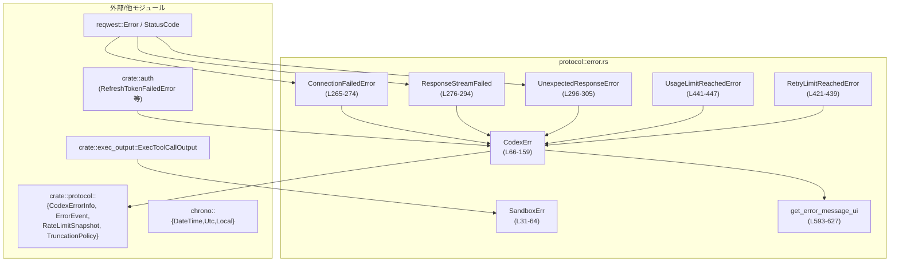
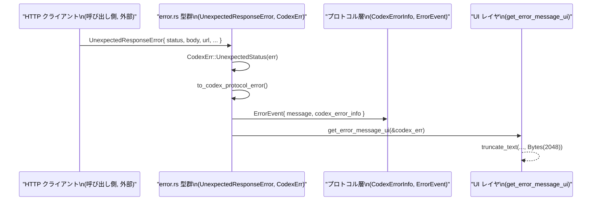

# protocol/src/error.rs

## 0. ざっくり一言

Codex クライアント全体で使うエラー型を集約し、HTTP・サンドボックス・認証など下位レイヤのエラーを、**再試行可否・プロトコル用コード・UI メッセージ**に変換するモジュールです（`CodexErr` など, error.rs:L66-159, L593-627）。

---

## 1. このモジュールの役割

### 1.1 概要

- このモジュールは **クライアント内部で発生する様々なエラーを統一的に表現・分類する** ために存在し、主に次の機能を提供します。
  - コアエラー型 `CodexErr` によるエラーの集約（error.rs:L66-159）
  - OS サンドボックス関連エラー `SandboxErr` の表現（error.rs:L31-64）
  - HTTP レスポンス・接続エラーをラップする型群（`UnexpectedResponseError` など, error.rs:L296-305, L265-280）
  - エラーを
    - 「再試行すべきか」（`is_retryable`）
    - 「プロトコル用エラーコード」（`CodexErrorInfo`）
    - 「UI 表示用メッセージ」（`get_error_message_ui`）
    に変換するロジック（error.rs:L168-203, L212-262, L593-627）

### 1.2 アーキテクチャ内での位置づけ

このモジュールは「エラーのハブ」として、下記のように他モジュールと接続しています。



- HTTP レイヤの `reqwest::Error` や `StatusCode` は `ConnectionFailedError`, `ResponseStreamFailed`, `UnexpectedResponseError` を経由して `CodexErr` にラップされます（error.rs:L265-305, L100-102, L113-116）。
- 認証・プラン関連のエラー情報は `crate::auth` から再エクスポートされ、`CodexErr::RefreshTokenFailed` や `UsageLimitReachedError` として扱われます（error.rs:L4-5, L139-110）。
- `CodexErr` から `CodexErrorInfo` や `ErrorEvent` を生成することで、**プロトコルレイヤに依存しない内部エラー**を **外部 API/クライアント向け表現**に変換します（error.rs:L212-239, L241-251）。

### 1.3 設計上のポイント

- **単一エラー型への集約**  
  - ほぼ全てのエラーを `CodexErr` で表現し、`From<io::Error>`, `From<serde_json::Error>`, `From<JoinError>` などを自動実装しています（error.rs:L145-158）。  
  - `CancelErr` も `From<CancelErr>` 実装で `CodexErr::TurnAborted` にマッピングされます（error.rs:L161-164）。

- **再試行ポリシーの一元管理**  
  - `CodexErr::is_retryable` が、各バリアントが「再試行対象かどうか」を定義します（error.rs:L168-203）。  
  - ネットワーク系・内部エラーは true、ユーザー起因やリソース制限は false という方針が見て取れます。

- **プロトコル用エラーコードとのマッピング**  
  - `to_codex_protocol_error` が `CodexErrorInfo` への変換を定めています（error.rs:L212-239）。  
  - HTTP ステータスコードも `http_status_code_value` で抽出し、プロトコル側に渡せるようにしています（error.rs:L253-262）。

- **UI 安全性を意識したメッセージ処理**  
  - `ERROR_MESSAGE_UI_MAX_BYTES` により UI 表示用のメッセージ長を 2 KiB に制限しています（error.rs:L28-29）。  
  - `truncate_with_ellipsis` や `truncate_text` によってマルチバイト文字境界を崩さずに短縮します（error.rs:L400-418）。
  - `UnexpectedResponseError` や `UsageLimitReachedError` の `Display` 実装で、人間に読みやすい文面・Cloudflare ブロック検出・リセット時刻表示を行います（error.rs:L311-367, L449-513）。

- **テスト容易性**  
  - `now_for_retry` は `thread_local!` な `NOW_OVERRIDE` により、テスト時に「現在時刻」を上書きできるようになっています（error.rs:L558-571）。  
  - フォーマット結果が時刻に依存する機能のテストを想定した設計です。

---

## 2. 主要な機能一覧

- `CodexErr`: クライアント全体の統一エラー型（error.rs:L66-159）
- `SandboxErr`: サンドボックス実行・seccomp・Landlock 関連エラーの表現（error.rs:L31-64）
- `ConnectionFailedError` / `ResponseStreamFailed` / `UnexpectedResponseError`: HTTP 接続・ストリーム・予期しない応答のラッパー（error.rs:L265-305）
- `RetryLimitReachedError`: 再試行回数上限到達時のメタ情報（HTTP ステータス・request_id）（error.rs:L421-439）
- `UsageLimitReachedError`: プラン種別・リセット時刻・レートリミット情報に基づく「使用量上限到達」メッセージ生成（error.rs:L441-513）
- `EnvVarError`: 必須環境変数の欠如を、補足説明付きで表現（error.rs:L574-590）
- `CodexErr::is_retryable`: 各エラーが再試行対象かどうかの判定（error.rs:L168-203）
- `CodexErr::to_codex_protocol_error`: `CodexErrorInfo` へのマッピング（error.rs:L212-239）
- `CodexErr::to_error_event`: プロトコル側の `ErrorEvent` 生成（error.rs:L241-251）
- `CodexErr::http_status_code_value`: 内部に保持している HTTP ステータスコード（あれば）を `u16` として取り出す（error.rs:L253-262）
- `get_error_message_ui`: `CodexErr` から UI 表示用メッセージを生成し、上限バイト数で安全に短縮（error.rs:L593-627）

---

## 3. 公開 API と詳細解説

### 3.1 型・エイリアス・再エクスポート一覧（コンポーネントインベントリー）

| 名前 | 種別 | 行範囲 | 役割 / 用途 |
|------|------|--------|-------------|
| `Result<T>` | 型エイリアス | error.rs:L26-26 | `std::result::Result<T, CodexErr>` の短縮形。モジュール外の関数シグネチャで共通エラー型として使用する想定です。 |
| `SandboxErr` | `enum` | error.rs:L31-64 | サンドボックス実行エラー（拒否、seccomp/landlock エラー、タイムアウト、シグナル終了）を表現します。 |
| `CodexErr` | `enum` | error.rs:L66-159 | クライアント全体で使う主なエラー型。ストリーム切断、コンテキスト上限、スレッド制限、HTTP 系、使用量制限など多数のバリアントを持ちます。 |
| `RefreshTokenFailedError` | 再エクスポート | error.rs:L4-4 | `crate::auth` で定義されるトークン更新失敗のエラー型を再エクスポートします。定義本体はこのチャンクには現れません。 |
| `RefreshTokenFailedReason` | 再エクスポート | error.rs:L5-5 | `RefreshTokenFailedError` の詳細理由を表す型を再エクスポートします。定義本体はこのチャンクには現れません。 |
| `ConnectionFailedError` | `struct` | error.rs:L265-274 | `reqwest::Error` をラップし、「接続に失敗した」ことを明示するエラー型です。`Display` で `Connection failed: ...` と出力します。 |
| `ResponseStreamFailed` | `struct` | error.rs:L276-294 | ストリーミングレスポンス読み取り中の `reqwest::Error` とオプションの `request_id` を保持します。 |
| `UnexpectedResponseError` | `struct` | error.rs:L296-305 | 予期しない HTTP ステータスとボディ、URL、Cloudflare Ray ID、リクエスト ID、認証エラー情報などを保持します。 |
| `RetryLimitReachedError` | `struct` | error.rs:L421-439 | 再試行上限に達した際の最後の HTTP ステータスとリクエスト ID を表現します。 |
| `UsageLimitReachedError` | `struct` | error.rs:L441-447 | 使用量上限に達したときのプラン種別・リセット時刻・レートリミットスナップショット・プロモーションメッセージを保持します。 |
| `EnvVarError` | `struct` | error.rs:L574-581 | 必須環境変数が設定されていない場合のエラー。変数名と、設定方法に関するオプションの説明を持ちます。 |
| `NOW_OVERRIDE` | `thread_local!` static（テスト専用） | error.rs:L558-562 | テスト時に現在時刻を差し替えるためのスレッドローカルなオプション値です（`#[cfg(test)]`）。 |
| `ERROR_MESSAGE_UI_MAX_BYTES` | `const` | error.rs:L28-29 | UI 向けエラーメッセージの最大バイト数（2 KiB）。 |
| `CLOUDFLARE_BLOCKED_MESSAGE` | `const` | error.rs:L307-308 | Cloudflare によるアクセス遮断検出時に使う定型メッセージ。 |
| `UNEXPECTED_RESPONSE_BODY_MAX_BYTES` | `const` | error.rs:L309-309 | 予期しない HTTP 応答ボディを `Display` する際の最大バイト数。 |

### 3.3 関数・メソッドインベントリー

> 重要な関数は 3.2 で詳細解説します。ここでは全関数を一覧します。

| 関数 / メソッド名 | シグネチャ概要 | 行範囲 | 役割（1 行） |
|-------------------|----------------|--------|--------------|
| `impl From<CancelErr> for CodexErr::from` | `fn from(_: CancelErr) -> CodexErr` | error.rs:L161-164 | キャンセルエラーを一律に `CodexErr::TurnAborted` に変換します。 |
| `CodexErr::is_retryable` | `fn is_retryable(&self) -> bool` | error.rs:L168-203 | 各 `CodexErr` バリアントが再試行対象かどうかを判定します。 |
| `CodexErr::downcast_ref` | `fn downcast_ref<T: Any>(&self) -> Option<&T>` | error.rs:L205-210 | `anyhow::Error::downcast_ref` 互換の API を `CodexErr` 上に提供します。 |
| `CodexErr::to_codex_protocol_error` | `fn to_codex_protocol_error(&self) -> CodexErrorInfo` | error.rs:L212-239 | `CodexErr` をプロトコル用エラーコード `CodexErrorInfo` にマッピングします。 |
| `CodexErr::to_error_event` | `fn to_error_event(&self, message_prefix: Option<String>) -> ErrorEvent` | error.rs:L241-251 | テキストメッセージと `CodexErrorInfo` を含む `ErrorEvent` を生成します。 |
| `CodexErr::http_status_code_value` | `fn http_status_code_value(&self) -> Option<u16>` | error.rs:L253-262 | 内部に保持している HTTP ステータスコードがあれば `u16` で返します。 |
| `impl Display for ConnectionFailedError::fmt` | `fn fmt(&self, f: &mut Formatter) -> fmt::Result` | error.rs:L270-273 | `ConnectionFailedError` を `"Connection failed: ..."` として整形します。 |
| `impl Display for ResponseStreamFailed::fmt` | 同上 | error.rs:L282-293 | ストリーム読み取り中エラーを `"Error while reading the server response: ..."` と整形します。 |
| `UnexpectedResponseError::display_body` | `fn display_body(&self) -> String` | error.rs:L311-323 | JSON の `error.message` またはボディ本体を 1000 バイトまでに整形します。 |
| `UnexpectedResponseError::extract_error_message` | `fn extract_error_message(&self) -> Option<String>` | error.rs:L325-337 | JSON ボディから `{"error": {"message": ...}}` 形式のメッセージを抽出します。 |
| `UnexpectedResponseError::friendly_message` | `fn friendly_message(&self) -> Option<String>` | error.rs:L339-367 | Cloudflare による 403 ブロックを検出し、詳細な案内メッセージを生成します。 |
| `impl Display for UnexpectedResponseError::fmt` | `fn fmt(&self, f: &mut Formatter) -> fmt::Result` | error.rs:L370-395 | ステータス・ボディ・URL・cf-ray などを含む人間可読のメッセージを構築します。 |
| `truncate_with_ellipsis` | `fn truncate_with_ellipsis(text: &str, max_bytes: usize) -> String` | error.rs:L400-412 | `max_bytes` を超えるテキストを文字境界を保ったまま末尾に `...` を付けて切り詰めます。 |
| `truncate_text` | `fn truncate_text(content: &str, policy: TruncationPolicy) -> String` | error.rs:L414-418 | `TruncationPolicy` に応じて central トリム（中間削除）ベースでメッセージを短縮します。 |
| `impl Display for RetryLimitReachedError::fmt` | `fn fmt(&self, f: &mut Formatter) -> fmt::Result` | error.rs:L427-438 | 「再試行回数上限」「最後のステータス」「request id」を含むメッセージを生成します。 |
| `impl Display for UsageLimitReachedError::fmt` | 同上 | error.rs:L449-513 | プラン種別・レートリミット名・リセット時刻に応じたガイダンス文を生成します。 |
| `retry_suffix` | `fn retry_suffix(resets_at: Option<&DateTime<Utc>>) -> String` | error.rs:L515-522 | 「Try again at ... / Try again later.」の文末サフィックスを構築します。 |
| `retry_suffix_after_or` | `fn retry_suffix_after_or(resets_at: Option<&DateTime<Utc>>) -> String` | error.rs:L524-530 | 「or try again at ... / or try again later.」のサフィックスを構築します。 |
| `format_retry_timestamp` | `fn format_retry_timestamp(resets_at: &DateTime<Utc>) -> String` | error.rs:L533-543 | ローカルタイムゾーンで日付・時刻と序数接尾辞（st/nd/rd/th）付きで時刻文字列を生成します。 |
| `day_suffix` | `fn day_suffix(day: u32) -> &'static str` | error.rs:L546-555 | 日にちに応じた "st" / "nd" / "rd" / "th" を返します。 |
| `now_for_retry` | `fn now_for_retry() -> DateTime<Utc>` | error.rs:L564-571 | テスト時は `NOW_OVERRIDE` を、通常時は `Utc::now()` を返す現在時刻取得関数です。 |
| `impl Display for EnvVarError::fmt` | `fn fmt(&self, f: &mut Formatter) -> fmt::Result` | error.rs:L583-590 | 環境変数名と設定手順を含むメッセージを生成します。 |
| `get_error_message_ui` | `pub fn get_error_message_ui(e: &CodexErr) -> String` | error.rs:L593-627 | `CodexErr` から UI 表示用メッセージを生成し、2 KiB 以内に短縮します。 |

### 3.2 重要関数の詳細

#### `CodexErr::is_retryable(&self) -> bool`

**概要**

- `CodexErr` の各バリアントが **「再試行しても意味があるか」** を判定するための関数です（error.rs:L168-203）。
- ネットワークエラーや内部ブリッジエラーは `true`、ユーザーの操作や制限に起因するエラーは `false` になっています。

**引数**

| 引数名 | 型 | 説明 |
|--------|----|------|
| `self` | `&CodexErr` | 判定対象のエラー値です。 |

**戻り値**

- `bool`  
  - `true`: 再試行が有効とみなされるエラー（例: `Timeout`, `ConnectionFailed`, `InternalServerError` など）  
  - `false`: 再試行しても意味がない、または危険なエラー（例: 使用量制限、認証失敗、ユーザー入力エラーなど）

**内部処理の流れ（アルゴリズム）**（根拠: error.rs:L168-203）

1. `match self` で `CodexErr` のバリアントを列挙します。
2. `TurnAborted`, `Interrupted`, `EnvVar`, `Fatal`, 使用量・課金関連 (`UsageNotIncluded`, `QuotaExceeded`, `UsageLimitReached`), ユーザー入力 (`InvalidRequest`, `InvalidImageRequest`), 認証 (`RefreshTokenFailed`), サンドボックス (`Sandbox`, `LandlockSandboxExecutableNotProvided`), コンテキスト・スレッド制限 (`ContextWindowExceeded`, `ThreadNotFound`, `AgentLimitReached`), `Spawn`, `SessionConfiguredNotFirstEvent`, `RetryLimit`, `ServerOverloaded` などは `false` を返します。
3. ストリーム切断 (`Stream`), `Timeout`, `UnexpectedStatus`, `ResponseStreamFailed`, `ConnectionFailed`, `InternalServerError`, `InternalAgentDied`, `Io`, `Json`, `TokioJoin` は `true` を返します。
4. Linux の Landlock 関連エラー (`LandlockRuleset`, `LandlockPathFd`) は `cfg(target_os = "linux")` でのみ存在し、`false` が返されます。

**Examples（使用例）**

```rust
use protocol::error::{CodexErr};

fn should_retry(err: &CodexErr) -> bool {
    // is_retryable の薄いラッパー例
    err.is_retryable()
}

// 例えば HTTP 接続失敗のケース（実際にはどこかで構築される想定）
fn handle_error(err: CodexErr) {
    if err.is_retryable() {
        // 再試行キューに積む、等
    } else {
        // ユーザーに即時エラーを返す、等
    }
}
```

**Errors / Panics**

- `match` のみで構成されており、panic を起こすコードは含まれません。

**Edge cases（エッジケース）**

- 新しい `CodexErr` バリアントが追加された場合、ここに分岐が追加されないとコンパイルエラーになります（`match` が網羅的なため）。  
  → **常に全バリアントを明示的に扱う** という契約になっています。
- 非 Linux 環境では Landlock 関連バリアントがコンパイルされず、再試行ポリシーに影響しません（error.rs:L200-201）。

**使用上の注意点**

- 「再試行可能 = 自動で再試行すべき」という意味ではなく、**再試行に意味があるかどうか**を示すフラグとして解釈するのが自然です。
- 再試行すると副作用が増える可能性がある処理（例: 一部の書き込み API）では、呼び出し側で追加の条件を確認する必要があります（この点はコードからは分かりませんが、そのような設計上の配慮が一般的です）。

---

#### `CodexErr::to_codex_protocol_error(&self) -> CodexErrorInfo`

**概要**

- 内部エラー `CodexErr` を、プロトコル層で使う `CodexErrorInfo` 列挙体に変換します（error.rs:L212-239）。
- クライアント UI / API レスポンスがエラー原因を分類できるようにする役割です。

**引数**

| 引数名 | 型 | 説明 |
|--------|----|------|
| `self` | `&CodexErr` | 変換対象のエラーです。 |

**戻り値**

- `CodexErrorInfo`（`crate::protocol::CodexErrorInfo`）  
  - `ContextWindowExceeded`, `UsageLimitExceeded`, `ServerOverloaded`, `ResponseTooManyFailedAttempts`, `HttpConnectionFailed`, `ResponseStreamConnectionFailed`, `Unauthorized`, `InternalServerError`, `BadRequest`, `SandboxError`, `Other` のいずれか。

**内部処理の流れ**（根拠: error.rs:L212-239）

1. `match self` で代表的なバリアントを列挙します。
2. `ContextWindowExceeded` → `CodexErrorInfo::ContextWindowExceeded`。
3. 使用量制限に関する複数のバリアント（`UsageLimitReached`, `QuotaExceeded`, `UsageNotIncluded`）→ `UsageLimitExceeded`。
4. `ServerOverloaded` → `ServerOverloaded`。
5. `RetryLimit(_)` → `ResponseTooManyFailedAttempts{ http_status_code: self.http_status_code_value() }`。
6. `ConnectionFailed(_)` → `HttpConnectionFailed{ http_status_code: ... }`。
7. `ResponseStreamFailed(_)` → `ResponseStreamConnectionFailed{ http_status_code: ... }`。
8. `RefreshTokenFailed(_)` → `Unauthorized`。
9. セッション構成・内部エラー系（`SessionConfiguredNotFirstEvent`, `InternalServerError`, `InternalAgentDied`）→ `InternalServerError`。
10. `UnsupportedOperation`, `ThreadNotFound`, `AgentLimitReached` → `BadRequest`。
11. `Sandbox(_)` → `SandboxError`。
12. それ以外のバリアントは全て `Other` にフォールバックします。

**Examples（使用例）**

```rust
use protocol::error::CodexErr;
use crate::protocol::CodexErrorInfo;

fn map_to_protocol(err: &CodexErr) -> CodexErrorInfo {
    err.to_codex_protocol_error()
}
```

**Errors / Panics**

- `match` のみで構成され、panic を起こす操作はありません。

**Edge cases**

- HTTP ステータスコードは `http_status_code_value` 経由で `Option<u16>` として埋め込まれます（error.rs:L253-262）。`reqwest::Error::status()` が `None` の場合は `None` のままになります。
- 明示的に列挙されていない新しい `CodexErr` バリアントは自動的に `Other` 扱いになります。  
  → プロトコルレベルの分類に反映したい場合は、この関数への分岐追加が必要です。

**使用上の注意点**

- 呼び出し側が「エラー種別だけで UI 表示を決める」場合、このマッピングテーブルが唯一の情報源となるため、設計時に想定したエラー種別がここに反映されているかどうかを確認する必要があります。

---

#### `CodexErr::to_error_event(&self, message_prefix: Option<String>) -> ErrorEvent`

**概要**

- `CodexErr` を、メッセージ文字列 + `CodexErrorInfo` を含む `ErrorEvent` に変換します（error.rs:L241-251）。
- プロトコル層の「エラーイベント」送信時に利用される想定です。

**引数**

| 引数名 | 型 | 説明 |
|--------|----|------|
| `self` | `&CodexErr` | 変換対象のエラー。 |
| `message_prefix` | `Option<String>` | メッセージ先頭に付加する任意のプレフィックス（`Some("prefix".into())` など）。 |

**戻り値**

- `ErrorEvent`  
  - フィールド `message`: `message_prefix` があれば `"prefix: {error_message}"`、なければ `self.to_string()`。  
  - フィールド `codex_error_info`: `Some(self.to_codex_protocol_error())`。

**内部処理の流れ**（根拠: error.rs:L241-251）

1. `let error_message = self.to_string();` で `Display` 実装に基づく文字列化を行います。
2. `message_prefix` が `Some(prefix)` の場合は `"{prefix}: {error_message}"` 形式の文字列を作成し、`None` の場合はそのまま `error_message` を使います。
3. `ErrorEvent { message, codex_error_info: Some(self.to_codex_protocol_error()) }` を生成して返します。

**Examples（使用例）**

```rust
use protocol::error::CodexErr;

fn log_and_emit(err: &CodexErr) {
    let event = err.to_error_event(Some("client error".to_string()));
    // event.message には "client error: ..." が入り、codex_error_info は to_codex_protocol_error の結果になります。
    // 実際の送信は別モジュール側の責務です。
}
```

**Errors / Panics**

- `String` のフォーマットと `to_string()` の呼び出しのみで、panic 要因はありません。

**Edge cases**

- `message_prefix` に空文字列 `Some("".to_string())` を渡した場合でも `": {error_message}"` 形式になります（前半が空なだけ）。
- `self.to_string()` が長い場合でも、この関数自体では長さを制限しません。UI 向けには別途 `get_error_message_ui` で短縮されます。

**使用上の注意点**

- メッセージの長さ制御やマルチバイト安全な短縮は **呼び出し側** ではなく `get_error_message_ui` に任せる設計になっています。  
  → この関数の戻り値をそのまま UI に表示する場合は、長さに注意が必要です。

---

#### `CodexErr::http_status_code_value(&self) -> Option<u16>`

**概要**

- `CodexErr` の内部に埋め込まれた HTTP ステータスコード（`StatusCode`）を、`u16` として取り出す関数です（error.rs:L253-262）。
- 一部のバリアント（`RetryLimit`, `UnexpectedStatus`, `ConnectionFailed`, `ResponseStreamFailed`）のみ値を持つ可能性があります。

**引数**

| 引数名 | 型 | 説明 |
|--------|----|------|
| `self` | `&CodexErr` | ステータスコードを取得したいエラー。 |

**戻り値**

- `Option<u16>`  
  - 対応する HTTP ステータスコードがある場合 `Some(code)`、ない場合 `None`。

**内部処理の流れ**（根拠: error.rs:L253-262）

1. `match self` で対象バリアントを判定します。
2. `RetryLimit(err)` → `Some(err.status)`（`StatusCode` 型）。
3. `UnexpectedStatus(err)` → `Some(err.status)`。
4. `ConnectionFailed(err)` → `err.source.status()` をそのまま返します（`Option<StatusCode>`）。
5. `ResponseStreamFailed(err)` → 同じく `err.source.status()`。
6. それ以外のバリアントは `None`。
7. 最後に `http_status_code.as_ref().map(StatusCode::as_u16)` で `Option<u16>` に変換します。

**Examples（使用例）**

```rust
use protocol::error::CodexErr;

fn maybe_log_status(err: &CodexErr) {
    if let Some(code) = err.http_status_code_value() {
        eprintln!("last http status: {}", code);
    }
}
```

**Errors / Panics**

- `Option` と `StatusCode::as_u16` のみを使用しており、panic することはありません。

**Edge cases**

- `reqwest::Error::status()` はネットワークレベルの失敗などでは `None` を返すため、`ConnectionFailed` / `ResponseStreamFailed` であっても `None` になる可能性があります（error.rs:L257-258）。
- `RetryLimit` / `UnexpectedStatus` では `StatusCode` が必ず設定される前提ですが、これは構築側の責務であり、この関数からは保証できません（このチャンクには構築コードは現れません）。

**使用上の注意点**

- `None` の場合も想定して処理を書く必要があります（例: ログのみに利用し、UI 表示には必須としない）。

---

#### `UnexpectedResponseError::friendly_message(&self) -> Option<String>`

**概要**

- 特定パターン（Cloudflare による 403 ブロック）を検出し、ユーザーに分かりやすい説明を返す関数です（error.rs:L339-367）。
- その他のケースでは `None` を返し、汎用メッセージにフォールバックさせます。

**引数**

| 引数名 | 型 | 説明 |
|--------|----|------|
| `self` | `&UnexpectedResponseError` | 解析対象の HTTP 応答エラー。 |

**戻り値**

- `Option<String>`  
  - Cloudflare ブロックパターンにマッチした場合は詳細メッセージ、そうでない場合は `None`。

**内部処理の流れ**（根拠: error.rs:L339-367）

1. ステータスコードが `StatusCode::FORBIDDEN`（403）でなければ `None` を返します。
2. ボディ文字列に `"Cloudflare"` と `"blocked"` の両方が含まれていない場合も `None` を返します（単純な部分文字列検索）。
3. 上記 2 条件を満たした場合:
   - ベースメッセージ `CLOUDFLARE_BLOCKED_MESSAGE` と `status` を `format!` で構築します。
   - `url`, `cf_ray`, `request_id`, `identity_authorization_error`, `identity_error_code` があれば順に追記していきます。
4. 生成したメッセージを `Some(message)` として返します。

**Examples（使用例）**

```rust
use protocol::error::UnexpectedResponseError;
use reqwest::StatusCode;

fn show_friendly(e: &UnexpectedResponseError) -> String {
    e.friendly_message().unwrap_or_else(|| e.to_string())
}
```

**Errors / Panics**

- 単純な文字列操作と `Option` チェックのみで、panic 要因はありません。

**Edge cases**

- Cloudflare 以外が返す 403 で `body` に `"Cloudflare"` / `"blocked"` という文字列が含まれる場合でも、この条件にマッチします。  
  → ただしそのようなケースはあまり想定されていないと思われます（推測であり、このチャンクからは断定できません）。
- `url` や各種 ID が `None` の場合は、対応する部分が単に付加されません。

**使用上の注意点**

- `friendly_message` で `Some` が返るのは非常に限定されたケースです。その他大部分のエラーは `display_body` + `fmt` による汎用メッセージが使われます（error.rs:L370-395）。
- 「Cloudflare ブロックを UI で特別に扱いたい」場合は、この関数で `Some` が返ったかどうかを見ることで判定できます。

---

#### `impl Display for UsageLimitReachedError::fmt`

**概要**

- 使用量上限に達した際に、**プラン種別・レートリミット名・リセット時刻・プロモーションメッセージ**を考慮したガイダンス文を生成します（error.rs:L449-513）。
- 「どのプランにアップグレードすべきか」「いつ再試行すべきか」などが文面に含まれます。

**引数**

| 引数名 | 型 | 説明 |
|--------|----|------|
| `self` | `&UsageLimitReachedError` | 表示対象のエラー。 |
| `f` | `&mut std::fmt::Formatter<'_>` | `Display` 実装の標準フォーマッタ。 |

**戻り値**

- `fmt::Result`（`Result<(), fmt::Error>`）

**内部処理の流れ**（根拠: error.rs:L449-513）

1. **特定のレートリミット名がある場合**  
   - `rate_limits.limit_name` をトリムし、空でないかつ `"codex"` 以外の名前であれば：  
     `"You've hit your usage limit for {limit_name}. Switch to another model now,{suffix}"` を書き込み、終了。
2. **プロモメッセージがある場合**  
   - `promo_message` が `Some` の場合：  
     `"You've hit your usage limit. {promo_message},{suffix}"` を書き込み、終了。
3. **プラン種別に応じた分岐**  
   - `plan_type` を `match` し、`KnownPlan::Plus`, `Team`, `Business` などに応じて異なる文面を `format!` で生成します。  
   - 例: Plus → Pro へのアップグレードと使用設定ページの URL を案内（error.rs:L475-478）。
   - Free/Go → Plus へのアップグレードを案内（error.rs:L490-495）。
   - Enterprise/Edu など → 管理者や再試行時刻のみの案内（error.rs:L500-504）。
   - `Unknown` や `None` → 汎用文 `"You've hit your usage limit." + retry_suffix`。
4. 最後に `write!(f, "{message}")` で生成文字列を出力します。

ここで `suffix` は `retry_suffix` または `retry_suffix_after_or` の結果で、`resets_at` に応じて `"Try again at ..."` もしくは `"Try again later."` 等を付加します（error.rs:L515-530, L533-543）。

**Examples（使用例）**

```rust
use protocol::error::UsageLimitReachedError;
use crate::auth::{PlanType, KnownPlan};
use chrono::Utc;

fn example_message() -> String {
    let err = UsageLimitReachedError {
        plan_type: Some(PlanType::Known(KnownPlan::Plus)),
        resets_at: Some(Utc::now()),
        rate_limits: None,
        promo_message: None,
    };
    err.to_string() // Display 実装により、英語のガイダンス文が生成されます。
}
```

**Errors / Panics**

- 文字列操作と `Option` / `match` のみを使用し、panic はありません。

**Edge cases**

- `rate_limits.limit_name` が `"codex"`（大文字小文字無視）だった場合は「特定モデルのリミット」扱いを避け、通常のプラン別メッセージにフォールバックします（error.rs:L451-458）。
- `resets_at` が `None` の場合は `"Try again later."` / `"or try again later."` という文言になり、具体的な時刻は表示されません（error.rs:L515-521, L524-530）。
- `PlanType::Unknown(_)` または `None` の場合でも `"You've hit your usage limit."` に `retry_suffix` を追加した汎用メッセージを返します（error.rs:L505-508）。

**使用上の注意点**

- この `Display` 実装が UI メッセージの主要ソースであると考えられるため、プラン種別や URL の変更時にはここを更新する必要があります。
- 文言は英語固定であり、ローカライズ対応は別レイヤ（たとえばラッパーや翻訳テーブル）で行う必要があります（このチャンクからはローカライズ機構は確認できません）。

---

#### `pub fn get_error_message_ui(e: &CodexErr) -> String`

**概要**

- `CodexErr` から **UI 表示向きのエラーメッセージ文字列**を生成し、`ERROR_MESSAGE_UI_MAX_BYTES`（2 KiB）内に収まるよう短縮します（error.rs:L593-627）。
- 特にサンドボックス系エラーは、標準出力・標準エラーなどを読みやすい形でまとめる特殊処理があります。

**引数**

| 引数名 | 型 | 説明 |
|--------|----|------|
| `e` | `&CodexErr` | 表示対象のエラー。 |

**戻り値**

- `String`  
  - サンドボックスエラーやタイムアウトでは特別なフォーマット、それ以外は `e.to_string()` に基づくメッセージが使われます。
  - 最終的には `TruncationPolicy::Bytes(2048)` に従って中央削除系トリムが施されます。

**内部処理の流れ**（根拠: error.rs:L593-627）

1. `match e` で `CodexErr::Sandbox` の特定バリアントを特別扱いします。
2. `CodexErr::Sandbox(SandboxErr::Denied { output, .. })` の場合:
   - `output.aggregated_output.text.trim()` を取得し、空でなければそれをそのまま返します（error.rs:L595-598）。
   - 空の場合は `stderr` と `stdout` をトリムし、両方非空なら `"stderr\nstdout"`、どちらかのみ非空ならそちらだけ、両方空なら `"command failed inside sandbox with exit code {exit_code}"` を構築します（error.rs:L600-610）。
3. `CodexErr::Sandbox(SandboxErr::Timeout { output })` の場合:
   - `"error: command timed out after {duration_ms} ms"` を生成します（error.rs:L614-618）。
4. その他のエラーについては `e.to_string()`（`Display` 実装）をそのまま使います（error.rs:L620）。
5. 最後に `truncate_text(&message, TruncationPolicy::Bytes(ERROR_MESSAGE_UI_MAX_BYTES))` を呼び、長さを制限して返します（error.rs:L623-626）。

**Examples（使用例）**

```rust
use protocol::error::{CodexErr, get_error_message_ui};

fn show_error_to_user(err: &CodexErr) {
    let msg = get_error_message_ui(err);
    // UI に msg を表示する
    println!("UI error message: {}", msg);
}
```

**Errors / Panics**

- `truncate_text` による文字列操作のみで、panic につながる `unwrap` 等は使われていません。
- `ExecToolCallOutput` のフィールドアクセスも単純な参照のみです。

**Edge cases**

- サンドボックス拒否 (`SandboxErr::Denied`) で `aggregated_output`, `stderr`, `stdout` が全て空の場合、一般的なフォールバック文 `"command failed inside sandbox with exit code {exit_code}"` になります（error.rs:L603-610）。
- その他の `SandboxErr` バリアント（`Signal`, `LandlockRestrict`, linux 固有の `Seccomp*` など）はここでは特別扱いされず、`e.to_string()` によるメッセージになります。
- メッセージが 2 KiB を超える場合、`truncate_middle_chars` 経由で **中央部分が削られる** ため、先頭と末尾のコンテキストが残ります（error.rs:L414-418, L623-626）。

**使用上の注意点**

- UI では可能な限りこの関数の結果を使うことで、表示サイズや文字化けのリスクを最小化できます。
- ストレージやログには完全なエラーメッセージを残したい場合、`e.to_string()`（あるいは各型の `Debug`）を別途保持する必要があります。

---

## 4. データフロー

ここでは、**HTTP レスポンスエラーが UI メッセージとプロトコルエラーに変換される典型パス**を例として説明します。実際の呼び出し元モジュールはこのチャンクには現れないため、以下は API から推測される代表的な利用フローです。

### 処理の要点（想定フロー）

1. HTTP クライアント層が 4xx/5xx など予期しないステータスとボディを受け取る。
2. その情報から `UnexpectedResponseError` を構築し、`CodexErr::UnexpectedStatus(err)` を作る（error.rs:L100-102, L296-305）。
3. エラー処理層が
   - `CodexErr::to_codex_protocol_error` で `CodexErrorInfo` を得る（error.rs:L212-239）。
   - `CodexErr::to_error_event` で `ErrorEvent` を作る（error.rs:L241-251）。
   - UI 表示用には `get_error_message_ui` を使用する（error.rs:L593-627）。
4. これにより、プロトコルレイヤ・UI レイヤが同じ `CodexErr` から整合的な情報を得られます。

### シーケンス図



- 図中のコメント `位置: error.rs:Lxxx-yyy` は該当ロジックが実装されている行範囲を示します。
- HTTP 以外の経路（サンドボックスエラー、環境変数エラーなど）でも、最終的には `CodexErr` を中心に同様のフローに乗る設計になっています。

---

## 5. 使い方（How to Use）

### 5.1 基本的な使用方法

`Result<T>` エイリアスと `CodexErr` を利用した関数定義と、UI 表示・プロトコル通知への変換の一例です。

```rust
use protocol::error::{Result, CodexErr, get_error_message_ui};
use crate::protocol::ErrorEvent;

fn load_config() -> Result<String> {                  // error.rs:L26-26 の Result<T> を利用
    let content = std::fs::read_to_string("config.toml")?; // io::Error は CodexErr::Io に自動変換（L145-147）
    Ok(content)
}

fn handle_error(err: CodexErr) {
    // UI 表示用メッセージ（2 KiB 以内に短縮）を生成（L593-627）
    let ui_message = get_error_message_ui(&err);
    eprintln!("User-facing error: {}", ui_message);

    // プロトコル層に渡す ErrorEvent を生成（L241-251）
    let event: ErrorEvent = err.to_error_event(None);
    // event を SSE / WebSocket などで送信する処理は別モジュールとなります
}
```

### 5.2 よくある使用パターン

1. **非同期タスクのエラーからの変換**

```rust
use protocol::error::CodexErr;
use tokio::task;

async fn run_task() -> Result<(), CodexErr> {
    let handle = task::spawn(async {
        // 何らかの処理
        Ok::<_, std::io::Error>(())
    });

    // JoinError は CodexErr::TokioJoin に自動変換されます（L155-156）
    handle.await??;
    Ok(())
}
```

1. **HTTP エラーからのラップと分類**

実際のラップコードはこのチャンクにはありませんが、型の使い方は次のように推測できます。

```rust
use protocol::error::{CodexErr, UnexpectedResponseError};
use reqwest::StatusCode;

fn wrap_unexpected(status: StatusCode, body: String) -> CodexErr {
    let err = UnexpectedResponseError {
        status,
        body,
        url: None,
        cf_ray: None,
        request_id: None,
        identity_authorization_error: None,
        identity_error_code: None,
    };
    CodexErr::UnexpectedStatus(err)
}
```

### 5.3 よくある間違い

```rust
use protocol::error::{CodexErr, get_error_message_ui};

// 誤り例: エラーを直接 println! して UI 表示に使う
fn wrong_ui_usage(err: &CodexErr) {
    // これでも動作はしますが、メッセージ長が制限されず、
    // サンドボックスエラーの特別な整形も行われません
    println!("{}", err);
}

// 正しい例: UI 用には get_error_message_ui を利用
fn correct_ui_usage(err: &CodexErr) {
    let msg = get_error_message_ui(err); // 長さ制限と整形が適用される
    println!("{}", msg);
}
```

### 5.4 使用上の注意点（まとめ）

- **再試行ロジック**  
  - 自動再試行を実装する場合は、必ず `CodexErr::is_retryable` を利用し、この関数の意図した分類に従うと一貫性が保たれます（error.rs:L168-203）。
- **UI 表示**  
  - ユーザー向けには `get_error_message_ui` を使用し、`CodexErr::to_string` を直接 UI に表示することは避けると、安全な長さ・フォーマットが保証されます（error.rs:L593-627）。
- **プロトコル整合性**  
  - サーバ側とのエラーコード整合性を保つには、新しい `CodexErr` バリアントを追加した際に `to_codex_protocol_error` を確実に更新する必要があります（error.rs:L212-239）。
- **時刻依存処理のテスト**  
  - `UsageLimitReachedError` のメッセージはローカル時刻と日付差に依存するため、テストでは `NOW_OVERRIDE` を利用して `now_for_retry` の挙動を制御する設計になっています（error.rs:L558-571）。  

---

## 6. 変更の仕方（How to Modify）

### 6.1 新しい機能を追加する場合

例: 新しい種類の HTTP 関連エラーを `CodexErr` に追加するケース。

1. **バリアントの追加**  
   - `CodexErr` enum に新しいバリアントを追加します（error.rs:L66-159）。
2. **From 実装・補助型の追加**  
   - 必要に応じて新しいラッパー構造体（`UnexpectedResponseError` に類するもの）を追加し、`Display` を実装します（error.rs:L296-305, L370-395 を参考）。
3. **再試行ポリシーの更新**  
   - `is_retryable` に新バリアントの分岐を追加し、再試行可否を明示します（error.rs:L168-203）。
4. **プロトコルマッピングの更新**  
   - `to_codex_protocol_error` に新バリアントのマッピングを追加します（error.rs:L212-239）。
5. **UI メッセージの検討**  
   - もし特別な整形が必要なら `get_error_message_ui` にも分岐を追加します（error.rs:L593-627）。

### 6.2 既存の機能を変更する場合

- **影響範囲の確認**
  - 変更対象のバリアントが `is_retryable`, `to_codex_protocol_error`, `to_error_event`, `http_status_code_value` でどのように扱われているか確認します（error.rs:L168-262）。
- **契約の維持**
  - `UsageLimitReachedError::fmt` のようなユーザー向けメッセージは外部仕様となっている可能性があるため、文面の変更は慎重に扱う必要があります（error.rs:L449-513）。
- **テストの更新**
  - 日付や時刻を含むメッセージ形式を変更する場合は、`NOW_OVERRIDE` を利用したテスト（`error_tests.rs`）も更新する前提になります（error.rs:L558-562, L629-631）。
- **安全性の維持**
  - `truncate_with_ellipsis` / `truncate_text` のような文字列短縮ロジックを変更する際は、マルチバイト文字境界を壊さない（`is_char_boundary` 使用）という性質を維持することが重要です（error.rs:L400-412）。

---

## 7. 関連ファイル

> このチャンクには具体的なファイルパスは現れないため、モジュールパスレベルで記載します。

| モジュール / パス | 役割 / 関係 |
|------------------|------------|
| `crate::auth` | プラン種別 `PlanType`, `KnownPlan` および `RefreshTokenFailedError`, `RefreshTokenFailedReason` を定義し、`UsageLimitReachedError`・`CodexErr::RefreshTokenFailed` から利用されます（error.rs:L2-5, L441-447, L139-139）。 |
| `crate::exec_output` | `ExecToolCallOutput` を提供し、サンドボックスの実行結果（標準出力・標準エラー・終了コードなど）を `SandboxErr` や `get_error_message_ui` で利用します（error.rs:L6-6, L38-41, L593-611）。 |
| `crate::network_policy` | `NetworkPolicyDecisionPayload` を提供し、サンドボックス拒否時の追加情報として保持されます（error.rs:L7, L38-41）。 |
| `crate::protocol` | `CodexErrorInfo`, `ErrorEvent`, `RateLimitSnapshot`, `TruncationPolicy` などを定義し、本モジュールがエラーをプロトコル用表現に変換する際に利用します（error.rs:L8-11, L212-239, L241-251, L449-463, L614-626）。 |
| `chrono` | `DateTime`, `Utc`, `Local`, `Datelike` などを提供し、使用量リセット時刻のフォーマットや現在時刻取得に利用されます（error.rs:L12-15, L444-445, L533-543, L564-571）。 |
| `reqwest` | `StatusCode`, `Error` を提供し、HTTP エラーのラップ（`ConnectionFailedError`, `ResponseStreamFailed`, `UnexpectedResponseError`）に利用されます（error.rs:L19, L265-268, L276-280, L296-305, L253-258）。 |
| `codex_utils_string` | `truncate_middle_chars`, `truncate_middle_with_token_budget` を提供し、UI メッセージ短縮の中核ロジックとして利用されます（error.rs:L17-18, L414-418, L623-626）。 |
| `codex_async_utils::CancelErr` | 非同期キャンセルエラー型として `CodexErr::TurnAborted` への変換に使われます（error.rs:L16, L161-164）。 |
| `tokio::task::JoinError` | 非同期タスク join エラーを `CodexErr::TokioJoin` に自動変換するために利用されます（error.rs:L24, L155-156）。 |

---

## Bugs / Security / Contracts などの補足（要約）

※専用見出しは設けませんが、重要な点をまとめます。

- **安全性（Security）**
  - エラーメッセージには HTTP 応答ボディやサンドボックス実行結果が含まれますが、UI 向けには 2 KiB まで、予期しない HTTP ボディは 1000 バイトまでに制限されています（error.rs:L28-29, L307-309, L400-412, L623-626）。
  - `UnexpectedResponseError` の Cloudflare 検出は単純な部分文字列検索であり、誤検出・未検出の可能性は理論上ありますが、危険な動作につながるようなコードではありません（error.rs:L339-346）。

- **契約 / エッジケース**
  - `CodexErr` にバリアントを追加する際は、`is_retryable`, `to_codex_protocol_error`, 場合によっては `get_error_message_ui` を更新することが事実上の契約になっています（error.rs:L168-203, L212-239, L593-627）。
  - `UsageLimitReachedError` のメッセージは `PlanType` と `resets_at` に強く依存しており、これらフィールドが `None` の場合の挙動（汎用文と "Try again later."）も仕様の一部とみなせます（error.rs:L449-513）。

- **テスト**
  - `NOW_OVERRIDE` / `now_for_retry` は、日付と時刻を含むメッセージのテストを行うための仕組みです（error.rs:L558-571）。`error_tests.rs` の内容はこのチャンクには現れませんが、存在が示されています（error.rs:L629-631）。
