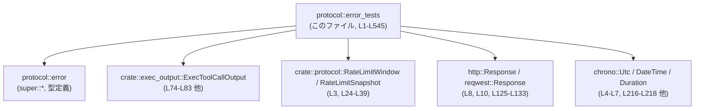
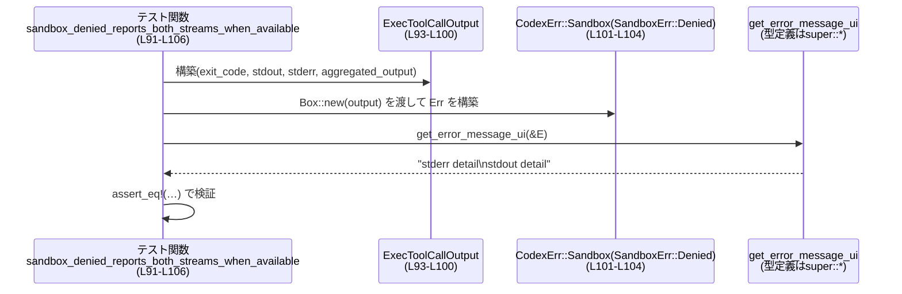
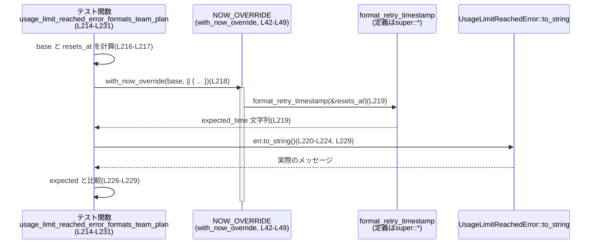

# protocol/src/error_tests.rs

## 0. ざっくり一言

`protocol/src/error_tests.rs` は、プロトコル層の各種エラー型（使用量制限、サンドボックス実行エラー、HTTP 応答エラーなど）が **どのようなユーザー向けメッセージやプロトコル表現に変換されるか** を検証するテスト群のファイルです（`super::*` からインポートされる型に対するテスト）（protocol/src/error_tests.rs:L1-L13）。

---

## 1. このモジュールの役割

### 1.1 概要

- このモジュールは、`UsageLimitReachedError` や `UnexpectedResponseError` などのエラー型が、**仕様どおりの文字列メッセージ・プロトコル情報を生成するか** を確認するテストを提供します。
- また、`CodexErr` の一部バリアントが `CodexErrorInfo` などのプロトコル表現に正しくマッピングされることを検証します（例: `server_overloaded_maps_to_protocol`（L65-L72）、`to_error_event_handles_response_stream_failed`（L125-L150））。
- 使用量制限エラーについては、**プラン種別**・**再試行可能時刻**・**レートリミット情報**・**プロモーションメッセージ**などの組み合わせによるメッセージ分岐を網羅的にテストしています（L51-L63, L172-L287, L289-L306, L308-L332, L334-L349, L473-L545）。

### 1.2 アーキテクチャ内での位置づけ

このファイルはテスト専用であり、対象となる本体実装は `super::*` や他モジュールにあります。依存関係は次のようになります。



- 実際のエラー型・関数（`UsageLimitReachedError`, `CodexErr`, `get_error_message_ui`, `format_retry_timestamp`, `NOW_OVERRIDE` など）は `super::*` でインポートされており、このチャンクには定義は現れません（L1, L42-L49, L219, L294, L339 他）。
- 外部クレートとして `chrono`, `http`, `reqwest` などを利用し、HTTP ステータスや日付時刻に依存する挙動を再現しています（L4-L7, L8, L10-L13, L125-L133, L351-L368）。

### 1.3 設計上のポイント

コードから読み取れる設計上の特徴は次のとおりです。

- **エラーはリッチなコンテキストを持つ**
  - 使用量制限: プラン (`PlanType` / `KnownPlan`)・レートリミットスナップショット (`RateLimitSnapshot` / `RateLimitWindow`)・再試行時刻 (`resets_at`)・プロモメッセージ (`promo_message`) を受け取り、メッセージが変化します（L51-L58, L172-L179, L214-L225, L308-L321, L527-L540）。
  - HTTP 応答: ステータスコード、本文、URL、Cloudflare Ray ID、リクエスト ID、ID 基盤の認可エラー情報を持つ `UnexpectedResponseError` がテストされています（L351-L362, L371-L381, L390-L401, L411-L422, L433-L443, L453-L463）。

- **Display 実装とプロトコル変換の仕様をテストで固定**
  - `to_string()` 出力を厳密に比較することで、ユーザー向けメッセージの仕様を固定しています（例: L51-L63, L351-L369）。
  - `CodexErr::to_codex_protocol_error()` や `CodexErr::to_error_event()` の戻り値を検証して、プロトコル側のエラー表現 (`CodexErrorInfo`) が期待どおりであることを確認しています（L65-L72, L125-L150）。

- **時間依存のロジックはスレッドローカルな now オーバーライドでテスト**
  - `with_now_override` が `NOW_OVERRIDE.with` を使って現在時刻を一時的に差し替え、`format_retry_timestamp` と `UsageLimitReachedError` の動作を決定論的にテストします（L42-L49, L214-L231, L289-L306, L334-L349, L473-L507, L510-L545）。

- **サンドボックスエラーのメッセージは段階的フォールバック**
  - 標準エラー・標準出力・集約出力・終了コードの順で情報を利用していることがテストから読み取れます（L74-L89, L91-L106, L108-L123, L152-L170）。

- **安全性・エラー・並行性に関するポイント**
  - テスト内では `unwrap` を積極的に使い、前提が壊れた場合にはパニックしてテスト失敗とする方針です（例: URL パースや HTTP レスポンス構築での `unwrap`（L129-L133, L216, L291, L310, L336, L475, L494, L512, L529））。
  - `NOW_OVERRIDE.with` は Rust の `thread_local!` で生成されるインターフェースと同じ形で呼ばれており（L42-L49）、テストの「現在時刻」オーバーライドがスレッドローカルであることが示唆されます。このため、並列実行される他スレッドのテストと競合しにくい構造になっています。

---

## 2. 主要な機能一覧（テスト対象の振る舞い）

このファイル自体はテスト専用ですが、テストを通じて以下の機能仕様が確認されています。

- 使用量制限エラーのメッセージ:
  - プラン種別（Free / Go / Plus / Pro / Team / Business / SelfServeBusinessUsageBased / EnterpriseCbpUsageBased / Enterprise / その他）ごとの文言（L51-L63, L172-L287, L289-L306, L473-L489）。
  - `resets_at` がある場合とない場合の「try again later / at {time}」の違い（L214-L231, L289-L306, L334-L349, L473-L507, L510-L545）。
  - `RateLimitSnapshot.limit_name` が Codex 以外のとき、アップセル文言を隠し、limit_name を含むメッセージにする挙動（L308-L332）。
  - `promo_message` がある場合に、その文言を優先的に挿入する挙動（L527-L545）。

- サンドボックスエラーの UI メッセージ選択 (`get_error_message_ui`):
  - `stderr` が空で、`aggregated_output` に内容がある場合は集約出力を使う（L74-L89）。
  - `stderr` と `stdout` が両方ある場合は `"stderr\nstdout"` の順で表示する（L91-L106）。
  - `stderr` が空で `stdout` だけある場合は `stdout` を使う（L108-L123）。
  - すべての出力が空の場合、終了コードを使ったメッセージにフォールバックする（L152-L170）。

- プロトコルエラーへのマッピング:
  - `CodexErr::ServerOverloaded` が `CodexErrorInfo::ServerOverloaded` に変換される（L65-L72）。
  - `CodexErr::ResponseStreamFailed` が `to_error_event` により、
    - 読み取りエラーの文字列表現を含む `message`
    - HTTP ステータスコードを持つ `CodexErrorInfo::ResponseStreamConnectionFailed`
    を生成する（L125-L150）。

- HTTP 応答エラー (`UnexpectedResponseError`) のメッセージ整形:
  - Cloudflare の HTML エラーページは一定の定型文 (`CLOUDFLARE_BLOCKED_MESSAGE`) に簡略化される（L351-L369）。
  - プレーンテキスト本文はそのまま表示される（L371-L387）。
  - JSON 本文中の `error.message` があれば、本文の代わりにそれを利用する（L390-L408）。
  - 本文が長すぎる場合、`UNEXPECTED_RESPONSE_BODY_MAX_BYTES` バイトで切り詰め、`...` を付加する（L411-L430）。
  - `cf_ray` や `request_id`、ID 基盤の認可エラー情報が存在するときはメッセージ末尾に追記される（L351-L369, L433-L450, L453-L470）。

- 時刻表記の一貫性:
  - `format_retry_timestamp` が生成した文字列が、そのまま使用量制限エラーのメッセージ中に埋め込まれることを確認（L214-L231, L289-L306, L334-L349, L473-L507, L510-L545）。

---

## 3. 公開 API と詳細解説（テストを通じて見えるインターフェース）

このファイルはテスト専用で公開 API を定義していませんが、**テスト対象として利用している型・関数** が実質的な API となります。

### 3.1 型一覧（本ファイルで利用される主要な型）

| 名前 | 種別 | 役割 / 用途 | 使用箇所（根拠） |
|------|------|-------------|-------------------|
| `UsageLimitReachedError` | 構造体 | 使用量制限に達したことを表すエラー。プラン種別・レートリミット情報・再試行時刻・プロモメッセージを保持し、`to_string()` でユーザー向け文言を生成する。 | インスタンス生成（L51-L58, L172-L179, L200-L207, L214-L225, L233-L240, L247-L254, L261-L268, L275-L282, L289-L300, L308-L326, L334-L345, L473-L484, L492-L503, L510-L521, L527-L540） |
| `PlanType` | 列挙体 | プラン種別を表す。少なくとも `Known(KnownPlan)` バリアントを持つ。 | `PlanType::Known(...)` の利用（L54, L175, L189, L221, L236, L250, L264, L278, L296, L315, L480） |
| `KnownPlan` | 列挙体 | 具体的なプラン名（`Plus`, `Pro`, `Free`, `Go`, `Team`, `Business`, `SelfServeBusinessUsageBased`, `EnterpriseCbpUsageBased`, `Enterprise` など）を表す。 | バリアント利用（L54, L175, L189, L221, L236, L250, L264, L278, L296, L315, L480） |
| `RateLimitSnapshot` | 構造体 | プライマリ/セカンダリのレートリミット情報や limit ID / name を保持するスナップショット。 | 補助関数 `rate_limit_snapshot` の戻り値として構築（L15-L39）、およびテスト内で `Box::new(...)` で利用（L56, L177, L191, L205, L223, L238, L252, L266, L280, L298, L317-L321, L343, L482, L501, L519, L536） |
| `RateLimitWindow` | 構造体 | 各レートリミット窓の使用率やリセット時刻などを保持。 | `RateLimitSnapshot.primary` / `secondary` フィールドに設定（L27-L36） |
| `CodexErr` | 列挙体 | Codex 関連のエラー全般を表す。`ServerOverloaded`, `Sandbox`, `ResponseStreamFailed` などのバリアントを持つ。 | バリアント使用（L67, L84, L101, L118, L133, L162） |
| `SandboxErr` | 列挙体 | サンドボックス実行に関するエラー。`Denied { output, network_policy_decision }` バリアントを持つ。 | `CodexErr::Sandbox(SandboxErr::Denied { ... })`（L84-L87, L101-L104, L118-L121, L162-L165） |
| `ExecToolCallOutput` | 構造体 | サンドボックス内プログラム実行の結果（exit code, stdout, stderr, aggregated_output, duration, timed_out）を保持。 | インスタンス生成（L76-L83, L93-L100, L110-L117, L154-L161） |
| `UnexpectedResponseError` | 構造体 | 期待しない HTTP 応答（例: 異常なステータスコード）を表すエラー。ステータス・本文・URL・Cloudflare Ray ID などを持つ。 | インスタンス生成（L353-L362, L373-L381, L392-L401, L414-L422, L435-L443, L455-L463） |
| `ResponseStreamFailed` | 構造体 | HTTP 応答ストリームの読み取り失敗を表すエラー。元の `reqwest::Error` と `request_id` を保持。 | インスタンス生成（L133-L136） |
| `CodexErrorInfo` | 列挙体 | プロトコル側のエラー表現。`ServerOverloaded` や `ResponseStreamConnectionFailed { http_status_code: Option<i32> }` を持つ。 | 比較に使用（L70-L71, L145-L148） |
| `StreamOutput` | 構造体 | 標準出力/標準エラー/集約出力を保持するストリーム型。`new(String)` コンストラクタを持つ。 | サンドボックス出力の構築（L78-L80, L95-L97, L112-L114, L156-L158） |
| `DateTime<Utc>` | 構造体 | `chrono` の日付時刻型。現在時刻やリセット時刻の表現に使う。 | `with_now_override` 引数（L42）、`base` / `resets_at` の型（L214-L218, L289-L293, L334-L338, L473-L477, L492-L496, L510-L513, L529-L531） |

> 注: 上記の型定義そのものはこのチャンクには含まれていません。型の役割は、構築時に指定されているフィールド・バリアントから読み取れる範囲で説明しています。

### 3.2 関数詳細（代表的な 7 件）

#### `rate_limit_snapshot() -> RateLimitSnapshot`（L15-L40）

**概要**

- テスト用に固定値の `RateLimitSnapshot` を生成する補助関数です。主に `UsageLimitReachedError` テストで使われます（L51-L58 など）。

**引数**

- なし。

**戻り値**

- `RateLimitSnapshot`  
  - `primary` と `secondary` に、それぞれ 1 時間・2 時間の固定リセット時刻と使用率を持つ `RateLimitWindow` を設定したスナップショット（L24-L36）。

**内部処理の流れ**

1. `Utc.with_ymd_and_hms` で 2024-01-01 01:00:00 と 02:00:00 の `DateTime<Utc>` を生成し、それぞれ `timestamp()`（Unix 秒）に変換します（L16-L23）。
2. それらを `primary_reset_at` / `secondary_reset_at` に格納します（L16-L23）。
3. `RateLimitSnapshot` 構造体を初期化し、`primary` と `secondary` の `RateLimitWindow` に使用率と `window_minutes`、`resets_at` を設定します（L24-L36）。
4. `limit_id`, `limit_name`, `credits`, `plan_type` は `None` とします（L25-L26, L37-L38）。

**Examples（使用例）**

テスト内と同様に、使用量制限エラーのコンストラクタに渡して利用します。

```rust
// テスト用のレートリミット情報を構築する（L15-L39）
let snapshot = rate_limit_snapshot();

// UsageLimitReachedError に静的な rate_limits を与える（L51-L58）
let err = UsageLimitReachedError {
    plan_type: None,
    resets_at: None,
    rate_limits: Some(Box::new(snapshot)),
    promo_message: None,
};
```

**Errors / Panics**

- `Utc.with_ymd_and_hms(...).unwrap()` を使用しているため、日時生成が失敗した場合は panic します（L17-L18, L21-L22）。指定している日時は妥当なため、通常は発生しません。

**Edge cases（エッジケース）**

- `RateLimitSnapshot` の他フィールド（`credits`, `plan_type`）は `None` なので、それらを使用するロジックはこの補助関数ではテストされません。

**使用上の注意点**

- あくまでテスト用の固定スナップショットであり、実運用のレートリミット値とは無関係です。
- リセット時刻は「現在時刻」との差分ではなく、絶対 Unix 秒で固定されています。

---

#### `with_now_override<T>(now: DateTime<Utc>, f: impl FnOnce() -> T) -> T`（L42-L49）

**概要**

- テスト中だけ、`NOW_OVERRIDE` を使って「現在時刻」を一時的に `now` に差し替え、クロージャ `f` を実行するユーティリティです。
- 使用量制限メッセージに含まれる再試行時刻の表記が、テストごとに安定するようにするために使われます（L214-L231, L289-L306, L334-L349, L473-L507, L510-L545）。

**引数**

| 引数名 | 型 | 説明 |
|--------|----|------|
| `now` | `DateTime<Utc>` | テスト時に使用する「現在時刻」。 |
| `f` | `impl FnOnce() -> T` | `now` を反映させた状態で実行するクロージャ。 |

**戻り値**

- `T`  
  - クロージャ `f` の戻り値をそのまま返します（L45-L48）。

**内部処理の流れ**

1. `NOW_OVERRIDE.with(|cell| { ... })` を呼び出し、スレッドローカルなセルにアクセスします（L43）。
2. `cell.borrow_mut()` によりミュータブル参照を取得し、`Some(now)` を設定します（L44）。  
   これにより、テスト対象コード側が「現在時刻」を取得する際に、この値を利用できるようになります。
3. クロージャ `f()` を実行し、その結果を `result` に保存します（L45）。
4. 再び `cell.borrow_mut()` で `NOW_OVERRIDE` を `None` に戻し、副作用をクリーンアップします（L46）。
5. `result` を返します（L47-48）。

**Examples（使用例）**

```rust
let base = Utc.with_ymd_and_hms(2024, 1, 1, 0, 0, 0).unwrap(); // 基準時刻（L214-L216）

with_now_override(base, move || {                            // now を base に固定（L218）
    let resets_at = base + ChronoDuration::hours(1);         // 1時間後（L217）
    let expected_time = format_retry_timestamp(&resets_at);  // 「再試行時刻」の文字列を生成（L219）

    let err = UsageLimitReachedError { /* ... */ };          // この err.to_string() 内で NOW_OVERRIDE が使われる（L220-L225）
    assert!(err.to_string().contains(&expected_time));       // メッセージに expected_time が含まれることを検証
});
```

**Errors / Panics**

- `NOW_OVERRIDE` の中身は `RefCell` を通じて操作されているため、同じスレッド内でネストした `with_now_override` 呼び出しがある場合、二重借用で panic する可能性があります。ただし、このチャンクにはネスト利用は登場しません。
- `now` 自体の生成（`with_ymd_and_hms(...).unwrap()`）が失敗した場合には別途 panic します（L216, L291, L336, L475, L494, L512, L529）。

**Edge cases**

- `with_now_override` 内で panic が発生した場合、`NOW_OVERRIDE` が `None` に戻されるかどうかはコードからは分かりません（`drop` タイミングに依存）。このチャンクでは考慮されていません。

**使用上の注意点**

- テスト専用のユーティリティとみなすのが自然です。プロダクションコードでの利用を想定した記述はありません。
- 並列テスト実行でもスレッドごとに独立した `NOW_OVERRIDE` が使われる（`with` というインターフェースから推測）ため、テスト間で時刻オーバーライドが干渉しにくい構造です。

---

#### `usage_limit_reached_error_formats_plus_plan()`（#[test], L51-L63）

**概要**

- `UsageLimitReachedError` の `plan_type` が `KnownPlan::Plus` のとき、再試行時刻やプロモメッセージが無い場合のメッセージが **Pro へのアップグレード + クレジット購入 URL + 再試行案内** になることを検証するテストです（L51-L62）。

**引数**

- なし（テスト関数）。

**戻り値**

- なし。`assert_eq!` による検証のみを行います（L59-L62）。

**内部処理の流れ**

1. `UsageLimitReachedError` のインスタンスを構築し、`plan_type: Some(PlanType::Known(KnownPlan::Plus))`、`rate_limits: Some(Box::new(rate_limit_snapshot()))` とします（L53-L57）。
2. 他のフィールド `resets_at` と `promo_message` は `None` に設定します（L55-L56）。
3. `err.to_string()` の戻り値が、期待する文字列と完全一致することを `assert_eq!` で検証します（L59-L62）。

**Examples（使用例）**

このテストは、Plus プランユーザーに対するメッセージ仕様の例として利用できます。

```rust
let err = UsageLimitReachedError {
    plan_type: Some(PlanType::Known(KnownPlan::Plus)),
    resets_at: None,
    rate_limits: Some(Box::new(rate_limit_snapshot())),
    promo_message: None,
};

let message = err.to_string();
// "You've hit your usage limit. Upgrade to Pro (...), visit .../usage to purchase more credits or try again later."
```

**Errors / Panics**

- `RateLimitSnapshot` 構築時の `unwrap()` が失敗した場合には panic しますが、指定日時は妥当です（L17-L18, L21-L22）。
- `assert_eq!` が失敗するとテストは失敗扱いとなります（L59-L62）。

**Edge cases**

- `resets_at` が `Some` の場合の挙動はこのテストでは扱っていません。同様のケースは `usage_limit_reached_includes_hours_and_minutes` など別テストで検証されています（L473-L489）。
- プロモメッセージが存在する場合（`promo_message: Some(...)`）もこのテストではカバーされていません（該当テストは L527-L545）。

**使用上の注意点**

- エラーメッセージ文字列の変更（URL の変更・文言修正など）は、このテストを含む複数のテキスト比較テストを更新する必要があります。

---

#### `usage_limit_reached_error_formats_team_plan()`（#[test], L214-L231）

**概要**

- プランが `KnownPlan::Team` で、`resets_at` が存在する場合の `UsageLimitReachedError` メッセージが、**「管理者へのリクエスト」+「具体的な再試行時刻」** を含むことを検証するテストです（L214-L231）。

**引数**

- なし。

**戻り値**

- なし。

**内部処理の流れ**

1. `base` として 2024-01-01 00:00:00 の `DateTime<Utc>` を生成します（L216）。
2. `resets_at` を `base + 1時間` として計算します（L217）。
3. `with_now_override(base, move || { ... })` の中で、`format_retry_timestamp(&resets_at)` を呼び出して期待される再試行時刻文字列 `expected_time` を得ます（L218-L219）。
4. `UsageLimitReachedError` を `plan_type: Team`, `resets_at: Some(resets_at)` などで構築します（L220-L224）。
5. 期待文字列として `"... send a request to your admin or try again at {expected_time}."` を組み立てます（L226-L228）。
6. 実際の `err.to_string()` と `expected` が一致することを `assert_eq!` で確認します（L229）。

**Examples（使用例）**

```rust
let base = Utc.with_ymd_and_hms(2024, 1, 1, 0, 0, 0).unwrap();
let resets_at = base + ChronoDuration::hours(1);

with_now_override(base, move || {
    let expected_time = format_retry_timestamp(&resets_at);
    let err = UsageLimitReachedError {
        plan_type: Some(PlanType::Known(KnownPlan::Team)),
        resets_at: Some(resets_at),
        rate_limits: Some(Box::new(rate_limit_snapshot())),
        promo_message: None,
    };

    assert!(err.to_string().contains(&expected_time));
});
```

**Errors / Panics**

- `with_ymd_and_hms(...).unwrap()` による日時生成の失敗で panic し得ます（L216）。
- `format_retry_timestamp` 自体の挙動はこのチャンクには定義がありませんが、もし内部で panic する可能性があれば、ここにも影響します。

**Edge cases**

- `resets_at` が `None` の Team プラン（たとえば無期限ブロック）がどのように表示されるかは、このチャンクからは分かりません（該当テストは存在しません）。
- `NOW_OVERRIDE` 未使用で `resets_at` を生成した場合、現在時刻に依存するロジックがあるとテストが不安定になる可能性があります。

**使用上の注意点**

- Team / Business 系プランのメッセージは「管理者へのリクエスト」がキーとなっており、他プランとは文言が異なります。文言変更時には、対応する複数テスト（Business, SelfServeBusinessUsageBased, EnterpriseCbpUsageBased など）も合わせて更新する必要があります（L233-L245, L247-L259, L261-L273）。

---

#### `sandbox_denied_reports_both_streams_when_available()`（#[test], L91-L106）

**概要**

- サンドボックス実行が拒否された際、`stdout` と `stderr` の両方に内容がある場合に、UI 向けメッセージとして **`stderr` → `stdout` の順に改行付きで結合** した文字列が返ることを検証するテストです（L91-L106）。

**引数**

- なし。

**戻り値**

- なし。

**内部処理の流れ**

1. `ExecToolCallOutput` を生成し、`stdout` に `"stdout detail"`, `stderr` に `"stderr detail"` を設定します（L93-L97）。`aggregated_output` は空文字列です（L97）。
2. それを `Box::new(output)` として `SandboxErr::Denied` の `output` フィールドに渡します（L101-L103）。
3. `CodexErr::Sandbox(...)` としてラップし、`err` を構築します（L101-L104）。
4. `get_error_message_ui(&err)` の戻り値が `"stderr detail\nstdout detail"` になることを `assert_eq!` で確認します（L105）。

**Examples（使用例）**

```rust
let output = ExecToolCallOutput {
    exit_code: 9,
    stdout: StreamOutput::new("stdout detail".to_string()),
    stderr: StreamOutput::new("stderr detail".to_string()),
    aggregated_output: StreamOutput::new(String::new()),
    duration: Duration::from_millis(10),
    timed_out: false,
};

let err = CodexErr::Sandbox(SandboxErr::Denied {
    output: Box::new(output),
    network_policy_decision: None,
});

let ui_message = get_error_message_ui(&err);
// "stderr detail\nstdout detail"
```

**Errors / Panics**

- このテスト関数内には `unwrap` は存在せず（L91-L106）、エラー発生は `get_error_message_ui` 内部の挙動に依存しますが、このチャンクからは分かりません。

**Edge cases**

- `stderr` と `stdout` がどちらも空で `aggregated_output` も空のケースは別テストで扱われています（L152-L170）。
- `aggregated_output` と `stderr` が両方非空のケースはこのチャンクには出てこないため、その優先順位は不明です。

**使用上の注意点**

- UI 向けメッセージにどの標準ストリームを優先するかは仕様としてテストで固定されています。  
  仕様変更（例えば `stdout` 優先にするなど）は、このテストを含む 4 つのサンドボックス関連テスト（L74-L89, L91-L106, L108-L123, L152-L170）を更新する必要があります。

---

#### `to_error_event_handles_response_stream_failed()`（#[test], L125-L150）

**概要**

- `CodexErr::ResponseStreamFailed` バリアントに対する `to_error_event` の挙動を検証し、HTTP ステータス 429 の `reqwest::Error` から適切なエラーイベントが生成されることを確認するテストです（L125-L150）。

**引数**

- なし。

**戻り値**

- なし。

**内部処理の流れ**

1. `http::Response` ビルダーで 429 (TOO_MANY_REQUESTS) の HTTP 応答を構築し、URL を `http://example.com` に設定します（L127-L131）。
2. それを `reqwest::Response::from(response)` に変換し、`error_for_status_ref().unwrap_err()` を呼び出して `reqwest::Error` を得ます（L132）。
3. その `source` と `request_id: Some("req-123")` を持つ `ResponseStreamFailed` を構築し、それを `CodexErr::ResponseStreamFailed` としてラップします（L133-L136）。
4. `err.to_error_event(Some("prefix".to_string()))` を呼び出し、エラーイベント `event` を取得します（L138）。
5. `event.message` が `"prefix: Error while reading the server response: HTTP status client error (429 Too Many Requests) for url (http://example.com/), request id: req-123"` になること（L140-L143）と、
6. `event.codex_error_info` が `Some(CodexErrorInfo::ResponseStreamConnectionFailed { http_status_code: Some(429) })` となることを検証します（L144-L148）。

**Examples（使用例）**

```rust
// 429 応答から reqwest::Error を生成（L127-L133）
let response = HttpResponse::builder()
    .status(StatusCode::TOO_MANY_REQUESTS)
    .url(Url::parse("http://example.com").unwrap())
    .body("")
    .unwrap();
let source = Response::from(response).error_for_status_ref().unwrap_err();

let err = CodexErr::ResponseStreamFailed(ResponseStreamFailed {
    source,
    request_id: Some("req-123".to_string()),
});

let event = err.to_error_event(Some("prefix".to_string()));
// event.message / event.codex_error_info を UI やロギングに利用可能
```

**Errors / Panics**

- URL パースや HTTP レスポンス構築に `unwrap` を使用しているため、異常値を与えた場合には panic します（L129-L133）。
- `error_for_status_ref().unwrap_err()` は成功ステータスのとき panic しますが、ここでは 429 を明示しているため正常に `Err` を返します（L128-L132）。

**Edge cases**

- `request_id: None` の場合の `to_error_event` 挙動はこのテストでは扱われていません。
- HTTP ステータスが 4xx / 5xx 以外のときの振る舞いも、このチャンクにはテストがありません。

**使用上の注意点**

- `to_error_event` はメッセージ先頭にオプションの `prefix` を付けているため、呼び出し元はログタグなどを付与できますが、フォーマット変更はこのテストに影響します。

---

#### `unexpected_status_cloudflare_html_is_simplified()`（#[test], L351-L369）

**概要**

- `UnexpectedResponseError` が Cloudflare HTML エラーページを受け取った際に、長い HTML 本文を **`CLOUDFLARE_BLOCKED_MESSAGE` という定型文に置き換えて** 表示することを検証するテストです（L351-L369）。

**引数**

- なし。

**戻り値**

- なし。

**内部処理の流れ**

1. `UnexpectedResponseError` を構築し、`status: 403 FORBIDDEN`、`body` に Cloudflare ブロックメッセージを含む HTML を設定します（L353-L356）。
2. `url: Some("http://example.com/blocked")`, `cf_ray: Some("ray-id")` を指定し、リクエスト ID や ID 認可エラー情報は `None` とします（L357-L361）。
3. `StatusCode::FORBIDDEN.to_string()` を `status` 変数に保存し、`url` 文字列も別変数に保存します（L363-L364）。
4. `err.to_string()` が `"{CLOUDFLARE_BLOCKED_MESSAGE} (status {status}), url: {url}, cf-ray: ray-id"` と一致することを検証します（L365-L368）。

**Examples（使用例）**

```rust
let err = UnexpectedResponseError {
    status: StatusCode::FORBIDDEN,
    body: "<html><body>Cloudflare error: Sorry, you have been blocked</body></html>".to_string(),
    url: Some("http://example.com/blocked".to_string()),
    cf_ray: Some("ray-id".to_string()),
    request_id: None,
    identity_authorization_error: None,
    identity_error_code: None,
};

let message = err.to_string();
// CLOUDFLARE_BLOCKED_MESSAGE (status 403 Forbidden), url: http://example.com/blocked, cf-ray: ray-id
```

**Errors / Panics**

- このテスト関数内に `unwrap` はなく、panic の可能性は `UnexpectedResponseError` の `Display` 実装に依存しますが、このチャンクからは分かりません。

**Edge cases**

- Cloudflare の HTML であっても、本文フォーマットが変わった場合にどの程度マッチするかは、このテストからは読み取れません（単一の HTML 文字列のみをテストしています）。
- `cf_ray: None` の場合には、別テスト `unexpected_status_non_html_is_unchanged` などでの挙動を参照する必要があります（L371-L387）。

**使用上の注意点**

- Cloudflare によるブロックページの扱いは、通常の HTTP エラーと異なり、本文をそのままユーザーに見せない前提の仕様になっていることが、このテストから分かります。

---

### 3.3 その他の関数（テスト関数一覧）

テスト関数はすべて引数・戻り値なしの `#[test]` 関数で、ここでは名前と目的のみをまとめます。

| 関数名 | 役割（1 行） | 行番号 |
|--------|--------------|--------|
| `server_overloaded_maps_to_protocol` | `CodexErr::ServerOverloaded` が `CodexErrorInfo::ServerOverloaded` にマッピングされることを検証（`to_codex_protocol_error`）（L65-L72）。 | protocol/src/error_tests.rs:L65-L72 |
| `sandbox_denied_uses_aggregated_output_when_stderr_empty` | `stderr` も `stdout` も空で `aggregated_output` のみ非空なとき、集約出力メッセージが UI に表示されることを確認（L74-L89）。 | L74-L89 |
| `sandbox_denied_reports_stdout_when_no_stderr` | `stderr` が空で `stdout` のみ非空なとき、`stdout` 内容が UI メッセージになることを検証（L108-L123）。 | L108-L123 |
| `sandbox_denied_reports_exit_code_when_no_output_available` | すべての出力が空な場合、終了コードを使ったメッセージにフォールバックすることを確認（L152-L170）。 | L152-L170 |
| `usage_limit_reached_error_formats_free_plan` | Free プランでの使用量制限メッセージが Plus へのアップグレードを案内することを検証（L172-L184）。 | L172-L184 |
| `usage_limit_reached_error_formats_go_plan` | Go プランでも Free と同様の Plus へのアップグレード文言になることを検証（L186-L198）。 | L186-L198 |
| `usage_limit_reached_error_formats_default_when_none` | プラン情報がない場合に、汎用メッセージ "Try again later." になることを検証（L200-L212）。 | L200-L212 |
| `usage_limit_reached_error_formats_business_plan_without_reset` | Business プランで `resets_at: None` のとき、管理者へのリクエスト + "try again later" になることを確認（L233-L245）。 | L233-L245 |
| `usage_limit_reached_error_formats_self_serve_business_usage_based_plan` | Self-serve Business usage-based プランで同様の文言になることを検証（L247-L259）。 | L247-L259 |
| `usage_limit_reached_error_formats_enterprise_cbp_usage_based_plan` | Enterprise CBP usage-based プランで同様の文言になることを検証（L261-L273）。 | L261-L273 |
| `usage_limit_reached_error_formats_default_for_other_plans` | Enterprise などその他プランでは、汎用 "Try again later." にフォールバックする仕様を検証（L275-L287）。 | L275-L287 |
| `usage_limit_reached_error_formats_pro_plan_with_reset` | Pro プランで `resets_at` ありのとき、クレジット購入 URL + 再試行時刻を含むメッセージであることを確認（L289-L306）。 | L289-L306 |
| `usage_limit_reached_error_hides_upsell_for_non_codex_limit_name` | `limit_name` が Codex 以外のときは Plus へのアップセルを表示せず、limit 名と再試行時刻のみを案内することを検証（L308-L332）。 | L308-L332 |
| `usage_limit_reached_includes_minutes_when_available` | リセットまで数分のケースで、再試行時刻がメッセージに含まれることを確認（L334-L349）。 | L334-L349 |
| `unexpected_status_non_html_is_unchanged` | HTML でないプレーンテキスト本文はそのままメッセージに利用されることを検証（L371-L387）。 | L371-L387 |
| `unexpected_status_prefers_error_message_when_present` | JSON 本文内に `error.message` がある場合、それを本文として優先使用することを検証（L390-L408）。 | L390-L408 |
| `unexpected_status_truncates_long_body_with_ellipsis` | 本文が `UNEXPECTED_RESPONSE_BODY_MAX_BYTES` を超える時、切り詰めて `...` を付加する挙動を検証（L411-L430）。 | L411-L430 |
| `unexpected_status_includes_cf_ray_and_request_id` | `cf_ray` と `request_id` がある場合、メッセージ末尾に両方を表示することを確認（L433-L450）。 | L433-L450 |
| `unexpected_status_includes_identity_auth_details` | ID 認可エラー内容とコードがある場合、それらもメッセージに含めることを検証（L453-L470）。 | L453-L470 |
| `usage_limit_reached_includes_hours_and_minutes` | リセットまで数時間＋分のケースで、再試行時刻文字列がメッセージに含まれることを確認（L473-L489）。 | L473-L489 |
| `usage_limit_reached_includes_days_hours_minutes` | リセットまで数日＋時間＋分のケースの再試行時刻がメッセージに反映されることを検証（L492-L507）。 | L492-L507 |
| `usage_limit_reached_less_than_minute` | リセットまで 1 分未満のケースの再試行時刻がメッセージに含まれることを確認（L510-L524）。 | L510-L524 |
| `usage_limit_reached_with_promo_message` | `promo_message` が設定されている場合、その文言がメッセージに挿入されることを検証（L527-L545）。 | L527-L545 |

---

## 4. データフロー

### 4.1 サンドボックス Denied エラーの UI メッセージ生成フロー（L91-L106）

`sandbox_denied_reports_both_streams_when_available`（L91-L106）を例に、サンドボックスエラーから UI メッセージが生成される流れです。



**要点**

- 出力ストリーム情報は `ExecToolCallOutput` にすべて集約され、それを `SandboxErr::Denied` に埋め込んでから `CodexErr::Sandbox` にラップしています（L93-L104）。
- UI 用メッセージ生成は `get_error_message_ui` 1 箇所に集約されており、テストはその戻り値のみを検証します（L105）。

### 4.2 使用量制限エラーの再試行時刻メッセージ生成フロー（L214-L231）

`usage_limit_reached_error_formats_team_plan`（L214-L231）での時刻関連データフローです。



**要点**

- `NOW_OVERRIDE` により「現在時刻」を固定した状態で `format_retry_timestamp` と `UsageLimitReachedError::to_string` を同一コンテキストで実行することで、時刻差の表記がブレないようにしています（L42-L49, L214-L231）。
- 再試行時刻のフォーマット自体は `format_retry_timestamp` に委譲されており、`UsageLimitReachedError` はそれを文字列として埋め込むだけであることがテストから分かります（L219, L226-L229）。

---

## 5. 使い方（How to Use）

このファイルはテスト専用ですが、**エラー型の期待される挙動** を理解したり、**新しいエラーやプランを追加する際のテストの書き方** の参考になります。

### 5.1 基本的な使用方法（テストを書く流れ）

典型的なテストの流れは次のとおりです。

1. 入力となる構造体やエラーを構築する。
2. テスト対象のメソッド（`to_string`, `to_error_event`, `get_error_message_ui` など）を呼び出す。
3. 期待するメッセージやエラー情報と `assert_eq!` で比較する。

```rust
// 1. エラー値を構築する（Plus プランの使用量制限エラー）(L51-L58)
let err = UsageLimitReachedError {
    plan_type: Some(PlanType::Known(KnownPlan::Plus)),
    resets_at: None,
    rate_limits: Some(Box::new(rate_limit_snapshot())),
    promo_message: None,
};

// 2. Display 実装を通じてユーザー向けメッセージを生成する (L59-L61)
let message = err.to_string();

// 3. 期待するメッセージと比較する
assert_eq!(
    message,
    "You've hit your usage limit. Upgrade to Pro (https://chatgpt.com/explore/pro), \
     visit https://chatgpt.com/codex/settings/usage to purchase more credits or try again later."
);
```

時間に依存するテストでは、`with_now_override` と `format_retry_timestamp` を併用するパターンが基本です（L214-L231, L289-L306, L334-L349, L473-L507, L510-L545）。

### 5.2 よくある使用パターン

- **Display 実装の検証 (`to_string`)**
  - 使用量制限エラー (`UsageLimitReachedError`) のメッセージをプラン/時刻/limit 名/プロモメッセージの組み合わせごとにテストしています（L51-L63 ほか）。
  - HTTP 応答エラー (`UnexpectedResponseError`) の JSON / HTML / プレーンテキスト / 長文それぞれの表示仕様を網羅テストしています（L351-L470）。

- **プロトコルマッピングの検証**
  - `CodexErr::ServerOverloaded` → `CodexErrorInfo::ServerOverloaded`（L65-L72）。
  - `CodexErr::ResponseStreamFailed` → エラーイベント + `CodexErrorInfo::ResponseStreamConnectionFailed`（L125-L150）。

- **UI メッセージのフォールバック順序の検証**
  - サンドボックスエラーで `stderr` / `stdout` / `aggregated_output` / `exit_code` のどれが使われるかを組み合わせでテストします（L74-L89, L91-L106, L108-L123, L152-L170）。

### 5.3 よくある間違いと正しい例

**誤り例: 時刻依存テストで `with_now_override` を使わない**

```rust
// 誤り例（現在時刻に依存しテストが不安定になりうる）
let resets_at = Utc::now() + ChronoDuration::hours(1);
let err = UsageLimitReachedError { /* ... */ };
assert!(err.to_string().contains("try again at")); // 厳密な比較ができない
```

**正しい例: `with_now_override` を使って決定論的に**

```rust
let base = Utc.with_ymd_and_hms(2024, 1, 1, 0, 0, 0).unwrap();
let resets_at = base + ChronoDuration::hours(1);

with_now_override(base, move || {
    let expected_time = format_retry_timestamp(&resets_at);
    let err = UsageLimitReachedError { /* ... */ };
    assert!(err.to_string().contains(&expected_time));
});
```

**誤り例: サンドボックスエラーの UI 文字列を手書きで組み立てる（仕様とズレる）**

```rust
// 誤り: get_error_message_ui を通さず stdout だけを見る
if let CodexErr::Sandbox(SandboxErr::Denied { output, .. }) = err {
    println!("{}", output.stdout); // stderr や aggregated_output を無視
}
```

**正しい例: `get_error_message_ui` を利用**

```rust
// 正しくは共通関数に委譲する（L74-L89 などのテストが仕様を保証）
let ui_message = get_error_message_ui(&err);
// stderr / stdout / aggregated_output / exit_code の優先順位はここに隠蔽される
```

### 5.4 使用上の注意点（まとめ）

- **文字列仕様の固定**  
  多数のテストが `assert_eq!` で完全一致比較を行っているため、メッセージ文言や URL を変更するとテストが広範囲に壊れます。仕様変更時は、このファイルの関連テストをすべて見直す必要があります。

- **グローバル状態（時刻オーバーライド）**  
  `with_now_override` はスレッドローカルな `NOW_OVERRIDE` に依存しており、テスト以外で使うと予期しない時刻に基づく挙動を引き起こす可能性があります（L42-L49）。

- **エラー・パニック**  
  テストでは `unwrap` を多用しており（L17-L18, L21-L22, L129-L133, L216, L291, L310, L336, L475, L494, L512, L529）、前提が満たされない場合はすぐに panic します。これは「前提の破れ＝テストの失敗」とみなすための設計です。

---

## 6. 変更の仕方（How to Modify）

このファイル自体はテストですが、エラー処理ロジックを変更する際の目安にもなります。

### 6.1 新しい機能（エラー挙動）を追加する場合

1. **対象のエラー型・関数を特定する**
   - 例えば新しい `KnownPlan` バリアントや、新しい HTTP エラーケース（別種の JSON 形式など）を追加した場合、その型・関数は `super::*` 側で定義します。

2. **テストケースを追加する**
   - 既存のテストに倣って、新しい組み合わせに対するテストを 1 つ以上追加します。
   - 使用量制限であれば、`UsageLimitReachedError { plan_type: Some(PlanType::Known(KnownPlan::NewPlan)), ... }` などを構築して `to_string()` を検証します。

3. **時間依存があれば `with_now_override` を利用する**
   - 新しいエラー挙動が「何時間後に再試行可能」といった時間依存を持つ場合は、既存の時間関連テストと同様に `with_now_override` と `format_retry_timestamp` を利用します（L214-L231, L473-L507, L510-L545）。

4. **サンドボックスや HTTP エラーの場合**
   - サンドボックス出力の優先順位を変更する場合は、4 つのサンドボックス関連テストをすべて見直します（L74-L89, L91-L106, L108-L123, L152-L170）。
   - HTTP エラーの表示仕様を変更する場合は、`UnexpectedResponseError` 関連の 6 テスト（L351-L470）を確認・更新します。

### 6.2 既存の機能を変更する場合の注意点

- **契約条件（仕様）の確認**
  - 各テスト関数名は、その挙動の要約になっています（例: `unexpected_status_truncates_long_body_with_ellipsis`（L411-L430））。  
    挙動変更前に、該当テスト関数の名前・中身を読み、どの仕様を前提としているかを確認することが重要です。

- **影響範囲**
  - `UsageLimitReachedError` の `to_string` 仕様を変えると、20 以上のテストに影響します（L51-L63, L172-L287, L289-L306, L308-L332, L334-L349, L473-L545）。
  - `UnexpectedResponseError` の `Display` を変えると、少なくとも 6 テストに影響します（L351-L470）。

- **テストの追加・更新**
  - 新たに考慮したいエッジケース（例: `request_id` なしで Cloudflare HTML、`identity_authorization_error` の別フォーマットなど）があれば、対応するテストを追加すると仕様が明文化されます。

---

## 7. 関連ファイル

このテストモジュールと密接に関係するファイル・モジュールは、インポートと利用状況から次のように推測できます。

| パス / モジュール | 役割 / 関係 |
|-------------------|------------|
| `super::*`（正確なファイルパスはこのチャンクには現れません） | `UsageLimitReachedError`, `CodexErr`, `SandboxErr`, `ResponseStreamFailed`, `UnexpectedResponseError`, `CodexErrorInfo`, `get_error_message_ui`, `format_retry_timestamp`, `NOW_OVERRIDE`, `CLOUDFLARE_BLOCKED_MESSAGE`, `UNEXPECTED_RESPONSE_BODY_MAX_BYTES` など、テスト対象となるエラー型およびユーティリティを定義している親モジュールです（L1, L42-L49, L51-L58, L65-L72, L125-L150, L351-L470 他）。 |
| `crate::exec_output` | `ExecToolCallOutput` と `StreamOutput` を提供し、サンドボックス実行エラーの出力情報を表す型として使われています（L2, L74-L83, L93-L100, L110-L117, L154-L161）。 |
| `crate::protocol` | `RateLimitWindow` と `RateLimitSnapshot`（後者は this ファイル内では `super::*` から来ている可能性もあります）を提供し、レートリミット情報を保持するために利用されています（L3, L15-L39, L317-L321）。 |
| `reqwest` / `http` / `chrono` | それぞれ HTTP クライアントエラーの生成、HTTP レスポンスモック、日付時刻計算に用いられています（L4-L8, L10-L13, L125-L133, L351-L369, L371-L387, L390-L408, L411-L430）。 |

> これら関連ファイルの具体的なパスや中身は、このチャンクには現れないため、詳細な説明はできません。エラー型やユーティリティの仕様をより深く理解するには、それらの定義元ファイルを参照する必要があります。
