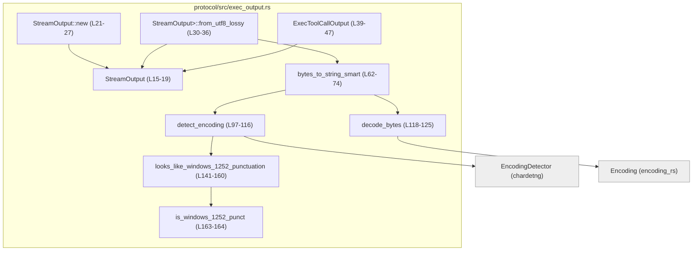
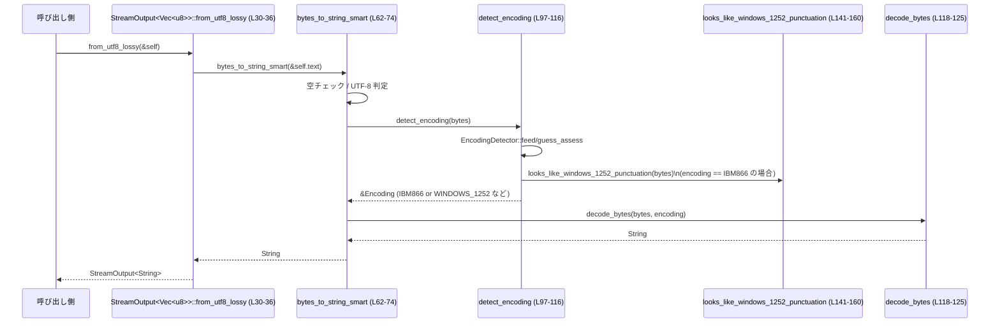

# protocol/src/exec_output.rs コード解説

## 0. ざっくり一言

外部コマンド実行の標準出力・標準エラーなどの **バイト列を UTF-8 文字列に変換するためのユーティリティ** と、  
その結果をまとめる **実行結果コンテナ型** を提供するモジュールです  
（protocol/src/exec_output.rs:L1-7, L15-19, L39-47, L62-74）。

---

## 1. このモジュールの役割

### 1.1 概要

このモジュールは、VS Code などから実行したシェルコマンドの出力で頻出する **レガシー文字コード（CP1251, CP866 等）** を扱う際に、

- `chardetng` でエンコーディングを推定し  
- `encoding_rs` で UTF-8 へデコードし  
- それでも失敗した場合は `String::from_utf8_lossy` でロスを許容して変換する  

という **ベストエフォートな文字コード変換** を実現します  
（protocol/src/exec_output.rs:L1-7, L62-74, L97-125）。

あわせて、外部ツール呼び出しの結果をまとめる `ExecToolCallOutput` 型を提供します  
（protocol/src/exec_output.rs:L39-47）。

### 1.2 アーキテクチャ内での位置づけ

このモジュールは、主に次の役割を担います。

- **変換ロジック**: `bytes_to_string_smart` と内部ヘルパー（`detect_encoding`, `decode_bytes` など）が、バイト列 → UTF-8 文字列の変換を担当  
  （protocol/src/exec_output.rs:L62-74, L97-125, L141-165）。
- **ストリーム出力ラッパー**: `StreamOutput<T>` がテキストと「何行で切り詰めたか」の情報を保持  
  （protocol/src/exec_output.rs:L15-19）。
- **外部ツール結果のコンテナ**: `ExecToolCallOutput` が exit code / stdout / stderr / 実行時間などを集約  
  （protocol/src/exec_output.rs:L39-47, L49-59）。

依存関係を簡略化した図は次のとおりです。



- 実行結果を保持するコード（`ExecToolCallOutput`）と、エンコーディング検出ロジックが同じモジュールにまとまっています。
- 実際の「外部コマンド実行処理」はこのチャンクには現れません（不明）。

### 1.3 設計上のポイント

コードから読み取れる特徴は次のとおりです。

- **汎用ストリーム型 + 特化実装**  
  - `StreamOutput<T>` はジェネリックで定義され（protocol/src/exec_output.rs:L15-19）、  
    `T = String` 用の `new` と `T = Vec<u8>` 用の `from_utf8_lossy` だけ特化実装しています（protocol/src/exec_output.rs:L21-27, L30-36）。
- **検出 → デコード → ロッシー fallback の 3 段階**  
  - UTF-8 ならそのまま（protocol/src/exec_output.rs:L68-70）  
  - そうでなければ `detect_encoding` → `decode_bytes`（protocol/src/exec_output.rs:L72-73）  
  - デコードにエラーがあれば `String::from_utf8_lossy` へフォールバック（protocol/src/exec_output.rs:L119-123）。
- **IBM866 vs Windows-1252 の誤検出対策**  
  - chardetng が IBM866 と誤判定しがちなケースを、`looks_like_windows_1252_punctuation` で検出し、`WINDOWS_1252` に強制します（protocol/src/exec_output.rs:L76-85, L97-116, L141-160）。
- **安全性**  
  - `unsafe` ブロックやインデックス付きアクセスが存在せず（protocol/src/exec_output.rs:L1-169）、  
    すべて標準ライブラリと外部クレートの安全 API だけで実装されています。
- **並行性**  
  - グローバルな可変状態を持たず、関数はいずれも引数のみを読み取り、戻り値を返す純粋関数です（protocol/src/exec_output.rs:L62-125, L141-165）。  
    そのため、このモジュールの関数は複数スレッドから同時に呼び出してもレースコンディションを生じない設計です。

---

## 2. 主要な機能一覧（コンポーネントインベントリー）

このモジュールで確認できる主なコンポーネントと役割です。

### 型・定数

| 名前 | 種別 | 役割 / 用途 | 定義位置 |
|------|------|------------|----------|
| `StreamOutput<T>` | 構造体（ジェネリック） | テキスト（またはバイト列）と、行数による切り詰め情報を保持するコンテナ | protocol/src/exec_output.rs:L15-19 |
| `ExecToolCallOutput` | 構造体 | 外部ツール実行の exit code / stdout / stderr / 集約出力 / 実行時間 / タイムアウト情報を保持 | protocol/src/exec_output.rs:L39-47 |
| `WINDOWS_1252_PUNCT_BYTES` | 定数 | Windows-1252 における「スマート引用符・ダッシュ・TM 記号」のバイト値のリスト | protocol/src/exec_output.rs:L86-95 |

### 関数・メソッド

| 名前 | 種別 | 公開/非公開 | 役割 / 用途 | 定義位置 |
|------|------|------------|------------|----------|
| `StreamOutput<String>::new` | 関連関数 | 公開 | 文字列用 `StreamOutput` のコンストラクタ。`truncated_after_lines` を `None` に初期化 | protocol/src/exec_output.rs:L21-27 |
| `StreamOutput<Vec<u8>>::from_utf8_lossy` | メソッド | 公開 | バイト列用 `StreamOutput` を、エンコーディング検出付きで UTF-8 文字列へ変換した `StreamOutput<String>` に変換 | protocol/src/exec_output.rs:L30-36 |
| `ExecToolCallOutput::default` | 関連関数（`Default` 実装） | 公開（`Default` 経由） | すべてのフィールドを「空」や 0 にした実行結果を生成 | protocol/src/exec_output.rs:L49-59 |
| `bytes_to_string_smart` | 関数 | 公開 | バイト列を UTF-8 に変換する。UTF-8 判定 → chardetng で推定 → encoding_rs でデコード → ロッシー fallback の順で実行 | protocol/src/exec_output.rs:L62-74 |
| `detect_encoding` | 関数 | 非公開 | `EncodingDetector` を用いて入力バイト列のエンコーディングを推定。IBM866 誤検出の一部を Windows-1252 に置き換え | protocol/src/exec_output.rs:L97-116 |
| `decode_bytes` | 関数 | 非公開 | 指定エンコーディングでデコードし、エラーがあれば `from_utf8_lossy` にフォールバック | protocol/src/exec_output.rs:L118-125 |
| `looks_like_windows_1252_punctuation` | 関数 | 非公開 | バイト列が「Windows-1252 のスマート句読点 + ASCII 文字」パターンに見えるかを判定 | protocol/src/exec_output.rs:L128-160 |
| `is_windows_1252_punct` | 関数 | 非公開 | 単一バイトが `WINDOWS_1252_PUNCT_BYTES` のいずれかかを判定 | protocol/src/exec_output.rs:L163-164 |

---

## 3. 公開 API と詳細解説

### 3.1 型一覧（構造体）

| 名前 | 種別 | フィールド | 役割 / 用途 | 定義位置 |
|------|------|-----------|------------|----------|
| `StreamOutput<T: Clone>` | 構造体 | `text: T`, `truncated_after_lines: Option<u32>` | 出力テキスト（またはバイト列）と「何行目以降が切り捨てられたか」を保持する汎用コンテナ | protocol/src/exec_output.rs:L15-19 |
| `ExecToolCallOutput` | 構造体 | `exit_code: i32`, `stdout: StreamOutput<String>`, `stderr: StreamOutput<String>`, `aggregated_output: StreamOutput<String>`, `duration: Duration`, `timed_out: bool` | 1 回の外部ツール呼び出しの結果をまとめて保持 | protocol/src/exec_output.rs:L39-47 |

#### `StreamOutput<T>`

- ジェネリック型で、`T` が `Clone` であることだけを要求します（protocol/src/exec_output.rs:L15）。
- フィールド:
  - `text: T` — 出力内容本体（文字列またはバイト列）（protocol/src/exec_output.rs:L17）。
  - `truncated_after_lines: Option<u32>` — `Some(n)` なら「n 行後で切り捨てられた」ことを表すメタ情報（protocol/src/exec_output.rs:L18）。

#### `ExecToolCallOutput`

- `Clone` と `Debug` を derive しており、値コピーやデバッグ出力に向いています（protocol/src/exec_output.rs:L39）。
- フィールドの意味:
  - `exit_code`: プロセス終了コード（protocol/src/exec_output.rs:L41）。
  - `stdout`: 標準出力の内容（UTF-8 文字列）（protocol/src/exec_output.rs:L42）。
  - `stderr`: 標準エラー出力の内容（UTF-8 文字列）（protocol/src/exec_output.rs:L43）。
  - `aggregated_output`: stdout + stderr 等をまとめた出力（詳細はこのチャンクでは不明だが、名前から集約出力と推測できます）（protocol/src/exec_output.rs:L44）。
  - `duration`: 実行にかかった時間（protocol/src/exec_output.rs:L45）。
  - `timed_out`: タイムアウトによる終了かどうか（protocol/src/exec_output.rs:L46）。

### 3.2 関数詳細（主要 6 件）

#### `StreamOutput<String>::new(text: String) -> StreamOutput<String>`

**概要**

`String` 用の `StreamOutput` を生成し、`truncated_after_lines` を `None` に初期化します（protocol/src/exec_output.rs:L21-27）。

**引数**

| 引数名 | 型 | 説明 |
|--------|----|------|
| `text` | `String` | 出力文字列本体 |

**戻り値**

- `StreamOutput<String>`: `text` に与えた文字列を保持し、`truncated_after_lines` は `None` の状態のコンテナです。

**内部処理の流れ**

1. `Self { text, truncated_after_lines: None }` を返すだけのシンプルなコンストラクタです（protocol/src/exec_output.rs:L23-26）。

**Examples（使用例）**

```rust
use std::time::Duration;
// 同一モジュール内または `crate::exec_output` から利用する想定です。
use crate::exec_output::StreamOutput;

fn example_basic_stream_output() {
    // 出力文字列を用意する
    let text = String::from("hello");              // "hello" という UTF-8 文字列

    // StreamOutput<String> を生成する
    let out = StreamOutput::new(text);             // truncated_after_lines は None になる

    // 利用例: text フィールドを参照
    assert_eq!(out.text, "hello");                 // text に元の文字列が入っている
    assert!(out.truncated_after_lines.is_none());  // デフォルトでは切り詰め情報なし
}
```

**Errors / Panics**

- パニックを起こしうる処理は含まれていません（単純な構造体初期化のみ、protocol/src/exec_output.rs:L23-26）。

**Edge cases（エッジケース）**

- `text` が空文字列でもそのまま保持します。特別な処理はありません（protocol/src/exec_output.rs:L23）。

**使用上の注意点**

- `truncated_after_lines` は呼び出し側で意味付けされるフィールドであり、このコンストラクタは常に `None` を設定します。切り詰め行数を管理したい場合は、生成後にフィールドを直接設定する必要があります。

---

#### `StreamOutput<Vec<u8>>::from_utf8_lossy(&self) -> StreamOutput<String>`

**概要**

`StreamOutput<Vec<u8>>` に含まれるバイト列を UTF-8 文字列に変換し、同じ `truncated_after_lines` を持つ `StreamOutput<String>` を返します（protocol/src/exec_output.rs:L30-36）。  
内部では `bytes_to_string_smart` を呼び出し、エンコーディング検出を行います。

**引数**

| 引数名 | 型 | 説明 |
|--------|----|------|
| `&self` | `&StreamOutput<Vec<u8>>` | 出力バイト列と切り詰め情報を含むストリーム |

**戻り値**

- `StreamOutput<String>`: `text` に変換済み UTF-8 文字列を、`truncated_after_lines` に元の値を保持したコンテナ。

**内部処理の流れ**

1. `bytes_to_string_smart(&self.text)` でバイト列を UTF-8 文字列へ変換（protocol/src/exec_output.rs:L33, L62-74）。
2. `StreamOutput { text: ..., truncated_after_lines: self.truncated_after_lines }` を構築して返却（protocol/src/exec_output.rs:L32-35）。

**Examples（使用例）**

```rust
use crate::exec_output::StreamOutput;

fn example_from_utf8_lossy() {
    // CP1252 由来のスマート引用符を含むバイト列（例: “hello”）
    let bytes: Vec<u8> = vec![0x93, b'h', b'e', b'l', b'l', b'o', 0x94];

    // バイト列を持つ StreamOutput を作成
    let raw = StreamOutput {
        text: bytes,
        truncated_after_lines: Some(100), // 例として「100 行以降でトリムされた」とする
    };

    // UTF-8 文字列に変換
    let converted = raw.from_utf8_lossy();

    // 文字列内容とメタデータを確認
    println!("text = {}", converted.text);                  // “hello”（推定に成功した場合）
    assert_eq!(converted.truncated_after_lines, Some(100)); // メタ情報は引き継がれる
}
```

**Errors / Panics**

- 関数自体にはパニック要因はありません（構造体初期化と関数呼び出しのみ、protocol/src/exec_output.rs:L31-35）。
- 内部で呼び出す `bytes_to_string_smart` も、`unsafe` やインデックスアクセスを行っていません（protocol/src/exec_output.rs:L62-74）。

**Edge cases（エッジケース）**

- `self.text` が空ベクタの場合、`bytes_to_string_smart` が空文字列を返します（protocol/src/exec_output.rs:L64-66）。
- 非テキスト（バイナリ）データの場合でも、`String::from_utf8_lossy` にフォールバックするため、UTF-8 として解釈可能な範囲で可視化できます（protocol/src/exec_output.rs:L118-123）。

**使用上の注意点**

- メソッド名は `from_utf8_lossy` ですが、実際にはまず **エンコーディング検出付きの「スマート」変換** を試みます（protocol/src/exec_output.rs:L33, L62-74）。標準ライブラリの `String::from_utf8_lossy` と挙動が完全に一致するわけではありません。
- 変換は不可逆です。エンコーディング判定の結果に依存するため、同じバイト列でも将来のライブラリ更新等により挙動が変わる可能性があります（`chardetng`, `encoding_rs` の挙動に依存）。

---

#### `ExecToolCallOutput::default() -> ExecToolCallOutput`

**概要**

`Default` 実装を通じて、すべてのフィールドを「空」や 0 で初期化した `ExecToolCallOutput` を生成します（protocol/src/exec_output.rs:L49-59）。

**引数**

- なし。

**戻り値**

- `ExecToolCallOutput`:
  - `exit_code: 0`
  - `stdout`, `stderr`, `aggregated_output`: 空文字列の `StreamOutput<String>`（`truncated_after_lines = None`）
  - `duration: Duration::ZERO`
  - `timed_out: false`  
  （protocol/src/exec_output.rs:L51-58）

**内部処理の流れ**

1. `exit_code` を 0 に設定（protocol/src/exec_output.rs:L52）。
2. 各出力を `StreamOutput::new(String::new())` で空文字列に設定（protocol/src/exec_output.rs:L53-55）。
3. `duration` に `Duration::ZERO` を設定（protocol/src/exec_output.rs:L56）。
4. `timed_out` を `false` に設定（protocol/src/exec_output.rs:L57）。

**Examples（使用例）**

```rust
use crate::exec_output::ExecToolCallOutput;

fn example_default_exec_output() {
    let output = ExecToolCallOutput::default(); // デフォルト値を生成

    assert_eq!(output.exit_code, 0);                     // 成功扱いの終了コード
    assert!(output.stdout.text.is_empty());              // 標準出力は空
    assert!(output.stderr.text.is_empty());              // 標準エラーも空
    assert!(output.aggregated_output.text.is_empty());   // 集約出力も空
    assert_eq!(output.duration, std::time::Duration::ZERO);
    assert!(!output.timed_out);                          // タイムアウトは発生していない
}
```

**Errors / Panics**

- パニック要因はありません（リテラルと `StreamOutput::new` の呼び出しのみ、protocol/src/exec_output.rs:L51-58）。

**Edge cases**

- 特に複雑な条件分岐はなく、常に同一の初期値が返されます。

**使用上の注意点**

- 実際の実行結果を表現するには、各フィールドを上書きする必要があります。  
  `Default` を「初期値」や「エラー時のプレースホルダ」として使うかどうかは、呼び出し側の設計に依存します。

---

#### `bytes_to_string_smart(bytes: &[u8]) -> String`

**概要**

任意のバイト列を UTF-8 文字列に変換するユーティリティです。  
以下の順に処理します（protocol/src/exec_output.rs:L62-74）。

1. 空なら空文字列を返す。
2. UTF-8 として解釈できるなら、そのまま `String` に変換。
3. それ以外は `detect_encoding` でエンコーディング推定 → `decode_bytes` でデコード。

**引数**

| 引数名 | 型 | 説明 |
|--------|----|------|
| `bytes` | `&[u8]` | 変換対象のバイト列 |

**戻り値**

- `String`: UTF-8 文字列。判別不能・デコードエラーの場合は `String::from_utf8_lossy` によるロッシーな結果（protocol/src/exec_output.rs:L118-123）。

**内部処理の流れ**

1. 空チェック: `bytes.is_empty()` なら `String::new()` を返す（protocol/src/exec_output.rs:L64-66）。
2. UTF-8 判定:
   - `std::str::from_utf8(bytes)` を試み、成功 (`Ok`) なら `to_owned()` で `String` に変換して返す（protocol/src/exec_output.rs:L68-70）。
3. エンコーディング推定:
   - `let encoding = detect_encoding(bytes);` で推定（protocol/src/exec_output.rs:L72）。
4. デコード:
   - `decode_bytes(bytes, encoding)` で実際に文字列へ変換（protocol/src/exec_output.rs:L73）。

**Examples（使用例）**

```rust
use crate::exec_output::bytes_to_string_smart;

fn example_bytes_to_string_smart() {
    // UTF-8 の "hello"
    let utf8_bytes = b"hello";
    let s1 = bytes_to_string_smart(utf8_bytes);
    assert_eq!(s1, "hello");

    // CP1252 の “hello”（スマート引用符）
    let cp1252_bytes: &[u8] = &[0x93, b'h', b'e', b'l', b'l', b'o', 0x94];
    let s2 = bytes_to_string_smart(cp1252_bytes);
    // IBM866 誤検出対策が効いた場合、期待されるスマート引用符としてデコードされる
    println!("Decoded: {}", s2);
}
```

**Errors / Panics**

- 関数内には `unwrap` などのパニックを起こしうる呼び出しはなく、安全な標準ライブラリ・外部クレート API のみを利用しています（protocol/src/exec_output.rs:L62-74）。
- 想定外のバイト列であっても、最終的に `String::from_utf8_lossy` にフォールバックするため、パニックには至りません（protocol/src/exec_output.rs:L118-123）。

**Edge cases（エッジケース）**

- **空スライス**: `bytes.is_empty()` → 空文字列 (`""`) を返す（protocol/src/exec_output.rs:L64-66）。
- **部分的に壊れた UTF-8**: UTF-8 判定に失敗した場合、検出されたエンコーディングでのデコード → エラーならロッシー UTF-8 へフォールバック（protocol/src/exec_output.rs:L68-73, L118-123）。
- **バイナリデータ**:
  - エンコーディング推定が任意の文字コードを選びうるため、**人間には意味のない文字列** になる場合があります。
  - デコードエラーが発生すると、`from_utf8_lossy` が Unicode 置換文字（`�`）を使用します（標準ライブラリの仕様）。

**使用上の注意点**

- この関数は **出力を常に UTF-8 にしますが、内容が正しいかどうかは保証しません**。用途はあくまで「ログや UI で読める形に整形する」ことです。
- エンコーディング推定はヒューリスティックであり、悪意ある入力に対するセキュリティ機構ではありません。  
  例: 特定エンコーディングでのバイト列を別エンコーディングと誤認して表示させることで、ユーザに誤った内容を見せることは理論的には可能です（一般的な文字コード処理の問題）。

---

#### `detect_encoding(bytes: &[u8]) -> &'static Encoding`

**概要**

`chardetng::EncodingDetector` を用いてバイト列のエンコーディングを推定し、一部の IBM866 誤検出を Windows-1252 に補正します（protocol/src/exec_output.rs:L97-116）。

**引数**

| 引数名 | 型 | 説明 |
|--------|----|------|
| `bytes` | `&[u8]` | 推定対象のバイト列 |

**戻り値**

- `&'static Encoding`: 推定されたエンコーディング（または IBM866 → Windows-1252 に補正されたもの）。

**内部処理の流れ**

1. `EncodingDetector::new()` で検出器を生成（protocol/src/exec_output.rs:L98）。
2. `detector.feed(bytes, true)` で全バイト列を検出器に入力（protocol/src/exec_output.rs:L99）。
3. `detector.guess_assess(None, true)` でエンコーディングを推定し、`encoding` を取得（protocol/src/exec_output.rs:L100）。
4. 補正ロジック:
   - `if encoding == IBM866 && looks_like_windows_1252_punctuation(bytes)` なら `WINDOWS_1252` を返す（protocol/src/exec_output.rs:L111-112, L141-160）。
   - それ以外は `encoding` をそのまま返す（protocol/src/exec_output.rs:L115）。

**Examples（使用例）**

内部関数のため、直接呼び出すのではなく `bytes_to_string_smart` 経由で使われる前提です（protocol/src/exec_output.rs:L72）。

**Errors / Panics**

- `EncodingDetector::new`, `feed`, `guess_assess` によるパニック要因はコード上明示されておらず、この関数内には `unwrap` や `panic!` は存在しません（protocol/src/exec_output.rs:L97-116）。

**Edge cases**

- `bytes` が空の場合も `feed` は呼び出されますが、`bytes_to_string_smart` 側で空チェックを行っているため、通常この関数は空スライスに対しては呼ばれません（protocol/src/exec_output.rs:L64-66, L72）。
- 対象が IBM866 と判定されても、`looks_like_windows_1252_punctuation` が `false` を返す場合は補正されません。

**使用上の注意点**

- 「IBM866 と Windows-1252 の衝突」に特化した補正のみ行っています。他のエンコーディング間の誤検出はそのままになります（protocol/src/exec_output.rs:L76-85, L102-110）。
- 補正条件は `looks_like_windows_1252_punctuation` の判定ロジックに依存しているため、挙動を変更したい場合はそちらも含めて理解・修正する必要があります。

---

#### `decode_bytes(bytes: &[u8], encoding: &'static Encoding) -> String`

**概要**

指定されたエンコーディングでバイト列をデコードし、エラーがあれば UTF-8 ロッシー変換にフォールバックします（protocol/src/exec_output.rs:L118-125）。

**引数**

| 引数名 | 型 | 説明 |
|--------|----|------|
| `bytes` | `&[u8]` | デコード対象のバイト列 |
| `encoding` | `&'static Encoding` | 利用するエンコーディング |

**戻り値**

- `String`: 正常にデコードできた場合はその結果、エラーがあれば `String::from_utf8_lossy(bytes)` の結果。

**内部処理の流れ**

1. `encoding.decode(bytes)` を呼び出し、`(decoded, _, had_errors)` を受け取る（protocol/src/exec_output.rs:L119）。
   - `decoded` は `Cow<str>`（コピーオンライトの文字列）。
   - `_` は実際に使われたエンコーディング（BOM 等で変わる可能性）だが、ここでは無視。
   - `had_errors` はデコードエラー発生有無。
2. `had_errors` が `true` なら `String::from_utf8_lossy(bytes).into_owned()` を返す（protocol/src/exec_output.rs:L121-123）。
3. `false` なら `decoded.into_owned()` で `String` に変換して返す（protocol/src/exec_output.rs:L125）。

**Examples（使用例）**

内部関数であり、通常は `bytes_to_string_smart` を通じて使用されます（protocol/src/exec_output.rs:L72-73）。

**Errors / Panics**

- パニック要因は明示されておらず、`unwrap` なども使っていません（protocol/src/exec_output.rs:L118-125）。

**Edge cases**

- 指定エンコーディングと実際のデータが一致しない場合:
  - `encoding.decode` がエラーを検出すればロッシー UTF-8 にフォールバックします。
  - エラーとみなさずに「別の意味の文字」として解釈される場合もあり、その場合は `had_errors = false` となり、ロスなく（ただし意味が異なる可能性がある）文字列が返されます。

**使用上の注意点**

- エンコーディング指定の妥当性は呼び出し側（`detect_encoding`）に委ねられています。
- セキュリティ観点では、誤ったエンコーディングでのデコードは **内容の誤表示** を招き得ますが、この関数の責務はあくまで「与えられたエンコーディングでデコードすること」です。

---

#### `looks_like_windows_1252_punctuation(bytes: &[u8]) -> bool`

**概要**

バイト列が「Windows-1252 のスマート句読点（0x80–0x9F の一部）と ASCII 文字の組み合わせ」らしく見えるかどうかを判定します（protocol/src/exec_output.rs:L128-160）。  
`detect_encoding` が IBM866 と判定した場合に限り、この関数が `true` のとき Windows-1252 に補正されます（protocol/src/exec_output.rs:L111-112）。

**引数**

| 引数名 | 型 | 説明 |
|--------|----|------|
| `bytes` | `&[u8]` | 判定対象のバイト列 |

**戻り値**

- `bool`: Windows-1252 のスマート句読点 + ASCII 文字らしいなら `true`、それ以外は `false`。

**内部処理の流れ**

1. `saw_extended_punctuation`（スマート句読点を見つけたか）と `saw_ascii_word`（ASCII 英字を見つけたか）を `false` で初期化（protocol/src/exec_output.rs:L142-143）。
2. 各バイト `byte` についてループ（protocol/src/exec_output.rs:L145-158）。
   - `byte >= 0xA0` なら即座に `false` を返す（問題範囲外の拡張文字が含まれているため、protocol/src/exec_output.rs:L146-147）。
   - `0x80..=0x9F` に含まれる場合:
     - `is_windows_1252_punct(byte)` が `false` なら `false` を返す（許可されていない値のため、protocol/src/exec_output.rs:L149-152）。
     - それ以外なら `saw_extended_punctuation = true`（protocol/src/exec_output.rs:L153-154）。
   - `byte.is_ascii_alphabetic()` が `true` なら `saw_ascii_word = true`（protocol/src/exec_output.rs:L155-157）。
3. ループ終了後、`saw_extended_punctuation && saw_ascii_word` を返す（protocol/src/exec_output.rs:L160）。

**Examples（使用例）**

内部ヘルパーとしてのみ使用され、直接公開されていません。

**Errors / Panics**

- パニックを起こす可能性のある処理は含まれていません（ループと条件分岐のみ、protocol/src/exec_output.rs:L141-160）。

**Edge cases**

- バイト列に 0xA0 以上の値が 1 つでも含まれていると、即座に `false` になります（protocol/src/exec_output.rs:L146-147）。
- スマート句読点だけ（ASCII 英字なし）の場合や、ASCII 英字だけ（スマート句読点なし）の場合は `false` です（protocol/src/exec_output.rs:L142-143, L160）。
- `WINDOWS_1252_PUNCT_BYTES` 以外の 0x80–0x9F が含まれている場合も `false` になります（protocol/src/exec_output.rs:L149-152）。

**使用上の注意点**

- 判定はあくまでヒューリスティックであり、「Windows-1252 であること」を保証するものではありません。
- コメントにある通り、同様の「バイト値衝突」を持つ別のコードページをサポートする場合は、別の allowlist とテストを追加することが推奨されています（protocol/src/exec_output.rs:L76-85, L128-140）。

---

### 3.3 その他の関数

| 関数名 | 役割（1 行） | 定義位置 |
|--------|--------------|----------|
| `is_windows_1252_punct(byte: u8) -> bool` | 単一バイトが `WINDOWS_1252_PUNCT_BYTES` に含まれているかをチェックするヘルパー関数 | protocol/src/exec_output.rs:L163-164 |

---

## 4. データフロー

### 4.1 バイト列から UTF-8 文字列への変換フロー

外部コマンドから得られたバイト列を、`StreamOutput<Vec<u8>>` → `StreamOutput<String>` → ログや UI へ、という形で利用することが想定されます。  
実際のプロセス実行コードはこのチャンクには現れませんが、型と関数の組み合わせから次のようなフローが読み取れます。



- **安全性**: すべての関数は引数のみを読み取る純粋関数であり、グローバルな可変状態は持ちません（protocol/src/exec_output.rs:L62-125, L141-165）。
- **エラー処理**: デコードエラーは `String::from_utf8_lossy` へフォールバックすることで吸収されます（protocol/src/exec_output.rs:L119-123）。

---

## 5. 使い方（How to Use）

### 5.1 基本的な使用方法

代表的な利用方法として、外部コマンドの標準出力バイト列を UTF-8 文字列に変換し、`ExecToolCallOutput` に格納する例を示します。

```rust
use std::time::Duration;
use crate::exec_output::{StreamOutput, ExecToolCallOutput};

// 外部コマンドから受け取った stdout のバイト列を想定
fn build_exec_output_example(raw_stdout: Vec<u8>, raw_stderr: Vec<u8>) -> ExecToolCallOutput {
    // stdout バイト列を StreamOutput<Vec<u8>> に包む
    let stdout_bytes = StreamOutput {
        text: raw_stdout,              // バイト列そのもの
        truncated_after_lines: None,   // 行数トリム情報（ここでは無し）
    };

    // stderr バイト列も同様に包む
    let stderr_bytes = StreamOutput {
        text: raw_stderr,
        truncated_after_lines: None,
    };

    // UTF-8 文字列に変換（エンコーディング検出付き）
    let stdout_str = stdout_bytes.from_utf8_lossy(); // protocol/src/exec_output.rs:L30-36
    let stderr_str = stderr_bytes.from_utf8_lossy();

    // aggregated_output は単純に stdout + stderr を連結する例
    let aggregated_text = format!("{}{}", stdout_str.text, stderr_str.text);
    let aggregated = StreamOutput::new(aggregated_text); // protocol/src/exec_output.rs:L21-27

    // ExecToolCallOutput にまとめる
    ExecToolCallOutput {
        exit_code: 0,                // 実際の終了コードを設定
        stdout: stdout_str,
        stderr: stderr_str,
        aggregated_output: aggregated,
        duration: Duration::from_secs(1),
        timed_out: false,
    }
}
```

※ 実際の終了コードや `duration`、`timed_out` はプロセス実行ロジック側で設定されます。このチャンクにはその処理は現れません（不明）。

### 5.2 よくある使用パターン

1. **単純なバイト列 → 文字列変換だけを行う**

```rust
use crate::exec_output::bytes_to_string_smart;

fn log_process_output(raw: Vec<u8>) {
    let text = bytes_to_string_smart(&raw);    // protocol/src/exec_output.rs:L62-74
    eprintln!("process output:\n{text}");
}
```

1. **`StreamOutput` でメタ情報も扱う**

```rust
use crate::exec_output::StreamOutput;

fn handle_truncated_output(raw: Vec<u8>, truncated_after: Option<u32>) {
    let output_bytes = StreamOutput {
        text: raw,
        truncated_after_lines: truncated_after, // どこでトリムされたかを伝搬
    };
    let output_text = output_bytes.from_utf8_lossy();

    if let Some(line) = output_text.truncated_after_lines {
        eprintln!("Output was truncated after {line} lines.");
    }
    println!("{}", output_text.text);
}
```

### 5.3 よくある間違い

```rust
use crate::exec_output::bytes_to_string_smart;

fn wrong_usage() {
    let bytes = vec![0x93, b'h', b'i', 0x94];

    // ❌ 間違い例: 所有権を渡そうとして & を付け忘れる
    // let s = bytes_to_string_smart(bytes); // コンパイルエラー: &[u8] が必要

    // ✅ 正しい例: スライス参照を渡す
    let s = bytes_to_string_smart(&bytes);
    println!("{s}");
}
```

- `bytes_to_string_smart` は `&[u8]` を受け取るため、`Vec<u8>` を渡すときは `&vec` や `vec.as_slice()` が必要です（protocol/src/exec_output.rs:L63）。

### 5.4 使用上の注意点（まとめ）

- **ロスレス変換を保証しない**  
  エンコーディング判定や `from_utf8_lossy` によるフォールバックのため、元のバイト列を完全に復元できることは保証されません（protocol/src/exec_output.rs:L118-123）。
- **セキュリティ観点**  
  - このモジュールは **表示用の文字列を「なるべく読める形にする」ためのものであり、入力検証やサニタイズの代替ではありません**。
  - ログや UI に表示する前に、必要に応じて別途エスケープ処理を行う必要があります（このチャンクにはその処理は現れません）。
- **並行性**  
  - すべての関数は副作用を持たず、グローバル可変状態も持たないため、複数スレッドから安全に呼び出せる設計です（protocol/src/exec_output.rs:L62-125, L141-165）。
- **IBM866/Windows-1252 ヒューリスティック**  
  - 特定のバイト列に対して IBM866 → Windows-1252 への補正が行われるため、純粋な IBM866 テキストにスマート句読点と似たパターンが含まれている場合、意図しないデコードになる可能性があります（protocol/src/exec_output.rs:L76-85, L97-116, L141-160）。

---

## 6. 変更の仕方（How to Modify）

### 6.1 新しい機能を追加する場合

1. **別のコードページ衝突への対応**  
   - コメントには「別のコードページで同様の衝突が見つかったら、`WINDOWS_1252_PUNCT` のような専用 allowlist とテストを追加する」と記載されています（protocol/src/exec_output.rs:L76-85, L128-140）。
   - 手順例:
     1. 新しい定数（例: `SOME_ENCODING_PUNCT_BYTES`）を追加（`WINDOWS_1252_PUNCT_BYTES` と同様、protocol/src/exec_output.rs:L86-95 を参考）。
     2. 新しい判定関数（例: `looks_like_some_encoding_punctuation`）を追加（`looks_like_windows_1252_punctuation` を参考、protocol/src/exec_output.rs:L141-160）。
     3. `detect_encoding` 内で、IBM866 の補正と同様に条件分岐を挿入（protocol/src/exec_output.rs:L111-115）。
     4. `exec_output_tests.rs` に実際のシェル出力に基づくテストケースを追加（テスト内容はこのチャンクには現れませんが、パス指定から存在が推測されます、protocol/src/exec_output.rs:L167-169）。

2. **出力メタ情報の追加**  
   - `ExecToolCallOutput` に新しいフィールドを追加する場合:
     - 構造体定義（protocol/src/exec_output.rs:L39-47）にフィールドを追加。
     - `Default` 実装（protocol/src/exec_output.rs:L49-59）にも初期値を追加する必要があります。

### 6.2 既存の機能を変更する場合

- **bytes_to_string_smart の振る舞い変更**
  - 影響範囲:
    - `StreamOutput<Vec<u8>>::from_utf8_lossy`（protocol/src/exec_output.rs:L30-36）が直接依存。
    - 他のモジュールから `bytes_to_string_smart` を直接呼んでいる可能性も高い（公開関数のため、protocol/src/exec_output.rs:L63）。
  - 注意点:
    - ログや UI の文字化け・表示結果が変わるため、変更前後での表示比較テストが必要です。
    - 新しいエンコーディングを導入する場合は、誤検出の可能性や既存ヒューリスティックとの相性を検証します。

- **IBM866/Windows-1252 ヒューリスティックの変更**
  - `looks_like_windows_1252_punctuation` のロジックを変えると、実際のユーザ環境での表示に直接影響します（protocol/src/exec_output.rs:L141-160）。
  - コメントにある通り、「実際のシェル出力サンプル」をテストとして追加することが推奨されます（protocol/src/exec_output.rs:L76-85, L128-140）。

- **契約・前提条件の確認**
  - ほとんどの関数は「どのようなバイト列でも受け取る」設計になっており、前提条件は緩いです。
  - その分、「入力によっては意味のない文字列になる」ことを受容する契約になっています。この契約を変更（例: デコードに失敗したら `Result` でエラーを返す）する場合は、API 全体のデザイン見直しが必要です。

---

## 7. 関連ファイル

| パス | 役割 / 関係 |
|------|------------|
| `protocol/src/exec_output_tests.rs` | `#[path = "exec_output_tests.rs"] mod tests;` で参照されているテストモジュール。`bytes_to_string_smart` や IBM866/Windows-1252 ヒューリスティックの挙動確認テストが置かれていると推測されます（内容はこのチャンクには現れません、protocol/src/exec_output.rs:L167-169）。 |
| `chardetng` クレート | `EncodingDetector` を提供し、エンコーディング推定に利用されます（protocol/src/exec_output.rs:L9, L97-100）。 |
| `encoding_rs` クレート | `Encoding`, `IBM866`, `WINDOWS_1252` などを提供し、実際のデコードと特定エンコーディングの指定に使用されます（protocol/src/exec_output.rs:L10-12, L97-100, L118-119）。 |

このモジュールは、外部コマンド実行ロジックやログ出力ロジックと組み合わせて使われることが想定されますが、それらのコードはこのチャンクには現れていません（不明）。
